# miki RHI Barrier 使用示例

## 渲染管线 Barrier 示例

### 1. 渲染目标初始化

```cpp
// 从 Undefined 转换到 ColorAttachment，准备渲染
TextureBarrierDesc toRender{};
toRender.srcStage = PipelineStage::ColorAttachmentOutput;  // 等待 acquire
toRender.dstStage = PipelineStage::ColorAttachmentOutput;  // 渲染阶段
toRender.srcAccess = AccessFlags::None;                    // 之前无访问
toRender.dstAccess = AccessFlags::ColorAttachmentWrite;     // 准备写入
toRender.oldLayout = TextureLayout::Undefined;             // 丢弃旧内容
toRender.newLayout = TextureLayout::ColorAttachment;       // 渲染布局
```

> 这个 Barrier 确保在开始写入颜色附件之前，任何之前的图像获取操作（如 swapchain acquire）已经完成。通常用于每帧渲染开始时，将 swapchain 图像从未定义状态转换为适合渲染的布局，srcStage 设置为 ColorAttachmentOutput 是为了等待 present/acquire 操作，dstStage 设置为相同阶段因为接下来要执行渲染操作。

### 2. 深度缓冲初始化

```cpp
// 深度缓冲从 Undefined 转换到 DepthStencilAttachment
TextureBarrierDesc depthInit{};
depthInit.srcStage = PipelineStage::TopOfPipe;               // 管道开始
depthInit.dstStage = PipelineStage::EarlyFragmentTests;     // 早期深度测试
depthInit.srcAccess = AccessFlags::None;                     // 之前无访问
depthInit.dstAccess = AccessFlags::DepthStencilWrite;        // 准备深度写入
depthInit.oldLayout = TextureLayout::Undefined;              // 丢弃旧内容
depthInit.newLayout = TextureLayout::DepthStencilAttachment; // 深度布局
depthInit.subresource.aspect = TextureAspect::Depth;         // 深度 aspect
```

> 深度缓冲初始化 Barrier 确保深度纹理从未定义状态正确转换为深度附件布局。由于深度缓冲通常是新创建或每帧重新创建，使用 Undefined layout 丢弃之前的内容。dstStage 设置为 EarlyFragmentTests 因为深度测试在片段着色器之前开始，需要确保深度缓冲已准备好接收写入操作。

### 3. 渲染完成到呈现

```cpp
// 渲染完成后转换为 Present 布局
TextureBarrierDesc toPresent{};
toPresent.srcStage = PipelineStage::ColorAttachmentOutput;  // 渲染完成
toPresent.dstStage = PipelineStage::BottomOfPipe;           // 等待所有操作
toPresent.srcAccess = AccessFlags::ColorAttachmentWrite;     // 等待颜色写入
toPresent.dstAccess = AccessFlags::None;                     // 呈现无需特殊访问
toPresent.oldLayout = TextureLayout::ColorAttachment;       // 从渲染布局
toPresent.newLayout = TextureLayout::Present;               // 转为呈现布局
```

> 渲染完成到呈现的 Barrier 确保所有颜色写入操作完成后，才能将图像转换为呈现布局。srcStage 设置为 ColorAttachmentOutput 因为这是颜色写入的最后阶段，srcAccess 设置为 ColorAttachmentWrite 确保写入操作完成。dstStage 使用 BottomOfPipe 确保在呈现前所有 GPU 操作都已完成，避免呈现不完整的图像。

### 4. 纹理从渲染到着色器读取

```cpp
// 渲染完成后转换为 ShaderReadOnly 供后续着色器采样
TextureBarrierDesc renderToShader{};
renderToShader.srcStage = PipelineStage::ColorAttachmentOutput;  // 渲染完成
renderToShader.dstStage = PipelineStage::FragmentShader;         // 片段着色器采样
renderToShader.srcAccess = AccessFlags::ColorAttachmentWrite;    // 等待渲染写入
renderToShader.dstAccess = AccessFlags::ShaderRead;              // 准备着色器读取
renderToShader.oldLayout = TextureLayout::ColorAttachment;       // 从渲染布局
renderToShader.newLayout = TextureLayout::ShaderReadOnly;        // 转为只读布局
```

> 这个 Barrier 用于渲染到纹理（Render-to-Texture）技术，确保渲染完成后，其他着色器可以安全地采样该纹理。关键在于等待 ColorAttachmentOutput 阶段的写入完成，然后转换为 ShaderReadOnly 布局优化着色器访问性能。常用于延迟渲染、屏幕空间反射等技术中，将前一帧的渲染结果作为当前帧的输入。

### 5. 计算着色器写入到图形读取

```cpp
// 计算着色器完成后图形着色器读取
TextureBarrierDesc computeToGraphics{};
computeToGraphics.srcStage = PipelineStage::ComputeShader;        // 计算完成
computeToGraphics.dstStage = PipelineStage::VertexShader;        // 顶点着色器读取
computeToGraphics.srcAccess = AccessFlags::ShaderWrite;          // 等待计算写入
computeToGraphics.dstAccess = AccessFlags::ShaderRead;           // 准备顶点读取
computeToGraphics.oldLayout = TextureLayout::General;             // 计算着色器布局
computeToGraphics.newLayout = TextureLayout::ShaderReadOnly;      // 只读布局
```

> 计算着色器到图形着色器的同步 Barrier，确保计算着色器对纹理的修改完成后，图形着色器才能读取。常用于 GPU 驱动的粒子系统、程序化生成内容、或计算着色器预处理顶点数据等场景。使用 General layout 因为计算着色器可能需要随机读写访问，转换为 ShaderReadOnly 优化图形着色器的采样性能。

### 6. 顶点缓冲上传到顶点输入

```cpp
// 顶点缓冲从传输转换为顶点输入
BufferBarrierDesc vertexUpload{};
vertexUpload.srcStage = PipelineStage::Transfer;              // 传输完成
vertexUpload.dstStage = PipelineStage::VertexInput;           // 顶点输入
vertexUpload.srcAccess = AccessFlags::TransferWrite;           // 等待传输写入
vertexUpload.dstAccess = AccessFlags::VertexAttributeRead;     // 准备顶点读取
vertexUpload.offset = 0;                                      // 缓冲区开始
vertexUpload.size = kWholeSize;                               // 整个缓冲区
```

> 顶点缓冲上传 Barrier 确保数据从 CPU 传输到 GPU 完成后，顶点着色器才能读取顶点数据。srcStage 设置为 Transfer 因为这是数据上传阶段，srcAccess 为 TransferWrite 等待传输操作完成。dstStage 和 dstAccess 设置为顶点输入相关的阶段和访问类型，确保顶点着色器能正确读取上传的顶点数据。

### 7. 索引缓冲上传到顶点输入

```cpp
// 索引缓冲从传输转换为顶点输入
BufferBarrierDesc indexUpload{};
indexUpload.srcStage = PipelineStage::Transfer;               // 传输完成
indexUpload.dstStage = PipelineStage::VertexInput;            // 顶点输入
indexUpload.srcAccess = AccessFlags::TransferWrite;            // 等待传输写入
indexUpload.dstAccess = AccessFlags::IndexRead;               // 准备索引读取
indexUpload.offset = 0;                                       // 缓冲区开始
indexUpload.size = kWholeSize;                                // 整个缓冲区
```

> 索引缓冲上传 Barrier 与顶点缓冲类似，但专门针对索引数据的同步。确保索引数据从传输操作完成后，GPU 的顶点输入阶段才能读取索引进行绘制。dstAccess 使用 IndexRead 而不是 VertexAttributeRead，因为这是针对索引缓冲的特定访问类型，确保索引绘制的正确性。

### 8. Uniform 缓冲更新到着色器读取

```cpp
// Uniform 缓冲从 Host 写入到着色器读取
BufferBarrierDesc uniformUpdate{};
uniformUpdate.srcStage = PipelineStage::Host;                 // CPU 写入完成
uniformUpdate.dstStage = PipelineStage::VertexShader;          // 顶点着色器
uniformUpdate.srcAccess = AccessFlags::HostWrite;              // 等待 CPU 写入
uniformUpdate.dstAccess = AccessFlags::UniformRead;           // 准备着色器读取
uniformUpdate.offset = 0;                                     // 缓冲区开始
uniformUpdate.size = kWholeSize;                              // 整个缓冲区
```

> Uniform 缓冲更新 Barrier 确保 CPU 对 Uniform 缓冲的写入完成后，GPU 着色器才能读取这些数据。srcStage 使用 Host 因为这是 CPU 端操作，srcAccess 为 HostWrite 等待 CPU 写入完成。常用于每帧更新变换矩阵、材质参数等动态 Uniform 数据，确保着色器读取到的是最新的数据。

### 9. 深度缓冲只读采样

```cpp
// 深度缓冲从写入转换为只读采样
TextureBarrierDesc depthToRead{};
depthToRead.srcStage = PipelineStage::LateFragmentTests;      // 深度写入完成
depthToRead.dstStage = PipelineStage::FragmentShader;         // 片段着色器采样
depthToRead.srcAccess = AccessFlags::DepthStencilWrite;       // 等待深度写入
depthToRead.dstAccess = AccessFlags::ShaderRead;               // 准备着色器读取
depthToRead.oldLayout = TextureLayout::DepthStencilAttachment; // 从深度布局
depthToRead.newLayout = TextureLayout::DepthStencilReadOnly;   // 只读深度布局
depthToRead.subresource.aspect = TextureAspect::Depth;        // 深度 aspect
```

> 深度缓冲只读采样 Barrier 用于将深度缓冲从写入状态转换为只读状态，供着色器采样深度值。常用于延迟渲染中的深度重建、屏幕空间环境光遮蔽、或深度感知的后期处理效果。关键在于等待 LateFragmentTests 阶段的深度写入完成，然后转换为 DepthStencilReadOnly 布局优化着色器采样性能。

### 10. 模板缓冲写入到读取

```cpp
// 模板缓冲从写入转换为读取
TextureBarrierDesc stencilToRead{};
stencilToRead.srcStage = PipelineStage::LateFragmentTests;     // 模板写入完成
stencilToRead.dstStage = PipelineStage::FragmentShader;        // 片段着色器读取
stencilToRead.srcAccess = AccessFlags::DepthStencilWrite;      // 等待模板写入
stencilToRead.dstAccess = AccessFlags::ShaderRead;              // 准备着色器读取
stencilToRead.oldLayout = TextureLayout::DepthStencilAttachment; // 从模板布局
stencilToRead.newLayout = TextureLayout::DepthStencilReadOnly;   // 只读模板布局
stencilToRead.subresource.aspect = TextureAspect::Stencil;      // 模板 aspect
```

> 模板缓冲读写 Barrier 用于模板测试完成后，将模板缓冲转换为着色器可读取的状态。常用于轮廓渲染、模板阴影体、或需要读取模板值进行自定义逻辑的效果。使用 Stencil aspect 确保只对模板部分进行操作，不影响深度数据，转换为只读布局后着色器可以通过纹理采样读取模板值。

### 11. 多目标渲染同步

```cpp
// 多个渲染目标之间的同步
TextureBarrierDesc mrtSync{};
mrtSync.srcStage = PipelineStage::ColorAttachmentOutput;       // 渲染完成
mrtSync.dstStage = PipelineStage::ColorAttachmentOutput;       // 下一次渲染
mrtSync.srcAccess = AccessFlags::ColorAttachmentWrite;         // 等待写入
mrtSync.dstAccess = AccessFlags::ColorAttachmentRead;           // 准备读取
mrtSync.oldLayout = TextureLayout::ColorAttachment;            // 保持渲染布局
mrtSync.newLayout = TextureLayout::ColorAttachment;             // 保持渲染布局
```

> 多目标渲染（MRT）同步 Barrier 确保在多个渲染目标之间进行渲染传递时，前一次渲染的写入完成后，下一次渲染才能读取这些目标。常用于延迟渲染的 G-Buffer 构建过程，确保每个 G-Buffer 纹理的写入完成后，下一个 pass 才能读取它们。保持 ColorAttachment 布局避免不必要的布局转换开销。

### 12. 生成 Mipmap 链

```cpp
// 生成 Mipmap 时的层级同步
TextureBarrierDesc mipmapGen{};
mipmapGen.srcStage = PipelineStage::Transfer;                   // 传输写入完成
mipmapGen.dstStage = PipelineStage::Transfer;                   // 下一次传输
mipmapGen.srcAccess = AccessFlags::TransferWrite;               // 等待写入
mipmapGen.dstAccess = AccessFlags::TransferRead;                // 准备读取
mipmapGen.oldLayout = TextureLayout::TransferDst;              // 目标布局
mipmapGen.newLayout = TextureLayout::TransferSrc;               // 源布局
mipmapGen.subresource.baseMipLevel = currentLevel;              // 当前层级
mipmapGen.subresource.mipLevelCount = 1;                       // 单层级
```

> 生成 Mipmap 链 Barrier 用于在逐级生成 Mipmap 时同步每个层级的读写操作。每完成一个层级的写入后，需要将其从 TransferDst 转换为 TransferSrc，以便作为下一层级的源数据。subresource 指定具体的层级，确保只对当前处理的 Mipmap 层级进行操作，这种模式常用于纹理加载后的 Mipmap 生成或动态纹理的 Mipmap 更新。

### 13. 解析多重采样

```cpp
// 多重采样解析到单采样
TextureBarrierDesc msaaResolve{};
msaaResolve.srcStage = PipelineStage::ColorAttachmentOutput;    // MSAA 渲染完成
msaaResolve.dstStage = PipelineStage::Transfer;                // 解析操作
msaaResolve.srcAccess = AccessFlags::ColorAttachmentWrite;      // 等待 MSAA 写入
msaaResolve.dstAccess = AccessFlags::TransferRead;             // 准备解析读取
msaaResolve.oldLayout = TextureLayout::ColorAttachment;         // MSAA 布局
msaaResolve.newLayout = TextureLayout::TransferSrc;             // 转换为源
```

> 多重采样解析 Barrier 确保 MSAA 渲染完成后，解析操作才能读取多重采样数据。MSAA 渲染在 ColorAttachmentOutput 阶段完成，需要等待所有采样点的写入完成后，才能进行解析操作。解析操作通常使用 Transfer 阶段，将多个采样点解析为单个像素，常用于抗锯齿渲染的最后步骤。

### 14. 异步计算同步

```cpp
// 异步计算队列到图形队列
TextureBarrierDesc asyncCompute{};
asyncCompute.srcStage = PipelineStage::ComputeShader;          // 计算完成
asyncCompute.dstStage = PipelineStage::FragmentShader;         // 图形使用
asyncCompute.srcAccess = AccessFlags::ShaderWrite;             // 等待计算写入
asyncCompute.dstAccess = AccessFlags::ShaderRead;              // 准备图形读取
asyncCompute.oldLayout = TextureLayout::General;                // 计算布局
asyncCompute.newLayout = TextureLayout::ShaderReadOnly;         // 只读布局
asyncCompute.srcQueue = QueueType::Compute;                     // 计算队列
asyncCompute.dstQueue = QueueType::Graphics;                    // 图形队列
```

> 异步计算队列同步 Barrier 用于跨队列的资源共享，确保计算队列的操作完成后，图形队列才能使用结果。srcQueue 和 dstQueue 指定不同的队列类型，实现真正的并行计算。常用于 CPU-GPU 异步、计算着色器预处理、或需要利用独立计算队列的场景，提高整体渲染性能。

### 15. 传输队列到图形队列

```cpp
// 传输队列加载纹理到图形队列使用
TextureBarrierDesc transferToGraphics{};
transferToGraphics.srcStage = PipelineStage::Transfer;           // 传输完成
transferToGraphics.dstStage = PipelineStage::FragmentShader;    // 图形采样
transferToGraphics.srcAccess = AccessFlags::TransferWrite;      // 等待传输
transferToGraphics.dstAccess = AccessFlags::ShaderRead;         // 准备采样
transferToGraphics.oldLayout = TextureLayout::TransferDst;      // 传输目标
transferToGraphics.newLayout = TextureLayout::ShaderReadOnly;   // 只读布局
transferToGraphics.srcQueue = QueueType::Transfer;              // 传输队列
transferToGraphics.dstQueue = QueueType::Graphics;             // 图形队列
```

> 传输队列到图形队列的 Barrier 用于纹理加载流水线，确保专用的传输队列完成纹理数据加载后，图形队列才能使用这些纹理进行渲染。这种跨队列同步可以最大化利用 DMA 引擎进行数据传输，同时不阻塞图形渲染。常用于游戏运行时动态加载纹理资源、流式纹理加载等场景。

### 16. 着色器存储缓冲区同步

```cpp
// 着色器存储缓冲区写入到读取
BufferBarrierDesc ssboSync{};
ssboSync.srcStage = PipelineStage::ComputeShader;              // 计算着色器写入
ssboSync.dstStage = PipelineStage::VertexShader;                // 顶点着色器读取
ssboSync.srcAccess = AccessFlags::ShaderWrite;                   // 等待写入
ssboSync.dstAccess = AccessFlags::ShaderRead;                    // 准备读取
ssboSync.offset = 0;                                            // 缓冲区开始
ssboSync.size = kWholeSize;                                     // 整个缓冲区
```

> 着色器存储缓冲区（SSBO）同步 Barrier 用于计算着色器生成的数据被图形着色器消费的场景。确保计算着色器对缓冲区的修改完成后，顶点着色器或其他图形着色器才能读取这些数据。常用于 GPU 驱动的粒子系统、程序化生成几何体、或计算着色器生成的查找表等，实现完全在 GPU 上的数据处理流水线。

### 17. 间接绘制缓冲区同步

```cpp
// 间接绘制参数缓冲区同步
BufferBarrierDesc indirectSync{};
indirectSync.srcStage = PipelineStage::ComputeShader;           // 计算着色器生成
indirectSync.dstStage = PipelineStage::DrawIndirect;            // 间接绘制使用
indirectSync.srcAccess = AccessFlags::ShaderWrite;               // 等待生成
indirectSync.dstAccess = AccessFlags::IndirectCommandRead;       // 准备读取
indirectSync.offset = 0;                                         // 缓冲区开始
indirectSync.size = kWholeSize;                                  // 整个缓冲区
```

> 间接绘制缓冲区同步 Barrier 确保计算着色器生成的绘制参数完成后，GPU 才能执行间接绘制。计算着色器可以根据视锥剔除、LOD 选择等动态生成绘制命令，然后通过这个 Barrier 确保参数准备就绪。常用于 GPU 驱动的渲染队列、实例化渲染、或复杂的可见性剔除系统，实现完全 GPU 控制的渲染流程。

### 18. 加速结构构建同步

```cpp
// 光线追踪加速结构构建到使用
TextureBarrierDesc accelBuild{};
accelBuild.srcStage = PipelineStage::AccelStructBuild;          // 加速结构构建
accelBuild.dstStage = PipelineStage::RayTracingShader;           // 光线追踪使用
accelBuild.srcAccess = AccessFlags::AccelStructWrite;           // 等待构建
accelBuild.dstAccess = AccessFlags::AccelStructRead;            // 准备读取
accelBuild.oldLayout = TextureLayout::General;                  // 通用布局
accelBuild.newLayout = TextureLayout::General;                  // 保持通用
```

> 光线追踪加速结构构建 Barrier 确保 BVH/TLAS 构建完成后，光线追踪着色器才能使用这些加速结构进行光线相交测试。加速结构构建是计算密集型操作，需要确保完全构建完成后才能进行光线追踪。常用于动态场景、实时光线追踪、或需要更新加速结构的场景，确保光线追踪的正确性和性能。

### 19. 着色率图像同步

```cpp
// 可变速率着色图像同步
TextureBarrierDesc shadingRateSync{};
shadingRateSync.srcStage = PipelineStage::Transfer;             // 传输写入
shadingRateSync.dstStage = PipelineStage::ShadingRateImage;     // 着色率使用
shadingRateSync.srcAccess = AccessFlags::TransferWrite;          // 等待传输
shadingRateSync.dstAccess = AccessFlags::ShadingRateImageRead;    // 准备读取
shadingRateSync.oldLayout = TextureLayout::TransferDst;          // 传输目标
shadingRateSync.newLayout = TextureLayout::ShadingRate;          // 着色率布局
```

> 可变速率着色（VRS）图像同步 Barrier 确保着色率图像数据准备好后，GPU 才能使用它来控制像素着色频率。着色率图像通常由 CPU 或计算着色器生成，指定屏幕不同区域的着色密度。这个 Barrier 确保数据传输完成后，VRS 系统才能正确应用着色率，常用于性能优化、动态分辨率缩放、或基于视觉重要性的着色优化。

### 20. 全局内存屏障

```cpp
// 全局内存操作同步
PipelineBarrierDesc globalMemory{};
globalMemory.srcStage = PipelineStage::AllCommands;              // 所有操作
globalMemory.dstStage = PipelineStage::AllCommands;              // 所有操作
globalMemory.srcAccess = AccessFlags::MemoryWrite;               // 等待写入
globalMemory.dstAccess = AccessFlags::MemoryRead;                // 准备读取
```

> 全局内存屏障用于同步所有内存操作，不针对特定资源。当需要确保之前所有的内存写入操作对后续的所有内存读取操作可见时使用。常用于复杂的渲染场景结束、或需要确保全局内存一致性的关键同步点。虽然性能开销较大，但在某些复杂的多阶段渲染流程中是必需的。

### 21. 顶点缓冲部分更新

```cpp
// 顶点缓冲部分区域更新
BufferBarrierDesc vertexPartial{};
vertexPartial.srcStage = PipelineStage::Transfer;                // 传输完成
vertexPartial.dstStage = PipelineStage::VertexInput;             // 顶点输入
vertexPartial.srcAccess = AccessFlags::TransferWrite;            // 等待写入
vertexPartial.dstAccess = AccessFlags::VertexAttributeRead;      // 准备读取
vertexPartial.offset = dynamicOffset;                             // 动态偏移
vertexPartial.size = updateSize;                                 // 更新大小
```

> 顶点缓冲部分更新 Barrier 用于只更新缓冲区的特定区域，而不是整个缓冲区。通过指定 offset 和 size，只同步实际更新的部分，提高效率。常用于动态几何体、实例化渲染中的实例数据更新、或骨骼动画的顶点数据更新等场景，避免不必要的全缓冲区同步开销。

### 22. 纹理数组层级同步

```cpp
// 纹理数组特定层级同步
TextureBarrierDesc arrayLayer{};
arrayLayer.srcStage = PipelineStage::ColorAttachmentOutput;      // 渲染完成
arrayLayer.dstStage = PipelineStage::FragmentShader;            // 着色器采样
arrayLayer.srcAccess = AccessFlags::ColorAttachmentWrite;        // 等待写入
arrayLayer.dstAccess = AccessFlags::ShaderRead;                  // 准备读取
arrayLayer.oldLayout = TextureLayout::ColorAttachment;            // 渲染布局
arrayLayer.newLayout = TextureLayout::ShaderReadOnly;            // 只读布局
arrayLayer.subresource.baseArrayLayer = targetLayer;             // 目标层级
arrayLayer.subresource.arrayLayerCount = 1;                      // 单层级
```

> 纹理数组层级同步 Barrier 用于只同步纹理数组中的特定层级，而不影响其他层级。通过指定 baseArrayLayer 和 arrayLayerCount，可以精确控制同步范围。常用于纹理图集、立方体贴图的不同面、或纹理数组中不同层的独立渲染，实现更细粒度的并行控制和性能优化。

### 23. 多层级 Mipmap 同步

```cpp
// 多个 Mipmap 层级同时同步
TextureBarrierDesc multiMipmap{};
multiMipmap.srcStage = PipelineStage::Transfer;                  // 传输完成
multiMipmap.dstStage = PipelineStage::FragmentShader;            // 着色器采样
multiMipmap.srcAccess = AccessFlags::TransferWrite;               // 等待写入
multiMipmap.dstAccess = AccessFlags::ShaderRead;                  // 准备读取
multiMipmap.oldLayout = TextureLayout::TransferDst;               // 传输目标
multiMipmap.newLayout = TextureLayout::ShaderReadOnly;            // 只读布局
multiMipmap.subresource.baseMipLevel = 0;                       // 基础层级
multiMipmap.subresource.mipLevelCount = allLevels;               // 所有层级
```

> 多层级 Mipmap 同步 Barrier 用于同时同步纹理的所有 Mipmap 层级，常用于完整纹理加载后的初始同步。通过设置 mipLevelCount 为所有层级数量，一次性完成整个纹理的布局转换。这比逐层同步更高效，适用于纹理完全加载完成后的一次性状态转换，或需要同时访问所有 Mipmap 层级的场景。

### 24. 深度模板分离同步

```cpp
// 深度和模板分别同步
TextureBarrierDesc depthOnly{};
depthOnly.srcStage = PipelineStage::LateFragmentTests;           // 深度写入完成
depthOnly.dstStage = PipelineStage::FragmentShader;              // 着色器采样
depthOnly.srcAccess = AccessFlags::DepthStencilWrite;            // 等待深度写入
depthOnly.dstAccess = AccessFlags::ShaderRead;                   // 准备读取
depthOnly.oldLayout = TextureLayout::DepthStencilAttachment;     // 深度模板布局
depthOnly.newLayout = TextureLayout::DepthStencilReadOnly;       // 只读布局
depthOnly.subresource.aspect = TextureAspect::Depth;             // 仅深度
```

> 深度模板分离同步 Barrier 用于只同步深度部分，不影响模板数据。通过指定 Depth aspect，确保只对深度数据进行操作。常用于只需要深度信息的场景，如深度重建、深度感知的后期处理等，避免不必要的模板数据同步开销，提高性能。

### 25. 模板单独同步

```cpp
// 仅模板部分同步
TextureBarrierDesc stencilOnly{};
stencilOnly.srcStage = PipelineStage::LateFragmentTests;          // 模板写入完成
stencilOnly.dstStage = PipelineStage::FragmentShader;             // 着色器读取
stencilOnly.srcAccess = AccessFlags::DepthStencilWrite;           // 等待模板写入
stencilOnly.dstAccess = AccessFlags::ShaderRead;                  // 准备读取
stencilOnly.oldLayout = TextureLayout::DepthStencilAttachment;    // 深度模板布局
stencilOnly.newLayout = TextureLayout::DepthStencilReadOnly;      // 只读布局
stencilOnly.subresource.aspect = TextureAspect::Stencil;          // 仅模板
```

> 模板单独同步 Barrier 用于只同步模板部分，不影响深度数据。通过指定 Stencil aspect，确保只对模板数据进行操作。常用于轮廓渲染、模板特效、或需要读取模板值的自定义着色器效果，避免深度数据的干扰，实现精确的模板数据控制。

### 26. 深度模板联合同步

```cpp
// 深度和模板联合同步
TextureBarrierDesc depthStencil{};
depthStencil.srcStage = PipelineStage::LateFragmentTests;         // 深度模板写入完成
depthStencil.dstStage = PipelineStage::FragmentShader;            // 着色器采样
depthStencil.srcAccess = AccessFlags::DepthStencilWrite;          // 等待写入
depthStencil.dstAccess = AccessFlags::ShaderRead;                 // 准备读取
depthStencil.oldLayout = TextureLayout::DepthStencilAttachment;    // 深度模板布局
depthStencil.newLayout = TextureLayout::DepthStencilReadOnly;      // 只读布局
depthStencil.subresource.aspect = TextureAspect::DepthStencil;     // 深度模板
```

> 深度模板联合同步 Barrier 用于同时同步深度和模板数据，通过指定 DepthStencil aspect 确保两者都被处理。常用于需要同时访问深度和模板信息的场景，如完整的深度模板重建、或需要同时读取两种数据的后期处理效果，确保深度模板数据的一致性。

### 27. 顶点缓冲流式加载

```cpp
// 顶点缓冲流式加载同步
BufferBarrierDesc streamVertex{};
streamVertex.srcStage = PipelineStage::Transfer;                  // 流式传输
streamVertex.dstStage = PipelineStage::VertexInput;               // 顶点输入
streamVertex.srcAccess = AccessFlags::TransferWrite;               // 等待传输
streamVertex.dstAccess = AccessFlags::VertexAttributeRead;         // 准备读取
streamVertex.offset = streamOffset;                                // 流式偏移
streamVertex.size = streamSize;                                    // 流式大小
```

> 顶点缓冲流式加载 Barrier 用于连续的顶点数据流式加载，通过动态的 offset 和 size 实现环形缓冲区的同步。常用于大型开放世界游戏中的地形流式加载、或需要持续更新顶点数据的场景，确保新数据准备好后才能被 GPU 使用，实现高效的内存利用和平滑的数据流。

### 28. 计算着色器链式同步

```cpp
// 计算着色器链式操作同步
TextureBarrierDesc computeChain{};
computeChain.srcStage = PipelineStage::ComputeShader;             // 前一计算完成
computeChain.dstStage = PipelineStage::ComputeShader;             // 下一计算开始
computeChain.srcAccess = AccessFlags::ShaderWrite;                 // 等待写入
computeChain.dstAccess = AccessFlags::ShaderRead;                  // 准备读取
computeChain.oldLayout = TextureLayout::General;                   // 通用布局
computeChain.newLayout = TextureLayout::General;                   // 保持通用
```

> 计算着色器链式同步 Barrier 用于多个计算着色器按顺序执行的场景，确保前一个计算着色器的输出完成后，下一个计算着色器才能读取这些数据。常用于复杂的计算流水线，如物理模拟、流体动力学、或多步骤的图像处理算法，实现计算着色器之间的数据依赖同步。

### 29. 图形到计算反馈

```cpp
// 图形渲染结果到计算着色器
TextureBarrierDesc graphicsToCompute{};
graphicsToCompute.srcStage = PipelineStage::ColorAttachmentOutput; // 渲染完成
graphicsToCompute.dstStage = PipelineStage::ComputeShader;         // 计算着色器使用
graphicsToCompute.srcAccess = AccessFlags::ColorAttachmentWrite;   // 等待渲染写入
graphicsToCompute.dstAccess = AccessFlags::ShaderRead;             // 准备计算读取
graphicsToCompute.oldLayout = TextureLayout::ColorAttachment;      // 渲染布局
graphicsToCompute.newLayout = TextureLayout::General;              // 计算布局
```

> 图形到计算反馈 Barrier 用于将图形渲染的结果传递给计算着色器进行进一步处理。常用于图像处理、后期效果、或需要分析渲染结果的场景。从 ColorAttachment 布局转换为 General 布局，因为计算着色器可能需要随机读写访问，实现图形管线和计算管线的双向数据流。

### 30. 渲染目标复用同步

```cpp
// 渲染目标帧间复用同步
TextureBarrierDesc renderReuse{};
renderReuse.srcStage = PipelineStage::ColorAttachmentOutput;      // 上一帧渲染
renderReuse.dstStage = PipelineStage::ColorAttachmentOutput;      // 当前帧渲染
renderReuse.srcAccess = AccessFlags::ColorAttachmentWrite;        // 等待上一帧写入
renderReuse.dstAccess = AccessFlags::ColorAttachmentWrite;        // 准备当前帧写入
renderReuse.oldLayout = TextureLayout::ColorAttachment;           // 保持渲染布局
renderReuse.newLayout = TextureLayout::ColorAttachment;           // 保持渲染布局
```

> 渲染目标帧间复用 Barrier 用于在帧之间复用渲染目标，确保上一帧的渲染完成后，当前帧才能开始渲染。虽然布局保持不变，但仍需要访问同步避免数据竞争。常用于 ping-pong 渲染技术、帧间累积效果、或需要复用渲染目标的性能优化场景，确保帧间数据的一致性。

### 31. 深度缓冲复用同步

```cpp
// 深度缓冲帧间复用同步
TextureBarrierDesc depthReuse{};
depthReuse.srcStage = PipelineStage::LateFragmentTests;           // 上一帧深度写入
depthReuse.dstStage = PipelineStage::EarlyFragmentTests;          // 当前帧深度测试
depthReuse.srcAccess = AccessFlags::DepthStencilWrite;            // 等待上一帧写入
depthReuse.dstAccess = AccessFlags::DepthStencilWrite;            // 准备当前帧写入
depthReuse.oldLayout = TextureLayout::DepthStencilAttachment;     // 保持深度布局
depthReuse.newLayout = TextureLayout::DepthStencilAttachment;     // 保持深度布局
depthReuse.subresource.aspect = TextureAspect::Depth;             // 深度 aspect
```

> 深度缓冲帧间复用 Barrier 解决深度缓冲在帧间重用时的 WRITE_AFTER_WRITE hazard。即使布局保持不变，仍需要阶段同步确保上一帧的深度写入完成后，当前帧才能开始深度操作。srcStage 使用 LateFragmentTests 等待深度写入完成，dstStage 使用 EarlyFragmentTests 准备当前帧的深度测试。

### 32. 模板缓冲复用同步

```cpp
// 模板缓冲帧间复用同步
TextureBarrierDesc stencilReuse{};
stencilReuse.srcStage = PipelineStage::LateFragmentTests;          // 上一帧模板写入
stencilReuse.dstStage = PipelineStage::EarlyFragmentTests;         // 当前帧模板测试
stencilReuse.srcAccess = AccessFlags::DepthStencilWrite;           // 等待上一帧写入
stencilReuse.dstAccess = AccessFlags::DepthStencilWrite;           // 准备当前帧写入
stencilReuse.oldLayout = TextureLayout::DepthStencilAttachment;    // 保持模板布局
stencilReuse.newLayout = TextureLayout::DepthStencilAttachment;    // 保持模板布局
stencilReuse.subresource.aspect = TextureAspect::Stencil;          // 模板 aspect
```

> 模板缓冲帧间复用 Barrier 确保模板缓冲在帧间重用时的正确同步。与深度缓冲类似，需要等待上一帧的模板写入完成后，当前帧才能开始模板操作。常用于轮廓渲染、模板特效等需要复用模板缓冲的场景，通过 Stencil aspect 确保只同步模板数据，避免深度数据的干扰。

### 33. 混合深度模板复用

```cpp
// 深度模板缓冲联合复用同步
TextureBarrierDesc depthStencilReuse{};
depthStencilReuse.srcStage = PipelineStage::LateFragmentTests;     // 上一帧写入
depthStencilReuse.dstStage = PipelineStage::EarlyFragmentTests;    // 当前帧测试
depthStencilReuse.srcAccess = AccessFlags::DepthStencilWrite;      // 等待写入
depthStencilReuse.dstAccess = AccessFlags::DepthStencilWrite;      // 准备写入
depthStencilReuse.oldLayout = TextureLayout::DepthStencilAttachment; // 保持布局
depthStencilReuse.newLayout = TextureLayout::DepthStencilAttachment; // 保持布局
depthStencilReuse.subresource.aspect = TextureAspect::DepthStencil; // 深度模板
```

> 深度模板缓冲联合复用 Barrier 同时处理深度和模板的帧间同步，确保两种数据都能正确复用。通过 DepthStencil aspect 同时同步深度和模板数据，常用于同时需要深度和模板测试的渲染场景，如复杂的几何体渲染、或需要深度模板信息的后期处理。

### 34. 顶点缓冲动态更新

```cpp
// 顶点缓冲动态更新同步
BufferBarrierDesc dynamicVertex{};
dynamicVertex.srcStage = PipelineStage::Host;                     // CPU 更新
dynamicVertex.dstStage = PipelineStage::VertexInput;               // 顶点输入
dynamicVertex.srcAccess = AccessFlags::HostWrite;                  // 等待 CPU 写入
dynamicVertex.dstAccess = AccessFlags::VertexAttributeRead;        // 准备读取
dynamicVertex.offset = updateOffset;                                // 更新偏移
dynamicVertex.size = updateSize;                                    // 更新大小
```

> 顶点缓冲动态更新 Barrier 用于 CPU 动态更新顶点数据后的同步，确保 CPU 写入完成后 GPU 才能读取新数据。通过 Host stage 和 HostWrite access 等待 CPU 操作完成，常用于骨骼动画、变形动画、或需要实时更新顶点数据的场景，实现 CPU-GPU 之间的高效数据同步。

### 35. Uniform 缓冲动态更新

```cpp
// Uniform 缓冲动态更新同步
BufferBarrierDesc dynamicUniform{};
dynamicUniform.srcStage = PipelineStage::Host;                      // CPU 更新
dynamicUniform.dstStage = PipelineStage::VertexShader;             // 顶点着色器
dynamicUniform.srcAccess = AccessFlags::HostWrite;                 // 等待 CPU 写入
dynamicUniform.dstAccess = AccessFlags::UniformRead;              // 准备读取
dynamicUniform.offset = uniformOffset;                             // Uniform 偏移
dynamicUniform.size = uniformSize;                                 // Uniform 大小
```

> Uniform 缓冲动态更新 Barrier 用于 CPU 动态更新 Uniform 数据后的同步，确保变换矩阵、材质参数等数据更新完成后，着色器才能读取新值。通过指定精确的 offset 和 size，只同步实际更新的 Uniform 区域，常用于每帧更新的动态参数、或需要频繁更新的小块 Uniform 数据。

### 36. 纹理部分更新

```cpp
// 纹理部分区域更新同步
TextureBarrierDesc partialTexture{};
partialTexture.srcStage = PipelineStage::Transfer;                // 传输完成
partialTexture.dstStage = PipelineStage::FragmentShader;          // 着色器采样
partialTexture.srcAccess = AccessFlags::TransferWrite;             // 等待传输
partialTexture.dstAccess = AccessFlags::ShaderRead;                // 准备读取
partialTexture.oldLayout = TextureLayout::TransferDst;             // 传输目标
partialTexture.newLayout = TextureLayout::ShaderReadOnly;          // 只读布局
partialTexture.subresource.baseMipLevel = mipLevel;                // Mipmap 层级
partialTexture.subresource.baseArrayLayer = arrayLayer;             // 数组层级
```

> 纹理部分更新 Barrier 用于只更新纹理的特定区域，通过 subresource 指定具体的 Mipmap 层级和数组层级。常用于纹理图集的部分更新、立方体贴图的特定面更新、或纹理数组的动态内容更新，避免整个纹理的同步开销，实现高效的局部纹理更新。

### 37. 多队列传输同步

```cpp
// 多队列传输操作同步
BufferBarrierDesc multiQueueTransfer{};
multiQueueTransfer.srcStage = PipelineStage::Transfer;              // 传输队列
multiQueueTransfer.dstStage = PipelineStage::VertexInput;           // 图形队列
multiQueueTransfer.srcAccess = AccessFlags::TransferWrite;          // 等待传输
multiQueueTransfer.dstAccess = AccessFlags::VertexAttributeRead;    // 准备读取
multiQueueTransfer.srcQueue = QueueType::Transfer;                 // 传输队列
multiQueueTransfer.dstQueue = QueueType::Graphics;                 // 图形队列
```

> 多队列传输同步 Barrier 用于跨队列的缓冲区传输，确保专用的传输队列完成数据传输后，图形队列才能使用这些数据。通过指定不同的 srcQueue 和 dstQueue，实现真正的队列间同步，常用于大型资源的异步加载、流式传输、或需要最大化利用硬件并行能力的场景。

### 38. 计算队列到图形队列

```cpp
// 计算队列到图形队列同步
TextureBarrierDesc computeToGraphicsQueue{};
computeToGraphicsQueue.srcStage = PipelineStage::ComputeShader;    // 计算队列
computeToGraphicsQueue.dstStage = PipelineStage::FragmentShader;   // 图形队列
computeToGraphicsQueue.srcAccess = AccessFlags::ShaderWrite;        // 等待计算
computeToGraphicsQueue.dstAccess = AccessFlags::ShaderRead;         // 准备图形
computeToGraphicsQueue.oldLayout = TextureLayout::General;          // 计算布局
computeToGraphicsQueue.newLayout = TextureLayout::ShaderReadOnly;   // 只读布局
computeToGraphicsQueue.srcQueue = QueueType::Compute;              // 计算队列
computeToGraphicsQueue.dstQueue = QueueType::Graphics;             // 图形队列
```

> 计算队列到图形队列同步 Barrier 用于跨队列的计算结果传递，确保计算队列的计算着色器完成后，图形队列的着色器才能使用结果。这种跨队列同步可以实现真正的并行计算，常用于物理模拟、粒子系统、或需要独立计算队列的场景，最大化硬件利用率。

### 39. 图形队列到计算队列

```cpp
// 图形队列到计算队列同步
TextureBarrierDesc graphicsToComputeQueue{};
graphicsToComputeQueue.srcStage = PipelineStage::ColorAttachmentOutput; // 图形队列
graphicsToComputeQueue.dstStage = PipelineStage::ComputeShader;         // 计算队列
graphicsToComputeQueue.srcAccess = AccessFlags::ColorAttachmentWrite;    // 等待渲染
graphicsToComputeQueue.dstAccess = AccessFlags::ShaderRead;             // 准备计算
graphicsToComputeQueue.oldLayout = TextureLayout::ColorAttachment;       // 渲染布局
graphicsToComputeQueue.newLayout = TextureLayout::General;                // 计算布局
graphicsToComputeQueue.srcQueue = QueueType::Graphics;                    // 图形队列
graphicsToComputeQueue.dstQueue = QueueType::Compute;                    // 计算队列
```

> 图形队列到计算队列同步 Barrier 用于将图形渲染结果传递给计算队列进行进一步处理。常用于图像处理、后期效果分析、或需要分析渲染结果的计算任务。通过跨队列同步，图形渲染和计算处理可以并行进行，提高整体性能，实现复杂的图形-计算混合工作流。

### 40. 双缓冲同步

```cpp
// 双缓冲技术同步
TextureBarrierDesc doubleBuffer{};
doubleBuffer.srcStage = PipelineStage::ColorAttachmentOutput;       // 写入缓冲区
doubleBuffer.dstStage = PipelineStage::FragmentShader;              // 读取缓冲区
doubleBuffer.srcAccess = AccessFlags::ColorAttachmentWrite;         // 等待写入
doubleBuffer.dstAccess = AccessFlags::ShaderRead;                    // 准备读取
doubleBuffer.oldLayout = TextureLayout::ColorAttachment;            // 渲染布局
doubleBuffer.newLayout = TextureLayout::ShaderReadOnly;             // 只读布局
```

> 双缓冲技术同步 Barrier 用于双缓冲渲染，确保一个缓冲区正在写入时，另一个缓冲区可以被安全读取。常用于避免渲染撕裂、实现平滑的帧间过渡、或需要同时进行读写操作的场景。通过精确的访问同步，实现高效的并行渲染和读取操作。

### 41. 三缓冲同步

```cpp
// 三缓冲技术同步
TextureBarrierDesc tripleBuffer{};
tripleBuffer.srcStage = PipelineStage::ColorAttachmentOutput;        // 当前写入
tripleBuffer.dstStage = PipelineStage::FragmentShader;               // 历史读取
tripleBuffer.srcAccess = AccessFlags::ColorAttachmentWrite;          // 等待写入
tripleBuffer.dstAccess = AccessFlags::ShaderRead;                    // 准备读取
tripleBuffer.oldLayout = TextureLayout::ColorAttachment;             // 渲染布局
tripleBuffer.newLayout = TextureLayout::ShaderReadOnly;              // 只读布局
```

> 三缓冲技术同步 Barrier 用于三缓冲渲染系统，提供更多的缓冲区选择和更平滑的渲染流水线。常用于需要更高帧率、更复杂渲染管线、或需要同时访问多个历史帧数据的场景。通过三缓冲可以减少等待时间，提高渲染效率，特别适用于高性能渲染需求。

### 42. 环境映射渲染

```cpp
// 环境映射渲染同步
TextureBarrierDesc envmapRender{};
envmapRender.srcStage = PipelineStage::ColorAttachmentOutput;       // 立方体渲染
envmapRender.dstStage = PipelineStage::FragmentShader;               // 环境采样
envmapRender.srcAccess = AccessFlags::ColorAttachmentWrite;          // 等待渲染
envmapRender.dstAccess = AccessFlags::ShaderRead;                    // 准备采样
envmapRender.oldLayout = TextureLayout::ColorAttachment;             // 渲染布局
envmapRender.newLayout = TextureLayout::ShaderReadOnly;              // 只读布局
envmapRender.subresource.baseArrayLayer = cubeFace;                  // 立方体面
```

> 环境映射渲染 Barrier 用于动态环境立方体贴图的渲染，确保立方体的每个面渲染完成后，着色器才能采样环境映射。通过指定 baseArrayLayer 同步特定的立方体面，常用于实时反射、动态环境映射、或需要更新环境光照的场景，实现高质量的环境反射效果。

### 43. 阴影贴图渲染

```cpp
// 阴影贴图渲染同步
TextureBarrierDesc shadowmapRender{};
shadowmapRender.srcStage = PipelineStage::LateFragmentTests;        // 深度渲染
shadowmapRender.dstStage = PipelineStage::FragmentShader;            // 阴影采样
shadowmapRender.srcAccess = AccessFlags::DepthStencilWrite;          // 等待深度写入
shadowmapRender.dstAccess = AccessFlags::ShaderRead;                  // 准备采样
shadowmapRender.oldLayout = TextureLayout::DepthStencilAttachment;   // 深度布局
shadowmapRender.newLayout = TextureLayout::ShaderReadOnly;           // 只读布局
shadowmapRender.subresource.aspect = TextureAspect::Depth;            // 深度 aspect
```

> 阴影贴图渲染 Barrier 用于从光源视角渲染深度贴图后，主相机视角着色器采样阴影贴图。确保深度贴图渲染完成后，着色器才能读取深度值进行阴影计算。srcStage 使用 LateFragmentTests 等待深度写入完成，转换为 ShaderReadOnly 布局优化着色器采样性能，常用于实时阴影渲染。

### 44. 延迟渲染 G-Buffer

```cpp
// 延迟渲染 G-Buffer 同步
TextureBarrierDesc gbufferSync{};
gbufferSync.srcStage = PipelineStage::ColorAttachmentOutput;         // G-Buffer 填充
gbufferSync.dstStage = PipelineStage::FragmentShader;               // 光照计算
gbufferSync.srcAccess = AccessFlags::ColorAttachmentWrite;           // 等待 G-Buffer 写入
gbufferSync.dstAccess = AccessFlags::ShaderRead;                     // 准备读取
gbufferSync.oldLayout = TextureLayout::ColorAttachment;             // 渲染布局
gbufferSync.newLayout = TextureLayout::ShaderReadOnly;              // 只读布局
```

> 延迟渲染 G-Buffer 同步 Barrier 用于几何通道完成后，光照通道读取 G-Buffer 数据。确保所有几何信息写入完成后，光照计算才能读取这些数据。常用于延迟渲染的几何通道和光照通道之间的同步，支持复杂的光照计算和大量的动态光源，实现高效的渲染分离。

### 45. 屏幕空间反射

```cpp
// 屏幕空间反射同步
TextureBarrierDesc ssrSync{};
ssrSync.srcStage = PipelineStage::ColorAttachmentOutput;            // 场景渲染
ssrSync.dstStage = PipelineStage::FragmentShader;                  // SSR 计算
ssrSync.srcAccess = AccessFlags::ColorAttachmentWrite;               // 等待场景渲染
ssrSync.dstAccess = AccessFlags::ShaderRead;                         // 准备 SSR 读取
ssrSync.oldLayout = TextureLayout::ColorAttachment;                 // 渲染布局
ssrSync.newLayout = TextureLayout::ShaderReadOnly;                  // 只读布局
```

> 屏幕空间反射同步 Barrier 用于场景渲染完成后，屏幕空间反射算法读取场景数据进行反射计算。确保场景颜色和深度数据准备好后，SSR 算法才能进行光线追踪和反射计算。常用于实时的反射效果、水面反射、或光滑表面反射，实现高质量的屏幕空间反射效果。

### 46. 后期处理链

```cpp
// 后期处理链同步
TextureBarrierDesc postProcessChain{};
postProcessChain.srcStage = PipelineStage::ColorAttachmentOutput;    // 前一效果
postProcessChain.dstStage = PipelineStage::FragmentShader;           // 下一效果
postProcessChain.srcAccess = AccessFlags::ColorAttachmentWrite;      // 等待前一效果
postProcessChain.dstAccess = AccessFlags::ShaderRead;                // 准备下一效果
postProcessChain.oldLayout = TextureLayout::ColorAttachment;         // 渲染布局
postProcessChain.newLayout = TextureLayout::ShaderReadOnly;          // 只读布局
```

> 后期处理链同步 Barrier 用于多个后期处理效果的链式执行，确保前一个效果完成后，下一个效果才能读取结果。常用于颜色校正、模糊、色调映射等多个后期效果的串联处理，实现复杂的后期效果流水线，每个效果都能正确读取前一个效果的输出。

### 47. 时间重投影

```cpp
// 时间重投影同步
TextureBarrierDesc temporalReproj{};
temporalReproj.srcStage = PipelineStage::ColorAttachmentOutput;      // 当前帧
temporalReproj.dstStage = PipelineStage::FragmentShader;            // 重投影使用
temporalReproj.srcAccess = AccessFlags::ColorAttachmentWrite;        // 等待当前帧
temporalReproj.dstAccess = AccessFlags::ShaderRead;                  // 准备重投影
temporalReproj.oldLayout = TextureLayout::ColorAttachment;           // 渲染布局
temporalReproj.newLayout = TextureLayout::ShaderReadOnly;            // 只读布局
```

> 时间重投影同步 Barrier 用于时间抗锯齿或时间重投影技术，确保当前帧渲染完成后，重投影算法才能读取当前帧和历史帧数据。常用于 TAA、时间重投影、或需要历史帧数据的渲染技术，通过帧间数据积累提高渲染质量和稳定性。

### 48. 体积渲染

```cpp
// 体积渲染同步
TextureBarrierDesc volumeRender{};
volumeRender.srcStage = PipelineStage::ComputeShader;               // 体积计算
volumeRender.dstStage = PipelineStage::FragmentShader;              // 体积渲染
volumeRender.srcAccess = AccessFlags::ShaderWrite;                   // 等待体积计算
volumeRender.dstAccess = AccessFlags::ShaderRead;                    // 准备体积渲染
volumeRender.oldLayout = TextureLayout::General;                      // 计算布局
volumeRender.newLayout = TextureLayout::ShaderReadOnly;               // 只读布局
```

> 体积渲染同步 Barrier 用于体积渲染技术，确保计算着色器完成体积数据计算后，片段着色器才能进行体积渲染。常用于云渲染、烟雾效果、或医学成像等体积数据可视化，通过计算着色器预处理体积数据，然后由片段着色器进行最终渲染。

### 49. 粒子系统同步

```cpp
// 粒子系统同步
BufferBarrierDesc particleSync{};
particleSync.srcStage = PipelineStage::ComputeShader;                // 粒子更新
particleSync.dstStage = PipelineStage::VertexShader;                 // 粒子渲染
particleSync.srcAccess = AccessFlags::ShaderWrite;                    // 等待粒子更新
particleSync.dstAccess = AccessFlags::VertexAttributeRead;           // 准备粒子渲染
particleSync.offset = 0;                                             // 缓冲区开始
particleSync.size = kWholeSize;                                      // 整个缓冲区
```

> 粒子系统同步 Barrier 用于 GPU 驱动的粒子系统，确保计算着色器完成粒子位置、速度等属性更新后，顶点着色器才能读取这些数据进行渲染。常用于大规模粒子系统、烟花效果、或流体模拟等场景，实现完全在 GPU 上的粒子更新和渲染，避免 CPU-GPU 数据传输。

### 50. 地形块流式加载

```cpp
// 地形块流式加载同步
TextureBarrierDesc terrainStream{};
terrainStream.srcStage = PipelineStage::Transfer;                    // 地形数据传输
terrainStream.dstStage = PipelineStage::FragmentShader;             // 地形渲染
terrainStream.srcAccess = AccessFlags::TransferWrite;                // 等待传输
terrainStream.dstAccess = AccessFlags::ShaderRead;                    // 准备渲染
terrainStream.oldLayout = TextureLayout::TransferDst;                 // 传输目标
terrainStream.newLayout = TextureLayout::ShaderReadOnly;             // 只读布局
terrainStream.subresource.baseArrayLayer = terrainChunk;              // 地形块
```

> 地形块流式加载同步 Barrier 用于大型开放世界游戏的地形流式加载，确保地形数据传输完成后，着色器才能渲染新的地形块。通过指定 baseArrayLayer 同步特定的地形块，常用于无缝地形加载、视锥剔除的地形流式更新、或需要动态加载大型地形的场景，实现高效的内存利用和平滑的地形加载。

### 51. 程序化纹理生成

```cpp
// 程序化纹理生成同步
TextureBarrierDesc proceduralTex{};
proceduralTex.srcStage = PipelineStage::ComputeShader;              // 程序化生成
proceduralTex.dstStage = PipelineStage::FragmentShader;             // 纹理采样
proceduralTex.srcAccess = AccessFlags::ShaderWrite;                   // 等待生成
proceduralTex.dstAccess = AccessFlags::ShaderRead;                    // 准备采样
proceduralTex.oldLayout = TextureLayout::General;                      // 计算布局
proceduralTex.newLayout = TextureLayout::ShaderReadOnly;               // 只读布局
```

> 程序化纹理生成同步 Barrier 用于计算着色器动态生成纹理内容，确保纹理生成完成后，着色器才能采样这些纹理。常用于程序化纹理、噪声纹理、或动态生成的材质贴图等场景，实现完全在 GPU 上的纹理生成，避免 CPU 端的纹理创建和传输开销。

### 52. 光线追踪加速结构更新

```cpp
// 光线追踪加速结构更新同步
TextureBarrierDesc accelUpdate{};
accelUpdate.srcStage = PipelineStage::AccelStructBuild;              // 加速结构更新
accelUpdate.dstStage = PipelineStage::RayTracingShader;              // 光线追踪使用
accelUpdate.srcAccess = AccessFlags::AccelStructWrite;               // 等待更新
accelUpdate.dstAccess = AccessFlags::AccelStructRead;                // 准备使用
accelUpdate.oldLayout = TextureLayout::General;                       // 通用布局
accelUpdate.newLayout = TextureLayout::General;                       // 保持通用
```

> 光线追踪加速结构更新同步 Barrier 用于动态场景的光线追踪加速结构更新，确保 BVH/TLAS 更新完成后，光线追踪着色器才能使用新的加速结构。常用于动态场景、实时光线追踪、或需要频繁更新加速结构的场景，确保光线追踪的正确性和性能，支持动态几何体的实时光线追踪。

### 53. 变形网格渲染

```cpp
// 变形网格渲染同步
BufferBarrierDesc morphMesh{};
morphMesh.srcStage = PipelineStage::ComputeShader;                   // 变形计算
morphMesh.dstStage = PipelineStage::VertexInput;                      // 顶点输入
morphMesh.srcAccess = AccessFlags::ShaderWrite;                       // 等待变形计算
morphMesh.dstAccess = AccessFlags::VertexAttributeRead;               // 准备渲染
morphMesh.offset = vertexOffset;                                      // 顶点偏移
morphMesh.size = vertexSize;                                          // 顶点大小
```

> 变形网格渲染同步 Barrier 用于 GPU 驱动的网格变形，确保计算着色器完成顶点变形计算后，顶点输入阶段才能读取变形后的顶点数据。常用于面部动画、布料模拟、或软体变形等场景，实现完全在 GPU 上的网格变形，避免 CPU-GPU 之间的顶点数据传输。

### 54. 视锥剔除结果

```cpp
// 视锥剔除结果同步
BufferBarrierDesc frustumCull{};
frustumCull.srcStage = PipelineStage::ComputeShader;                 // 剔除计算
frustumCull.dstStage = PipelineStage::DrawIndirect;                   // 间接绘制
frustumCull.srcAccess = AccessFlags::ShaderWrite;                      // 等待剔除
frustumCull.dstAccess = AccessFlags::IndirectCommandRead;             // 准备绘制
frustumCull.offset = commandOffset;                                    // 命令偏移
frustumCull.size = commandSize;                                        // 命令大小
```

> 视锥剔除结果同步 Barrier 用于 GPU 驱动的视锥剔除，确保计算着色器完成剔除计算后，间接绘制才能读取剔除后的绘制命令。常用于大型场景的 GPU 剔除、实例化渲染的优化、或需要减少 CPU 负担的场景，实现完全在 GPU 上的可见性剔除和绘制命令生成。

### 55. LOD 选择结果

```cpp
// LOD 选择结果同步
BufferBarrierDesc lodSelect{};
lodSelect.srcStage = PipelineStage::ComputeShader;                   // LOD 计算
lodSelect.dstStage = PipelineStage::DrawIndirect;                    // 间接绘制
lodSelect.srcAccess = AccessFlags::ShaderWrite;                        // 等待 LOD 计算
lodSelect.dstAccess = AccessFlags::IndirectCommandRead;                // 准备绘制
lodSelect.offset = lodOffset;                                          // LOD 偏移
lodSelect.size = lodSize;                                              // LOD 大小
```

> LOD 选择结果同步 Barrier 用于 GPU 驱动的 LOD 选择，确保计算着色器完成 LOD 计算后，间接绘制才能读取相应的绘制命令。常用于大型开放世界的 LOD 管理、距离相关的细节级别、或需要优化渲染性能的场景，实现完全在 GPU 上的 LOD 选择和绘制优化。

### 56. 物理模拟结果

```cpp
// 物理模拟结果同步
BufferBarrierDesc physicsSim{};
physicsSim.srcStage = PipelineStage::ComputeShader;                   // 物理计算
physicsSim.dstStage = PipelineStage::VertexInput;                     // 顶点输入
physicsSim.srcAccess = AccessFlags::ShaderWrite;                       // 等待物理计算
physicsSim.dstAccess = AccessFlags::VertexAttributeRead;               // 准备渲染
physicsSim.offset = physicsOffset;                                     // 物理偏移
physicsSim.size = physicsSize;                                         // 物理大小
```

> 物理模拟结果同步 Barrier 用于 GPU 物理模拟，确保计算着色器完成物理计算后，顶点输入阶段才能读取物理模拟后的顶点位置。常用于布料模拟、流体动力学、或刚体物理等场景，实现完全在 GPU 上的物理模拟和渲染，避免 CPU-GPU 之间的物理数据传输。

### 57. 音频可视化

```cpp
// 音频可视化同步
BufferBarrierDesc audioViz{};
audioViz.srcStage = PipelineStage::Transfer;                          // 音频数据传输
audioViz.dstStage = PipelineStage::FragmentShader;                    // 可视化渲染
audioViz.srcAccess = AccessFlags::TransferWrite;                       // 等待传输
audioViz.dstAccess = AccessFlags::ShaderRead;                          // 准备读取
audioViz.offset = audioOffset;                                         // 音频偏移
audioViz.size = audioSize;                                             // 音频大小
```

> 音频可视化同步 Barrier 用于音频数据的实时可视化，确保音频数据传输完成后，着色器才能读取这些数据进行可视化渲染。常用于音频频谱分析、波形显示、或音乐可视化等场景，实现音频数据到视觉效果的实时转换。

### 58. 视频解码渲染

```cpp
// 视频解码渲染同步
TextureBarrierDesc videoDecode{};
videoDecode.srcStage = PipelineStage::Transfer;                        // 视频数据传输
videoDecode.dstStage = PipelineStage::FragmentShader;                  // 视频渲染
videoDecode.srcAccess = AccessFlags::TransferWrite;                     // 等待传输
videoDecode.dstAccess = AccessFlags::ShaderRead;                        // 准备读取
videoDecode.oldLayout = TextureLayout::TransferDst;                     // 传输目标
videoDecode.newLayout = TextureLayout::ShaderReadOnly;                 // 只读布局
```

> 视频解码渲染同步 Barrier 用于视频解码后的帧渲染，确保视频帧数据传输完成后，着色器才能渲染视频内容。常用于视频播放、实时视频流、或视频编辑等场景，实现硬件视频解码到 GPU 渲染的高效数据流。

### 59. 机器学习推理

```cpp
// 机器学习推理同步
TextureBarrierDesc mlInference{};
mlInference.srcStage = PipelineStage::ComputeShader;                   // ML 推理计算
mlInference.dstStage = PipelineStage::FragmentShader;                 // 结果渲染
mlInference.srcAccess = AccessFlags::ShaderWrite;                        // 等待推理
mlInference.dstAccess = AccessFlags::ShaderRead;                       // 准备渲染
mlInference.oldLayout = TextureLayout::General;                        // 计算布局
mlInference.newLayout = TextureLayout::ShaderReadOnly;                 // 只读布局
```

> 机器学习推理同步 Barrier 用于 GPU 上的机器学习推理，确保计算着色器完成推理计算后，片段着色器才能渲染推理结果。常用于风格迁移、图像识别、或实时 AI 效果等场景，实现完全在 GPU 上的机器学习推理和可视化。

### 60. 实时编码

```cpp
// 实时编码同步
TextureBarrierDesc realtimeEncode{};
realtimeEncode.srcStage = PipelineStage::ColorAttachmentOutput;         // 渲染完成
realtimeEncode.dstStage = PipelineStage::Transfer;                      // 编码传输
realtimeEncode.srcAccess = AccessFlags::ColorAttachmentWrite;           // 等待渲染
realtimeEncode.dstAccess = AccessFlags::TransferRead;                    // 准备编码
realtimeEncode.oldLayout = TextureLayout::ColorAttachment;              // 渲染布局
realtimeEncode.newLayout = TextureLayout::TransferSrc;                  // 传输源
```

> 实时编码同步 Barrier 用于实时视频编码，确保渲染完成后，编码器才能读取渲染结果进行编码。常用于游戏录制、直播推流、或实时视频处理等场景，实现渲染到编码的高效数据流，支持实时内容创作和分享。

### 61. 虚拟纹理渲染

```cpp
// 虚拟纹理渲染同步
TextureBarrierDesc virtualTexture{};
virtualTexture.srcStage = PipelineStage::ComputeShader;                // 虚拟纹理计算
virtualTexture.dstStage = PipelineStage::FragmentShader;               // 纹理采样
virtualTexture.srcAccess = AccessFlags::ShaderWrite;                    // 等待计算
virtualTexture.dstAccess = AccessFlags::ShaderRead;                     // 准备采样
virtualTexture.oldLayout = TextureLayout::General;                      // 计算布局
virtualTexture.newLayout = TextureLayout::ShaderReadOnly;               // 只读布局
```

> 虚拟纹理渲染同步 Barrier 用于虚拟纹理技术，确保计算着色器完成虚拟纹理页面的计算和加载后，片段着色器才能采样这些纹理。常用于超大纹理、流式纹理、或需要突破显存限制的场景，实现按需加载的纹理渲染系统。

### 62. 纹理压缩

```cpp
// 纹理压缩同步
TextureBarrierDesc textureCompress{};
textureCompress.srcStage = PipelineStage::ComputeShader;                // 压缩计算
textureCompress.dstStage = PipelineStage::Transfer;                    // 压缩传输
textureCompress.srcAccess = AccessFlags::ShaderWrite;                   // 等待压缩
textureCompress.dstAccess = AccessFlags::TransferRead;                   // 准备传输
textureCompress.oldLayout = TextureLayout::General;                      // 计算布局
textureCompress.newLayout = TextureLayout::TransferSrc;                 // 传输源
```

> 纹理压缩同步 Barrier 用于运行时纹理压缩，确保计算着色器完成纹理压缩后，传输操作才能读取压缩结果。常用于动态纹理压缩、纹理优化、或需要减少显存占用的场景，实现在 GPU 上的高效纹理压缩。

### 63. 纹理解压缩

```cpp
// 纹理解压缩同步
TextureBarrierDesc textureDecompress{};
textureDecompress.srcStage = PipelineStage::Transfer;                    // 压缩数据传输
textureDecompress.dstStage = PipelineStage::ComputeShader;               // 解压缩计算
textureDecompress.srcAccess = AccessFlags::TransferWrite;                // 等待传输
textureDecompress.dstAccess = AccessFlags::ShaderRead;                    // 准备解压缩
textureDecompress.oldLayout = TextureLayout::TransferDst;                // 传输目标
textureDecompress.newLayout = TextureLayout::General;                     // 计算布局
```

> 纹理解压缩同步 Barrier 用于运行时纹理解压缩，确保压缩纹理数据传输完成后，计算着色器才能进行解压缩。常限于需要读取压缩格式的纹理、或运行时纹理格式转换的场景，实现在 GPU 上的高效纹理解压缩。

### 64. 光照贴图烘焙

```cpp
// 光照贴图烘焙同步
TextureBarrierDesc lightmapBake{};
lightmapBake.srcStage = PipelineStage::ComputeShader;                  // 光照计算
lightmapBake.dstStage = PipelineStage::Transfer;                        // 光照传输
lightmapBake.srcAccess = AccessFlags::ShaderWrite;                       // 等待光照计算
lightmapBake.dstAccess = AccessFlags::TransferRead;                      // 准备传输
lightmapBake.oldLayout = TextureLayout::General;                         // 计算布局
lightmapBake.newLayout = TextureLayout::TransferSrc;                     // 传输源
```

> 光照贴图烘焙同步 Barrier 用于实时光照贴图烘焙，确保计算着色器完成光照计算后，传输操作才能读取光照数据。常用于动态光照、全局光照、或需要实时更新光照贴图的场景，实现在 GPU 上的高效光照烘焙。

### 65. 距离场生成

```cpp
// 距离场生成同步
TextureBarrierDesc distanceField{};
distanceField.srcStage = PipelineStage::ComputeShader;                 // 距离场计算
distanceField.dstStage = PipelineStage::FragmentShader;                // 距离场渲染
distanceField.srcAccess = AccessFlags::ShaderWrite;                      // 等待计算
distanceField.dstAccess = AccessFlags::ShaderRead;                       // 准备渲染
distanceField.oldLayout = TextureLayout::General;                        // 计算布局
distanceField.newLayout = TextureLayout::ShaderReadOnly;                 // 只读布局
```

> 距离场生成同步 Barrier 用于 GPU 距离场生成，确保计算着色器完成距离场计算后，片段着色器才能使用距离场数据。常用于字体渲染、轮廓效果、或基于距离场的特效，实现高质量的矢量图形渲染和特效。

### 66. 向量场可视化

```cpp
// 向量场可视化同步
TextureBarrierDesc vectorField{};
vectorField.srcStage = PipelineStage::ComputeShader;                   // 向量场计算
vectorField.dstStage = PipelineStage::FragmentShader;                  // 向量场渲染
vectorField.srcAccess = AccessFlags::ShaderWrite;                        // 等待计算
vectorField.dstAccess = AccessFlags::ShaderRead;                         // 准备渲染
vectorField.oldLayout = TextureLayout::General;                          // 计算布局
vectorField.newLayout = TextureLayout::ShaderReadOnly;                   // 只读布局
```

> 向量场可视化同步 Barrier 用于向量场的计算和可视化，确保计算着色器完成向量场计算后，片段着色器才能渲染向量场。常用于流体可视化、风场模拟、或磁场可视化等科学计算可视化场景，实现高效的向量场渲染。

### 67. 标量场可视化

```cpp
// 标量场可视化同步
TextureBarrierDesc scalarField{};
scalarField.srcStage = PipelineStage::ComputeShader;                    // 标量场计算
scalarField.dstStage = PipelineStage::FragmentShader;                   // 标量场渲染
scalarField.srcAccess = AccessFlags::ShaderWrite;                         // 等待计算
scalarField.dstAccess = AccessFlags::ShaderRead;                          // 准备渲染
scalarField.oldLayout = TextureLayout::General;                           // 计算布局
scalarField.newLayout = TextureLayout::ShaderReadOnly;                    // 只读布局
```

> 标量场可视化同步 Barrier 用于标量场的计算和可视化，确保计算着色器完成标量场计算后，片段着色器才能渲染标量场。常用于温度场、压力场、或高度场等科学数据可视化，实现高效的标量场渲染和分析。

### 68. 体素渲染

```cpp
// 体素渲染同步
TextureBarrierDesc voxelRender{};
voxelRender.srcStage = PipelineStage::ComputeShader;                    // 体素处理
voxelRender.dstStage = PipelineStage::FragmentShader;                   // 体素渲染
voxelRender.srcAccess = AccessFlags::ShaderWrite;                         // 等待处理
voxelRender.dstAccess = AccessFlags::ShaderRead;                          // 准备渲染
voxelRender.oldLayout = TextureLayout::General;                           // 计算布局
voxelRender.newLayout = TextureLayout::ShaderReadOnly;                    // 只读布局
```

> 体素渲染同步 Barrier 用于体素数据的处理和渲染，确保计算着色器完成体素数据处理后，片段着色器才能进行体素渲染。常用于医学成像、地质可视化、或游戏中的体素地形等场景，实现高效的体素数据渲染。

### 69. 点云渲染

```cpp
// 点云渲染同步
BufferBarrierDesc pointCloud{};
pointCloud.srcStage = PipelineStage::ComputeShader;                     // 点云处理
pointCloud.dstStage = PipelineStage::VertexInput;                       // 点云渲染
pointCloud.srcAccess = AccessFlags::ShaderWrite;                        // 等待处理
pointCloud.dstAccess = AccessFlags::VertexAttributeRead;                 // 准备渲染
pointCloud.offset = pointOffset;                                        // 点云偏移
pointCloud.size = pointSize;                                            // 点云大小
```

> 点云渲染同步 Barrier 用于点云数据的处理和渲染，确保计算着色器完成点云数据处理后，顶点输入阶段才能读取点云数据进行渲染。常用于激光雷达数据处理、3D 扫描可视化、或点云游戏等场景，实现高效的点云渲染。

### 70. 线框渲染

```cpp
// 线框渲染同步
TextureBarrierDesc wireframe{};
wireframe.srcStage = PipelineStage::ColorAttachmentOutput;              // 实体渲染
wireframe.dstStage = PipelineStage::FragmentShader;                     // 线框检测
wireframe.srcAccess = AccessFlags::ColorAttachmentWrite;                // 等待实体渲染
wireframe.dstAccess = AccessFlags::ShaderRead;                          // 准备线框检测
wireframe.oldLayout = TextureLayout::ColorAttachment;                   // 渲染布局
wireframe.newLayout = TextureLayout::ShaderReadOnly;                    // 只读布局
```

> 线框渲染同步 Barrier 用于线框渲染技术，确保实体渲染完成后，线框检测着色器才能读取渲染结果进行线框提取。常用于调试模式、建筑可视化、或技术美术等场景，实现高质量的线框渲染效果。

### 71. 边缘检测

```cpp
// 边缘检测同步
TextureBarrierDesc edgeDetect{};
edgeDetect.srcStage = PipelineStage::ColorAttachmentOutput;             // 场景渲染
edgeDetect.dstStage = PipelineStage::FragmentShader;                    // 边缘检测
edgeDetect.srcAccess = AccessFlags::ColorAttachmentWrite;               // 等待场景渲染
edgeDetect.dstAccess = AccessFlags::ShaderRead;                          // 准备边缘检测
edgeDetect.oldLayout = TextureLayout::ColorAttachment;                   // 渲染布局
edgeDetect.newLayout = TextureLayout::ShaderReadOnly;                    // 只读布局
```

> 边缘检测同步 Barrier 用于边缘检测后期效果，确保场景渲染完成后，边缘检测着色器才能读取场景数据进行边缘提取。常用于卡通渲染、风格化渲染、或图像处理等场景，实现高质量的边缘检测效果。

### 72. 形态学操作

```cpp
// 形态学操作同步
TextureBarrierDesc morphological{};
morphological.srcStage = PipelineStage::ComputeShader;                  // 形态学计算
morphological.dstStage = PipelineStage::FragmentShader;                 // 形态学渲染
morphological.srcAccess = AccessFlags::ShaderWrite;                      // 等待计算
morphological.dstAccess = AccessFlags::ShaderRead;                       // 准备渲染
morphological.oldLayout = TextureLayout::General;                        // 计算布局
morphological.newLayout = TextureLayout::ShaderReadOnly;                 // 只读布局
```

> 形态学操作同步 Barrier 用于形态学图像处理操作，确保计算着色器完成形态学计算后，片段着色器才能渲染处理结果。常用于图像处理、噪声去除、或特征提取等场景，实现高效的形态学图像处理。

### 73. 图像滤波

```cpp
// 图像滤波同步
TextureBarrierDesc imageFilter{};
imageFilter.srcStage = PipelineStage::ComputeShader;                    // 滤波计算
imageFilter.dstStage = PipelineStage::FragmentShader;                   // 滤波渲染
imageFilter.srcAccess = AccessFlags::ShaderWrite;                        // 等待滤波计算
imageFilter.dstAccess = AccessFlags::ShaderRead;                         // 准备滤波渲染
imageFilter.oldLayout = TextureLayout::General;                          // 计算布局
imageFilter.newLayout = TextureLayout::ShaderReadOnly;                   // 只读布局
```

> 图像滤波同步 Barrier 用于各种图像滤波操作，确保计算着色器完成滤波计算后，片段着色器才能渲染滤波结果。常用于模糊、锐化、或各种图像处理效果，实现高效的图像滤波处理。

### 74. 图像分割

```cpp
// 图像分割同步
TextureBarrierDesc imageSegment{};
imageSegment.srcStage = PipelineStage::ComputeShader;                    // 分割计算
imageSegment.dstStage = PipelineStage::FragmentShader;                   // 分割渲染
imageSegment.srcAccess = AccessFlags::ShaderWrite;                        // 等待分割计算
imageSegment.dstAccess = AccessFlags::ShaderRead;                         // 准备分割渲染
imageSegment.oldLayout = TextureLayout::General;                          // 计算布局
imageSegment.newLayout = TextureLayout::ShaderReadOnly;                   // 只读布局
```

> 图像分割同步 Barrier 用于图像分割算法，确保计算着色器完成分割计算后，片段着色器才能渲染分割结果。常用于计算机视觉、图像分析、或医学图像处理等场景，实现高效的图像分割处理。

### 75. 特征提取

```cpp
// 特征提取同步
TextureBarrierDesc featureExtract{};
featureExtract.srcStage = PipelineStage::ComputeShader;                  // 特征计算
featureExtract.dstStage = PipelineStage::FragmentShader;                 // 特征渲染
featureExtract.srcAccess = AccessFlags::ShaderWrite;                       // 等待特征计算
featureExtract.dstAccess = AccessFlags::ShaderRead;                       // 准备特征渲染
featureExtract.oldLayout = TextureLayout::General;                        // 计算布局
featureExtract.newLayout = TextureLayout::ShaderReadOnly;                 // 只读布局
```

> 特征提取同步 Barrier 用于图像特征提取算法，确保计算着色器完成特征计算后，片段着色器才能渲染特征结果。常用于计算机视觉、图像识别、或模式识别等场景，实现高效的图像特征提取。

### 76. 图像配准

```cpp
// 图像配准同步
TextureBarrierDesc imageRegister{};
imageRegister.srcStage = PipelineStage::ComputeShader;                    // 配准计算
imageRegister.dstStage = PipelineStage::FragmentShader;                   // 配准渲染
imageRegister.srcAccess = AccessFlags::ShaderWrite;                        // 等待配准计算
imageRegister.dstAccess = AccessFlags::ShaderRead;                         // 准备配准渲染
imageRegister.oldLayout = TextureLayout::General;                          // 计算布局
imageRegister.newLayout = TextureLayout::ShaderReadOnly;                   // 只读布局
```

> 图像配准同步 Barrier 用于图像配准算法，确保计算着色器完成配准计算后，片段着色器才能渲染配准结果。常用于医学图像处理、遥感图像处理、或多图像融合等场景，实现高效的图像配准处理。

### 77. 图像融合

```cpp
// 图像融合同步
TextureBarrierDesc imageFusion{};
imageFusion.srcStage = PipelineStage::ComputeShader;                     // 融合计算
imageFusion.dstStage = PipelineStage::FragmentShader;                    // 融合渲染
imageFusion.srcAccess = AccessFlags::ShaderWrite;                         // 等待融合计算
imageFusion.dstAccess = AccessFlags::ShaderRead;                          // 准备融合渲染
imageFusion.oldLayout = TextureLayout::General;                           // 计算布局
imageFusion.newLayout = TextureLayout::ShaderReadOnly;                    // 只读布局
```

> 图像融合同步 Barrier 用于图像融合算法，确保计算着色器完成融合计算后，片段着色器才能渲染融合结果。常用于多光谱图像融合、HDR 图像生成、或多源图像融合等场景，实现高效的图像融合处理。

### 78. 图像增强

```cpp
// 图像增强同步
TextureBarrierDesc imageEnhance{};
imageEnhance.srcStage = PipelineStage::ComputeShader;                    // 增强计算
imageEnhance.dstStage = PipelineStage::FragmentShader;                   // 增强渲染
imageEnhance.srcAccess = AccessFlags::ShaderWrite;                        // 等待增强计算
imageEnhance.dstAccess = AccessFlags::ShaderRead;                         // 准备增强渲染
imageEnhance.oldLayout = TextureLayout::General;                          // 计算布局
imageEnhance.newLayout = TextureLayout::ShaderReadOnly;                   // 只读布局
```

> 图像增强同步 Barrier 用于图像增强算法，确保计算着色器完成增强计算后，片段着色器才能渲染增强结果。常用于低光照增强、对比度增强、或细节增强等场景，实现高效的图像增强处理。

### 79. 图像去噪

```cpp
// 图像去噪同步
TextureBarrierDesc imageDenoise{};
imageDenoise.srcStage = PipelineStage::ComputeShader;                    // 去噪计算
imageDenoise.dstStage = PipelineStage::FragmentShader;                   // 去噪渲染
imageDenoise.srcAccess = AccessFlags::ShaderWrite;                        // 等待去噪计算
imageDenoise.dstAccess = AccessFlags::ShaderRead;                         // 准备去噪渲染
imageDenoise.oldLayout = TextureLayout::General;                          // 计算布局
imageDenoise.newLayout = TextureLayout::ShaderReadOnly;                   // 只读布局
```

> 图像去噪同步 Barrier 用于图像去噪算法，确保计算着色器完成去噪计算后，片段着色器才能渲染去噪结果。常用于低光照摄影、医学图像、或卫星图像等场景，实现高效的图像去噪处理。

### 80. 图像复原

```cpp
// 图像复原同步
TextureBarrierDesc imageRestore{};
imageRestore.srcStage = PipelineStage::ComputeShader;                     // 复原计算
imageRestore.dstStage = PipelineStage::FragmentShader;                    // 复原渲染
imageRestore.srcAccess = AccessFlags::ShaderWrite;                         // 等待复原计算
imageRestore.dstAccess = AccessFlags::ShaderRead;                          // 准备复原渲染
imageRestore.oldLayout = TextureLayout::General;                           // 计算布局
imageRestore.newLayout = TextureLayout::ShaderReadOnly;                    // 只读布局
```

> 图像复原同步 Barrier 用于图像复原算法，确保计算着色器完成复原计算后，片段着色器才能渲染复原结果。常用于模糊图像复原、运动模糊复原、或光学系统复原等场景，实现高效的图像复原处理。

### 81. 图像压缩

```cpp
// 图像压缩同步
TextureBarrierDesc imageCompress{};
imageCompress.srcStage = PipelineStage::ComputeShader;                    // 压缩计算
imageCompress.dstStage = PipelineStage::Transfer;                         // 压缩传输
imageCompress.srcAccess = AccessFlags::ShaderWrite;                        // 等待压缩计算
imageCompress.dstAccess = AccessFlags::TransferRead;                       // 准备压缩传输
imageCompress.oldLayout = TextureLayout::General;                          // 计算布局
imageCompress.newLayout = TextureLayout::TransferSrc;                      // 传输源
```

> 图像压缩同步 Barrier 用于图像压缩算法，确保计算着色器完成图像压缩后，传输操作才能读取压缩数据。常用于实时图像压缩、纹理压缩、或图像存储优化等场景，实现在 GPU 上的高效图像压缩。

### 82. 图像解压缩

```cpp
// 图像解压缩同步
TextureBarrierDesc imageDecompress{};
imageDecompress.srcStage = PipelineStage::Transfer;                        // 压缩数据传输
imageDecompress.dstStage = PipelineStage::ComputeShader;                   // 解压缩计算
imageDecompress.srcAccess = AccessFlags::TransferWrite;                     // 等待传输
imageDecompress.dstAccess = AccessFlags::ShaderRead;                        // 准备解压缩
imageDecompress.oldLayout = TextureLayout::TransferDst;                     // 传输目标
imageDecompress.newLayout = TextureLayout::General;                        // 计算布局
```

> 图像解压缩同步 Barrier 用于图像解压缩算法，确保压缩图像数据传输完成后，计算着色器才能进行解压缩。常用于实时图像解压缩、纹理解压缩、或图像格式转换等场景，实现在 GPU 上的高效图像解压缩。

### 83. 图像编码

```cpp
// 图像编码同步
TextureBarrierDesc imageEncode{};
imageEncode.srcStage = PipelineStage::ComputeShader;                      // 编码计算
imageEncode.dstStage = PipelineStage::Transfer;                           // 编码传输
imageEncode.srcAccess = AccessFlags::ShaderWrite;                          // 等待编码计算
imageEncode.dstAccess = AccessFlags::TransferRead;                         // 准备编码传输
imageEncode.oldLayout = TextureLayout::General;                            // 计算布局
imageEncode.newLayout = TextureLayout::TransferSrc;                        // 传输源
```

> 图像编码同步 Barrier 用于图像编码算法，确保计算着色器完成图像编码后，传输操作才能读取编码数据。常用于实时图像编码、视频编码、或图像存储等场景，实现在 GPU 上的高效图像编码。

### 84. 图像解码

```cpp
// 图像解码同步
TextureBarrierDesc imageDecode{};
imageDecode.srcStage = PipelineStage::Transfer;                            // 编码数据传输
imageDecode.dstStage = PipelineStage::ComputeShader;                       // 解码计算
imageDecode.srcAccess = AccessFlags::TransferWrite;                        // 等待传输
imageDecode.dstAccess = AccessFlags::ShaderRead;                           // 准备解码
imageDecode.oldLayout = TextureLayout::TransferDst;                         // 传输目标
imageDecode.newLayout = TextureLayout::General;                            // 计算布局
```

> 图像解码同步 Barrier 用于图像解码算法，确保编码图像数据传输完成后，计算着色器才能进行解码。常用于实时图像解码、图像格式转换、或图像加载等场景，实现在 GPU 上的高效图像解码。

### 85. 图像分析

```cpp
// 图像分析同步
TextureBarrierDesc imageAnalyze{};
imageAnalyze.srcStage = PipelineStage::ComputeShader;                     // 分析计算
imageAnalyze.dstStage = PipelineStage::FragmentShader;                    // 分析渲染
imageAnalyze.srcAccess = AccessFlags::ShaderWrite;                         // 等待分析计算
imageAnalyze.dstAccess = AccessFlags::ShaderRead;                          // 准备分析渲染
imageAnalyze.oldLayout = TextureLayout::General;                           // 计算布局
imageAnalyze.newLayout = TextureLayout::ShaderReadOnly;                    // 只读布局
```

> 图像分析同步 Barrier 用于图像分析算法，确保计算着色器完成图像分析后，片段着色器才能渲染分析结果。常用于图像质量分析、内容分析、或统计信息提取等场景，实现高效的图像分析处理。

### 86. 图像识别

```cpp
// 图像识别同步
TextureBarrierDesc imageRecognize{};
imageRecognize.srcStage = PipelineStage::ComputeShader;                    // 识别计算
imageRecognize.dstStage = PipelineStage::FragmentShader;                   // 识别渲染
imageRecognize.srcAccess = AccessFlags::ShaderWrite;                        // 等待识别计算
imageRecognize.dstAccess = AccessFlags::ShaderRead;                         // 准备识别渲染
imageRecognize.oldLayout = TextureLayout::General;                          // 计算布局
imageRecognize.newLayout = TextureLayout::ShaderReadOnly;                   // 只读布局
```

> 图像识别同步 Barrier 用于图像识别算法，确保计算着色器完成图像识别后，片段着色器才能渲染识别结果。常用于目标检测、人脸识别、或场景识别等场景，实现高效的图像识别处理。

### 87. 图像分类

```cpp
// 图像分类同步
TextureBarrierDesc imageClassify{};
imageClassify.srcStage = PipelineStage::ComputeShader;                    // 分类计算
imageClassify.dstStage = PipelineStage::FragmentShader;                   // 分类渲染
imageClassify.srcAccess = AccessFlags::ShaderWrite;                        // 等待分类计算
imageClassify.dstAccess = AccessFlags::ShaderRead;                         // 准备分类渲染
imageClassify.oldLayout = TextureLayout::General;                          // 计算布局
imageClassify.newLayout = TextureLayout::ShaderReadOnly;                   // 只读布局
```

> 图像分类同步 Barrier 用于图像分类算法，确保计算着色器完成图像分类后，片段着色器才能渲染分类结果。常用于内容分类、场景分类、或自动标注等场景，实现高效的图像分类处理。

### 88. 图像检测

```cpp
// 图像检测同步
TextureBarrierDesc imageDetect{};
imageDetect.srcStage = PipelineStage::ComputeShader;                      // 检测计算
imageDetect.dstStage = PipelineStage::FragmentShader;                     // 检测渲染
imageDetect.srcAccess = AccessFlags::ShaderWrite;                          // 等待检测计算
imageDetect.dstAccess = AccessFlags::ShaderRead;                           // 准备检测渲染
imageDetect.oldLayout = TextureLayout::General;                            // 计算布局
imageDetect.newLayout = TextureLayout::ShaderReadOnly;                     // 只读布局
```

> 图像检测同步 Barrier 用于图像检测算法，确保计算着色器完成图像检测后，片段着色器才能渲染检测结果。常用于缺陷检测、异常检测、或质量检测等场景，实现高效的图像检测处理。

### 89. 图像跟踪

```cpp
// 图像跟踪同步
TextureBarrierDesc imageTrack{};
imageTrack.srcStage = PipelineStage::ComputeShader;                       // 跟踪计算
imageTrack.dstStage = PipelineStage::FragmentShader;                      // 跟踪渲染
imageTrack.srcAccess = AccessFlags::ShaderWrite;                           // 等待跟踪计算
imageTrack.dstAccess = AccessFlags::ShaderRead;                            // 准备跟踪渲染
imageTrack.oldLayout = TextureLayout::General;                             // 计算布局
imageTrack.newLayout = TextureLayout::ShaderReadOnly;                      // 只读布局
```

> 图像跟踪同步 Barrier 用于图像跟踪算法，确保计算着色器完成图像跟踪后，片段着色器才能渲染跟踪结果。常限于目标跟踪、运动跟踪、或行为分析等场景，实现高效的图像跟踪处理。

### 90. 图像测量

```cpp
// 图像测量同步
TextureBarrierDesc imageMeasure{};
imageMeasure.srcStage = PipelineStage::ComputeShader;                      // 测量计算
imageMeasure.dstStage = PipelineStage::FragmentShader;                     // 测量渲染
imageMeasure.srcAccess = AccessFlags::ShaderWrite;                          // 等待测量计算
imageMeasure.dstAccess = AccessFlags::ShaderRead;                           // 准备测量渲染
imageMeasure.oldLayout = TextureLayout::General;                            // 计算布局
imageMeasure.newLayout = TextureLayout::ShaderReadOnly;                     // 只读布局
```

> 图像测量同步 Barrier 用于图像测量算法，确保计算着色器完成图像测量后，片段着色器才能渲染测量结果。常用于尺寸测量、距离测量、或面积测量等场景，实现高效的图像测量处理。

### 91. 图像标注

```cpp
// 图像标注同步
TextureBarrierDesc imageAnnotate{};
imageAnnotate.srcStage = PipelineStage::ComputeShader;                     // 标注计算
imageAnnotate.dstStage = PipelineStage::FragmentShader;                    // 标注渲染
imageAnnotate.srcAccess = AccessFlags::ShaderWrite;                         // 等待标注计算
imageAnnotate.dstAccess = AccessFlags::ShaderRead;                          // 准备标注渲染
imageAnnotate.oldLayout = TextureLayout::General;                           // 计算布局
imageAnnotate.newLayout = TextureLayout::ShaderReadOnly;                    // 只读布局
```

> 图像标注同步 Barrier 用于图像标注算法，确保计算着色器完成图像标注后，片段着色器才能渲染标注结果。常用于自动标注、智能标注、或批量标注等场景，实现高效的图像标注处理。

### 92. 图像检索

```cpp
// 图像检索同步
TextureBarrierDesc imageRetrieve{};
imageRetrieve.srcStage = PipelineStage::ComputeShader;                    // 检索计算
imageRetrieve.dstStage = PipelineStage::FragmentShader;                   // 检索渲染
imageRetrieve.srcAccess = AccessFlags::ShaderWrite;                        // 等待检索计算
imageRetrieve.dstAccess = AccessFlags::ShaderRead;                         // 准备检索渲染
imageRetrieve.oldLayout = TextureLayout::General;                          // 计算布局
imageRetrieve.newLayout = TextureLayout::ShaderReadOnly;                   // 只读布局
```

> 图像检索同步 Barrier 用于图像检索算法，确保计算着色器完成图像检索后，片段着色器才能渲染检索结果。常用于相似图像检索、内容检索、或大规模图像搜索等场景，实现高效的图像检索处理。

### 93. 图像匹配

```cpp
// 图像匹配同步
TextureBarrierDesc imageMatch{};
imageMatch.srcStage = PipelineStage::ComputeShader;                       // 匹配计算
imageMatch.dstStage = PipelineStage::FragmentShader;                      // 匹配渲染
imageMatch.srcAccess = AccessFlags::ShaderWrite;                           // 等待匹配计算
imageMatch.dstAccess = AccessFlags::ShaderRead;                            // 准备匹配渲染
imageMatch.oldLayout = TextureLayout::General;                             // 计算布局
imageMatch.newLayout = TextureLayout::ShaderReadOnly;                      // 只读布局
```

> 图像匹配同步 Barrier 用于图像匹配算法，确保计算着色器完成图像匹配后，片段着色器才能渲染匹配结果。常用于特征匹配、模板匹配、或立体匹配等场景，实现高效的图像匹配处理。

### 94. 图像对齐

```cpp
// 图像对齐同步
TextureBarrierDesc imageAlign{};
imageAlign.srcStage = PipelineStage::ComputeShader;                        // 对齐计算
imageAlign.dstStage = PipelineStage::FragmentShader;                       // 对齐渲染
imageAlign.srcAccess = AccessFlags::ShaderWrite;                            // 等待对齐计算
imageAlign.dstAccess = AccessFlags::ShaderRead;                             // 准备对齐渲染
imageAlign.oldLayout = TextureLayout::General;                              // 计算布局
imageAlign.newLayout = TextureLayout::ShaderReadOnly;                       // 只读布局
```

> 图像对齐同步 Barrier 用于图像对齐算法，确保计算着色器完成图像对齐后，片段着色器才能渲染对齐结果。常用于图像配准、立体校正、或多图像对齐等场景，实现高效的图像对齐处理。

### 95. 图像拼接

```cpp
// 图像拼接同步
TextureBarrierDesc imageStitch{};
imageStitch.srcStage = PipelineStage::ComputeShader;                       // 拼接计算
imageStitch.dstStage = PipelineStage::FragmentShader;                      // 拼接渲染
imageStitch.srcAccess = AccessFlags::ShaderWrite;                           // 等待拼接计算
imageStitch.dstAccess = AccessFlags::ShaderRead;                            // 准备拼接渲染
imageStitch.oldLayout = TextureLayout::General;                             // 计算布局
imageStitch.newLayout = TextureLayout::ShaderReadOnly;                      // 只读布局
```

> 图像拼接同步 Barrier 用于图像拼接算法，确保计算着色器完成图像拼接后，片段着色器才能渲染拼接结果。常用于全景图像拼接、卫星图像拼接、或多视角图像拼接等场景，实现高效的图像拼接处理。

### 96. 图像重建

```cpp
// 图像重建同步
TextureBarrierDesc imageReconstruct{};
imageReconstruct.srcStage = PipelineStage::ComputeShader;                  // 重建计算
imageReconstruct.dstStage = PipelineStage::FragmentShader;                 // 重建渲染
imageReconstruct.srcAccess = AccessFlags::ShaderWrite;                      // 等待重建计算
imageReconstruct.dstAccess = AccessFlags::ShaderRead;                       // 准备重建渲染
imageReconstruct.oldLayout = TextureLayout::General;                         // 计算布局
imageReconstruct.newLayout = TextureLayout::ShaderReadOnly;                  // 只读布局
```

> 图像重建同步 Barrier 用于图像重建算法，确保计算着色器完成图像重建后，片段着色器才能渲染重建结果。常用于医学图像重建、CT 重建、或 MRI 重建等场景，实现高效的图像重建处理。

### 97. 图像合成

```cpp
// 图像合成同步
TextureBarrierDesc imageComposite{};
imageComposite.srcStage = PipelineStage::ComputeShader;                    // 合成计算
imageComposite.dstStage = PipelineStage::FragmentShader;                  // 合成渲染
imageComposite.srcAccess = AccessFlags::ShaderWrite;                        // 等待合成计算
imageComposite.dstAccess = AccessFlags::ShaderRead;                         // 准备合成渲染
imageComposite.oldLayout = TextureLayout::General;                          // 计算布局
imageComposite.newLayout = TextureLayout::ShaderReadOnly;                   // 只读布局
```

> 图像合成同步 Barrier 用于图像合成算法，确保计算着色器完成图像合成后，片段着色器才能渲染合成结果。常用于多源图像合成、图层合成、或特效合成等场景，实现高效的图像合成处理。

### 98. 图像变换

```cpp
// 图像变换同步
TextureBarrierDesc imageTransform{};
imageTransform.srcStage = PipelineStage::ComputeShader;                    // 变换计算
imageTransform.dstStage = PipelineStage::FragmentShader;                   // 变换渲染
imageTransform.srcAccess = AccessFlags::ShaderWrite;                        // 等待变换计算
imageTransform.dstAccess = AccessFlags::ShaderRead;                         // 准备变换渲染
imageTransform.oldLayout = TextureLayout::General;                          // 计算布局
imageTransform.newLayout = TextureLayout::ShaderReadOnly;                   // 只读布局
```

> 图像变换同步 Barrier 用于图像变换算法，确保计算着色器完成图像变换后，片段着色器才能渲染变换结果。常用于几何变换、透视变换、或仿射变换等场景，实现高效的图像变换处理。

### 99. 图像投影

```cpp
// 图像投影同步
TextureBarrierDesc imageProject{};
imageProject.srcStage = PipelineStage::ComputeShader;                      // 投影计算
imageProject.dstStage = PipelineStage::FragmentShader;                     // 投影渲染
imageProject.srcAccess = AccessFlags::ShaderWrite;                          // 等待投影计算
imageProject.dstAccess = AccessFlags::ShaderRead;                            // 准备投影渲染
imageProject.oldLayout = TextureLayout::General;                             // 计算布局
imageProject.newLayout = TextureLayout::ShaderReadOnly;                      // 只读布局
```

> 图像投影同步 Barrier 用于图像投影算法，确保计算着色器完成图像投影后，片段着色器才能渲染投影结果。常用于 3D 投影、全景投影、或球面投影等场景，实现高效的图像投影处理。

### 100. 图像映射

```cpp
// 图像映射同步
TextureBarrierDesc imageMapping{};
imageMapping.srcStage = PipelineStage::ComputeShader;                       // 映射计算
imageMapping.dstStage = PipelineStage::FragmentShader;                      // 映射渲染
imageMapping.srcAccess = AccessFlags::ShaderWrite;                          // 等待映射计算
imageMapping.dstAccess = AccessFlags::ShaderRead;                            // 准备映射渲染
imageMapping.oldLayout = TextureLayout::General;                             // 计算布局
imageMapping.newLayout = TextureLayout::ShaderReadOnly;                      // 只读布局
```

> 图像映射同步 Barrier 用于图像映射算法，确保计算着色器完成图像映射后，片段着色器才能渲染映射结果。常用于纹理映射、环境映射、或反射映射等场景，实现高效的图像映射处理。

---

## 高级同步模式：连续 Barrier、多 Queue、Timeline Semaphore

前 100 个示例都是单个 Barrier 的用法。在实际渲染管线中，同步往往涉及 **多个 Barrier 的连续使用**、**跨队列所有权转移（Queue Family Ownership Transfer, QFOT）** 以及 **Timeline Semaphore 与 Barrier 的协同**。本节覆盖这些高级模式。

### 核心概念速查

| 概念                         | 作用域                            | 粒度                                         | miki API                                                                          |
| ---------------------------- | --------------------------------- | -------------------------------------------- | --------------------------------------------------------------------------------- |
| **Pipeline Barrier**         | 单 Queue 内，单 Command Buffer 内 | 指令级（同一提交内的先后依赖）               | `cmd.CmdTextureBarrier()` / `cmd.CmdBufferBarrier()` / `cmd.CmdPipelineBarrier()` |
| **Binary Semaphore**         | 跨 Queue，跨 Submit               | 提交级（Submit A signals → Submit B waits）  | `SubmitDesc::signalSemaphores` / `waitSemaphores`                                 |
| **Timeline Semaphore**       | 跨 Queue，跨 Submit，可 CPU wait  | 提交级 + 单调递增 uint64 值                  | `SemaphoreSubmitInfo{.semaphore, .value, .stageMask}`                             |
| **Queue Ownership Transfer** | 跨 Queue Family                   | 资源级（同一资源在不同 Queue Family 间移交） | `BufferBarrierDesc::srcQueue` / `dstQueue`，需在两端各发一次 Barrier              |

---

### 101. 延迟渲染 G-Buffer 连续 Barrier 链

一个典型的延迟渲染管线需要在同一帧内对 G-Buffer 纹理执行多次布局转换。

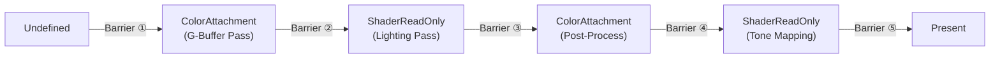

```cpp
// === 延迟渲染 G-Buffer 连续 Barrier 链 ===
// 所有 Barrier 在同一 Command Buffer 内顺序录制

// ① Undefined → ColorAttachment (开始 G-Buffer 填充)
TextureBarrierDesc gbufferInit{};
gbufferInit.srcStage = PipelineStage::TopOfPipe;
gbufferInit.dstStage = PipelineStage::ColorAttachmentOutput;
gbufferInit.srcAccess = AccessFlags::None;
gbufferInit.dstAccess = AccessFlags::ColorAttachmentWrite;
gbufferInit.oldLayout = TextureLayout::Undefined;
gbufferInit.newLayout = TextureLayout::ColorAttachment;
cmd.CmdTextureBarrier(gbufferAlbedo, gbufferInit);
cmd.CmdTextureBarrier(gbufferNormal, gbufferInit);
cmd.CmdTextureBarrier(gbufferDepth, gbufferInit);

// ... 录制 G-Buffer 渲染 Pass ...

// ② ColorAttachment → ShaderReadOnly (G-Buffer 变为光照 Pass 的输入)
TextureBarrierDesc gbufferToRead{};
gbufferToRead.srcStage = PipelineStage::ColorAttachmentOutput;
gbufferToRead.dstStage = PipelineStage::FragmentShader;
gbufferToRead.srcAccess = AccessFlags::ColorAttachmentWrite;
gbufferToRead.dstAccess = AccessFlags::ShaderRead;
gbufferToRead.oldLayout = TextureLayout::ColorAttachment;
gbufferToRead.newLayout = TextureLayout::ShaderReadOnly;
cmd.CmdTextureBarrier(gbufferAlbedo, gbufferToRead);
cmd.CmdTextureBarrier(gbufferNormal, gbufferToRead);
cmd.CmdTextureBarrier(gbufferDepth, gbufferToRead);

// ... 录制光照计算 Pass (全屏四边形 / Compute) ...

// ③ 光照结果 → ColorAttachment (进入后处理)
TextureBarrierDesc lightToPost{};
lightToPost.srcStage = PipelineStage::FragmentShader;
lightToPost.dstStage = PipelineStage::ColorAttachmentOutput;
lightToPost.srcAccess = AccessFlags::ShaderWrite;
lightToPost.dstAccess = AccessFlags::ColorAttachmentWrite;
lightToPost.oldLayout = TextureLayout::General;
lightToPost.newLayout = TextureLayout::ColorAttachment;
cmd.CmdTextureBarrier(lightingResult, lightToPost);

// ... 录制 Post-Process Pass ...

// ④ Post-Process 结果 → ShaderReadOnly (Tone Mapping 采样)
TextureBarrierDesc postToTone{};
postToTone.srcStage = PipelineStage::ColorAttachmentOutput;
postToTone.dstStage = PipelineStage::FragmentShader;
postToTone.srcAccess = AccessFlags::ColorAttachmentWrite;
postToTone.dstAccess = AccessFlags::ShaderRead;
postToTone.oldLayout = TextureLayout::ColorAttachment;
postToTone.newLayout = TextureLayout::ShaderReadOnly;
cmd.CmdTextureBarrier(postProcessResult, postToTone);

// ... 录制 Tone Mapping Pass, 输出到 swapchain image ...

// ⑤ Swapchain → Present
TextureBarrierDesc toPresent{};
toPresent.srcStage = PipelineStage::ColorAttachmentOutput;
toPresent.dstStage = PipelineStage::BottomOfPipe;
toPresent.srcAccess = AccessFlags::ColorAttachmentWrite;
toPresent.dstAccess = AccessFlags::None;
toPresent.oldLayout = TextureLayout::ColorAttachment;
toPresent.newLayout = TextureLayout::Present;
cmd.CmdTextureBarrier(swapchainImage, toPresent);
```

> 延迟渲染管线需要对 G-Buffer 纹理在同一帧内进行 5 次布局转换。关键原则：**每次 Barrier 的 `srcStage`/`srcAccess` 必须精确匹配上一步的写入阶段，`dstStage`/`dstAccess` 精确匹配下一步的读取阶段**。避免使用 `AllCommands` / `AllGraphics` 等宽泛的 stage mask，否则会引入不必要的管线气泡。注意对多个 G-Buffer 纹理的 Barrier 可以一次性 batch 录制（同一 srcStage/dstStage），GPU 驱动会合并为单个同步点。

---

### 102. 异步 Compute：Compute Queue 计算 → Graphics Queue 渲染

异步计算（Async Compute）将计算密集型工作提交到独立的 Compute Queue，与 Graphics Queue 的渲染并行执行。这需要**跨队列所有权转移 + Timeline Semaphore** 协同。

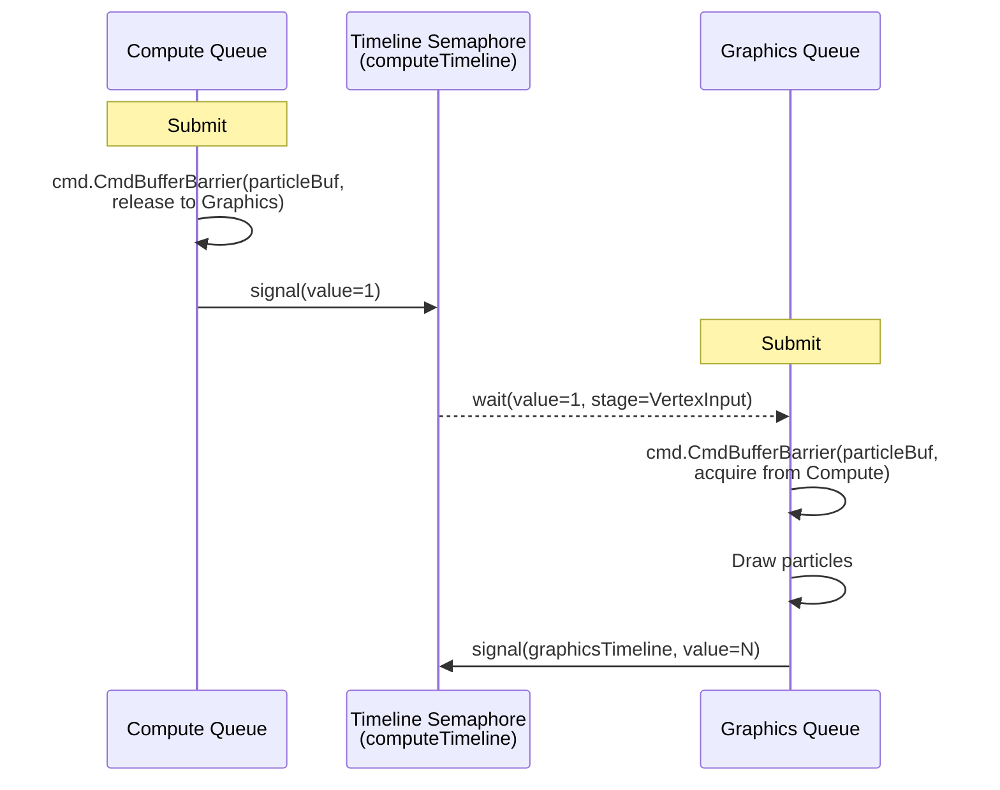

```cpp
// === 异步 Compute 粒子模拟 → Graphics 渲染 ===
// 前提: Compute Queue 和 Graphics Queue 属于不同 Queue Family

// --- Compute Queue 端 (Submit #1) ---
computeCmd.Begin();

// 粒子模拟计算
computeCmd.CmdBindPipeline(particleSimPipeline);
computeCmd.CmdBindDescriptorSet(particleSimDescSet);
computeCmd.CmdDispatch(particleCount / 256, 1, 1);

// 释放 particleBuf 的所有权给 Graphics Queue (QFOT release)
BufferBarrierDesc releaseParticle{};
releaseParticle.srcStage = PipelineStage::ComputeShader;
releaseParticle.dstStage = PipelineStage::BottomOfPipe;        // release 端 dstStage 不重要
releaseParticle.srcAccess = AccessFlags::ShaderWrite;
releaseParticle.dstAccess = AccessFlags::None;                  // release 端不需要 dst access
releaseParticle.srcQueue = QueueType::Compute;
releaseParticle.dstQueue = QueueType::Graphics;
releaseParticle.offset = 0;
releaseParticle.size = kWholeSize;
computeCmd.CmdBufferBarrier(particleBuf, releaseParticle);

computeCmd.End();

// 提交到 Compute Queue，signal timeline semaphore
SemaphoreSubmitInfo computeSignal{
    .semaphore = computeTimeline,
    .value = nextComputeValue,
    .stageMask = PipelineStage::ComputeShader,
};
SubmitDesc computeSubmit{
    .commandBuffers = std::span(&computeCmdHandle, 1),
    .waitSemaphores = {},
    .signalSemaphores = std::span(&computeSignal, 1),
};
device.Submit(QueueType::Compute, computeSubmit);

// --- Graphics Queue 端 (Submit #2) ---
graphicsCmd.Begin();

// 获取 particleBuf 的所有权 (QFOT acquire)
BufferBarrierDesc acquireParticle{};
acquireParticle.srcStage = PipelineStage::TopOfPipe;           // acquire 端 srcStage 不重要
acquireParticle.dstStage = PipelineStage::VertexInput;
acquireParticle.srcAccess = AccessFlags::None;                  // acquire 端不需要 src access
acquireParticle.dstAccess = AccessFlags::VertexAttributeRead;
acquireParticle.srcQueue = QueueType::Compute;
acquireParticle.dstQueue = QueueType::Graphics;
acquireParticle.offset = 0;
acquireParticle.size = kWholeSize;
graphicsCmd.CmdBufferBarrier(particleBuf, acquireParticle);

// 渲染粒子
graphicsCmd.CmdBindPipeline(particleRenderPipeline);
graphicsCmd.CmdBindVertexBuffer(particleBuf);
graphicsCmd.CmdDraw(particleCount, 1, 0, 0);

graphicsCmd.End();

// 提交到 Graphics Queue，wait compute timeline
SemaphoreSubmitInfo graphicsWait{
    .semaphore = computeTimeline,
    .value = nextComputeValue,
    .stageMask = PipelineStage::VertexInput,                   // 仅阻塞到顶点输入阶段
};
SubmitDesc graphicsSubmit{
    .commandBuffers = std::span(&graphicsCmdHandle, 1),
    .waitSemaphores = std::span(&graphicsWait, 1),
    .signalSemaphores = graphicsSignals,
};
device.Submit(QueueType::Graphics, graphicsSubmit);
```

> **跨队列所有权转移 (QFOT)** 必须在两端各执行一次 Barrier：Compute 端 release（`srcQueue=Compute, dstQueue=Graphics`）+ Graphics 端 acquire（相同的 srcQueue/dstQueue）。release 端的 `dstStage`/`dstAccess` 和 acquire 端的 `srcStage`/`srcAccess` 可设为 None/TopOfPipe/BottomOfPipe，因为跨 Queue 的实际等待由 Semaphore 保证，Barrier 仅负责缓存刷新和布局转换。**`waitSemaphores` 的 `stageMask` 决定了 Graphics Queue 在哪个管线阶段之前必须等到 Compute Queue signal**——设为 `VertexInput` 意味着顶点着色器之前的其他工作（如之前帧的后处理）可以并行执行。

---

### 103. 异步 Transfer：专用传输队列上传纹理 → Graphics 采样

这是 miki FrameManager 实际使用的模式：Transfer Queue 上传数据，通过 Timeline Semaphore 通知 Graphics Queue。

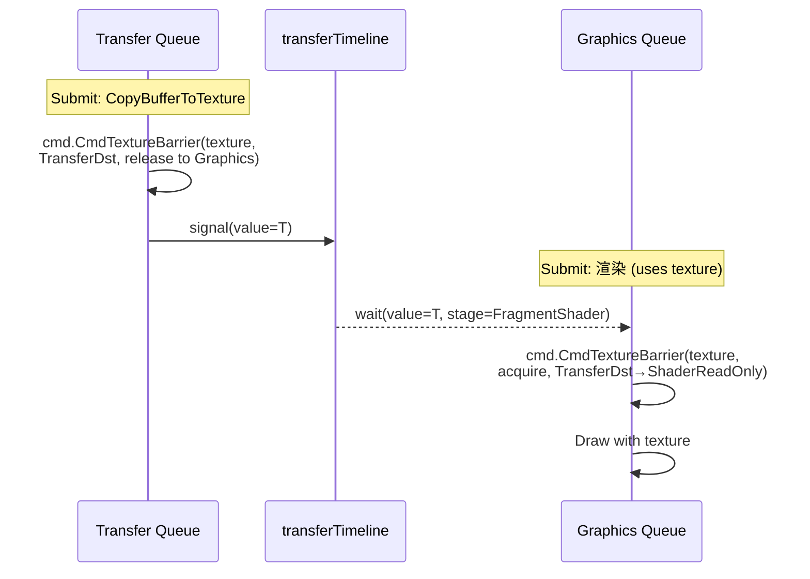

```cpp
// === 异步 Transfer 纹理上传 → Graphics 采样 ===

// --- Transfer Queue 端 ---
transferCmd.Begin();

// 上传纹理数据
transferCmd.CmdCopyBufferToTexture(stagingBuf, texture, copyRegions);

// Release 所有权给 Graphics，但保持 TransferDst 布局
// (布局转换由 acquire 端负责，避免 Transfer Queue 做不必要的工作)
TextureBarrierDesc texRelease{};
texRelease.srcStage = PipelineStage::Transfer;
texRelease.dstStage = PipelineStage::BottomOfPipe;
texRelease.srcAccess = AccessFlags::TransferWrite;
texRelease.dstAccess = AccessFlags::None;
texRelease.oldLayout = TextureLayout::TransferDst;
texRelease.newLayout = TextureLayout::TransferDst;   // release 端不做布局转换
texRelease.srcQueue = QueueType::Transfer;
texRelease.dstQueue = QueueType::Graphics;
transferCmd.CmdTextureBarrier(texture, texRelease);

transferCmd.End();

uint64_t nextTransferValue = ++currentTransferTimelineValue;
SemaphoreSubmitInfo transferSignal{
    .semaphore = transferTimeline,
    .value = nextTransferValue,
    .stageMask = PipelineStage::Transfer,
};
SubmitDesc transferSubmit{
    .commandBuffers = std::span(&transferCmdHandle, 1),
    .signalSemaphores = std::span(&transferSignal, 1),
};
device.Submit(QueueType::Transfer, transferSubmit);

// --- Graphics Queue 端 ---
graphicsCmd.Begin();

// Acquire 所有权 + 布局转换 TransferDst → ShaderReadOnly
TextureBarrierDesc texAcquire{};
texAcquire.srcStage = PipelineStage::TopOfPipe;
texAcquire.dstStage = PipelineStage::FragmentShader;
texAcquire.srcAccess = AccessFlags::None;
texAcquire.dstAccess = AccessFlags::ShaderRead;
texAcquire.oldLayout = TextureLayout::TransferDst;        // 从 transfer 的布局
texAcquire.newLayout = TextureLayout::ShaderReadOnly;      // acquire 端做布局转换
texAcquire.srcQueue = QueueType::Transfer;
texAcquire.dstQueue = QueueType::Graphics;
graphicsCmd.CmdTextureBarrier(texture, texAcquire);

// 使用纹理渲染
graphicsCmd.CmdBindPipeline(renderPipeline);
graphicsCmd.CmdDraw(vertexCount, 1, 0, 0);

graphicsCmd.End();

SemaphoreSubmitInfo graphicsWait{
    .semaphore = transferTimeline,
    .value = nextTransferValue,
    .stageMask = PipelineStage::FragmentShader,
};
SubmitDesc graphicsSubmit{
    .commandBuffers = std::span(&graphicsCmdHandle, 1),
    .waitSemaphores = std::span(&graphicsWait, 1),
    .signalSemaphores = graphicsSignals,
};
device.Submit(QueueType::Graphics, graphicsSubmit);
```

> **布局转换的归属**：QFOT 的 release 和 acquire 两端的 `oldLayout`/`newLayout` 必须一致（Vulkan spec §7.7.4）。但如果 acquire 端想同时做布局转换，release 端的 `newLayout` 应设为与 `oldLayout` 相同（不转换），然后 acquire 端将 `oldLayout` 设为相同值、`newLayout` 设为目标布局。这样布局转换的开销只在 acquire 端（通常是 Graphics Queue，拥有更灵活的布局转换硬件路径）。

---

### 104. 三 Queue 流水线：Transfer → Compute → Graphics

大型引擎的典型工作流：Transfer 上传原始数据 → Compute 预处理 → Graphics 渲染。三个 Queue 通过两个 Timeline Semaphore 串联。

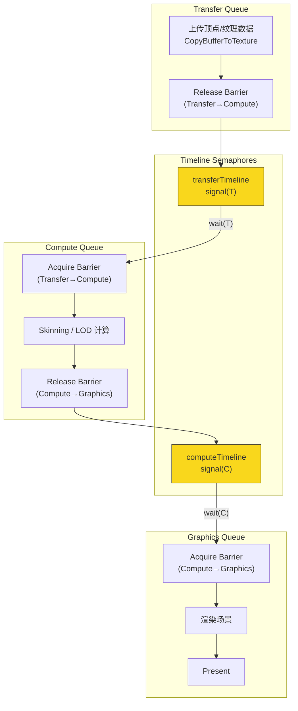

```cpp
// === Transfer → Compute → Graphics 三 Queue 流水线 ===

// ——— Transfer Queue ———
transferCmd.Begin();
transferCmd.CmdCopyBufferToBuffer(stagingBuf, vertexBuf, copyRegion);

// Release vertexBuf: Transfer → Compute
BufferBarrierDesc t2cRelease{};
t2cRelease.srcStage = PipelineStage::Transfer;
t2cRelease.dstStage = PipelineStage::BottomOfPipe;
t2cRelease.srcAccess = AccessFlags::TransferWrite;
t2cRelease.dstAccess = AccessFlags::None;
t2cRelease.srcQueue = QueueType::Transfer;
t2cRelease.dstQueue = QueueType::Compute;
t2cRelease.offset = 0;
t2cRelease.size = kWholeSize;
transferCmd.CmdBufferBarrier(vertexBuf, t2cRelease);
transferCmd.End();

uint64_t tVal = ++currentTransferTimelineValue;
SemaphoreSubmitInfo tSignal{.semaphore = transferTimeline, .value = tVal, .stageMask = PipelineStage::Transfer};
device.Submit(QueueType::Transfer, {.commandBuffers = {&transferCmdH, 1}, .signalSemaphores = {&tSignal, 1}});

// ——— Compute Queue ———
computeCmd.Begin();

// Acquire vertexBuf: Transfer → Compute
BufferBarrierDesc t2cAcquire{};
t2cAcquire.srcStage = PipelineStage::TopOfPipe;
t2cAcquire.dstStage = PipelineStage::ComputeShader;
t2cAcquire.srcAccess = AccessFlags::None;
t2cAcquire.dstAccess = AccessFlags::ShaderRead | AccessFlags::ShaderWrite;
t2cAcquire.srcQueue = QueueType::Transfer;
t2cAcquire.dstQueue = QueueType::Compute;
t2cAcquire.offset = 0;
t2cAcquire.size = kWholeSize;
computeCmd.CmdBufferBarrier(vertexBuf, t2cAcquire);

// GPU Skinning
computeCmd.CmdBindPipeline(skinningPipeline);
computeCmd.CmdDispatch(vertexCount / 64, 1, 1);

// Release vertexBuf: Compute → Graphics
BufferBarrierDesc c2gRelease{};
c2gRelease.srcStage = PipelineStage::ComputeShader;
c2gRelease.dstStage = PipelineStage::BottomOfPipe;
c2gRelease.srcAccess = AccessFlags::ShaderWrite;
c2gRelease.dstAccess = AccessFlags::None;
c2gRelease.srcQueue = QueueType::Compute;
c2gRelease.dstQueue = QueueType::Graphics;
c2gRelease.offset = 0;
c2gRelease.size = kWholeSize;
computeCmd.CmdBufferBarrier(vertexBuf, c2gRelease);
computeCmd.End();

SemaphoreSubmitInfo cWait{.semaphore = transferTimeline, .value = tVal, .stageMask = PipelineStage::ComputeShader};
uint64_t cVal = ++currentComputeTimelineValue;
SemaphoreSubmitInfo cSignal{.semaphore = computeTimeline, .value = cVal, .stageMask = PipelineStage::ComputeShader};
device.Submit(QueueType::Compute, {
    .commandBuffers = {&computeCmdH, 1},
    .waitSemaphores = {&cWait, 1},
    .signalSemaphores = {&cSignal, 1},
});

// ——— Graphics Queue ———
graphicsCmd.Begin();

// Acquire vertexBuf: Compute → Graphics
BufferBarrierDesc c2gAcquire{};
c2gAcquire.srcStage = PipelineStage::TopOfPipe;
c2gAcquire.dstStage = PipelineStage::VertexInput;
c2gAcquire.srcAccess = AccessFlags::None;
c2gAcquire.dstAccess = AccessFlags::VertexAttributeRead;
c2gAcquire.srcQueue = QueueType::Compute;
c2gAcquire.dstQueue = QueueType::Graphics;
c2gAcquire.offset = 0;
c2gAcquire.size = kWholeSize;
graphicsCmd.CmdBufferBarrier(vertexBuf, c2gAcquire);

graphicsCmd.CmdBindPipeline(renderPipeline);
graphicsCmd.CmdBindVertexBuffer(vertexBuf);
graphicsCmd.CmdDraw(vertexCount, 1, 0, 0);
graphicsCmd.End();

SemaphoreSubmitInfo gWait{.semaphore = computeTimeline, .value = cVal, .stageMask = PipelineStage::VertexInput};
device.Submit(QueueType::Graphics, {
    .commandBuffers = {&graphicsCmdH, 1},
    .waitSemaphores = {&gWait, 1},
    .signalSemaphores = graphicsSignals,
});
```

> 三 Queue 流水线的核心在于 **每段跨 Queue 边界都需要 release + semaphore signal + semaphore wait + acquire 四步操作**。Timeline Semaphore 的优势在此凸显：可以用单个 semaphore 对象上的递增值编码整个帧的依赖链，无需为每对 Submit 创建独立的 Binary Semaphore。注意 `waitSemaphores` 的 `stageMask` 应尽可能窄——例如 Graphics Queue 等 Compute 结果时设为 `VertexInput` 而非 `TopOfPipe`，这样 Graphics Queue 前期的 uniform buffer 更新等工作可以不被阻塞。

---

### 105. 帧间流水线：Timeline Semaphore 驱动的 N-buffering

Timeline Semaphore 的核心价值之一是实现帧间流水线：Frame N 的 Graphics 提交可以在 Frame N-2 的 GPU 工作完成后立即开始，无需逐帧 fence/wait。

```mermaid
gantt
    title 3-Frame Timeline 流水线 (framesInFlight=3)
    dateFormat X
    axisFormat %s

    section GPU Slot 0
    Frame 0 Graphics   :f0, 0, 3
    Frame 3 Graphics   :f3, 9, 12

    section GPU Slot 1
    Frame 1 Graphics   :f1, 1, 5
    Frame 4 Graphics   :f4, 10, 14

    section GPU Slot 2
    Frame 2 Graphics   :f2, 3, 7
    Frame 5 Graphics   :f5, 12, 16

    section CPU (录制)
    Record F0 :r0, 0, 1
    Record F1 :r1, 1, 2
    Record F2 :r2, 2, 3
    Wait F0 done, Record F3 :r3, 3, 4
    Wait F1 done, Record F4 :r4, 5, 6
```

```cpp
// === Timeline Semaphore 帧间流水线 ===
// graphicsTimeline 是 device-global 的 Timeline Semaphore (见 QueueTimelines)
// 每帧递增 timelineValue，CPU 端通过 WaitSemaphore 等待 N-framesInFlight 帧完成

constexpr uint32_t framesInFlight = 3;
uint64_t timelineValue = 0;  // 单调递增

void RenderFrame() {
    uint64_t currentValue = ++timelineValue;
    uint64_t waitValue = (currentValue > framesInFlight)
        ? currentValue - framesInFlight
        : 0;

    // CPU 等待：确保 slot 对应的帧已执行完毕
    if (waitValue > 0) {
        device.WaitSemaphore(graphicsTimeline, waitValue, UINT64_MAX);
    }

    // 此时可以安全复用 slot 的 Command Buffer、Descriptor 等资源
    auto& slot = slots[currentValue % framesInFlight];
    slot.commandBuffer.Reset();

    auto& cmd = slot.commandBuffer;
    cmd.Begin();

    // 录制本帧渲染指令 (包含上述示例中的 Barrier 链)
    RecordGBufferPass(cmd);
    RecordLightingPass(cmd);
    RecordPostProcessPass(cmd);
    RecordPresentBarrier(cmd);

    cmd.End();

    // 提交，signal 当前帧的 timeline value
    SemaphoreSubmitInfo signal{
        .semaphore = graphicsTimeline,
        .value = currentValue,
        .stageMask = PipelineStage::AllCommands,
    };
    SubmitDesc submit{
        .commandBuffers = std::span(&slot.cmdHandle, 1),
        .waitSemaphores = presentWaits,      // 等待 swapchain acquire
        .signalSemaphores = std::span(&signal, 1),
    };
    device.Submit(QueueType::Graphics, submit);
}
```

> Timeline Semaphore 帧间流水线相比传统 Fence 方案的优势：**单个 semaphore 对象编码所有帧的完成状态**（值为 N 表示第 N 帧完成），CPU `WaitSemaphore(timeline, N-3)` 即可安全复用第 N-3 帧的资源。无需 per-frame 的 Fence 创建/销毁/Reset 开销。miki 的 `FrameManager` 正是使用此模式（`@c:\mitsuki\src\miki\frame\FrameManager.cpp`）。

---

### 106. Compute + Graphics 双 Pass 联用：SSAO 异步计算

SSAO（屏幕空间环境光遮蔽）可以在 Compute Queue 上与 Graphics Queue 的阴影渲染并行执行，然后合并结果。

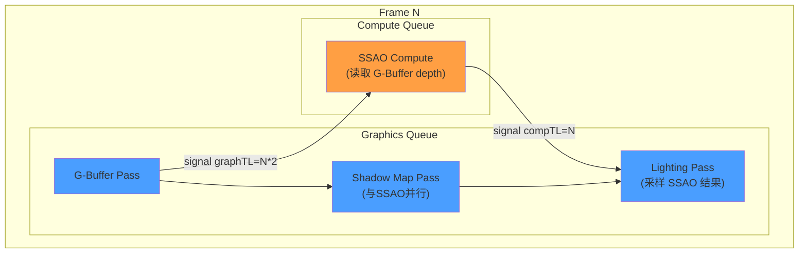

```cpp
// === SSAO 异步 Compute + Graphics 并行 ===

// --- Step 1: Graphics Queue 提交 G-Buffer Pass ---
gfxCmd1.Begin();
// G-Buffer 渲染 (输出 depth, normal, albedo)
RecordGBufferPass(gfxCmd1);

// G-Buffer depth 纹理 release 给 Compute Queue
TextureBarrierDesc depthRelease{};
depthRelease.srcStage = PipelineStage::LateFragmentTests;
depthRelease.dstStage = PipelineStage::BottomOfPipe;
depthRelease.srcAccess = AccessFlags::DepthStencilWrite;
depthRelease.dstAccess = AccessFlags::None;
depthRelease.oldLayout = TextureLayout::DepthStencilAttachment;
depthRelease.newLayout = TextureLayout::DepthStencilAttachment;  // release 不转换
depthRelease.srcQueue = QueueType::Graphics;
depthRelease.dstQueue = QueueType::Compute;
gfxCmd1.CmdTextureBarrier(depthTexture, depthRelease);
gfxCmd1.End();

uint64_t gVal1 = nextGraphicsValue++;
SemaphoreSubmitInfo gSignal1{.semaphore = graphicsTimeline, .value = gVal1, .stageMask = PipelineStage::AllGraphics};
device.Submit(QueueType::Graphics, {.commandBuffers = {&gfxCmd1H, 1}, .signalSemaphores = {&gSignal1, 1}});

// --- Step 2: Compute Queue 执行 SSAO (与 Shadow Map Pass 并行) ---
compCmd.Begin();

// Acquire depth 纹理 + 布局转换
TextureBarrierDesc depthAcquire{};
depthAcquire.srcStage = PipelineStage::TopOfPipe;
depthAcquire.dstStage = PipelineStage::ComputeShader;
depthAcquire.srcAccess = AccessFlags::None;
depthAcquire.dstAccess = AccessFlags::ShaderRead;
depthAcquire.oldLayout = TextureLayout::DepthStencilAttachment;
depthAcquire.newLayout = TextureLayout::ShaderReadOnly;    // Compute 采样 depth
depthAcquire.srcQueue = QueueType::Graphics;
depthAcquire.dstQueue = QueueType::Compute;
compCmd.CmdTextureBarrier(depthTexture, depthAcquire);

compCmd.CmdBindPipeline(ssaoPipeline);
compCmd.CmdBindDescriptorSet(ssaoDescSet);
compCmd.CmdDispatch(screenWidth / 8, screenHeight / 8, 1);

// Release SSAO 结果给 Graphics
TextureBarrierDesc ssaoRelease{};
ssaoRelease.srcStage = PipelineStage::ComputeShader;
ssaoRelease.dstStage = PipelineStage::BottomOfPipe;
ssaoRelease.srcAccess = AccessFlags::ShaderWrite;
ssaoRelease.dstAccess = AccessFlags::None;
ssaoRelease.oldLayout = TextureLayout::General;
ssaoRelease.newLayout = TextureLayout::General;             // release 不转换
ssaoRelease.srcQueue = QueueType::Compute;
ssaoRelease.dstQueue = QueueType::Graphics;
compCmd.CmdTextureBarrier(ssaoTexture, ssaoRelease);
compCmd.End();

SemaphoreSubmitInfo cWait{.semaphore = graphicsTimeline, .value = gVal1, .stageMask = PipelineStage::ComputeShader};
uint64_t cVal = nextComputeValue++;
SemaphoreSubmitInfo cSignal{.semaphore = computeTimeline, .value = cVal, .stageMask = PipelineStage::ComputeShader};
device.Submit(QueueType::Compute, {
    .commandBuffers = {&compCmdH, 1},
    .waitSemaphores = {&cWait, 1},
    .signalSemaphores = {&cSignal, 1},
});

// --- Step 3: Graphics Queue 同时在做 Shadow Map Pass (不等待 Compute) ---
gfxCmd2.Begin();
RecordShadowMapPass(gfxCmd2);

// Shadow Map 完成后，等待 SSAO 结果，进入 Lighting Pass
// Acquire SSAO 纹理 + 布局转换
TextureBarrierDesc ssaoAcquire{};
ssaoAcquire.srcStage = PipelineStage::TopOfPipe;
ssaoAcquire.dstStage = PipelineStage::FragmentShader;
ssaoAcquire.srcAccess = AccessFlags::None;
ssaoAcquire.dstAccess = AccessFlags::ShaderRead;
ssaoAcquire.oldLayout = TextureLayout::General;
ssaoAcquire.newLayout = TextureLayout::ShaderReadOnly;
ssaoAcquire.srcQueue = QueueType::Compute;
ssaoAcquire.dstQueue = QueueType::Graphics;
gfxCmd2.CmdTextureBarrier(ssaoTexture, ssaoAcquire);

RecordLightingPass(gfxCmd2);  // 采样 SSAO + Shadow Map
gfxCmd2.End();

SemaphoreSubmitInfo gWait2{.semaphore = computeTimeline, .value = cVal, .stageMask = PipelineStage::FragmentShader};
device.Submit(QueueType::Graphics, {
    .commandBuffers = {&gfxCmd2H, 1},
    .waitSemaphores = {&gWait2, 1},
    .signalSemaphores = graphicsSignals,
});
```

> SSAO 异步 Compute 的关键在于 **三段提交的时序编排**：G-Buffer 完成后同时启动 Shadow Map（Graphics）和 SSAO（Compute），在 Lighting Pass 前汇合。注意 Shadow Map Pass 和 SSAO 是真正的 GPU 并行——它们分别在不同的硬件队列上执行。`waitSemaphores.stageMask = FragmentShader` 意味着 Lighting Pass 的顶点处理可以先行启动，只有片段着色器需要等待 SSAO 结果。这种 **精细的 stage mask** 是异步 Compute 性能优化的关键。

---

### 107. Mipmap 生成：单 Command Buffer 内的循环 Barrier 链

Mipmap 生成需要逐级 blit，每级都依赖上一级的结果。这是一个 N 次 Barrier 的循环模式。

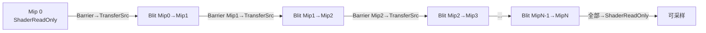

```cpp
// === Mipmap 生成：逐级 Barrier 链 ===
// 前提: Mip 0 已填充数据，布局为 TransferDst (刚上传完成)

uint32_t mipLevels = texture.mipLevels;
uint32_t mipWidth = texture.width;
uint32_t mipHeight = texture.height;

cmd.Begin();

// Mip 0: TransferDst → TransferSrc (作为第一次 blit 的源)
TextureBarrierDesc mip0ToSrc{};
mip0ToSrc.srcStage = PipelineStage::Transfer;
mip0ToSrc.dstStage = PipelineStage::Transfer;
mip0ToSrc.srcAccess = AccessFlags::TransferWrite;
mip0ToSrc.dstAccess = AccessFlags::TransferRead;
mip0ToSrc.oldLayout = TextureLayout::TransferDst;
mip0ToSrc.newLayout = TextureLayout::TransferSrc;
mip0ToSrc.subresource.baseMipLevel = 0;
mip0ToSrc.subresource.levelCount = 1;
cmd.CmdTextureBarrier(texture, mip0ToSrc);

for (uint32_t i = 1; i < mipLevels; ++i) {
    // Mip i: Undefined → TransferDst (准备接收 blit)
    TextureBarrierDesc mipToDst{};
    mipToDst.srcStage = PipelineStage::TopOfPipe;
    mipToDst.dstStage = PipelineStage::Transfer;
    mipToDst.srcAccess = AccessFlags::None;
    mipToDst.dstAccess = AccessFlags::TransferWrite;
    mipToDst.oldLayout = TextureLayout::Undefined;
    mipToDst.newLayout = TextureLayout::TransferDst;
    mipToDst.subresource.baseMipLevel = i;
    mipToDst.subresource.levelCount = 1;
    cmd.CmdTextureBarrier(texture, mipToDst);

    // Blit: Mip (i-1) → Mip i
    cmd.CmdBlitTexture(texture, i - 1, texture, i, Filter::Linear);

    // Mip i: TransferDst → TransferSrc (作为下一级的源)
    TextureBarrierDesc mipToSrc{};
    mipToSrc.srcStage = PipelineStage::Transfer;
    mipToSrc.dstStage = PipelineStage::Transfer;
    mipToSrc.srcAccess = AccessFlags::TransferWrite;
    mipToSrc.dstAccess = AccessFlags::TransferRead;
    mipToSrc.oldLayout = TextureLayout::TransferDst;
    mipToSrc.newLayout = TextureLayout::TransferSrc;
    mipToSrc.subresource.baseMipLevel = i;
    mipToSrc.subresource.levelCount = 1;
    cmd.CmdTextureBarrier(texture, mipToSrc);

    mipWidth = std::max(1u, mipWidth / 2);
    mipHeight = std::max(1u, mipHeight / 2);
}

// 所有 Mip: TransferSrc → ShaderReadOnly (准备采样)
TextureBarrierDesc allMipsToRead{};
allMipsToRead.srcStage = PipelineStage::Transfer;
allMipsToRead.dstStage = PipelineStage::FragmentShader;
allMipsToRead.srcAccess = AccessFlags::TransferRead;
allMipsToRead.dstAccess = AccessFlags::ShaderRead;
allMipsToRead.oldLayout = TextureLayout::TransferSrc;
allMipsToRead.newLayout = TextureLayout::ShaderReadOnly;
allMipsToRead.subresource.baseMipLevel = 0;
allMipsToRead.subresource.levelCount = mipLevels;  // 一次性转换所有 mip
cmd.CmdTextureBarrier(texture, allMipsToRead);

cmd.End();
```

> Mipmap 生成是 **subresource 级别 Barrier** 的典型应用：每次 Barrier 只作用于单个 mip level（通过 `subresource.baseMipLevel` + `levelCount=1`），不同 mip level 之间存在严格的串行依赖。最后一步可以用 `levelCount = mipLevels` 一次性将所有 mip 转换为 ShaderReadOnly。这种模式也说明了为什么 Barrier 需要 subresource 粒度——全纹理 Barrier 会导致不必要的流水线停顿。

---

### 108. Ping-Pong 双缓冲后处理链

后处理效果（Bloom、DOF、Motion Blur 等）通常以 ping-pong 方式在两张纹理间交替读写。

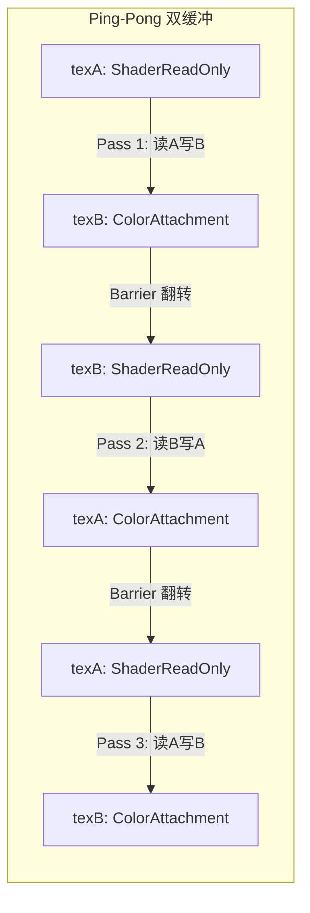

```cpp
// === Ping-Pong 后处理链 ===
// texA 初始包含场景渲染结果 (ShaderReadOnly)
// texB 初始为 Undefined

TextureHandle pingPong[2] = {texA, texB};
uint32_t readIdx = 0;   // 当前读取源
uint32_t writeIdx = 1;  // 当前写入目标

// 初始化 texB
TextureBarrierDesc initB{};
initB.srcStage = PipelineStage::TopOfPipe;
initB.dstStage = PipelineStage::ColorAttachmentOutput;
initB.srcAccess = AccessFlags::None;
initB.dstAccess = AccessFlags::ColorAttachmentWrite;
initB.oldLayout = TextureLayout::Undefined;
initB.newLayout = TextureLayout::ColorAttachment;
cmd.CmdTextureBarrier(pingPong[writeIdx], initB);

for (uint32_t passIdx = 0; passIdx < numPostProcessPasses; ++passIdx) {
    // 渲染后处理 Pass: 读 pingPong[readIdx], 写 pingPong[writeIdx]
    cmd.CmdBeginRendering(/*render to pingPong[writeIdx]*/);
    cmd.CmdBindPipeline(postProcessPipelines[passIdx]);
    // pingPong[readIdx] 绑定为采样纹理
    cmd.CmdDraw(3, 1, 0, 0);  // fullscreen triangle
    cmd.CmdEndRendering();

    // 翻转前的 Barrier：写入目标 → ShaderReadOnly, 下一轮的读取源 → ColorAttachment
    TextureBarrierDesc writeToRead{};
    writeToRead.srcStage = PipelineStage::ColorAttachmentOutput;
    writeToRead.dstStage = PipelineStage::FragmentShader;
    writeToRead.srcAccess = AccessFlags::ColorAttachmentWrite;
    writeToRead.dstAccess = AccessFlags::ShaderRead;
    writeToRead.oldLayout = TextureLayout::ColorAttachment;
    writeToRead.newLayout = TextureLayout::ShaderReadOnly;
    cmd.CmdTextureBarrier(pingPong[writeIdx], writeToRead);

    if (passIdx + 1 < numPostProcessPasses) {
        TextureBarrierDesc readToWrite{};
        readToWrite.srcStage = PipelineStage::FragmentShader;
        readToWrite.dstStage = PipelineStage::ColorAttachmentOutput;
        readToWrite.srcAccess = AccessFlags::ShaderRead;
        readToWrite.dstAccess = AccessFlags::ColorAttachmentWrite;
        readToWrite.oldLayout = TextureLayout::ShaderReadOnly;
        readToWrite.newLayout = TextureLayout::ColorAttachment;
        cmd.CmdTextureBarrier(pingPong[readIdx], readToWrite);
    }

    // 交换 read/write
    std::swap(readIdx, writeIdx);
}
// 循环结束后 pingPong[readIdx] 为最终结果 (ShaderReadOnly)
```

> Ping-Pong 模式的核心是 **每个 Pass 之间需要两个 Barrier**：一个将刚写入的纹理转为 ShaderReadOnly（下一 Pass 的输入），另一个将上一轮的输入转为 ColorAttachment（下一 Pass 的输出）。两个 Barrier 的 `srcStage`/`dstStage` 不同，不能合并为一个 `PipelineBarrierDesc`。最后一个 Pass 不需要将 readIdx 纹理转为 ColorAttachment（因为没有下一轮了）。

---

### 109. GPU Readback：渲染结果回读到 CPU

GPU → CPU 回读需要精确的同步：确保 GPU 写入完成后再映射内存。

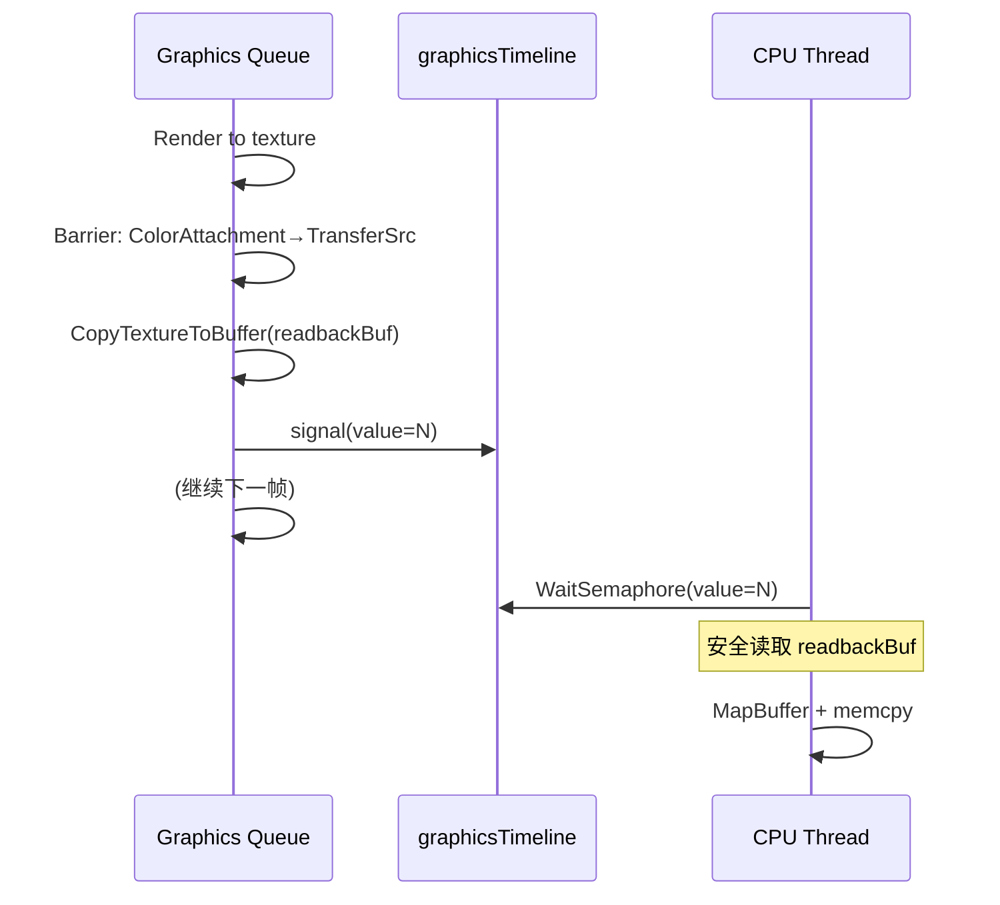

```cpp
// === GPU Readback ===
cmd.Begin();

// ... 渲染到 renderTarget ...

// renderTarget: ColorAttachment → TransferSrc
TextureBarrierDesc toTransferSrc{};
toTransferSrc.srcStage = PipelineStage::ColorAttachmentOutput;
toTransferSrc.dstStage = PipelineStage::Transfer;
toTransferSrc.srcAccess = AccessFlags::ColorAttachmentWrite;
toTransferSrc.dstAccess = AccessFlags::TransferRead;
toTransferSrc.oldLayout = TextureLayout::ColorAttachment;
toTransferSrc.newLayout = TextureLayout::TransferSrc;
cmd.CmdTextureBarrier(renderTarget, toTransferSrc);

// Copy 到 readback buffer (host-visible)
cmd.CmdCopyTextureToBuffer(renderTarget, readbackBuf, copyRegion);

// readbackBuf 不需要额外 Barrier，因为 host read 通过 semaphore 同步

cmd.End();

uint64_t readbackValue = ++timelineValue;
SemaphoreSubmitInfo signal{.semaphore = graphicsTimeline, .value = readbackValue, .stageMask = PipelineStage::Transfer};
device.Submit(QueueType::Graphics, {
    .commandBuffers = {&cmdHandle, 1},
    .signalSemaphores = {&signal, 1},
});

// --- CPU 端 (可在另一线程) ---
device.WaitSemaphore(graphicsTimeline, readbackValue, UINT64_MAX);
// 现在 readbackBuf 的数据对 CPU 可见
void* mapped = device.MapBuffer(readbackBuf);
std::memcpy(cpuDst, mapped, readbackSize);
device.UnmapBuffer(readbackBuf);
```

> GPU Readback 的同步不靠 Barrier 而靠 **Timeline Semaphore 的 CPU wait**（`device.WaitSemaphore`）。Barrier 只负责 GPU 内部的布局转换和缓存刷新。CPU 端的 `WaitSemaphore` 等价于 Vulkan 的 `vkWaitSemaphores`，会阻塞调用线程直到 GPU signal 指定的 timeline value。这比 Fence 更高效，因为不需要创建/重置 Fence 对象，且可以在同一线程内等待多个不同的完成点。

---

### 同步模式总结

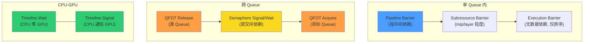

| 场景                            | 同步手段                    | 示例编号   |
| ------------------------------- | --------------------------- | ---------- |
| 同一 Pass 内纹理布局转换        | Pipeline Barrier            | #1-#100    |
| 同一帧多 Pass 连续 Barrier      | 连续 Pipeline Barrier       | #101       |
| Compute Queue → Graphics Queue  | QFOT + Timeline Semaphore   | #102, #106 |
| Transfer Queue → Graphics Queue | QFOT + Timeline Semaphore   | #103       |
| Transfer → Compute → Graphics   | 双 QFOT + 双 Timeline       | #104       |
| 帧间资源复用                    | Timeline Semaphore CPU wait | #105       |
| Mipmap 逐级生成                 | Subresource Barrier 循环    | #107       |
| Ping-Pong 双缓冲                | 交替 Barrier 对             | #108       |
| GPU → CPU 回读                  | Timeline Semaphore CPU wait | #109       |

---

## 各后端 Barrier 建模详解

> 参考：`specs/rendering-pipeline-architecture.md` §2.2、§20.2-§20.3

miki RHI 通过 `CmdPipelineBarrier`、`CmdBufferBarrier`、`CmdTextureBarrier` 三个统一接口向用户暴露 Barrier 功能。但各后端对这组 API 的底层建模差异巨大——从 Vulkan 的像素级精确控制到 WebGPU 的完全隐式处理，跨度极大。

### 后端 Barrier 能力对比

| 维度                    | T1 Vulkan                                      | T1 D3D12                                                  | T2 Compat (Vulkan)           | T3 WebGPU          | T4 OpenGL                          |
| ----------------------- | ---------------------------------------------- | --------------------------------------------------------- | ---------------------------- | ------------------ | ---------------------------------- |
| **底层 API**            | `vkCmdPipelineBarrier2`                        | Enhanced Barriers (`ID3D12GraphicsCommandList7::Barrier`) | `vkCmdPipelineBarrier` (1.0) | 隐式 (Dawn)        | `glMemoryBarrier`                  |
| **Pipeline Stage 粒度** | 完整 `VkPipelineStageFlagBits2` (20+ stages)   | `D3D12_BARRIER_SYNC` (12 stages)                          | 同 T1                        | 无（驱动自动推断） | 无（全局屏障）                     |
| **Access Flag 粒度**    | 完整 `VkAccessFlagBits2`                       | `D3D12_BARRIER_ACCESS`                                    | 同 T1                        | 无                 | `GL_*_BARRIER_BIT` (10 categories) |
| **布局转换 (Layout)**   | `VkImageLayout` oldLayout→newLayout            | `D3D12_BARRIER_LAYOUT` LayoutBefore→LayoutAfter           | 同 T1                        | 隐式               | 无（FBO 绑定即转换）               |
| **Subresource 粒度**    | mip + layer + aspect                           | mip + layer + plane                                       | 同 T1                        | 无                 | 无                                 |
| **QFOT**                | 必须 (srcQueueFamilyIndex/dstQueueFamilyIndex) | 无需 (D3D12 隐式跨 Queue)                                 | 同 T1                        | N/A (单 Queue)     | N/A (单 Queue)                     |
| **Split Barrier**       | Event (release/acquire 分离)                   | `SYNC_SPLIT` / `BEGIN_ONLY`+`END_ONLY`                    | Event                        | N/A                | N/A                                |

### Vulkan (Tier1) — 完全显式

Vulkan 是所有后端中 Barrier 语义最精确的。miki 使用 Vulkan 1.3 core 的 `vkCmdPipelineBarrier2`（即 synchronization2），映射关系为：

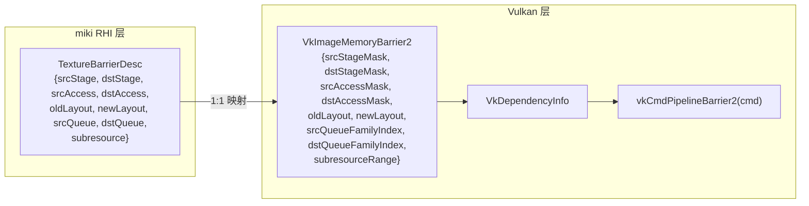

```cpp
// Vulkan 后端实际实现 (VulkanCommandBuffer.cpp)
void VulkanCommandBuffer::CmdTextureBarrierImpl(TextureHandle texture, const TextureBarrierDesc& desc) {
    auto* data = device_->GetTexturePool().Lookup(texture);

    VkImageMemoryBarrier2 barrier{};
    barrier.sType = VK_STRUCTURE_TYPE_IMAGE_MEMORY_BARRIER_2;
    barrier.srcStageMask = ToVkPipelineStageFlags2(desc.srcStage);   // PipelineStage → VkPipelineStageFlagBits2
    barrier.srcAccessMask = ToVkAccessFlags2(desc.srcAccess);        // AccessFlags → VkAccessFlagBits2
    barrier.dstStageMask = ToVkPipelineStageFlags2(desc.dstStage);
    barrier.dstAccessMask = ToVkAccessFlags2(desc.dstAccess);
    barrier.oldLayout = ToVkImageLayout(desc.oldLayout);             // TextureLayout → VkImageLayout
    barrier.newLayout = ToVkImageLayout(desc.newLayout);
    // QFOT: 仅在 srcQueue != dstQueue 时设置 queue family index
    if (desc.srcQueue != desc.dstQueue) {
        barrier.srcQueueFamilyIndex = device_->QueueFamilyIndex(desc.srcQueue);
        barrier.dstQueueFamilyIndex = device_->QueueFamilyIndex(desc.dstQueue);
    } else {
        barrier.srcQueueFamilyIndex = VK_QUEUE_FAMILY_IGNORED;
        barrier.dstQueueFamilyIndex = VK_QUEUE_FAMILY_IGNORED;
    }
    barrier.image = data->image;
    barrier.subresourceRange = {/* aspect, baseMipLevel, levelCount, baseArrayLayer, layerCount */};

    VkDependencyInfo depInfo{};
    depInfo.sType = VK_STRUCTURE_TYPE_DEPENDENCY_INFO;
    depInfo.imageMemoryBarrierCount = 1;
    depInfo.pImageMemoryBarriers = &barrier;
    vkCmdPipelineBarrier2(cmd_, &depInfo);
}
```

> Vulkan 后端的 Barrier 映射几乎是 1:1——miki 的 `TextureBarrierDesc` 的每个字段都直接对应 `VkImageMemoryBarrier2` 的一个字段。这是因为 miki RHI 的 Barrier 模型就是以 Vulkan synchronization2 为蓝本设计的。Vulkan 支持最精细的控制：精确的 pipeline stage（如区分 `EarlyFragmentTests` 和 `LateFragmentTests`）、精确的 access flags、subresource 粒度的布局转换、以及 Queue Family Ownership Transfer。

### D3D12 (Tier1) — Enhanced Barriers

D3D12 从 Agility SDK 1.719+ 引入 Enhanced Barriers，取代旧的 `ResourceBarrier`（state-based model）。miki 的 D3D12 后端直接使用 Enhanced Barriers API。

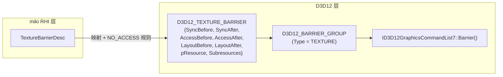

```cpp
// D3D12 后端实际实现 (D3D12CommandBuffer.cpp)
void D3D12CommandBuffer::CmdTextureBarrierImpl(TextureHandle texture, const TextureBarrierDesc& desc) {
    auto* data = device_->GetTexturePool().Lookup(texture);

    D3D12_TEXTURE_BARRIER texBarrier{};
    texBarrier.AccessBefore = ToD3D12BarrierAccess(desc.srcAccess);
    texBarrier.AccessAfter = ToD3D12BarrierAccess(desc.dstAccess);
    // D3D12 Enhanced Barriers 规则: Access 为 NO_ACCESS 时 Sync 必须为 SYNC_NONE
    texBarrier.SyncBefore = (texBarrier.AccessBefore == D3D12_BARRIER_ACCESS_NO_ACCESS)
                                ? D3D12_BARRIER_SYNC_NONE
                                : ToD3D12BarrierSync(desc.srcStage);
    texBarrier.SyncAfter = (texBarrier.AccessAfter == D3D12_BARRIER_ACCESS_NO_ACCESS)
                               ? D3D12_BARRIER_SYNC_NONE
                               : ToD3D12BarrierSync(desc.dstStage);
    texBarrier.LayoutBefore = ToD3D12BarrierLayout(desc.oldLayout);
    texBarrier.LayoutAfter = ToD3D12BarrierLayout(desc.newLayout);
    texBarrier.pResource = data->resource.Get();
    texBarrier.Subresources = {/* IndexOrFirstMipLevel, NumMipLevels, FirstArraySlice, NumArraySlices, FirstPlane, NumPlanes */};

    D3D12_BARRIER_GROUP group{};
    group.Type = D3D12_BARRIER_TYPE_TEXTURE;
    group.NumBarriers = 1;
    group.pTextureBarriers = &texBarrier;
    cmd_->Barrier(1, &group);
}
```

> D3D12 Enhanced Barriers 与 Vulkan 的关键差异：
>
> 1. **无 QFOT**：D3D12 的跨 Queue 资源访问是隐式的，不需要显式的 Queue Ownership Transfer。miki 的 `srcQueue`/`dstQueue` 字段在 D3D12 后端被忽略。
> 2. **NO_ACCESS 特殊规则**：当 `AccessBefore/After` 为 `NO_ACCESS` 时，`SyncBefore/After` 必须设为 `SYNC_NONE`，否则 D3D12 Debug Layer 会报错。miki 后端在映射时自动处理此规则。
> 3. **Sync vs Stage**：D3D12 的 `D3D12_BARRIER_SYNC` 与 Vulkan 的 `VkPipelineStageFlagBits2` 语义相似但枚举不同，miki 通过 `ToD3D12BarrierSync` 转换。
> 4. **Fence Barrier**：D3D12 独有的 `SignalBarrier`/`WaitBarrier`（命令列表级别的信号/等待），可实现跨命令列表的细粒度同步，类似 Vulkan 的 Event。miki 未来的 RenderGraph 将利用此特性实现 split barrier。

### OpenGL (Tier4) — 粗粒度全局屏障

OpenGL 没有 Vulkan/D3D12 那样的精确 Barrier 模型。`glMemoryBarrier` 是一个全局操作，不绑定到特定资源，也不区分 pipeline stage。

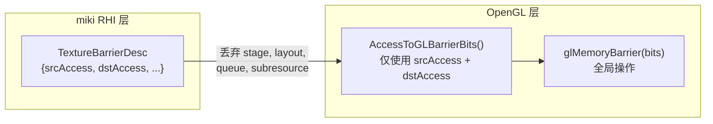

```cpp
// OpenGL 后端实际实现 (OpenGLCommandBuffer.cpp)
void OpenGLCommandBuffer::CmdTextureBarrierImpl(
    [[maybe_unused]] TextureHandle texture, const TextureBarrierDesc& desc
) {
    GLbitfield bits = AccessToGLBarrierBits(desc.srcAccess, desc.dstAccess);
    if (bits != 0) {
        device_->GetGLContext()->MemoryBarrier(bits);
    }
}

// AccessToGLBarrierBits 映射逻辑:
// 1. 仅当 src 包含非 coherent 写入 (ShaderWrite, TransferWrite, HostWrite, MemoryWrite) 时才发出 barrier
// 2. 根据 dst access 映射到 GL barrier bits:
//    ShaderRead/Write   -> GL_SHADER_STORAGE_BARRIER_BIT | GL_UNIFORM_BARRIER_BIT | GL_SHADER_IMAGE_ACCESS_BARRIER_BIT
//    ColorAttachment*   -> GL_FRAMEBUFFER_BARRIER_BIT
//    VertexAttribute*   -> GL_VERTEX_ATTRIB_ARRAY_BARRIER_BIT | GL_ELEMENT_ARRAY_BARRIER_BIT
//    Transfer*          -> GL_BUFFER_UPDATE_BARRIER_BIT | GL_TEXTURE_UPDATE_BARRIER_BIT
//    HostRead           -> GL_CLIENT_MAPPED_BUFFER_BARRIER_BIT
//    fallback           -> GL_ALL_BARRIER_BITS (conservative)
```

> OpenGL 后端的 Barrier 映射是**有损的**：
>
> - **Pipeline Stage 被忽略**：OpenGL 没有 stage 粒度的同步。`glMemoryBarrier` 保证调用之前的所有写入对之后的指定类型的读取可见，但无法指定"在哪个阶段之前"或"在哪个阶段之后"。
> - **布局 (Layout) 被忽略**：OpenGL 没有显式的纹理布局概念。FBO 绑定隐式处理布局转换。
> - **Subresource 被忽略**：`glMemoryBarrier` 是全局操作，无法只同步特定 mip level。
> - **资源句柄被忽略**：`BufferHandle` / `TextureHandle` 参数标记为 `[[maybe_unused]]`——OpenGL 的 barrier 无法细化到单个资源。
> - **仅在非 coherent 写入后发出**：如果 `srcAccess` 不包含写入标志，Barrier 完全跳过（返回 bits=0）。这是一个重要的优化——OpenGL 的 barrier 开销不低，避免冗余调用。

### WebGPU (Tier3) — 完全隐式

WebGPU（Dawn 实现）采用完全隐式的同步模型。用户不需要（也无法）显式插入 Barrier。

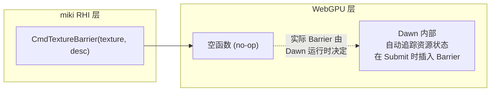

```cpp
// WebGPU 后端实际实现 (WebGPUCommandBuffer.cpp)
void WebGPUCommandBuffer::CmdPipelineBarrierImpl([[maybe_unused]] const PipelineBarrierDesc& desc) {
    // WebGPU/Dawn handles resource transitions implicitly
}

void WebGPUCommandBuffer::CmdBufferBarrierImpl(
    [[maybe_unused]] BufferHandle buffer, [[maybe_unused]] const BufferBarrierDesc& desc
) {}

void WebGPUCommandBuffer::CmdTextureBarrierImpl(
    [[maybe_unused]] TextureHandle texture, [[maybe_unused]] const TextureBarrierDesc& desc
) {}
```

> WebGPU 的 Barrier 是完全**空操作 (no-op)**。这不是"缺失实现"，而是 **WebGPU API 设计的核心决策**：Dawn 运行时在 `wgpuQueueSubmit` 时内部追踪每个资源的状态，自动推断并插入必要的 Vulkan/D3D12/Metal Barrier。这意味着：
>
> - 用户代码无法优化 Barrier 顺序和粒度
> - 无法实现 split barrier
> - 无法实现跨 Queue 同步（WebGPU 只暴露单个 Queue）
> - Dawn 的隐式 Barrier 可能过于保守（但对浏览器安全模型是必要的）

### RenderGraph 如何统一各后端

在实际渲染管线中，用户不直接编写 Barrier。RenderGraph 编译器根据 Pass 的资源声明自动推导 Barrier：

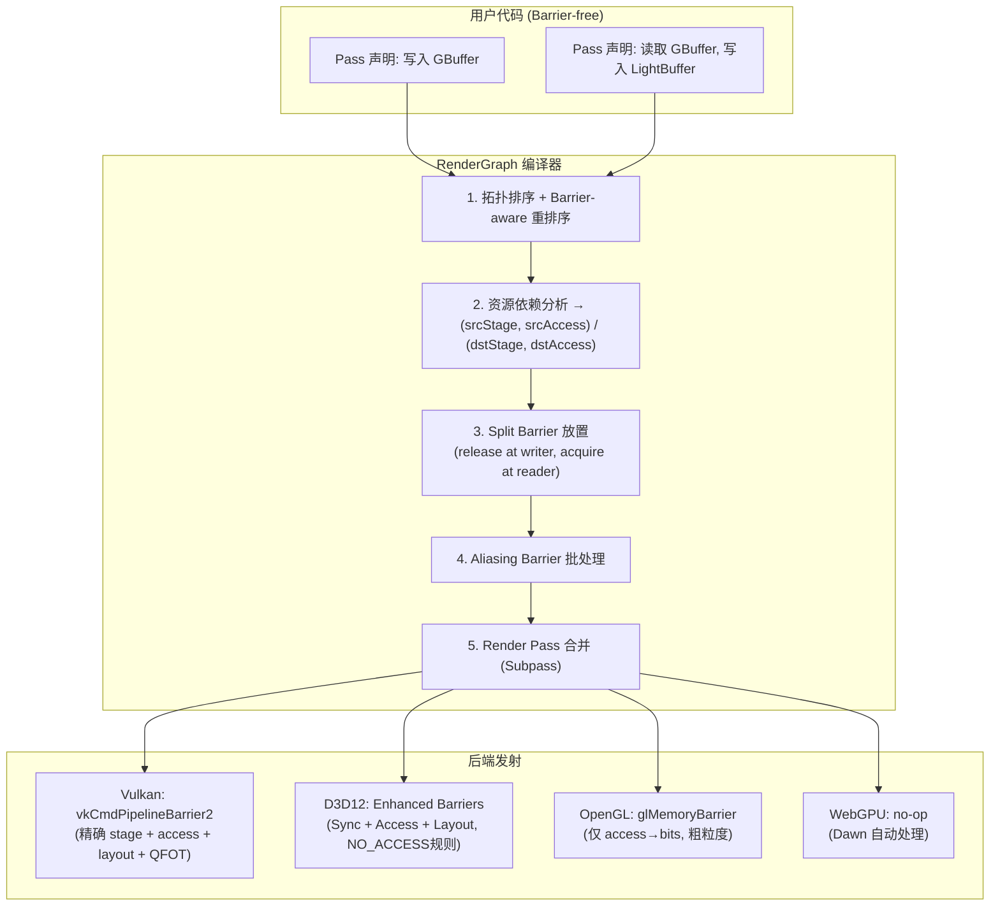

| 编译阶段                             | 优化效果                                                       | 适用后端            |
| ------------------------------------ | -------------------------------------------------------------- | ------------------- |
| **Barrier-aware 重排序** (§5.3.1)    | 通过拓扑重排减少布局转换次数                                   | All                 |
| **Split Barrier** (§5.4)             | release/acquire 分离，最大化 GPU 并行                          | Vulkan, D3D12       |
| **Aliasing Barrier 批处理** (§5.6.4) | 合并同一 Pass 入口的多个 Barrier                               | Vulkan, D3D12       |
| **Render Pass 合并** (§5.7)          | 连续 Pass → Subpass，Barrier → Subpass dependency              | Vulkan (tile-based) |
| **Access Flag 翻译** (§3.2)          | ResourceAccess (RG 层) → (PipelineStage, AccessFlags) (RHI 层) | All                 |

> RenderGraph 的**两层抽象**是 miki 跨后端同步策略的核心：Pass 代码只声明 `ResourceAccess`（语义层），编译器负责翻译为每个后端最优的 Barrier 指令。对 Vulkan/D3D12，生成精确的 split barrier + subresource 粒度转换；对 OpenGL，退化为 `glMemoryBarrier`；对 WebGPU，直接跳过。用户编写的 Barrier 示例（本文 #1-#109）是 RHI 层的直接操作，适用于手写管线和调试；生产环境推荐通过 RenderGraph 自动管理。 |
