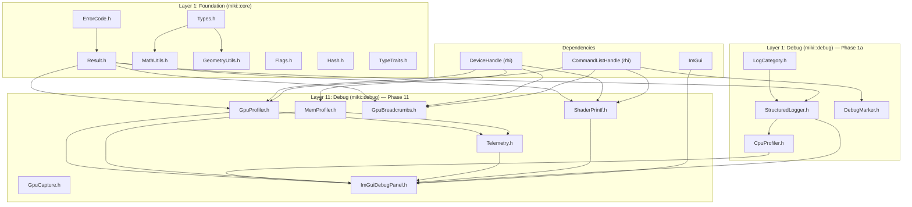

# 00-infra: Foundation & Debug Infrastructure Architecture

> **Audience**: Engine team (30 engineers). Architecture reference.
> **Scope**: Layer 1 Foundation types, structured logging, debug markers, GPU/CPU/memory profiling, GPU breadcrumbs, telemetry, shader printf — everything in `miki::core` and `miki::debug`.
> **Status**: Design blueprint. Derived from `roadmap.md` Layer 1 + L11 Debug/Profiling + gap analysis against `D:\repos\miki`.

---

## 1. Gap Analysis Summary

### 1.1 Reference Codebase (D:\repos\miki) Inventory

| Component                              | Reference Status                                                                   | Action                                                    |
| -------------------------------------- | ---------------------------------------------------------------------------------- | --------------------------------------------------------- |
| `core/ErrorCode.h`                     | Complete (112 LOC). Module error ranges, `ToString()`.                             | **Reuse** — copy as-is, add `Debug` range `0xD000-0xDFFF` |
| `core/Result.h`                        | Complete (27 LOC). `std::expected<T, ErrorCode>`.                                  | **Reuse** — copy as-is                                    |
| `core/Types.h`                         | Complete (218 LOC). GPU-aligned vec/mat/AABB/Ray/Plane.                            | **Reuse** — copy as-is                                    |
| `core/MathUtils.h`                     | Complete (244 LOC). Column-major math, C++23 `m[row,col]`.                         | **Reuse** — copy as-is                                    |
| `core/GeometryUtils.h`                 | Complete (179 LOC). AABB/frustum/ray utilities.                                    | **Reuse** — copy as-is                                    |
| `rhi/Device.h` timestamp query         | Basic `CreateTimestampQueryPool` / `GetTimestampResults` / `GetTimestampPeriodNs`. | **Refactor** — wrap into `GpuProfiler`                    |
| `rhi/CommandBuffer.h` `WriteTimestamp` | Single `WriteTimestamp(pool, index)`.                                              | **Refactor** — add debug marker APIs                      |
| `test/VisualRegression.h`              | Complete (61 LOC). PSNR/RMSE golden image comparison.                              | **Reuse** — copy as-is                                    |
| Structured Logger                      | **Missing**                                                                        | **Rewrite** from scratch                                  |
| GPU Profiler (per-pass)                | **Missing**                                                                        | **Rewrite** from scratch                                  |
| CPU Profiler                           | **Missing**                                                                        | **Rewrite** from scratch                                  |
| Memory Profiler                        | **Missing**                                                                        | **Rewrite** from scratch                                  |
| GPU Breadcrumbs                        | **Missing**                                                                        | **Rewrite** from scratch                                  |
| GPU Capture integration                | **Missing**                                                                        | **Rewrite** from scratch                                  |
| Shader Printf                          | **Missing**                                                                        | **Rewrite** from scratch                                  |
| Debug Markers (cmd buffer)             | **Missing**                                                                        | **Rewrite** from scratch                                  |
| Telemetry                              | **Missing**                                                                        | **Rewrite** from scratch                                  |
| ImGui Debug Panel                      | **Missing**                                                                        | **Rewrite** from scratch                                  |

### 1.2 Industry Comparison

| Feature           | UE5                         | Unity 6                          | miki (target)                                              |
| ----------------- | --------------------------- | -------------------------------- | ---------------------------------------------------------- |
| Structured logger | `UE_LOG` + categories       | `Debug.Log` + UnityLogHandler    | `StructuredLogger` (JSON + console, ring buffer)           |
| GPU profiler      | GPU profiler (stat gpu)     | FrameDebugger + ProfilerRecorder | `GpuProfiler` (per-pass timestamp, RenderGraph-integrated) |
| CPU profiler      | Unreal Insights             | Unity Profiler                   | `CpuProfiler` (scoped, chrome://tracing export)            |
| Memory profiler   | LLM (Low Level Memory)      | Memory Profiler                  | `MemProfiler` (VMA stats + per-module tracking)            |
| GPU breadcrumbs   | D3D12 DRED                  | N/A                              | `GpuBreadcrumbs` (Vulkan + D3D12, AMD FFX-inspired)        |
| GPU capture       | RenderDoc / PIX integration | Frame Debugger                   | `GpuCapture` (RenderDoc + PIX programmatic trigger)        |
| Shader printf     | UE shader print             | Unity shader debug               | `ShaderPrintf` (Slang `printf` → SSBO readback)            |
| Debug markers     | PIX/RenderDoc markers       | N/A                              | `DebugMarker` on `CommandListHandle` (all 5 backends)      |
| Telemetry         | Unreal Insights             | Unity Analytics                  | `Telemetry` (frame stats ring, perf regression CI)         |

---

## 2. Namespace & Header Layout

```
include/miki/
├── core/                          # miki::core — Foundation (Layer 1)
│   ├── ErrorCode.h                #   ErrorCode enum, ToString()
│   ├── Result.h                   #   Result<T> = std::expected<T, ErrorCode>
│   ├── Types.h                    #   float2/3/4, float4x4, AABB, Ray, Plane, etc.
│   ├── MathUtils.h                #   Vec3*, Mat4*, MakePerspective, MakeLookAt
│   ├── GeometryUtils.h            #   AABB/frustum/ray utilities
│   ├── Flags.h                    #   Type-safe bitfield flags (EnumFlags<E>)
│   ├── Hash.h                     #   FNV-1a, CityHash, hash_combine
│   └── TypeTraits.h               #   Concepts, type traits for GPU types
│
├── debug/                         # miki::debug — Debug & Profiling (Layer 1 / Layer 11)
│   ├── StructuredLogger.h         #   Structured logging (JSON + console)
│   ├── LogCategory.h              #   Log category enum + per-category level
│   ├── CrashHandler.h             #   Cross-platform crash handler (SEH / signals)
│   ├── CpuProfiler.h              #   Scoped CPU timer, chrome://tracing export
│   ├── GpuProfiler.h              #   Per-pass GPU timestamp profiler
│   ├── MemProfiler.h              #   Memory tracking (VMA + per-module)
│   ├── GpuBreadcrumbs.h           #   GPU crash breadcrumbs (Vk + D3D12)
│   ├── GpuCapture.h               #   RenderDoc / PIX programmatic capture
│   ├── ShaderPrintf.h             #   Shader printf SSBO readback
│   ├── DebugMarker.h              #   CommandListHandle debug region/label
│   ├── Telemetry.h                #   Frame stats ring buffer
│   └── ImGuiDebugPanel.h          #   ImGui overlay for all debug subsystems
│
└── test/                          # miki::test — Test infrastructure
    └── VisualRegression.h         #   Golden image PSNR/RMSE comparison
```

---

## 3. Component Specifications

### 3.1 StructuredLogger [Already Implemented]

**Motivation**: Every subsystem needs logging. No logger exists in the reference codebase — all output is ad-hoc `printf` or absent. A structured logger is the first prerequisite for any debugging.

**Design goals**:

- Zero-allocation hot path (pre-formatted ring buffer)
- Structured fields (key-value pairs) for machine parsing
- **No virtual function calls on the hot path** — sinks use `std::variant` + `std::visit` (static polymorphism, compiler generates jump table / inlines)
- Console sink built on **tapioca** (`basic_console` / `ansi_emitter` / `pal::output_sink`) for ANSI-colored output with automatic terminal capability degradation
- Per-category severity filtering at compile time (`MIKI_MIN_LOG_LEVEL`) and runtime
- Thread-safe without global mutex (lock-free SPSC ring per thread, merged by background drain)
- `std::format` based (C++23, no fmtlib dependency)

#### 3.1.1 Why no virtual sinks

Virtual function `ILogSink::Write()` has two problems on the hot path:

| Issue                | Magnitude | Description                                                               |
| -------------------- | --------- | ------------------------------------------------------------------------- |
| Indirect branch miss | ~5-10ns   | CPU cannot speculate virtual table jump, every call may miss              |
| Prevents inlining    | N/A       | Compiler cannot optimize across virtual calls, cannot eliminate dead code |

The logging hot path (formatting + ring buffer write + dispatch to sinks) should complete in <50ns. Virtual calls account for 10-20% of this, which is unacceptable.

**Solution**: The set of sink types is known at compile time (`ConsoleSink` / `FileSink` / `JsonSink` / `CallbackSink`), use `std::variant` + `std::visit`. The compiler generates direct calls for the 4 sink types (no indirect jumps), and can inline small sinks (like `CallbackSink`).

If users need completely custom sinks (rare), bridge through `CallbackSink` with `std::move_only_function`, paying the virtual call cost only for that specific sink, not affecting others.

#### 3.1.2 tapioca Integration

| tapioca component                | Logger usage                                                                                                                           |
| -------------------------------- | -------------------------------------------------------------------------------------------------------------------------------------- |
| `basic_console`                  | Output backend for `ConsoleSink`. Construct with `console_config{.sink = pal::stderr_sink(), .depth = terminal::detect_color_depth()}` |
| `ansi_emitter`                   | Generate minimal SGR color sequences per `LogLevel`. Auto-degrade: true_color terminals use RGB colors, legacy cmd outputs no color    |
| `terminal::is_tty()`             | Disable colors for non-TTY (pipe redirection), output plain text                                                                       |
| `terminal::detect_color_depth()` | Runtime detection of terminal color support                                                                                            |
| `tapioca::style` / `color`       | Each `LogLevel` maps to a `style` (Trace=dim gray, Debug=cyan, Info=green, Warn=yellow bold, Error=red bold, Fatal=white-on-red bold)  |
| `pal::output_sink`               | `FileSink` uses `pal::file_sink(FILE*)` or directly `pal::write_file()`                                                                |

#### 3.1.3 API Design

```cpp
namespace miki::debug {

// ── Enums ────────────────────────────────────────────────────────────────

enum class LogLevel : uint8_t { Trace, Debug, Info, Warn, Error, Fatal, Off };

enum class LogCategory : uint16_t {
    Core     = 0,
    Rhi      = 1,
    Render   = 2,
    Resource = 3,
    Scene    = 4,
    Shader   = 5,
    Vgeo     = 6,
    Hlr      = 7,
    Kernel   = 8,
    Platform = 9,
    Debug    = 10,
    Test     = 11,
    Demo     = 12,
    // Extensible — add per module
};

// ── Log entry (POD, lives in ring buffer) ────────────────────────────────

struct LogEntry {
    LogLevel           level;
    LogCategory        category;
    std::string_view   message;       // Points into drain-thread-owned staging buffer (see below)
    std::string_view   file;          // __FILE__ (compile-time, static lifetime)
    uint32_t           line;          // __LINE__
    uint64_t           timestampNs;   // std::chrono::steady_clock
    uint32_t           threadId;
    // Structured fields stored inline after message in ring buffer
    //
    // Lifetime safety:
    //   The producer ring buffer is strictly producer-owned memory. The drain thread
    //   copies each entry's payload (message + structured fields) into a drain-side
    //   staging buffer BEFORE advancing the consumer pointer. LogEntry::message in
    //   the sink dispatch path points into this staging buffer, NOT into the
    //   producer ring. This guarantees message validity throughout all sink Write()
    //   calls, even if the producer wraps around concurrently.
    //
    //   LogEntry::file is always a string literal (__FILE__) with static storage
    //   duration — no lifetime concern.
};

// ── Sink types (value types, no virtual) ─────────────────────────────────

/// @brief Console sink using tapioca for styled ANSI output.
/// Emits colored log lines to stderr. Auto-degrades on legacy terminals.
class ConsoleSink {
public:
    ConsoleSink();  // Detects terminal caps, creates tapioca::basic_console on stderr

    auto Write(const LogEntry& entry) -> void;
    auto Flush() -> void;

private:
    tapioca::basic_console console_;  // Owns stderr output_sink + ansi_emitter
    // Per-level style table (constexpr-initialized):
    //   Trace = dim gray, Debug = cyan, Info = green,
    //   Warn  = yellow bold, Error = red bold, Fatal = white-on-red bold
    static constexpr std::array<tapioca::style, 7> kLevelStyles_ = /* ... */;
};

/// @brief File sink. Writes plain text (no ANSI). Daily rotation optional.
class FileSink {
public:
    explicit FileSink(std::filesystem::path path, bool dailyRotation = false);

    auto Write(const LogEntry& entry) -> void;
    auto Flush() -> void;

private:
    FILE* file_ = nullptr;  // Uses tapioca::pal::write_file() for I/O
    std::filesystem::path basePath_;
    bool rotate_;
};

/// @brief JSON sink. One JSON object per line (NDJSON format).
class JsonSink {
public:
    explicit JsonSink(std::filesystem::path path);

    auto Write(const LogEntry& entry) -> void;
    auto Flush() -> void;

private:
    FILE* file_ = nullptr;
};

/// @brief Callback sink. Bridges to user-defined handler.
/// This is the ONLY path where a user-controlled indirect call occurs.
class CallbackSink {
public:
    using Callback = std::move_only_function<void(const LogEntry&)>;

    explicit CallbackSink(Callback cb);

    auto Write(const LogEntry& entry) -> void;  // Invokes cb_(entry)
    auto Flush() -> void;                        // No-op

private:
    Callback cb_;
};

/// @brief Type-erased sink via std::variant. No virtual dispatch.
/// std::visit generates a jump table over 4 concrete types —
/// compiler can inline small sinks and emit direct calls for all.
using LogSink = std::variant<ConsoleSink, FileSink, JsonSink, CallbackSink>;

// ── Core Logger ──────────────────────────────────────────────────────────

/// @brief Structured logger. One global instance. Zero-contention hot path.
///
/// Architecture:
///   Producer threads → thread-local SPSC ring buffer (64KB)
///   Background drain thread → merges rings → dispatches to sinks via std::visit
///
/// The hot path (Log() call) only touches thread-local memory.
/// No mutex, no atomic CAS, no virtual call, no heap allocation.
class StructuredLogger {
public:
    static auto Instance() -> StructuredLogger&;

    /// @brief Add a sink. Call at startup before logging begins.
    /// Sinks are stored in a fixed-capacity SmallVector<LogSink, 4>.
    auto AddSink(LogSink sink) -> void;

    /// @brief Runtime per-category level filter.
    auto SetCategoryLevel(LogCategory cat, LogLevel level) -> void;

    /// @brief Get current level for a category.
    /// Stored in a flat array[16] of std::atomic<LogLevel> — single load, no cache miss.
    [[nodiscard]] auto GetCategoryLevel(LogCategory cat) const -> LogLevel;

    /// @brief Core log function. Formats message, writes to thread-local ring.
    /// Hot path: std::format_to → memcpy into ring → notify drain.
    /// Cost: ~30-40ns for message < 128 bytes (no lock, no alloc, no vtable).
    template <typename... Args>
    auto Log(LogLevel level, LogCategory cat,
             std::format_string<Args...> fmt, Args&&... args) -> void;

    /// @brief Flush all sinks (blocks until drain thread processes all pending entries).
    auto Flush() -> void;

    /// @brief Shutdown: flush + join drain thread.
    auto Shutdown() -> void;

    /// @brief Discard all pending data in registered ring buffers.
    /// Used by test fixtures to isolate tests from residual data.
    auto ResetRings() -> void;

private:
    // Per-thread SPSC ring buffer (64KB, power-of-2, cache-line aligned)
    // Producer: Log() writes {header + formatted message} atomically
    // Consumer: drain thread reads, dispatches via:
    //   for (auto& sink : sinks_) std::visit([&](auto& s) { s.Write(entry); }, sink);
    //
    // Drain interval: 1ms (configurable). Batch-processes all pending entries.
    // On Flush(): signals drain thread + waits on condition variable.
    //
    // Backpressure policy (configurable):
    //   kDrop   — (default) oldest entries silently overwritten; producer never blocks.
    //             A "dropped N entries" sentinel is written when drain detects wrap-around.
    //   kBlock  — producer spins until drain frees space (use for Fatal-level diagnostics).
    // The policy is set via SetBackpressurePolicy(). Default is kDrop for zero-latency hot path.
    //
    // Thread-local ring lifecycle:
    //   RAII RingGuard unregisters the ring from rings_ when the thread exits,
    //   preventing use-after-free by the drain thread.
};

} // namespace miki::debug

// ── Macros with compile-time level filtering ─────────────────────────────
// Compile-time gate: if constexpr eliminates the entire call below threshold.
// Runtime gate: single atomic load of category level (branch-predict-friendly).

#define MIKI_LOG(level, cat, ...) \
    do { \
        if constexpr (static_cast<uint8_t>(level) >= MIKI_MIN_LOG_LEVEL) { \
            if (::miki::debug::StructuredLogger::Instance().GetCategoryLevel(cat) <= level) \
                ::miki::debug::StructuredLogger::Instance().Log( \
                    level, cat, __VA_ARGS__); \
        } \
    } while (0)

#define MIKI_LOG_TRACE(cat, ...) MIKI_LOG(::miki::debug::LogLevel::Trace, cat, __VA_ARGS__)
#define MIKI_LOG_DEBUG(cat, ...) MIKI_LOG(::miki::debug::LogLevel::Debug, cat, __VA_ARGS__)
#define MIKI_LOG_INFO(cat, ...)  MIKI_LOG(::miki::debug::LogLevel::Info,  cat, __VA_ARGS__)
#define MIKI_LOG_WARN(cat, ...)  MIKI_LOG(::miki::debug::LogLevel::Warn,  cat, __VA_ARGS__)
#define MIKI_LOG_ERROR(cat, ...) MIKI_LOG(::miki::debug::LogLevel::Error, cat, __VA_ARGS__)
#define MIKI_LOG_FATAL(cat, ...) MIKI_LOG(::miki::debug::LogLevel::Fatal, cat, __VA_ARGS__)
```

#### 3.1.4 Performance Analysis

| Path                       | Operation                             | Estimated Cost        | Notes                                                                               |
| -------------------------- | ------------------------------------- | --------------------- | ----------------------------------------------------------------------------------- |
| **Compile-time filtering** | `if constexpr`                        | **0 ns**              | Calls below `MIKI_MIN_LOG_LEVEL` completely eliminated                              |
| **Runtime filtering**      | `atomic load` + branch                | **~2 ns**             | `GetCategoryLevel()` reads `std::atomic<LogLevel>`, branch prediction >99% hit rate |
| **Formatting**             | `std::format_to(ring_buf)`            | **~20-30 ns**         | Short messages (<128B), directly written to thread-local ring                       |
| **Ring write**             | `memcpy` header + advance             | **~5 ns**             | Cache-hot thread-local memory                                                       |
| **Drain notification**     | `eventfd` / `futex` / `WakeByAddress` | **~3 ns** (amortized) | Only notified when ring transitions from empty to non-empty                         |
| **Sink dispatch**          | `std::visit` (4 variants)             | **~2-5 ns**           | Jump table, no indirect branch. Compiler can inline                                 |
| **Total (hot path)**       |                                       | **~30-40 ns**         | vs old design ~50ns (including 5-10ns virtual call)                                 |
| **Total (filtered)**       |                                       | **~2 ns**             | Only atomic load + branch                                                           |

Comparison:

| Approach                      |            Hot path sink dispatch            | Inlinable |        Extensible         |
| ----------------------------- | :------------------------------------------: | :-------: | :-----------------------: |
| `virtual ILogSink`            |          ~5-10 ns (indirect branch)          |    No     |      Yes (open set)       |
| `std::variant` + `std::visit` |      ~2-5 ns (jump table / direct call)      |    Yes    |   Closed set (4 types)    |
| `CallbackSink` bridge         | ~5-10 ns (indirect via `move_only_function`) |    No     | Fallback for custom sinks |

**Compile-time gating**: `MIKI_MIN_LOG_LEVEL` defaults to `Info` in Release, `Trace` in Debug. Calls below the compile-time threshold are completely eliminated.

#### 3.1.5 ConsoleSink Output Format

```
[14:23:05.123] [INFO ] [Rhi     ] Device created: NVIDIA RTX 4070 (Vulkan 1.3)
[14:23:05.124] [DEBUG] [Render  ] RenderGraph compiled: 42 passes, 3 pruned
[14:23:05.130] [WARN ] [Resource] VRAM budget 85% — approaching limit
[14:23:05.131] [ERROR] [Shader  ] Compilation failed: pbr_material.slang:42
[14:23:05.132] [FATAL] [Rhi     ] VK_ERROR_DEVICE_LOST — breadcrumbs dumped
```

Color mapping (auto-degraded via `tapioca::ansi_emitter::transition()`):

| LogLevel | tapioca style                              | Visual effect     |
| -------- | ------------------------------------------ | ----------------- |
| Trace    | `{fg: bright_black, attrs: dim}`           | Dim gray          |
| Debug    | `{fg: cyan}`                               | Cyan              |
| Info     | `{fg: green}`                              | Green             |
| Warn     | `{fg: yellow, attrs: bold}`                | Yellow bold       |
| Error    | `{fg: red, attrs: bold}`                   | Red bold          |
| Fatal    | `{fg: bright_white, bg: red, attrs: bold}` | White on red bold |

For non-TTY output (pipe/file redirection), `terminal::is_tty(stderr)` returns false → `console_config.no_color = true` → `ansi_emitter` outputs no escape sequences.

### 3.2 CrashHandler

**Motivation**: When the application crashes (SIGSEGV, SIGABRT, access violation, etc.), we need to dump the logger's ring buffer contents to a file for post-mortem analysis. This must be done using only async-signal-safe operations — no heap allocation, no `std::visit`, no `fwrite`.

**Design goals**:

- Cross-platform: Windows SEH (`SetUnhandledExceptionFilter`) + POSIX signals (`sigaction`)
- Async-signal-safe: only use `write()` (POSIX) or `WriteFile()` (Windows)
- Emergency file descriptor pre-opened to avoid allocation in signal handler
- Dump all thread-local ring buffers with raw hex + decoded entries
- Integrate with `StructuredLogger` via callback registration

#### 3.2.1 API

```cpp
// include/miki/debug/CrashHandler.h
#pragma once

#include <cstdint>
#include <filesystem>
#include <functional>
#include <span>

namespace miki::debug {

/// @brief Crash context passed to dump callback.
struct CrashContext {
    const char* signalName;   ///< "SIGSEGV", "SIGABRT", "ACCESS_VIOLATION", etc.
    int signalNumber;         ///< POSIX signal number or Windows exception code
    void* faultAddress;       ///< Address that caused the fault (if applicable)
    void* instructionPtr;     ///< Instruction pointer at crash
};

/// @brief Callback type for emergency dump.
/// Must be async-signal-safe: no heap allocation, no exceptions, no locks.
/// @param ctx Crash context with signal/exception info
/// @param fd Raw file descriptor (int on POSIX, HANDLE cast to intptr_t on Windows)
using CrashDumpCallback = void (*)(const CrashContext& ctx, intptr_t fd);

/// @brief Install platform-specific crash handlers.
/// Registers handlers for:
///   - POSIX: SIGSEGV, SIGABRT, SIGFPE, SIGBUS, SIGILL
///   - Windows: SetUnhandledExceptionFilter
/// @param emergencyPath Path to emergency dump file (opened eagerly)
/// @param callback Async-signal-safe callback to dump application state
/// @return true if handlers installed successfully
auto InstallCrashHandlers(
    const std::filesystem::path& emergencyPath,
    CrashDumpCallback callback
) -> bool;

/// @brief Uninstall crash handlers and restore previous handlers.
auto UninstallCrashHandlers() -> void;

/// @brief Check if crash handlers are currently installed.
[[nodiscard]] auto AreCrashHandlersInstalled() -> bool;

/// @brief Get the emergency file descriptor (for use in callback).
/// Returns -1 / INVALID_HANDLE_VALUE if not set.
[[nodiscard]] auto GetEmergencyFd() -> intptr_t;

/// @brief Async-signal-safe write to file descriptor.
/// Wrapper around POSIX write() / Windows WriteFile().
auto SafeWrite(intptr_t fd, const void* buf, size_t len) -> bool;

/// @brief Async-signal-safe write string literal.
template <size_t N>
auto SafeWriteLiteral(intptr_t fd, const char (&str)[N]) -> bool {
    return SafeWrite(fd, str, N - 1);
}

/// @brief Async-signal-safe write hex dump of memory region.
auto SafeWriteHex(intptr_t fd, const void* data, size_t len) -> void;

/// @brief Async-signal-safe write uint64 as decimal string.
auto SafeWriteUint64(intptr_t fd, uint64_t value) -> void;

} // namespace miki::debug
```

#### 3.2.2 Implementation Notes

| Platform | Handler mechanism             | Signal/Exception                                               | Restore                                          |
| -------- | ----------------------------- | -------------------------------------------------------------- | ------------------------------------------------ |
| Windows  | `SetUnhandledExceptionFilter` | `EXCEPTION_ACCESS_VIOLATION`, `EXCEPTION_STACK_OVERFLOW`, etc. | Store previous filter, restore on uninstall      |
| POSIX    | `sigaction` with `SA_SIGINFO` | `SIGSEGV`, `SIGABRT`, `SIGFPE`, `SIGBUS`, `SIGILL`             | Store previous `sigaction`, restore on uninstall |

**Async-signal-safe constraints**:

- No `malloc`/`new`/`delete`
- No `printf`/`fprintf`/`fwrite` (use raw `write()` / `WriteFile()`)
- No `std::string` construction
- No mutex/lock acquisition
- No `std::visit` or virtual calls
- Only pre-allocated buffers and stack variables

**Emergency file handling**:

- File opened eagerly via `open()` / `CreateFileW()` with `O_APPEND` / `FILE_APPEND_DATA`
- File descriptor stored in global (signal handler accessible)
- On crash: write header, call user callback, write footer, then re-raise signal

#### 3.2.3 Integration with StructuredLogger

`CrashHandler` and `StructuredLogger` are **independent modules** (single responsibility principle). The application layer wires them together at startup:

```cpp
// Application startup — crash handler is independent of logger
miki::debug::InstallCrashHandlers(emergencyPath, [](const CrashContext& ctx, intptr_t fd) {
    // 1. Write crash header with timestamp and signal info
    SafeWriteLiteral(fd, "=== CRASH DUMP ===\n");
    SafeWriteLiteral(fd, "Signal: ");
    SafeWrite(fd, ctx.signalName, strlen(ctx.signalName));
    // 2. Iterate all registered thread-local ring buffers
    // 3. For each ring: write raw hex dump + attempt to decode entries
    // 4. Write footer
    SafeWriteLiteral(fd, "\n=== END CRASH DUMP ===\n");
});
```

The callback uses only `SafeWrite*` functions — no `std::format`, no `std::visit`, no heap allocation.

### 3.3 CpuProfiler

**Motivation**: Identify CPU bottlenecks in scene upload, BVH build, tessellation, render graph compilation.

**Design**: Scoped RAII timer with hierarchical nesting. Export to Perfetto protobuf (primary) or Chrome Tracing JSON (legacy) via streaming file write.

```cpp
namespace miki::debug {

/// @brief Scoped CPU timer. Writes begin/end events to thread-local ring.
class CpuProfileScope {
public:
    CpuProfileScope(std::string_view name, LogCategory cat = LogCategory::Core);
    ~CpuProfileScope();
    CpuProfileScope(const CpuProfileScope&) = delete;
    CpuProfileScope& operator=(const CpuProfileScope&) = delete;
private:
    uint64_t startNs_;
    std::string_view name_;
    LogCategory cat_;
};

/// @brief Global CPU profiler. Collects scoped events, exports trace.
class CpuProfiler {
public:
    static auto Instance() -> CpuProfiler&;

    auto Enable(bool enabled) -> void;
    [[nodiscard]] auto IsEnabled() const -> bool;

    /// @brief Record a completed event (called by CpuProfileScope destructor).
    auto RecordEvent(std::string_view name, LogCategory cat,
                     uint64_t startNs, uint64_t endNs, uint32_t threadId) -> void;

    /// @brief Export trace to file via streaming write (no in-memory string assembly).
    /// Perfetto protobuf is the primary format (compact, native Perfetto UI support).
    /// Chrome Tracing JSON is retained for legacy compatibility.
    enum class TraceFormat : uint8_t { Perfetto, ChromeJson };
    auto ExportTrace(std::filesystem::path outputPath,
                     TraceFormat format = TraceFormat::Perfetto) -> core::Result<void>;

    /// @brief Clear all recorded events.
    auto Clear() -> void;

    /// @brief Get last N events for ImGui display.
    [[nodiscard]] auto GetRecentEvents(uint32_t maxCount) const
        -> std::span<const CpuProfileEvent>;

private:
    // Lock-free MPSC ring buffer of CpuProfileEvent
    // Capacity: 64K events (configurable), oldest overwritten
};

struct CpuProfileEvent {
    std::string_view name;          // MUST have static storage duration (string literal or __func__).
                                    // Dynamic strings are NOT supported — the ring buffer does not
                                    // copy the name payload. Passing a transient std::string is UB.
    LogCategory      category;
    uint64_t         startNs;
    uint64_t         endNs;
    uint32_t         threadId;
    uint32_t         depth;  // Nesting level (computed from thread-local stack)
};

} // namespace miki::debug

#define MIKI_CONCAT_IMPL(a, b) a##b
#define MIKI_CONCAT(a, b) MIKI_CONCAT_IMPL(a, b)

#define MIKI_CPU_PROFILE_SCOPE(name) \
    ::miki::debug::CpuProfileScope MIKI_CONCAT(_miki_cpu_scope_, __LINE__){name}

#define MIKI_CPU_PROFILE_FUNCTION() \
    MIKI_CPU_PROFILE_SCOPE(__func__)
```

**Performance target**: <20ns overhead per scope enter/exit (rdtsc + ring write). Zero overhead when disabled.

### 3.4 GpuProfiler

**Motivation**: Per-pass GPU timing is essential for frame budget management. The reference codebase has raw timestamp query APIs in `DeviceHandle`/`CommandBuffer` but no profiler layer.

**Design**: RenderGraph-integrated. Each pass automatically gets begin/end timestamps. Results read back with 2-frame latency (double-buffered query pools).

```cpp
namespace miki::debug {

struct GpuTimingResult {
    std::string_view passName;
    double           durationMs;    // GPU time in milliseconds
    uint32_t         passIndex;
};

/// @brief Per-pass GPU profiler. Integrates with RenderGraph.
class GpuProfiler {
public:
    /// @brief Initialize with device (creates query pools).
    auto Init(miki::rhi::DeviceHandle& device, uint32_t maxPasses = 256) -> core::Result<void>;

    /// @brief Called at frame start — resolves previous frame's results.
    auto BeginFrame() -> void;

    /// @brief Insert begin timestamp before a pass.
    /// @note Accepts any CRTP CommandBuffer (via template) or CommandListHandle.
    template <typename CmdBuf>
    auto BeginPass(CmdBuf& cmd, std::string_view passName) -> void;

    /// @brief Insert end timestamp after a pass.
    template <typename CmdBuf>
    auto EndPass(CmdBuf& cmd) -> void;

    /// @brief Called at frame end — rotates query pool.
    auto EndFrame() -> void;

    /// @brief Get timing results from the last completed frame.
    [[nodiscard]] auto GetResults() const -> std::span<const GpuTimingResult>;

    /// @brief Total GPU frame time (sum of all passes).
    [[nodiscard]] auto GetTotalGpuTimeMs() const -> double;

    auto Destroy() -> void;

private:
    // Double-buffered query pools (frame N writes, frame N-2 reads)
    // Per-pass name stored in fixed-capacity flat array
    // Timestamp period cached from DeviceHandle::GetTimestampPeriod()
};

} // namespace miki::debug
```

**Backend support**:

| Backend        | Implementation                                                                    |
| -------------- | --------------------------------------------------------------------------------- |
| Vulkan (T1/T2) | `vkCmdWriteTimestamp2` + `vkGetQueryPoolResults`                                  |
| D3D12          | `ID3D12GraphicsCommandList::EndQuery` + `ResolveQueryData` + `ReadbackHeap`       |
| OpenGL (T4)    | `glQueryCounter(GL_TIMESTAMP)` + `glGetQueryObjectui64v`                          |
| WebGPU (T3)    | `wgpu::ComputePassEncoder::WriteTimestamp` (if `timestamp-query` feature enabled) |
| Mock           | CPU `steady_clock` delta (fake GPU time)                                          |

**RenderGraph integration**: `RenderGraphExecutor` calls `GpuProfiler::BeginPass`/`EndPass` around each pass's execute callback. Zero manual instrumentation required for render graph passes.

### 3.5 MemProfiler

**Motivation**: Track VRAM and CPU memory per module. Detect leaks, budget overruns.

```cpp
namespace miki::debug {

struct MemorySnapshot {
    uint64_t gpuAllocatedBytes;     // Total GPU memory allocated (VMA / D3D12MA)
    uint64_t gpuUsedBytes;          // Actual GPU memory used (after suballocation)
    uint64_t gpuBudgetBytes;        // GPU memory budget (OS-reported)
    uint64_t cpuAllocatedBytes;     // CPU-side allocations tracked
    uint32_t gpuAllocationCount;    // Number of GPU allocations
    uint32_t cpuAllocationCount;    // Number of tracked CPU allocations
};

struct PerModuleMemory {
    LogCategory module;
    uint64_t    gpuBytes;
    uint64_t    cpuBytes;
    uint32_t    gpuCount;
    uint32_t    cpuCount;
};

/// @brief Leak report entry (produced by DumpLeaks).
struct LeakEntry {
    LogCategory   module;
    uint64_t      bytes;
    uint64_t      allocationId;    // Monotonic allocation ID
    bool          isGpu;           // true = GPU allocation, false = CPU
    std::string   callstack;       // Symbolicated callstack at allocation site (debug builds only)
};

/// @brief Memory profiler. Queries VMA/D3D12MA stats + tracks per-module.
class MemProfiler {
public:
    auto Init(miki::rhi::DeviceHandle& device) -> void;

    /// @brief Take a snapshot of current memory state.
    [[nodiscard]] auto Snapshot() const -> MemorySnapshot;

    /// @brief Per-module breakdown.
    [[nodiscard]] auto GetPerModuleStats() const -> std::span<const PerModuleMemory>;

    /// @brief Track a CPU allocation (called by tagged allocator).
    auto TrackCpuAlloc(LogCategory module, size_t bytes) -> void;
    auto TrackCpuFree(LogCategory module, size_t bytes) -> void;

    /// @brief Track a GPU allocation (called by resource creation path).
    auto TrackGpuAlloc(LogCategory module, uint64_t bytes) -> void;
    auto TrackGpuFree(LogCategory module, uint64_t bytes) -> void;

    /// @brief Enable detailed leak tracking (captures callstack per allocation).
    /// Adds ~200ns overhead per alloc (CaptureStackBackTrace / backtrace).
    /// Disabled by default; enable in debug/CI builds.
    auto EnableLeakTracking(bool enabled) -> void;

    /// @brief Dump all currently live (unfreed) allocations with callstacks.
    /// Call at shutdown to detect leaks. Returns empty if leak tracking is disabled.
    [[nodiscard]] auto DumpLeaks() const -> std::vector<LeakEntry>;

private:
    // Per-module atomic counters (no mutex on hot path)
    // GPU stats via RHI: DeviceHandle::GetMemoryStats() / GetMemoryHeapBudgets()
    // (see specs/02-rhi-design.md §13.4 — no direct VMA/D3D12MA calls)
    //
    // Leak tracking (when enabled):
    //   HashMap<allocationId, {module, bytes, isGpu, stackFrames[8]}>
    //   Callstack captured via CaptureStackBackTrace (Win) / backtrace (POSIX).
    //   Symbolication deferred to DumpLeaks() to avoid hot-path overhead.
    //   Protected by a sharded mutex (N=16 shards, hash on allocationId)
    //   to minimize contention while keeping alloc/free tracking correct.
};

} // namespace miki::debug
```

**Performance target**: `TrackGpuAlloc`/`Free` = single `atomic_fetch_add` (~5ns). `Snapshot()` = VMA query (~1us).

### 3.6 GpuBreadcrumbs

**Motivation**: When `VK_ERROR_DEVICE_LOST` or `DXGI_ERROR_DEVICE_REMOVED` occurs, identify the failing command. No breadcrumb system exists in the reference codebase.

**Design**: Inspired by AMD FidelityFX Breadcrumbs. Write markers to a GPU-visible CPU-readable buffer before and after each command. On device lost, read back the buffer to determine which commands were executing.

```cpp
namespace miki::debug {

enum class BreadcrumbStatus : uint8_t {
    NotStarted = 0,  // [ ] marker not reached
    InFlight   = 1,  // [>] begin marker written, end not yet
    Completed  = 2,  // [X] both begin and end written
};

struct BreadcrumbEntry {
    std::string_view   name;
    BreadcrumbStatus   status;
    uint32_t           depth;     // Nesting level
};

/// @brief GPU breadcrumb system for TDR/device-lost post-mortem.
class GpuBreadcrumbs {
public:
    /// @brief Initialize. Creates breadcrumb buffer on device.
    /// @param maxMarkers Maximum number of begin/end marker pairs per frame.
    auto Init(miki::rhi::DeviceHandle& device, uint32_t maxMarkers = 1024)
        -> core::Result<void>;

    /// @brief Reset for new frame. Clears marker buffer.
    auto BeginFrame() -> void;

    /// @brief Insert begin marker before a command.
    template <typename CmdBuf>
    auto BeginMarker(CmdBuf& cmd, std::string_view name) -> void;

    /// @brief Insert end marker after a command.
    template <typename CmdBuf>
    auto EndMarker(CmdBuf& cmd) -> void;

    /// @brief Read back breadcrumb state after device lost.
    /// @return Ordered list of markers with their status.
    [[nodiscard]] auto ReadBack() const -> std::vector<BreadcrumbEntry>;

    /// @brief Format breadcrumb tree as text (for crash log).
    [[nodiscard]] auto FormatReport() const -> std::string;

    auto Destroy() -> void;

private:
    // Vulkan: VkBuffer with VK_MEMORY_PROPERTY_HOST_VISIBLE_BIT |
    //         VK_MEMORY_PROPERTY_DEVICE_LOCAL_BIT
    //         (AMD: device-local + host-visible = survives TDR)
    //         Buffer stores uint32_t per marker slot.
    //         BeginMarker: vkCmdFillBuffer(slot, 1) or buffer_reference store
    //         EndMarker:   vkCmdFillBuffer(slot, 2)
    //
    // D3D12:  Committed resource in READBACK heap (survives device removal).
    //         Writes via CopyBufferRegion from DEFAULT → READBACK.
    //         Alternatively: DRED auto-breadcrumbs when available.
    //
    // OpenGL / WebGPU: Not supported (no TDR recovery mechanism).
    //         Init() returns Ok but operates as no-op.
};

} // namespace miki::debug
```

**Backend support**:

| Backend | Strategy                                                     |   Survives TDR   |
| ------- | ------------------------------------------------------------ | :--------------: |
| Vulkan  | HOST_VISIBLE + DEVICE_LOCAL buffer, `vkCmdFillBuffer` writes | Yes (AMD/NVIDIA) |
| D3D12   | READBACK heap committed resource + DRED integration          |       Yes        |
| OpenGL  | No-op (no device lost recovery)                              |       N/A        |
| WebGPU  | No-op                                                        |       N/A        |
| Mock    | CPU-side tracking (always survives)                          |       Yes        |

### 3.7 DebugMarker (RAII wrapper for RHI debug labels)

**Motivation**: RenderDoc/PIX/NSight need named regions in command buffers for readability.

> **Cross-ref**: The underlying debug label API is defined in `specs/02-rhi-design.md` §7.2
> (`CmdBeginDebugLabel` / `CmdEndDebugLabel` / `CmdInsertDebugLabel`) and §15.2.
> This section provides only an RAII convenience wrapper — no new RHI surface is introduced.

**Backend mapping** (from RHI §15.2, reproduced for quick reference):

| Backend | Begin                                        | End                          | Label                           |
| ------- | -------------------------------------------- | ---------------------------- | ------------------------------- |
| Vulkan  | `vkCmdBeginDebugUtilsLabelEXT`               | `vkCmdEndDebugUtilsLabelEXT` | `vkCmdInsertDebugUtilsLabelEXT` |
| D3D12   | `PIXBeginEvent` / `BeginEvent`               | `PIXEndEvent` / `EndEvent`   | `PIXSetMarker` / `SetMarker`    |
| OpenGL  | `glPushDebugGroup`                           | `glPopDebugGroup`            | `glDebugMessageInsert`          |
| WebGPU  | `PushDebugGroup`                             | `PopDebugGroup`              | `InsertDebugMarker`             |
| Mock    | Append to internal log (verifiable in tests) | Pop log stack                | Append point marker             |

**RAII wrapper** (templated — works with any CRTP `CommandBufferBase<Impl>`):

```cpp
namespace miki::debug {

/// @brief Scoped debug region. Calls CmdBeginDebugLabel on construction,
///        CmdEndDebugLabel on destruction. Works with any RHI CommandBuffer
///        type (CRTP concrete or type-erased CommandListHandle).
template <typename CmdBuf>
class ScopedDebugRegion {
public:
    ScopedDebugRegion(CmdBuf& cmd, const char* name,
                      const float color[4] = nullptr)
        : cmd_(cmd) {
        const float white[4] = {1.f, 1.f, 1.f, 1.f};
        cmd_.CmdBeginDebugLabel(name, color ? color : white);
    }
    ~ScopedDebugRegion() { cmd_.CmdEndDebugLabel(); }
    ScopedDebugRegion(const ScopedDebugRegion&) = delete;
    ScopedDebugRegion& operator=(const ScopedDebugRegion&) = delete;
private:
    CmdBuf& cmd_;
};

} // namespace miki::debug

#define MIKI_GPU_DEBUG_REGION(cmd, name) \
    ::miki::debug::ScopedDebugRegion MIKI_CONCAT(_miki_gpu_region_, __LINE__){cmd, name}
```

### 3.8 GpuCapture

**Motivation**: Programmatic frame capture trigger for RenderDoc / PIX. Essential for automated debugging and CI capture.

```cpp
namespace miki::debug {

enum class CaptureBackend : uint8_t {
    None,
    RenderDoc,
    Pix,
};

/// @brief Programmatic GPU frame capture.
class GpuCapture {
public:
    /// @brief Detect available capture tools (RenderDoc DLL / PIX runtime).
    auto Init() -> void;

    [[nodiscard]] auto GetActiveBackend() const -> CaptureBackend;

    /// @brief Begin capture (captures all GPU work until EndCapture).
    auto BeginCapture() -> void;

    /// @brief End capture. Capture file is saved to the tool's output directory.
    auto EndCapture() -> void;

    /// @brief Capture exactly one frame (convenience: Begin + submit + End).
    auto TriggerFrameCapture() -> void;

    /// @brief Check if a capture tool is attached.
    [[nodiscard]] auto IsAttached() const -> bool;

private:
    // RenderDoc: load renderdoc_app.h, RENDERDOC_GetAPI(eRENDERDOC_API_Version_1_6_0)
    // PIX: load WinPixEventRuntime.dll, PIXBeginCapture / PIXEndCapture
};

} // namespace miki::debug
```

### 3.9 ShaderPrintf

**Motivation**: Debug shaders without stepping through GPU debuggers. Slang `printf()` statements write to an SSBO, read back on CPU.

```cpp
namespace miki::debug {

/// @brief Shader printf readback system.
/// In Slang: `miki_printf("culled instance %d at dist %.2f", instanceId, dist);`
///
/// Implementation requirement — Subgroup-coalesced atomic append:
///   Naive per-thread atomicAdd to a global counter causes severe serialization
///   on modern GPUs (32-64 threads contending on one address per wave). Instead,
///   the generated Slang intrinsic MUST use subgroup prefix-sum to coalesce:
///     1. count  = subgroupAdd(needsPrintf ? 1 : 0);        // wave-level sum
///     2. leader = subgroupElect();                          // elect one thread
///     3. if (leader) base = atomicAdd(counter, count);      // ONE global atomic per wave
///     4. base   = subgroupBroadcastFirst(base);             // distribute base offset
///     5. offset = base + subgroupExclusiveAdd(needsPrintf ? 1 : 0); // per-thread offset
///     6. buffer[offset] = payload;                          // scatter write
///   This reduces global atomic frequency by 32x (NVIDIA) / 64x (AMD),
///   keeping perf impact <5% vs >50% for naive approach.
///   Requires Vulkan 1.1 subgroup ops / HLSL SM6.0 Wave Intrinsics.
class ShaderPrintf {
public:
    /// @brief Initialize printf buffer (SSBO, 1MB default).
    auto Init(miki::rhi::DeviceHandle& device, uint32_t bufferSizeBytes = 1 << 20)
        -> core::Result<void>;

    /// @brief Reset buffer at frame start (zero atomic counter).
    template <typename CmdBuf>
    auto BeginFrame(CmdBuf& cmd) -> void;

    /// @brief Read back printf messages after GPU execution.
    /// @return Vector of formatted strings.
    [[nodiscard]] auto ReadBack() -> std::vector<std::string>;

    /// @brief Get the SSBO buffer handle for shader binding.
    [[nodiscard]] auto GetBufferHandle() const -> miki::rhi::BufferHandle;

    auto Destroy() -> void;

private:
    // SSBO layout:
    //   [0..3]   uint32_t atomicCounter (next write offset, coalesced per-wave)
    //   [4..N]   packed printf entries: { uint32_t formatId, uint32_t argCount, args... }
    // Format strings registered at compile time via Slang reflection.
    // Readback via ReadbackRing (2-frame latency).
};

} // namespace miki::debug
```

**Backend support**: Vulkan + D3D12 + OpenGL (SSBO). WebGPU: limited (storage buffer read-write, no atomic on some implementations — graceful fallback to no-op).

### 3.10 Telemetry

**Motivation**: Continuous frame stats collection for performance regression CI and runtime monitoring.

```cpp
namespace miki::debug {

struct FrameStats {
    double   gpuTimeMs;        // Total GPU time (from GpuProfiler)
    double   cpuTimeMs;        // CPU frame time (wall clock)
    double   presentTimeMs;    // Time from submit to present
    uint64_t triangleCount;    // Triangles rendered this frame
    uint64_t drawCallCount;    // Draw calls issued
    uint64_t gpuMemoryUsed;    // Current GPU memory usage
    uint32_t frameIndex;       // Monotonic frame counter
};

/// @brief Ring buffer of frame statistics.
class Telemetry {
public:
    /// @brief Record a frame's stats.
    auto RecordFrame(const FrameStats& stats) -> void;

    /// @brief Get stats for the last N frames.
    [[nodiscard]] auto GetHistory(uint32_t maxFrames) const
        -> std::span<const FrameStats>;

    /// @brief Average stats over the last N frames.
    [[nodiscard]] auto GetAverage(uint32_t windowSize) const -> FrameStats;

    /// @brief Export stats as CSV for CI regression analysis.
    [[nodiscard]] auto ExportCsv() const -> std::string;

    /// @brief Check if current frame exceeds budget (for perf regression CI).
    /// @param budgetMs GPU time budget in milliseconds.
    /// @param tolerance Percentage tolerance (e.g., 0.10 = 10%).
    [[nodiscard]] auto CheckBudget(double budgetMs, double tolerance = 0.10) const -> bool;

private:
    // Fixed-capacity ring buffer (default 3600 frames = 60s @ 60fps)
    // Lock-free single-writer (render thread).
    //
    // Aggregation contract: FrameStats fields originate from multiple subsystems
    // (GpuProfiler, CpuProfiler, draw call counters, MemProfiler) potentially
    // updated from different threads. The caller (typically RenderGraphExecutor or
    // the main loop EndFrame path) MUST aggregate all fields into a single
    // FrameStats struct on the render thread BEFORE calling RecordFrame().
    // This ensures the single-writer invariant and avoids torn reads.
};

} // namespace miki::debug
```

### 3.11 ImGuiDebugPanel

**Motivation**: Runtime visualization of all debug subsystems in a single ImGui overlay.

```cpp
namespace miki::debug {

/// @brief ImGui debug overlay. Rendered as part of the demo harness.
class ImGuiDebugPanel {
public:
    auto Init(GpuProfiler& gpu, CpuProfiler& cpu, MemProfiler& mem,
              Telemetry& telemetry, ShaderPrintf& shaderPrintf) -> void;

    /// @brief Render the debug panel. Call inside ImGui frame.
    auto Render() -> void;

private:
    // Tabs:
    //   [Frame Stats] — FPS, GPU time, CPU time, triangle count
    //   [GPU Passes]  — Per-pass timing bar chart (from GpuProfiler)
    //   [CPU Profile]  — Hierarchical flame chart (from CpuProfiler)
    //   [Memory]      — VRAM/CPU breakdown per module (from MemProfiler)
    //   [Shader Log]  — Shader printf output (from ShaderPrintf)
    //   [Log]         — Filtered structured log (from StructuredLogger)
};

} // namespace miki::debug
```

---

## 4. Foundation Types (miki::core extensions)

### 4.1 Flags.h — Type-safe bitfield

```cpp
namespace miki::core {

/// @brief Type-safe bitfield wrapper for scoped enums.
/// Usage: using MyFlags = EnumFlags<MyEnum>;
template <typename E>
    requires std::is_enum_v<E>
class EnumFlags {
public:
    using UnderlyingType = std::underlying_type_t<E>;

    constexpr EnumFlags() = default;
    constexpr EnumFlags(E value) : bits_(static_cast<UnderlyingType>(value)) {}
    constexpr explicit EnumFlags(UnderlyingType bits) : bits_(bits) {}

    [[nodiscard]] constexpr auto Has(E flag) const -> bool;
    constexpr auto Set(E flag) -> EnumFlags&;
    constexpr auto Clear(E flag) -> EnumFlags&;
    constexpr auto Toggle(E flag) -> EnumFlags&;

    [[nodiscard]] constexpr auto IsEmpty() const -> bool { return bits_ == 0; }
    [[nodiscard]] constexpr auto GetRaw() const -> UnderlyingType { return bits_; }

    // Bitwise operators
    friend constexpr auto operator|(EnumFlags a, EnumFlags b) -> EnumFlags;
    friend constexpr auto operator&(EnumFlags a, EnumFlags b) -> EnumFlags;
    friend constexpr auto operator^(EnumFlags a, EnumFlags b) -> EnumFlags;
    friend constexpr auto operator~(EnumFlags a) -> EnumFlags;

    // Range-for iteration over set bits
    class Iterator;
    [[nodiscard]] constexpr auto begin() const -> Iterator;
    [[nodiscard]] constexpr auto end() const -> Iterator;

private:
    UnderlyingType bits_ = 0;
};

} // namespace miki::core
```

### 4.2 Hash.h — Hash utilities

```cpp
namespace miki::core {

/// @brief FNV-1a 64-bit hash (compile-time capable).
[[nodiscard]] constexpr auto Fnv1a64(std::string_view str) -> uint64_t;
[[nodiscard]] constexpr auto Fnv1a64(std::span<const std::byte> data) -> uint64_t;

/// @brief Combine two hash values (boost::hash_combine equivalent).
[[nodiscard]] constexpr auto HashCombine(uint64_t seed, uint64_t value) -> uint64_t;

/// @brief Hash for GPU types (float3, float4x4, AABB, etc.).
template <typename T>
    requires std::is_trivially_copyable_v<T>
[[nodiscard]] constexpr auto HashTrivial(const T& value) -> uint64_t;

} // namespace miki::core
```

### 4.3 TypeTraits.h — GPU type concepts

```cpp
namespace miki::core {

/// @brief Concept: type is GPU-uploadable (trivially copyable, standard layout, known alignment).
template <typename T>
concept GpuUploadable = std::is_trivially_copyable_v<T>
                     && std::is_standard_layout_v<T>
                     && (alignof(T) >= 4);

/// @brief Concept: type is a miki vector type (float2/3/4, uint2/3/4, int2).
template <typename T>
concept MikiVector = requires {
    { T{}.x } -> std::convertible_to<float>;
    { T{}[0] };
};

/// @brief Concept: type is a miki matrix type (float2x2/3x3/4x4).
template <typename T>
concept MikiMatrix = requires(T m) {
    { m[0] };
    { m[0, 0] };
    { m.columns };
};

} // namespace miki::core
```

---

## 5. ErrorCode Extensions

Add `Debug` error range to existing `ErrorCode.h`:

```cpp
// --- Debug (0xD000 - 0xDFFF) ---
BreadcrumbBufferFull    = 0xD000,
ShaderPrintfOverflow    = 0xD001,
CaptureToolNotAvailable = 0xD002,
ProfilerNotInitialized  = 0xD003,
```

---

## 6. Dependency Graph



---

## 7. Phasing

| Phase               | Components                                                                                                                                                   | Rationale                                                                                                                                                                |
| ------------------- | ------------------------------------------------------------------------------------------------------------------------------------------------------------ | ------------------------------------------------------------------------------------------------------------------------------------------------------------------------ |
| **1a** (Week 1-2)   | `ErrorCode`, `Result`, `Types`, `MathUtils`, `GeometryUtils`, `Flags`, `Hash`, `TypeTraits`, `StructuredLogger`, `LogCategory`, `CpuProfiler`, `DebugMarker` | Foundation types needed by all code. Logger needed from day one. Debug markers needed for first Vulkan/D3D12 command buffers. CPU profiler for build system / init perf. |
| **2** (Week 5-10)   | `GpuProfiler` (basic, per-pass timestamp), `VisualRegression`                                                                                                | Timestamp query available after DeviceHandle. Golden image needed for visual regression from Phase 3.                                                                    |
| **11** (Week 71-76) | `GpuBreadcrumbs`, `MemProfiler`, `GpuCapture`, `ShaderPrintf`, `Telemetry`, `ImGuiDebugPanel`                                                                | Full debug suite after rendering pipeline is stable. Breadcrumbs need mature command buffer flow.                                                                        |

---

## 8. Test Plan

| Component          | Test Count | Key Tests                                                                                                                                                                                                                                                                                                                                                                            |
| ------------------ | ---------- | ------------------------------------------------------------------------------------------------------------------------------------------------------------------------------------------------------------------------------------------------------------------------------------------------------------------------------------------------------------------------------------ |
| `StructuredLogger` | 17         | Multi-sink output, per-category filtering, thread safety (12 threads × 10K messages), JSON format validation, JSON escaping, compile-time level gating, ring buffer wrap-around, flush guarantee, console sink smoke, file sink write, log level ordering, category level default, set/get category level, backpressure drop counting, backpressure block drains, ToString functions |
| `CpuProfiler`      | 13         | Nested scopes, enable/disable toggle, overflow wrap, thread-local correctness, **ExportTrace Perfetto protobuf validity**, **ExportTrace ChromeJson streaming**, **ExportTrace large trace (100K events, no OOM)**                                                                                                                                                                   |
| `GpuProfiler`      | 12         | Query pool creation (5 backends), begin/end pass pairing, double-buffer rotation, timing monotonicity, zero-pass edge case, RenderGraph integration                                                                                                                                                                                                                                  |
| `MemProfiler`      | 12         | VMA stats query, per-module tracking, alloc/free balance, budget query, **EnableLeakTracking toggle**, **DumpLeaks detects unfreed alloc**, **DumpLeaks callstack symbolication**, **DumpLeaks empty when tracking disabled**                                                                                                                                                        |
| `GpuBreadcrumbs`   | 10         | Buffer creation (Vk + D3D12), marker write/readback, nested markers, max capacity overflow, no-op on GL/WebGPU, simulated device lost readback                                                                                                                                                                                                                                       |
| `DebugMarker`      | 8          | Region nesting, label insertion, RAII scope, all 5 backends, Mock log verification                                                                                                                                                                                                                                                                                                   |
| `GpuCapture`       | 4          | Detect no-tool, detect RenderDoc (GTEST_SKIP if not attached), begin/end lifecycle                                                                                                                                                                                                                                                                                                   |
| `ShaderPrintf`     | 8          | Buffer creation, reset, readback format parsing, overflow handling, no-op on WebGPU                                                                                                                                                                                                                                                                                                  |
| `Telemetry`        | 6          | Ring buffer wrap, average computation, CSV export, budget check pass/fail                                                                                                                                                                                                                                                                                                            |
| `ImGuiDebugPanel`  | 4          | Init with null subsystems, render without crash, tab switching                                                                                                                                                                                                                                                                                                                       |
| `Flags`            | 8          | Set/clear/toggle, bitwise ops, iteration, empty, all-set                                                                                                                                                                                                                                                                                                                             |
| `Hash`             | 6          | FNV-1a known values, compile-time evaluation, HashCombine distribution, HashTrivial for GPU types                                                                                                                                                                                                                                                                                    |
| `TypeTraits`       | 5          | GpuUploadable positive/negative, MikiVector concept, MikiMatrix concept                                                                                                                                                                                                                                                                                                              |
| **Total**          | **~115**   |                                                                                                                                                                                                                                                                                                                                                                                      |

---

## 9. Performance Budgets

| Component                     | Hot Path               | Budget    | Notes                             |
| ----------------------------- | ---------------------- | --------- | --------------------------------- |
| `MIKI_LOG_INFO`               | Per-call (below level) | 0 ns      | Compile-time eliminated           |
| `MIKI_LOG_INFO`               | Per-call (above level) | <50 ns    | Ring write, no format if filtered |
| `MIKI_LOG_INFO`               | Per-call (formatted)   | <200 ns   | `std::format` + ring write        |
| `CpuProfileScope`             | Enter + exit           | <20 ns    | `rdtsc` + ring write              |
| `GpuProfiler::BeginPass`      | Per-pass               | ~0 GPU ns | Single `WriteTimestamp` command   |
| `DebugMarker`                 | Per-region             | ~0 GPU ns | Single VkCmd / PIX marker         |
| `GpuBreadcrumbs::BeginMarker` | Per-marker             | ~0 GPU ns | Single `FillBuffer` / copy        |
| `MemProfiler::TrackGpuAlloc`  | Per-alloc              | <5 ns     | `atomic_fetch_add`                |
| `Telemetry::RecordFrame`      | Per-frame              | <100 ns   | Ring write                        |

---

## 10. Design Decisions

| Decision                                                            | Rationale                                                                                                                                                                                                                                                | Alternative Considered                                                                                                                |
| ------------------------------------------------------------------- | -------------------------------------------------------------------------------------------------------------------------------------------------------------------------------------------------------------------------------------------------------- | ------------------------------------------------------------------------------------------------------------------------------------- |
| Custom logger over spdlog                                           | Zero external dependency policy. spdlog pulls fmtlib. `std::format` is sufficient in C++23. Our ring buffer design avoids spdlog's global mutex.                                                                                                         | spdlog — rejected: external dependency, fmtlib overhead, not structured by default                                                    |
| Per-thread SPSC ring for logger                                     | Eliminates contention. Each thread writes to its own ring. Background drain merges. Proven pattern (Quill logger, Nanolog).                                                                                                                              | Global MPSC queue — rejected: CAS contention at high log volume                                                                       |
| Double-buffered GPU query pools                                     | Frame N writes queries, frame N-2 reads results. No GPU stall. Industry standard (UE5, The Forge).                                                                                                                                                       | Single pool with fence wait — rejected: stalls GPU pipeline                                                                           |
| Breadcrumbs via FillBuffer                                          | `vkCmdFillBuffer` is guaranteed available on all Vulkan versions. Simpler than buffer_reference stores.                                                                                                                                                  | Shader atomic writes — rejected: requires shader modification, not available for all command types                                    |
| RenderDoc API for GPU capture                                       | Open-source, cross-platform, well-documented C API.                                                                                                                                                                                                      | NSight — vendor-specific. PIX — Windows-only. Both supported as secondary.                                                            |
| Perfetto protobuf (primary) + Chrome JSON (legacy) for CPU profiler | Perfetto protobuf is the 2025+ industry standard: compact binary, native Perfetto UI support, streaming write (no in-memory string assembly). Chrome JSON retained as legacy fallback. Both written via streaming file I/O to avoid OOM on large traces. | Chrome JSON only — rejected: legacy format, O(N) memory for string assembly. Custom binary — rejected: needs custom viewer.           |
| NDJSON for structured log files                                     | One JSON object per line. Trivially parseable by `jq`, Grafana Loki, ELK stack. No schema dependency.                                                                                                                                                    | Protobuf — rejected: overkill for logs, external dependency                                                                           |
| DebugMarker delegates to RHI `CmdBeginDebugLabel`                   | Avoids defining a parallel virtual `CommandBuffer` interface in infra. RHI §7.2 already provides the API; infra only adds an RAII wrapper (`ScopedDebugRegion<CmdBuf>`).                                                                                 | Separate `CommandListHandle::BeginDebugRegion` — rejected: duplicates RHI surface, introduces virtual calls contradicting CRTP design |
| `DeviceHandle&` for debug component Init                            | Debug components (GpuProfiler, MemProfiler, GpuBreadcrumbs, ShaderPrintf) are not hot-path — O(1)/frame init or query. Type-erased `DeviceHandle` avoids templating entire debug classes on backend type.                                                | Template `GpuProfiler<BackendImpl>` — rejected: infects all callers with backend type, no perf benefit at O(1) frequency              |
| Templated `CmdBuf&` for per-command methods                         | `BeginPass`, `EndPass`, `BeginMarker`, `EndMarker` are called O(passes)/frame from RenderGraph. Template deduction lets CRTP inline the underlying `CmdWriteTimestamp` / `CmdFillBuffer` calls at zero overhead.                                         | `CommandListHandle&` only — rejected: unnecessary switch dispatch per-pass for methods called from typed RenderGraph context          |
| MemProfiler queries GPU stats via RHI `GetMemoryStats()`            | Maintains abstraction boundary. Without RHI-level memory query, MemProfiler would bypass RHI and call VMA/D3D12MA/DXGI directly. See `02-rhi-design.md` §13.4.                                                                                           | Direct VMA/D3D12MA calls — rejected: violates Thin Abstraction, couples infra to allocator implementation                             |
