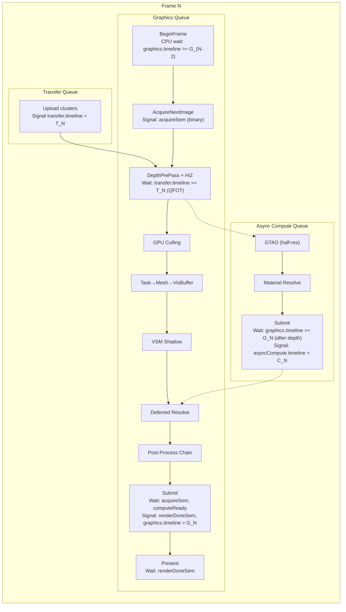
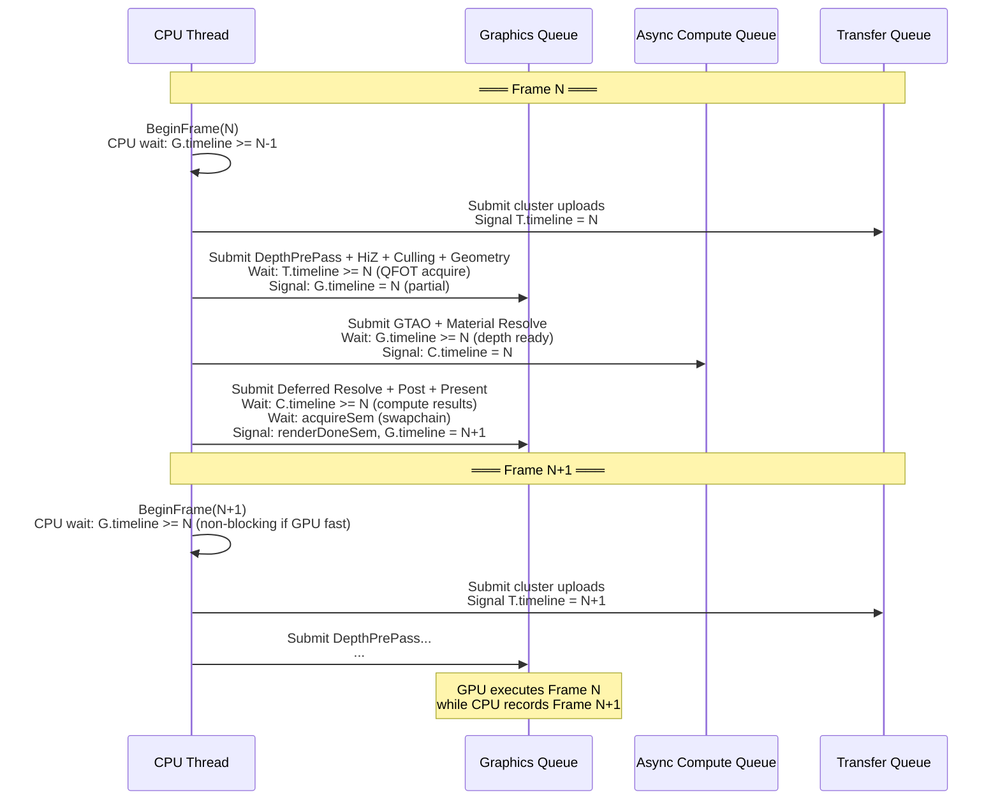
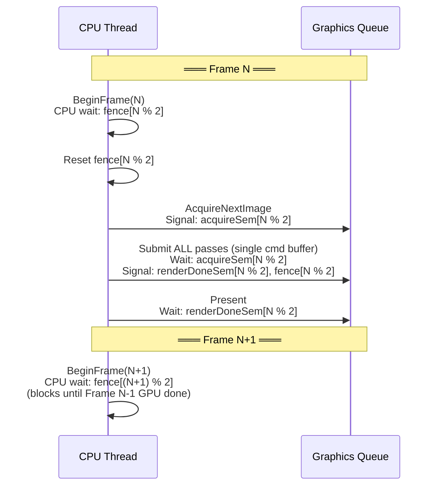
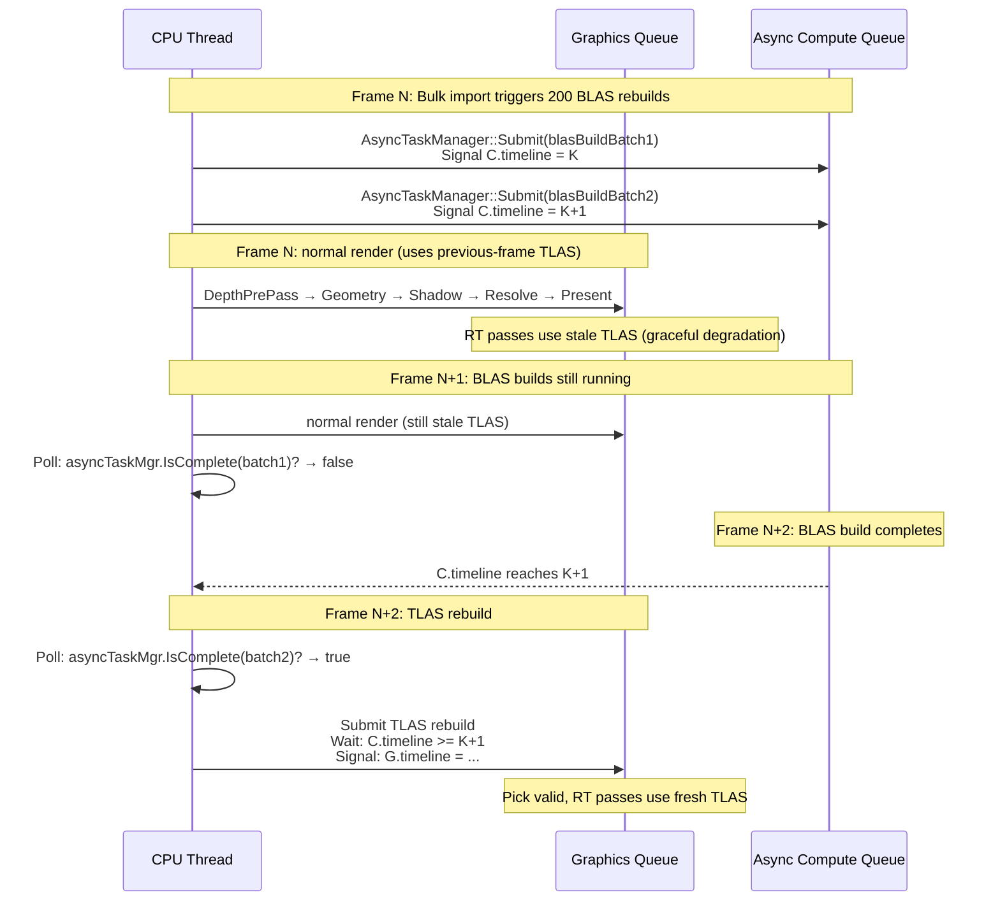
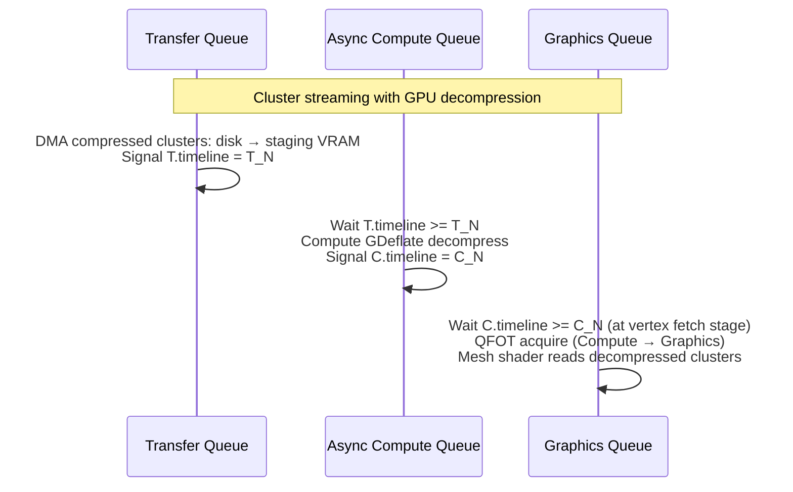
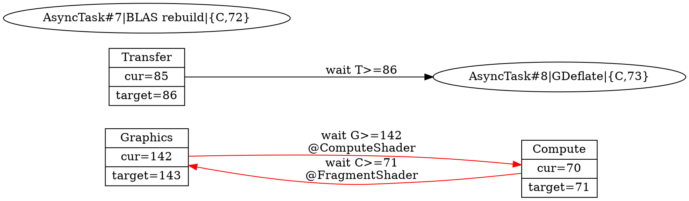

# Frame Synchronization & GPU/CPU Pipelining Architecture

> **Status**: Design blueprint
> **Scope**: FrameManager, multi-queue synchronization, frame pipelining, deferred destruction, per-tier sync strategies
> **Namespace**: `miki::rhi` (sync primitives), `miki::frame` (frame orchestration)
> **Depends on**: `specs/01-window-manager.md` (SurfaceManager), `specs/02-rhi-design.md` (§7, §9 sync primitives)
> **Target**: `specs/rendering-pipeline-architecture.md` — all 88 passes, 3-queue overlap, <16.7ms frame budget

---

## 1. Design Goals

| #   | Goal                                            | Rationale                                                                                                      |
| --- | ----------------------------------------------- | -------------------------------------------------------------------------------------------------------------- |
| G1  | **Maximum CPU/GPU overlap**                     | CPU frame N+1 recording overlaps GPU frame N execution; CPU never idle-waits except at frame pacing boundary   |
| G2  | **Multi-queue parallelism**                     | Graphics, Async Compute, Transfer queues run concurrently with fine-grained timeline semaphore synchronization |
| G3  | **Zero VkFence on Tier1**                       | Timeline semaphores replace all CPU↔GPU sync on Tier1; VkFence only for Compat tier swapchain                  |
| G4  | **Per-surface frame pacing**                    | Each window has independent frame cadence; no global WaitIdle except shutdown                                  |
| G5  | **Deterministic frame timing**                  | Bounded worst-case CPU stall; no unbounded GPU pipeline depth                                                  |
| G6  | **Deferred destruction with zero ref-counting** | 2-frame latency destruction queue; no atomic ref-counts in hot path                                            |
| G7  | **Tier-adaptive**                               | T1 uses timeline semaphores + 3 queues; T2 uses binary semaphores + 1 queue; T3/T4 use implicit sync           |

### 1.1 Non-Goals

- **RenderGraph pass scheduling**: RenderGraph decides pass ordering. This document covers frame-level pipelining, not intra-frame pass dependencies.
- **Barrier insertion**: RenderGraph's responsibility. FrameManager provides sync primitives; barrier placement is external.
- **Command buffer pooling**: Separate concern (CommandBufferAllocator), not covered here.

---

## 2. Architecture Overview

### 2.1 Core Abstraction Stack

```
┌──────────────────────────────────────────────────────────────────┐
│                      Application / RenderGraph                    │
│   "Record frame N+1 while GPU executes frame N"                  │
├──────────────────────────────────────────────────────────────────┤
│                        FrameOrchestrator                          │
│   Per-window FrameManager + global deferred destruction           │
│   + StagingRing lifecycle + ReadbackRing lifecycle                │
├──────────────────────────────────────────────────────────────────┤
│                         FrameManager                              │
│   Timeline-first frame pacing: BeginFrame / EndFrame              │
│   Windowed (RenderSurface) or Offscreen (timeline-only)           │
├──────────────────────────────────────────────────────────────────┤
│                        SyncScheduler                              │
│   Multi-queue timeline semaphore DAG                              │
│   Graphics ↔ AsyncCompute ↔ Transfer dependency resolution       │
├──────────────────────────────────────────────────────────────────┤
│                     RHI Sync Primitives                           │
│   TimelineSemaphore · BinarySemaphore · Fence (compat only)       │
│   QueueSubmit · QueuePresent                                      │
└──────────────────────────────────────────────────────────────────┘
```

### 2.2 Per-Tier Sync Model Summary

| Aspect                |               T1 Vulkan 1.4               |           T1 D3D12            |        T2 Compat         |      T3 WebGPU      |             T4 OpenGL              |
| --------------------- | :---------------------------------------: | :---------------------------: | :----------------------: | :-----------------: | :--------------------------------: |
| CPU↔GPU sync          |       Timeline semaphore (CPU wait)       |   `ID3D12Fence` (CPU wait)    |         VkFence          | `mapAsync` callback | `glFenceSync` + `glClientWaitSync` |
| GPU↔GPU sync          |            Timeline semaphore             |         `ID3D12Fence`         |     Binary semaphore     |      Implicit       |         `glMemoryBarrier`          |
| Swapchain acquire     |             Binary semaphore              |          N/A (DXGI)           |     Binary semaphore     |      Implicit       |         `glfwSwapBuffers`          |
| Swapchain present     |             Binary semaphore              |          `Present()`          |     Binary semaphore     |      Implicit       |         `glfwSwapBuffers`          |
| Async compute (帧内)  |         Timeline sem cross-queue          |      Compute queue fence      |   N/A (graphics queue)   | N/A (single queue)  |                N/A                 |
| Async compute (跨帧)  |     AsyncTaskManager + timeline poll      | AsyncTaskManager + fence poll | N/A (inline on graphics) |         N/A         |                N/A                 |
| Transfer queue        |         Timeline semaphore + QFOT         |       Copy queue fence        |           N/A            |         N/A         |                N/A                 |
| 3-queue chain (T→C→G) |        Timeline sem chain + 2×QFOT        |     Fence chain (no QFOT)     |           N/A            |         N/A         |                N/A                 |
| Frames in flight      |                    2-3                    |              2-3              |            2             |          1          |                 1                  |
| Compute queue count   | 1 (+ optional 2nd for priority isolation) |               1               |            0             |          0          |                 0                  |

---

## 3. Timeline Semaphore Unified Model (Tier1)

### 3.1 Design Rationale: Why Timeline-First

Timeline semaphores (Vulkan 1.2 core, D3D12 `ID3D12Fence` native) are strictly superior to binary semaphore + fence for frame pacing:

| Property                | Binary Sem + Fence                  | Timeline Semaphore                        |
| ----------------------- | ----------------------------------- | ----------------------------------------- |
| CPU↔GPU wait            | Separate VkFence per frame          | Same object, wait on value N              |
| GPU↔GPU wait            | 1:1 signal/wait pairing             | N:M fan-out/fan-in                        |
| Object count per frame  | 2 binary sems + 1 fence = 3 objects | 1 timeline sem (shared across all frames) |
| Out-of-order submission | Not supported                       | Supported (driver holds back)             |
| Multi-consumer          | Need N binary sems                  | Single timeline, multiple wait values     |
| CPU poll without stall  | `vkGetFenceStatus`                  | `vkGetSemaphoreCounterValue` (lock-free)  |

**Key insight**: A single timeline semaphore per queue replaces ALL per-frame fences and binary semaphores for GPU↔GPU sync. Binary semaphores are retained ONLY for swapchain acquire/present (Vulkan spec mandates binary for `vkAcquireNextImageKHR`/`vkQueuePresentKHR`).

### 3.2 Per-Queue Timeline Semaphore Assignment

```cpp
struct QueueTimelines {
    TimelineSemaphore graphics;      // Monotonic counter for graphics queue
    TimelineSemaphore asyncCompute;  // Monotonic counter for async compute queue
    TimelineSemaphore transfer;      // Monotonic counter for transfer/DMA queue
};
```

Each `Submit()` to a queue increments that queue's timeline value by 1. Cross-queue dependencies are expressed as "wait for queue X's timeline to reach value V".

### 3.3 Signal/Wait Node Graph — Tier1 Single Frame



### 3.4 Timeline Value Assignment Strategy

```
Frame 0:  graphics.signal(1),   compute.signal(1),   transfer.signal(1)
Frame 1:  graphics.signal(2),   compute.signal(2),   transfer.signal(2)
Frame N:  graphics.signal(N+1), compute.signal(N+1), transfer.signal(N+1)

CPU wait at BeginFrame(N):
  graphics.timeline >= (N+1) - framesInFlight
  = (N+1) - 2 = N-1  (for 2 frames in flight)

This ensures at most 2 frames are in-flight on the graphics queue.
```

**D3D12 mapping**: `ID3D12Fence` is inherently a timeline fence. The same value scheme applies directly. `ID3D12Fence::Signal(value)` on command queue = timeline signal. `ID3D12Fence::SetEventOnCompletion(value, event)` = timeline CPU wait.

---

## 4. FrameManager Design

### 4.1 API

```cpp
namespace miki::frame {

class FrameManager {
public:
    static constexpr uint32_t kMaxFramesInFlight = 3;
    static constexpr uint32_t kDefaultFramesInFlight = 2;

    ~FrameManager();

    FrameManager(const FrameManager&) = delete;
    auto operator=(const FrameManager&) -> FrameManager& = delete;
    FrameManager(FrameManager&&) noexcept;
    auto operator=(FrameManager&&) noexcept -> FrameManager&;

    /// @brief Create a windowed FrameManager bound to a RenderSurface.
    [[nodiscard]] static auto Create(
        rhi::IDevice& device,
        rhi::RenderSurface& surface,
        uint32_t framesInFlight = kDefaultFramesInFlight
    ) -> core::Result<FrameManager>;

    /// @brief Create an offscreen FrameManager (timeline-only, no swapchain).
    [[nodiscard]] static auto CreateOffscreen(
        rhi::IDevice& device,
        uint32_t width, uint32_t height,
        uint32_t framesInFlight = kDefaultFramesInFlight
    ) -> core::Result<FrameManager>;

    // ── Frame lifecycle ─────────────────────────────────────────

    /// @brief Begin a new frame.
    /// T1: CPU waits on timeline semaphore for oldest in-flight frame.
    /// T2: CPU waits on VkFence for oldest in-flight frame.
    /// T3/T4: Implicit sync (blocking present).
    /// Then acquires swapchain image (windowed) or advances offscreen slot.
    [[nodiscard]] auto BeginFrame() -> core::Result<FrameContext>;

    /// @brief Submit recorded command buffers and present.
    /// Multi-submit variant: accepts multiple command buffers for
    /// multi-threaded recording (one per recording thread).
    [[nodiscard]] auto EndFrame(std::span<rhi::ICommandBuffer*> cmdBuffers)
        -> core::Result<void>;

    /// @brief Single command buffer convenience overload.
    [[nodiscard]] auto EndFrame(rhi::ICommandBuffer& cmd)
        -> core::Result<void>;

    // ── Async compute integration ───────────────────────────────

    /// @brief Get a sync point for async compute to wait on.
    /// Returns {timeline semaphore, value} that the compute queue should
    /// wait before reading graphics queue outputs (e.g., depth buffer).
    [[nodiscard]] auto GetGraphicsSyncPoint() const noexcept
        -> rhi::TimelineSyncPoint;

    /// @brief Register an async compute completion for this frame.
    /// Graphics queue will wait on this before proceeding to
    /// passes that depend on compute results (e.g., Deferred Resolve).
    auto SetComputeSyncPoint(rhi::TimelineSyncPoint point) noexcept -> void;

    // ── Transfer queue integration ──────────────────────────────

    /// @brief Register a transfer completion for this frame.
    /// Graphics queue will wait on this at the appropriate stage.
    auto SetTransferSyncPoint(rhi::TimelineSyncPoint point) noexcept -> void;

    // ── Resource lifecycle hooks ────────────────────────────────

    auto SetStagingRing(resource::StagingRing* ring) noexcept -> void;
    auto SetReadbackRing(resource::ReadbackRing* ring) noexcept -> void;
    auto SetDeferredDestructor(DeferredDestructor* destructor) noexcept -> void;

    // ── Resize / reconfigure ────────────────────────────────────

    [[nodiscard]] auto Resize(uint32_t w, uint32_t h) -> core::Result<void>;
    [[nodiscard]] auto Reconfigure(const rhi::RenderSurfaceConfig& cfg)
        -> core::Result<void>;

    // ── Queries ─────────────────────────────────────────────────

    [[nodiscard]] auto FrameIndex() const noexcept -> uint32_t;
    [[nodiscard]] auto FrameNumber() const noexcept -> uint64_t;
    [[nodiscard]] auto FramesInFlight() const noexcept -> uint32_t;
    [[nodiscard]] auto IsWindowed() const noexcept -> bool;
    [[nodiscard]] auto GetSurface() const noexcept -> rhi::RenderSurface*;

    /// @brief Get the timeline value that will be signaled at EndFrame.
    [[nodiscard]] auto CurrentTimelineValue() const noexcept -> uint64_t;

    /// @brief Non-blocking query: is the GPU done with frame N?
    [[nodiscard]] auto IsFrameComplete(uint64_t frameNumber) const noexcept -> bool;

    auto WaitAll() -> void;

private:
    struct Impl;
    std::unique_ptr<Impl> impl_;
    explicit FrameManager(std::unique_ptr<Impl> impl);
};

} // namespace miki::frame
```

### 4.2 FrameContext

```cpp
struct FrameContext {
    uint32_t      frameIndex;       // [0, framesInFlight) for resource rotation
    uint64_t      frameNumber;      // Monotonic, never wraps
    TextureHandle swapchainImage;   // Invalid if offscreen
    uint32_t      width;
    uint32_t      height;

    // Sync state for this frame (opaque to caller, used by EndFrame)
    uint64_t      graphicsTimelineTarget;  // Value to signal on graphics queue
    uint64_t      transferWaitValue;       // Transfer timeline to wait (0 = none)
    uint64_t      computeWaitValue;        // Compute timeline to wait (0 = none)
};
```

### 4.3 Changes vs miki FrameManager

| Aspect                 | miki FrameManager                                     | This Design                                          |
| ---------------------- | ----------------------------------------------------- | ---------------------------------------------------- |
| Sync model             | Mixed: timeline for Tier1/offscreen, fence for compat | Timeline-first; fence emulated on T2 via wrapper     |
| Multi-submit           | Single `ICommandBuffer&`                              | `span<ICommandBuffer*>` for multi-threaded recording |
| Async compute          | Not integrated (caller manages)                       | First-class `Get/SetComputeSyncPoint`                |
| Transfer queue         | Injected via `SetTransferQueue`                       | Injected via `SetTransferSyncPoint` (decoupled)      |
| Deferred destruction   | Not integrated                                        | `SetDeferredDestructor` hook                         |
| Frame completion query | None                                                  | `IsFrameComplete()` for non-blocking poll            |
| WaitAll                | `device->WaitIdle()` (global stall)                   | Per-surface timeline wait (surgical)                 |

---

## 5. Multi-Queue Synchronization — Detailed Timeline Diagrams

### 5.1 Tier1: 3-Queue Full Pipeline (Steady State)

This diagram shows two consecutive frames with all three queues active, illustrating maximum CPU/GPU overlap.



### 5.2 Tier1: Detailed Per-Pass Signal/Wait Map

| Pass                   | Queue             | Waits On                                      | Signals                                      |
| ---------------------- | ----------------- | --------------------------------------------- | -------------------------------------------- |
| **BeginFrame**         | CPU               | `G.timeline >= frameNum - framesInFlight + 1` | —                                            |
| Cluster Upload         | Transfer          | —                                             | `T.timeline = frameNum`                      |
| DepthPrePass + HiZ     | Graphics          | `T.timeline >= frameNum` (if uploads)         | —                                            |
| GPU Culling            | Graphics          | (after DepthPrePass, in-queue order)          | —                                            |
| Macro-Binning          | Graphics          | (after Culling)                               | —                                            |
| Task→Mesh→VisBuffer    | Graphics          | (after Binning)                               | `G.timeline = frameNum` (partial signal)     |
| **GTAO**               | **Async Compute** | `G.timeline >= frameNum` (depth ready)        | —                                            |
| **Material Resolve**   | **Async Compute** | (after GTAO, in-queue order)                  | `C.timeline = frameNum`                      |
| VSM Shadow             | Graphics          | (after geometry, in-queue order)              | —                                            |
| Deferred Resolve       | Graphics          | `C.timeline >= frameNum` (AO + materials)     | —                                            |
| SSR → Bloom → DoF → MB | Graphics          | (in-queue order)                              | —                                            |
| Tone Map → TAA → FSR   | Graphics          | (in-queue order)                              | —                                            |
| Compositor             | Graphics          | (in-queue order)                              | —                                            |
| **EndFrame Submit**    | Graphics          | `acquireSem` (swapchain)                      | `renderDoneSem`, `G.timeline = frameNum + 1` |
| **Present**            | Graphics          | `renderDoneSem`                               | —                                            |

### 5.3 Partial Timeline Signals (Split Submit)

关键优化：一帧内 Graphics Queue 的工作被分为多次 Submit，每次 Submit 可以推进 timeline 到不同的中间值。这让 Async Compute 可以更早开始工作。

```
Graphics Queue submits for Frame N:
  Submit #1: DepthPrePass + HiZ + Culling + Geometry
    Signal: G.timeline = 2*N    (even = "geometry done")

  Submit #2: Deferred Resolve + Post + Present
    Wait:   C.timeline >= N     (compute results ready)
    Wait:   acquireSem          (swapchain image ready)
    Signal: renderDoneSem       (for present)
    Signal: G.timeline = 2*N+1  (odd = "frame done")

Async Compute submit for Frame N:
  Wait: G.timeline >= 2*N      (geometry done, depth available)
  Signal: C.timeline = N

CPU BeginFrame(N+2) waits:
  G.timeline >= 2*(N+2) - 2*framesInFlight + 1 = 2*N + 1 (frame N done)
```

这种 split-submit 模式让 Async Compute 在 Graphics 完成 geometry 后立即启动，而不必等待整帧完成。GTAO 和 Material Resolve 与 VSM Shadow rendering 并行执行。

### 5.4 Tier2: Single Queue + Binary Semaphore



**Sync objects (T2)**:

- 2× `VkFence` (per frame-in-flight slot)
- 2× `VkSemaphore` binary (acquire)
- 2× `VkSemaphore` binary (render done)

### 5.5 Tier3/Tier4: Implicit Sync

```
WebGPU:
  device.queue.submit([commandBuffer])
  // Implicit queue ordering; no explicit semaphores
  // Frame pacing via requestAnimationFrame() or wgpu surface present

OpenGL:
  // All commands serialized on single GL context
  glFinish() or glfwSwapBuffers() provides implicit sync
  // Frame pacing via swap interval (vsync)
```

### 5.6 Long-Running Async Compute Tasks

§5.1–5.3 覆盖的是 **帧内** compute（GTAO、Material Resolve），在 BeginFrame/EndFrame 生命周期内完成。但 `rendering-pipeline-architecture.md` 要求的 async compute 使用远不止于此——存在多个 **跨帧** 长时间 compute 任务，必须与帧内渲染并行但不阻塞帧节奏。

#### 5.6.1 跨帧 Compute 场景清单

| #   | 场景                                              | 来源                                     | 耗时                      | 特征                                              |
| --- | ------------------------------------------------- | ---------------------------------------- | ------------------------- | ------------------------------------------------- |
| A   | **BLAS Async Rebuild** (bulk import, >100 bodies) | rendering-pipeline §15.4                 | 5-50ms (spans 1-3 frames) | 跨帧；Graphics 使用 previous-frame TLAS，不 stall |
| B   | **BLAS Overflow Spill** (>2 bodies/frame inline)  | rendering-pipeline §15.4 budget overflow | 1-5ms/body                | 溢出到 compute queue 避免帧时间 spike             |
| C   | **Compute GDeflate 解压**                         | rendering-pipeline §5.8.1 path 2         | 2-5ms per batch           | Transfer→Compute→Graphics 3-queue chain           |
| D   | **Wavelet Pre-Decode** (Phase 14+)                | rendering-pipeline §5.8.2                | 1-3ms                     | 与 DepthPrePass 并行，需 split-submit 精确 wait   |
| E   | **GPU QEM Simplification** (offline)              | rendering-pipeline Pass #82              | ~50ms                     | 离线任务，不绑定帧节奏                            |

这些场景的共同特征：**compute 提交与帧节奏解耦**。不能用 §5.3 的 `SetComputeSyncPoint` 一帧一次模型处理。

#### 5.6.2 AsyncTask 抽象

```cpp
namespace miki::frame {

/// @brief Handle to a long-running async compute task.
/// Tracks completion via timeline semaphore, independent of frame lifecycle.
struct AsyncTaskHandle {
    uint64_t id = 0;
    [[nodiscard]] constexpr auto IsValid() const noexcept -> bool { return id != 0; }
};

/// @brief Manages long-running compute tasks on the async compute queue.
/// Tasks are submitted independently of frame BeginFrame/EndFrame cycle.
/// Graphics queue polls or waits on task completion at its own pace.
class AsyncTaskManager {
public:
    /// @brief Submit a long-running compute task.
    /// The task's command buffer is submitted to the async compute queue
    /// with optional waits on other queues.
    /// @return Handle for polling completion.
    [[nodiscard]] auto Submit(
        rhi::ICommandBuffer& cmd,
        std::span<const rhi::TimelineSyncPoint> waits = {}
    ) -> core::Result<AsyncTaskHandle>;

    /// @brief Non-blocking poll: is this task done?
    [[nodiscard]] auto IsComplete(AsyncTaskHandle task) const noexcept -> bool;

    /// @brief Get the timeline sync point signaled when task completes.
    /// Graphics queue can wait on this to consume task results.
    [[nodiscard]] auto GetCompletionPoint(AsyncTaskHandle task) const noexcept
        -> rhi::TimelineSyncPoint;

    /// @brief Blocking wait for a task to complete (CPU stall).
    /// Use sparingly — only for shutdown or mandatory sync.
    auto WaitForCompletion(AsyncTaskHandle task, uint64_t timeoutNs = UINT64_MAX)
        -> core::Result<void>;

    /// @brief Cancel all pending tasks and wait for GPU idle on compute queue.
    auto Shutdown() -> void;

private:
    struct TaskEntry {
        AsyncTaskHandle handle;
        rhi::TimelineSyncPoint completionPoint; // {computeTimeline, value}
    };
    std::vector<TaskEntry> activeTasks_;
    rhi::TimelineSemaphore computeTimeline_;  // Shared with SyncScheduler
    uint64_t nextTaskId_ = 1;
};

} // namespace miki::frame
```

#### 5.6.3 BLAS Async Rebuild 时序图



**关键设计点**:

- Graphics queue **从不等待** BLAS build 完成——使用 previous-frame TLAS 继续渲染
- CPU 每帧 poll `IsComplete()`，完成后在下一帧 graphics submit 中注入 wait
- `PickResult::Stale` 告知应用 pick 结果基于旧 TLAS，可能不精确

#### 5.6.4 Budget Overflow Spill

```
Interactive edit path (per frame):
  If dirtyBodies <= 2:
    BLAS rebuild inline on Graphics queue (1-5ms, acceptable)
  If dirtyBodies > 2:
    Rebuild first 2 inline
    Spill remaining to AsyncTaskManager::Submit()
    Next frames: poll completion → TLAS rebuild when ready
```

### 5.7 3-Queue Chain: Transfer → Compute → Graphics

GDeflate GPU 解压需要 Transfer、Compute、Graphics 三个队列串联工作。03-sync.md §5.1 只建模了 2-queue 交互，此处补充完整的 3-queue chain。

#### 5.7.1 GDeflate 解压时序图



#### 5.7.2 SyncScheduler 扩展：任意 Queue-Pair 依赖

原设计只支持 Graphics↔Compute 和 Graphics↔Transfer。3-queue chain 要求 **Transfer→Compute** 依赖。

```cpp
// SyncScheduler::AddDependency 已支持任意 queue pair:
//   AddDependency(waitQueue, signalQueue, signalValue, waitStage)
//
// 3-queue chain 使用示例:

// Step 1: Transfer uploads compressed data
auto transferDone = scheduler.AllocateSignal(QueueType::Transfer);
transferQueue.Submit(uploadCmd, {}, transferDone);
scheduler.CommitSubmit(QueueType::Transfer);

// Step 2: Compute decompresses (waits on Transfer)
scheduler.AddDependency(QueueType::Compute, QueueType::Transfer,
                        transferDone, PipelineStage::ComputeShader);
auto decompDone = scheduler.AllocateSignal(QueueType::Compute);
computeQueue.Submit(decompCmd, scheduler.GetPendingWaits(QueueType::Compute),
                    decompDone);
scheduler.CommitSubmit(QueueType::Compute);

// Step 3: Graphics reads decompressed data (waits on Compute)
scheduler.AddDependency(QueueType::Graphics, QueueType::Compute,
                        decompDone, PipelineStage::VertexInput);
// ... graphics submit picks up this wait automatically
```

#### 5.7.3 QFOT (Queue Family Ownership Transfer) for 3-Queue Chain

Vulkan 要求跨 queue family 的 buffer/image 访问必须做 ownership transfer。3-queue chain 需要两次 QFOT：

```
Transfer Queue (release):
  BufferBarrier { srcQueue=Transfer, dstQueue=Compute, srcAccess=TransferWrite, dstAccess=None }

Compute Queue (acquire + process + release):
  BufferBarrier { srcQueue=Transfer, dstQueue=Compute, srcAccess=None, dstAccess=ShaderRead }
  ... decompress ...
  BufferBarrier { srcQueue=Compute, dstQueue=Graphics, srcAccess=ShaderWrite, dstAccess=None }

Graphics Queue (acquire):
  BufferBarrier { srcQueue=Compute, dstQueue=Graphics, srcAccess=None, dstAccess=ShaderRead }
```

D3D12 不需要 QFOT——资源在所有 queue 类型间隐式共享。WebGPU/OpenGL 无多队列。

### 5.8 一帧内多 Compute Submit

§5.3 的 split-submit 模型假设一帧内只有一个 compute submit 点。实际上，帧内 compute 工作（GTAO + Material Resolve）和跨帧 async task（BLAS rebuild）可能在同一帧共存于 compute queue。

#### 5.8.1 Compute Queue 时间槽模型

```
Compute Queue timeline for Frame N:

  [BLAS rebuild batch (from AsyncTaskManager, long-running)]
  |______|______|    <- spans multiple frames, low priority

  [GTAO (frame-sync, from FrameManager)]
  |__|                <- 1ms, high priority, must finish before Deferred Resolve

  [Material Resolve (frame-sync)]
  |__|                <- 1ms, sequential after GTAO

Submission order on compute queue:
  1. AsyncTaskManager submits BLAS rebuilds (no frame waits, just Transfer waits)
  2. FrameManager submits GTAO+MatResolve (waits on G.timeline for depth)

Both share the same compute timeline semaphore.
Values are allocated independently:
  BLAS batch: C.timeline = 100, 101, 102, ...
  Frame GTAO: C.timeline = 103 (allocated by SyncScheduler)

Graphics queue waits on C.timeline >= 103 (GTAO done),
NOT on 102 (BLAS done — that's polled separately).
```

#### 5.8.2 Priority & Preemption

Vulkan/D3D12 compute queues 不保证 preemption。长时间 BLAS rebuild 可能延迟帧内 GTAO 启动。

**关键约束**：`VK_EXT_global_priority` / `VK_KHR_global_priority` 是 per-queue 属性（创建时固定），不能对同一 queue 上的不同 submit 设不同 priority。要真正隔离帧内和跨帧 compute 任务，需要两个不同 priority 的 compute queue。

#### Hardware Capability 4-Level 降级链

设备初始化时检测硬件能力，选择最高可用 level：

| Level | 条件                                                 | 帧内 Compute Queue       | Async Task Queue             | 最大帧内延迟               |
| ----- | ---------------------------------------------------- | ------------------------ | ---------------------------- | -------------------------- |
| **A** | 2+ compute queue families + `VK_EXT_global_priority` | Compute Queue 0 (`HIGH`) | Compute Queue 1 (`MEDIUM`)   | 0ms (物理隔离)             |
| **B** | 1 compute queue + `VK_EXT_global_priority`           | Compute Queue (`HIGH`)   | 同一 queue，batch split ≤2ms | ≤2ms (preemption 依赖硬件) |
| **C** | 1 compute queue，无 priority                         | Compute Queue            | 同一 queue，batch split ≤2ms | ≤2ms (纯 batch splitting)  |
| **D** | 无 compute queue (T2/T3/T4)                          | Graphics Queue           | Graphics Queue idle 时段     | N/A (串行)                 |

```cpp
enum class ComputeQueueLevel : uint8_t {
    A_DualQueuePriority,   // 2 queues + priority isolation
    B_SingleQueuePriority, // 1 queue + global priority HIGH
    C_SingleQueueBatch,    // 1 queue + batch splitting only
    D_GraphicsOnly,        // no compute queue (T2/T3/T4)
};

auto DetectComputeQueueLevel(const rhi::GpuCapabilityProfile& caps)
    -> ComputeQueueLevel
{
    if (caps.computeQueueFamilyCount >= 2 && caps.hasGlobalPriority)
        return ComputeQueueLevel::A_DualQueuePriority;
    if (caps.hasAsyncCompute && caps.hasGlobalPriority)
        return ComputeQueueLevel::B_SingleQueuePriority;
    if (caps.hasAsyncCompute)
        return ComputeQueueLevel::C_SingleQueueBatch;
    return ComputeQueueLevel::D_GraphicsOnly;
}
```

**硬件覆盖实测** (2026)：

| GPU                    | Level | 依据                                                          |
| ---------------------- | ----- | ------------------------------------------------------------- |
| NVIDIA RTX 50 系列     | B     | 1 compute queue family, global priority 需管理员权限          |
| NVIDIA RTX 40/30 系列  | C     | global priority 需管理员/Linux CAP_SYS_NICE                   |
| AMD RDNA3/RDNA2        | A     | 2+ compute queue families, Mesa RADV 全面支持 global priority |
| Intel Arc (Alchemist+) | C     | 1 compute queue, 无 global priority                           |
| Apple M3/M4 (MoltenVK) | D     | 无 async compute queue                                        |
| WebGPU / OpenGL        | D     | 单队列                                                        |

**Batch splitting 是必须的 (Level A/B/C 均需)**。即使 Level A 有物理隔离，BLAS rebuild 的 ≤2ms batch 也有利于 GPU 调度器——避免 CU 被单个超长 dispatch 独占导致整体吞吐下降。

D3D12 映射：

| Level | D3D12 等价                                                                                      |
| ----- | ----------------------------------------------------------------------------------------------- |
| A     | 2 个 `ID3D12CommandQueue` (COMPUTE type)，分别设 `D3D12_COMMAND_QUEUE_PRIORITY_HIGH` / `NORMAL` |
| B     | 1 个 COMPUTE queue，`PRIORITY_HIGH`                                                             |
| C     | 1 个 COMPUTE queue，`PRIORITY_NORMAL` + batch split                                             |
| D     | 无 COMPUTE queue，graphics-only                                                                 |

### 5.9 Wavelet Pre-Decode Overlap with DepthPrePass

```
Graphics Queue:
  Submit #1: [DepthPrePass 0.5ms] → Signal G.timeline = 2*N (geometry partial)

Compute Queue:
  [Wavelet DWT decode 1-3ms]
  No wait on Graphics — decode starts immediately at frame begin
  Signal C.timeline = C_decode

Graphics Queue:
  Submit #2: [GPU Culling]
  Wait: C.timeline >= C_decode (decoded vertex positions ready)
  [Task→Mesh→VisBuffer (reads decoded positions)]
  ...
```

DepthPrePass 使用上一帧的 positions（或 lower-LOD fallback），不需要 decode 结果。Culling 和 Geometry 才需要。这让 decode 有 0.5ms+ 的时间 overlap。

---

## 6. Deferred Destruction System

### 6.1 Problem

GPU 可能仍在引用 CPU 已标记为"销毁"的资源。传统方案：

- **引用计数** (COM/shared_ptr): 热路径上的原子操作开销，ComPtr/shared_ptr 在 per-draw 路径不可接受
- **立即 WaitIdle + destroy**: 全局 stall，延迟 spike

### 6.2 Solution: Frame-Tagged Destruction Queue

```cpp
class DeferredDestructor {
public:
    /// @brief Queue a resource for deferred destruction.
    /// Resource will be destroyed when frame `tagFrame + latency` completes.
    template <typename HandleT>
    auto Enqueue(HandleT handle, uint64_t tagFrame) -> void;

    /// @brief Drain all resources tagged for frames <= completedFrame.
    /// Called by FrameManager at BeginFrame after CPU wait confirms
    /// GPU has finished the target frame.
    auto Drain(uint64_t completedFrame) -> void;

    /// @brief Drain ALL pending resources (shutdown path).
    auto DrainAll() -> void;

private:
    static constexpr uint32_t kDestructionLatency = 2; // frames

    struct PendingDestruction {
        uint64_t    targetFrame;    // Destroy when GPU finishes this frame
        HandleType  handleType;     // Buffer, Texture, Pipeline, etc.
        uint64_t    handleValue;    // Raw handle bits
    };

    // Per-frame-slot ring buffer (lock-free single-producer for main thread)
    std::vector<PendingDestruction> pending_;
    IDevice* device_;
};
```

### 6.3 Destruction Timing Diagram

```
Frame N:   User calls DestroyBuffer(h)
           → h enqueued with targetFrame = N + kDestructionLatency = N+2

Frame N+1: GPU may still be executing Frame N (using h)
           → h still alive

Frame N+2: GPU may still be executing Frame N+1
           → h still alive

Frame N+3: BeginFrame(N+3) waits for GPU frame N+1 complete
           → Drain(N+1): nothing (h.targetFrame = N+2 > N+1)

Frame N+4: BeginFrame(N+4) waits for GPU frame N+2 complete
           → Drain(N+2): destroy h (h.targetFrame = N+2 <= N+2) ✓
```

With `framesInFlight = 2` and `kDestructionLatency = 2`, destruction is guaranteed safe: the GPU has finished all commands referencing the resource.

### 6.4 Integration with FrameManager

```cpp
auto FrameManager::BeginFrame() -> Result<FrameContext> {
    // 1. CPU wait for oldest in-flight frame
    uint64_t completedFrame = frameNumber_ - framesInFlight_;
    WaitForTimeline(graphicsTimeline_, completedFrame + 1);

    // 2. Drain deferred destructions for completed frames
    if (deferredDestructor_) {
        deferredDestructor_->Drain(completedFrame);
    }

    // 3. Reclaim staging ring chunks
    if (stagingRing_) {
        stagingRing_->ReclaimCompleted(completedFrame);
    }

    // 4. Reclaim readback ring chunks
    if (readbackRing_) {
        readbackRing_->ReclaimCompleted(completedFrame);
    }

    // 5. Acquire swapchain image (windowed) or advance slot (offscreen)
    // ...
}
```

---

## 7. StagingRing & ReadbackRing Frame Integration

### 7.1 StagingRing (CPU→GPU Upload)

```
Per-frame ring buffer: 64MB default, persistent-mapped CpuToGpu memory.
Write pointer advances monotonically, wraps at capacity.
Each allocation is tagged with the frame number that will consume it.

Frame lifecycle:
  BeginFrame:  ReclaimCompleted(completedFrame) → reclaim chunks from 2+ frames ago
  App code:    ring.Allocate(size, align) → {cpuPtr, gpuOffset, size}
               memcpy(cpuPtr, data, size)
  EndFrame:    ring.FlushFrame(frameNumber) → tag all unflushed chunks

GPU-side: transfer queue copies from staging ring to destination buffers/textures.
```

#### 7.1.1 Upload 分级路由

StagingRing 的 64MB 容量针对每帧增量更新优化。超大数据（首次加载、bulk import）不应经过 ring——ring 动态扩容需要 fence 保护旧 buffer 生命周期，复杂度不合理。正确做法是 **按数据量分级路由**：

| 数据量          | 路由                     | 机制                                                                              | 典型场景                                       |
| --------------- | ------------------------ | --------------------------------------------------------------------------------- | ---------------------------------------------- |
| < 256KB         | **StagingRing**          | 环形缓冲区，零分配，帧内 reclaim                                                  | 每帧 dirty GpuInstance patch, uniform update   |
| 256KB – 64MB    | **StagingRing 大块模式** | 单次分配可能触发 wrap 等待回收；若剩余空间不足则 stall 等前帧 reclaim             | Cluster streaming batch, mip tile upload       |
| > 64MB          | **专用 staging buffer**  | `CreateBuffer(CpuToGpu, size)`，独立分配，DMA copy 后进入 DeferredDestructor 销毁 | 首次模型加载, bulk vertex/index upload         |
| > 256MB + ReBAR | **直写 VRAM**            | `HOST_VISIBLE \| DEVICE_LOCAL`，CPU `memcpy` 直达 VRAM，零 DMA copy               | ReBAR fast-path（§5.8.1），live editing 低延迟 |

```cpp
auto UploadManager::Upload(BufferHandle dst, const void* data, uint64_t size)
    -> core::Result<void>
{
    if (size <= kStagingRingThreshold) {               // 256KB
        // Path A: StagingRing (zero alloc, frame-paced reclaim)
        auto alloc = stagingRing_->Allocate(size, 16);
        memcpy(alloc.cpuPtr, data, size);
        // Transfer recorded at EndFrame
        return {};
    }

    if (size <= stagingRing_->Capacity()) {             // <= 64MB
        // Path B: StagingRing large block (may wait for reclaim)
        auto alloc = stagingRing_->AllocateBlocking(size, 16);
        memcpy(alloc.cpuPtr, data, size);
        return {};
    }

    if (rebarAvailable_ && size <= rebarBudget_) {      // ReBAR
        // Path D: Direct VRAM write (zero copy)
        auto mapped = device_->MapBuffer(dst);
        memcpy(*mapped, data, size);
        device_->UnmapBuffer(dst);
        return {};
    }

    // Path C: Dedicated staging buffer (one-shot)
    auto staging = device_->CreateBuffer({
        .size = size, .usage = BufferUsage::TransferSrc,
        .memory = MemoryLocation::CpuToGpu
    });
    auto mapped = device_->MapBuffer(*staging);
    memcpy(*mapped, data, size);
    device_->UnmapBuffer(*staging);
    // Record copy command; enqueue staging buffer for deferred destruction
    transferQueue_->RecordCopy(*staging, 0, dst, 0, size);
    deferredDestructor_->Enqueue(*staging, frameNumber_);
    return {};
}
```

**每帧正常工作量估算**（验证 64MB 充足性）：

```
GpuInstance dirty patches:  ~1000 × 128B  =   128 KB
Cluster streaming upload:   ~100  × 64KB  =  6.4  MB
Texture mip tile upload:    ~4    × 256KB =  1.0  MB
Uniform buffer updates:                      0.5  MB
─────────────────────────────────────────────────────
Total per frame:                            ~8 MB << 64 MB
```

64MB ring 在正常帧内有 8× 余量。仅 bulk import 场景需要 Path C/D。

### 7.2 ReadbackRing (GPU→CPU Readback)

```
Same design as StagingRing but GpuToCpu memory.
Used for: query results, screenshot, pick hit buffer, measurement results.

Frame lifecycle:
  BeginFrame:  ReclaimCompleted(completedFrame) → completed readback data now available to CPU
  App code:    ring.RequestReadback(gpuBuffer, offset, size) → futureHandle
  EndFrame:    Record CopyBufferToBuffer from GPU resource to readback ring

  2 frames later: CPU reads data from readback ring via futureHandle.Resolve()
```

### 7.3 Transfer Queue Async Upload Path (Tier1)

```
Tier1 optimization: buffer copies routed through dedicated transfer queue.
Texture copies stay on graphics queue (layout transitions needed).

Timeline semaphore ensures graphics queue waits for transfer completion:

Transfer Queue:
  CmdCopyBuffer(staging → gpu)   ×N
  Submit → Signal T.timeline = frameNum

Graphics Queue:
  Pipeline barrier (QFOT acquire: Transfer → Graphics)
  Wait T.timeline >= frameNum at PipelineStage::Transfer
  ... normal rendering ...
```

---

## 8. Multi-Window Frame Pacing

### 8.1 Independent Cadence

Each window has its own `FrameManager` with independent frame counter and timeline. Windows do NOT synchronize with each other — they can run at different frame rates.

```
Window A (3D viewport, 60fps):
  BeginFrame → record heavy pipeline → EndFrame → Present

Window B (property panel, 30fps):
  BeginFrame → record simple UI → EndFrame → Present
  (every other vsync)

Window C (tool window, on-demand):
  BeginFrame → record only when dirty → EndFrame → Present
```

### 8.2 Shared Device, Independent Surfaces

```
DeviceHandle (shared):
  └── graphics timeline semaphore (shared across all windows)
  └── compute timeline semaphore (shared)
  └── transfer timeline semaphore (shared)

Window A:
  └── FrameManager A
  └── RenderSurface A (VkSwapchainKHR A)
  └── Binary semaphores: acquireA[2], renderDoneA[2]

Window B:
  └── FrameManager B
  └── RenderSurface B (VkSwapchainKHR B)
  └── Binary semaphores: acquireB[2], renderDoneB[2]
```

**Critical**: The graphics timeline semaphore is shared. Submits from Window A and Window B both increment the same timeline. This ensures total ordering on the graphics queue, which is required by Vulkan (single queue per type). Each window's `EndFrame` signals the next value.

### 8.3 Multi-Window Timeline Interleaving

```
Time →
Graphics Queue:  [A:frame0] [B:frame0] [A:frame1] [A:frame2] [B:frame1] ...
G.timeline:         1          2          3          4          5

Window A tracks: submitted at G.timeline = {1, 3, 4, ...}
Window B tracks: submitted at G.timeline = {2, 5, ...}

Window A BeginFrame(N):
  Wait G.timeline >= A.lastSubmittedValue[N - framesInFlight]

Window B BeginFrame(M):
  Wait G.timeline >= B.lastSubmittedValue[M - framesInFlight]
```

Each window maintains its own ring of submitted timeline values, independent of other windows.

---

## 9. Cascade Destruction with GPU Safety

> **Cross-ref**: `specs/01-window-manager.md` §6 defines the cascade destruction protocol from the window/surface lifecycle perspective. This section specifies the **sync primitive mechanics** used during that protocol.

### 9.1 Per-Surface Timeline Wait (Replaces WaitIdle)

The cascade destruction protocol (01-window-manager.md §6) calls `FrameManager::WaitAll()` on each surface being destroyed. The implementation differs by tier:

| Tier      | `FrameManager::WaitAll()` implementation                                               | Stall scope                            |
| --------- | -------------------------------------------------------------------------------------- | -------------------------------------- |
| T1 Vulkan | `vkWaitSemaphores` on `{graphicsTimeline, lastSubmittedValue}`                         | Only this surface's in-flight frames   |
| T1 D3D12  | `ID3D12Fence::SetEventOnCompletion(lastSubmittedValue, event)` + `WaitForSingleObject` | Only this surface's in-flight frames   |
| T2 Compat | `vkWaitForFences` on this surface's per-slot fences                                    | Only this surface's 2 in-flight frames |
| T3/T4     | Implicit (single queue, blocking present already drained)                              | N/A                                    |

**Critical**: This is NOT `device->WaitIdle()`. Each window's FrameManager tracks its own ring of submitted timeline values (§8.3). WaitAll() waits only for the highest value this specific surface submitted. Other windows' GPU work is completely unaffected.

### 9.2 Destruction Sequence (Sync Details)

```
DestroyWindowCascade(parent):

  1. Get post-order descendant list: [grandchild, child, parent]

  2. For each window W in post-order:
     a. FrameManager(W).WaitAll()
        T1: vkWaitSemaphores({G.timeline, W.lastSubmittedValue})
            Blocks CPU until GPU finishes W's last submitted frame
            Duration: 0-16ms (at most one frame time)
            Other windows: UNAFFECTED (their submits continue executing)

     b. DeferredDestructor.Drain(W.lastSubmittedValue)
        Release any resources tagged for destruction by W's frames

     c. Destroy FrameManager(W)
        Release per-surface sync objects:
        T1: destroy binary semaphores (acquire/renderDone)
        T2: destroy per-slot VkFences + binary semaphores
        (timeline semaphore is device-global, NOT destroyed here)

     d. Destroy RenderSurface(W)
        vkDestroySwapchainKHR / IDXGISwapChain::Release / etc.

  3. Destroy OS windows (post-order, via WindowManager)
     IWindowBackend::DestroyNativeWindow(token)
     Remove from tree, increment generation
```

### 9.3 Safety Proof

Per-surface wait is safe because of the **cross-window content sharing rule** (01-window-manager.md §5.2.1):

1. No render pass reads another window's swapchain image → no cross-surface GPU dependency
2. Shared resources (textures, buffers, pipelines) are NOT destroyed during surface detach → only swapchain images and per-surface sync objects are released
3. Therefore, waiting for only the target surface's in-flight frames guarantees all GPU references to that surface's swapchain images have completed

**Worst-case stall**: Destroying a tree of N windows with 2 frames-in-flight: N × 16ms sequential waits. In practice, most surfaces have already drained (only the most recently presented surface may still have in-flight work), so typical stall is 0-16ms regardless of N.

### 9.4 Comparison with miki

| Aspect                         | miki                                | This design                                      |
| ------------------------------ | ----------------------------------- | ------------------------------------------------ |
| Sync mechanism                 | `device->WaitIdle()` (global stall) | Per-surface `FrameManager::WaitAll()` (surgical) |
| Stall duration                 | 50-200ms (all queues drain)         | 0-16ms per surface (only target surface drains)  |
| Impact on other windows        | **All windows stall**               | **Zero impact** on other windows                 |
| Cross-window swapchain reads   | Implicitly assumed possible         | Explicitly forbidden (§5.2.1 invariant)          |
| DeferredDestructor integration | None                                | Automatic drain at step 2b                       |

---

## 10. Tier-Specific Implementation Details

### 10.1 Tier1 Vulkan 1.4 — Maximum Performance

```cpp
struct Tier1SyncState {
    VkSemaphore graphicsTimeline;     // VK_SEMAPHORE_TYPE_TIMELINE
    VkSemaphore computeTimeline;      // VK_SEMAPHORE_TYPE_TIMELINE
    VkSemaphore transferTimeline;     // VK_SEMAPHORE_TYPE_TIMELINE

    // Per-surface swapchain sync (binary, Vulkan spec mandates)
    struct PerSurface {
        VkSemaphore acquireSem[kMaxFramesInFlight];    // Binary
        VkSemaphore renderDoneSem[kMaxFramesInFlight]; // Binary
    };

    uint64_t graphicsCounter = 0;
    uint64_t computeCounter = 0;
    uint64_t transferCounter = 0;
};
```

**Submit pattern (Tier1 Vulkan)**:

```cpp
// Graphics queue submit #1 (geometry)
VkSemaphoreSubmitInfo waitInfos[] = {
    {transferTimeline, transferCounter, VK_PIPELINE_STAGE_2_TRANSFER_BIT},
};
VkSemaphoreSubmitInfo signalInfos[] = {
    {graphicsTimeline, ++graphicsCounter, VK_PIPELINE_STAGE_2_ALL_GRAPHICS_BIT},
};
VkSubmitInfo2 submitGeometry = { .waitSemaphoreInfos = waitInfos, .signalSemaphoreInfos = signalInfos, ... };
vkQueueSubmit2(graphicsQueue, 1, &submitGeometry, VK_NULL_HANDLE);

// Async compute submit
VkSemaphoreSubmitInfo computeWait[] = {
    {graphicsTimeline, graphicsCounter, VK_PIPELINE_STAGE_2_COMPUTE_SHADER_BIT}, // wait for depth
};
VkSemaphoreSubmitInfo computeSignal[] = {
    {computeTimeline, ++computeCounter, VK_PIPELINE_STAGE_2_COMPUTE_SHADER_BIT},
};
VkSubmitInfo2 submitCompute = { ... };
vkQueueSubmit2(computeQueue, 1, &submitCompute, VK_NULL_HANDLE);

// Graphics queue submit #2 (resolve + post + present)
VkSemaphoreSubmitInfo resolveWait[] = {
    {computeTimeline, computeCounter, VK_PIPELINE_STAGE_2_FRAGMENT_SHADER_BIT},
    {acquireSem[frameIdx], 0, VK_PIPELINE_STAGE_2_COLOR_ATTACHMENT_OUTPUT_BIT},
};
VkSemaphoreSubmitInfo resolveSignal[] = {
    {renderDoneSem[frameIdx], 0, VK_PIPELINE_STAGE_2_ALL_COMMANDS_BIT},
    {graphicsTimeline, ++graphicsCounter, VK_PIPELINE_STAGE_2_ALL_COMMANDS_BIT},
};
VkSubmitInfo2 submitResolve = { ... };
vkQueueSubmit2(graphicsQueue, 1, &submitResolve, VK_NULL_HANDLE);

// Present
VkPresentInfoKHR present = { .waitSemaphoreCount = 1, .pWaitSemaphores = &renderDoneSem[frameIdx], ... };
vkQueuePresentKHR(graphicsQueue, &present);
```

### 10.2 Tier1 D3D12 — Native Timeline Fences

```cpp
struct Tier1D3D12SyncState {
    ComPtr<ID3D12Fence> graphicsFence;   // Inherently timeline
    ComPtr<ID3D12Fence> computeFence;
    ComPtr<ID3D12Fence> transferFence;

    HANDLE              fenceEvent;       // Shared event for CPU wait

    uint64_t graphicsCounter = 0;
    uint64_t computeCounter = 0;
    uint64_t transferCounter = 0;
};
```

**D3D12 Multi-Queue Resource Model**:

D3D12 与 Vulkan 在 multi-queue 方面有关键差异，影响 compute queue 使用模式：

| 方面              | Vulkan                           | D3D12                                       |
| ----------------- | -------------------------------- | ------------------------------------------- |
| 跨队列资源共享    | 需要 QFOT barrier                | 隐式共享 (同一 heap)                        |
| Command allocator | `VkCommandPool` per queue family | `ID3D12CommandAllocator` per queue **type** |
| 同时录制          | 不同 pool 可并行                 | 不同 allocator 可并行                       |
| Fence 语义        | Binary + Timeline 两种           | 只有 Timeline (`ID3D12Fence`)               |

D3D12 compute queue 需要专用的资源：

```cpp
struct D3D12ComputeQueueResources {
    ComPtr<ID3D12CommandQueue>     computeQueue;      // D3D12_COMMAND_LIST_TYPE_COMPUTE
    ComPtr<ID3D12CommandAllocator> frameAllocators[kMaxFramesInFlight];   // 帧内 GTAO/MatResolve
    ComPtr<ID3D12CommandAllocator> asyncAllocator;     // AsyncTaskManager 使用 (BLAS rebuild)
    ComPtr<ID3D12GraphicsCommandList> frameCmdList;    // 帧内 compute 复用
    ComPtr<ID3D12GraphicsCommandList> asyncCmdList;    // async task 复用
};
```

**关键点**：`ID3D12CommandAllocator` 只能在 GPU 消费完对应 command list 后 Reset。帧内 allocator 按 frame-in-flight slot 轮换（同 graphics）；async allocator 在 `AsyncTaskManager::IsComplete()` 确认后 Reset。

**Submit pattern (D3D12)**:

```cpp
// Execute command lists on graphics queue
graphicsQueue->ExecuteCommandLists(1, &cmdList);
graphicsQueue->Signal(graphicsFence.Get(), ++graphicsCounter);

// Compute queue waits for graphics, then executes frame-sync work
computeQueue->Wait(graphicsFence.Get(), graphicsCounter);
computeQueue->ExecuteCommandLists(1, &computeCmdList);  // GTAO + MatResolve
computeQueue->Signal(computeFence.Get(), ++computeCounter);

// Async BLAS rebuild (separate command list, no frame waits)
computeQueue->ExecuteCommandLists(1, &blasRebuildCmdList);
computeQueue->Signal(computeFence.Get(), ++computeCounter);  // separate value

// Graphics queue waits for frame-sync compute only (NOT BLAS)
graphicsQueue->Wait(computeFence.Get(), frameComputeValue);  // GTAO done
graphicsQueue->ExecuteCommandLists(1, &resolveCmdList);
graphicsQueue->Signal(graphicsFence.Get(), ++graphicsCounter);

// CPU wait at BeginFrame
if (graphicsFence->GetCompletedValue() < targetValue) {
    graphicsFence->SetEventOnCompletion(targetValue, fenceEvent);
    WaitForSingleObject(fenceEvent, INFINITE);
}

// CPU poll for async BLAS completion (non-blocking)
if (computeFence->GetCompletedValue() >= blasCompletionValue) {
    // BLAS ready — next frame can rebuild TLAS
}
```

### 10.3 Tier2 Vulkan Compat — Binary Semaphore + Fence

```cpp
struct Tier2SyncState {
    // Per frame-in-flight slot
    struct FrameSync {
        VkFence     inFlightFence;     // CPU↔GPU: wait before reuse
        VkSemaphore acquireSem;        // Binary: swapchain acquire
        VkSemaphore renderDoneSem;     // Binary: render → present
    };
    std::array<FrameSync, 2> frames;   // 2 frames in flight
};
```

No async compute, no transfer queue. Single graphics queue handles everything. This is the miki compat path, unchanged.

### 10.4 Tier3 WebGPU

```cpp
// WebGPU has implicit synchronization
// Frame pacing is controlled by requestAnimationFrame or surface present

wgpu::CommandEncoder encoder = device.CreateCommandEncoder();
// ... record passes ...
wgpu::CommandBuffer commands = encoder.Finish();
device.GetQueue().Submit(1, &commands);

// CPU-GPU sync for readback:
buffer.MapAsync(wgpu::MapMode::Read, 0, size, callback);
// callback fires when GPU is done
```

### 10.5 Tier4 OpenGL

```cpp
// OpenGL: implicit serialization on single context
// Frame pacing via swap interval

glBindFramebuffer(GL_FRAMEBUFFER, fbo);
// ... draw calls ...
glfwSwapBuffers(window);  // Implicit sync + present

// For readback (non-blocking via fence):
GLsync fence = glFenceSync(GL_SYNC_GPU_COMMANDS_COMPLETE, 0);
// ... later ...
GLenum result = glClientWaitSync(fence, GL_SYNC_FLUSH_COMMANDS_BIT, timeout);
```

---

## 11. Performance Analysis

### 11.1 CPU/GPU Overlap Budget

Target: 16.7ms frame time (60fps). GPU budget: ~13ms. CPU budget: ~3ms record + overhead.

```
Without pipelining (frames in flight = 1):
  Total: GPU_time + CPU_time = 13 + 3 = 16ms (barely meets 60fps)
  Any spike → frame drop

With 2 frames in flight:
  Total: max(GPU_time, CPU_time) = max(13, 3) = 13ms
  GPU is always busy (CPU finishes recording 10ms before GPU needs it)

With 3 frames in flight (aggressive):
  Same throughput as 2, but +16.7ms input latency
  Only justified if CPU recording occasionally spikes >16ms
```

**Recommended**: 2 frames in flight default. 3 frames in flight opt-in for CAE visualization with heavy CPU-side data preparation.

### 11.2 Async Compute Overlap Gain

```
Without async compute (single queue):
  Depth → Cull → Geometry → GTAO → MatResolve → Shadow → Resolve → Post
  Serial: 0.5 + 0.3 + 1.0 + 1.0 + 1.0 + 2.0 + 1.0 + 3.0 = 9.8ms

With async compute (GTAO + MatResolve overlapped with Shadow):
  Graphics: Depth → Cull → Geometry ─────────────→ Shadow → Resolve → Post
  Compute:                           → GTAO → Mat ─┘

  Graphics critical path: 0.5 + 0.3 + 1.0 + 2.0 + 1.0 + 3.0 = 7.8ms
  Compute:                                   1.0 + 1.0 = 2.0ms (overlapped)

  Savings: 2.0ms (20% of frame time)
```

### 11.3 Transfer Queue Overlap Gain

```
Without dedicated transfer:
  Graphics queue: upload 5ms → render 8ms = 13ms total
  (uploads stall the graphics pipeline)

With dedicated transfer:
  Transfer queue: upload 5ms (overlapped)
  Graphics queue: render 8ms
  Timeline semaphore: graphics waits transfer at first texture sample point

  If upload < render time: zero effective upload cost
  Typical CAD: 2MB dirty instance upload + 10MB streaming = ~1ms transfer
  Completely hidden behind 8ms render
```

### 11.4 Sync Object Cost

| Object            | Create Cost | Wait Cost (CPU)                     | Signal Cost (GPU)        |
| ----------------- | ----------- | ----------------------------------- | ------------------------ |
| Timeline Sem (Vk) | ~5μs        | ~0.1μs (spin) / ~10μs (kernel wait) | ~0ns (pipeline register) |
| ID3D12Fence       | ~5μs        | ~0.1μs (spin) / ~10μs (SetEvent)    | ~0ns (command processor) |
| VkFence           | ~5μs        | ~10μs (kernel wait, no spin path)   | ~0ns                     |
| Binary Sem (Vk)   | ~5μs        | N/A (GPU-only)                      | ~0ns                     |

Timeline semaphore CPU wait is significantly cheaper than VkFence because it supports spin-wait via `vkGetSemaphoreCounterValue()` — avoids kernel transition for short waits.

---

## 12. Error Recovery

### 12.1 Swapchain Out-of-Date

```
BeginFrame → AcquireNextImage returns SwapchainOutOfDate
  1. WaitAll() — drain in-flight frames for this surface
  2. surface.Configure({newWidth, newHeight, ...})
  3. Retry BeginFrame

No other windows affected. Per-surface recovery.
```

### 12.2 Device Lost

```
Any submit returns DeviceLost:
  1. All FrameManagers enter "dead" state (all operations return DeviceLost)
  2. Application must:
     a. Destroy all FrameManagers
     b. Destroy all RenderSurfaces
     c. Destroy device
     d. Recreate device + surfaces + frame managers
  3. Scene::RecreateGpuResources() rebuilds persistent state

Timeline semaphores are device-scope — device lost invalidates all.
```

### 12.3 Timeout & Deadlock Detection

```cpp
auto FrameManager::BeginFrame() -> Result<FrameContext> {
    constexpr uint64_t kTimeoutNs = 5'000'000'000; // 5 seconds

    auto waitResult = device_->WaitSemaphoreValue(
        graphicsTimeline_, targetValue, kTimeoutNs
    );

    if (!waitResult) {
        if (waitResult.error() == ErrorCode::Timeout) {
            // Log diagnostic: which frame is stuck, timeline values
            fprintf(stderr, "[FrameManager] GPU timeout! G.timeline=%llu, waiting for %llu\n",
                    device_->GetSemaphoreValue(graphicsTimeline_), targetValue);

            // Dump wait-graph for post-mortem analysis
            syncScheduler_->DumpWaitGraph(stderr);
            asyncTaskManager_->DumpActiveTaskState(stderr);

            // Attempt recovery: WaitIdle + reset
            device_->WaitIdle();
        }
        return std::unexpected(waitResult.error());
    }
    // ...
}
```

### 12.4 Wait-Graph Diagnostic Tool

3-queue timeline 死锁的排查极其困难——`vkGetSemaphoreCounterValue` 只能报告当前值，无法回答"谁在等谁"。`SyncScheduler` 内置 Wait-Graph 导出工具，在 timeout 或主动调用时输出完整依赖状态。

#### 12.4.1 API

```cpp
class SyncScheduler {
public:
    // ... existing API ...

    /// @brief Dump current wait-graph state to a stream.
    /// Includes: per-queue {currentValue, pendingSignalTarget, all pendingWaits},
    ///           per-AsyncTask {id, completionPoint, status}.
    /// Format: human-readable text + DOT graph.
    auto DumpWaitGraph(FILE* out) const -> void;

    /// @brief Export wait-graph as DOT/GraphViz format.
    /// Pipe to `dot -Tsvg wait_graph.dot -o wait_graph.svg` for visualization.
    auto ExportWaitGraphDOT(std::string& outDot) const -> void;

    /// @brief Export wait-graph as JSON (machine-readable, CI integration).
    auto ExportWaitGraphJSON(std::string& outJson) const -> void;
};
```

#### 12.4.2 Wait-Graph 内容

```
=== SyncScheduler Wait-Graph Dump ===
Timestamp: 2026-03-27T14:15:30.123Z

Queue States:
  Graphics:  current=142, pendingSignal=143, pendingWaits=[C>=71 @FragmentShader]
  Compute:   current=70,  pendingSignal=71,  pendingWaits=[G>=142 @ComputeShader]  ← CYCLE!
  Transfer:  current=85,  pendingSignal=86,  pendingWaits=[]

Active Async Tasks:
  Task#7 (BLAS rebuild batch): completionPoint={C, 72}, status=IN_FLIGHT
  Task#8 (GDeflate decode):    completionPoint={C, 73}, status=PENDING (wait T>=86)

Detected Issue:
  DEADLOCK: Graphics waits C>=71, but Compute waits G>=142.
  Graphics cannot advance to 143 until Compute reaches 71.
  Compute cannot advance to 71 until Graphics reaches 142.
  Root cause: submit ordering error — Compute submit should wait G>=141, not G>=142.
```

#### 12.4.3 DOT 格式输出示例



#### 12.4.4 实现策略

| 模式                 | 记录内容                                                                             | 开销           |
| -------------------- | ------------------------------------------------------------------------------------ | -------------- |
| **Release**          | 仅保留最近 16 次 submit 的 {queue, signalValue, waitValues[]}。环形缓冲区，固定 ~2KB | < 0.01ms/frame |
| **Debug/Validation** | 完整历史：所有 submit 记录 + 依赖链 + 调用栈 hash                                    | < 0.1ms/frame  |
| **Timeout 触发**     | 自动 dump Release 模式数据 + 死锁环检测（DFS on wait-graph adjacency）               | 一次性 ~1ms    |

死锁环检测算法：将每个 queue 的 pending wait 建模为有向边 (waitQueue → signalQueue)，DFS 检测环。O(V+E) 其中 V=3 queues, E≤9 edges，实际 < 1μs。

**行业参考**：D3D12 `DRED` (Device Removed Extended Data) 在 device lost 时 dump GPU breadcrumb 和 page fault 信息。Vulkan `VK_EXT_device_fault` 提供类似但更窄的覆盖。Wait-Graph 在应用层补足了跨队列死锁诊断这个空白。

---

## 13. SyncScheduler — Cross-Queue Dependency Resolution

### 13.1 Purpose

`SyncScheduler` is a lightweight helper that manages the timeline counters across queues. RenderGraph uses it to express inter-queue dependencies without manually tracking timeline values.

### 13.2 API

```cpp
class SyncScheduler {
public:
    /// @brief Allocate the next timeline value for a queue.
    [[nodiscard]] auto AllocateSignal(QueueType queue) -> uint64_t;

    /// @brief Record a dependency: `waitQueue` must wait for
    /// `signalQueue`'s timeline to reach `signalValue`.
    auto AddDependency(
        QueueType waitQueue,
        QueueType signalQueue,
        uint64_t signalValue,
        PipelineStage waitStage
    ) -> void;

    /// @brief Get all pending waits for a queue's next submit.
    [[nodiscard]] auto GetPendingWaits(QueueType queue)
        -> std::span<const TimelineSyncPoint>;

    /// @brief Get the signal value for a queue's next submit.
    [[nodiscard]] auto GetSignalValue(QueueType queue) -> uint64_t;

    /// @brief Clear pending state after submit.
    auto CommitSubmit(QueueType queue) -> void;

private:
    struct QueueState {
        TimelineSemaphore semaphore;
        uint64_t nextValue = 1;
        std::vector<TimelineSyncPoint> pendingWaits;
    };
    std::array<QueueState, 3> queues_; // Graphics, Compute, Transfer
};
```

### 13.3 Usage by RenderGraph

```cpp
// RenderGraph executor determines pass-to-queue assignment
auto& scheduler = frameOrchestrator.GetSyncScheduler();

// Transfer pass: cluster upload
uint64_t transferDone = scheduler.AllocateSignal(QueueType::Transfer);
transferQueue.Submit(uploadCmd, scheduler.GetSignalValue(QueueType::Transfer));
scheduler.CommitSubmit(QueueType::Transfer);

// Graphics pass: DepthPrePass needs upload results
scheduler.AddDependency(QueueType::Graphics, QueueType::Transfer, transferDone, PipelineStage::Transfer);

// Graphics pass group: Depth + Cull + Geometry
uint64_t geomDone = scheduler.AllocateSignal(QueueType::Graphics);
graphicsQueue.Submit(geomCmd, scheduler.GetPendingWaits(QueueType::Graphics), geomDone);
scheduler.CommitSubmit(QueueType::Graphics);

// Compute pass: GTAO + Material Resolve (waits for depth)
scheduler.AddDependency(QueueType::Compute, QueueType::Graphics, geomDone, PipelineStage::ComputeShader);
uint64_t computeDone = scheduler.AllocateSignal(QueueType::Compute);
computeQueue.Submit(computeCmd, scheduler.GetPendingWaits(QueueType::Compute), computeDone);
scheduler.CommitSubmit(QueueType::Compute);

// Graphics pass group: Resolve + Post (waits for compute)
scheduler.AddDependency(QueueType::Graphics, QueueType::Compute, computeDone, PipelineStage::FragmentShader);
// ... submit resolve + post ...
```

---

## 14. Complete Frame Timing Diagram (Tier1, 2 Frames In Flight)

```
Time (ms) →  0    2    4    6    8   10   12   14   16   18   20   22   24
             ├────┼────┼────┼────┼────┼────┼────┼────┼────┼────┼────┼────┤

CPU:         ┌─ Record Frame 0 ─┐┌─ Record Frame 1 ─┐┌─ Record Frame 2 ─┐
             │  Scene upload     ││  Scene upload     ││  Scene upload     │
             │  Build cmd bufs   ││  Build cmd bufs   ││  Build cmd bufs   │
             └──────3ms──────────┘└──────3ms──────────┘└──────3ms──────────┘

Transfer:    ┌─ Upload F0 ─┐     ┌─ Upload F1 ─┐     ┌─ Upload F2 ─┐
             └──── 1ms ────┘     └──── 1ms ────┘     └──── 1ms ────┘

Graphics:              ┌──── Frame 0 GPU ──────────┐
                       │ Depth+Cull+Geom → Shadow  │
                       │ → Resolve → Post → Present│
                       └───────── 13ms ────────────┘
                                          ┌──── Frame 1 GPU ──────────┐
                                          │ Depth+Cull+Geom → Shadow  │
                                          │ → Resolve → Post → Present│
                                          └───────── 13ms ────────────┘

Compute:               ┌──GTAO+Mat──┐
                       └──── 2ms ───┘
                                          ┌──GTAO+Mat──┐
                                          └──── 2ms ───┘

Effective frame time: max(CPU, GPU) = max(3, 13) = 13ms → 77fps
Input latency: 2 × 16.7ms = 33ms (2 frames)

Sync points (●=signal, ○=wait):
  T.timeline:  ●F0(1ms)               ●F1(14ms)
  G.timeline:  ○T≥1  ●geom(5ms)  ●done(14ms)   ○T≥2  ●geom(18ms)  ●done(27ms)
  C.timeline:        ○G≥geom  ●(7ms)                   ○G≥geom  ●(20ms)
               G:    ○C≥done(resolve)                   ○C≥done(resolve)
```

---

## 15. Design Decisions Log

| Decision                                         | Rationale                                                                                                                     | Alternatives Considered                                                                                                          |
| ------------------------------------------------ | ----------------------------------------------------------------------------------------------------------------------------- | -------------------------------------------------------------------------------------------------------------------------------- |
| Timeline semaphore as primary sync primitive     | Replaces VkFence + binary sem for CPU↔GPU; fewer objects, cheaper CPU wait, supports multi-consumer                           | VkFence per frame (object bloat, no fan-out), binary sem (1:1 limitation)                                                        |
| Split submit (2+ submits per frame on graphics)  | Enables async compute to start after geometry without waiting for full frame; enables wavelet decode overlap                  | Single monolithic submit (simple but no overlap), per-pass submit (too many submits, driver overhead)                            |
| Shared timeline semaphore across windows         | Required by single-queue-per-type Vulkan constraint; simplifies ordering                                                      | Per-window timeline (would need multi-queue, most GPUs have 1 graphics queue)                                                    |
| Per-surface frame pacing (no global WaitIdle)    | Cascade destruction doesn't stall other windows; independent frame rates                                                      | Global WaitIdle (simpler but kills all window throughput during cascade)                                                         |
| 2 frames in flight default                       | Best latency/throughput tradeoff; 3 adds latency with marginal throughput gain for typical workloads                          | 1 (no overlap, CPU idle), 3 (higher latency, marginal gain)                                                                      |
| Deferred destruction with 2-frame latency        | Matches frames-in-flight; no ref-counting in hot path; deterministic                                                          | COM ref-counting (atomic overhead), immediate destroy + WaitIdle (stall)                                                         |
| SyncScheduler as separate class                  | Decouples timeline management from FrameManager; RenderGraph can use directly                                                 | Embed in FrameManager (coupling), embed in RenderGraph (wrong layer)                                                             |
| AsyncTaskManager for cross-frame compute         | BLAS rebuild/GDeflate decode span 1-3 frames; cannot fit in BeginFrame/EndFrame lifecycle; poll-based completion avoids stall | Inline on graphics (frame spike), dedicated thread + CPU wait (wastes thread), RenderGraph multi-frame pass (overcomplicates RG) |
| SyncScheduler supports arbitrary queue-pair deps | GDeflate needs Transfer→Compute→Graphics 3-queue chain; not just Graphics↔{Compute,Transfer}                                  | Hardcode 2-queue paths (misses T→C link), merge Transfer+Compute (loses DMA parallelism)                                         |
| Batch splitting for compute queue fairness       | Long BLAS rebuild blocks frame-sync GTAO; ≤2ms batches bound worst-case frame-sync delay                                      | Queue priority (driver-dependent, not portable), 2nd compute queue (not always available)                                        |

---

## 16. File Map

| File                                         | Namespace     | Responsibility                                                                           |
| -------------------------------------------- | ------------- | ---------------------------------------------------------------------------------------- |
| `include/mitsuki/frame/FrameManager.h`       | `miki::frame` | Frame pacing: BeginFrame/EndFrame, timeline wait, surface integration                    |
| `include/mitsuki/frame/FrameContext.h`       | `miki::frame` | Per-frame state: index, number, swapchain image, dimensions                              |
| `include/mitsuki/frame/FrameOrchestrator.h`  | `miki::frame` | Multi-window frame orchestration, global deferred destruction                            |
| `include/mitsuki/frame/SyncScheduler.h`      | `miki::frame` | Cross-queue timeline dependency resolution (arbitrary queue-pair, including T→C→G chain) |
| `include/mitsuki/frame/AsyncTaskManager.h`   | `miki::frame` | Long-running cross-frame compute tasks (BLAS rebuild, GDeflate decode, GPU QEM)          |
| `include/mitsuki/frame/DeferredDestructor.h` | `miki::frame` | Frame-tagged resource destruction queue                                                  |
| `include/mitsuki/rhi/TimelineSyncPoint.h`    | `miki::rhi`   | `{SemaphoreHandle, uint64_t value}` pair                                                 |
| `src/mitsuki/frame/FrameManager.cpp`         | —             | Impl: timeline wait, acquire, submit, present                                            |
| `src/mitsuki/frame/SyncScheduler.cpp`        | —             | Impl: counter allocation, arbitrary queue-pair dependency tracking                       |
| `src/mitsuki/frame/AsyncTaskManager.cpp`     | —             | Impl: compute task submit, non-blocking poll, batch splitting                            |
| `src/mitsuki/frame/DeferredDestructor.cpp`   | —             | Impl: ring buffer drain                                                                  |

---

## Appendix A: Backend Sync Primitive Mapping

| RHI Concept         | Vulkan 1.4                   | D3D12                               | Vulkan Compat                    | WebGPU              | OpenGL             |
| ------------------- | ---------------------------- | ----------------------------------- | -------------------------------- | ------------------- | ------------------ |
| `TimelineSemaphore` | `VkSemaphore` (TIMELINE)     | `ID3D12Fence`                       | `VkSemaphore` (TIMELINE, if ext) | N/A                 | N/A                |
| `BinarySemaphore`   | `VkSemaphore` (BINARY)       | N/A                                 | `VkSemaphore` (BINARY)           | N/A                 | N/A                |
| `Fence` (CPU wait)  | Emulated via timeline sem    | `ID3D12Fence::SetEventOnCompletion` | `VkFence`                        | `mapAsync` callback | `glClientWaitSync` |
| CPU signal          | `vkSignalSemaphore`          | `ID3D12Fence::Signal` (CPU)         | N/A                              | N/A                 | N/A                |
| CPU poll            | `vkGetSemaphoreCounterValue` | `ID3D12Fence::GetCompletedValue`    | `vkGetFenceStatus`               | N/A                 | `glGetSynciv`      |
| Queue submit        | `vkQueueSubmit2`             | `ExecuteCommandLists` + `Signal`    | `vkQueueSubmit`                  | `queue.submit`      | implicit           |
| Present             | `vkQueuePresentKHR`          | `IDXGISwapChain::Present`           | `vkQueuePresentKHR`              | surface present     | `glfwSwapBuffers`  |

## Appendix B: Glossary

| Term                      | Definition                                                                                                                                                       |
| ------------------------- | ---------------------------------------------------------------------------------------------------------------------------------------------------------------- |
| **Timeline Semaphore**    | GPU sync primitive with monotonically increasing 64-bit counter. Supports CPU wait/signal and multi-consumer GPU wait.                                           |
| **QFOT**                  | Queue Family Ownership Transfer. Vulkan mechanism to transfer resource ownership between queue families (e.g., Transfer → Graphics).                             |
| **Frames in Flight**      | Number of frames simultaneously being processed by CPU+GPU pipeline. Typically 2.                                                                                |
| **Split Submit**          | Submitting a single frame's GPU work as multiple `vkQueueSubmit2` calls to enable finer-grained cross-queue synchronization.                                     |
| **Deferred Destruction**  | Delaying actual API object destruction until the GPU has finished all commands that may reference the object.                                                    |
| **StagingRing**           | Ring buffer in CPU-visible memory for streaming uploads to GPU.                                                                                                  |
| **Frame Pacing**          | Controlling the rate of frame submission to avoid GPU pipeline starvation or CPU overrun.                                                                        |
| **AsyncTask**             | Long-running GPU compute work (BLAS rebuild, GDeflate decode, GPU QEM) that spans multiple frames, managed by AsyncTaskManager independently of frame lifecycle. |
| **3-Queue Chain**         | Transfer → Compute → Graphics pipeline where each queue stage waits on the previous via timeline semaphore. Used for GDeflate GPU decompression path.            |
| **Batch Splitting**       | Dividing a long compute workload into ≤2ms sub-batches to prevent blocking frame-sync compute tasks on the same queue.                                           |
| **Budget Overflow Spill** | When per-frame inline work exceeds budget (e.g., >2 BLAS rebuilds), excess is offloaded to AsyncTaskManager to avoid frame time spikes.                          |
