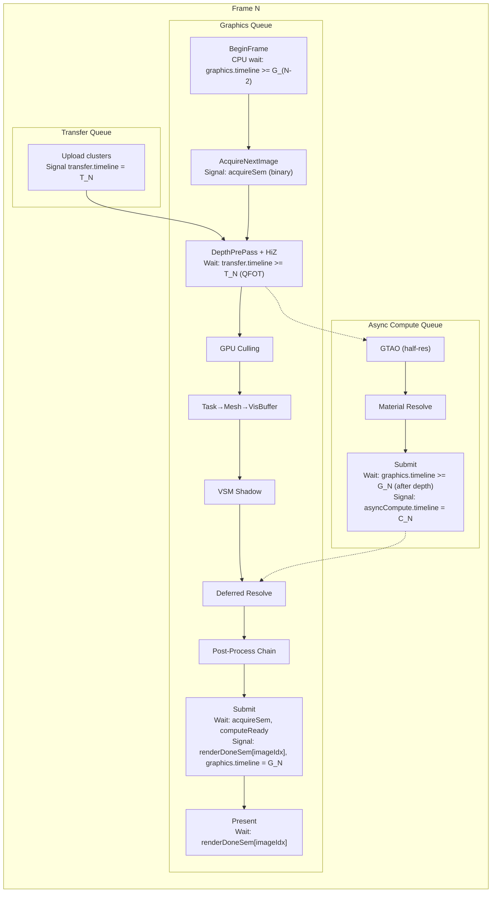
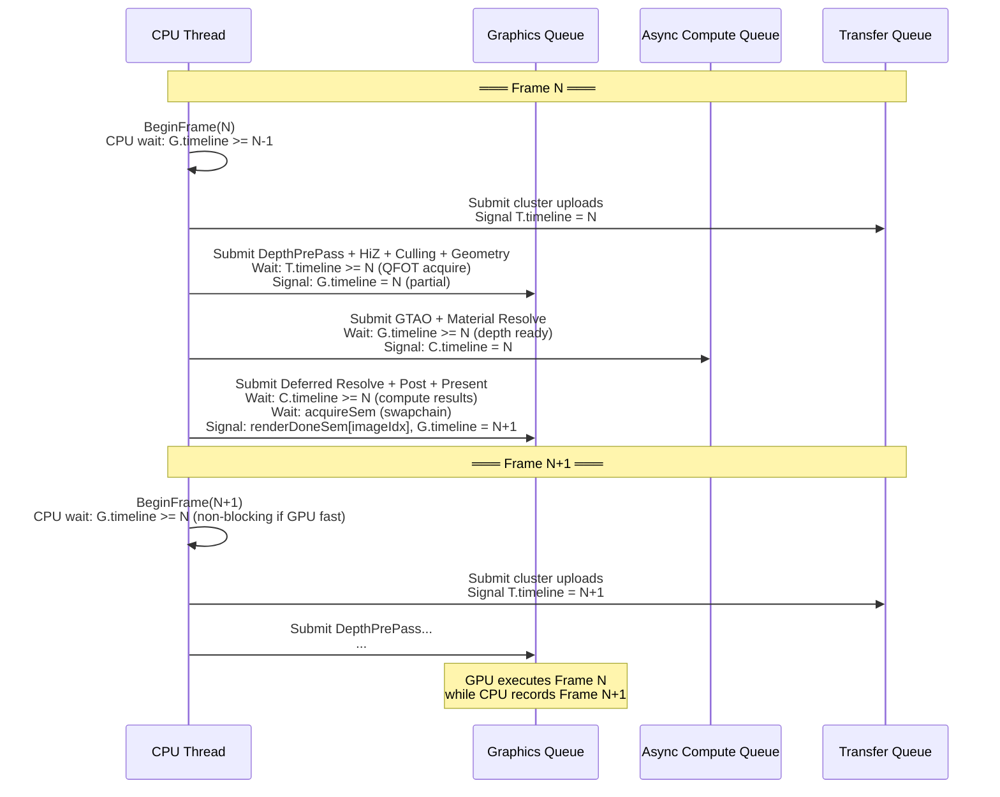
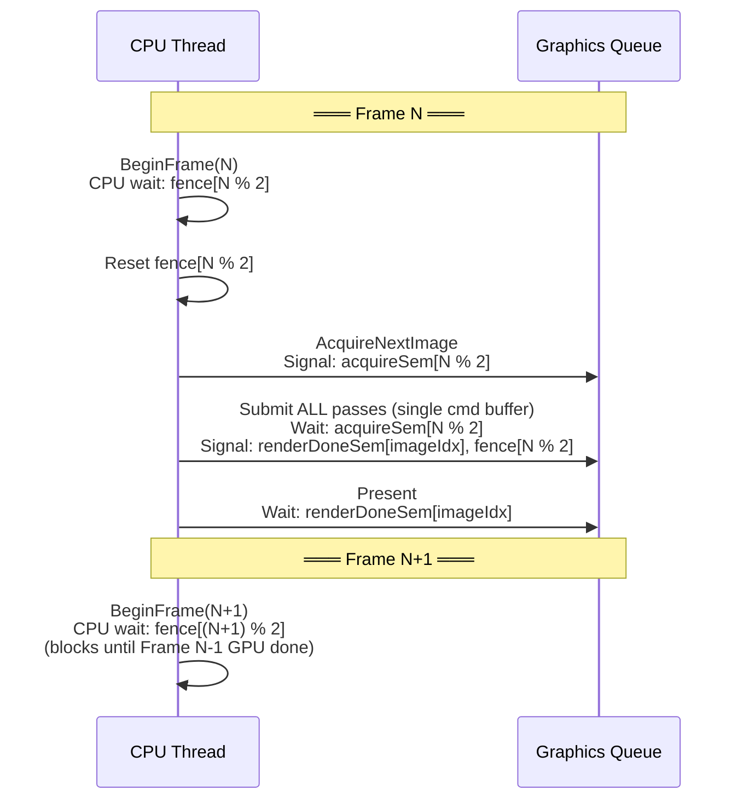
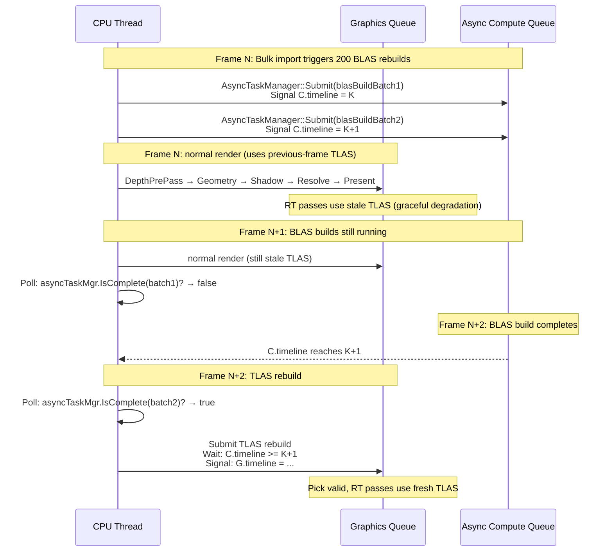
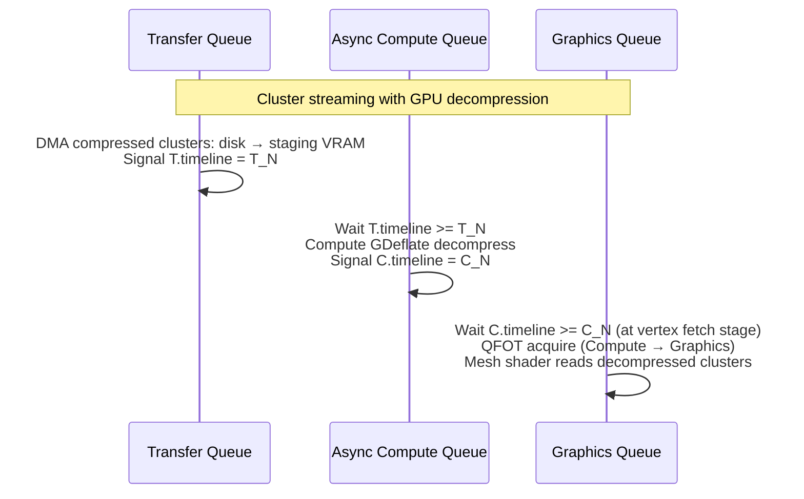
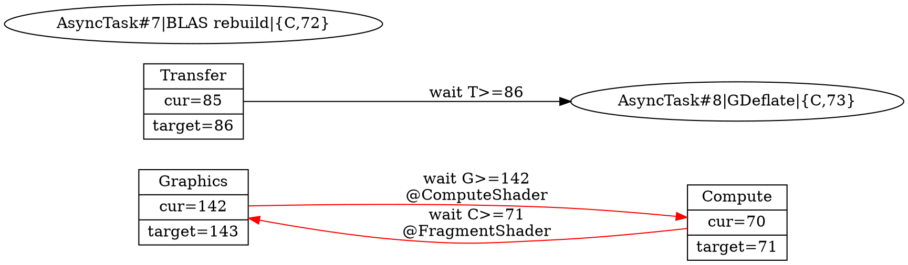
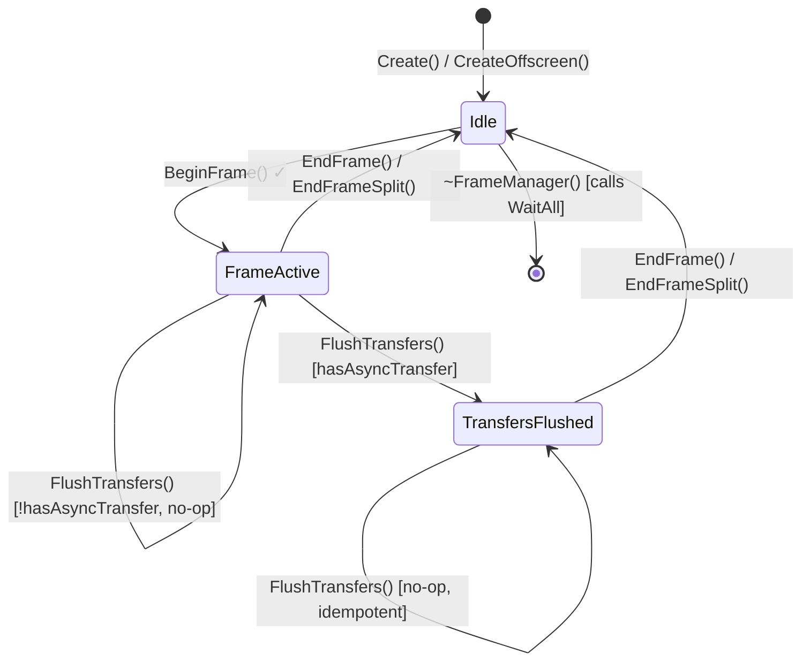

# Frame Synchronization & GPU/CPU Pipelining Architecture

> **Status**: Design blueprint
> **Scope**: FrameManager, multi-queue synchronization, frame pipelining, deferred destruction, per-tier sync strategies
> **Namespace**: `miki::rhi` (sync primitives), `miki::frame` (frame orchestration)
> **Depends on**: `specs/01-window-manager.md` (SurfaceManager), `specs/02-rhi-design.md` (§7, §9 sync primitives)
> **Target**: `specs/rendering-pipeline-architecture.md` — all 88 passes, 3-queue overlap, <16.7ms frame budget

---

## 1. Design Goals

| #   | Goal                                            | Rationale                                                                                                      |
| --- | ----------------------------------------------- | -------------------------------------------------------------------------------------------------------------- |
| G1  | **Maximum CPU/GPU overlap**                     | CPU frame N+1 recording overlaps GPU frame N execution; CPU never idle-waits except at frame pacing boundary   |
| G2  | **Multi-queue parallelism**                     | Graphics, Async Compute, Transfer queues run concurrently with fine-grained timeline semaphore synchronization |
| G3  | **Zero VkFence on Tier1**                       | Timeline semaphores replace all CPU↔GPU sync on Tier1; VkFence only for Compat tier swapchain                  |
| G4  | **Per-surface frame pacing**                    | Each window has independent frame cadence; no global WaitIdle except shutdown                                  |
| G5  | **Deterministic frame timing**                  | Bounded worst-case CPU stall; no unbounded GPU pipeline depth                                                  |
| G6  | **Deferred destruction with zero ref-counting** | 2-frame latency destruction queue; no atomic ref-counts in hot path                                            |
| G7  | **Tier-adaptive**                               | T1 uses timeline semaphores + 3 queues; T2 uses binary semaphores + 1 queue; T3/T4 use implicit sync           |

### 1.1 Non-Goals

- **RenderGraph pass scheduling**: RenderGraph decides pass ordering. This document covers frame-level pipelining, not intra-frame pass dependencies.
- **Barrier insertion**: RenderGraph's responsibility. FrameManager provides sync primitives; barrier placement is external.
- **Command buffer pooling**: See §19 (CommandPoolAllocator) for the full specification.

---

## 2. Architecture Overview

### 2.1 Core Abstraction Stack

```
┌──────────────────────────────────────────────────────────────────┐
│                      Application / RenderGraph                   │
│   "Record frame N+1 while GPU executes frame N"                  │
├──────────────────────────────────────────────────────────────────┤
│                        FrameOrchestrator                         │
│   Per-window FrameManager + global deferred destruction          │
│   + StagingRing lifecycle + ReadbackRing lifecycle               │
├──────────────────────────────────────────────────────────────────┤
│                         FrameManager                             │
│   Timeline-first frame pacing: BeginFrame / EndFrame             │
│   Windowed (RenderSurface) or Offscreen (timeline-only)          │
├──────────────────────────────────────────────────────────────────┤
│                        SyncScheduler                             │
│   Multi-queue timeline semaphore DAG                             │
│   Graphics ↔ AsyncCompute ↔ Transfer dependency resolution     │
├──────────────────────────────────────────────────────────────────┤
│                     RHI Sync Primitives                          │
│   TimelineSemaphore · BinarySemaphore · Fence (compat only)      │
│   QueueSubmit · QueuePresent                                     │
└──────────────────────────────────────────────────────────────────┘
```

### 2.2 Per-Tier Sync Model Summary

| Aspect                |               T1 Vulkan 1.4               |           T1 D3D12            |        T2 Compat         |      T3 WebGPU      |             T4 OpenGL              |
| --------------------- | :---------------------------------------: | :---------------------------: | :----------------------: | :-----------------: | :--------------------------------: |
| CPU↔GPU sync          |       Timeline semaphore (CPU wait)       |   `ID3D12Fence` (CPU wait)    |         VkFence          | `mapAsync` callback | `glFenceSync` + `glClientWaitSync` |
| GPU↔GPU sync          |            Timeline semaphore             |         `ID3D12Fence`         |     Binary semaphore     |      Implicit       |         `glMemoryBarrier`          |
| Swapchain acquire     |             Binary semaphore              |          N/A (DXGI)           |     Binary semaphore     |      Implicit       |         `glfwSwapBuffers`          |
| Swapchain present     |             Binary semaphore              |          `Present()`          |     Binary semaphore     |      Implicit       |         `glfwSwapBuffers`          |
| Async compute (帧内)  |         Timeline sem cross-queue          |      Compute queue fence      |   N/A (graphics queue)   | N/A (single queue)  |                N/A                 |
| Async compute (跨帧)  |     AsyncTaskManager + timeline poll      | AsyncTaskManager + fence poll | N/A (inline on graphics) |         N/A         |                N/A                 |
| Transfer queue        |         Timeline semaphore + QFOT         |       Copy queue fence        |           N/A            |         N/A         |                N/A                 |
| 3-queue chain (T→C→G) |        Timeline sem chain + 2×QFOT        |     Fence chain (no QFOT)     |           N/A            |         N/A         |                N/A                 |
| Frames in flight      |                    2-3                    |              2-3              |            2             |          1          |                 1                  |
| Compute queue count   | 1 (+ optional 2nd for priority isolation) |               1               |            0             |          0          |                 0                  |

---

## 3. Timeline Semaphore Unified Model (Tier1)

### 3.1 Design Rationale: Why Timeline-First

Timeline semaphores (Vulkan 1.2 core, D3D12 `ID3D12Fence` native) are strictly superior to binary semaphore + fence for frame pacing:

| Property                | Binary Sem + Fence                  | Timeline Semaphore                        |
| ----------------------- | ----------------------------------- | ----------------------------------------- |
| CPU↔GPU wait            | Separate VkFence per frame          | Same object, wait on value N              |
| GPU↔GPU wait            | 1:1 signal/wait pairing             | N:M fan-out/fan-in                        |
| Object count per frame  | 2 binary sems + 1 fence = 3 objects | 1 timeline sem (shared across all frames) |
| Out-of-order submission | Not supported                       | Supported (driver holds back)             |
| Multi-consumer          | Need N binary sems                  | Single timeline, multiple wait values     |
| CPU poll without stall  | `vkGetFenceStatus`                  | `vkGetSemaphoreCounterValue` (lock-free)  |

**Key insight**: A single timeline semaphore per queue replaces ALL per-frame fences and binary semaphores for GPU↔GPU sync. Binary semaphores are retained ONLY for swapchain acquire/present (Vulkan spec mandates binary for `vkAcquireNextImageKHR`/`vkQueuePresentKHR`).

### 3.2 Per-Queue Timeline Semaphore Assignment

```cpp
struct QueueTimelines {
    SemaphoreHandle graphics;   // Monotonic counter for graphics queue
    SemaphoreHandle compute;    // Monotonic counter for async compute queue
    SemaphoreHandle transfer;   // Monotonic counter for transfer/DMA queue
};
```

Each `Submit()` to a queue increments that queue's timeline value by 1. Cross-queue dependencies are expressed as "wait for queue X's timeline to reach value V".

### 3.3 Signal/Wait Node Graph — Tier1 Single Frame



### 3.4 Timeline Value Assignment Strategy

```
Frame 0:  graphics.signal(1),   compute.signal(1),   transfer.signal(1)
Frame 1:  graphics.signal(2),   compute.signal(2),   transfer.signal(2)
Frame N:  graphics.signal(N+1), compute.signal(N+1), transfer.signal(N+1)

CPU wait at BeginFrame(N):
  graphics.timeline >= (N+1) - framesInFlight
  = (N+1) - 2 = N-1  (for 2 frames in flight)

This ensures at most 2 frames are in-flight on the graphics queue.
```

**D3D12 mapping**: `ID3D12Fence` is inherently a timeline fence. The same value scheme applies directly. `ID3D12Fence::Signal(value)` on command queue = timeline signal. `ID3D12Fence::SetEventOnCompletion(value, event)` = timeline CPU wait.

---

## 4. FrameManager Design

### 4.1 API

```cpp
namespace miki::frame {

class FrameManager {
public:
    static constexpr uint32_t kMaxFramesInFlight = 3;
    static constexpr uint32_t kDefaultFramesInFlight = 2;

    ~FrameManager();

    FrameManager(const FrameManager&) = delete;
    auto operator=(const FrameManager&) -> FrameManager& = delete;
    FrameManager(FrameManager&&) noexcept;
    auto operator=(FrameManager&&) noexcept -> FrameManager&;

    /// @brief Create a windowed FrameManager bound to a RenderSurface.
    [[nodiscard]] static auto Create(
        rhi::DeviceHandle device,
        rhi::RenderSurface& surface,
        uint32_t framesInFlight = kDefaultFramesInFlight
    ) -> core::Result<FrameManager>;

    /// @brief Create an offscreen FrameManager (timeline-only, no swapchain).
    [[nodiscard]] static auto CreateOffscreen(
        rhi::DeviceHandle device,
        uint32_t width, uint32_t height,
        uint32_t framesInFlight = kDefaultFramesInFlight
    ) -> core::Result<FrameManager>;

    // ── Frame lifecycle ─────────────────────────────────────────

    /// @brief Begin a new frame.
    /// T1: CPU waits on timeline semaphore for oldest in-flight frame.
    /// T2: CPU waits on VkFence for oldest in-flight frame.
    /// T3/T4: Implicit sync (blocking present).
    /// Then acquires swapchain image (windowed) or advances offscreen slot.
    [[nodiscard]] auto BeginFrame() -> core::Result<FrameContext>;

    /// @brief Submit recorded command buffers and present (single submit).
    /// Pass the bufferHandle from CommandListAcquisition (NOT the listHandle).
    /// If StagingRing/ReadbackRing have pending copies, FrameManager automatically
    /// dispatches them — on the dedicated transfer queue (T1 + hasAsyncTransfer)
    /// or prepended to the graphics batch (fallback).
    [[nodiscard]] auto EndFrame(std::span<const rhi::CommandBufferHandle> iCmdBuffers)
        -> core::Result<void>;

    /// @brief Single command buffer convenience overload.
    [[nodiscard]] auto EndFrame(rhi::CommandBufferHandle iCmd)
        -> core::Result<void>;

    /// @brief A batch of command buffers for split-submit (§5.3).
    /// Each batch becomes a separate vkQueueSubmit2 with its own timeline signal.
    /// The last batch additionally signals renderDone[imageIdx] binary sem for present.
    struct SubmitBatch {
        std::span<const rhi::CommandBufferHandle> commandBuffers;
        bool signalPartialTimeline = true;  ///< Allocate + signal a timeline value after this batch
    };

    /// @brief Split-submit EndFrame: multiple graphics queue submits per frame.
    /// Enables async compute to start after early batches (e.g., geometry done)
    /// without waiting for the full frame. Last batch handles present sync.
    /// Transfer copy dispatch is identical to EndFrame (prepended to first batch).
    [[nodiscard]] auto EndFrameSplit(std::span<const SubmitBatch> iBatches)
        -> core::Result<void>;

    // ── Async compute integration ───────────────────────────────

    /// @brief Get a sync point for async compute to wait on.
    /// Returns {timeline semaphore, value} that the compute queue should
    /// wait before reading graphics queue outputs (e.g., depth buffer).
    [[nodiscard]] auto GetGraphicsSyncPoint() const noexcept
        -> rhi::TimelineSyncPoint;

    /// @brief Register an async compute completion for this frame.
    /// Graphics queue will wait on this before proceeding to
    /// passes that depend on compute results (e.g., Deferred Resolve).
    auto SetComputeSyncPoint(rhi::TimelineSyncPoint point) noexcept -> void;

    // ── Transfer queue integration ──────────────────────────────

    /// @brief Eagerly dispatch pending StagingRing/ReadbackRing copies NOW.
    /// Call after CPU-side memcpy is done but BEFORE EndFrame — the transfer
    /// queue runs in parallel with command buffer recording (~2ms overlap).
    /// If not called, EndFrame will dispatch transfers itself (zero overlap).
    /// Safe to call multiple times per frame (no-op if already flushed).
    /// T1 + hasAsyncTransfer: submits to dedicated transfer queue.
    /// Fallback (T2/T3/T4): no-op — defers to EndFrame graphics prepend path.
    auto FlushTransfers() -> void;

    /// @brief Register a transfer completion for this frame.
    /// Graphics queue will wait on this at the appropriate stage.
    auto SetTransferSyncPoint(rhi::TimelineSyncPoint point) noexcept -> void;

    // ── SyncScheduler integration (§4.4, mandatory) ───────────

    /// @brief Bind a SyncScheduler for global timeline value allocation (mandatory).
    /// Must be called with a non-null scheduler before the first BeginFrame.
    auto SetSyncScheduler(SyncScheduler* scheduler) noexcept -> void;

    /// @brief Get the partial timeline value from the first signaled batch
    /// of the last EndFrameSplit. Returns 0 if no partial signal occurred.
    [[nodiscard]] auto GetLastPartialTimelineValue() const noexcept -> uint64_t;

    // ── Resource lifecycle hooks ────────────────────────────────

    auto SetStagingRing(resource::StagingRing* ring) noexcept -> void;
    auto SetReadbackRing(resource::ReadbackRing* ring) noexcept -> void;
    auto SetDeferredDestructor(DeferredDestructor* destructor) noexcept -> void;

    // ── Resize / reconfigure ────────────────────────────────────

    [[nodiscard]] auto Resize(uint32_t w, uint32_t h) -> core::Result<void>;
    [[nodiscard]] auto Reconfigure(const rhi::RenderSurfaceConfig& cfg)
        -> core::Result<void>;

    // ── Queries ─────────────────────────────────────────────────

    [[nodiscard]] auto FrameIndex() const noexcept -> uint32_t;
    [[nodiscard]] auto FrameNumber() const noexcept -> uint64_t;
    [[nodiscard]] auto FramesInFlight() const noexcept -> uint32_t;
    [[nodiscard]] auto IsWindowed() const noexcept -> bool;
    [[nodiscard]] auto GetSurface() const noexcept -> rhi::RenderSurface*;

    /// @brief Get the timeline value that will be signaled at EndFrame.
    [[nodiscard]] auto CurrentTimelineValue() const noexcept -> uint64_t;

    /// @brief Non-blocking query: is the GPU done with frame N?
    [[nodiscard]] auto IsFrameComplete(uint64_t frameNumber) const noexcept -> bool;

    auto WaitAll() -> void;

private:
    struct Impl;
    std::unique_ptr<Impl> impl_;
    explicit FrameManager(std::unique_ptr<Impl> impl);
};

} // namespace miki::frame
```

### 4.2 FrameContext

```cpp
struct FrameContext {
    uint32_t      frameIndex;       // [0, framesInFlight) for resource rotation
    uint64_t      frameNumber;      // Monotonic, never wraps
    TextureHandle swapchainImage;   // Invalid if offscreen
    uint32_t      width;
    uint32_t      height;

    // Sync state for this frame (opaque to caller, used by EndFrame)
    uint64_t      graphicsTimelineTarget;  // Value to signal on graphics queue
    uint64_t      transferWaitValue;       // Transfer timeline to wait (0 = none)
    uint64_t      computeWaitValue;        // Compute timeline to wait (0 = none)
};
```

### 4.3 Changes vs miki FrameManager

| Aspect                 | miki FrameManager                                     | This Design                                            |
| ---------------------- | ----------------------------------------------------- | ------------------------------------------------------ |
| Sync model             | Mixed: timeline for Tier1/offscreen, fence for compat | Timeline-first; fence emulated on T2 via wrapper       |
| Multi-submit           | Single `CommandListHandle`                            | `span<CommandListHandle>` for multi-threaded recording |
| Async compute          | Not integrated (caller manages)                       | First-class `Get/SetComputeSyncPoint`                  |
| Transfer queue         | Injected via `SetTransferQueue`                       | Injected via `SetTransferSyncPoint` (decoupled)        |
| Deferred destruction   | Not integrated                                        | `SetDeferredDestructor` hook                           |
| Frame completion query | None                                                  | `IsFrameComplete()` for non-blocking poll              |
| WaitAll                | `device->WaitIdle()` (global stall)                   | Per-surface timeline wait (surgical)                   |

### 4.4 FrameManager ↔ SyncScheduler Integration Contract

#### 4.4.1 Problem: Local vs Global Timeline Allocation (Resolved)

The original implementation used `++currentTimelineValue` locally within FrameManager::Impl. This had three limitations (all resolved by making SyncScheduler mandatory in §4.4.2):

| #   | Issue                                  | Severity | Impact                                                                                                                      |
| --- | -------------------------------------- | -------- | --------------------------------------------------------------------------------------------------------------------------- |
| 1   | **Multi-window conflict**              | High     | Two FrameManagers sharing one graphics queue timeline would produce duplicate values                                        |
| 2   | **No intra-frame partial value query** | High     | `GetGraphicsSyncPoint()` returns the frame-end value, not intermediate batch values from `EndFrameSplit`                    |
| 3   | **SyncScheduler bypass**               | Medium   | FrameManager does not go through `SyncScheduler::AllocateSignal()`, so the scheduler's `currentValue` diverges from reality |

#### 4.4.2 Design: SyncScheduler-Backed Allocation (Mandatory)

FrameManager **requires** a bound `SyncScheduler*`. All timeline value allocation is delegated to the scheduler — there is no local fallback. This eliminates the dual-path complexity and ensures multi-window correctness by construction.

- `SetSyncScheduler(nullptr)` triggers `MIKI_LOG_ERROR` + `assert(false)`.
- `BeginFrame` / `EndFrame` / `FlushTransfers` assert that `syncScheduler != nullptr`.
- Tests must create and bind a `SyncScheduler` before calling `BeginFrame`.

```cpp
class FrameManager {
public:
    // ... existing API ...

    /// @brief Bind a SyncScheduler for global timeline value allocation (mandatory).
    /// Must be called with a non-null scheduler before the first BeginFrame.
    /// Typically set by SurfaceManager::AttachSurface or FrameOrchestrator.
    ///   - EndFrame/EndFrameSplit calls SyncScheduler::AllocateSignal(Graphics).
    ///   - BeginFrame uses SyncScheduler::PeekNextSignal(Graphics) for graphicsTimelineTarget.
    ///   - GetGraphicsSyncPoint() can return batch-level partial values.
    ///   - Transfer dispatches use AllocateSignal(Transfer).
    ///   - Multi-window safety is guaranteed (values globally monotonic).
    auto SetSyncScheduler(SyncScheduler* scheduler) noexcept -> void;

    /// @brief Get the partial timeline value signaled by the last completed batch
    /// in the most recent EndFrameSplit call. Returns 0 if no partial signal occurred.
    /// Use case: async compute waits on geometry-done (batch #1), not frame-done.
    [[nodiscard]] auto GetLastPartialTimelineValue() const noexcept -> uint64_t;
};
```

**Impl changes**:

```cpp
struct FrameManager::Impl {
    // ... existing fields ...
    SyncScheduler* syncScheduler = nullptr;  // Mandatory, owned by SurfaceManager/FrameOrchestrator

    // Partial timeline tracking for GetGraphicsSyncPoint / GetLastPartialTimelineValue
    uint64_t lastPartialTimelineValue = 0;  // Set by EndFrameSplit batch[0] signal

    [[nodiscard]] auto AllocateGraphicsSignal() -> uint64_t {
        assert(syncScheduler && "SyncScheduler is required");
        auto v = syncScheduler->AllocateSignal(rhi::QueueType::Graphics);
        currentTimelineValue = v;
        return v;
    }

    [[nodiscard]] auto AllocateTransferSignal() -> uint64_t {
        assert(syncScheduler && "SyncScheduler is required");
        auto v = syncScheduler->AllocateSignal(rhi::QueueType::Transfer);
        currentTransferTimelineValue = v;
        return v;
    }

    void CommitGraphicsSubmit() {
        assert(syncScheduler && "SyncScheduler is required");
        syncScheduler->CommitSubmit(rhi::QueueType::Graphics);
    }

    void CommitTransferSubmit() {
        assert(syncScheduler && "SyncScheduler is required");
        syncScheduler->CommitSubmit(rhi::QueueType::Transfer);
    }
};
```

#### 4.4.3 GetGraphicsSyncPoint Semantics (Revised)

| Mode                                                                | `GetGraphicsSyncPoint()` returns                                             | Use case                                   |
| ------------------------------------------------------------------- | ---------------------------------------------------------------------------- | ------------------------------------------ |
| After `EndFrame`                                                    | `{graphicsTimeline, currentTimelineValue}` — the frame-end value             | Simple single-submit frame                 |
| After `EndFrameSplit` with `signalPartialTimeline=true` on batch[0] | `{graphicsTimeline, lastPartialTimelineValue}` — the **geometry-done** value | Async compute waits on depth/geometry only |
| Before any `EndFrame`                                               | `{graphicsTimeline, currentTimelineValue}` — previous frame's final value    | Pre-frame query                            |

The critical change: after `EndFrameSplit`, `GetGraphicsSyncPoint()` returns the **first partial signal value** (geometry done), not the frame-end value. This is exactly what async compute needs to start GTAO immediately after depth is available.

For the frame-end value (e.g., for `BeginFrame` CPU wait), `CurrentTimelineValue()` continues to return the last signaled value.

#### 4.4.4 Multi-Compute Sync Points

The current `SetComputeSyncPoint(single)` model is sufficient for the common case (one frame-sync compute submit per frame). For frames with multiple compute dependencies (e.g., GTAO done + GDeflate decode done), `AddComputeSyncPoint` accumulates waits:

```cpp
class FrameManager {
public:
    // Existing — single sync point (backward compatible, overwrites)
    auto SetComputeSyncPoint(TimelineSyncPoint point) noexcept -> void;

    // New — additive accumulator for multiple compute waits per frame
    auto AddComputeSyncPoint(TimelineSyncPoint point, rhi::PipelineStage stage) noexcept -> void;

    // Clears accumulated compute sync points (called automatically by EndFrame)
    auto ClearComputeSyncPoints() noexcept -> void;
};
```

When `AddComputeSyncPoint` is used, `EndFrame`/`EndFrameSplit` adds ALL accumulated waits to the appropriate batch. The old `SetComputeSyncPoint` continues to work as a single-value override (converted internally to a single `AddComputeSyncPoint` with stage `ComputeShader`).

#### 4.4.5 Transfer Wait Stage Semantics

| Submit model               | Transfer wait placement                   | Stage mask                                                      | Rationale                                                                              |
| -------------------------- | ----------------------------------------- | --------------------------------------------------------------- | -------------------------------------------------------------------------------------- |
| `EndFrame` (single submit) | On the single graphics submit             | `PipelineStage::Transfer`                                       | GPU pipelines transfer wait with other work; no bubble because pipeline depth hides it |
| `EndFrameSplit` batch[0]   | On the first batch only                   | `PipelineStage::Transfer`                                       | First batch contains DepthPrePass which is the earliest consumer of uploaded data      |
| RenderGraph (future)       | Injected per-pass by RenderGraph executor | Per-pass consumer stage (e.g., `VertexInput`, `FragmentShader`) | Maximum granularity — transfer wait delayed to exact point of consumption              |

**Current**: `PipelineStage::Transfer` on the first submit is correct and does not cause GPU bubbles because:

1. The GPU can speculatively execute non-dependent work past the wait point
2. Transfer stage is early in the pipeline — the wait resolves before any shader stages begin
3. In eager flush mode, transfers complete during CPU recording (~2ms), so the wait is trivially satisfied by submit time

---

## 5. Multi-Queue Synchronization — Detailed Timeline Diagrams

### 5.1 Tier1: 3-Queue Full Pipeline (Steady State)

This diagram shows two consecutive frames with all three queues active, illustrating maximum CPU/GPU overlap.



### 5.2 Tier1: Detailed Per-Pass Signal/Wait Map

| Pass                   | Queue             | Waits On                                      | Signals                                                |
| ---------------------- | ----------------- | --------------------------------------------- | ------------------------------------------------------ |
| **BeginFrame**         | CPU               | `G.timeline >= frameNum - framesInFlight + 1` | —                                                      |
| Cluster Upload         | Transfer          | —                                             | `T.timeline = frameNum`                                |
| DepthPrePass + HiZ     | Graphics          | `T.timeline >= frameNum` (if uploads)         | —                                                      |
| GPU Culling            | Graphics          | (after DepthPrePass, in-queue order)          | —                                                      |
| Macro-Binning          | Graphics          | (after Culling)                               | —                                                      |
| Task→Mesh→VisBuffer    | Graphics          | (after Binning)                               | `G.timeline = frameNum` (partial signal)               |
| **GTAO**               | **Async Compute** | `G.timeline >= frameNum` (depth ready)        | —                                                      |
| **Material Resolve**   | **Async Compute** | (after GTAO, in-queue order)                  | `C.timeline = frameNum`                                |
| VSM Shadow             | Graphics          | (after geometry, in-queue order)              | —                                                      |
| Deferred Resolve       | Graphics          | `C.timeline >= frameNum` (AO + materials)     | —                                                      |
| SSR → Bloom → DoF → MB | Graphics          | (in-queue order)                              | —                                                      |
| Tone Map → TAA → FSR   | Graphics          | (in-queue order)                              | —                                                      |
| Compositor             | Graphics          | (in-queue order)                              | —                                                      |
| **EndFrame Submit**    | Graphics          | `acquireSem` (swapchain)                      | `renderDoneSem[imageIdx]`, `G.timeline = frameNum + 1` |
| **Present**            | Graphics          | `renderDoneSem[imageIdx]`                     | —                                                      |

### 5.3 Partial Timeline Signals (Split Submit)

关键优化：一帧内 Graphics Queue 的工作被分为多次 Submit，每次 Submit 可以推进 timeline 到不同的中间值。这让 Async Compute 可以更早开始工作。

**Timeline values 由 `SyncScheduler::AllocateSignal()` 全局分配**，而非按 `2*frameNum` 编码。这在多窗口场景下是必需的——多个 FrameManager 交替向同一 graphics queue 提交（§8.3），per-frame-number 编码会产生冲突。

```
Graphics Queue submits for Frame N (single-window example):
  Submit #1: DepthPrePass + HiZ + Culling + Geometry
    Signal: G.timeline = V      (V = SyncScheduler::AllocateSignal(Graphics))

  Submit #2: Deferred Resolve + Post + Present
    Wait:   C.timeline >= Vc    (compute results ready)
    Wait:   acquireSem          (swapchain image ready)
    Signal: renderDoneSem[imageIdx]  (for present, image-indexed)
    Signal: G.timeline = V+1         (V+1 = SyncScheduler::AllocateSignal(Graphics))

Async Compute submit for Frame N:
  Wait: G.timeline >= V         (geometry done, depth available)
  Signal: C.timeline = Vc       (Vc = SyncScheduler::AllocateSignal(Compute))

CPU BeginFrame waits:
  G.timeline >= slot[oldest].lastSignaledValue
```

FrameManager 在每个 slot 中记录 `lastSignaledValue`（该 slot 上一次 EndFrame 的最终 timeline value）。BeginFrame 等待该 slot 的 `lastSignaledValue` 被 GPU 完成，而非依赖 frame number 计算。

这种 split-submit 模式让 Async Compute 在 Graphics 完成 geometry 后立即启动，而不必等待整帧完成。GTAO 和 Material Resolve 与 VSM Shadow rendering 并行执行。

**多窗口兼容性**：由于 timeline value 由 SyncScheduler 全局单调分配，Window A 和 Window B 的 split-submit 值自然交错，不存在编码冲突。

### 5.4 Tier2: Single Queue + Binary Semaphore



**Sync objects (T2)**:

- 2× `VkFence` (per frame-in-flight slot)
- 2× `VkSemaphore` binary (acquire, per slot)
- N× `VkSemaphore` binary (render done, **per swapchain image**, typically N=2 or 3)

> **Design decision**: `renderDoneSem` is indexed by swapchain image (not frame slot) because
> `vkQueuePresentKHR` holds the semaphore asynchronously until the image is re-acquired.
> Slot-indexed renderDone causes validation errors when consecutive frames target different
> images (e.g., after window unfocus/refocus). See DR-SYNC-001 in §15.

### 5.5 Tier3/Tier4: Implicit Sync

```
WebGPU:
  device.queue.submit([commandBuffer])
  // Implicit queue ordering; no explicit semaphores
  // Frame pacing via requestAnimationFrame() or wgpu surface present

OpenGL:
  // All commands serialized on single GL context
  glFinish() or glfwSwapBuffers() provides implicit sync
  // Frame pacing via swap interval (vsync)
```

### 5.6 Long-Running Async Compute Tasks

§5.1–5.3 覆盖的是 **帧内** compute（GTAO、Material Resolve），在 BeginFrame/EndFrame 生命周期内完成。但 `rendering-pipeline-architecture.md` 要求的 async compute 使用远不止于此——存在多个 **跨帧** 长时间 compute 任务，必须与帧内渲染并行但不阻塞帧节奏。

#### 5.6.1 跨帧 Compute 场景清单

| #   | 场景                                              | 来源                                     | 耗时                      | 特征                                              |
| --- | ------------------------------------------------- | ---------------------------------------- | ------------------------- | ------------------------------------------------- |
| A   | **BLAS Async Rebuild** (bulk import, >100 bodies) | rendering-pipeline §15.4                 | 5-50ms (spans 1-3 frames) | 跨帧；Graphics 使用 previous-frame TLAS，不 stall |
| B   | **BLAS Overflow Spill** (>2 bodies/frame inline)  | rendering-pipeline §15.4 budget overflow | 1-5ms/body                | 溢出到 compute queue 避免帧时间 spike             |
| C   | **Compute GDeflate 解压**                         | rendering-pipeline §5.8.1 path 2         | 2-5ms per batch           | Transfer→Compute→Graphics 3-queue chain           |
| D   | **Wavelet Pre-Decode** (Phase 14+)                | rendering-pipeline §5.8.2                | 1-3ms                     | 与 DepthPrePass 并行，需 split-submit 精确 wait   |
| E   | **GPU QEM Simplification** (offline)              | rendering-pipeline Pass #82              | ~50ms                     | 离线任务，不绑定帧节奏                            |

这些场景的共同特征：**compute 提交与帧节奏解耦**。不能用 §5.3 的 `SetComputeSyncPoint` 一帧一次模型处理。

#### 5.6.2 AsyncTask 抽象

```cpp
namespace miki::frame {

/// @brief Handle to a long-running async compute task.
/// Tracks completion via timeline semaphore, independent of frame lifecycle.
struct AsyncTaskHandle {
    uint64_t id = 0;
    [[nodiscard]] constexpr auto IsValid() const noexcept -> bool { return id != 0; }
};

/// @brief Manages long-running compute tasks on the async compute queue.
/// Tasks are submitted independently of frame BeginFrame/EndFrame cycle.
/// Graphics queue polls or waits on task completion at its own pace.
class AsyncTaskManager {
public:
    /// @brief Submit a long-running compute task.
    /// The task's command buffer is submitted to the async compute queue
    /// with optional waits on other queues.
    /// @return Handle for polling completion.
    [[nodiscard]] auto Submit(
        rhi::CommandListHandle cmd,
        std::span<const rhi::TimelineSyncPoint> waits = {}
    ) -> core::Result<AsyncTaskHandle>;

    /// @brief Non-blocking poll: is this task done?
    [[nodiscard]] auto IsComplete(AsyncTaskHandle task) const noexcept -> bool;

    /// @brief Get the timeline sync point signaled when task completes.
    /// Graphics queue can wait on this to consume task results.
    [[nodiscard]] auto GetCompletionPoint(AsyncTaskHandle task) const noexcept
        -> rhi::TimelineSyncPoint;

    /// @brief Blocking wait for a task to complete (CPU stall).
    /// Use sparingly — only for shutdown or mandatory sync.
    auto WaitForCompletion(AsyncTaskHandle task, uint64_t timeoutNs = UINT64_MAX)
        -> core::Result<void>;

    /// @brief Cancel all pending tasks and wait for GPU idle on compute queue.
    auto Shutdown() -> void;

private:
    struct TaskEntry {
        AsyncTaskHandle handle;
        rhi::TimelineSyncPoint completionPoint; // {computeTimeline, value}
    };
    std::vector<TaskEntry> activeTasks_;
    SyncScheduler* scheduler_ = nullptr;  // Timeline values allocated via scheduler_->AllocateSignal(Compute)
    uint64_t nextTaskId_ = 1;
};

} // namespace miki::frame
```

#### 5.6.3 BLAS Async Rebuild 时序图



**关键设计点**:

- Graphics queue **从不等待** BLAS build 完成——使用 previous-frame TLAS 继续渲染
- CPU 每帧 poll `IsComplete()`，完成后在下一帧 graphics submit 中注入 wait
- `PickResult::Stale` 告知应用 pick 结果基于旧 TLAS，可能不精确

#### 5.6.4 Budget Overflow Spill

```
Interactive edit path (per frame):
  If dirtyBodies <= 2:
    BLAS rebuild inline on Graphics queue (1-5ms, acceptable)
  If dirtyBodies > 2:
    Rebuild first 2 inline
    Spill remaining to AsyncTaskManager::Submit()
    Next frames: poll completion → TLAS rebuild when ready
```

### 5.7 3-Queue Chain: Transfer → Compute → Graphics

GDeflate GPU 解压需要 Transfer、Compute、Graphics 三个队列串联工作。03-sync.md §5.1 只建模了 2-queue 交互，此处补充完整的 3-queue chain。

#### 5.7.1 GDeflate 解压时序图



#### 5.7.2 SyncScheduler 扩展：任意 Queue-Pair 依赖

原设计只支持 Graphics↔Compute 和 Graphics↔Transfer。3-queue chain 要求 **Transfer→Compute** 依赖。

```cpp
// SyncScheduler::AddDependency 已支持任意 queue pair:
//   AddDependency(waitQueue, signalQueue, signalValue, waitStage)
//
// 3-queue chain 使用示例:

// Step 1: Transfer uploads compressed data
auto transferDone = scheduler.AllocateSignal(QueueType::Transfer);
transferQueue.Submit(uploadCmd, {}, transferDone);
scheduler.CommitSubmit(QueueType::Transfer);

// Step 2: Compute decompresses (waits on Transfer)
scheduler.AddDependency(QueueType::Compute, QueueType::Transfer,
                        transferDone, PipelineStage::ComputeShader);
auto decompDone = scheduler.AllocateSignal(QueueType::Compute);
computeQueue.Submit(decompCmd, scheduler.GetPendingWaits(QueueType::Compute),
                    decompDone);
scheduler.CommitSubmit(QueueType::Compute);

// Step 3: Graphics reads decompressed data (waits on Compute)
scheduler.AddDependency(QueueType::Graphics, QueueType::Compute,
                        decompDone, PipelineStage::VertexInput);
// ... graphics submit picks up this wait automatically
```

#### 5.7.3 QFOT (Queue Family Ownership Transfer) for 3-Queue Chain

Vulkan 要求跨 queue family 的 buffer/image 访问必须做 ownership transfer。3-queue chain 需要两次 QFOT：

```
Transfer Queue (release):
  BufferBarrier { srcQueue=Transfer, dstQueue=Compute, srcAccess=TransferWrite, dstAccess=None }

Compute Queue (acquire + process + release):
  BufferBarrier { srcQueue=Transfer, dstQueue=Compute, srcAccess=None, dstAccess=ShaderRead }
  ... decompress ...
  BufferBarrier { srcQueue=Compute, dstQueue=Graphics, srcAccess=ShaderWrite, dstAccess=None }

Graphics Queue (acquire):
  BufferBarrier { srcQueue=Compute, dstQueue=Graphics, srcAccess=None, dstAccess=ShaderRead }
```

D3D12 不需要 QFOT——资源在所有 queue 类型间隐式共享。WebGPU/OpenGL 无多队列。

### 5.8 一帧内多 Compute Submit

§5.3 的 split-submit 模型假设一帧内只有一个 compute submit 点。实际上，帧内 compute 工作（GTAO + Material Resolve）和跨帧 async task（BLAS rebuild）可能在同一帧共存于 compute queue。

#### 5.8.1 Compute Queue 时间槽模型

```
Compute Queue timeline for Frame N:

  [BLAS rebuild batch (from AsyncTaskManager, long-running)]
  |______|______|    <- spans multiple frames, low priority

  [GTAO (frame-sync, from FrameManager)]
  |__|                <- 1ms, high priority, must finish before Deferred Resolve

  [Material Resolve (frame-sync)]
  |__|                <- 1ms, sequential after GTAO

Submission order on compute queue:
  1. AsyncTaskManager submits BLAS rebuilds (no frame waits, just Transfer waits)
  2. FrameManager submits GTAO+MatResolve (waits on G.timeline for depth)

Both share the same compute timeline semaphore.
Values are allocated independently:
  BLAS batch: C.timeline = 100, 101, 102, ...
  Frame GTAO: C.timeline = 103 (allocated by SyncScheduler)

Graphics queue waits on C.timeline >= 103 (GTAO done),
NOT on 102 (BLAS done — that's polled separately).
```

#### 5.8.2 Priority & Preemption

Vulkan/D3D12 compute queues 不保证 preemption。长时间 BLAS rebuild 可能延迟帧内 GTAO 启动。

**关键约束**：`VK_EXT_global_priority` / `VK_KHR_global_priority` 是 per-queue 属性（创建时固定），不能对同一 queue 上的不同 submit 设不同 priority。要真正隔离帧内和跨帧 compute 任务，需要两个不同 priority 的 compute queue。

#### Hardware Capability 4-Level 降级链

设备初始化时检测硬件能力，选择最高可用 level：

| Level | 条件                                                 | 帧内 Compute Queue       | Async Task Queue             | 最大帧内延迟               |
| ----- | ---------------------------------------------------- | ------------------------ | ---------------------------- | -------------------------- |
| **A** | 2+ compute queue families + `VK_EXT_global_priority` | Compute Queue 0 (`HIGH`) | Compute Queue 1 (`MEDIUM`)   | 0ms (物理隔离)             |
| **B** | 1 compute queue + `VK_EXT_global_priority`           | Compute Queue (`HIGH`)   | 同一 queue，batch split ≤2ms | ≤2ms (preemption 依赖硬件) |
| **C** | 1 compute queue，无 priority                         | Compute Queue            | 同一 queue，batch split ≤2ms | ≤2ms (纯 batch splitting)  |
| **D** | 无 compute queue (T2/T3/T4)                          | Graphics Queue           | Graphics Queue idle 时段     | N/A (串行)                 |

```cpp
enum class ComputeQueueLevel : uint8_t {
    A_DualQueuePriority,   // 2 queues + priority isolation
    B_SingleQueuePriority, // 1 queue + global priority HIGH
    C_SingleQueueBatch,    // 1 queue + batch splitting only
    D_GraphicsOnly,        // no compute queue (T2/T3/T4)
};

auto DetectComputeQueueLevel(const rhi::GpuCapabilityProfile& caps)
    -> ComputeQueueLevel
{
    if (caps.computeQueueFamilyCount >= 2 && caps.hasGlobalPriority)
        return ComputeQueueLevel::A_DualQueuePriority;
    if (caps.hasAsyncCompute && caps.hasGlobalPriority)
        return ComputeQueueLevel::B_SingleQueuePriority;
    if (caps.hasAsyncCompute)
        return ComputeQueueLevel::C_SingleQueueBatch;
    return ComputeQueueLevel::D_GraphicsOnly;
}
```

**硬件覆盖实测** (2026)：

| GPU                    | Level | 依据                                                          |
| ---------------------- | ----- | ------------------------------------------------------------- |
| NVIDIA RTX 50 系列     | B     | 1 compute queue family, global priority 需管理员权限          |
| NVIDIA RTX 40/30 系列  | C     | global priority 需管理员/Linux CAP_SYS_NICE                   |
| AMD RDNA3/RDNA2        | A     | 2+ compute queue families, Mesa RADV 全面支持 global priority |
| Intel Arc (Alchemist+) | C     | 1 compute queue, 无 global priority                           |
| Apple M3/M4 (MoltenVK) | D     | 无 async compute queue                                        |
| WebGPU / OpenGL        | D     | 单队列                                                        |

**Batch splitting 是必须的 (Level A/B/C 均需)**。即使 Level A 有物理隔离，BLAS rebuild 的 ≤2ms batch 也有利于 GPU 调度器——避免 CU 被单个超长 dispatch 独占导致整体吞吐下降。

D3D12 映射：

| Level | D3D12 等价                                                                                      |
| ----- | ----------------------------------------------------------------------------------------------- |
| A     | 2 个 `ID3D12CommandQueue` (COMPUTE type)，分别设 `D3D12_COMMAND_QUEUE_PRIORITY_HIGH` / `NORMAL` |
| B     | 1 个 COMPUTE queue，`PRIORITY_HIGH`                                                             |
| C     | 1 个 COMPUTE queue，`PRIORITY_NORMAL` + batch split                                             |
| D     | 无 COMPUTE queue，graphics-only                                                                 |

### 5.9 Wavelet Pre-Decode Overlap with DepthPrePass

```
Graphics Queue:
  Submit #1: [DepthPrePass 0.5ms] → Signal G.timeline = V (via SyncScheduler::AllocateSignal)

Compute Queue:
  [Wavelet DWT decode 1-3ms]
  No wait on Graphics — decode starts immediately at frame begin
  Signal C.timeline = Vc (via SyncScheduler::AllocateSignal)

Graphics Queue:
  Submit #2: [GPU Culling]
  Wait: C.timeline >= Vc (decoded vertex positions ready)
  [Task→Mesh→VisBuffer (reads decoded positions)]
  ...
```

DepthPrePass 使用上一帧的 positions（或 lower-LOD fallback），不需要 decode 结果。Culling 和 Geometry 才需要。这让 decode 有 0.5ms+ 的时间 overlap。

---

## 6. Deferred Destruction System

### 6.1 Problem

GPU 可能仍在引用 CPU 已标记为"销毁"的资源。传统方案：

- **引用计数** (COM/shared_ptr): 热路径上的原子操作开销，ComPtr/shared_ptr 在 per-draw 路径不可接受
- **立即 WaitIdle + destroy**: 全局 stall，延迟 spike

### 6.2 Solution: Frame-Tagged Destruction Queue

**实现选择**：当前实现使用 per-slot bin ring（每个 frame-in-flight slot 一个 bin），而非 frame-number-tagged queue。这更简单且 cache-friendly。

```cpp
class DeferredDestructor {
public:
    /// @brief Enqueue a resource into the CURRENT frame's bin.
    /// Resource will be destroyed when this slot's GPU work completes
    /// (i.e., framesInFlight frames later, when BeginFrame reuses this slot).
    auto Destroy(BufferHandle handle) -> void;
    auto Destroy(TextureHandle handle) -> void;
    // ... overloads for all handle types ...

    /// @brief Set the current bin index (called by FrameManager at BeginFrame).
    auto SetCurrentBin(uint32_t binIndex) -> void;

    /// @brief Drain a specific bin — destroy all resources queued in it.
    /// Called by FrameManager::BeginFrame AFTER CPU wait confirms
    /// GPU has finished the frame that was using this slot.
    auto DrainBin(uint32_t binIndex) -> void;

    /// @brief Drain ALL bins (shutdown path).
    auto DrainAll() -> void;
};
```

### 6.3 Destruction Timing Diagram (bin-based, framesInFlight = 2)

```
Frame 0 (slot 0):  User calls Destroy(h) → enqueued into bin[0]
Frame 1 (slot 1):  GPU executing Frame 0; bin[0] untouched
Frame 2 (slot 0):  BeginFrame waits for Frame 0 GPU complete
                   → DrainBin(0): destroy h ✓
                   → SetCurrentBin(0): new destructions go to bin[0]
```

**关键不变量**：destruction latency = `framesInFlight`，不需要独立的 `kDestructionLatency` 常量。BeginFrame 在 CPU wait 确认 GPU 完成该 slot 的所有工作后才 drain，因此安全性由 frame-in-flight ring 本身保证。

**为什么不用 `kDestructionLatency` 独立常量**：如果 `kDestructionLatency != framesInFlight`，会出现两种问题：

- `kDestructionLatency < framesInFlight` → use-after-free（GPU 仍在引用）
- `kDestructionLatency > framesInFlight` → 不必要的延迟，浪费内存

### 6.4 Integration with FrameManager

```cpp
auto FrameManager::BeginFrame() -> Result<FrameContext> {
    // 1. CPU wait for oldest in-flight frame
    uint64_t completedFrame = frameNumber_ - framesInFlight_;
    WaitForTimeline(graphicsTimeline_, completedFrame + 1);

    // 2. Drain deferred destructions for completed frames
    if (deferredDestructor_) {
        deferredDestructor_->Drain(completedFrame);
    }

    // 3. Reclaim staging ring chunks
    if (stagingRing_) {
        stagingRing_->ReclaimCompleted(completedFrame);
    }

    // 4. Reclaim readback ring chunks
    if (readbackRing_) {
        readbackRing_->ReclaimCompleted(completedFrame);
    }

    // 5. Acquire swapchain image (windowed) or advance slot (offscreen)
    // ...
}
```

---

## 7. StagingRing & ReadbackRing Frame Integration

### 7.1 StagingRing (CPU→GPU Upload)

```
Per-frame ring buffer: 64MB default, persistent-mapped CpuToGpu memory.
Write pointer advances monotonically, wraps at capacity.
Each allocation is tagged with the frame number that will consume it.

Frame lifecycle:
  BeginFrame:  ReclaimCompleted(completedFrame) → reclaim chunks from 2+ frames ago
  App code:    ring.Allocate(size, align) → {cpuPtr, gpuOffset, size}
               memcpy(cpuPtr, data, size)
  EndFrame:    ring.FlushFrame(frameNumber) → tag all unflushed chunks

GPU-side: transfer queue copies from staging ring to destination buffers/textures.
```

#### 7.1.1 Upload 分级路由

StagingRing 的 64MB 容量针对每帧增量更新优化。超大数据（首次加载、bulk import）不应经过 ring——ring 动态扩容需要 fence 保护旧 buffer 生命周期，复杂度不合理。正确做法是 **按数据量分级路由**：

| 数据量          | 路由                     | 机制                                                                              | 典型场景                                       |
| --------------- | ------------------------ | --------------------------------------------------------------------------------- | ---------------------------------------------- |
| < 256KB         | **StagingRing**          | 环形缓冲区，零分配，帧内 reclaim                                                  | 每帧 dirty GpuInstance patch, uniform update   |
| 256KB – 64MB    | **StagingRing 大块模式** | 单次分配可能触发 wrap 等待回收；若剩余空间不足则 stall 等前帧 reclaim             | Cluster streaming batch, mip tile upload       |
| > 64MB          | **专用 staging buffer**  | `CreateBuffer(CpuToGpu, size)`，独立分配，DMA copy 后进入 DeferredDestructor 销毁 | 首次模型加载, bulk vertex/index upload         |
| > 256MB + ReBAR | **直写 VRAM**            | `HOST_VISIBLE \| DEVICE_LOCAL`，CPU `memcpy` 直达 VRAM，零 DMA copy               | ReBAR fast-path（§5.8.1），live editing 低延迟 |

```cpp
auto UploadManager::Upload(BufferHandle dst, const void* data, uint64_t size)
    -> core::Result<void>
{
    if (size <= kStagingRingThreshold) {               // 256KB
        // Path A: StagingRing (zero alloc, frame-paced reclaim)
        auto alloc = stagingRing_->Allocate(size, 16);
        memcpy(alloc.cpuPtr, data, size);
        // Transfer recorded at EndFrame
        return {};
    }

    if (size <= stagingRing_->Capacity()) {             // <= 64MB
        // Path B: StagingRing large block (may wait for reclaim)
        auto alloc = stagingRing_->AllocateBlocking(size, 16);
        memcpy(alloc.cpuPtr, data, size);
        return {};
    }

    if (rebarAvailable_ && size <= rebarBudget_) {      // ReBAR
        // Path D: Direct VRAM write (zero copy)
        auto mapped = device_->MapBuffer(dst);
        memcpy(*mapped, data, size);
        device_->UnmapBuffer(dst);
        return {};
    }

    // Path C: Dedicated staging buffer (one-shot)
    auto staging = device_->CreateBuffer({
        .size = size, .usage = BufferUsage::TransferSrc,
        .memory = MemoryLocation::CpuToGpu
    });
    auto mapped = device_->MapBuffer(*staging);
    memcpy(*mapped, data, size);
    device_->UnmapBuffer(*staging);
    // Record copy command; enqueue staging buffer for deferred destruction
    transferQueue_->RecordCopy(*staging, 0, dst, 0, size);
    deferredDestructor_->Enqueue(*staging, frameNumber_);
    return {};
}
```

**每帧正常工作量估算**（验证 64MB 充足性）：

```
GpuInstance dirty patches:  ~1000 × 128B  =   128 KB
Cluster streaming upload:   ~100  × 64KB  =  6.4  MB
Texture mip tile upload:    ~4    × 256KB =  1.0  MB
Uniform buffer updates:                      0.5  MB
─────────────────────────────────────────────────────
Total per frame:                            ~8 MB << 64 MB
```

64MB ring 在正常帧内有 8× 余量。仅 bulk import 场景需要 Path C/D。

#### 7.1.2 UploadPolicy & Flush Hint

UploadManager 通过 `UploadPolicy` 结构控制 flush 推荐阈值，避免小 buffer 无限累积：

```cpp
struct UploadPolicy {
    uint64_t maxPendingBytes  = 8ULL << 20;  // 8 MB 累积阈值
    uint32_t maxPendingCopies = 128;          // 待处理 copy 命令数阈值
};
```

- `Upload()` 返回 `UploadResult::flushRecommended`：当 `pendingBytes >= maxPendingBytes` 或 `pendingCopies >= maxPendingCopies` 时置 true。
- `UploadTexture()` 返回 `Result<void>`，无法携带 hint。调用方应使用 `UploadManager::ShouldFlush()` 查询。
- 两个阈值设为 0 表示禁用该维度检查。
- `pendingBytes` 仅在 `RecordTransfers()` 时清零，`FlushFrame` / `ReclaimCompleted` 不影响。

#### 7.1.3 EvictStaleChunks — Idle Chunk Garbage Collection

StagingRing 和 ReadbackRing 均实现 `EvictStaleChunks(currentFrame, maxIdleFrames=60)`，回收空闲超过 `maxIdleFrames` 帧的 free chunk：

- 每个 chunk 记录 `lastReclaimedFrame`（初始为 `UINT64_MAX` 哨兵值，表示从未被回收）。
- `ReclaimCompleted()` 将新回收的 chunk 打上当前帧戳。
- `EvictStaleChunks()` 遍历 freeChunks，销毁满足 `currentFrame - lastReclaimedFrame > maxIdleFrames` 的 chunk。
- **始终保留至少 1 个活跃 chunk**（`aliveCount_ <= 1` 时跳过）。
- FrameManager 在 `BeginFrame` 中 `ReclaimCompleted` 之后调用。

#### 7.1.4 DrainPendingTransfers — Out-of-Frame Flush

`FrameManager::DrainPendingTransfers()` 提供帧循环外的显式 flush 入口：

- **T1 (async transfer)**：直接提交到 transfer queue，复用 `SubmitTransferCopies()` 路径。
- **T2/T3/T4 fallback**：从 `commandPoolAllocator` 获取 graphics command buffer，通过 `RecordTransfersOnGraphics()` 录制并提交。
- 返回实际录制的 copy 命令数。适用于 bulk import 后需要立即刷新的场景。

### 7.2 ReadbackRing (GPU→CPU Readback)

```
Same design as StagingRing but GpuToCpu memory.
Used for: query results, screenshot, pick hit buffer, measurement results.

Frame lifecycle:
  BeginFrame:  ReclaimCompleted(completedFrame) → completed readback data now available to CPU
  App code:    ring.RequestReadback(gpuBuffer, offset, size) → futureHandle
  EndFrame:    Record CopyBufferToBuffer from GPU resource to readback ring

  2 frames later: CPU reads data from readback ring via futureHandle.Resolve()
```

### 7.3 Transfer Queue Routing in FrameManager

FrameManager dispatches pending StagingRing/ReadbackRing copies via **two mutually exclusive entry points per frame**. The eager path (`FlushTransfers`) is the recommended default for T1 — it overlaps DMA with CPU command recording for ~2ms savings.

```
                    ┌──────────────────────────────────────────────┐
                    │              Per-Frame Transfer Flow          │
                    └──────────────────────────────────────────────┘

  BeginFrame()
       │  resets transfersFlushed = false
       ▼
  ┌─ CPU memcpy scene patches → StagingRing ─┐
  │                                           │
  ▼                                           │
  FlushTransfers()  ◄── EAGER path            │  (recommended call site)
  │  T1 + hasAsyncTransfer?                   │
  │  ├─ YES: SubmitTransferCopies()           │
  │  │       set transfersFlushed = true       │
  │  │       transfer queue runs in parallel ──┼──► overlap with cmd recording
  │  └─ NO:  no-op (defer to EndFrame)        │
  │                                           │
  ▼                                           │
  Record command buffers (parallel, ~2ms) ◄───┘
       │
       ▼
  EndFrame / EndFrameSplit  ◄── LAZY fallback
       │
       ├─ hasAsyncTransfer && !transfersFlushed && pending?
       │   └─ SubmitTransferCopies() (same as FlushTransfers, zero overlap)
       │
       ├─ !hasAsyncTransfer && !transfersFlushed && pending?
       │   └─ AcquireCommandList(Graphics)
       │       ├─ RecordTransfersOnGraphics (FlushFrame + record)
       │       └─ Prepend to user's cmd batch in same submit
       │
       ├─ transfersFlushed?
       │   └─ skip (SubmitTransferCopies already called FlushFrame)
       │
       └─ no pending copies?
           └─ FlushFrame only (lifecycle bookkeeping)
```

**Performance comparison** (T1 Realistic, 10M tri, 4K):

| Path                                          | Transfer dispatch time | Overlap with cmd recording          | Effective cost |
| :-------------------------------------------- | :--------------------- | :---------------------------------- | :------------- |
| **Eager** (`FlushTransfers` before recording) | 1.0ms                  | 1.0ms hidden behind 2.0ms recording | **0ms**        |
| **Lazy** (`EndFrame` auto-dispatch)           | 1.0ms                  | 0ms (serial)                        | **1.0ms**      |

#### 7.3.1 `hasAsyncTransfer` Capability

`GpuCapabilityProfile::hasAsyncTransfer` indicates a dedicated transfer/DMA queue:

| Backend       | Value      | Rationale                                               |
| ------------- | ---------- | ------------------------------------------------------- |
| Vulkan 1.4    | `true`     | If `queueFamilies_.transfer != queueFamilies_.graphics` |
| D3D12         | `true`     | D3D12 always exposes a dedicated copy command queue     |
| Vulkan Compat | per-device | Same check as T1                                        |
| WebGPU        | `false`    | Single queue                                            |
| OpenGL        | `false`    | Single queue                                            |

FrameManager additionally requires `hasTimelineSemaphore` for the async path — without timeline semaphores there is no way to express cross-queue GPU→GPU waits. The effective condition is `hasAsyncTransfer && hasTimelineSemaphore`.

#### 7.3.2 Async Transfer Path (T1)

```
Transfer Queue:
  CmdCopyBuffer(staging → gpu)   ×N
  Submit → Signal T.timeline = nextTransferValue

Graphics Queue:
  Wait T.timeline >= nextTransferValue at PipelineStage::Transfer
  Pipeline barrier (QFOT acquire: Transfer → Graphics)  [Vulkan only]
  ... normal rendering ...
```

The `transferSync` is auto-set by `SubmitTransferCopies()` — callers (RenderGraph, application) do NOT need to call `SetTransferSyncPoint()` for ring-managed copies. The `transfersFlushed` flag prevents double-dispatch if `FlushTransfers()` was already called.

#### 7.3.3 Graphics Fallback Path (T2/T3/T4 or no dedicated transfer queue)

When `hasAsyncTransfer` is false, `FlushTransfers()` is a no-op — the graphics fallback path cannot eagerly dispatch because it needs to prepend a graphics command buffer to the user's batch, which isn't available until `EndFrame`. Copies are recorded into a separate graphics command buffer prepended to the user's batch in the same `vkQueueSubmit2`. No cross-queue sync or QFOT needed — everything executes in graphics queue submission order.

For `EndFrameSplit`, the transfer cmd is prepended to the **first** batch.

#### 7.3.4 Recommended Call Pattern

```cpp
auto ctx = frameManager.BeginFrame();
// ... CPU memcpy scene patches into StagingRing ...
frameManager.FlushTransfers();  // <-- eager: DMA starts NOW
// ... record command buffers (transfer runs in parallel) ...
frameManager.EndFrame(cmdBuffers);  // <-- skips transfer (already flushed)
```

### 7.4 Cross-Frame Compute Overlap Safety

Timeline semaphores enable Frame N's async compute to overlap with Frame N+1's graphics Submit #1. This is safe **only if resources do not alias across frames**. The following table documents per-resource safety:

#### 7.4.1 Resource Overlap Safety Matrix

| Resource               | Scope               | Frame N Compute writes?   | Frame N+1 Sub#1 reads?              | Cross-frame safe? | Rationale                                              |
| :--------------------- | :------------------ | :------------------------ | :---------------------------------- | :---------------- | :----------------------------------------------------- |
| `GBuffer[slot]`        | Per-slot            | YES (Material Resolve)    | NO (different slot)                 | **Safe**          | `framesInFlight >= 2` guarantees slot isolation        |
| `DepthTarget[slot]`    | Per-slot            | NO (read-only in compute) | YES (HiZ from prev frame)           | **Safe**          | Compute reads Frame N depth; Sub#1 reads Frame N-1 HiZ |
| `GTAO texture[slot]`   | Per-slot            | YES                       | NO (consumed by Frame N Sub#2)      | **Safe**          | Per-slot, never cross-consumed                         |
| `HiZ pyramid`          | Device-global       | NO                        | YES (GPU Culling reads prev frame)  | **Safe**          | Graphics-only resource, compute never writes           |
| `SceneBuffer` SSBO     | Device-global       | NO                        | YES (GPU Culling reads)             | **Safe**          | CPU-written, timeline-protected by transfer wait       |
| `DDGI probe grid`      | Device-global       | **YES** (probe update)    | YES (IBL sampling in Sub#2)         | **UNSAFE**        | Single shared grid — write/read race                   |
| `ReSTIR reservoirs`    | Per-pixel per-frame | YES                       | NO (temporal reuse reads Frame N-1) | **Safe**          | Reservoirs are ping-pong double-buffered               |
| `VSM page table`       | Device-global       | NO (graphics-only)        | NO                                  | **Safe**          | Not touched by compute                                 |
| `ClusterDAG residency` | Device-global       | Possible (async BLAS)     | YES (mesh shader reads)             | **Conditional**   | Safe if async task completes before use (polled)       |

#### 7.4.2 DDGI Probe Double-Buffer Requirement

DDGI probe irradiance/visibility grids are device-global shared state updated by an async compute pass (#85). If Frame N's DDGI update overlaps with Frame N+1's Deferred Resolve (#18) reading the same grid, a write/read race occurs.

**Solution**: double-buffer the probe grid.

```
ProbeGrid[0] ← Frame N compute writes
ProbeGrid[1] ← Frame N+1 Deferred Resolve reads (Frame N-1 data, still valid)

Swap index at frame boundary:
  readIndex  = frameNumber % 2
  writeIndex = (frameNumber + 1) % 2
```

VRAM cost: 2 × probe grid. For 32×16×32 probes × (irradiance 6×6 oct R11G11B10 + visibility 16×16 R16G16) = 2 × ~12MB = ~24MB. Negligible vs total VRAM budget.

The double-buffer swap is a CPU-side index flip — zero GPU overhead. SyncScheduler ensures Frame N's compute signal is waited on by Frame N's Sub#2 (same frame), not Frame N+1's Sub#2 (which uses the other buffer).

#### 7.4.3 Overlap Invariant

The cross-frame overlap guarantee holds as long as:

1. **Per-slot resources** (GBuffer, depth, AO, reservoirs) are indexed by `frameIndex % framesInFlight`
2. **Device-global mutable resources** written by compute are double-buffered (DDGI probes)
3. **AsyncTaskManager tasks** (BLAS rebuild, GDeflate) are polled and their outputs are not consumed until `IsComplete()` returns true
4. **Timeline values are monotonic** — `SyncScheduler::AllocateSignal` never reuses or decrements

Violating any of these invariants results in a data race that the GPU validation layer (Vulkan `VK_LAYER_KHRONOS_synchronization2`) will flag.

---

## 8. Multi-Window Frame Pacing

### 8.1 Independent Cadence

Each window has its own `FrameManager` with independent frame counter and timeline. Windows do NOT synchronize with each other — they can run at different frame rates.

```
Window A (3D viewport, 60fps):
  BeginFrame → record heavy pipeline → EndFrame → Present

Window B (property panel, 30fps):
  BeginFrame → record simple UI → EndFrame → Present
  (every other vsync)

Window C (tool window, on-demand):
  BeginFrame → record only when dirty → EndFrame → Present
```

### 8.2 Shared Device, Independent Surfaces

```
DeviceHandle (shared):
  └── graphics timeline semaphore (shared across all windows)
  └── compute timeline semaphore (shared)
  └── transfer timeline semaphore (shared)

Window A:
  └── FrameManager A
  └── RenderSurface A (VkSwapchainKHR A, imageCount=Na)
  └── Binary semaphores: acquireA[2] (per slot), renderDoneA[Na] (per swapchain image)

Window B:
  └── FrameManager B
  └── RenderSurface B (VkSwapchainKHR B, imageCount=Nb)
  └── Binary semaphores: acquireB[2] (per slot), renderDoneB[Nb] (per swapchain image)
```

**Critical**: The graphics timeline semaphore is shared. Submits from Window A and Window B both increment the same timeline. This ensures total ordering on the graphics queue, which is required by Vulkan (single queue per type). Each window's `EndFrame` signals the next value.

### 8.3 Multi-Window Timeline Interleaving

```
Time →
Graphics Queue:  [A:frame0] [B:frame0] [A:frame1] [A:frame2] [B:frame1] ...
G.timeline:         1          2          3          4          5

Window A tracks: submitted at G.timeline = {1, 3, 4, ...}
Window B tracks: submitted at G.timeline = {2, 5, ...}

Window A BeginFrame(N):
  Wait G.timeline >= A.lastSubmittedValue[N - framesInFlight]

Window B BeginFrame(M):
  Wait G.timeline >= B.lastSubmittedValue[M - framesInFlight]
```

Each window maintains its own ring of submitted timeline values, independent of other windows.

---

## 9. Cascade Destruction with GPU Safety

> **Cross-ref**: `specs/01-window-manager.md` §6 defines the cascade destruction protocol from the window/surface lifecycle perspective. This section specifies the **sync primitive mechanics** used during that protocol.

### 9.1 Per-Surface Timeline Wait (Replaces WaitIdle)

The cascade destruction protocol (01-window-manager.md §6) calls `FrameManager::WaitAll()` on each surface being destroyed. The implementation differs by tier:

| Tier      | `FrameManager::WaitAll()` implementation                                               | Stall scope                            |
| --------- | -------------------------------------------------------------------------------------- | -------------------------------------- |
| T1 Vulkan | `vkWaitSemaphores` on `{graphicsTimeline, lastSubmittedValue}`                         | Only this surface's in-flight frames   |
| T1 D3D12  | `ID3D12Fence::SetEventOnCompletion(lastSubmittedValue, event)` + `WaitForSingleObject` | Only this surface's in-flight frames   |
| T2 Compat | `vkWaitForFences` on this surface's per-slot fences (**wait-only, no reset**)          | Only this surface's 2 in-flight frames |
| T3/T4     | Implicit (single queue, blocking present already drained)                              | N/A                                    |

**Critical**: This is NOT `device->WaitIdle()`. Each window's FrameManager tracks its own ring of submitted timeline values (§8.3). WaitAll() waits only for the highest value this specific surface submitted. Other windows' GPU work is completely unaffected.

**T2 fence lifecycle invariant**: `WaitAll()` is a **pure drain** operation with no side effects on sync objects. It does NOT reset fences. Fence reset is the exclusive responsibility of `BeginFrame` (via `ResetSlotFence`), which runs immediately after `WaitForSlot` confirms GPU completion. This separation prevents a deadlock that would occur if `WaitAll()` reset a fence with no subsequent `vkQueueSubmit` to re-signal it (e.g., resize or reconfigure path where `WaitAll` → swapchain recreation → next `BeginFrame`). On an already-signaled fence, `vkWaitForFences` returns `VK_SUCCESS` immediately (Vulkan spec §7.3), so the redundant wait in the next `BeginFrame` has zero performance cost.

### 9.2 Destruction Sequence (Sync Details)

```
DestroyWindowCascade(parent):

  1. Get post-order descendant list: [grandchild, child, parent]

  2. For each window W in post-order:
     a. FrameManager(W).WaitAll()
        T1: vkWaitSemaphores({G.timeline, W.lastSubmittedValue})
            Blocks CPU until GPU finishes W's last submitted frame
            Duration: 0-16ms (at most one frame time)
            Other windows: UNAFFECTED (their submits continue executing)

     b. DeferredDestructor.Drain(W.lastSubmittedValue)
        Release any resources tagged for destruction by W's frames

     c. Destroy FrameManager(W)
        Release per-surface sync objects:
        T1: destroy per-slot acquire semaphores + per-image renderDone semaphores
        T2: destroy per-slot VkFences + per-slot acquire sems + per-image renderDone sems
        (timeline semaphore is device-global, NOT destroyed here)

     d. Destroy RenderSurface(W)
        vkDestroySwapchainKHR / IDXGISwapChain::Release / etc.

  3. Destroy OS windows (post-order, via WindowManager)
     IWindowBackend::DestroyNativeWindow(token)
     Remove from tree, increment generation
```

### 9.3 Safety Proof

Per-surface wait is safe because of the **cross-window content sharing rule** (01-window-manager.md §5.2.1):

1. No render pass reads another window's swapchain image → no cross-surface GPU dependency
2. Shared resources (textures, buffers, pipelines) are NOT destroyed during surface detach → only swapchain images and per-surface sync objects are released
3. Therefore, waiting for only the target surface's in-flight frames guarantees all GPU references to that surface's swapchain images have completed

**Worst-case stall**: Destroying a tree of N windows with 2 frames-in-flight: N × 16ms sequential waits. In practice, most surfaces have already drained (only the most recently presented surface may still have in-flight work), so typical stall is 0-16ms regardless of N.

### 9.4 Comparison with miki

| Aspect                         | miki                                | This design                                      |
| ------------------------------ | ----------------------------------- | ------------------------------------------------ |
| Sync mechanism                 | `device->WaitIdle()` (global stall) | Per-surface `FrameManager::WaitAll()` (surgical) |
| Stall duration                 | 50-200ms (all queues drain)         | 0-16ms per surface (only target surface drains)  |
| Impact on other windows        | **All windows stall**               | **Zero impact** on other windows                 |
| Cross-window swapchain reads   | Implicitly assumed possible         | Explicitly forbidden (§5.2.1 invariant)          |
| DeferredDestructor integration | None                                | Automatic drain at step 2b                       |

---

## 10. Tier-Specific Implementation Details

### 10.1 Tier1 Vulkan 1.4 — Maximum Performance

```cpp
// Device-level (shared across all windows):
struct Tier1DeviceSyncState {
    VkSemaphore graphicsTimeline;     // VK_SEMAPHORE_TYPE_TIMELINE (registered in HandlePool)
    VkSemaphore computeTimeline;      // VK_SEMAPHORE_TYPE_TIMELINE
    VkSemaphore transferTimeline;     // VK_SEMAPHORE_TYPE_TIMELINE
    // Exposed via DeviceBase::GetQueueTimelines() → QueueTimelines{graphics, compute, transfer}
};

// Per-window (owned by FrameManager, injected into RenderSurface via SetSubmitSyncInfo):
struct PerSlotSyncState {
    VkSemaphore acquireSem;       // Binary: swapchain acquire → submit wait (per slot)
    // T2 only:
    VkFence     inFlightFence;    // CPU↔GPU: wait before slot reuse
};
// One PerSlotSyncState per frame-in-flight slot (typically 2-3).
//
// renderDoneSem is NOT per-slot — it is per-swapchain-image:
struct PerImagePresentSync {
    VkSemaphore renderDoneSem;    // Binary: submit signal → present wait
};
// One PerImagePresentSync per swapchain image (typically 2-3).
// Indexed by AcquireNextImage result, not frame slot index.
```

**Submit pattern (Tier1 Vulkan)**:

```cpp
// Graphics queue submit #1 (geometry)
VkSemaphoreSubmitInfo waitInfos[] = {
    {transferTimeline, transferCounter, VK_PIPELINE_STAGE_2_TRANSFER_BIT},
};
VkSemaphoreSubmitInfo signalInfos[] = {
    {graphicsTimeline, ++graphicsCounter, VK_PIPELINE_STAGE_2_ALL_GRAPHICS_BIT},
};
VkSubmitInfo2 submitGeometry = { .waitSemaphoreInfos = waitInfos, .signalSemaphoreInfos = signalInfos, ... };
vkQueueSubmit2(graphicsQueue, 1, &submitGeometry, VK_NULL_HANDLE);

// Async compute submit
VkSemaphoreSubmitInfo computeWait[] = {
    {graphicsTimeline, graphicsCounter, VK_PIPELINE_STAGE_2_COMPUTE_SHADER_BIT}, // wait for depth
};
VkSemaphoreSubmitInfo computeSignal[] = {
    {computeTimeline, ++computeCounter, VK_PIPELINE_STAGE_2_COMPUTE_SHADER_BIT},
};
VkSubmitInfo2 submitCompute = { ... };
vkQueueSubmit2(computeQueue, 1, &submitCompute, VK_NULL_HANDLE);

// Graphics queue submit #2 (resolve + post + present)
VkSemaphoreSubmitInfo resolveWait[] = {
    {computeTimeline, computeCounter, VK_PIPELINE_STAGE_2_FRAGMENT_SHADER_BIT},
    {acquireSem[frameIdx], 0, VK_PIPELINE_STAGE_2_COLOR_ATTACHMENT_OUTPUT_BIT},
};
VkSemaphoreSubmitInfo resolveSignal[] = {
    {renderDoneSem[imageIdx], 0, VK_PIPELINE_STAGE_2_ALL_COMMANDS_BIT},  // image-indexed!
    {graphicsTimeline, ++graphicsCounter, VK_PIPELINE_STAGE_2_ALL_COMMANDS_BIT},
};
VkSubmitInfo2 submitResolve = { ... };
vkQueueSubmit2(graphicsQueue, 1, &submitResolve, VK_NULL_HANDLE);

// Present
VkPresentInfoKHR present = { .waitSemaphoreCount = 1, .pWaitSemaphores = &renderDoneSem[imageIdx], ... };
vkQueuePresentKHR(graphicsQueue, &present);
```

### 10.2 Tier1 D3D12 — Native Timeline Fences

```cpp
struct Tier1D3D12SyncState {
    ComPtr<ID3D12Fence> graphicsFence;   // Inherently timeline
    ComPtr<ID3D12Fence> computeFence;
    ComPtr<ID3D12Fence> transferFence;

    HANDLE              fenceEvent;       // Shared event for CPU wait

    uint64_t graphicsCounter = 0;
    uint64_t computeCounter = 0;
    uint64_t transferCounter = 0;
};
```

**D3D12 Multi-Queue Resource Model**:

D3D12 与 Vulkan 在 multi-queue 方面有关键差异，影响 compute queue 使用模式：

| 方面              | Vulkan                           | D3D12                                       |
| ----------------- | -------------------------------- | ------------------------------------------- |
| 跨队列资源共享    | 需要 QFOT barrier                | 隐式共享 (同一 heap)                        |
| Command allocator | `VkCommandPool` per queue family | `ID3D12CommandAllocator` per queue **type** |
| 同时录制          | 不同 pool 可并行                 | 不同 allocator 可并行                       |
| Fence 语义        | Binary + Timeline 两种           | 只有 Timeline (`ID3D12Fence`)               |

D3D12 compute queue 需要专用的资源：

```cpp
struct D3D12ComputeQueueResources {
    ComPtr<ID3D12CommandQueue>     computeQueue;      // D3D12_COMMAND_LIST_TYPE_COMPUTE
    ComPtr<ID3D12CommandAllocator> frameAllocators[kMaxFramesInFlight];   // 帧内 GTAO/MatResolve
    ComPtr<ID3D12CommandAllocator> asyncAllocator;     // AsyncTaskManager 使用 (BLAS rebuild)
    ComPtr<ID3D12GraphicsCommandList> frameCmdList;    // 帧内 compute 复用
    ComPtr<ID3D12GraphicsCommandList> asyncCmdList;    // async task 复用
};
```

**关键点**：`ID3D12CommandAllocator` 只能在 GPU 消费完对应 command list 后 Reset。帧内 allocator 按 frame-in-flight slot 轮换（同 graphics）；async allocator 需要 per-task 池化管理。See §19 for the unified `CommandPoolAllocator` design that manages per-frame pool/allocator lifecycle across all backends.

#### 10.2.1 D3D12 AsyncTaskManager Allocator Pool

单个 `asyncAllocator` 在并发多任务场景下不安全：Task A 正在 GPU 执行时，若 Task B Reset 同一 allocator，行为未定义。需要 per-task allocator 池：

```cpp
struct D3D12AsyncAllocatorPool {
    struct AllocatorEntry {
        ComPtr<ID3D12CommandAllocator> allocator;
        uint64_t completionFenceValue = 0;  // Task completion timeline value
        bool inUse = false;
    };

    std::vector<AllocatorEntry> pool_;  // Grows on demand, never shrinks
    ID3D12Device* device_;
    ID3D12Fence* computeFence_;

    auto Acquire() -> ID3D12CommandAllocator* {
        uint64_t completed = computeFence_->GetCompletedValue();
        // 1. Try to reuse a completed allocator
        for (auto& entry : pool_) {
            if (entry.inUse && completed >= entry.completionFenceValue) {
                entry.allocator->Reset();  // Safe: GPU done
                entry.completionFenceValue = 0;
                return entry.allocator.Get();
            }
            if (!entry.inUse) {
                entry.inUse = true;
                entry.allocator->Reset();
                return entry.allocator.Get();
            }
        }
        // 2. Grow pool
        auto& newEntry = pool_.emplace_back();
        device_->CreateCommandAllocator(
            D3D12_COMMAND_LIST_TYPE_COMPUTE,
            IID_PPV_ARGS(&newEntry.allocator));
        newEntry.inUse = true;
        return newEntry.allocator.Get();
    }

    auto Release(ID3D12CommandAllocator* alloc, uint64_t fenceValue) -> void {
        for (auto& entry : pool_) {
            if (entry.allocator.Get() == alloc) {
                entry.completionFenceValue = fenceValue;
                // inUse stays true until Acquire() recycles it
                return;
            }
        }
    }
};
```

| Metric            | Value                                  | Rationale                                          |
| :---------------- | :------------------------------------- | :------------------------------------------------- |
| Typical pool size | 2-4 allocators                         | Max concurrent async tasks (BLAS + GDeflate + QEM) |
| Growth policy     | Grow-only, never shrink                | Allocators are cheap (~KB), avoid creation spikes  |
| Reset timing      | At `Acquire()` time, after fence check | Lazy reset — no CPU work if pool not exhausted     |
| Worst case VRAM   | ~4KB × 4 = 16KB                        | Negligible                                         |

**Submit pattern (D3D12)**:

```cpp
// Execute command lists on graphics queue
graphicsQueue->ExecuteCommandLists(1, &cmdList);
graphicsQueue->Signal(graphicsFence.Get(), ++graphicsCounter);

// Compute queue waits for graphics, then executes frame-sync work
computeQueue->Wait(graphicsFence.Get(), graphicsCounter);
computeQueue->ExecuteCommandLists(1, &computeCmdList);  // GTAO + MatResolve
computeQueue->Signal(computeFence.Get(), ++computeCounter);

// Async BLAS rebuild (separate command list, no frame waits)
computeQueue->ExecuteCommandLists(1, &blasRebuildCmdList);
computeQueue->Signal(computeFence.Get(), ++computeCounter);  // separate value

// Graphics queue waits for frame-sync compute only (NOT BLAS)
graphicsQueue->Wait(computeFence.Get(), frameComputeValue);  // GTAO done
graphicsQueue->ExecuteCommandLists(1, &resolveCmdList);
graphicsQueue->Signal(graphicsFence.Get(), ++graphicsCounter);

// CPU wait at BeginFrame
if (graphicsFence->GetCompletedValue() < targetValue) {
    graphicsFence->SetEventOnCompletion(targetValue, fenceEvent);
    WaitForSingleObject(fenceEvent, INFINITE);
}

// CPU poll for async BLAS completion (non-blocking)
if (computeFence->GetCompletedValue() >= blasCompletionValue) {
    // BLAS ready — next frame can rebuild TLAS
}
```

### 10.3 Tier2 Vulkan Compat — Binary Semaphore + Fence

```cpp
struct Tier2SyncState {
    // Per frame-in-flight slot
    struct FrameSync {
        VkFence     inFlightFence;     // CPU↔GPU: wait before reuse
        VkSemaphore acquireSem;        // Binary: swapchain acquire (per slot)
    };
    std::array<FrameSync, 2> frames;   // 2 frames in flight

    // Per swapchain image (NOT per slot) — present holds semaphore async
    std::array<VkSemaphore, 3> renderDoneSem;  // Binary: render → present
    uint32_t swapchainImageCount;               // Actual count from swapchain
};
```

No async compute, no transfer queue. Single graphics queue handles everything. This is the miki compat path.
`renderDoneSem` is indexed by swapchain image (from `AcquireNextImage`), not frame slot. See DR-SYNC-001 in §15.

### 10.4 Tier3 WebGPU

```cpp
// WebGPU has implicit synchronization
// Frame pacing is controlled by requestAnimationFrame or surface present

wgpu::CommandEncoder encoder = device.CreateCommandEncoder();
// ... record passes ...
wgpu::CommandBuffer commands = encoder.Finish();
device.GetQueue().Submit(1, &commands);

// CPU-GPU sync for readback:
buffer.MapAsync(wgpu::MapMode::Read, 0, size, callback);
// callback fires when GPU is done
```

### 10.5 Tier4 OpenGL

```cpp
// OpenGL: implicit serialization on single context
// Frame pacing via swap interval

glBindFramebuffer(GL_FRAMEBUFFER, fbo);
// ... draw calls ...
glfwSwapBuffers(window);  // Implicit sync + present

// For readback (non-blocking via fence):
GLsync fence = glFenceSync(GL_SYNC_GPU_COMMANDS_COMPLETE, 0);
// ... later ...
GLenum result = glClientWaitSync(fence, GL_SYNC_FLUSH_COMMANDS_BIT, timeout);
```

---

## 11. Performance Analysis

### 11.1 CPU/GPU Overlap Budget

Target: 16.7ms frame time (60fps). GPU budget: ~13ms. CPU budget: ~3ms record + overhead.

```
Without pipelining (frames in flight = 1):
  Total: GPU_time + CPU_time = 13 + 3 = 16ms (barely meets 60fps)
  Any spike → frame drop

With 2 frames in flight:
  Total: max(GPU_time, CPU_time) = max(13, 3) = 13ms
  GPU is always busy (CPU finishes recording 10ms before GPU needs it)

With 3 frames in flight (aggressive):
  Same throughput as 2, but +16.7ms input latency
  Only justified if CPU recording occasionally spikes >16ms
```

**Recommended**: 2 frames in flight default. 3 frames in flight opt-in for CAE visualization with heavy CPU-side data preparation.

### 11.2 Async Compute Overlap Gain

```
Without async compute (single queue):
  Depth → Cull → Geometry → GTAO → MatResolve → Shadow → Resolve → Post
  Serial: 0.5 + 0.3 + 1.0 + 1.0 + 1.0 + 2.0 + 1.0 + 3.0 = 9.8ms

With async compute (GTAO + MatResolve overlapped with Shadow):
  Graphics: Depth → Cull → Geometry ─────────────→ Shadow → Resolve → Post
  Compute:                           → GTAO → Mat ─┘

  Graphics critical path: 0.5 + 0.3 + 1.0 + 2.0 + 1.0 + 3.0 = 7.8ms
  Compute:                                   1.0 + 1.0 = 2.0ms (overlapped)

  Savings: 2.0ms (20% of frame time)
```

### 11.3 Transfer Queue Overlap Gain

```
Without dedicated transfer:
  Graphics queue: upload 5ms → render 8ms = 13ms total
  (uploads stall the graphics pipeline)

With dedicated transfer:
  Transfer queue: upload 5ms (overlapped)
  Graphics queue: render 8ms
  Timeline semaphore: graphics waits transfer at first texture sample point

  If upload < render time: zero effective upload cost
  Typical CAD: 2MB dirty instance upload + 10MB streaming = ~1ms transfer
  Completely hidden behind 8ms render
```

### 11.4 Sync Object Cost

| Object            | Create Cost | Wait Cost (CPU)                     | Signal Cost (GPU)        |
| ----------------- | ----------- | ----------------------------------- | ------------------------ |
| Timeline Sem (Vk) | ~5μs        | ~0.1μs (spin) / ~10μs (kernel wait) | ~0ns (pipeline register) |
| ID3D12Fence       | ~5μs        | ~0.1μs (spin) / ~10μs (SetEvent)    | ~0ns (command processor) |
| VkFence           | ~5μs        | ~10μs (kernel wait, no spin path)   | ~0ns                     |
| Binary Sem (Vk)   | ~5μs        | N/A (GPU-only)                      | ~0ns                     |

Timeline semaphore CPU wait is significantly cheaper than VkFence because it supports spin-wait via `vkGetSemaphoreCounterValue()` — avoids kernel transition for short waits.

---

## 12. Error Recovery

### 12.1 Swapchain Out-of-Date

```
BeginFrame → AcquireNextImage returns SwapchainOutOfDate
  1. WaitAll() — drain in-flight frames for this surface
  2. surface.Configure({newWidth, newHeight, ...})
  3. Retry BeginFrame

No other windows affected. Per-surface recovery.
```

### 12.2 Device Lost

```
Any submit returns DeviceLost:
  1. All FrameManagers enter "dead" state (all operations return DeviceLost)
  2. Application must:
     a. Destroy all FrameManagers
     b. Destroy all RenderSurfaces
     c. Destroy device
     d. Recreate device + surfaces + frame managers
  3. Scene::RecreateGpuResources() rebuilds persistent state

Timeline semaphores are device-scope — device lost invalidates all.
```

### 12.3 Timeout & Deadlock Detection

```cpp
auto FrameManager::BeginFrame() -> Result<FrameContext> {
    constexpr uint64_t kTimeoutNs = 5'000'000'000; // 5 seconds

    auto waitResult = device_->WaitSemaphoreValue(
        graphicsTimeline_, targetValue, kTimeoutNs
    );

    if (!waitResult) {
        if (waitResult.error() == ErrorCode::Timeout) {
            // Log diagnostic: which frame is stuck, timeline values
            fprintf(stderr, "[FrameManager] GPU timeout! G.timeline=%llu, waiting for %llu\n",
                    device_->GetSemaphoreValue(graphicsTimeline_), targetValue);

            // Dump wait-graph for post-mortem analysis
            syncScheduler_->DumpWaitGraph(stderr);
            asyncTaskManager_->DumpActiveTaskState(stderr);

            // Attempt recovery: WaitIdle + reset
            device_->WaitIdle();
        }
        return std::unexpected(waitResult.error());
    }
    // ...
}
```

### 12.4 Wait-Graph Diagnostic Tool

3-queue timeline 死锁的排查极其困难——`vkGetSemaphoreCounterValue` 只能报告当前值，无法回答"谁在等谁"。`SyncScheduler` 内置 Wait-Graph 导出工具，在 timeout 或主动调用时输出完整依赖状态。

#### 12.4.1 API

```cpp
class SyncScheduler {
public:
    // ... existing API ...

    /// @brief Dump current wait-graph state to a stream.
    /// Includes: per-queue {currentValue, pendingSignalTarget, all pendingWaits},
    ///           per-AsyncTask {id, completionPoint, status}.
    /// Format: human-readable text + DOT graph.
    auto DumpWaitGraph(FILE* out) const -> void;

    /// @brief Export wait-graph as DOT/GraphViz format.
    /// Pipe to `dot -Tsvg wait_graph.dot -o wait_graph.svg` for visualization.
    auto ExportWaitGraphDOT(std::string& outDot) const -> void;

    /// @brief Export wait-graph as JSON (machine-readable, CI integration).
    auto ExportWaitGraphJSON(std::string& outJson) const -> void;
};
```

#### 12.4.2 Wait-Graph 内容

```
=== SyncScheduler Wait-Graph Dump ===
Timestamp: 2026-03-27T14:15:30.123Z

Queue States:
  Graphics:  current=142, pendingSignal=143, pendingWaits=[C>=71 @FragmentShader]
  Compute:   current=70,  pendingSignal=71,  pendingWaits=[G>=142 @ComputeShader]  ← CYCLE!
  Transfer:  current=85,  pendingSignal=86,  pendingWaits=[]

Active Async Tasks:
  Task#7 (BLAS rebuild batch): completionPoint={C, 72}, status=IN_FLIGHT
  Task#8 (GDeflate decode):    completionPoint={C, 73}, status=PENDING (wait T>=86)

Detected Issue:
  DEADLOCK: Graphics waits C>=71, but Compute waits G>=142.
  Graphics cannot advance to 143 until Compute reaches 71.
  Compute cannot advance to 71 until Graphics reaches 142.
  Root cause: submit ordering error — Compute submit should wait G>=141, not G>=142.
```

#### 12.4.3 DOT 格式输出示例



#### 12.4.4 实现策略

| 模式                 | 记录内容                                                                             | 开销           |
| -------------------- | ------------------------------------------------------------------------------------ | -------------- |
| **Release**          | 仅保留最近 16 次 submit 的 {queue, signalValue, waitValues[]}。环形缓冲区，固定 ~2KB | < 0.01ms/frame |
| **Debug/Validation** | 完整历史：所有 submit 记录 + 依赖链 + 调用栈 hash                                    | < 0.1ms/frame  |
| **Timeout 触发**     | 自动 dump Release 模式数据 + 死锁环检测（DFS on wait-graph adjacency）               | 一次性 ~1ms    |

死锁环检测算法：将每个 queue 的 pending wait 建模为有向边 (waitQueue → signalQueue)，DFS 检测环。O(V+E) 其中 V=3 queues, E≤9 edges，实际 < 1μs。

**行业参考**：D3D12 `DRED` (Device Removed Extended Data) 在 device lost 时 dump GPU breadcrumb 和 page fault 信息。Vulkan `VK_EXT_device_fault` 提供类似但更窄的覆盖。Wait-Graph 在应用层补足了跨队列死锁诊断这个空白。

### 12.5 FrameManager Call-Sequence State Machine

FrameManager enforces a strict per-frame call ordering. Calling APIs out of order triggers `assert` in debug builds. The state machine below documents all valid transitions:



#### 12.5.1 Valid Call Order (per frame)

| Step | API                               | Required? | Constraint                                                       |
| :--- | :-------------------------------- | :-------- | :--------------------------------------------------------------- |
| 1    | `BeginFrame()`                    | **YES**   | Must be first. Resets `transfersFlushed`.                        |
| 2    | CPU memcpy → StagingRing          | Optional  | Before `FlushTransfers()` or `EndFrame()`                        |
| 3    | `FlushTransfers()`                | Optional  | After memcpy, before `EndFrame()`. No-op if `!hasAsyncTransfer`. |
| 4    | Record command buffers            | **YES**   | After `BeginFrame()`, before `EndFrame()`                        |
| 5    | `SetComputeSyncPoint()`           | Optional  | Before `EndFrame()`. Can be before or after `FlushTransfers()`.  |
| 6    | `EndFrame()` or `EndFrameSplit()` | **YES**   | Must be last. Exactly one call per frame.                        |

#### 12.5.2 Invalid Sequences (assert in debug)

| Sequence                                          | Error                                                         |
| :------------------------------------------------ | :------------------------------------------------------------ |
| `EndFrame()` without `BeginFrame()`               | Use-after-move or double-end                                  |
| `BeginFrame()` → `BeginFrame()`                   | Missing `EndFrame()` — leaked frame                           |
| `FlushTransfers()` after `EndFrame()`             | Frame already submitted                                       |
| `SetTransferSyncPoint()` after `FlushTransfers()` | Conflicts with auto-set `transferSync` — use one or the other |

---

## 13. SyncScheduler — Cross-Queue Dependency Resolution

### 13.1 Purpose

`SyncScheduler` is a lightweight helper that manages the timeline counters across queues. RenderGraph uses it to express inter-queue dependencies without manually tracking timeline values.

### 13.2 API

```cpp
class SyncScheduler {
public:
    /// @brief Allocate the next timeline value for a queue.
    [[nodiscard]] auto AllocateSignal(QueueType queue) -> uint64_t;

    /// @brief Record a dependency: `waitQueue` must wait for
    /// `signalQueue`'s timeline to reach `signalValue`.
    auto AddDependency(
        QueueType waitQueue,
        QueueType signalQueue,
        uint64_t signalValue,
        PipelineStage waitStage
    ) -> void;

    /// @brief Get all pending waits for a queue's next submit.
    [[nodiscard]] auto GetPendingWaits(QueueType queue)
        -> std::span<const TimelineSyncPoint>;

    /// @brief Get the signal value for a queue's next submit.
    [[nodiscard]] auto GetSignalValue(QueueType queue) -> uint64_t;

    /// @brief Peek at the value that the next AllocateSignal will return.
    /// Used by FrameManager::BeginFrame to compute graphicsTimelineTarget.
    [[nodiscard]] auto PeekNextSignal(QueueType queue) const -> uint64_t;

    /// @brief Get the current counter value (last committed) for a queue.
    [[nodiscard]] auto GetCurrentValue(QueueType queue) const -> uint64_t;

    /// @brief Clear pending state after submit.
    auto CommitSubmit(QueueType queue) -> void;

private:
    struct QueueState {
        TimelineSemaphore semaphore;
        uint64_t nextValue = 1;
        std::vector<TimelineSyncPoint> pendingWaits;
    };
    std::array<QueueState, 3> queues_; // Graphics, Compute, Transfer
};
```

### 13.3 Usage by RenderGraph

```cpp
// RenderGraph executor determines pass-to-queue assignment
auto& scheduler = frameOrchestrator.GetSyncScheduler();

// Transfer pass: cluster upload
uint64_t transferDone = scheduler.AllocateSignal(QueueType::Transfer);
transferQueue.Submit(uploadCmd, scheduler.GetSignalValue(QueueType::Transfer));
scheduler.CommitSubmit(QueueType::Transfer);

// Graphics pass: DepthPrePass needs upload results
scheduler.AddDependency(QueueType::Graphics, QueueType::Transfer, transferDone, PipelineStage::Transfer);

// Graphics pass group: Depth + Cull + Geometry
uint64_t geomDone = scheduler.AllocateSignal(QueueType::Graphics);
graphicsQueue.Submit(geomCmd, scheduler.GetPendingWaits(QueueType::Graphics), geomDone);
scheduler.CommitSubmit(QueueType::Graphics);

// Compute pass: GTAO + Material Resolve (waits for depth)
scheduler.AddDependency(QueueType::Compute, QueueType::Graphics, geomDone, PipelineStage::ComputeShader);
uint64_t computeDone = scheduler.AllocateSignal(QueueType::Compute);
computeQueue.Submit(computeCmd, scheduler.GetPendingWaits(QueueType::Compute), computeDone);
scheduler.CommitSubmit(QueueType::Compute);

// Graphics pass group: Resolve + Post (waits for compute)
scheduler.AddDependency(QueueType::Graphics, QueueType::Compute, computeDone, PipelineStage::FragmentShader);
// ... submit resolve + post ...
```

---

## 14. Complete Frame Timing Diagram (Tier1, 2 Frames In Flight)

The diagrams below show the **ideal overlapped model** enabled by timeline semaphores and `FlushTransfers()` (§7.3). Frame boundaries are NOT hard barriers — transfer, compute, and graphics queues overlap freely across frames, constrained only by timeline value dependencies.

### 14.0 Multi-Frame Pipeline Overview (Overlapped)

```
Time (ms) →  0    2    4    6    8   10   12   14   16   18   20   22   24   26
             ├────┼────┼────┼────┼────┼────┼────┼────┼────┼────┼────┼────┼────┤

CPU Frame 0: ┌memcpy─┐┌──── Record cmds ────┐
             │ 0.5ms ││ 2.0ms               │
             └───────┘└──────────────────────┘
                ↓ FlushTransfers()      ↓ EndFrame()

CPU Frame 1:              ┌memcpy─┐┌──── Record cmds ────┐
                          │ 0.5ms ││ 2.0ms               │
                          └───────┘└──────────────────────┘
                             ↓ FlushTransfers()      ↓ EndFrame()

Transfer:    ██ F0 ██     ██ F1 ██     ██ F2 ██
             │ 1.0ms│     │ 1.0ms│     │ 1.0ms│
             ● T=1  │     ● T=2  │     ● T=3
             ↑           ↑           ↑
             overlaps    overlaps    overlaps
             F0 record   F1 record   F2 record

Graphics:         ○T≥1 ┌── F0 Sub#1 ──┐
                       │ Geom 2.9ms   │
                       └── ● G=1 ─────┘
                           │                ○T≥2 ┌── F1 Sub#1 ──┐
Compute:                   ○G≥1 ┌─ F0 ─┐        │ Geom 2.9ms   │
                                │2.0ms │        └── ● G=3 ─────┘
                                └● C=1─┘            │
                                 │                  ○G≥3 ┌─ F1 ─┐
Graphics:              ○C≥1 ┌──── F0 Sub#2 ────────┐    │2.0ms │
                            │ Shadow+Resolve+Post  │    └● C=2─┘
                            │ 10.8ms               │     │
                            └── ● G=2 → Present ──┘     │
                                                   ○C≥2 ┌──── F1 Sub#2 ───┐
                                                        │ Shadow+Resolve  │
                                                        │ +Post 10.8ms   │
                                                        └── ● G=4 → Pres─┘

Key overlaps (not possible with serial model):
  ① Transfer F1 ‖ Graphics F0 Sub#1    (FlushTransfers: 1ms saved)
  ② Compute F0  ‖ Graphics F0 Sub#2 start (VSM begins while GTAO runs)
  ③ CPU F1      ‖ Graphics F0 entire    (standard double-buffer)
  ④ Transfer F1 ‖ Compute F0            (3 queues all active simultaneously)

Effective frame time: max(CPU=3ms, GPU_critical=13.7ms) = 13.7ms → 73fps
Overlap savings vs serial: -3.0ms (Transfer 1ms + Compute 2ms hidden)
Input latency: 2 frames × 13.7ms = 27.4ms

Sync points (●=signal, ○=wait):
  T.timeline: ●T=1(1ms)        ●T=2(14ms)         ●T=3(27ms)
  G.timeline: ○T≥1 ●G=1(4ms)   ○T≥2 ●G=3(17ms)    ...
              ○C≥1 ●G=2(15ms)   ○C≥2 ●G=4(28ms)
  C.timeline: ○G≥1 ●C=1(6ms)   ○G≥3 ●C=2(19ms)
```

**BeginFrame CPU wait**: only blocks when `G.timeline < slot[oldest].lastSignaledValue`, i.e., Frame N-2 hasn't finished. With 2 frames in flight and 13.7ms GPU time, CPU never stalls (3ms CPU < 13.7ms GPU). Transfer and compute from other frames are NOT waited on — they complete asynchronously via their own timeline values.

### 14.1 Detailed Per-Pass Timeline (Tier1, Realistic DisplayStyle, 4K)

Based on `rendering-pipeline-architecture.md` §3 (88-pass reference) and §4.2 (step-by-step). This diagram expands §14 with every pass, queue assignment, sync dependencies, and per-pass GPU budget. Optional/conditional passes are marked with `[opt]`.

#### Queue Assignment & Sync Map

```
═══════════════════════════════════════════════════════════════════════════════════
 FRAME N — Tier1 Realistic, 3-queue, split-submit, 2 frames in flight
═══════════════════════════════════════════════════════════════════════════════════

 CPU Thread (3ms total)
 ├─ BeginFrame: CPU wait G.timeline >= slot[oldest].lastSignaledValue    [0.0ms]
 │   └─ resets transfersFlushed = false
 ├─ DrainBin(slot): DeferredDestructor + StagingRing.Reclaim             [0.0ms]
 ├─ AcquireNextImage → signal imageAvail[slot] (binary)                  [0.0ms]
 ├─ Scene dirty upload: memcpy GpuInstance patches → StagingRing         [0.5ms]
 ├─ FlushTransfers() → transfer queue starts DMA (§7.3 eager path)      [0.0ms]
 │   └─ Transfer runs in PARALLEL with steps below ──────────────────┐
 ├─ RenderGraph compile (cached if static scene)                     │   [0.2ms]
 ├─ Record command buffers (parallel: 1 per recording thread)        │   [2.0ms]
 │                                            ◄── overlap window ────┘
 └─ EndFrame / EndFrameSplit                                             [0.3ms]
     ├─ transfersFlushed? skip dispatch : fallback dispatch (§7.3)
     └─ Submit batches → Present

─────────────────────────────────────────────────────────────────────────────────
 Time(ms)  0.0       1.0       2.0       3.0       4.0       5.0       6.0
           ├─────────┼─────────┼─────────┼─────────┼─────────┼─────────┤
─────────────────────────────────────────────────────────────────────────────────

 Transfer Queue
 ├─ StagingRing copies (CmdCopyBuffer ×N)                     ████ 1.0ms
 │  Signal T.timeline = T_N                                       ●
 │
 │  [opt] Cluster stream upload (§5.8.1, async, overlapped)   ░░░░░░░░ continuous
 │  Signal T.timeline = T_N+1 (per-batch)                             ●

─────────────────────────────────────────────────────────────────────────────────
 Time(ms)  0.0       1.0       2.0       3.0       4.0       5.0       6.0
           ├─────────┼─────────┼─────────┼─────────┼─────────┼─────────┤
─────────────────────────────────────────────────────────────────────────────────

 Graphics Queue — Submit #1 (Geometry)
 │
 │  Wait: T.timeline >= T_N (QFOT acquire: Transfer → Graphics)
 │  Wait: imageAvail[slot] (binary, @ColorAttachmentOutput)
 │                                                               ○ ○
 │  #—  BLAS refit/rebuild (≤2 inline, overflow→async compute)    █ 0.5ms
 │  #—  TLAS rebuild                                              █ 0.1ms
 │  #1   DepthPrePass + HiZ pyramid                               █ 0.5ms
 │  #2   GPU Culling (frustum+HiZ+LOD+cone)                      █ 0.3ms
 │  #3   Light Cluster Assign (froxel, ≤4096 lights)             █ 0.1ms
 │  #4   Macro-Binning (3 buckets: opaque/transparent/edge)      █ 0.1ms
 │  #5→#6→#9  Task → Mesh → VisBuffer (1 PSO, 1 draw)           ██ 1.0ms
 │  #7   [opt] SW Rasterizer (<4px² tris → SSBO atomic)         █ 0.3ms
 │                                                               ─────────
 │  Signal G.timeline = V (partial: geometry done)                    ●
 │                                                        subtotal: 2.9ms

─────────────────────────────────────────────────────────────────────────────────
 Time(ms)  2.9       3.5       4.0       4.5       5.0       5.5       6.0
           ├─────────┼─────────┼─────────┼─────────┼─────────┼─────────┤
─────────────────────────────────────────────────────────────────────────────────

 Async Compute Queue (帧内 frame-sync work)
 │
 │  Wait: G.timeline >= V (geometry done, depth available)
 │                                                               ○
 │  #10  Material Resolve (tile-based DSPBR → GBuffer)           ██ 1.0ms
 │  #15  GTAO (half-res, 8 dir × 2 horizon)                     ██ 1.0ms
 │                                                               ─────────
 │  Signal C.timeline = C_N                                           ●
 │                                                        subtotal: 2.0ms
 │
 │  [opt] Long-running async tasks (AsyncTaskManager, §5.6):
 │  ░░░ BLAS overflow rebuild (spill >2 bodies)                  ░░░ 1-5ms/body
 │  ░░░ GDeflate compute decompress (§5.8.1 path 2)             ░░░ 2-5ms
 │  ░░░ Wavelet pre-decode (§5.8.2, Phase 14+)                  ░░░ 1-3ms
 │  (polled via AsyncTaskManager::IsComplete, NOT frame-blocking)

─────────────────────────────────────────────────────────────────────────────────
 Time(ms)  2.9       4.0       5.0       6.0       7.0       8.0       9.0
           ├─────────┼─────────┼─────────┼─────────┼─────────┼─────────┤
─────────────────────────────────────────────────────────────────────────────────

 Graphics Queue — Submit #2 (Shadows + Lighting + Post)
 │
 │  Wait: C.timeline >= C_N (GTAO + Material Resolve done)
 │                                                               ○
 │  #12  VSM Render (dirty pages, 16K² virtual, mesh shader)     ██ 2.0ms
 │  #14  Shadow Atlas (point/spot, LRU tiles)                    █ 1.0ms
 │  #18  Deferred Resolve (clustered BRDF + all lights + IBL     ██ 1.0ms
 │        + VSM + AO + #85 DDGI probes [opt])
 │  #20  [opt] RT Reflections (roughness < 0.3)                  ██ 2.0ms
 │  #21  [opt] RT Shadows (1spp + temporal)                      █ 1.0ms
 │  #22  [opt] RT GI (half-res, SH cache)                       ███ 3.0ms
 │  #25→#26  LL-OIT Insert → Resolve (transparent bucket)        ██ 2.0ms
 │  #28→#29→#30  HLR Classify → Visibility → SDF Render          ████ 4.0ms
 │       (edge bucket, silhouette-only in Realistic: <0.5ms)
 │  #31  [opt] Section Plane (stencil clip + cap + hatch)        █ 0.5ms
 │  #48  [opt] SSR (Hi-Z march, half-res)                       ██ 1.5ms
 │  #49  Bloom (6-level Gaussian)                                █ 0.5ms
 │  #50  [opt] DoF (gather bokeh, half-res 16 samp)             ██ 1.5ms
 │  #51  [opt] Motion Blur (McGuire tile-based)                  █ 1.0ms
 │  #52  Tone Mapping (AgX/ACES + vignette + CA)                █ 0.2ms
 │  #53  TAA (Halton jitter, YCoCg clamp)                       █ 0.5ms
 │  #54  [opt] Temporal Upscale (FSR 3.0 / DLSS 3.5)           █ 1.0ms
 │  #56  CAS Sharpen                                            █ 0.2ms
 │  #57  [opt] Color Grading (3D LUT)                           █ 0.1ms
 │  #59  [opt] VRS Image (16×16 tiles)                          █ 0.2ms
 │  ──── Overlays ────
 │  #58  Outline (Sobel)                                        █ 0.2ms
 │  #70  [opt] Selection Outline (JFA 3-pass)                   █ 1.2ms
 │  #60  Gizmo Render                                           █ 0.1ms
 │  #61  Ground Grid                                            █ 0.2ms
 │  #62  ViewCube                                               █ 0.05ms
 │  #63  Snap Indicators                                        █ 0.01ms
 │  #64  Measurement Viz                                        █ 0.1ms
 │  #45  PMI Render (MSDF text + leaders)                       █ 0.1ms
 │  #46  [opt] Analysis Overlay (zebra/curvature/draft)         █ 0.2ms
 │  #47  Color Bar / Legend                                     █ 0.05ms
 │  #65  LayerStack Compositor (6-layer alpha-blend)            █ 0.2ms
 │                                                               ─────────
 │  Signal renderDone[imageIdx] (binary, per swapchain image)          ●
 │  Signal G.timeline = V+1 (frame done)                              ●
 │
 │  Present: Wait renderDone[imageIdx]                                ○

─────────────────────────────────────────────────────────────────────────────────
```

#### Per-Pass Budget Summary (Realistic DisplayStyle, worst case)

| Queue                  | Passes                                                                                      | Budget                              |
| :--------------------- | :------------------------------------------------------------------------------------------ | :---------------------------------- |
| **Transfer**           | StagingRing copies + cluster stream                                                         | 1.0ms (overlapped)                  |
| **Graphics Submit #1** | BLAS/TLAS + DepthPrePass + Culling + Clustering + Binning + Task/Mesh/VisBuffer + SW Raster | 2.9ms                               |
| **Async Compute**      | Material Resolve + GTAO                                                                     | 2.0ms (overlapped with Submit #2)   |
| **Graphics Submit #2** | VSM + Atlas + Resolve + RT + OIT + HLR + Post + Overlays + Compositor                       | 8-16ms (depends on optional passes) |

#### Realistic DisplayStyle Critical Path

```
Graphics critical path (no RT, no DoF/MB):
  Submit #1: 2.9ms + Submit #2: VSM(2) + Atlas(1) + Resolve(1) + OIT(2) +
             HLR(0.5) + SSR(1.5) + Bloom(0.5) + ToneMap(0.2) + TAA(0.5) +
             FSR(1) + CAS(0.2) + Overlays(1.2) + Comp(0.2)
  = 2.9 + 10.8 = 13.7ms → 73fps

Realistic + all RT passes:
  Add: RTReflect(2) + RTShadow(1) + RTGI(3) + DoF(1.5) + MB(1) = +8.5ms
  = 2.9 + 19.3 = 22.2ms → 45fps (exceeds 16.7ms budget)
  Mitigation: half-res RT, temporal accumulation, VRS

Overlap savings:
  Transfer: 1.0ms hidden behind graphics (zero effective cost)
  Compute:  2.0ms overlapped with shadow rendering (GTAO || VSM)
  Net:      -3.0ms vs serial execution
```

#### Sync Point Reference Table

| Sync Point             | Type     | Producer                           | Consumer                   | Stage                                  |
| :--------------------- | :------- | :--------------------------------- | :------------------------- | :------------------------------------- |
| `T.timeline = T_N`     | Timeline | Transfer queue (ring copies)       | Graphics Submit #1         | `PipelineStage::Transfer`              |
| `T.timeline = T_N+1`   | Timeline | Transfer queue (cluster stream)    | Graphics (next use)        | `PipelineStage::VertexInput`           |
| `imageAvail[slot]`     | Binary   | `AcquireNextImage`                 | Graphics Submit #1         | `PipelineStage::ColorAttachmentOutput` |
| `G.timeline = V`       | Timeline | Graphics Submit #1 (geometry done) | Async Compute              | `PipelineStage::ComputeShader`         |
| `C.timeline = C_N`     | Timeline | Async Compute (GTAO+MatResolve)    | Graphics Submit #2         | `PipelineStage::FragmentShader`        |
| `renderDone[imageIdx]` | Binary   | Graphics Submit #2                 | `QueuePresent`             | —                                      |
| `G.timeline = V+1`     | Timeline | Graphics Submit #2 (frame done)    | `BeginFrame(N+2)` CPU wait | —                                      |

#### QFOT Barriers (Vulkan only, D3D12 implicit)

| Transition                           | Release Queue | Acquire Queue | srcAccess       | dstAccess    |
| :----------------------------------- | :------------ | :------------ | :-------------- | :----------- |
| StagingRing → GPU buffers            | Transfer      | Graphics      | `TransferWrite` | `ShaderRead` |
| Cluster pages → Mesh shader          | Transfer      | Graphics      | `TransferWrite` | `ShaderRead` |
| GDeflate compressed → Compute decode | Transfer      | Compute       | `TransferWrite` | `ShaderRead` |
| Decoded clusters → Mesh shader       | Compute       | Graphics      | `ShaderWrite`   | `ShaderRead` |

#### Mermaid: Tier1 Realistic Single Frame (per-pass granularity)

```mermaid
gantt
    title Frame N — Tier1 Realistic 4K (per-pass GPU timeline)
    dateFormat X
    axisFormat %s ms

    section Transfer Queue
    StagingRing copies (1.0ms)          :t1, 0, 100
    Cluster stream [opt] (async)        :t2, 50, 200

    section Graphics Submit #1
    BLAS refit/rebuild (0.6ms)          :g1, 100, 160
    DepthPrePass + HiZ (0.5ms)         :g2, 160, 210
    GPU Culling (0.3ms)                :g3, 210, 240
    Light Cluster (0.1ms)              :g4, 240, 250
    Macro-Binning (0.1ms)             :g5, 250, 260
    Task→Mesh→VisBuffer (1.0ms)        :g6, 260, 360
    SW Raster [opt] (0.3ms)            :g7, 360, 390

    section Async Compute
    Material Resolve (1.0ms)           :c1, 390, 490
    GTAO half-res (1.0ms)             :c2, 490, 590

    section Graphics Submit #2
    VSM Render (2.0ms)                :g8, 590, 790
    Shadow Atlas (1.0ms)              :g9, 790, 890
    Deferred Resolve (1.0ms)          :g10, 890, 990
    SSR [opt] (1.5ms)                 :g11, 990, 1140
    Bloom (0.5ms)                     :g12, 1140, 1190
    Tone Map (0.2ms)                  :g13, 1190, 1210
    TAA (0.5ms)                       :g14, 1210, 1260
    FSR/DLSS [opt] (1.0ms)           :g15, 1260, 1360
    CAS + Overlays + Comp (1.0ms)     :g16, 1360, 1460
```



#### DisplayStyle Budget Comparison (Tier1, 4K)

| DisplayStyle       | Submit #1 | Compute         | Submit #2                      | Critical Path | FPS |
| :----------------- | :-------- | :-------------- | :----------------------------- | :------------ | :-- |
| **Shaded**         | 2.9ms     | 2.0ms           | 5.5ms (no RT/SSR/DoF/MB)       | 8.4ms         | 119 |
| **ShadedEdges**    | 2.9ms     | 2.0ms           | 6.0ms (+silhouette HLR)        | 8.9ms         | 112 |
| **Realistic**      | 2.9ms     | 2.0ms           | 10.8ms (full post chain)       | 13.7ms        | 73  |
| **Realistic + RT** | 2.9ms     | 2.0ms           | 19.3ms (+RT reflect/shadow/GI) | 22.2ms        | 45  |
| **Wireframe/HLR**  | 1.5ms     | —               | 5.5ms (full HLR + FXAA)        | 7.0ms         | 143 |
| **X-Ray**          | 2.9ms     | 2.0ms           | 6.0ms (forced OIT)             | 8.9ms         | 112 |
| **Arctic**         | 2.9ms     | 1.0ms (AO only) | 3.0ms (ToneMap+AO)             | 5.9ms         | 169 |

---

## 15. Design Decisions Log

| Decision                                         | Rationale                                                                                                                                                                                                                                                                                                                 | Alternatives Considered                                                                                                           |
| ------------------------------------------------ | ------------------------------------------------------------------------------------------------------------------------------------------------------------------------------------------------------------------------------------------------------------------------------------------------------------------------- | --------------------------------------------------------------------------------------------------------------------------------- |
| Timeline semaphore as primary sync primitive     | Replaces VkFence + binary sem for CPU↔GPU; fewer objects, cheaper CPU wait, supports multi-consumer                                                                                                                                                                                                                       | VkFence per frame (object bloat, no fan-out), binary sem (1:1 limitation)                                                         |
| Split submit (2+ submits per frame on graphics)  | Enables async compute to start after geometry without waiting for full frame; enables wavelet decode overlap                                                                                                                                                                                                              | Single monolithic submit (simple but no overlap), per-pass submit (too many submits, driver overhead)                             |
| Shared timeline semaphore across windows         | Required by single-queue-per-type Vulkan constraint; simplifies ordering                                                                                                                                                                                                                                                  | Per-window timeline (would need multi-queue, most GPUs have 1 graphics queue)                                                     |
| Per-surface frame pacing (no global WaitIdle)    | Cascade destruction doesn't stall other windows; independent frame rates                                                                                                                                                                                                                                                  | Global WaitIdle (simpler but kills all window throughput during cascade)                                                          |
| 2 frames in flight default                       | Best latency/throughput tradeoff; 3 adds latency with marginal throughput gain for typical workloads                                                                                                                                                                                                                      | 1 (no overlap, CPU idle), 3 (higher latency, marginal gain)                                                                       |
| Deferred destruction with 2-frame latency        | Matches frames-in-flight; no ref-counting in hot path; deterministic                                                                                                                                                                                                                                                      | COM ref-counting (atomic overhead), immediate destroy + WaitIdle (stall)                                                          |
| SyncScheduler as separate class                  | Decouples timeline management from FrameManager; RenderGraph can use directly                                                                                                                                                                                                                                             | Embed in FrameManager (coupling), embed in RenderGraph (wrong layer)                                                              |
| AsyncTaskManager for cross-frame compute         | BLAS rebuild/GDeflate decode span 1-3 frames; cannot fit in BeginFrame/EndFrame lifecycle; poll-based completion avoids stall                                                                                                                                                                                             | Inline on graphics (frame spike), dedicated thread + CPU wait (wastes thread), RenderGraph multi-frame pass (overcomplicates RG)  |
| SyncScheduler supports arbitrary queue-pair deps | GDeflate needs Transfer→Compute→Graphics 3-queue chain; not just Graphics↔{Compute,Transfer}                                                                                                                                                                                                                              | Hardcode 2-queue paths (misses T→C link), merge Transfer+Compute (loses DMA parallelism)                                          |
| Batch splitting for compute queue fairness       | Long BLAS rebuild blocks frame-sync GTAO; ≤2ms batches bound worst-case frame-sync delay                                                                                                                                                                                                                                  | Queue priority (driver-dependent, not portable), 2nd compute queue (not always available)                                         |
| **DR-SYNC-001**: renderDone per swapchain image  | `vkQueuePresentKHR` holds renderDone asynchronously until image re-acquired. Slot-indexed renderDone causes `VUID-vkQueuePresentKHR-pWaitSemaphores-03268` when consecutive frames target different images (e.g., window unfocus/refocus). Image-indexed renderDone guarantees 1:1 semaphore↔presentation-engine mapping. | Per-slot renderDone (original, reuse conflict), semaphore pool (overengineered), WaitIdle before present (kills pipeline overlap) |

---

## 16. File Map

| File                                           | Namespace     | Responsibility                                                                           |
| ---------------------------------------------- | ------------- | ---------------------------------------------------------------------------------------- |
| `include/miki/frame/FrameManager.h`            | `miki::frame` | Frame pacing: BeginFrame/EndFrame, timeline wait, surface integration                    |
| `include/miki/frame/FrameContext.h`            | `miki::frame` | Per-frame state: index, number, swapchain image, dimensions                              |
| `include/miki/frame/FrameOrchestrator.h`       | `miki::frame` | Multi-window frame orchestration, global deferred destruction                            |
| `include/miki/frame/SyncScheduler.h`           | `miki::frame` | Cross-queue timeline dependency resolution (arbitrary queue-pair, including T→C→G chain) |
| `include/miki/frame/AsyncTaskManager.h`        | `miki::frame` | Long-running cross-frame compute tasks (BLAS rebuild, GDeflate decode, GPU QEM)          |
| `include/miki/frame/DeferredDestructor.h`      | `miki::frame` | Frame-tagged resource destruction queue                                                  |
| `include/miki/rhi/Sync.h`                      | `miki::rhi`   | `QueueTimelines`, `TimelineSyncPoint` (in FrameManager.h), sync descriptors              |
| `include/miki/rhi/GpuCapabilityProfile.h`      | `miki::rhi`   | `hasAsyncTransfer`, `hasAsyncCompute`, `hasTimelineSemaphore` capability flags           |
| `include/miki/rhi/backend/AllCommandBuffers.h` | `miki::rhi`   | Conditional-include aggregate for all backend CommandBuffer headers (for Dispatch)       |
| `src/miki/frame/FrameManager.cpp`              | —             | Impl: timeline wait, acquire, submit, present                                            |
| `src/miki/frame/SyncScheduler.cpp`             | —             | Impl: counter allocation, arbitrary queue-pair dependency tracking                       |
| `src/miki/frame/AsyncTaskManager.cpp`          | —             | Impl: compute task submit, non-blocking poll, batch splitting                            |
| `src/miki/frame/DeferredDestructor.cpp`        | —             | Impl: ring buffer drain                                                                  |

---

## Appendix A: Backend Sync Primitive Mapping

| RHI Concept         | Vulkan 1.4                   | D3D12                               | Vulkan Compat                    | WebGPU              | OpenGL             |
| ------------------- | ---------------------------- | ----------------------------------- | -------------------------------- | ------------------- | ------------------ |
| `TimelineSemaphore` | `VkSemaphore` (TIMELINE)     | `ID3D12Fence`                       | `VkSemaphore` (TIMELINE, if ext) | N/A                 | N/A                |
| `BinarySemaphore`   | `VkSemaphore` (BINARY)       | N/A                                 | `VkSemaphore` (BINARY)           | N/A                 | N/A                |
| `Fence` (CPU wait)  | Emulated via timeline sem    | `ID3D12Fence::SetEventOnCompletion` | `VkFence`                        | `mapAsync` callback | `glClientWaitSync` |
| CPU signal          | `vkSignalSemaphore`          | `ID3D12Fence::Signal` (CPU)         | N/A                              | N/A                 | N/A                |
| CPU poll            | `vkGetSemaphoreCounterValue` | `ID3D12Fence::GetCompletedValue`    | `vkGetFenceStatus`               | N/A                 | `glGetSynciv`      |
| Queue submit        | `vkQueueSubmit2`             | `ExecuteCommandLists` + `Signal`    | `vkQueueSubmit`                  | `queue.submit`      | implicit           |
| Present             | `vkQueuePresentKHR`          | `IDXGISwapChain::Present`           | `vkQueuePresentKHR`              | surface present     | `glfwSwapBuffers`  |

## Appendix B: Glossary

| Term                      | Definition                                                                                                                                                       |
| ------------------------- | ---------------------------------------------------------------------------------------------------------------------------------------------------------------- |
| **Timeline Semaphore**    | GPU sync primitive with monotonically increasing 64-bit counter. Supports CPU wait/signal and multi-consumer GPU wait.                                           |
| **QFOT**                  | Queue Family Ownership Transfer. Vulkan mechanism to transfer resource ownership between queue families (e.g., Transfer → Graphics).                             |
| **Frames in Flight**      | Number of frames simultaneously being processed by CPU+GPU pipeline. Typically 2.                                                                                |
| **Split Submit**          | Submitting a single frame's GPU work as multiple `vkQueueSubmit2` calls to enable finer-grained cross-queue synchronization.                                     |
| **Deferred Destruction**  | Delaying actual API object destruction until the GPU has finished all commands that may reference the object.                                                    |
| **StagingRing**           | Ring buffer in CPU-visible memory for streaming uploads to GPU.                                                                                                  |
| **Frame Pacing**          | Controlling the rate of frame submission to avoid GPU pipeline starvation or CPU overrun.                                                                        |
| **AsyncTask**             | Long-running GPU compute work (BLAS rebuild, GDeflate decode, GPU QEM) that spans multiple frames, managed by AsyncTaskManager independently of frame lifecycle. |
| **3-Queue Chain**         | Transfer → Compute → Graphics pipeline where each queue stage waits on the previous via timeline semaphore. Used for GDeflate GPU decompression path.            |
| **Batch Splitting**       | Dividing a long compute workload into ≤2ms sub-batches to prevent blocking frame-sync compute tasks on the same queue.                                           |
| **Budget Overflow Spill** | When per-frame inline work exceeds budget (e.g., >2 BLAS rebuilds), excess is offloaded to AsyncTaskManager to avoid frame time spikes.                          |

---

## 17. Test Specification

Tests are the **executable specification** of program behavior. Each test case is written in BDD style (`GIVEN / WHEN / THEN`) and serves as a completeness constraint on the implementation. Tests run against a `FrameSyncTestDevice` — an enhanced MockDevice that tracks semaphore/fence state, submit calls, and queue timelines internally so all FrameManager logic can be verified without a real GPU.

Test file: `tests/frame/test_frame_manager.cpp`

### 17.1 Test Infrastructure

#### 17.1.1 `FrameSyncTestDevice`

A test-only device derived from `MockDevice` that overrides sync and submit stubs with state-tracking implementations:

| Override                 | Behavior                                                                 |
| :----------------------- | :----------------------------------------------------------------------- |
| `CreateSemaphoreImpl`    | Returns valid handle, stores type (binary/timeline) + initial value      |
| `DestroySemaphoreImpl`   | Marks handle invalid                                                     |
| `SignalSemaphoreImpl`    | Updates stored value (CPU signal for timeline)                           |
| `WaitSemaphoreImpl`      | Asserts stored value >= target (immediate in test — no real GPU)         |
| `GetSemaphoreValueImpl`  | Returns stored value                                                     |
| `CreateFenceImpl`        | Returns valid handle, stores signaled state                              |
| `WaitFenceImpl`          | Asserts fence is signaled (test simulates GPU completion)                |
| `ResetFenceImpl`         | Clears signaled state                                                    |
| `GetFenceStatusImpl`     | Returns stored signaled state                                            |
| `SubmitImpl`             | Records `{queue, cmdCount, waits[], signals[], fence}` into a submit log |
| `AcquireCommandListImpl` | Returns valid stub handles                                               |
| `ReleaseCommandListImpl` | No-op                                                                    |
| `GetQueueTimelinesImpl`  | Returns pre-created timeline semaphores for Graphics/Compute/Transfer    |
| `GetCapabilitiesImpl`    | Returns configurable tier + `hasAsyncTransfer` + `hasTimelineSemaphore`  |

The submit log enables assertions like "graphics queue received exactly 1 submit with 2 wait semaphores".

#### 17.1.2 `StubRenderSurface`

A minimal `RenderSurface` implementation for windowed-mode tests:

- `AcquireNextImage()` → always succeeds, returns index 0
- `Present()` → always succeeds
- `GetExtent()` → returns configurable {width, height}
- `SetSubmitSyncInfo()` → stores the sync info for later assertions

#### 17.1.3 `StubStagingRing` / `StubReadbackRing`

Stubs with controllable `GetPendingCopyCount()`, `FlushFrame()` call tracking, and `RecordTransfers()` that records a no-op copy command.

### 17.2 FrameManager — Lifecycle Tests

```
FM-LC-01  GIVEN invalid DeviceHandle
          WHEN  Create() is called
          THEN  returns ErrorCode::InvalidArgument

FM-LC-02  GIVEN valid device (any tier)
          WHEN  Create(device, surface, 2) succeeds
          THEN  FramesInFlight() == 2
          AND   FrameIndex() == 0
          AND   FrameNumber() == 0
          AND   IsWindowed() == true

FM-LC-03  GIVEN valid device
          WHEN  CreateOffscreen(device, 1920, 1080, 2) succeeds
          THEN  IsWindowed() == false
          AND   FramesInFlight() == 2

FM-LC-04  GIVEN framesInFlight == 0
          WHEN  Create() is called
          THEN  FramesInFlight() is clamped to 1

FM-LC-05  GIVEN framesInFlight == 5 (> kMaxFramesInFlight)
          WHEN  Create() is called
          THEN  FramesInFlight() is clamped to kMaxFramesInFlight (3)

FM-LC-06  GIVEN a valid FrameManager `a`
          WHEN  `b = std::move(a)`
          THEN  `b` is usable (BeginFrame succeeds)
          AND   `a` is in moved-from state (all queries return 0/false)

FM-LC-07  GIVEN a valid FrameManager
          WHEN  destructor runs
          THEN  WaitAll() is called before DestroySyncObjects()
          AND   no GPU resource leak (all semaphores/fences destroyed)
```

### 17.3 FrameManager — Frame Lifecycle (BeginFrame / EndFrame)

```
FM-FL-01  GIVEN offscreen FrameManager with 2 frames in flight, T1
          WHEN  BeginFrame() is called for the first time
          THEN  returns FrameContext with frameIndex==0, frameNumber==1
          AND   no CPU wait occurs (slot.timelineValue == 0, never submitted)

FM-FL-02  GIVEN FM after BeginFrame()
          WHEN  EndFrame(cmdBuffer) is called
          THEN  Submit is recorded on Graphics queue
          AND   submit signals G.timeline = 1
          AND   frameIndex advances to 1

FM-FL-03  GIVEN FM with 2 frames in flight, after 2 complete frames
          WHEN  BeginFrame() is called for frame 3
          THEN  CPU wait occurs on slot[0].timelineValue (== 1)
          AND   returns frameIndex == 0 (ring wraps)

FM-FL-04  GIVEN windowed FrameManager, T1
          WHEN  BeginFrame() is called
          THEN  surface.SetSubmitSyncInfo() is called with this slot's imageAvail
          AND   after AcquireNextImage, renderFinished is set to imageRenderDone[imageIdx]
          AND   surface.AcquireNextImage() is called
          AND   FrameContext.swapchainImage is valid

FM-FL-05  GIVEN windowed FM, T1, after EndFrame()
          WHEN  submit log is inspected
          THEN  waits include imageAvail[slot] at ColorAttachmentOutput
          AND   signals include renderDone[imageIdx] (binary, per-image) + G.timeline (timeline)
          AND   surface.Present() was called

FM-FL-06  GIVEN windowed FM, surface extent == (0, 0) (minimized)
          WHEN  BeginFrame() is called
          THEN  returns ErrorCode::InvalidState (frame skipped)

FM-FL-07  GIVEN FM with single-cmd EndFrame overload
          WHEN  EndFrame(singleCmd) is called
          THEN  internally delegates to EndFrame(span{singleCmd})
          AND   submit contains exactly 1 command buffer
```

### 17.4 FrameManager — Timeline Semaphore (T1)

```
FM-TL-01  GIVEN T1 FrameManager (Vulkan or D3D12)
          WHEN  Create() succeeds
          THEN  graphicsTimeline is retrieved from device.GetQueueTimelines().graphics
          AND   no per-slot fences are created

FM-TL-02  GIVEN T1 FM, 3 consecutive frames completed
          WHEN  CurrentTimelineValue() is queried
          THEN  returns 3

FM-TL-03  GIVEN T1 FM
          WHEN  GetGraphicsSyncPoint() is called after frame 5
          THEN  returns {graphicsTimeline, 5}

FM-TL-04  GIVEN T1 FM, after EndFrame(frame N)
          WHEN  next BeginFrame() runs
          THEN  CPU waits on G.timeline >= slot[oldest].timelineValue
          AND   NOT on any transfer or compute timeline
```

### 17.5 FrameManager — Fence-Based (T2)

```
FM-T2-01  GIVEN T2 FrameManager (Vulkan Compat)
          WHEN  Create() succeeds
          THEN  per-slot fences are created (signaled initially)
          AND   per-slot binary semaphores are created (imageAvail)
          AND   per-swapchain-image binary semaphores are created (renderDone)
          AND   no timeline semaphore is used

FM-T2-02  GIVEN T2 FM, after EndFrame()
          WHEN  submit log is inspected
          THEN  signalFence == slot[current].fence
          AND   no timeline signal in signals[]

FM-T2-03  GIVEN T2 FM, second loop around frame ring
          WHEN  BeginFrame() runs
          THEN  WaitFence + ResetFence are called on the returning slot's fence
```

### 17.6 FrameManager — Implicit Sync (T3/T4)

```
FM-IS-01  GIVEN T3 or T4 FrameManager
          WHEN  Create() succeeds
          THEN  no fences or semaphores are created

FM-IS-02  GIVEN T3/T4 FM
          WHEN  BeginFrame() is called
          THEN  no CPU wait occurs (implicit sync)

FM-IS-03  GIVEN T3/T4 FM
          WHEN  WaitAll() is called
          THEN  device.WaitIdle() is called (lightweight device-level drain)
```

### 17.7 FrameManager — Transfer Dispatch (§7.3)

```
FM-TX-01  GIVEN T1 FM with hasAsyncTransfer, stagingRing has 3 pending copies
          WHEN  EndFrame() is called (FlushTransfers NOT called)
          THEN  submit log shows a Transfer queue submit BEFORE graphics submit
          AND   transfer submit signals T.timeline
          AND   graphics submit waits on T.timeline at PipelineStage::Transfer

FM-TX-02  GIVEN T1 FM with hasAsyncTransfer, stagingRing has 3 pending copies
          WHEN  FlushTransfers() is called THEN EndFrame() is called
          THEN  submit log shows Transfer submit at FlushTransfers time
          AND   EndFrame does NOT submit to Transfer queue again
          AND   graphics submit still waits on T.timeline (auto-set by FlushTransfers)

FM-TX-03  GIVEN T1 FM with hasAsyncTransfer, NO pending copies
          WHEN  FlushTransfers() is called
          THEN  no Transfer submit occurs (no-op)
          AND   transfersFlushed remains false

FM-TX-04  GIVEN T1 FM with hasAsyncTransfer, pending copies
          WHEN  FlushTransfers() is called twice in same frame
          THEN  second call is no-op (idempotent)
          AND   exactly 1 Transfer submit in log

FM-TX-05  GIVEN FM WITHOUT hasAsyncTransfer (T2/OpenGL), pending copies
          WHEN  FlushTransfers() is called
          THEN  no-op (returns immediately)
          AND   EndFrame() prepends transfer cmd to graphics batch
          AND   submit log shows single Graphics submit with (1 + N) command buffers

FM-TX-06  GIVEN FM WITHOUT hasAsyncTransfer, pending copies
          WHEN  EndFrame() auto-dispatches
          THEN  no Transfer queue submit
          AND   graphics submit does NOT wait on any transfer timeline
          AND   stagingRing.FlushFrame() was called exactly once

FM-TX-07  GIVEN T1 FM with hasAsyncTransfer, pending copies
          WHEN  FlushTransfers() called, then EndFrame() called
          THEN  stagingRing.FlushFrame() called exactly once (by SubmitTransferCopies)
          AND   EndFrame's else branch does NOT call FlushFrame again

FM-TX-08  GIVEN FM (any tier), no stagingRing or readbackRing set
          WHEN  EndFrame() is called
          THEN  no transfer dispatch, no FlushFrame calls, no crash

FM-TX-09  GIVEN T1 FM with hasAsyncTransfer, readbackRing has pending reads
          WHEN  FlushTransfers() is called
          THEN  readbackRing.RecordTransfers() is called on the transfer cmd
          AND   readbackRing.FlushFrame() is called
```

### 17.8 FrameManager — Split Submit (EndFrameSplit)

```
FM-SS-01  GIVEN T1 FM
          WHEN  EndFrameSplit({batchA, batchB}) is called
          THEN  2 Graphics submits occur
          AND   first submit waits imageAvail + transferSync
          AND   last submit waits computeSync
          AND   last submit signals renderDone + G.timeline

FM-SS-02  GIVEN T1 FM, 3 batches, batch[0].signalPartialTimeline = true
          WHEN  EndFrameSplit() is called
          THEN  batch[0] signals G.timeline = V+1
          AND   batch[1] signals G.timeline = V+2 (if signalPartialTimeline)
          AND   batch[2] signals G.timeline = V+3
          AND   CurrentTimelineValue() == V+3 after call

FM-SS-03  GIVEN T1 FM with pending transfer copies, FlushTransfers NOT called
          WHEN  EndFrameSplit({batchA, batchB}) is called
          THEN  transfer cmd is prepended to batchA (first batch)
          AND   batchB is submitted unchanged

FM-SS-04  GIVEN FM, empty batches span
          WHEN  EndFrameSplit({}) is called
          THEN  delegates to EndFrame({}) — single empty submit

FM-SS-05  GIVEN T2 FM
          WHEN  EndFrameSplit({batchA, batchB}) is called
          THEN  only last batch signals the per-slot fence
          AND   no timeline signals
```

### 17.9 FrameManager — Cross-Queue Sync Points

```
FM-XQ-01  GIVEN T1 FM, compute sync point set via SetComputeSyncPoint({sem, 42})
          WHEN  EndFrame() is called
          THEN  graphics submit waits on sem at value 42 at ComputeShader stage
          AND   after EndFrame, computeSync is reset to {_, 0}

FM-XQ-02  GIVEN T1 FM, transfer sync point set via SetTransferSyncPoint({sem, 7})
          WHEN  EndFrame() is called
          THEN  graphics submit waits on sem at value 7 at Transfer stage
          AND   after EndFrame, transferSync is reset to {_, 0}

FM-XQ-03  GIVEN T1 FM, both compute and transfer sync points set
          WHEN  EndFrame() is called
          THEN  graphics submit has 3 waits: imageAvail + transfer + compute

FM-XQ-04  GIVEN T1 FM, no sync points set
          WHEN  EndFrame() is called
          THEN  graphics submit has only 1 wait: imageAvail (windowed)
          OR    0 waits (offscreen)

FM-XQ-05  GIVEN T2 FM, SetComputeSyncPoint() called
          WHEN  EndFrame() is called
          THEN  compute sync is ignored (T2 has no async compute)
          AND   submit has no timeline waits

FM-XQ-06  GIVEN T1 FM with SyncScheduler bound
          WHEN  EndFrame(cmd) is called
          THEN  timeline value was obtained via SyncScheduler::AllocateSignal(Graphics)
          AND   SyncScheduler::CommitSubmit(Graphics) was called after submit
          AND   SyncScheduler::GetCurrentValue(Graphics) == currentTimelineValue

FM-XQ-07  GIVEN T1 FM with SyncScheduler bound, 2 frames completed
          WHEN  SyncScheduler::GetCurrentValue(Graphics) is queried
          THEN  returns same value as FM.CurrentTimelineValue()

FM-XQ-08  GIVEN FM created without SetSyncScheduler
          WHEN  BeginFrame() is called
          THEN  assertion fires ("SyncScheduler must be bound before BeginFrame")
          AND   MIKI_LOG_ERROR is emitted if SetSyncScheduler(nullptr) was attempted

FM-XQ-09  GIVEN T1 FM, AddComputeSyncPoint({sem1, 10}, ComputeShader)
          AND   AddComputeSyncPoint({sem2, 20}, FragmentShader)
          WHEN  EndFrame(cmd) is called
          THEN  graphics submit has 2 compute waits: sem1@10 at ComputeShader + sem2@20 at FragmentShader
          AND   after EndFrame, accumulated compute sync points are cleared

FM-XQ-10  GIVEN T1 FM, SetComputeSyncPoint({sem1, 10}) then AddComputeSyncPoint({sem2, 20}, FragmentShader)
          WHEN  EndFrame(cmd) is called
          THEN  graphics submit has 2 compute waits (SetComputeSyncPoint converted to Add internally)

FM-XQ-11  GIVEN T1 FM after EndFrameSplit({batchA(signalPartial=true), batchB})
          WHEN  GetGraphicsSyncPoint() is called
          THEN  returns {graphicsTimeline, batchA's partial timeline value}
          AND   GetLastPartialTimelineValue() == batchA's partial value
          AND   CurrentTimelineValue() == batchB's final value (higher)

FM-XQ-12  GIVEN T1 FM after EndFrame(cmd) (no split)
          WHEN  GetLastPartialTimelineValue() is called
          THEN  returns 0 (no partial signal occurred)
          AND   GetGraphicsSyncPoint() returns {graphicsTimeline, currentTimelineValue}
```

### 17.10 FrameManager — Resource Lifecycle Hooks

```
FM-RL-01  GIVEN FM with DeferredDestructor set
          WHEN  BeginFrame() runs
          THEN  DrainBin(frameIndex) is called
          AND   SetCurrentBin(frameIndex) is called

FM-RL-02  GIVEN FM with StagingRing set, after frame N completed
          WHEN  BeginFrame() runs for frame N+2 (reusing slot)
          THEN  stagingRing.ReclaimCompleted(slot.timelineValue) is called

FM-RL-03  GIVEN FM with NO DeferredDestructor/StagingRing/ReadbackRing
          WHEN  BeginFrame() and EndFrame() cycle
          THEN  no crash, lifecycle hooks simply skipped

FM-RL-04  GIVEN FM with ReadbackRing set, after frame N completed
          WHEN  BeginFrame() runs for frame N+2
          THEN  readbackRing.ReclaimCompleted(slot.timelineValue) is called
```

### 17.11 FrameManager — Resize / Reconfigure

```
FM-RS-01  GIVEN windowed FM
          WHEN  Resize(1920, 1080) is called
          THEN  WaitAll() is called first
          AND   surface.Resize(1920, 1080) is called

FM-RS-02  GIVEN windowed FM
          WHEN  Resize(0, 0) is called (minimized)
          THEN  no-op, returns success
          AND   WaitAll() is NOT called

FM-RS-03  GIVEN offscreen FM
          WHEN  Resize(3840, 2160) is called
          THEN  internal dimensions updated to 3840×2160
          AND   no surface interaction

FM-RS-04  GIVEN offscreen FM
          WHEN  Reconfigure() is called
          THEN  returns ErrorCode::InvalidState (no surface to reconfigure)

FM-RS-05  GIVEN windowed FM
          WHEN  Reconfigure(newConfig) is called
          THEN  WaitAll() called first
          AND   surface.Reconfigure(newConfig) is called
```

### 17.12 FrameManager — Queries

```
FM-QR-01  GIVEN FM after 5 complete frames
          WHEN  FrameNumber() is queried
          THEN  returns 5

FM-QR-02  GIVEN FM with 2 frames in flight, after 3 frames
          WHEN  FrameIndex() is queried
          THEN  returns 1 (3 % 2)

FM-QR-03  GIVEN T1 FM, GPU has completed timeline value 10
          WHEN  IsFrameComplete(10) is called
          THEN  returns true
          WHEN  IsFrameComplete(11) is called
          THEN  returns false

FM-QR-04  GIVEN moved-from FM
          WHEN  FrameIndex() / FrameNumber() / FramesInFlight() are called
          THEN  all return 0

FM-QR-05  GIVEN T1 FM, never submitted
          WHEN  CurrentTimelineValue() is called
          THEN  returns 0
```

### 17.13 FrameManager — WaitAll

```
FM-WA-01  GIVEN T1 FM with currentTimelineValue == 10
          WHEN  WaitAll() is called
          THEN  WaitSemaphore(graphicsTimeline, 10, UINT64_MAX) is called exactly once

FM-WA-02  GIVEN T2 FM with 2 frames in flight
          WHEN  WaitAll() is called
          THEN  WaitForSlot is called for slots 0 and 1

FM-WA-03  GIVEN T3/T4 FM
          WHEN  WaitAll() is called
          THEN  device.WaitIdle() is called

FM-WA-04  GIVEN moved-from FM
          WHEN  WaitAll() is called
          THEN  no-op, no crash
```

### 17.14 FrameManager — Multi-Frame Stress / Integration

```
FM-MF-01  GIVEN T1 offscreen FM with 2 frames in flight
          WHEN  100 frames are run (BeginFrame → EndFrame cycle)
          THEN  frameNumber == 100
          AND   currentTimelineValue == 100
          AND   frameIndex == 0 (100 % 2)

FM-MF-02  GIVEN T1 FM with 3 frames in flight
          WHEN  10 frames are run
          THEN  frame ring wraps correctly: indices cycle 0,1,2,0,1,2,...
          AND   slot.timelineValue is correctly updated for each slot

FM-MF-03  GIVEN T1 FM with hasAsyncTransfer, stagingRing with alternating pending/empty
          WHEN  10 frames run, FlushTransfers() called on odd frames only
          THEN  odd frames: Transfer submit at FlushTransfers, EndFrame skips
          AND   even frames: Transfer submit at EndFrame (lazy path)
          AND   all frames: stagingRing.FlushFrame called exactly once per frame

FM-MF-04  GIVEN T1 FM, SetComputeSyncPoint called every frame with incrementing values
          WHEN  10 frames run
          THEN  each frame's graphics submit waits on that frame's compute value
          AND   computeSync is reset to 0 after each EndFrame
```

### 17.15 SyncScheduler Tests

```
SS-01     GIVEN freshly Init'd SyncScheduler with 3 queue timelines
          WHEN  AllocateSignal(Graphics) is called
          THEN  returns 1 (first allocation)
          WHEN  called again
          THEN  returns 2 (monotonic)

SS-02     GIVEN SyncScheduler
          WHEN  AddDependency(Compute, Graphics, 5, ComputeShader)
          THEN  GetPendingWaits(Compute) contains {graphicsSem, 5, ComputeShader}

SS-03     GIVEN SyncScheduler with pending waits on Compute
          WHEN  CommitSubmit(Compute) is called
          THEN  GetPendingWaits(Compute) is empty

SS-04     GIVEN SyncScheduler with circular dependency: G waits C, C waits G
          WHEN  DetectDeadlock() is called
          THEN  returns true

SS-05     GIVEN SyncScheduler with no circular dependency
          WHEN  DetectDeadlock() is called
          THEN  returns false

SS-06     GIVEN SyncScheduler after Reset()
          WHEN  GetCurrentValue(Graphics) is called
          THEN  returns 0

SS-07     GIVEN SyncScheduler
          WHEN  AddDependency(Graphics, Transfer, 3, Transfer)
          AND   AddDependency(Graphics, Compute, 7, FragmentShader)
          THEN  GetPendingWaits(Graphics) has 2 entries

SS-08     GIVEN SyncScheduler
          WHEN  ExportWaitGraphDOT() is called
          THEN  output contains "digraph" and queue node names

SS-09     GIVEN SyncScheduler
          WHEN  ExportWaitGraphJSON() is called
          THEN  output is valid JSON with queue state arrays

SS-10     GIVEN SyncScheduler, 3-queue chain: T→C→G
          WHEN  AddDependency(Compute, Transfer, 1, ComputeShader)
          AND   AddDependency(Graphics, Compute, 1, VertexInput)
          THEN  GetPendingWaits(Compute) has Transfer wait
          AND   GetPendingWaits(Graphics) has Compute wait
          AND   DetectDeadlock() returns false (DAG, not cycle)
```

### 17.16 DeferredDestructor Tests

```
DD-01     GIVEN DeferredDestructor with 2 bins
          WHEN  Destroy(bufferHandle) is called
          THEN  PendingCount() == 1
          AND   handle is NOT destroyed immediately

DD-02     GIVEN DD with buffer in bin 0
          WHEN  DrainBin(0) is called
          THEN  device.DestroyBuffer() is called
          AND   PendingCount() == 0

DD-03     GIVEN DD, current bin == 0
          WHEN  Destroy(tex1) then SetCurrentBin(1) then Destroy(tex2)
          THEN  DrainBin(0) destroys tex1 only
          AND   DrainBin(1) destroys tex2 only

DD-04     GIVEN DD with resources in both bins
          WHEN  DrainAll() is called
          THEN  all resources destroyed
          AND   PendingCount() == 0

DD-05     GIVEN DD with 2 bins, resources in bin 0
          WHEN  DrainBin(1) is called (wrong bin)
          THEN  no resources destroyed, PendingCount unchanged

DD-06     GIVEN DD
          WHEN  Destroy() called for every handle type (Buffer, Texture, ..., QueryPool)
          THEN  each type is correctly dispatched on DrainBin

DD-07     GIVEN DD with binCount clamped from 0 to 1
          WHEN  Create(device, 0)
          THEN  binCount == 1 (clamped)

DD-08     GIVEN DD with binCount clamped from 5 to kMaxBins(3)
          WHEN  Create(device, 5)
          THEN  binCount == 3 (clamped)
```

### 17.18 CommandPoolAllocator Tests

Test file: `tests/frame/test_command_pool_allocator.cpp`

#### 17.18.1 Lifecycle

```
CPA-LC-01  GIVEN invalid DeviceHandle
           WHEN  CommandPoolAllocator::Create(desc) is called
           THEN  returns error

CPA-LC-02  GIVEN valid device, desc = {2 frames, graphics only}
           WHEN  Create(desc) succeeds
           THEN  GetPoolCount() == 2 (2 slots × 1 queue)
           AND   GetAcquiredCount(0) == 0
           AND   GetAcquiredCount(1) == 0

CPA-LC-03  GIVEN valid device, desc = {3 frames, graphics + compute + transfer}
           WHEN  Create(desc) succeeds
           THEN  GetPoolCount() == 9 (3 slots × 3 queues)

CPA-LC-04  GIVEN valid CPA `a`
           WHEN  `b = std::move(a)`
           THEN  b.GetPoolCount() returns correct value
           AND   b.Acquire(0, Graphics) succeeds
           AND   a is in moved-from state (impl_ == nullptr)

CPA-LC-05  GIVEN valid CPA
           WHEN  ~CommandPoolAllocator runs
           THEN  all native pools destroyed (vkDestroyCommandPool / allocator Release)
           AND   all async pools destroyed
           AND   all retained pools destroyed (if any)
           AND   no resource leaks

CPA-LC-06  GIVEN valid device, desc = {2 frames, graphics only, initialArenaCapacity=32, enableHwmShrink=true}
           WHEN  Create(desc) succeeds
           THEN  GetPoolCount() == 2
           AND   GetStats().hwmShrinkEnabled == true
           AND   arena pre-reserved to 32 (no realloc for first 32 Acquires)
```

#### 17.18.2 Acquire / Release / ResetSlot

```
CPA-AR-01  GIVEN CPA with 2 frames in flight, graphics only
           WHEN  Acquire(slot=0, Graphics) called 4 times
           THEN  4 valid CommandListAcquisitions returned (all distinct handles)
           AND   GetAcquiredCount(0) == 4

CPA-AR-02  GIVEN CPA, slot 0 has 3 acquired buffers
           WHEN  ResetSlot(0) called
           THEN  GetAcquiredCount(0) == 0
           AND   subsequent Acquire(slot=0, Graphics) succeeds (pool reused)

CPA-AR-03  GIVEN CPA with 3 frames in flight, all 3 queues
           WHEN  ResetSlot(1) called
           THEN  only slot 1's pools are reset
           AND   GetAcquiredCount(0) unchanged (INV-SLOT-ISOLATION)
           AND   GetAcquiredCount(2) unchanged

CPA-AR-04  GIVEN CPA
           WHEN  Acquire(slot=0, Graphics) returns {acq, arenaIndex}
           AND   Release(slot=0, Graphics, arenaIndex) called
           THEN  GetAcquiredCount(0) decremented by 1
           AND   arena freeMask bit at arenaIndex is set (free)

CPA-AR-05  GIVEN CPA with asyncTransfer=true
           WHEN  Acquire(slot=0, Transfer) called
           THEN  uses transfer queue pool (distinct from graphics pool)
           AND   Acquire(slot=0, Graphics) uses graphics pool
           AND   both succeed independently

CPA-AR-06  GIVEN CPA with asyncTransfer=false
           WHEN  Acquire(slot=0, Transfer) called
           THEN  returns error (no transfer pool exists)
           AND   graphics pool is unaffected

CPA-AR-07  GIVEN CPA (Vulkan backend)
           WHEN  Acquire 8 buffers from slot 0, ResetSlot(0), Acquire 8 more
           THEN  second batch succeeds (pool memory reused, no OOM)
           AND   total vkCreateCommandPool calls == initial pool creation count only
```

#### 17.18.3 Backend-Specific Pool Flags

```
CPA-BK-01  GIVEN CPA (Vulkan backend)
           WHEN  pools created at Create() time
           THEN  VkCommandPoolCreateInfo.flags == 0 (no RESET_COMMAND_BUFFER_BIT)
           NOTE  INV-NO-RESET-BIT

CPA-BK-02  GIVEN CPA (D3D12 backend)
           WHEN  Acquire called twice for same slot, then ResetSlot, then Acquire twice
           THEN  ID3D12CommandAllocator::Reset() called once at ResetSlot
           AND   cached command lists reused on second pair of Acquires (no CreateCommandList1)

CPA-BK-03  GIVEN CPA (WebGPU backend)
           WHEN  ResetSlot(0) called
           THEN  no-op (WebGPU manages internally)
           AND   subsequent Acquire creates new WGPUCommandEncoder (normal path)

CPA-BK-04  GIVEN CPA (OpenGL backend)
           WHEN  ResetSlot(0) called
           THEN  deferred command vector cleared
           AND   subsequent Acquire allocates from arena (normal path)
```

#### 17.18.4 Multi-Thread Extension

```
CPA-MT-01  GIVEN CPA with recordingThreadCount=4
           WHEN  Acquire(slot=0, Graphics, threadIndex=0) and Acquire(slot=0, Graphics, threadIndex=1)
           THEN  different native pools used (no contention)
           AND   GetPoolCount() == framesInFlight × queueCount × threadCount

CPA-MT-02  GIVEN CPA with recordingThreadCount=4
           WHEN  ResetSlot(0) called
           THEN  all 4 thread pools for slot 0 are reset
           AND   thread pools for slots 1+ are unaffected

CPA-MT-03  GIVEN CPA with recordingThreadCount=1 (default)
           WHEN  Acquire(slot=0, Graphics, threadIndex=0) called
           THEN  succeeds (single-thread mode)
           AND   GetPoolCount() == framesInFlight × queueCount × 1
```

#### 17.18.5 Memory Shrink (OOM-Triggered)

```
CPA-HW-01  GIVEN CPA with enableHwmShrink=false (default)
           WHEN  Acquire causes internal OOM (mocked VK_ERROR_OUT_OF_DEVICE_MEMORY)
           THEN  NotifyOom is called internally
           BUT   next ResetSlot still uses fast-path reset (flags=0)
           AND   oomObserved flag is ignored (feature disabled)

CPA-HW-02  GIVEN CPA with enableHwmShrink=true
           WHEN  normal usage (no OOM observed)
           AND   ResetSlot called
           THEN  vkResetCommandPool called with flags=0 (fast path, INV-HWM-OOM)
           AND   no RELEASE_RESOURCES used

CPA-HW-03  GIVEN CPA with enableHwmShrink=true (Vulkan backend)
           WHEN  Acquire triggers VK_ERROR_OUT_OF_DEVICE_MEMORY → NotifyOom called
           AND   next ResetSlot called
           THEN  vkResetCommandPool called with VK_COMMAND_POOL_RESET_RELEASE_RESOURCES_BIT
           AND   oomObserved flag cleared after shrink
           AND   subsequent Acquire still succeeds (pool functional after shrink)

CPA-HW-04  GIVEN CPA with enableHwmShrink=true, OOM observed and shrink completed
           WHEN  next ResetSlot called (no new OOM)
           THEN  fast-path reset used (oomObserved already cleared)
           AND   no unnecessary RELEASE_RESOURCES
```

#### 17.18.6 AsyncTask Pool

```
CPA-AS-01  GIVEN CPA with AsyncPoolRing
           WHEN  AcquireAsync(Compute, gpuCompleted=0) called
           THEN  returns valid AsyncCommandAcquisition
           AND   async pool is marked inUse

CPA-AS-02  GIVEN async pool acquired, submitted with completionFenceValue=42
           WHEN  ReleaseAsync called after gpuCompleted >= 42
           THEN  async pool marked free (inUse=false)
           AND   subsequent AcquireAsync reuses same pool (no new creation)

CPA-AS-03  GIVEN 4 concurrent async tasks acquired
           WHEN  all 4 pools in-use, AcquireAsync called again
           THEN  5th pool created (grow on demand)

CPA-AS-04  GIVEN async pool with completionFenceValue=50, gpuCompleted=40
           WHEN  AcquireAsync(Compute, gpuCompleted=40) called
           THEN  that pool NOT reused (INV-ASYNC-COMPLETION)
           AND   different or new pool returned

CPA-AS-05  GIVEN CPA with active async pools
           WHEN  ResetSlot(N) called
           THEN  async pools unaffected (INV-ASYNC-ISOLATION)
           AND   frame pools for slot N reset normally
```

#### 17.18.7 Retained Command Buffers

```
CPA-RT-01  GIVEN CPA with retained buffer support
           WHEN  AcquireRetained(Graphics) called
           THEN  returns valid CommandListAcquisition (secondary level)
           AND   retained pool uses RESET_COMMAND_BUFFER_BIT (INV-RETAINED-RESET-BIT)

CPA-RT-02  GIVEN retained buffer acquired
           WHEN  ReleaseRetained called
           THEN  buffer freed from retained pool
           AND   retained pool itself survives (not destroyed)

CPA-RT-03  GIVEN CPA with retained buffers
           WHEN  ResetSlot(N) called
           THEN  retained buffers unaffected (they survive across frames)

CPA-RT-04  GIVEN CPA, no AcquireRetained ever called
           WHEN  ~CommandPoolAllocator runs
           THEN  no retained pool created or destroyed (lazy creation)
```

#### 17.18.8 CommandListArena

```
CPA-CA-01  GIVEN CommandListArena<T> (empty, Reserve(16) called)
           WHEN  Acquire called
           THEN  capacity grows to 1, storage.size() == 1
           AND   AcquiredCount() == 1
           AND   freeMask[0] bit 0 cleared
           AND   Acquire returns {ptr, index=0}

CPA-CA-02  GIVEN CommandListArena with 5 acquired slots
           WHEN  Release(index=2) called, then Acquire called
           THEN  Acquire returns {ptr, index=2} (lowest free via countr_zero)
           AND   AcquiredCount() == 5 (unchanged — released then re-acquired)

CPA-CA-03  GIVEN CommandListArena, 128 Acquires (fill all kMaxSlots)
           THEN  freeMask[0] == 0, freeMask[1] == 0, AcquiredCount() == 128
           WHEN  Release(index=30) called
           THEN  next Acquire returns {ptr, index=30}

CPA-CA-04  GIVEN CommandListArena, 65 Acquires (crosses word boundary)
           THEN  freeMask[0] == 0 (all 64 bits occupied)
           AND   freeMask[1] bit 0 cleared (65th slot)
           AND   AcquiredCount() == 65
           WHEN  Release(index=0), then Acquire
           THEN  returns {ptr, index=0} (scans word 0 first)

CPA-CA-05  GIVEN CommandListArena, Acquire 5 then Release all 5
           WHEN  ResetAll called
           THEN  freeMask[0] low 5 bits set, AcquiredCount() == 0
           AND   capacity == 5 (storage not shrunk)

CPA-CA-06  GIVEN CommandListArena, Acquire 3 then ResetAll
           WHEN  Acquire called again
           THEN  returns {ptr, index=0} (countr_zero finds first bit)
           AND   storage NOT reallocated (same capacity, reused)

CPA-CA-07  GIVEN CommandListArena with Reserve(16)
           WHEN  Acquire called 16 times
           THEN  no realloc occurred (storage pre-reserved)
           AND   storage.capacity() >= 16

CPA-CA-08  GIVEN CommandListArena, 128 slots fully acquired
           WHEN  Acquire called (129th)
           THEN  succeeds (dynamic fallback, capacity=129)
           AND   MIKI_LOG warning emitted ("exceeded 128 slots")
           AND   returned index == 128 (no freemask tracking for this slot)
```

#### 17.18.9 Steady-State / Stress

```
CPA-ST-01  GIVEN CPA after 100-frame warm-up loop (Acquire 4, Release 4, ResetSlot per frame)
           WHEN  profiling Acquire/Release calls on frame 101
           THEN  zero heap allocations (arena reuse, INV-STEADY-STATE)

CPA-ST-02  GIVEN CPA with 2 frames in flight
           WHEN  200 frames run: each frame Acquire(currentSlot, Graphics) ×3, EndFrame, ResetSlot
           THEN  GetPoolCount() unchanged from initial creation
           AND   no resource leaks on destruction
```

#### 17.18.10 GetStats / DumpStats / NotifyOom

```
CPA-GS-01  GIVEN CPA with 2 frames, graphics + transfer
           WHEN  GetStats() called after Create
           THEN  framePoolCount == 4 (2 × 2)
           AND   asyncPoolCount == 0
           AND   asyncPoolsInUse == 0
           AND   retainedPoolCount == 0
           AND   currentAcquired == 0
           AND   highWaterMark == 0
           AND   hwmShrinkEnabled == false (default Desc)

CPA-GS-02  GIVEN CPA, Acquire(slot=0, Graphics) ×5
           WHEN  GetStats() called
           THEN  currentAcquired == 5
           AND   highWaterMark >= 5

CPA-GS-03  GIVEN CPA, Acquire 10, ResetSlot, Acquire 3
           WHEN  GetStats() called
           THEN  currentAcquired == 3
           AND   highWaterMark == 10 (tracks historical max)

CPA-GS-04  GIVEN CPA
           WHEN  DumpStats(tmpFile) called
           THEN  tmpFile contains human-readable text with pool count, acquired count, HWM

CPA-GS-05  GIVEN CPA with enableHwmShrink=true
           WHEN  NotifyOom(slot=0, Graphics) called explicitly
           THEN  internal oomObserved flag set for slot 0 graphics pool
           AND   next ResetSlot(0) uses RELEASE_RESOURCES
           AND   GetStats().hwmShrinkEnabled == true
```

### 17.19 Test Coverage Matrix

| Component                | Behavior Category               | Test IDs      | Count   |
| :----------------------- | :------------------------------ | :------------ | :------ |
| **FrameManager**         | Lifecycle (create/destroy/move) | FM-LC-01..07  | 7       |
| **FrameManager**         | Frame lifecycle (begin/end)     | FM-FL-01..07  | 7       |
| **FrameManager**         | Timeline semaphore (T1)         | FM-TL-01..04  | 4       |
| **FrameManager**         | Fence-based (T2)                | FM-T2-01..03  | 3       |
| **FrameManager**         | Implicit sync (T3/T4)           | FM-IS-01..03  | 3       |
| **FrameManager**         | Transfer dispatch               | FM-TX-01..09  | 9       |
| **FrameManager**         | Split submit                    | FM-SS-01..05  | 5       |
| **FrameManager**         | Cross-queue sync                | FM-XQ-01..12  | 12      |
| **FrameManager**         | Resource lifecycle hooks        | FM-RL-01..04  | 4       |
| **FrameManager**         | Resize / reconfigure            | FM-RS-01..05  | 5       |
| **FrameManager**         | Queries                         | FM-QR-01..05  | 5       |
| **FrameManager**         | WaitAll                         | FM-WA-01..04  | 4       |
| **FrameManager**         | Multi-frame stress              | FM-MF-01..04  | 4       |
| **SyncScheduler**        | All behaviors                   | SS-01..10     | 10      |
| **DeferredDestructor**   | All behaviors                   | DD-01..08     | 8       |
| **CommandPoolAllocator** | Lifecycle                       | CPA-LC-01..06 | 6       |
| **CommandPoolAllocator** | Acquire/Release/ResetSlot       | CPA-AR-01..07 | 7       |
| **CommandPoolAllocator** | Backend-specific flags          | CPA-BK-01..04 | 4       |
| **CommandPoolAllocator** | Multi-thread extension          | CPA-MT-01..03 | 3       |
| **CommandPoolAllocator** | Memory shrink (OOM-triggered)   | CPA-HW-01..04 | 4       |
| **CommandPoolAllocator** | AsyncTask pool                  | CPA-AS-01..05 | 5       |
| **CommandPoolAllocator** | Retained command buffers        | CPA-RT-01..04 | 4       |
| **CommandPoolAllocator** | CommandListArena                | CPA-CA-01..08 | 8       |
| **CommandPoolAllocator** | Steady-state / stress           | CPA-ST-01..02 | 2       |
| **CommandPoolAllocator** | GetStats / DumpStats / OOM      | CPA-GS-01..05 | 5       |
| **Total**                |                                 |               | **138** |

### 17.20 Test Execution Strategy

| Mode                     | Command                                                                                                            | Coverage                                        |
| :----------------------- | :----------------------------------------------------------------------------------------------------------------- | :---------------------------------------------- |
| **Unit (MockDevice)**    | `ctest -R test_frame_manager`                                                                                      | All FM/SS/DD tests (83), headless, <1s          |
| **Unit (MockDevice)**    | `ctest -R test_command_pool_allocator`                                                                             | All CPA tests (48), headless, <1s               |
| **Integration (Vulkan)** | `ctest -R "test_frame_manager\|test_command_pool_allocator" --test-dir build -C Debug` with `MIKI_BUILD_VULKAN=ON` | Parameterized subset against real Vulkan device |
| **Integration (D3D12)**  | Same with `MIKI_BUILD_D3D12=ON`                                                                                    | Parameterized subset against real D3D12 device  |
| **CI**                   | GitHub Actions matrix: `{Mock, Vulkan, D3D12}` × `{Debug, Release}`                                                | Full matrix                                     |

Tests that require GPU features (e.g., timeline semaphore CPU poll, backend-specific pool flags) use `GTEST_SKIP()` when the backend doesn't support them — same pattern as `tests/rhi/RhiTestFixture.h`.

---

## 18. Composite Test Specification

Composite tests exercise **behavior combinations across subsystems**. Where §17 unit tests verify isolated behaviors, §18 tests verify correctness when multiple behaviors interact within the same scenario. Each test crosses at least two behavior categories or two subsystems.

Design principles:

1. **Cross-cutting**: every composite test touches ≥2 of {FrameManager, SyncScheduler, DeferredDestructor, CommandPoolAllocator, transfer dispatch, cross-queue sync, resize, queries}.
2. **Stateful**: tests run multi-frame sequences where earlier frames' side effects constrain later frames' behavior.
3. **Realistic**: scenarios mirror real application frame loops (create resources → render → destroy → resize → resume).

Test file: `tests/frame/test_frame_manager.cpp` (appended after §17 tests)

### 18.1 FrameManager + DeferredDestructor Integration

```
CT-DD-01  GIVEN T1 offscreen FM (2 frames in flight) with DeferredDestructor (binCount=2)
          WHEN  frame 1: BeginFrame, Destroy(bufA) into bin 0, EndFrame
          AND   frame 2: BeginFrame, Destroy(bufB) into bin 1, EndFrame
          AND   frame 3: BeginFrame (reuses slot 0 → drains bin 0)
          THEN  after frame 3's BeginFrame: bufA is drained (PendingCount drops by 1)
          AND   bufB is still pending in bin 1
          AND   SetCurrentBin(0) was called (bin rotates back to 0)

CT-DD-02  GIVEN T1 offscreen FM (3 frames in flight) with DeferredDestructor (binCount=3)
          WHEN  6 frames are run, each frame: Destroy(resource_i) into current bin
          THEN  after each BeginFrame: DrainBin(frameIndex) is called before SetCurrentBin
          AND   resources destroyed in correct order: frame 1's resource drained at frame 4,
                frame 2's at frame 5, frame 3's at frame 6
          AND   PendingCount never exceeds framesInFlight (3) at any BeginFrame boundary

CT-DD-03  GIVEN FM with DeferredDestructor, after running 5 frames with resources queued
          WHEN  FrameManager destructor runs (~FrameManager)
          THEN  WaitAll() is called first (GPU idle)
          AND   DeferredDestructor still has pending resources (destructor did NOT drain DD)
          AND   DD's own destructor (~DeferredDestructor) calls DrainAll()
          NOTE  This validates destruction ordering: FM dtor waits GPU, DD dtor cleans resources

CT-DD-04  GIVEN FM with DeferredDestructor
          WHEN  Destroy(invalidHandle) is called (handle with generation=0 or index=0)
          THEN  PendingCount remains unchanged (invalid handles are silently filtered)
          AND   no crash or UB on subsequent DrainBin/DrainAll

CT-DD-05  GIVEN moved-from FM (b = std::move(a)) with DeferredDestructor set on original
          WHEN  b.BeginFrame() runs
          THEN  DeferredDestructor hooks still fire correctly (DrainBin + SetCurrentBin)
          AND   a is in moved-from state (impl_ == nullptr)
```

### 18.2 FrameManager + SyncScheduler Multi-Frame Pipeline

```
CT-SS-01  GIVEN SyncScheduler Init'd with 3 queue timelines
          WHEN  simulating 5 frames of a Transfer→Compute→Graphics pipeline:
                each frame:
                  1. AllocateSignal(Transfer) → tVal
                  2. AddDependency(Compute, Transfer, tVal, ComputeShader)
                  3. AllocateSignal(Compute) → cVal
                  4. AddDependency(Graphics, Compute, cVal, VertexInput)
                  5. AllocateSignal(Graphics) → gVal
                  6. CommitSubmit(Transfer), CommitSubmit(Compute), CommitSubmit(Graphics)
          THEN  after 5 frames: GetCurrentValue(Graphics) == 5
          AND   GetCurrentValue(Compute) == 5
          AND   GetCurrentValue(Transfer) == 5
          AND   all GetPendingWaits are empty (committed)
          AND   DetectDeadlock() == false throughout

CT-SS-02  GIVEN SyncScheduler after CT-SS-01 (5 committed frames)
          WHEN  Reset() is called
          THEN  GetCurrentValue for all 3 queues == 0
          AND   next AllocateSignal(Graphics) returns 1 (counter restarted)

CT-SS-03  GIVEN SyncScheduler
          WHEN  building a diamond dependency: T→C, T→G, C→G
                  AllocateSignal(Transfer) → tVal
                  AddDependency(Compute, Transfer, tVal, ComputeShader)
                  AddDependency(Graphics, Transfer, tVal, Transfer)
                  AllocateSignal(Compute) → cVal
                  AddDependency(Graphics, Compute, cVal, FragmentShader)
          THEN  GetPendingWaits(Graphics) has 2 entries (Transfer + Compute)
          AND   GetPendingWaits(Compute) has 1 entry (Transfer)
          AND   DetectDeadlock() == false (DAG, not cycle)

CT-SS-04  GIVEN SyncScheduler with valid chain T→C→G (no cycle)
          WHEN  an additional dependency G→T is added (closing the cycle)
          THEN  DetectDeadlock() == true
          WHEN  CommitSubmit(Transfer) advances Transfer's currentValue past waited value
          THEN  DetectDeadlock() == false (cycle broken by progress)

CT-SS-05  GIVEN SyncScheduler
          WHEN  AllocateSignal is called N times without CommitSubmit
          THEN  GetCurrentValue remains 0 (uncommitted)
          AND   GetSignalValue returns N (last allocated)
          WHEN  CommitSubmit is called
          THEN  GetCurrentValue == N
          AND   GetPendingWaits cleared
```

### 18.3 FrameManager Cross-Queue Sync + Frame Lifecycle

```
CT-XQ-01  GIVEN T1 offscreen FM (2 frames in flight)
          WHEN  frame 1: BeginFrame, SetComputeSyncPoint({sem, 10}), EndFrame(cmd)
          AND   frame 2: BeginFrame (no sync point set), EndFrame(cmd)
          THEN  frame 1's submit waits on compute sem at value 10
          AND   frame 2's submit has 0 waits (compute sync was reset after frame 1)
          AND   computeSync.value == 0 between frames (auto-reset by EndFrame)

CT-XQ-02  GIVEN T1 offscreen FM
          WHEN  frame 1: SetComputeSyncPoint({csem, 5}) + SetTransferSyncPoint({tsem, 3})
          AND   EndFrame(cmd)
          THEN  submit has ≥2 waits: compute at ComputeShader stage + transfer at Transfer stage
          WHEN  frame 2: only SetComputeSyncPoint({csem, 10}), no transfer sync
          AND   EndFrame(cmd)
          THEN  frame 2's submit has exactly 1 wait (compute only, transfer was reset)

CT-XQ-03  GIVEN T1 offscreen FM
          WHEN  10 frames run, SetComputeSyncPoint called on odd frames only
          THEN  odd frames' submits wait on compute sync
          AND   even frames' submits have 0 cross-queue waits
          AND   FrameNumber() == 10, CurrentTimelineValue() == 10
```

### 18.4 FrameManager Resize + Frame Lifecycle Continuity

```
CT-RS-01  GIVEN T1 offscreen FM (2 frames in flight), after running 5 frames
          WHEN  Resize(3840, 2160) is called
          AND   5 more frames are run
          THEN  FrameNumber() == 10 (counter not reset by resize)
          AND   CurrentTimelineValue() == 10
          AND   FrameIndex() == 0 (10 % 2)

CT-RS-02  GIVEN T1 offscreen FM with DeferredDestructor, after running 3 frames
          WHEN  Resize(1280, 720) is called (internally calls WaitAll)
          AND   next BeginFrame runs
          THEN  WaitAll was called by Resize (all GPU work complete)
          AND   BeginFrame still drains the correct DD bin
          AND   frame ring continues correctly (no double-wait or skipped slot)

CT-RS-03  GIVEN offscreen FM after running frames
          WHEN  Resize(0, 0) is called
          THEN  returns success (no-op for offscreen, zero dimensions stored)
          WHEN  Resize(1920, 1080) is called
          AND   BeginFrame + EndFrame succeed
          THEN  FrameContext reports width=1920, height=1080
```

### 18.5 FrameManager WaitAll + Resume

```
CT-WA-01  GIVEN T1 offscreen FM (2 frames in flight), after running 5 frames
          WHEN  WaitAll() is called mid-sequence
          AND   5 more frames are run
          THEN  FrameNumber() == 10
          AND   CurrentTimelineValue() == 10
          AND   no deadlock or double-wait occurred
          NOTE  WaitAll ensures GPU idle; subsequent BeginFrame should not re-wait

CT-WA-02  GIVEN T1 offscreen FM, after WaitAll()
          WHEN  WaitAll() is called again immediately (double WaitAll)
          THEN  no crash, no timeout (idempotent — timeline already at target)

CT-WA-03  GIVEN FM with DeferredDestructor, 3 frames completed
          WHEN  WaitAll() is called
          AND   then Destroy(resource) is called (between WaitAll and next BeginFrame)
          AND   then BeginFrame runs
          THEN  the Destroy'd resource goes into current bin
          AND   BeginFrame drains the frameIndex's bin (which may or may not contain the new resource)
          AND   PendingCount is consistent
```

### 18.6 FrameManager Move Semantics + State Continuity

```
CT-MV-01  GIVEN T1 offscreen FM (a) after 5 frames, with DeferredDestructor set
          WHEN  b = std::move(a)
          THEN  b.FrameNumber() == 5
          AND   b.CurrentTimelineValue() == 5
          AND   b.FramesInFlight() == 2
          AND   a.FrameNumber() == 0, a.CurrentTimelineValue() == 0
          WHEN  b.BeginFrame() + b.EndFrame(cmd) succeed
          THEN  b.FrameNumber() == 6, b.CurrentTimelineValue() == 6

CT-MV-02  GIVEN FM (a) with DeferredDestructor, resource queued in bin 0
          WHEN  b = std::move(a)
          AND   b runs 3 more frames
          THEN  DeferredDestructor bins are drained correctly by b
          AND   queued resource from before move is eventually drained

CT-MV-03  GIVEN FM (a), b = std::move(a)
          WHEN  a.WaitAll() is called on moved-from instance
          THEN  no crash, no-op (impl_ == nullptr guard)
          WHEN  b.WaitAll() is called
          THEN  succeeds, waits on correct timeline value
```

### 18.7 EndFrameSplit + Cross-Queue + Transfer Interactions

```
CT-SP-01  GIVEN T1 offscreen FM with compute and transfer sync points set
          WHEN  EndFrameSplit({batchA, batchB}) is called
          THEN  batchA (first) waits on transferSync at Transfer stage
          AND   batchB (last) waits on computeSync at ComputeShader stage
          AND   batchB signals graphicsTimeline + renderDone (offscreen: timeline only)
          AND   both sync points are reset to 0 after call

CT-SP-02  GIVEN T1 offscreen FM
          WHEN  frame 1: EndFrameSplit({batchA(signalPartial=true), batchB, batchC})
          AND   frame 2: EndFrame(singleCmd)
          THEN  frame 1: batchA signals timeline V+1, batchC signals V+3
          AND   frame 2: single submit signals timeline V+4
          AND   CurrentTimelineValue() == V+4 after frame 2

CT-SP-03  GIVEN T1 offscreen FM, after 3 frames with EndFrame
          WHEN  frame 4 uses EndFrameSplit({batchA, batchB})
          AND   frame 5 uses EndFrame(cmd) again
          THEN  timeline values are continuous: 1,2,3, [4,5 from split], 6
          AND   FrameNumber() == 5
          NOTE  Verifies EndFrame/EndFrameSplit are interchangeable across frames
```

### 18.8 DeferredDestructor Bin Cycling Under Frame Ring

```
CT-BC-01  GIVEN DeferredDestructor with binCount == framesInFlight (2)
          WHEN  frame loop runs 10 frames:
                each frame: BeginFrame → DrainBin(idx) → SetCurrentBin(idx) → Destroy(res) → EndFrame
          THEN  at no point do two frames' resources share the same bin simultaneously
          AND   each resource is drained exactly 2 frames after enqueue (when slot reused)
          AND   final PendingCount after WaitAll + DrainAll == 0

CT-BC-02  GIVEN DeferredDestructor with binCount == 3, FM with framesInFlight == 3
          WHEN  frames 1-3: each enqueues 1 resource into bin 0,1,2 respectively
          AND   frame 4: BeginFrame drains bin 0 (slot 0 reuse)
          AND   frame 5: BeginFrame drains bin 1 (slot 1 reuse)
          THEN  after frame 5's BeginFrame: PendingCount == 1 (only frame 3's resource in bin 2)
          AND   frame 6's BeginFrame drains bin 2 → PendingCount == 0

CT-BC-03  GIVEN DeferredDestructor with binCount == 2, FM with framesInFlight == 2
          WHEN  frame 1: Destroy 100 resources into bin 0
          AND   frame 2: Destroy 100 resources into bin 1
          AND   frame 3: BeginFrame drains bin 0 (100 resources freed)
          THEN  PendingCount drops from 200 to 100
          AND   no per-frame budget violation (all 100 destroyed in single DrainBin call)
```

### 18.9 SyncScheduler Diagnostics Under Complex State

```
CT-DG-01  GIVEN SyncScheduler with 3-queue chain T→C→G after 3 committed rounds
          WHEN  ExportWaitGraphDOT() is called
          THEN  output contains "digraph", node labels with correct current values
          AND   no edges (all waits were committed/cleared)
          WHEN  AddDependency(Graphics, Compute, 99, FragmentShader) then ExportWaitGraphDOT()
          THEN  output contains edge C → G with label "wait C>=99"

CT-DG-02  GIVEN SyncScheduler with pending cycle (G→C→G)
          WHEN  ExportWaitGraphJSON() is called
          THEN  JSON is parseable
          AND   "deadlock" field is true
          AND   both Graphics and Compute queues have non-empty "waits" arrays

CT-DG-03  GIVEN SyncScheduler
          WHEN  DumpWaitGraph(stderr) is called after adding 5 dependencies across 3 queues
          THEN  no crash, output written to provided FILE*
          AND   output includes all 3 queue names and correct pending counts
```

### 18.10 Full Frame Loop Simulation (End-to-End)

```
CT-E2E-01  GIVEN T1 offscreen FM (2 frames in flight)
                 + DeferredDestructor (2 bins)
                 + SyncScheduler Init'd with device timelines
           WHEN  20-frame loop:
                   each frame:
                     1. BeginFrame → ctx
                     2. SyncScheduler: AllocateSignal(Graphics)
                     3. On even frames: SetComputeSyncPoint with incrementing value
                     4. Destroy(synthetic resource handle) into DD
                     5. EndFrame(cmd)
                     6. SyncScheduler: CommitSubmit(Graphics)
           THEN  FrameNumber() == 20
           AND   CurrentTimelineValue() == 20
           AND   SyncScheduler: GetCurrentValue(Graphics) == 20
           AND   DD: PendingCount <= 2 (at most framesInFlight resources pending)
           AND   no crash, no deadlock

CT-E2E-02  GIVEN T1 offscreen FM (3 frames in flight)
                 + DeferredDestructor (3 bins)
           WHEN  50-frame loop with alternating EndFrame / EndFrameSplit:
                   odd frames:  EndFrame(singleCmd)
                   even frames: EndFrameSplit({batchA, batchB})
           THEN  timeline values are strictly monotonic
           AND   FrameNumber() == 50
           AND   DD bins cycled correctly (no orphaned resources)
           AND   WaitAll() succeeds at end

CT-E2E-03  GIVEN T1 offscreen FM (2 frames in flight) + DeferredDestructor
           WHEN  10 frames run
           AND   Resize(3840, 2160) (calls WaitAll internally)
           AND   10 more frames run
           AND   b = std::move(fm)
           AND   5 more frames run on b
           THEN  b.FrameNumber() == 25
           AND   b.CurrentTimelineValue() == 25
           AND   DD PendingCount <= 2
           AND   original FM is in moved-from state
```

### 18.11 SyncScheduler + DeferredDestructor (Pure CPU)

```
CT-SSDD-01  GIVEN SyncScheduler + DeferredDestructor (both created with MockDevice)
            WHEN  simulating frame loop (pure CPU):
                    for i in 1..10:
                      AllocateSignal(Graphics)
                      DD.SetCurrentBin(i % 2)
                      DD.Destroy(syntheticBuffer_i)
                      CommitSubmit(Graphics)
                      DD.DrainBin((i + 1) % 2)  // drain the "other" bin
            THEN  after loop: DD.PendingCount() == 1 (last frame's resource)
            AND   SyncScheduler: GetCurrentValue(Graphics) == 10
            AND   no deadlock detected

CT-SSDD-02  GIVEN DeferredDestructor with 3 bins
            WHEN  3 rounds of: Destroy into bin N, DrainBin((N+2)%3)
            THEN  bin 0 has resource from round 1 (not yet drained by DrainBin(2))
            AND   bin 1 has resource from round 2 (not yet drained by DrainBin(0))
            AND   bin 2 has resource from round 3 (drained in next round)
            AND   PendingCount == 3 after 3 rounds
            WHEN  DrainAll called
            THEN  PendingCount == 0
```

### 18.12 Edge Cases and Degenerate Scenarios

```
CT-EDGE-01  GIVEN T1 offscreen FM
            WHEN  BeginFrame called, then EndFrame called with empty span ({})
            THEN  submit still occurs (signals timeline, advances frame)
            AND   timeline value increments
            AND   next BeginFrame succeeds

CT-EDGE-02  GIVEN T1 offscreen FM
            WHEN  EndFrameSplit with single batch containing 0 command buffers
            THEN  submit occurs (empty batch is valid)
            AND   timeline value increments

CT-EDGE-03  GIVEN DeferredDestructor with binCount=1
            WHEN  Destroy 10 resources, then DrainBin(0), then Destroy 5 more
            THEN  after DrainBin: PendingCount == 5 (first 10 drained, then 5 added)
            AND   DrainAll: PendingCount == 0

CT-EDGE-04  GIVEN SyncScheduler
            WHEN  AddDependency with same queue as both waiter and signaler (self-dependency)
            THEN  GetPendingWaits contains the self-wait entry
            AND   DetectDeadlock() == true (trivial self-cycle)

CT-EDGE-05  GIVEN T1 offscreen FM with framesInFlight == 1
            WHEN  10 frames run (BeginFrame + EndFrame)
            THEN  every BeginFrame after the first waits on the single slot's timeline
            AND   FrameIndex() is always 0
            AND   timeline values are 1..10

CT-EDGE-06  GIVEN DeferredDestructor
            WHEN  Destroy called with invalid handle (value == 0)
            THEN  PendingCount unchanged (silently filtered by IsValid check)
            AND   subsequent DrainAll has no crash

CT-EDGE-07  GIVEN T1 offscreen FM
            WHEN  SetComputeSyncPoint called BEFORE BeginFrame (between frames)
            AND   BeginFrame + EndFrame run
            THEN  the sync point is consumed by EndFrame (waits on it)
            AND   sync point reset to 0 after EndFrame
            NOTE  Validates that sync point timing is per-EndFrame, not per-BeginFrame

CT-EDGE-08  GIVEN SyncScheduler
            WHEN  CommitSubmit called without any prior AllocateSignal
            THEN  GetCurrentValue == 0 (nextValue - 1 == 0)
            AND   no crash (empty commit is valid)
```

### 18.13 CommandPoolAllocator + FrameManager Integration

```
CT-CPA-01  GIVEN T1 offscreen FM (2 frames in flight) with CommandPoolAllocator
           WHEN  frame 1: BeginFrame (ResetSlot(0) called internally)
           AND   Acquire(0, Graphics) ×3 → record → EndFrame
           AND   frame 2: BeginFrame (ResetSlot(1) called internally)
           AND   Acquire(1, Graphics) ×2 → record → EndFrame
           AND   frame 3: BeginFrame (ResetSlot(0) called — slot 0 recycled)
           THEN  frame 3's ResetSlot(0) resets slot 0's pool (frame 1's 3 buffers reclaimed)
           AND   Acquire(0, Graphics) succeeds (pool reused, near-zero cost)
           AND   GetAcquiredCount(1) still reflects frame 2's buffers (slot isolation)

CT-CPA-02  GIVEN T1 offscreen FM with CPA + DeferredDestructor (2 frames, 2 bins)
           WHEN  10-frame loop:
                   each frame:
                     1. BeginFrame → ResetSlot(idx) + DrainBin(idx)
                     2. Acquire(idx, Graphics) ×2
                     3. Destroy(synthetic resource)
                     4. EndFrame
           THEN  ResetSlot always called BEFORE DrainBin in BeginFrame
           AND   pool reset does not interfere with DD drain
           AND   DD PendingCount ≤ 2 at any BeginFrame boundary
           AND   no resource leak after WaitAll + DrainAll

CT-CPA-03  GIVEN T1 offscreen FM with CPA, after 5 frames
           WHEN  WaitAll() called
           AND   5 more frames run using CPA.Acquire
           THEN  ResetSlot still succeeds after WaitAll (GPU already idle)
           AND   timeline continuity preserved (CurrentTimelineValue == 10)
           AND   no double-reset or skipped slot

CT-CPA-04  GIVEN T1 offscreen FM with CPA
           WHEN  Resize(3840, 2160) called after 5 frames (WaitAll internally)
           AND   5 more frames run
           THEN  CPA pools survive resize (not destroyed/recreated)
           AND   Acquire succeeds on all post-resize frames
           AND   GetPoolCount() unchanged

CT-CPA-05  GIVEN FM with CPA, `a` runs 5 frames
           WHEN  `b = std::move(a)`
           THEN  b's CPA is functional (Acquire succeeds)
           AND   b.BeginFrame triggers ResetSlot correctly
           AND   a is moved-from (CPA impl_ == nullptr)

CT-CPA-06  GIVEN T1 offscreen FM with CPA, hasAsyncTransfer=true, pending copies
           WHEN  EndFrame auto-dispatches transfer (lazy path)
           THEN  transfer cmd acquired from CPA.Acquire(slot, Transfer) — not from DeviceBase::AcquireCommandList
           AND   transfer pool is distinct from graphics pool
           AND   graphics submit waits on transfer timeline

CT-CPA-07  GIVEN T1 offscreen FM with CPA, hasAsyncTransfer=true
           WHEN  FlushTransfers() called (eager path)
           THEN  transfer cmd acquired from CPA.Acquire(slot, Transfer)
           AND   EndFrame does NOT acquire another transfer cmd
           AND   ResetSlot at next BeginFrame reclaims both graphics and transfer buffers

CT-CPA-08  GIVEN FM with CPA, hasAsyncTransfer=false, pending copies
           WHEN  EndFrame auto-dispatches transfer on graphics queue (fallback path)
           THEN  transfer cmd acquired from CPA.Acquire(slot, Graphics) — same pool as user cmds
           AND   submit contains user cmds + transfer cmd in single graphics submit
```

### 18.14 CommandPoolAllocator + EndFrameSplit

```
CT-CPA-09  GIVEN T1 offscreen FM with CPA
           WHEN  frame uses EndFrameSplit({batchA, batchB})
           AND   batchA has 2 cmds, batchB has 1 cmd (all from CPA.Acquire)
           THEN  all 3 cmds come from same slot's graphics pool
           AND   timeline values are monotonic across batches
           AND   ResetSlot at next BeginFrame reclaims all 3 buffers

CT-CPA-10  GIVEN T1 offscreen FM with CPA, alternating EndFrame / EndFrameSplit
           WHEN  20 frames run: odd=EndFrame(1 cmd), even=EndFrameSplit({2 cmds, 1 cmd})
           THEN  CPA arena grows to high-water mark (3) and stays there
           AND   no heap allocation after frame 2 (INV-STEADY-STATE)
           AND   timeline strictly monotonic across all 20 frames
```

### 18.15 CommandPoolAllocator + AsyncTaskManager

```
CT-CPA-11  GIVEN T1 offscreen FM with CPA + AsyncPoolRing
           WHEN  frame 1: AcquireAsync(Compute) → record BLAS rebuild → submit with completion=5
           AND   frames 2-6: normal BeginFrame/EndFrame cycle (graphics only)
           THEN  async pool NOT touched by any ResetSlot(N) during frames 2-6
           AND   after GPU completes timeline=5: ReleaseAsync succeeds, pool marked free

CT-CPA-12  GIVEN CPA, 3 concurrent async tasks + normal frame loop
           WHEN  frame loop runs 10 frames while 3 async tasks are in-flight
           THEN  frame pool ResetSlot never interferes with async pools
           AND   async pools only released after their individual completion values reached
           AND   total pool count = frame pools + async pools (no mixing)

CT-CPA-13  GIVEN CPA, async task completes during a frame
           WHEN  ReleaseAsync called, then AcquireAsync called in same frame
           THEN  released pool is reused (no new creation)
           AND   frame pool operations (Acquire/ResetSlot) unaffected
```

### 18.16 CommandPoolAllocator Memory Shrink Under Frame Loop

```
CT-CPA-14  GIVEN T1 offscreen FM with CPA (Vulkan, enableHwmShrink=true)
           WHEN  frame 1: Acquire 50 buffers (spike — large STEP import)
           AND   frames 2-100: Acquire 2 buffers each (normal rendering)
           AND   no OOM observed at any point
           THEN  all ResetSlot calls use fast-path reset (flags=0)
           AND   no RELEASE_RESOURCES ever used (INV-HWM-OOM: no OOM = no shrink)
           AND   pool retains high-water memory (320 KB — negligible)

CT-CPA-15  GIVEN T1 offscreen FM with CPA (Vulkan, enableHwmShrink=true)
           WHEN  Acquire triggers VK_ERROR_OUT_OF_DEVICE_MEMORY (mocked)
           AND   next BeginFrame calls ResetSlot
           THEN  ResetSlot uses VK_COMMAND_POOL_RESET_RELEASE_RESOURCES_BIT
           AND   oomObserved flag cleared after shrink
           AND   subsequent frames use fast-path reset (no repeated shrink)
           AND   Acquire still succeeds after shrink
```

### 18.17 Full CPA End-to-End Simulation

```
CT-CPA-16  GIVEN T1 offscreen FM (2 frames in flight)
                 + CommandPoolAllocator (graphics + transfer)
                 + DeferredDestructor (2 bins)
                 + SyncScheduler
           WHEN  50-frame loop:
                   each frame:
                     1. BeginFrame → ResetSlot + DrainBin
                     2. CPA.Acquire(slot, Graphics) ×2
                     3. SyncScheduler: AllocateSignal(Graphics)
                     4. On even frames: CPA.Acquire(slot, Transfer) for pending copies
                     5. Destroy(synthetic resource)
                     6. EndFrame / EndFrameSplit (alternating)
                     7. CommitSubmit(Graphics)
           THEN  FrameNumber() == 50
           AND   CurrentTimelineValue() == 50 (or higher if split frames)
           AND   DD PendingCount ≤ 2
           AND   CPA GetPoolCount() unchanged from creation
           AND   no crash, no deadlock, no resource leak
           AND   zero heap allocations after warm-up frame 2

CT-CPA-17  GIVEN CT-CPA-16 scenario extended:
           WHEN  after 50 frames: Resize(3840, 2160)
           AND   b = std::move(fm)
           AND   20 more frames on b
           THEN  b.FrameNumber() == 70
           AND   b's CPA fully functional (pools survived move + resize)
           AND   DD PendingCount ≤ 2 on b
           AND   original FM moved-from
```

### 18.18 Composite Test Coverage Matrix

| Category                        | Test IDs       | Behaviors Crossed                                       | Count  |
| :------------------------------ | :------------- | :------------------------------------------------------ | :----- |
| **FM + DeferredDestructor**     | CT-DD-01..05   | Frame lifecycle × bin management × move semantics       | 5      |
| **FM + SyncScheduler pipeline** | CT-SS-01..05   | Multi-frame allocation × dependency × commit × deadlock | 5      |
| **FM + Cross-queue sync**       | CT-XQ-01..03   | Compute/transfer sync × frame lifecycle × reset         | 3      |
| **FM + Resize continuity**      | CT-RS-01..03   | Resize × frame counter × WaitAll × DD                   | 3      |
| **FM + WaitAll resume**         | CT-WA-01..03   | WaitAll × frame resume × idempotency × DD interaction   | 3      |
| **FM + Move semantics**         | CT-MV-01..03   | Move × state transfer × DD hooks × WaitAll              | 3      |
| **FM + EndFrameSplit combos**   | CT-SP-01..03   | Split submit × cross-queue × timeline continuity        | 3      |
| **DD bin cycling**              | CT-BC-01..03   | Bin rotation × frame ring × bulk destroy                | 3      |
| **SS diagnostics**              | CT-DG-01..03   | DOT/JSON export × complex state × deadlock reporting    | 3      |
| **End-to-end simulation**       | CT-E2E-01..03  | FM + DD + SS + resize + move (full integration)         | 3      |
| **SS + DD pure CPU**            | CT-SSDD-01..02 | SyncScheduler × DeferredDestructor (no GPU)             | 2      |
| **Edge cases / degenerate**     | CT-EDGE-01..08 | Empty submits × self-dependency × single-slot × invalid | 8      |
| **CPA + FM integration**        | CT-CPA-01..08  | Pool reset × frame lifecycle × transfer dispatch × move | 8      |
| **CPA + EndFrameSplit**         | CT-CPA-09..10  | Split submit × pool reuse × arena steady state          | 2      |
| **CPA + AsyncTaskManager**      | CT-CPA-11..13  | Async pool isolation × frame pool × completion fence    | 3      |
| **CPA + OOM shrink**            | CT-CPA-14..15  | OOM-triggered shrink × frame loop × fast-path default   | 2      |
| **CPA end-to-end**              | CT-CPA-16..17  | CPA + FM + DD + SS + resize + move (full integration)   | 2      |
| **Total**                       |                |                                                         | **61** |

### 18.19 Updated Combined Coverage Summary

| Section | Test Type       | Count   |
| :------ | :-------------- | :------ |
| §17     | Unit tests      | 138     |
| §18     | Composite tests | 61      |
| **Sum** |                 | **199** |

---

## 19. CommandPoolAllocator — Command Buffer Lifecycle Management

### 19.1 Problem Statement

The current implementation creates a **new `VkCommandPool` per `AcquireCommandList` call** and destroys it on `ReleaseCommandList`. This is a 1:1 Pool:Buffer pattern — the worst-performing approach documented by every major IHV and the Khronos Vulkan Best Practices guide.

**Measured costs** (typical desktop GPU, single-threaded):

| Operation                                   | Approximate CPU cost | Frequency in current impl  |
| ------------------------------------------- | -------------------- | -------------------------- |
| `vkCreateCommandPool`                       | 50–200 μs            | Every `AcquireCommandList` |
| `vkDestroyCommandPool`                      | 30–100 μs            | Every `ReleaseCommandList` |
| `vkAllocateCommandBuffers` (from warm pool) | 0.5–2 μs             | Every `AcquireCommandList` |
| `vkResetCommandPool` (bulk reset)           | 1–5 μs               | Once per frame per pool    |

With 2–4 command lists per frame (graphics + transfer fallback + compute), the current approach wastes 160–1200 μs/frame on pool create/destroy alone — **up to 7% of a 16.6ms frame budget** at 60 fps.

The D3D12 backend has the same structural problem: each `CreateCommandBufferImpl` creates a new `ID3D12CommandAllocator` and destroys it on release.

### 19.2 Industry Best Practices Survey (2024–2026)

#### 19.2.1 NVIDIA Recommendations

> "Use **L × T + N** pools. (L = buffered frames, T = recording threads, N = extra pools for secondary command buffers). **Don't create or destroy command pools, reuse them instead.** This saves the overhead of allocator creation/destruction and memory allocation/free."
> — [NVIDIA Vulkan Dos and Don'ts](https://developer.nvidia.com/blog/vulkan-dos-donts/)

#### 19.2.2 Khronos Vulkan Samples — Recycling Strategy Ranking

The official Khronos `command_buffer_usage` sample benchmarks three strategies:

| Strategy                                                                   | Relative Performance | Notes                                                                             |
| -------------------------------------------------------------------------- | -------------------- | --------------------------------------------------------------------------------- |
| **Allocate & Free** (current miki)                                         | Worst                | "Significant CPU overhead for allocating and freeing memory frequently"           |
| **Individual Reset** (`vkResetCommandBuffer` + `RESET_COMMAND_BUFFER_BIT`) | Medium               | "More expensive than pool reset"; forces per-buffer internal allocators           |
| **Pool Reset** (`vkResetCommandPool`, no `RESET_COMMAND_BUFFER_BIT`)       | **Best**             | "Allows the pool to reuse memory with lower CPU overhead"; single large allocator |

> "To reset the pool, the flag `RESET_COMMAND_BUFFER_BIT` is **not required, and it is actually better to avoid it** since it prevents using a single large allocator for all buffers in the pool, thus increasing memory overhead."
> — [Khronos Vulkan Samples: Command buffer usage](https://docs.vulkan.org/samples/latest/samples/performance/command_buffer_usage/README.html)

#### 19.2.3 ARM Mali Best Practices

> "Each frame in the queue manages a collection of pools so that **each thread can own**: a command pool, a descriptor pool cache, a descriptor set cache, a buffer pool."
> — [ARM: Management of Command Buffers and Multi-Threaded Recording](https://developer.arm.com/community/arm-community-blogs/b/mobile-graphics-and-gaming-blog/posts/vulkan-mobile-best-practices-and-management)

#### 19.2.4 Engine Implementations Comparison

| Engine                          | Pool Strategy                                 | Pool:Buffer Ratio | Reset Method                        | Thread Safety       |
| ------------------------------- | --------------------------------------------- | ----------------- | ----------------------------------- | ------------------- |
| **UE5**                         | Per-frame-slot per-queue `CommandPoolManager` | 1:N               | `vkResetCommandPool` at frame start | Per-thread pools    |
| **Godot 4**                     | Per-frame per-thread ring                     | 1:N               | Pool reset at frame start           | Thread-local pools  |
| **wgpu-hal**                    | Per-frame per-queue pool                      | 1:N               | `reset_pool` at frame start         | Thread-local pools  |
| **Arseny Kapoulkine (niagara)** | Per-frame per-queue pool, bulk reset          | 1:N               | Pool reset                          | Per-thread          |
| **miki (current)**              | Per-acquire pool, destroy on release          | **1:1**           | N/A (destroyed)                     | **Not thread-safe** |

**Conclusion**: All production engines use per-frame pooling with bulk reset. miki's 1:1 pattern is unique and suboptimal.

#### 19.2.5 D3D12 Equivalent Pattern

D3D12's `ID3D12CommandAllocator` maps to `VkCommandPool` in lifecycle semantics:

| Vulkan                                           | D3D12                                                                             | Constraint                                                 |
| ------------------------------------------------ | --------------------------------------------------------------------------------- | ---------------------------------------------------------- |
| `VkCommandPool`                                  | `ID3D12CommandAllocator`                                                          | Must not be reset while GPU is consuming its command lists |
| `vkResetCommandPool`                             | `ID3D12CommandAllocator::Reset()`                                                 | Only safe after GPU fence signal                           |
| `vkAllocateCommandBuffers`                       | `ID3D12Device::CreateCommandList` / `ID3D12GraphicsCommandList::Reset(allocator)` | Cheap from warm allocator                                  |
| No `RESET_COMMAND_BUFFER_BIT` → single allocator | Always single allocator per object                                                | Best for sequential recording                              |

#### 19.2.6 WebGPU and OpenGL

WebGPU has no explicit command pool — `wgpuDeviceCreateCommandEncoder()` manages allocation internally. OpenGL has no command buffer concept (immediate mode). For these backends, CommandPoolAllocator degenerates to a thin wrapper that tracks `CommandListAcquisition` objects without native pool management.

### 19.3 Architecture Design

#### 19.3.1 Design Principles

1. **Pool-per-frame-per-queue**: Each `(frameSlot, queueFamily)` pair owns exactly one native pool/allocator. Pool count = `framesInFlight × queueFamilyCount`.
2. **Bulk reset at frame start**: `vkResetCommandPool` / `ID3D12CommandAllocator::Reset()` in `BeginFrame`, after the CPU-side fence/timeline wait confirms GPU completion for that slot.
3. **No `RESET_COMMAND_BUFFER_BIT`**: Vulkan pools created without this flag — enables single large internal allocator for best memory efficiency.
4. **Thread extension point**: Initial design is single-threaded per queue. §19.8 defines the multi-thread extension (per-frame × per-queue × per-thread) for RenderGraph phase.
5. **Cross-backend abstraction**: `CommandPoolAllocator` is a `frame`-layer class (like `DeferredDestructor`), not an `rhi`-layer class. It wraps backend-specific pool management behind a uniform interface.
6. **Zero-allocation steady state**: After warm-up frames, no heap allocation occurs in `Acquire`/`Release` paths.

#### 19.3.2 Ownership Model

```
FrameManager (owns)
├── CommandPoolAllocator (owns)
│   ├── PoolRing[0] (frame slot 0)
│   │   ├── graphicsPool  → VkCommandPool / ID3D12CommandAllocator
│   │   ├── computePool   → VkCommandPool / ID3D12CommandAllocator (if async compute)
│   │   └── transferPool  → VkCommandPool / ID3D12CommandAllocator (if async transfer)
│   ├── PoolRing[1] (frame slot 1)
│   │   └── ...
│   └── PoolRing[2] (frame slot 2, if 3 frames in flight)
│       └── ...
├── DeferredDestructor
├── StagingRing*
└── ReadbackRing*
```

#### 19.3.3 Lifecycle Integration with FrameManager

```
BeginFrame(slot N):
  1. WaitForSlot(N)              ← GPU done with slot N's commands
  2. commandPoolAllocator.ResetSlot(N)  ← vkResetCommandPool / allocator->Reset()
  3. DeferredDestructor.DrainBin(N)
  4. StagingRing.ReclaimCompleted()
  ...

AcquireCommandList(queueType):
  → commandPoolAllocator.Acquire(currentFrameIndex, queueType)
  → vkAllocateCommandBuffers from slot's pool (near-zero cost)
  → return CommandListAcquisition

EndFrame / EndFrameSplit:
  → Submit all acquired command buffers
  → Signal timeline/fence for slot N

ReleaseCommandList(acq):
  → Mark buffer as reclaimable (NO destroy — pool reset handles it)
  → Release CommandList wrapper object back to arena
```

### 19.4 Public Interface

```cpp
namespace miki::frame {

/// @brief Manages per-frame command pool/allocator lifecycle.
/// Integrates with FrameManager::BeginFrame to reset pools after GPU completion.
/// Thread safety: single-threaded per queue in v1. See §19.8 for multi-thread extension.
///
/// Ownership: FrameManager owns CommandPoolAllocator via Impl.
/// Lifetime: created at FrameManager::Create, destroyed at ~FrameManager.
class CommandPoolAllocator {
public:
    struct Desc {
        rhi::DeviceHandle device;
        uint32_t framesInFlight = FrameManager::kDefaultFramesInFlight;
        bool hasAsyncCompute = false;       ///< Create per-frame compute pools
        bool hasAsyncTransfer = false;      ///< Create per-frame transfer pools
        uint32_t initialArenaCapacity = 16; ///< Pre-reserve arena slots per pool (avoids warm-up realloc)
        bool enableHwmShrink = false;       ///< Enable HWM adaptive shrink (default: off, see §19.14)
    };

    struct PoolStats {
        uint32_t framePoolCount;       ///< Total frame pools (framesInFlight × queueCount)
        uint32_t asyncPoolCount;       ///< Total async pools (including free)
        uint32_t asyncPoolsInUse;      ///< Currently in-use async pools
        uint32_t retainedPoolCount;    ///< Retained pools created (0 if never used)
        uint32_t currentAcquired;      ///< Buffers currently acquired across all slots
        uint32_t highWaterMark;        ///< Peak acquired count per slot (historical max)
        bool hwmShrinkEnabled;         ///< Whether adaptive shrink is active
    };

    CommandPoolAllocator() = default;
    ~CommandPoolAllocator();

    CommandPoolAllocator(CommandPoolAllocator&&) noexcept;
    auto operator=(CommandPoolAllocator&&) noexcept -> CommandPoolAllocator&;
    CommandPoolAllocator(const CommandPoolAllocator&) = delete;
    auto operator=(const CommandPoolAllocator&) -> CommandPoolAllocator& = delete;

    /// @brief Create and initialize all native pools.
    /// Called once during FrameManager::Create.
    /// Creates framesInFlight × activeQueueCount pools.
    /// Arena per pool is pre-reserved to desc.initialArenaCapacity.
    [[nodiscard]] static auto Create(const Desc& desc) -> core::Result<CommandPoolAllocator>;

    /// @brief Reset all pools for the given frame slot.
    /// PRECONDITION: GPU has completed all work submitted from this slot.
    /// Called by FrameManager::BeginFrame after WaitForSlot.
    /// Default: always fast-path reset (vkResetCommandPool flags=0 / allocator->Reset()).
    /// If enableHwmShrink is true and OOM was previously observed, may use
    /// VK_COMMAND_POOL_RESET_RELEASE_RESOURCES_BIT (see §19.14).
    void ResetSlot(uint32_t frameSlot);

    /// @brief Acquire a command buffer from the current frame slot's pool.
    /// Returns {CommandListAcquisition, uint32_t arenaIndex} for index-based release.
    /// Vulkan: vkAllocateCommandBuffers (near-zero cost from warm pool)
    /// D3D12:  CreateCommandList1 or Reset(allocator) on cached list
    /// WebGPU: wgpuDeviceCreateCommandEncoder
    /// OpenGL: create deferred command list object
    /// @param frameSlot  Current frame index [0, framesInFlight)
    /// @param queue      Target queue type
    [[nodiscard]] auto Acquire(uint32_t frameSlot, rhi::QueueType queue)
        -> core::Result<rhi::CommandListAcquisition>;

    /// @brief Release a previously acquired command list by arena index.
    /// Does NOT destroy the native buffer — ResetSlot handles bulk reclamation.
    /// Releases the CommandList wrapper object back to the arena.
    void Release(uint32_t frameSlot, rhi::QueueType queue, uint32_t arenaIndex);

    /// @brief Query how many command buffers are currently acquired (debug/stats).
    [[nodiscard]] auto GetAcquiredCount(uint32_t frameSlot) const -> uint32_t;

    /// @brief Query total pool count (framesInFlight × activeQueueCount).
    [[nodiscard]] auto GetPoolCount() const -> uint32_t;

    /// @brief Get aggregated statistics (debug/profiling).
    [[nodiscard]] auto GetStats() const -> PoolStats;

    /// @brief Dump human-readable stats to stream (debug).
    void DumpStats(FILE* out = stderr) const;

    /// @brief Notify allocator that an OOM was observed during Acquire.
    /// Enables RELEASE_RESOURCES shrink on next ResetSlot for affected pool.
    /// Called internally by Acquire on VK_ERROR_OUT_OF_DEVICE_MEMORY / E_OUTOFMEMORY.
    void NotifyOom(uint32_t frameSlot, rhi::QueueType queue);

private:
    struct Impl;
    std::unique_ptr<Impl> impl_;
};

} // namespace miki::frame
```

**Debug-only submit validation** (§19.3.3 integration, added to `EndFrame` / `EndFrameSplit`):

In debug builds, `FrameManager::EndFrame` asserts that all command buffers passed for submission are in `Executable` state (i.e., `End()` was called after recording). This is verified through the existing `CommandBufferBase::state_` field — no new flag on `CommandListAcquisition` is needed.

```cpp
// Debug assert in FrameManager::EndFrame, before vkQueueSubmit2:
#if MIKI_DEBUG
for (auto& cmd : commandBuffers) {
    MIKI_ASSERT(cmd.State() == CommandBufferState::Executable,
                "Submitting command buffer that was not End()'d — state is {}", cmd.State());
}
#endif
```

### 19.5 Backend-Specific Implementation Details

#### 19.5.1 Vulkan

```cpp
struct VulkanFramePool {
    VkCommandPool pool = VK_NULL_HANDLE;
    rhi::QueueType queueType;
    uint32_t queueFamilyIndex;

    // Tracking for allocated buffers (indices into HandlePool)
    // No need for individual tracking — ResetSlot resets entire pool.
    uint32_t allocatedCount = 0;
};

// Per-frame-slot: one VulkanFramePool per active queue family
struct FramePoolSet {
    VulkanFramePool graphics;                 // Always present
    std::optional<VulkanFramePool> compute;   // If hasAsyncCompute
    std::optional<VulkanFramePool> transfer;  // If hasAsyncTransfer
};

// Total: framesInFlight × FramePoolSet
std::array<FramePoolSet, kMaxFramesInFlight> poolRing_;
```

**Pool creation** (at `CommandPoolAllocator::Create`):

```cpp
VkCommandPoolCreateInfo poolInfo{};
poolInfo.sType = VK_STRUCTURE_TYPE_COMMAND_POOL_CREATE_INFO;
poolInfo.flags = 0;  // NO RESET_COMMAND_BUFFER_BIT — enables single large allocator
poolInfo.queueFamilyIndex = queueFamilyIndex;
vkCreateCommandPool(device, &poolInfo, nullptr, &pool);
```

**Pool reset** (at `BeginFrame` → `ResetSlot`):

```cpp
vkResetCommandPool(device, poolRing_[slot].graphics.pool, 0);
// All VkCommandBuffers allocated from this pool are implicitly reset.
// No need to call vkFreeCommandBuffers or vkResetCommandBuffer.
```

**Buffer allocation** (at `Acquire`):

```cpp
VkCommandBufferAllocateInfo allocInfo{};
allocInfo.sType = VK_STRUCTURE_TYPE_COMMAND_BUFFER_ALLOCATE_INFO;
allocInfo.commandPool = poolRing_[slot].graphics.pool;
allocInfo.level = VK_COMMAND_BUFFER_LEVEL_PRIMARY;
allocInfo.commandBufferCount = 1;
vkAllocateCommandBuffers(device, &allocInfo, &cmdBuffer);
// Cost: ~0.5–2 μs from warm pool (vs 50–200 μs for pool creation)
```

**Important**: without `RESET_COMMAND_BUFFER_BIT`, individual `vkResetCommandBuffer` is **illegal**. The demo's current `Reset → Begin → End` per-frame pattern must change to: `ResetSlot` at `BeginFrame`, then `Acquire → Begin → End → Submit → Release`.

#### 19.5.2 D3D12

```cpp
struct D3D12FramePool {
    ComPtr<ID3D12CommandAllocator> allocator;
    D3D12_COMMAND_LIST_TYPE type;
    uint32_t allocatedCount = 0;

    // Cached command lists — D3D12 allows Reset(allocator) on existing list
    std::vector<ComPtr<ID3D12GraphicsCommandList7>> cachedLists;
    uint32_t nextCachedIndex = 0;
};
```

**Allocator reset** (at `BeginFrame` → `ResetSlot`):

```cpp
poolRing_[slot].graphics.allocator->Reset();
poolRing_[slot].graphics.nextCachedIndex = 0;
// All command lists recorded with this allocator are implicitly invalidated.
```

**Command list acquisition** (at `Acquire`):

```cpp
if (nextCachedIndex < cachedLists.size()) {
    // Reuse existing list — cheapest path
    auto& list = cachedLists[nextCachedIndex++];
    list->Reset(allocator.Get(), nullptr);
} else {
    // Create new list (will be cached for future frames)
    ComPtr<ID3D12GraphicsCommandList7> newList;
    device->CreateCommandList1(0, type, D3D12_COMMAND_LIST_FLAG_NONE, IID_PPV_ARGS(&newList));
    cachedLists.push_back(newList);
    nextCachedIndex++;
    newList->Reset(allocator.Get(), nullptr);
}
```

#### 19.5.3 WebGPU (Tier 3)

WebGPU has no explicit pool concept. `CommandPoolAllocator` for WebGPU:

- `ResetSlot`: no-op (WebGPU manages internally)
- `Acquire`: `wgpuDeviceCreateCommandEncoder` (same as current)
- `Release`: `wgpuCommandEncoderRelease` (same as current)

The allocator still provides the uniform `Acquire`/`Release` interface and tracks acquired count.

#### 19.5.4 OpenGL (Tier 4)

OpenGL uses deferred command lists (CPU-side command recording, flushed at submit). `CommandPoolAllocator` for OpenGL:

- `ResetSlot`: clear the deferred command vector
- `Acquire`: allocate a new deferred command list object from an arena
- `Release`: mark as reclaimable

### 19.6 Integration with FrameManager

#### 19.6.1 Changes to FrameManager::Impl

```cpp
struct FrameManager::Impl {
    // ... existing fields ...

    // NEW: replaces ad-hoc AcquireCommandList/ReleaseCommandList calls
    CommandPoolAllocator commandPoolAllocator;
};
```

#### 19.6.2 Changes to FrameManager::BeginFrame

```
BeginFrame(slot N):
  WaitForSlot(N)
+ commandPoolAllocator.ResetSlot(N)    // ← NEW: bulk reset after GPU completion
  DeferredDestructor.DrainBin(N)
  StagingRing.ReclaimCompleted()
  ...
```

#### 19.6.3 Changes to FrameManager Transfer Dispatch

Current code in `EndFrame` / `EndFrameSplit`:

```cpp
// Current: calls device.Dispatch([](auto& dev) { return dev.AcquireCommandList(...); })
// After:   calls commandPoolAllocator.Acquire(frameIndex, QueueType::Graphics)
```

The `commandPoolAllocator.Acquire` call replaces all direct `AcquireCommandList` / `ReleaseCommandList` calls within FrameManager.

#### 19.6.4 Changes to Application Code (AcquireCommandList API)

The existing `DeviceBase::AcquireCommandList` / `ReleaseCommandList` public API is **deprecated** in favor of `CommandPoolAllocator::Acquire` / `Release`. However, to maintain backward compatibility during migration:

1. **Phase 1**: `CommandPoolAllocator` is internal to FrameManager. Applications continue using `AcquireCommandList` for their own command buffers (those are managed separately from FrameManager's internal transfer/compute buffers).
2. **Phase 2**: Expose `FrameManager::AcquireCommandList(QueueType)` that delegates to the internal `CommandPoolAllocator` with the current frame slot. Applications get the pooling benefit transparently.
3. **Phase 3**: Deprecate `DeviceBase::AcquireCommandList` — all command buffer allocation flows through `FrameManager` (or a standalone `CommandPoolAllocator` for headless compute).

Recommended Phase 2 API:

```cpp
class FrameManager {
public:
    // ... existing ...

    /// @brief Acquire a command list from this frame's pool.
    /// Must be called between BeginFrame and EndFrame.
    /// The returned buffer is automatically reclaimed at next BeginFrame for this slot.
    [[nodiscard]] auto AcquireCommandList(rhi::QueueType queue = rhi::QueueType::Graphics)
        -> core::Result<rhi::CommandListAcquisition>;

    /// @brief Release a command list back to the pool.
    /// Optional — unreleased buffers are bulk-reclaimed at ResetSlot.
    /// Useful for releasing transfer command lists immediately after submit.
    void ReleaseCommandList(const rhi::CommandListAcquisition& acq);
};
```

### 19.7 Performance Model

#### 19.7.1 Steady-State Cost Comparison

| Operation                        | Current (per frame)                               | After (per frame)         | Speedup     |
| -------------------------------- | ------------------------------------------------- | ------------------------- | ----------- |
| Pool create/destroy              | 2–4 × (80–300 μs) = 160–1200 μs                   | **0 μs**                  | ∞           |
| Pool reset                       | N/A                                               | 1–3 × (1–5 μs) = 1–15 μs  | —           |
| Buffer allocate                  | 2–4 × (0.5–2 μs) = 1–8 μs (hidden in pool create) | 2–4 × (0.5–2 μs) = 1–8 μs | 1×          |
| Arena alloc (`unique_ptr`)       | 2–4 × heap alloc                                  | **0** (arena reuse)       | ∞           |
| Arena search (`find_if + erase`) | O(n) per release                                  | **O(1)** (index-based)    | N×          |
| **Total CPU overhead**           | **162–1208 μs**                                   | **2–23 μs**               | **~50–80×** |

#### 19.7.2 Memory Model

Without `RESET_COMMAND_BUFFER_BIT`, the Vulkan driver uses a single large linear allocator per pool. Memory grows to the high-water mark and is reused via pool reset. Typical steady-state memory per pool:

- Graphics pool: 64–256 KB (depends on command complexity)
- Transfer pool: 4–16 KB (simple copy commands)
- Compute pool: 8–32 KB

Total: `framesInFlight × queues × poolSize` ≈ 2 × 3 × 256 KB = **1.5 MB** worst case. Acceptable.

### 19.8 Multi-Thread Extension (RenderGraph Phase)

When RenderGraph enables parallel command recording, the pool model extends to:

```
Pool count = framesInFlight × queueFamilyCount × recordingThreadCount
```

NVIDIA's formula: **L × T + N** where L = frames, T = threads, N = secondary pools.

```cpp
struct CommandPoolAllocator::Desc {
    // ... existing ...
    uint32_t recordingThreadCount = 1;  ///< >1 enables per-thread pools
};

/// Thread-safe acquire — each thread uses its own pool.
/// threadIndex must be in [0, recordingThreadCount).
[[nodiscard]] auto Acquire(uint32_t frameSlot, rhi::QueueType queue, uint32_t threadIndex = 0)
    -> core::Result<rhi::CommandListAcquisition>;
```

Multi-thread pool layout:

```
PoolRing[frameSlot][queueType][threadIndex] → VkCommandPool
```

Each thread owns its pool — **no mutex, no contention**. This is lock-free by construction.

Secondary command buffers for RenderGraph:

```cpp
/// Acquire a secondary command buffer (inherits render pass state).
/// Used by RenderGraph to split draw recording across threads.
[[nodiscard]] auto AcquireSecondary(uint32_t frameSlot, rhi::QueueType queue, uint32_t threadIndex)
    -> core::Result<rhi::CommandListAcquisition>;
```

### 19.9 CommandList Wrapper Arena

The current `commandListArena_` (`std::vector<std::unique_ptr<VulkanCommandBuffer>>`) has two problems:

1. **Heap allocation** per `Acquire` (`make_unique`)
2. **O(n) linear search + erase** in `Release`

Replacement: a **pre-allocated, index-based arena** with hardware-accelerated free-slot lookup.

**Why not `std::vector<bool>`**: `std::vector<bool>` is a C++ standards committee acknowledged design mistake — it stores proxy objects, not actual `bool` values. Linear scanning of proxy bits generates poor machine code that defeats instruction pipelining. Instead, use a 2×`uint64_t` bitmask with `std::countr_zero` (C++20 `<bit>`, maps to CPU `tzcnt`/`bsf`) for **O(1) first-free lookup**.

**Why 128 slots (2 words)**: 64 slots covers 99% of use cases, but extreme scenarios (large STEP assembly import → 100+ transfer copy commands each requiring a secondary command buffer) can exceed 64. 128 slots covers all practical cases with only 1 extra `tzcnt` on the second word. If even 128 is exceeded, a dynamic fallback with MIKI_LOG warning fires (non-fatal, just loses O(1) guarantee).

**Index-based Release**: `Acquire` returns `{T* ptr, uint32_t index}`. `Release` takes `uint32_t index` — no pointer arithmetic, no reliance on `T` being trivially relocatable.

```cpp
/// Fixed-capacity arena for CommandBuffer wrapper objects.
/// No heap allocation after initial reserve.
/// Uses hardware bit-scan for O(1) free-slot discovery.
template <typename T>
struct CommandListArena {
    static constexpr uint32_t kMaxSlots = 128;  // 2 × uint64_t
    static constexpr uint32_t kWordsCount = kMaxSlots / 64;

    std::vector<T> storage;                          // Pre-reserved at Create time
    std::array<uint64_t, kWordsCount> freeMask{};    // 1 = free, 0 = in-use
    uint32_t capacity = 0;                           // Constructed slot count

    struct AcquireResult { T* ptr; uint32_t index; };

    void Reserve(uint32_t hint) { storage.reserve(hint); }

    auto Acquire() -> AcquireResult {
        // Scan 2 words for first free bit — O(1) in practice
        for (uint32_t w = 0; w < kWordsCount; ++w) {
            if (freeMask[w] == 0) continue;
            uint32_t bit = std::countr_zero(freeMask[w]);
            uint32_t idx = w * 64 + bit;
            if (idx < capacity) {
                freeMask[w] &= ~(1ULL << bit);
                return {&storage[idx], idx};
            }
        }
        // Grow (only during warm-up, or rare spike)
        if (capacity >= kMaxSlots) {
            MIKI_LOG(LogCategory::Frame, LogLevel::Warn,
                     "CommandListArena exceeded {} slots — dynamic fallback", kMaxSlots);
            // Fallback: append beyond kMaxSlots, no freemask tracking
            storage.emplace_back();
            uint32_t idx = capacity++;
            return {&storage[idx], idx};
        }
        storage.emplace_back();
        uint32_t idx = capacity++;
        uint32_t w = idx / 64, bit = idx % 64;
        // Bit was implicitly 0 (in-use) since we just grew
        return {&storage[idx], idx};
    }

    void Release(uint32_t index) {
        if (index < kMaxSlots) {
            uint32_t w = index / 64, bit = index % 64;
            freeMask[w] |= (1ULL << bit);
        }
        // index >= kMaxSlots: fallback slots, no freemask tracking
    }

    void ResetAll() {
        for (uint32_t w = 0; w < kWordsCount; ++w) {
            uint32_t bitsInWord = std::min(capacity - w * 64, 64u);
            freeMask[w] = bitsInWord >= 64 ? ~0ULL : ((1ULL << bitsInWord) - 1);
        }
    }

    [[nodiscard]] auto AcquiredCount() const -> uint32_t {
        uint32_t freeCount = 0;
        for (uint32_t w = 0; w < kWordsCount; ++w) {
            uint32_t bitsInWord = std::min(capacity > w * 64 ? capacity - w * 64 : 0u, 64u);
            uint64_t mask = bitsInWord >= 64 ? ~0ULL : ((1ULL << bitsInWord) - 1);
            freeCount += std::popcount(freeMask[w] & mask);
        }
        return capacity - freeCount;
    }
};
```

**Performance**: `std::countr_zero` compiles to a single `tzcnt` instruction on x86-64 (1 cycle latency, 1 cycle throughput). The steady-state `Acquire` path scans at most 2 words: 2 `tzcnt` + 1 `andn` + 1 array index = **~5 cycles** total, vs. the current `make_unique` + heap allocation (~200+ cycles). Pre-reserving `storage` via `Desc::initialArenaCapacity` eliminates all warm-up realloc in typical workloads.

### 19.10 Test Specification

Full unit tests: §17.18 (48 tests in `tests/frame/test_command_pool_allocator.cpp`).
Composite tests: §18.13–§18.17 (17 tests in `tests/frame/test_frame_manager.cpp`).

See §17.19 and §18.18 for coverage matrices.

### 19.11 Migration Status

The old 1:1 `CreateCommandBuffer`/`DestroyCommandBuffer` and legacy `AcquireCommandList`/`ReleaseCommandList` APIs have been fully removed from `DeviceBase` and all backend implementations. All command buffer lifecycle is now managed exclusively through the pool-level API:

- **`CommandPoolAllocator`** manages per-frame pools internally within `FrameManager`.
- **`FrameManager::AcquireCommandList(QueueType)`** is the application-facing API for per-frame command buffers.
- **`CreateCommandPool` / `AllocateFromPool` / `FreeFromPool` / `ResetCommandPool` / `DestroyCommandPool`** remain on `DeviceBase` for direct pool management (tests, tools).
- **`DeferredDestructor`** no longer handles `CommandBufferHandle` — pool-level cleanup is managed by `CommandPoolAllocator` and `ResetCommandPool`.

| Milestone                                  | Status    |
| ------------------------------------------ | --------- |
| CPA implementation + FrameManager internal | Completed |
| `FrameManager::AcquireCommandList` public  | Completed |
| Old API removed from DeviceBase            | Completed |
| Old `*Impl` removed from all 5 backends    | Completed |
| All demos/tests migrated to pool-level API | Completed |
| Multi-thread extension (`threadIndex`)     | Completed |

### 19.12 Files

| File                                          | Namespace     | Purpose                                               |
| --------------------------------------------- | ------------- | ----------------------------------------------------- |
| `include/miki/frame/CommandPoolAllocator.h`   | `miki::frame` | Public interface                                      |
| `src/miki/frame/CommandPoolAllocator.cpp`     | `miki::frame` | Cross-backend impl via `DeviceHandle::Dispatch`       |
| `tests/frame/test_command_pool_allocator.cpp` | —             | 48 unit tests (§17.18) + integration via §18.13–18.17 |

### 19.13 Invariants

1. **INV-POOL-CREATE**: Native pools are created exactly once (at `CommandPoolAllocator::Create`) and destroyed exactly once (at `~CommandPoolAllocator`). No per-frame create/destroy.
2. **INV-RESET-SAFE**: `ResetSlot(N)` is called only after GPU completion for slot N is confirmed (via timeline wait or fence wait). Violation → undefined behavior.
3. **INV-NO-RESET-BIT**: Vulkan pools are created without `RESET_COMMAND_BUFFER_BIT`. Individual `vkResetCommandBuffer` must not be called on buffers from these pools.
4. **INV-SLOT-ISOLATION**: Resetting slot N does not affect buffers acquired from other slots.
5. **INV-THREAD-ISOLATION**: In multi-thread mode, each `(slot, queue, thread)` triple maps to a unique native pool. No mutex required.
6. **INV-STEADY-STATE**: After warm-up (typically 2–3 frames), `Acquire`/`Release` perform zero heap allocations.
7. **INV-ARENA-BOUNDED**: The CommandList wrapper arena per pool grows monotonically to the per-frame high-water mark and never shrinks (avoids realloc churn).
8. **INV-HWM-OOM**: Memory shrink is only triggered by observed OOM (not by heuristic thresholds). Default policy is always fast-path reset. Shrink is gated behind `Desc::enableHwmShrink`.

### 19.14 Memory Shrink Policy

#### 19.14.1 Problem

Without `RESET_COMMAND_BUFFER_BIT`, `vkResetCommandPool(pool, 0)` retains all physical memory allocated by the pool. D3D12's `ID3D12CommandAllocator::Reset()` similarly retains memory. If a transient spike occurs (e.g., importing a 10GB STEP assembly with thousands of transfer copy commands), the pool's internal memory grows to a high-water mark and stays there permanently.

**Severity**: 🟢 Low for Command Pools specifically. Command recording metadata is small — each `vkCmdCopyBuffer` is ~32 bytes, so even 10,000 copies ≈ 320 KB. The real memory hogs in import spikes are `VkBuffer`/`VkDeviceMemory` in `StagingRing`, not pools. The cost of shrink operations (`VK_COMMAND_POOL_RESET_RELEASE_RESOURCES_BIT` at 5–20 μs, D3D12 destroy+recreate at 50–200 μs) **exceeds** the normal fast-path reset cost by 10–200×.

#### 19.14.2 Design Decision: OOM-Triggered Shrink, Default Off

The previous design (rolling window + cooldown + threshold) was **over-engineered** for the actual problem size. A 320 KB command pool bloat does not justify a 50–200 μs CPU penalty per shrink, nor the complexity of probabilistic shrink heuristics.

**New policy**:

| Default (`enableHwmShrink = false`) | With `enableHwmShrink = true`                                                                                                                    |
| ----------------------------------- | ------------------------------------------------------------------------------------------------------------------------------------------------ |
| Always fast-path reset (flags=0)    | Fast-path reset by default                                                                                                                       |
| No shrink ever                      | Shrink only on OOM: when `Acquire` observes `VK_ERROR_OUT_OF_DEVICE_MEMORY` or `E_OUTOFMEMORY`, `NotifyOom()` sets a per-pool `oomObserved` flag |
| Zero overhead                       | Next `ResetSlot` for flagged pool uses RELEASE_RESOURCES; flag cleared after shrink                                                              |
| Sufficient for 99.9% of workloads   | Safety net for memory-constrained devices (mobile, integrated GPU)                                                                               |

**Shrink action per backend** (only when triggered):

| Backend           | Shrink Action                                                                         | Cost       |
| ----------------- | ------------------------------------------------------------------------------------- | ---------- |
| **Vulkan**        | `vkResetCommandPool(pool, VK_COMMAND_POOL_RESET_RELEASE_RESOURCES_BIT)`               | ~5–20 μs   |
| **D3D12**         | `allocator.Reset()` then `allocator = nullptr`; `device->CreateCommandAllocator(...)` | ~50–200 μs |
| **WebGPU/OpenGL** | No-op                                                                                 | 0          |

**Integration into `ResetSlot`**:

```cpp
void CommandPoolAllocator::ResetSlot(uint32_t frameSlot) {
    auto& poolSet = poolRing_[frameSlot];

    if (desc_.enableHwmShrink && poolSet.graphics.oomObserved) {
        // OOM was observed — release physical memory
        // Vulkan: vkResetCommandPool(pool, VK_COMMAND_POOL_RESET_RELEASE_RESOURCES_BIT)
        // D3D12: destroy + recreate allocator
        ShrinkPool(poolSet.graphics);
        poolSet.graphics.oomObserved = false;
    } else {
        // Fast path (default): vkResetCommandPool(pool, 0) / allocator->Reset()
        ResetPoolFastPath(poolSet.graphics);
    }
    poolSet.graphics.arena.ResetAll();
}
```

### 19.15 AsyncTask Pool Ownership

#### 19.15.1 Problem

§19's pool-per-frame model assumes all command buffers are **transient**: recorded once, submitted once, reclaimed at next `BeginFrame` for that slot. However, `AsyncTaskManager` (§12) submits long-running compute tasks (BLAS rebuild, GDeflate decode, GPU QEM) that **span multiple frames**. Their command buffers cannot reside in a frame-rotating pool — `ResetSlot` would invalidate them while the GPU is still consuming them.

§10.2.1 already identifies this problem for D3D12 with the `D3D12AsyncAllocatorPool` sketch, but §19 did not unify it.

#### 19.15.2 Design: Dedicated Async Pool Ring

```cpp
struct AsyncPoolEntry {
    VkCommandPool pool = VK_NULL_HANDLE;            // Vulkan
    // OR: ComPtr<ID3D12CommandAllocator> allocator; // D3D12
    uint64_t completionFenceValue = 0;  // Timeline value when GPU finishes this task
    bool inUse = false;
};

struct AsyncPoolRing {
    static constexpr uint32_t kInitialPoolCount = 4;

    std::vector<AsyncPoolEntry> pools_;  // Grows on demand, never shrinks
    rhi::SemaphoreHandle computeTimeline_;

    /// Acquire a pool for a new async task.
    /// Scans for a pool whose completionFenceValue <= current GPU-completed value.
    auto Acquire(uint64_t gpuCompletedValue) -> AsyncPoolEntry* {
        for (auto& entry : pools_) {
            if (!entry.inUse || entry.completionFenceValue <= gpuCompletedValue) {
                // Pool is free — reset and reuse
                ResetPool(entry);  // vkResetCommandPool or allocator->Reset()
                entry.inUse = true;
                entry.completionFenceValue = 0;
                return &entry;
            }
        }
        // All pools busy — create new (rare, only during parallel task spikes)
        pools_.emplace_back(CreateNewPool());
        pools_.back().inUse = true;
        return &pools_.back();
    }

    /// Mark a pool's task as submitted with expected completion value.
    void MarkSubmitted(AsyncPoolEntry* entry, uint64_t completionValue) {
        entry->completionFenceValue = completionValue;
    }

    /// Release a completed task's pool back to the ring.
    void Release(AsyncPoolEntry* entry) {
        entry->inUse = false;
    }
};
```

**Ownership model**:

```
CommandPoolAllocator (owns)
├── PoolRing[frameSlot][queue]       ← §19.3: per-frame transient pools
└── AsyncPoolRing                    ← §19.15: per-task long-lived pools
    ├── asyncPool[0] (free)
    ├── asyncPool[1] (in-use, GPU completion at timeline=42)
    ├── asyncPool[2] (in-use, GPU completion at timeline=50)
    └── ... (grows on demand)
```

**Key difference from frame pools**: Async pools are **not** reset by `ResetSlot`. They are individually managed based on per-task GPU completion timeline values. `AsyncTaskManager` calls `AsyncPoolRing::Acquire` when starting a task and `AsyncPoolRing::Release` when the task's fence signals completion.

#### 19.15.3 Integration

```cpp
class CommandPoolAllocator {
public:
    // ... existing frame pool API ...

    /// @brief Acquire a command buffer for an async task (not tied to frame rotation).
    /// The returned pool must be explicitly released after GPU completion.
    [[nodiscard]] auto AcquireAsync(rhi::QueueType queue, uint64_t gpuCompletedValue)
        -> core::Result<AsyncCommandAcquisition>;

    /// @brief Release an async task's pool after GPU completion confirmed.
    void ReleaseAsync(const AsyncCommandAcquisition& acq);
};
```

### 19.16 Retained Command Buffer Extension

#### 19.16.1 Problem

§19 assumes all command buffers are transient (one-shot). Future use cases may require **retained** (reusable) command buffers:

- **UI overlay**: If the UI is static between frames, re-recording identical draw commands wastes CPU. A retained secondary command buffer can be replayed via `vkCmdExecuteCommands`.
- **Static scene portions**: Pre-built command buffers for unchanging geometry.

#### 19.16.2 Design Direction

Retained command buffers are **not** managed by the frame-rotating pool — they must survive across frame slot resets. Two approaches:

| Approach                    | Mechanism                                                                       | Pros                                | Cons                                                |
| --------------------------- | ------------------------------------------------------------------------------- | ----------------------------------- | --------------------------------------------------- |
| **Dedicated retained pool** | Separate `VkCommandPool` (with `RESET_COMMAND_BUFFER_BIT`) for retained buffers | Individual buffer reset; long-lived | Extra pool per queue; per-buffer allocator overhead |
| **External ownership**      | Application owns the `VkCommandPool`; CPA provides factory method               | Full control                        | Breaks CPA encapsulation                            |

**Recommended**: Dedicated retained pool per queue (not per frame). Created on first `AcquireRetained` call (lazy).

```cpp
/// @brief Acquire a retained secondary command buffer.
/// Not tied to frame rotation. Must be explicitly destroyed via ReleaseRetained.
/// Pool uses RESET_COMMAND_BUFFER_BIT to allow individual buffer reset.
[[nodiscard]] auto AcquireRetained(rhi::QueueType queue)
    -> core::Result<rhi::CommandListAcquisition>;

/// @brief Release and destroy a retained command buffer.
void ReleaseRetained(const rhi::CommandListAcquisition& acq);
```

**Note**: Retained buffers are a future extension. Current implementation covers transient per-frame pools only.

### 19.17 Updated Invariants (Addendum)

8. **INV-HWM-OOM**: Memory shrink is only triggered by observed OOM (`VK_ERROR_OUT_OF_DEVICE_MEMORY` / `E_OUTOFMEMORY`), never by heuristic thresholds. Default: always fast-path reset. Gated behind `Desc::enableHwmShrink = true`.
9. **INV-ASYNC-ISOLATION**: Async task pools are independent of frame slot rotation. `ResetSlot(N)` never touches async pools.
10. **INV-ASYNC-COMPLETION**: An async pool is only reset/reused after its `completionFenceValue` is confirmed reached by the GPU timeline.
11. **INV-RETAINED-RESET-BIT**: Retained pools are created **with** `RESET_COMMAND_BUFFER_BIT` (unlike transient pools). Individual `vkResetCommandBuffer` is valid on retained buffers.
