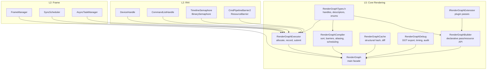
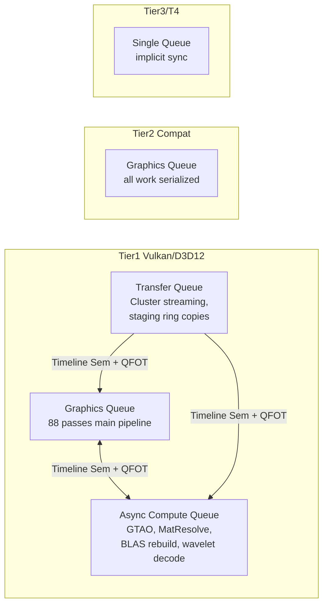

# 04 — Render Graph Architecture

> **Scope**: Declarative render graph framework — DAG construction, multi-queue scheduling,
> automatic barrier insertion, transient resource aliasing, async compute orchestration,
> GPGPU/heterogeneous compute support, conditional execution, graph caching, debugging.
> **Layer**: L5 (Core Rendering) — orchestrates all 88+ passes from `rendering-pipeline-architecture.md`.
> **Depends on**: `02-rhi-design` (Device, CommandBuffer, Sync primitives, Handle system),
> `03-sync` (FrameManager, SyncScheduler, TimelineSemaphore, AsyncTaskManager),
> `04-shader-pipeline` (SlangCompiler, PermutationCache, PipelineCache).
> **Consumed by**: All rendering passes (§3 of `rendering-pipeline-architecture.md`), Scene layer, Plugin system.

---

## 0. Confirmed Architectural Decisions

These decisions were locked before writing this spec. They are **non-negotiable** within this document.

| #   | Decision                             | Detail                                                                                                                                                            |
| --- | ------------------------------------ | ----------------------------------------------------------------------------------------------------------------------------------------------------------------- |
| 1   | **Declarative resource access**      | Passes declare read/write/create on logical resources. No explicit barriers in pass code.                                                                         |
| 2   | **Multi-queue first-class**          | Graph natively models Graphics, Async Compute, Transfer queues. Cross-queue edges produce automatic sync primitives.                                              |
| 3   | **Timeline semaphore sync**          | All cross-queue sync uses timeline semaphores (T1). Binary semaphores only for swapchain acquire/present. Lower tiers degrade gracefully (see `03-sync.md` §2.2). |
| 4   | **Split barrier model**              | Barriers are split into release (after last writer) and acquire (before first reader) to maximize overlap. D3D12 Enhanced Barriers used where available.          |
| 5   | **Transient aliasing by default**    | Resources marked `transient` are automatically aliased by the memory scheduler. Persistent resources opt out.                                                     |
| 6   | **Graph caching**                    | Structural hash detects unchanged graphs; skip recompilation on static scenes.                                                                                    |
| 7   | **Zero-overhead conditional passes** | Disabled passes produce no barriers, no resource allocations, no command recording.                                                                               |
| 8   | **CRTP command recording**           | Pass callbacks receive concrete `CommandBufferBase<Impl>` via single `Dispatch()` at pass entry. Zero vtable cost per draw/dispatch.                              |
| 9   | **Plugin-extensible**                | External code can register custom passes via `IRenderGraphExtension`. No recompilation of core graph.                                                             |
| 10  | **Deterministic execution**          | Same graph + same inputs = identical GPU command stream. Required for golden-image CI.                                                                            |

---

## 1. Design Goals

| Goal                                  | Metric                                                                                                                                        |
| ------------------------------------- | --------------------------------------------------------------------------------------------------------------------------------------------- |
| **Zero explicit barriers**            | Pass authors never call `CmdPipelineBarrier` / `ResourceBarrier`. Graph compiler inserts optimal barriers.                                    |
| **Optimal barrier batching**          | Adjacent barriers merged into single `vkCmdPipelineBarrier2` / `ResourceBarrier` batch. Target: <5 barrier calls per frame for 88-pass graph. |
| **Minimal memory footprint**          | Transient aliasing achieves 30-50% VRAM savings on render targets. Heap reuse across non-overlapping lifetimes.                               |
| **Sub-microsecond graph compilation** | Cached path: <1us. Full recompile (structure change): <100us for 88 passes on single core.                                                    |
| **Cross-queue overlap**               | Async compute overlaps graphics by >=30% of frame time on Tier1 (GTAO + Material Resolve parallel to shadow).                                 |
| **GPGPU extensibility**               | Compute-only subgraphs execute without graphics context. Supports ML inference, physics sim, mesh processing.                                 |
| **Debuggability**                     | Full graph visualization (Graphviz DOT export), per-pass GPU timestamps, barrier audit log, RenderDoc integration.                            |
| **Deterministic execution**           | Same graph + same inputs = bit-identical GPU command stream. Verified via golden-image CI with <1 ULP tolerance.                              |

---

## 2. Architecture Overview

### 2.1 Pipeline Stages

```
RenderGraphBuilder  ->  RenderGraphCompiler  ->  RenderGraphExecutor
(declare passes,       (topological sort,      (allocate memory,
 resources, edges)      barrier synthesis,       record commands,
                        aliasing, scheduling)    submit to queues)
                            |
                     RenderGraphCache
                     (structural hash;
                      skip recompile)
```

### 2.2 Module Decomposition

```
include/miki/core/
    RenderGraph.h              # RenderGraph (main facade): Build, Compile, Execute
    RenderGraphBuilder.h       # RenderGraphBuilder: AddPass, CreateTexture, CreateBuffer,
                               # ImportTexture, ImportBuffer, SetBackbuffer, EnableIf
    RenderGraphCompiler.h      # RenderGraphCompiler: TopologicalSort, BarrierSynthesis,
                               # AliasingScheduler, QueueAssignment, SplitBarrierPlacement
    RenderGraphExecutor.h      # RenderGraphExecutor: AllocateTransients, RecordPasses,
                               # SubmitBatches, CrossQueueSync
    RenderGraphTypes.h         # RGPassHandle, RGResourceHandle, RGTextureDesc, RGBufferDesc,
                               # RGPassDesc, ResourceAccessFlags, QueueType, PassFlags
    RenderGraphCache.h         # RenderGraphCache: StructuralHash, DiffDetect, InvalidatePass
    RenderGraphDebug.h         # GraphvizExport, BarrierAuditLog, PassTimingReport,
                               # ValidationLayer
    IRenderGraphExtension.h    # Plugin extension point for custom passes

src/miki/core/
    RenderGraph.cpp
    RenderGraphBuilder.cpp
    RenderGraphCompiler.cpp
    RenderGraphExecutor.cpp
    RenderGraphCache.cpp
    RenderGraphDebug.cpp
```

### 2.3 Dependency Graph



---

## 3. Core Data Types

### 3.1 Resource Handles & Descriptors

```cpp
namespace miki::core {

// -- Opaque graph-local handles (valid only within a single graph build) --

struct RGPassHandle {
    uint32_t index = UINT32_MAX;
    [[nodiscard]] constexpr auto IsValid() const noexcept -> bool { return index != UINT32_MAX; }
};

struct RGResourceHandle {
    uint32_t index = UINT32_MAX;
    [[nodiscard]] constexpr auto IsValid() const noexcept -> bool { return index != UINT32_MAX; }
};

// -- Resource descriptors --

struct RGTextureDesc {
    uint32_t         width       = 0;      // 0 = derive from backbuffer
    uint32_t         height      = 0;      // 0 = derive from backbuffer
    float            widthScale  = 1.0f;   // relative to backbuffer (e.g., 0.5 for half-res)
    float            heightScale = 1.0f;
    uint32_t         depth       = 1;
    uint32_t         mipLevels   = 1;
    uint32_t         arrayLayers = 1;
    rhi::Format      format      = rhi::Format::RGBA16F;
    rhi::TextureUsage usage      = {};     // auto-inferred from access declarations
    bool             transient   = true;   // eligible for memory aliasing
    const char*      debugName   = nullptr;
};

struct RGBufferDesc {
    uint64_t         size        = 0;
    rhi::BufferUsage usage       = {};     // auto-inferred from access declarations
    rhi::MemoryLocation memory   = rhi::MemoryLocation::GpuOnly;
    bool             transient   = true;
    const char*      debugName   = nullptr;
};
```

### 3.2 Access Flags

Fine-grained access flags drive barrier synthesis. Bit layout separates reads (lower 16) from writes (upper 16) for fast `IsReadOnly()` test.

```cpp
enum class ResourceAccess : uint32_t {
    None              = 0,

    // Read accesses (bits 0-15)
    VertexBuffer      = 1 << 0,
    IndexBuffer       = 1 << 1,
    UniformBuffer     = 1 << 2,
    ShaderReadOnly    = 1 << 3,   // SRV / sampled texture / storage read
    IndirectBuffer    = 1 << 4,
    TransferSrc       = 1 << 5,
    DepthStencilRead  = 1 << 6,
    ColorAttachRead   = 1 << 7,   // input attachment / subpass read
    AccelStructRead   = 1 << 8,
    PresentSrc        = 1 << 9,
    HostRead          = 1 << 10,
    ShadingRateRead   = 1 << 11,  // VRS image source

    // Write accesses (bits 16-31)
    ShaderWrite       = 1 << 16,  // UAV / storage write
    ColorAttachWrite  = 1 << 17,
    DepthStencilWrite = 1 << 18,
    TransferDst       = 1 << 19,
    AccelStructWrite  = 1 << 20,
    HostWrite         = 1 << 21,

    // Composite masks
    AllReads          = 0x0000FFFF,
    AllWrites         = 0xFFFF0000,
};
MIKI_DEFINE_ENUM_BITOPS(ResourceAccess)

[[nodiscard]] constexpr auto IsReadOnly(ResourceAccess a) noexcept -> bool {
    return (static_cast<uint32_t>(a) & static_cast<uint32_t>(ResourceAccess::AllWrites)) == 0;
}
```

**Mapping to RHI barrier primitives** (`02-rhi-design.md` §9.3, Appendix B): The compiler's barrier synthesis stage (§5.4) converts `ResourceAccess` to `(PipelineStage, AccessFlags)` pairs for `CmdBufferBarrier` / `CmdTextureBarrier`:

| ResourceAccess      | PipelineStage                                     | AccessFlags            |
| ------------------- | ------------------------------------------------- | ---------------------- |
| `VertexBuffer`      | `VertexInput`                                     | `VertexAttributeRead`  |
| `IndexBuffer`       | `VertexInput`                                     | `IndexRead`            |
| `UniformBuffer`     | `VertexShader \| FragmentShader \| ComputeShader` | `UniformRead`          |
| `ShaderReadOnly`    | `VertexShader \| FragmentShader \| ComputeShader` | `ShaderRead`           |
| `IndirectBuffer`    | `DrawIndirect`                                    | `IndirectCommandRead`  |
| `TransferSrc`       | `Transfer`                                        | `TransferRead`         |
| `DepthStencilRead`  | `EarlyFragTests \| LateFragTests`                 | `DepthStencilRead`     |
| `ColorAttachRead`   | `ColorAttachOutput`                               | `ColorAttachmentRead`  |
| `AccelStructRead`   | `RayTracing`                                      | `AccelStructRead`      |
| `PresentSrc`        | `BottomOfPipe`                                    | `None`                 |
| `ShadingRateRead`   | `ShadingRateImage`                                | `ShadingRateImageRead` |
| `ShaderWrite`       | `ComputeShader \| FragmentShader`                 | `ShaderWrite`          |
| `ColorAttachWrite`  | `ColorAttachOutput`                               | `ColorAttachmentWrite` |
| `DepthStencilWrite` | `EarlyFragTests \| LateFragTests`                 | `DepthStencilWrite`    |
| `TransferDst`       | `Transfer`                                        | `TransferWrite`        |
| `AccelStructWrite`  | `RayTracing`                                      | `AccelStructWrite`     |

When a pass declares multiple accesses (e.g., `ShaderReadOnly | ShaderWrite`), the compiler ORs the corresponding stage/access masks. This table is the **single source of truth** for the conversion; any mismatch with `02-rhi-design.md` Appendix B is a bug.

### 3.3 Queue & Pass Types

```cpp
enum class RGQueueType : uint8_t {
    Graphics,
    AsyncCompute,
    Transfer,
    Count,
};

enum class RGPassFlags : uint32_t {
    None           = 0,
    Graphics       = 1 << 0,   // uses graphics pipeline (rasterization)
    Compute        = 1 << 1,   // uses compute pipeline
    Transfer       = 1 << 2,   // copy/blit operations
    AsyncCompute   = 1 << 3,   // eligible for async compute queue
    NeverCull      = 1 << 4,   // never culled even if outputs unused
    AllowMerge     = 1 << 5,   // allow render pass merge (subpass-like)
    SideEffects    = 1 << 6,   // has external side effects (present, readback)
    AsyncTransfer  = 1 << 7,   // eligible for dedicated transfer queue
};
MIKI_DEFINE_ENUM_BITOPS(RGPassFlags)

} // namespace miki::core
```

### 3.4 Resource Access Declaration (per-pass)

```cpp
struct RGResourceAccess {
    RGResourceHandle   resource;
    ResourceAccess     access   = ResourceAccess::None;
    rhi::TextureLayout layout   = rhi::TextureLayout::Undefined; // textures only; auto-inferred if Undefined
    uint32_t           mipLevel   = kAllMips;    // kAllMips = UINT32_MAX
    uint32_t           arrayLayer = kAllLayers;  // kAllLayers = UINT32_MAX
};
```

---

## 4. RenderGraphBuilder -- Declarative Pass & Resource API

### 4.1 Public API

```cpp
class RenderGraphBuilder {
public:
    // -- Pass declaration --

    /// @brief Add a graphics pass.
    template <typename SetupFn, typename ExecuteFn>
    [[nodiscard]] auto AddGraphicsPass(const char* name, SetupFn&& setup, ExecuteFn&& execute) -> RGPassHandle;

    /// @brief Add a compute pass (runs on graphics queue by default).
    template <typename SetupFn, typename ExecuteFn>
    [[nodiscard]] auto AddComputePass(const char* name, SetupFn&& setup, ExecuteFn&& execute) -> RGPassHandle;

    /// @brief Add an async compute pass (eligible for async compute queue on T1).
    template <typename SetupFn, typename ExecuteFn>
    [[nodiscard]] auto AddAsyncComputePass(const char* name, SetupFn&& setup, ExecuteFn&& execute) -> RGPassHandle;

    /// @brief Add a transfer pass (eligible for dedicated transfer queue on T1).
    template <typename SetupFn, typename ExecuteFn>
    [[nodiscard]] auto AddTransferPass(const char* name, SetupFn&& setup, ExecuteFn&& execute) -> RGPassHandle;

    /// @brief Add a present pass (signals swapchain, never culled).
    [[nodiscard]] auto AddPresentPass(const char* name, RGResourceHandle backbuffer) -> RGPassHandle;

    // -- Resource declaration --

    [[nodiscard]] auto CreateTexture(const RGTextureDesc& desc) -> RGResourceHandle;
    [[nodiscard]] auto CreateBuffer(const RGBufferDesc& desc) -> RGResourceHandle;
    [[nodiscard]] auto ImportTexture(rhi::TextureHandle handle, const char* debugName = nullptr) -> RGResourceHandle;
    [[nodiscard]] auto ImportBuffer(rhi::BufferHandle handle, const char* debugName = nullptr) -> RGResourceHandle;
    [[nodiscard]] auto ImportBackbuffer(rhi::TextureHandle swapImage) -> RGResourceHandle;

    // -- Conditional execution --

    auto EnableIf(RGPassHandle pass, std::function<bool()> condition) -> void;

    // -- Subgraph composition --

    auto InsertSubgraph(const RenderGraphTemplate& subgraph) -> void;

    // -- Build --

    [[nodiscard]] auto Build() -> RenderGraphDescription;

private:
    struct PassNode {
        const char*                    name;
        RGPassFlags                    flags;
        RGQueueType                    preferredQueue;
        std::function<bool()>          condition;
        std::vector<RGResourceAccess>  reads;
        std::vector<RGResourceAccess>  writes;
        std::vector<RGResourceAccess>  creates;
        std::move_only_function<void(RenderPassContext&)> execute;
        bool                           hasSideEffects = false;
    };

    struct ResourceNode {
        enum class Type : uint8_t { Texture, Buffer };
        Type               type;
        RGTextureDesc      textureDesc;
        RGBufferDesc       bufferDesc;
        bool               imported    = false;
        rhi::TextureHandle importedTexture;
        rhi::BufferHandle  importedBuffer;
        uint64_t           importGeneration = 0;  // incremented by external owner on content change;
                                                   // graph caches compare generation to detect stale imports
                                                   // without re-hashing resource contents (see §10.3)
        const char*        debugName   = nullptr;
    };

    std::vector<PassNode>     passes_;
    std::vector<ResourceNode> resources_;
};
```

### 4.2 PassBuilder -- Per-Pass Resource Binding

**Resource Versioning (SSA Model)**: Every `Read*`, `Write*`, and `ReadWrite*` method returns a **new** `RGResourceHandle` representing a distinct version of the underlying physical resource. This is analogous to SSA (Static Single Assignment) form in compiler IR:

- `WriteTexture(h)` → returns `h'` (new version). Subsequent passes must use `h'` to read the written data.
- `ReadTexture(h')` → returns `h''` (read-version). The compiler uses version chains to deduce precise RAW/WAR/WAW edges.
- `ReadWriteTexture(h')` → returns `h'''` (in-place mutation). Creates both a RAW edge (read `h'`) and a WAW edge (write `h'''`).

This eliminates ambiguity in dependency analysis: each handle uniquely identifies a producer-consumer relationship. The compiler never needs to guess which write a read depends on — the version chain is explicit. Stale handles (using an old version after a write) are detected by the validation layer in debug builds.

The `setup` lambda receives a `PassBuilder&` for declaring resource access:

```cpp
class PassBuilder {
public:
    // -- Read declarations --
    auto ReadTexture(RGResourceHandle tex, ResourceAccess access = ResourceAccess::ShaderReadOnly) -> RGResourceHandle;
    auto ReadBuffer(RGResourceHandle buf, ResourceAccess access = ResourceAccess::ShaderReadOnly) -> RGResourceHandle;
    auto ReadDepth(RGResourceHandle tex) -> RGResourceHandle;

    // -- Write declarations --
    auto WriteTexture(RGResourceHandle tex, ResourceAccess access = ResourceAccess::ShaderWrite) -> RGResourceHandle;
    auto WriteBuffer(RGResourceHandle buf, ResourceAccess access = ResourceAccess::ShaderWrite) -> RGResourceHandle;
    auto WriteColorAttachment(RGResourceHandle tex, uint32_t index,
                              rhi::AttachmentLoadOp load = rhi::AttachmentLoadOp::Clear, rhi::AttachmentStoreOp store = rhi::AttachmentStoreOp::Store) -> RGResourceHandle;
    auto WriteDepthStencil(RGResourceHandle tex,
                           rhi::AttachmentLoadOp load = rhi::AttachmentLoadOp::Clear, rhi::AttachmentStoreOp store = rhi::AttachmentStoreOp::Store) -> RGResourceHandle;

    // -- Read-Write (UAV) --
    auto ReadWriteTexture(RGResourceHandle tex) -> RGResourceHandle;
    auto ReadWriteBuffer(RGResourceHandle buf) -> RGResourceHandle;

    // -- Resource creation within pass --
    auto CreateTexture(const RGTextureDesc& desc) -> RGResourceHandle;
    auto CreateBuffer(const RGBufferDesc& desc) -> RGResourceHandle;

    // -- Async task dependency --
    auto WaitForAsyncTask(frame::AsyncTaskHandle task) -> void;

    // -- Cross-frame history read (see §9.5) --
    auto ReadHistoryTexture(RGResourceHandle tex, const char* historyName) -> RGResourceHandle;
    auto ReadHistoryBuffer(RGResourceHandle buf, const char* historyName) -> RGResourceHandle;

    // -- Metadata --
    auto SetSideEffects() -> void;
    auto SetOrderHint(int32_t hint) -> void; // lower = scheduled earlier among peers
};
```

### 4.3 Usage Example -- Partial 88-Pass Pipeline Setup

```cpp
auto BuildMainPipeline(RenderGraphBuilder& builder, const FrameData& frame) -> void {
    auto backbuffer  = builder.ImportBackbuffer(frame.swapchainImage);
    auto sceneBuffer = builder.ImportBuffer(frame.sceneBufferGpu, "SceneBuffer");
    auto depthTarget = builder.CreateTexture({.format = rhi::Format::D32_SFLOAT, .debugName = "DepthTarget"});
    auto hiZ         = builder.CreateTexture({.mipLevels = 12, .format = rhi::Format::R32_FLOAT, .debugName = "HiZ"});
    auto visBuffer   = builder.CreateTexture({.format = rhi::Format::RG32_UINT, .debugName = "VisBuffer"});
    auto gbufferRT0  = builder.CreateTexture({.format = rhi::Format::RGBA8_UNORM, .debugName = "GBuffer.RT0"});
    auto gbufferRT1  = builder.CreateTexture({.format = rhi::Format::RGBA16F, .debugName = "GBuffer.RT1"});
    auto hdrColor    = builder.CreateTexture({.format = rhi::Format::RGBA16F, .debugName = "HDRColor"});
    auto aoBuffer    = builder.CreateTexture({
        .widthScale = 0.5f, .heightScale = 0.5f, .format = rhi::Format::R8_UNORM, .debugName = "AOBuffer"});

    // Pass #1: DepthPrePass + HiZ
    builder.AddGraphicsPass("DepthPrePass+HiZ",
        [&](PassBuilder& pb) {
            pb.ReadBuffer(sceneBuffer, ResourceAccess::VertexBuffer | ResourceAccess::ShaderReadOnly);
            pb.WriteDepthStencil(depthTarget, rhi::AttachmentLoadOp::Clear, rhi::AttachmentStoreOp::Store);
            pb.WriteTexture(hiZ, ResourceAccess::ShaderWrite);
        },
        [&](RenderPassContext& ctx) { /* record depth + HiZ mip gen */ });

    // Pass #2: GPU Culling (compute on graphics queue)
    builder.AddComputePass("GPUCulling",
        [&](PassBuilder& pb) {
            pb.ReadTexture(hiZ, ResourceAccess::ShaderReadOnly);
            pb.ReadBuffer(sceneBuffer, ResourceAccess::ShaderReadOnly);
            pb.WriteBuffer(frame.visibleList, ResourceAccess::ShaderWrite);
        },
        [&](RenderPassContext& ctx) { /* dispatch culling */ });

    // Pass #15: GTAO -- async compute candidate
    auto gtaoPass = builder.AddAsyncComputePass("GTAO",
        [&](PassBuilder& pb) {
            pb.ReadTexture(depthTarget, ResourceAccess::ShaderReadOnly);
            pb.WriteTexture(aoBuffer, ResourceAccess::ShaderWrite);
        },
        [&](RenderPassContext& ctx) { /* dispatch GTAO */ });
    builder.EnableIf(gtaoPass, [&]() { return !frame.useRTAO; });

    // Pass #18: Deferred Resolve -- consumes async compute outputs
    builder.AddComputePass("DeferredResolve",
        [&](PassBuilder& pb) {
            pb.ReadTexture(gbufferRT0);
            pb.ReadTexture(gbufferRT1);
            pb.ReadTexture(aoBuffer);
            pb.WriteTexture(hdrColor, ResourceAccess::ShaderWrite);
        },
        [&](RenderPassContext& ctx) { /* dispatch resolve */ });

    // Pass #0 (Transfer): Streaming upload -- runs on dedicated transfer queue
    builder.AddTransferPass("MeshletStreamUpload",
        [&](PassBuilder& pb) {
            pb.ReadBuffer(frame.stagingRing, ResourceAccess::TransferSrc);
            pb.WriteBuffer(frame.meshletBuffer, ResourceAccess::TransferDst);
            // Cross-queue sync: graphics queue waits for transfer completion
            // before GPUCulling reads meshletBuffer. Compiler auto-inserts
            // timeline semaphore signal/wait + QFOT (Vulkan) at this edge.
        },
        [&](RenderPassContext& ctx) { /* CmdCopyBuffer regions */ });

    // ... remaining 80+ passes follow the same pattern ...

    builder.AddPresentPass("Present", backbuffer);
}
```

---

## 5. RenderGraphCompiler -- The Core Engine

The compiler transforms a declarative graph description into an optimized execution plan.

### 5.1 Compilation Pipeline (10 Stages)

```
Stage 1: Condition Evaluation & Pass Culling
    +-- Evaluate all condition lambdas
    +-- Dead-code elimination: cull passes whose outputs are never consumed
    +-- Output: active pass set

Stage 2: Dependency Analysis & DAG Construction
    +-- Build adjacency lists from resource read/write declarations
    +-- WAW, WAR, RAW edge classification
    +-- Output: DAG with typed edges

Stage 3: Topological Sort (Modified Kahn's Algorithm)
    +-- Kahn sort with priority heuristics (see 5.3)
    +-- Cycle detection (assert: DAG must be acyclic)
    +-- Output: linearized pass order

Stage 4: Queue Assignment
    +-- Assign each pass to Graphics / AsyncCompute / Transfer queue
    +-- Cost-model gated (see 7.2)
    +-- Output: per-pass queue assignment

Stage 5: Cross-Queue Synchronization Synthesis
    +-- For each cross-queue edge: timeline semaphore signal/wait pair
    +-- Vulkan: insert QFOT release/acquire barriers
    +-- D3D12: insert resource state transitions (no QFOT needed)
    +-- Merge redundant sync points (fan-in optimization)
    +-- Output: sync point map

Stage 6: Barrier Synthesis (Split Barrier Model)
    +-- Compute minimal src/dst stage + access masks per transition
    +-- Split into RELEASE (after last writer) and ACQUIRE (before first reader)
    +-- Batch adjacent barriers into single API call
    +-- Image layout transitions integrated
    +-- Output: per-pass barrier commands

Stage 7: Transient Resource Aliasing (Memory Scheduling)
    +-- Compute lifetime intervals [firstPass, lastPass] per transient resource
    +-- Interval graph coloring: assign non-overlapping resources to shared memory
    +-- Insert aliasing barriers at ownership handoff
    +-- Output: memory layout, aliasing barriers

Stage 8: Render Pass Merging (see §5.7)
    +-- Identify consecutive graphics passes on the same queue sharing attachments
    +-- Merge into Vulkan subpasses / D3D12 render pass tiers where profitable
    +-- Insert subpass dependencies replacing explicit barriers
    +-- Output: merged render pass groups with subpass metadata

Stage 9: Backend Adaptation Pass Injection (see rendering-pipeline-architecture.md §20b)
    +-- Query BackendAdaptationTable for staging copy / shader emulation needs
    +-- Inject auxiliary transfer/compute passes for backend-incompatible operations
    +-- Rewrite dependency edges to include injected passes
    +-- Output: expanded pass list with adaptation passes

Stage 10: Command Batch Formation
    +-- Group passes into submission batches per queue
    +-- Insert split-submit points for early timeline signals (see 03-sync.md 5.3)
    +-- Assign timeline values via SyncScheduler::AllocateSignal()
    +-- Output: executable command batches with sync metadata
```

### 5.2 Dependency Edge Classification

| Hazard                        | Abbr | Barrier Required               | Example                                                      |
| ----------------------------- | ---- | ------------------------------ | ------------------------------------------------------------ |
| Read-After-Write              | RAW  | Execution + Memory             | Compute writes SSBO -> Graphics reads as SRV                 |
| Write-After-Read              | WAR  | Execution only                 | Graphics reads texture -> Compute overwrites                 |
| Write-After-Write             | WAW  | Execution + Memory             | Pass A writes RT -> Pass B overwrites same RT                |
| Read-After-Read (same queue)  | RAR  | None                           | Multiple passes read same SRV                                |
| Read-After-Read (cross-queue) | RAR  | **QFOT acquire** (Vulkan only) | Graphics reads -> Compute reads same buffer (EXCLUSIVE mode) |

**Critical correctness rule**: RAR on the **same queue** requires no barrier. RAR across **different queue families** on Vulkan requires a QFOT if the resource was created with `VK_SHARING_MODE_EXCLUSIVE`. The compiler handles this automatically.

### 5.3 Topological Sort with Priority Heuristics

Modified Kahn's algorithm with a priority queue instead of a plain FIFO:

```cpp
auto TopologicalSort(const DAG& dag, const QueueAssignment& queues) -> std::vector<uint32_t> {
    auto inDegree = ComputeInDegrees(dag);
    auto pq = PriorityQueue<uint32_t, PassPriority>{};

    for (auto node : dag.Nodes()) {
        if (inDegree[node] == 0) pq.Push(node, ComputePriority(node, dag, queues));
    }

    std::vector<uint32_t> order;
    order.reserve(dag.NodeCount());

    while (!pq.Empty()) {
        auto current = pq.Pop();
        order.push_back(current);
        for (auto successor : dag.Successors(current)) {
            if (--inDegree[successor] == 0) {
                pq.Push(successor, ComputePriority(successor, dag, queues));
            }
        }
    }

    MIKI_ASSERT(order.size() == dag.NodeCount(), "Cycle detected in render graph");
    return order;
}
```

**Priority heuristics** (evaluated in order, first tiebreaker wins):

| Priority    | Heuristic                   | Rationale                                                |
| ----------- | --------------------------- | -------------------------------------------------------- |
| 0 (highest) | NeverCull / SideEffects     | Present, readback must not be reordered                  |
| 1           | Same-queue clustering       | Reduce cross-queue sync points                           |
| 2           | Barrier batching affinity   | Group passes with transitions on same resources          |
| 3           | Producer-consumer proximity | Schedule consumer close to producer -> maximize aliasing |
| 4           | User-specified order hint   | `PassBuilder::SetOrderHint(int)` for manual tuning       |
| 5 (lowest)  | Original declaration order  | Stable sort tiebreaker for determinism                   |

#### 5.3.1 Barrier-Aware Global Reordering (Optional Second Pass)

The priority-based Kahn's sort produces a good initial order, but is locally greedy — it cannot look ahead to evaluate whether a different topologically-valid permutation yields fewer total barriers or lower bandwidth. A second reordering pass optimizes the initial order within topological constraints:

```
Input:  Initial topological order L, DAG edges E, resource transition costs C
Output: Reordered sequence L' minimizing objective function

Objective function (configurable via SchedulerStrategy):
  MinBarriers:  minimize |{ barriers emitted }|
  MinMemory:    minimize peak transient memory (aggressive aliasing)
  MinLatency:   minimize critical path length (maximize async overlap)
  Balanced:     weighted combination (default: 0.5*Barriers + 0.3*Memory + 0.2*Latency)

Algorithm: Greedy swap within topological window
  1. For each pass P_i in L:
     a. Compute valid insertion range [lo, hi] respecting all DAG edges
     b. Evaluate objective delta for inserting P_i at each position in [lo, hi]
     c. Move P_i to the position minimizing the objective
  2. Iterate until convergence or max 3 iterations (empirically sufficient)

Complexity: O(P^2) worst case, typically O(P * W) where W = avg window size (~5-10).
For 88 passes: <5us additional compilation cost.
```

```cpp
enum class SchedulerStrategy : uint8_t {
    MinBarriers,   // minimize barrier count (best for discrete GPUs with large caches)
    MinMemory,     // minimize peak transient memory (best for memory-constrained targets)
    MinLatency,    // minimize critical path (best for async compute overlap)
    Balanced,      // weighted combination (default)
};
```

**When to apply**: Only on full recompilation (cache miss). Skipped on cached path. The reordered sequence is stored in the cache alongside the compiled graph.

**Benchmark reference**: AMD RPS scheduler with `prefer barrier batching` flag achieves 10-20% fewer barriers vs declaration order on real game traces. miki's barrier-aware reordering targets the same improvement range.

### 5.4 Split Barrier Model

Traditional barriers stall the pipeline: all work before must complete before any work after. Split barriers decouple the signal (release) from the wait (acquire), allowing unrelated work to fill the gap.

```
Without split barriers:
  Pass A (write) -> [FULL BARRIER] -> Pass B (read)
  GPU idle between A's last write and B's first read

With split barriers:
  Pass A (write) -> [RELEASE] -> Pass C (unrelated) -> [ACQUIRE] -> Pass B (read)
  Pass C executes during barrier resolution -- zero idle time
```

**Implementation per backend**:

| Backend                 | Split Barrier Mechanism                                                                                                                                                                                                                                                                                                                                  |
| ----------------------- | -------------------------------------------------------------------------------------------------------------------------------------------------------------------------------------------------------------------------------------------------------------------------------------------------------------------------------------------------------- |
| Vulkan 1.4              | `vkCmdPipelineBarrier2` with separate release/acquire placement. `VK_DEPENDENCY_BY_REGION_BIT` when applicable.                                                                                                                                                                                                                                          |
| D3D12 Enhanced Barriers | `ID3D12GraphicsCommandList7::Barrier()` with `D3D12_BARRIER_SYNC_SPLIT`. `LayoutBefore/LayoutAfter` split across command list boundaries.                                                                                                                                                                                                                |
| D3D12 Legacy            | `ResourceBarrier` with `D3D12_RESOURCE_BARRIER_FLAG_BEGIN_ONLY` / `END_ONLY`.                                                                                                                                                                                                                                                                            |
| D3D12 Fence Barriers    | `SignalBarrier` (release) + `WaitBarrier` (acquire) on command-list-scoped fences (Agility SDK 1.719+). Tier-1: intra-command-list only. Tier-2 (future): cross-queue `WaitBarrier` via native fences, potentially replacing timeline semaphore for D3D12. Preferred over Enhanced Barriers split when available — more explicit, lower driver overhead. |
| OpenGL 4.3              | `glMemoryBarrier()` -- no split; single call before consumer.                                                                                                                                                                                                                                                                                            |
| WebGPU                  | Implicit (Dawn/wgpu handle transitions). No explicit API calls.                                                                                                                                                                                                                                                                                          |

### 5.5 Cross-Queue Synchronization Synthesis

For each edge crossing queue boundaries:

```cpp
struct CrossQueueSyncPoint {
    RGQueueType srcQueue;
    RGQueueType dstQueue;
    uint32_t    srcPassIndex;   // last pass on srcQueue before sync
    uint32_t    dstPassIndex;   // first pass on dstQueue after sync
    uint64_t    timelineValue = 0;  // allocated at execution by SyncScheduler
};
```

**Fan-in optimization**: Multiple async compute passes feeding a single graphics pass (e.g., GTAO + Material Resolve -> Deferred Resolve) share one timeline semaphore signal at the last compute pass. Reduces sync overhead from O(edges) to O(queue-transitions).

**Vulkan QFOT handling**:

```
For EXCLUSIVE sharing mode resources crossing queue families:

  Source queue (release):
    { srcQueueFamilyIndex = computeFamily, dstQueueFamilyIndex = graphicsFamily,
      srcStageMask = COMPUTE_SHADER, srcAccessMask = SHADER_WRITE }

  Destination queue (acquire):
    { srcQueueFamilyIndex = computeFamily, dstQueueFamilyIndex = graphicsFamily,
      dstStageMask = FRAGMENT_SHADER, dstAccessMask = SHADER_READ }

  Timeline semaphore ensures release completes before acquire executes.
```

**CONCURRENT vs EXCLUSIVE decision**: Buffers default to `VK_SHARING_MODE_CONCURRENT` (negligible perf difference on modern HW). Images use `VK_SHARING_MODE_EXCLUSIVE` for optimal layout transitions, with automatic QFOT insertion. Matches AMD guidance: CONCURRENT for buffers, EXCLUSIVE for images.

### 5.6 Transient Resource Aliasing

The memory scheduler assigns transient resources to shared heaps, reusing memory across non-overlapping lifetimes.

**Algorithm: Interval Graph Coloring (greedy bin-packing)**

```
Input:  Set of transient resources R, each with lifetime [first_pass, last_pass]
Output: Memory heap assignment (resource -> slot)

1. Sort resources by size (largest first)
2. For each resource r:
   a. Find existing heap slot s where:
      - s.size >= r.size (within 10% overshoot tolerance)
      - s.lifetime does not overlap r.lifetime
      - s.memoryType compatible with r.memoryType
   b. If found: assign r to s, extend s.lifetime
   c. If not found: allocate new slot
3. Insert aliasing barriers at ownership handoff points
```

**Memory savings estimation** (88-pass pipeline, 4K):

| Resource Category                         | Without Aliasing | With Aliasing                       | Savings  |
| ----------------------------------------- | ---------------- | ----------------------------------- | -------- |
| GBuffer MRT (RT0+RT1+RT2+Depth)           | ~120 MB          | ~120 MB (persistent across resolve) | 0%       |
| AO buffers (half-res)                     | ~4 MB            | ~2 MB (shared with bloom temp)      | 50%      |
| Post-process chain (bloom, DoF, MB temps) | ~80 MB           | ~30 MB (sequential reuse)           | 62%      |
| Shadow maps (VSM/CSM)                     | ~128 MB          | ~128 MB (persistent)                | 0%       |
| HLR edge buffers                          | ~32 MB           | ~16 MB (aliased with post temps)    | 50%      |
| **Total RT/transient**                    | **~364 MB**      | **~220 MB**                         | **~40%** |

**Aliasing barrier injection** at ownership handoff:

#### 5.6.1 Vulkan Aliasing Barriers (Tier1/Tier2)

Transient resources are sub-allocated from a shared `VkDeviceMemory` pool via `vkBindImageMemory` / `vkBindBufferMemory` with overlapping offsets. At ownership handoff:

```cpp
// Step 1: Release — no-op. The previous owner's last barrier already flushed caches.
//   (Split barrier acquire at the end of last consumer handles this.)

// Step 2: Acquire — transition new owner from UNDEFINED with full cache invalidation.
VkImageMemoryBarrier2 aliasingBarrier {
    .sType            = VK_STRUCTURE_TYPE_IMAGE_MEMORY_BARRIER_2,
    .srcStageMask     = VK_PIPELINE_STAGE_2_NONE,       // no dependency on previous owner
    .srcAccessMask    = VK_ACCESS_2_NONE,                // previous contents discarded
    .dstStageMask     = firstUsageStage(newOwner),       // e.g., COLOR_ATTACHMENT_OUTPUT
    .dstAccessMask    = firstUsageAccess(newOwner),      // e.g., COLOR_ATTACHMENT_WRITE
    .oldLayout        = VK_IMAGE_LAYOUT_UNDEFINED,       // discard — mandatory for aliasing
    .newLayout        = initialLayout(newOwner),          // e.g., COLOR_ATTACHMENT_OPTIMAL
    .image            = newOwnerImage,
    .subresourceRange = fullRange(newOwner),
};
// Batched with other acquire barriers at the new owner's first pass (see §5.6.4).
```

**Critical invariant**: `oldLayout = UNDEFINED` is mandatory, not optional. Setting it to the previous owner's last layout would violate the Vulkan spec (same memory bound to different images). The `UNDEFINED` transition implicitly waits for all prior accesses to the memory region to complete via the memory dependency, ensuring no data race.

**Placed resource strategy**: All transient images in the same aliasing group share a single `VkDeviceMemory` allocation. The compiler pre-computes a `VkBindImageMemoryInfo[]` batch per frame and calls `vkBindImageMemory2` once (Vulkan 1.1+). For `VK_KHR_maintenance1` compatibility, this is equivalent to individual `vkBindImageMemory` calls but lower driver overhead.

#### 5.6.2 D3D12 Aliasing Barriers (Tier1)

Transient resources are created as **placed resources** in a shared `ID3D12Heap`. At ownership handoff:

```cpp
// Legacy barrier path (D3D12_RESOURCE_BARRIER_TYPE_ALIASING):
D3D12_RESOURCE_BARRIER aliasingBarrier {
    .Type          = D3D12_RESOURCE_BARRIER_TYPE_ALIASING,
    .Aliasing = {
        .pResourceBefore = previousOwnerResource,  // may be nullptr if first use
        .pResourceAfter  = newOwnerResource,
    },
};
// Followed by a transition barrier to the new owner's initial state:
D3D12_RESOURCE_BARRIER transitionBarrier {
    .Type       = D3D12_RESOURCE_BARRIER_TYPE_TRANSITION,
    .Transition = {
        .pResource   = newOwnerResource,
        .StateBefore = D3D12_RESOURCE_STATE_COMMON,  // placed resource initial state
        .StateAfter  = firstUsageState(newOwner),     // e.g., D3D12_RESOURCE_STATE_RENDER_TARGET
    },
};

// Enhanced barrier path (ID3D12GraphicsCommandList7, Agility SDK 1.610+):
D3D12_TEXTURE_BARRIER enhancedBarrier {
    .SyncBefore  = D3D12_BARRIER_SYNC_NONE,
    .SyncAfter   = firstUsageSync(newOwner),
    .AccessBefore = D3D12_BARRIER_ACCESS_NO_ACCESS,
    .AccessAfter  = firstUsageAccess_D3D12(newOwner),
    .LayoutBefore = D3D12_BARRIER_LAYOUT_UNDEFINED,   // discard
    .LayoutAfter  = firstUsageLayout(newOwner),
    .pResource    = newOwnerResource,
    .Flags        = D3D12_TEXTURE_BARRIER_FLAG_DISCARD, // explicit discard for aliasing
};
```

**D3D12 heap grouping strategy**: The aliasing scheduler partitions transient resources into heap groups by resource category, then creates one `ID3D12Heap` per group:

| Heap Group       | Flag                                             | Resources                                                                                            | Rationale                                                                                              |
| ---------------- | ------------------------------------------------ | ---------------------------------------------------------------------------------------------------- | ------------------------------------------------------------------------------------------------------ |
| RT/DS textures   | `D3D12_HEAP_FLAG_ALLOW_ONLY_RT_DS_TEXTURES`      | GBuffer MRTs, depth, shadow maps, AO targets, HDR color                                              | Optimal placement on NVIDIA/AMD — separate memory pool for render targets yields better cache behavior |
| Non-RT textures  | `D3D12_HEAP_FLAG_ALLOW_ONLY_NON_RT_DS_TEXTURES`  | HiZ, bloom mip chain, VRS image, readback staging                                                    | Separates SRV-only textures from write-heavy RTs                                                       |
| Buffers          | `D3D12_HEAP_FLAG_ALLOW_ONLY_BUFFERS`             | Transient SSBOs, indirect draw args, sort scratch                                                    | Buffer-only heap avoids texture alignment overhead (64KB -> 256B)                                      |
| Mixed (fallback) | `D3D12_HEAP_FLAG_ALLOW_ALL_BUFFERS_AND_TEXTURES` | Used only when `D3D12_FEATURE_DATA_D3D12_OPTIONS::ResourceHeapTier` is Tier 1 (requires mixed heaps) |

Placed resources created via `ID3D12Device::CreatePlacedResource` with `D3D12_RESOURCE_STATE_COMMON`. The scheduler queries `ResourceHeapTier` at device init: Tier 2 (all modern GPUs) uses split heaps; Tier 1 falls back to mixed.

**Vulkan heap grouping**: Resources are grouped by `memoryTypeIndex` compatibility. The scheduler queries `vkGetImageMemoryRequirements` / `vkGetBufferMemoryRequirements` and bins resources into groups sharing the same `memoryTypeBits`. Within each group, interval graph coloring proceeds independently. Typically 2-3 groups suffice (device-local for color/depth, device-local for buffers, host-visible for readback).

#### 5.6.3 OpenGL / WebGPU Aliasing Strategy

| Backend            | Strategy                                              | Detail                                                                                                                                                                                                  |
| ------------------ | ----------------------------------------------------- | ------------------------------------------------------------------------------------------------------------------------------------------------------------------------------------------------------- |
| OpenGL 4.3 (Tier4) | **No aliasing** — allocate/destroy per frame          | `glMemoryBarrier(GL_ALL_BARRIER_BITS)` between passes suffices. Aliasing via `glInvalidateFramebuffer` possible but driver support inconsistent; not worth the complexity for Tier4 target.             |
| WebGPU (Tier3)     | **No aliasing** — Dawn/wgpu manages memory internally | WebGPU has no user-visible memory aliasing API. Transient resources allocated via `device.createTexture()` per build and destroyed at frame end. Dawn's internal allocator may alias behind the scenes. |

**Tier3/4 memory budget impact**: Without aliasing, Tier3/4 consume ~40% more transient VRAM than Tier1. Acceptable because Tier3 targets <10M tri scenes (low VRAM pressure) and Tier4 targets remote desktop/VM (host VRAM typically sufficient).

#### 5.6.4 Aliasing Barrier Batching

All aliasing barriers for resources first used in pass P are batched into a single `vkCmdPipelineBarrier2` / `ID3D12GraphicsCommandList::ResourceBarrier` call at the beginning of pass P, co-located with the pass's acquire barriers (§5.4). This minimizes API call overhead:

```
Per-pass barrier emission order:
  1. Aliasing barriers (UNDEFINED -> initial layout) for newly activated resources
  2. Acquire barriers (split barrier second half) from prior passes
  3. [Execute pass commands]
  4. Release barriers (split barrier first half) for resources consumed later
```

Typical 88-pass pipeline: ~30-50 aliasing barriers per frame, batched into ~15-20 API calls (multiple aliasing barriers sharing the same first-consumer pass are merged).

### 5.7 Render Pass Merging (Subpass Consolidation)

Consecutive graphics passes sharing render targets can be merged into a single render pass with multiple subpasses (Vulkan) or a single `BeginRenderPass`/`EndRenderPass` scope (D3D12 Render Pass Tier 2). This exploits **tile memory** on tile-based GPUs (Apple M-series, Qualcomm Adreno, Intel integrated, AMD RDNA Infinity Cache) to avoid round-tripping attachment data through VRAM.

#### 5.7.1 Merge Eligibility

Two consecutive graphics passes P*i and P*{i+1} (in topological order) are **merge-eligible** iff ALL hold:

| #   | Condition                                                                                   | Rationale                                       |
| --- | ------------------------------------------------------------------------------------------- | ----------------------------------------------- |
| 1   | `P_i.queue == P_{i+1}.queue == Graphics`                                                    | Subpasses are single-queue only                 |
| 2   | `P_i.renderArea == P_{i+1}.renderArea`                                                      | Same resolution + viewport required             |
| 3   | P\_{i+1} reads (input attachment) an output of P_i, OR both share the same depth attachment | Tile reuse only benefits shared attachments     |
| 4   | No cross-queue consumer between them                                                        | Would require flushing tiles for external read  |
| 5   | No aliasing conflict on transient resources                                                 | Aliased memory cannot be in-tile simultaneously |
| 6   | Neither pass has HostRead/HostWrite or PresentSrc                                           | Side effects require full VRAM flush            |

**Transitivity**: If P*i merges with P*{i+1} and P*{i+1} with P*{i+2}, all three form one merged render pass.

#### 5.7.2 Merge Algorithm

```
Input:  Topologically sorted pass list L, barrier map B
Output: MergedRenderPassGroup[] groups

1. current_group = { L[0] } if L[0] is graphics, else empty
2. For each pass P in L[1..]:
   a. If P is not graphics: flush current_group -> groups, start new
   b. Else if MergeEligible(current_group.last(), P):
      - Append P to current_group
      - Convert inter-pass barrier B[last, P] to SubpassDependency:
          { srcSubpass, dstSubpass, srcStage, dstStage, srcAccess, dstAccess,
            flags = VK_DEPENDENCY_BY_REGION_BIT }
      - Remove barrier from B (subpass dependency replaces it)
   c. Else: flush current_group, start new group with P
3. Flush final group.

Complexity: O(N) single pass, N = active pass count.
```

#### 5.7.3 Per-Backend Emission

**Vulkan (Tier1/Tier2)**:

When `VK_KHR_dynamic_rendering_local_read` is available (Vulkan 1.4 optional feature, required for input attachment reads under dynamic rendering), merged passes use `vkCmdBeginRendering` with input attachment remapping. Previous subpass outputs are read via `GL_SUBPASS_INPUT` / `VK_DESCRIPTOR_TYPE_INPUT_ATTACHMENT`.

Fallback decision tree:

```
dynamicRenderingLocalRead supported? -> merge via dynamic rendering + input attachments
else VkRenderPass path available?    -> merge via VkRenderPass with subpasses
else                                 -> skip merging (explicit barrier path, no regression)
```

GBuffer textures stay in tile memory between subpasses — never written to VRAM. On discrete desktop GPUs: minimal benefit (~0.1ms). On tile-based GPUs: saves full GBuffer bandwidth (~264 MB read+write @4K).

**D3D12 (Tier1)**:

Merge only when `D3D12_RENDER_PASS_TIER_2` is reported by `CheckFeatureSupport`. Tier 2 allows attachments to stay in tile between render pass suspends/resumes. Tier 0/1: skip merging.

```cpp
D3D12_RENDER_PASS_BEGINNING_ACCESS beginAccess {
    .Type = D3D12_RENDER_PASS_BEGINNING_ACCESS_TYPE_PRESERVE  // keep from prior subpass
};
D3D12_RENDER_PASS_ENDING_ACCESS endAccess {
    .Type = D3D12_RENDER_PASS_ENDING_ACCESS_TYPE_PRESERVE     // keep for next subpass
};
// Final subpass uses ENDING_ACCESS_TYPE_RESOLVE or _DISCARD as appropriate.
```

**OpenGL (Tier4) / WebGPU (Tier3)**: No subpass API. Merging skipped. No correctness impact.

#### 5.7.4 Merge Profitability Heuristic

Not all eligible merges are profitable. The compiler applies a cost model:

| Factor                                                          | Profitable                           | Unprofitable                              |
| --------------------------------------------------------------- | ------------------------------------ | ----------------------------------------- |
| Target GPU is tile-based (detected via `GpuCapabilityProfile`)  | Always merge                         | —                                         |
| Shared attachment total size > 64 MB @4K                        | Merge (bandwidth savings > overhead) | —                                         |
| Merged group would exceed 8 subpasses                           | —                                    | Diminishing returns, driver overhead      |
| Merged group would exceed 8 unique attachments                  | —                                    | Exceeds typical hardware attachment limit |
| Pass uses storage image write (UAV) in addition to color output | —                                    | Some drivers flush tiles on UAV write     |

Default: **merge enabled** on all backends that support it. Profitability filter only disables merging for edge cases.

#### 5.7.5 Merge Candidates in the 88-Pass Pipeline

| Merge Group                       | Subpasses | Shared Attachments             | Bandwidth Saved (tile-based @4K) |
| --------------------------------- | --------- | ------------------------------ | -------------------------------- |
| DepthPrePass + GBufferFill        | 2         | Depth D32F (33MB)              | ~66 MB (1 write + 1 read)        |
| GBufferFill + MaterialResolve     | 2         | GBuffer MRT RT0+RT1+RT2 (99MB) | ~198 MB                          |
| GTAO + GTAO Blur                  | 2         | AO half-res R8 (2MB)           | ~4 MB                            |
| Bloom downsample chain (5 passes) | 5         | Bloom mip chain                | ~40 MB                           |
| Tone Map + FXAA + CAS             | 3         | HDR/LDR target (33MB)          | ~66 MB                           |

**Total potential savings**: ~370 MB bandwidth per frame on tile-based GPUs. On discrete GPUs: ~0.3ms reduction from fewer VRAM round-trips (L2 cache benefit even without tile memory).

---

## 6. RenderGraphExecutor -- Runtime Execution

### 6.1 Execution Flow

```cpp
class RenderGraphExecutor {
public:
    [[nodiscard]] auto Execute(
        const CompiledRenderGraph& graph,
        const FrameContext& frame,
        rhi::DeviceHandle device,
        frame::SyncScheduler& scheduler
    ) -> core::Result<void>;

private:
    // Phase 1: Allocate/recycle transient resources from heap pool
    auto AllocateTransients(const CompiledRenderGraph& graph, rhi::DeviceHandle device) -> void;

    // Phase 2: Record command buffers (optionally multi-threaded on T1)
    auto RecordPasses(const CompiledRenderGraph& graph, rhi::DeviceHandle device) -> void;

    // Phase 3: Submit batches to queues with sync metadata
    auto SubmitBatches(const CompiledRenderGraph& graph, frame::SyncScheduler& scheduler) -> void;
};
```

### 6.2 Parallel Command Recording

On Tier1, command buffers can be recorded in parallel across CPU threads:

```
Strategy:
1. Group passes by queue and submission batch.
2. Within each batch, assign passes to CPU threads:
   - Heavy passes (>1ms estimated): dedicated thread
   - Light passes (<0.1ms): batched onto shared thread
   - Target: 4-8 recording threads
3. Each thread records into its own secondary command buffer (Vulkan)
   or command list (D3D12).
4. Primary command buffer executes secondaries in topological order.

Tier2/3/4: single-threaded recording (no secondary command buffers on GL/WebGPU).
```

#### 6.2.1 Async Graph Execution (Render Thread Offloading)

Beyond parallel command recording within a single frame, the entire graph execution pipeline (transient allocation, barrier emission, command recording) can be offloaded from the render thread to async worker tasks. This reduces the render thread critical path by decoupling execution from submission:

```
Render Thread (critical path):
  BeginFrame -> Build() -> Compile() -> [kick async execute] -> ... process next layer / UI ... -> SubmitBatches()
                                              |
Worker Thread(s):                             |
  AllocateTransients() -> RecordPasses() -> [done, signal render thread]
```

**Benefits**:

- Render thread freed during command recording (~0.3-0.5ms for 88-pass pipeline on Tier1)
- Multi-layer graphs (§10.4) can execute in parallel: scene layer on worker A, overlay on worker B
- Submission remains on the render thread (required by most drivers for queue submission)

**Implementation requirements**:

- `CompiledRenderGraph` must be immutable after compilation — no shared mutable state
- Per-worker `CommandPoolAllocator` (one pool per thread per frame, see `03-sync.md` §19)
- Worker signals completion via `std::binary_semaphore` or `AsyncTaskHandle`
- Tier2/3/4: async execute disabled (single-threaded backends cannot record from worker threads)

**Interaction with graph caching (§10)**: On cache hit, the async execute reuses the cached compiled graph directly — worker thread only runs `AllocateTransients` + `RecordPasses`, skipping compilation entirely. Total render thread cost on cache hit: <1us (kick + wait).

### 6.3 RenderPassContext -- Pass Execution Interface

```cpp
struct RenderPassContext {
    rhi::CommandListHandle commandList;
    uint32_t               passIndex;
    const char*            passName;

    // Resource access -- resolve graph-local handle to physical handle
    [[nodiscard]] auto GetTexture(RGResourceHandle res) const -> rhi::TextureHandle;
    [[nodiscard]] auto GetTextureView(RGResourceHandle res) const -> rhi::TextureViewHandle;
    [[nodiscard]] auto GetBuffer(RGResourceHandle res) const -> rhi::BufferHandle;

    // Render target convenience -- pre-configured with correct load/store ops
    [[nodiscard]] auto GetColorAttachment(uint32_t index) const -> rhi::RenderingAttachment;
    [[nodiscard]] auto GetDepthAttachment() const -> rhi::RenderingAttachment;

    // Frame-scoped linear allocator for transient CPU data
    [[nodiscard]] auto GetFrameAllocator() const -> LinearAllocator&;
};
```

### 6.4 Backend-Specific Execution

| Backend            | Render Pass Model                         | Barrier API                                                             | Transient Allocation             | Cmd Recording                       |
| ------------------ | ----------------------------------------- | ----------------------------------------------------------------------- | -------------------------------- | ----------------------------------- |
| Vulkan 1.4         | `vkCmdBeginRendering` (dynamic rendering) | `vkCmdPipelineBarrier2` (split, QFOT)                                   | VMA placed alloc in shared heap  | Multi-threaded (secondary cmd bufs) |
| D3D12              | `BeginRenderPass` / `EndRenderPass`       | Enhanced Barriers + Fence Barriers (1.719+) or legacy `ResourceBarrier` | Placed resources in `ID3D12Heap` | Multi-threaded (cmd lists)          |
| Vulkan Compat (T2) | `vkCmdBeginRendering` (Vulkan 1.3+)       | `vkCmdPipelineBarrier` (no split)                                       | VMA dedicated (no aliasing)      | Single cmd buf                      |
| WebGPU (T3)        | `GPURenderPassEncoder`                    | Implicit (Dawn)                                                         | `createTexture` per resource     | Single encoder                      |
| OpenGL (T4)        | FBO bind/unbind                           | `glMemoryBarrier`                                                       | `glGenTextures` / `glGenBuffers` | Single GL context                   |

---

## 7. Cross-Queue Architecture

### 7.1 Queue Topology



### 7.2 Async Compute Scheduling Policy

The compiler uses a cost model to decide which compute passes run on the async compute queue:

```
AsyncComputeEligible(pass) =
    pass.flags contains AsyncCompute
    AND device.ComputeQueueLevel >= C       (see 03-sync.md 5.8.2)
    AND EstimatedGpuTime(pass) > 200us      (kMinAsyncBenefitUs)
    AND CrossQueueSyncCost(pass) < OverlapBenefit(pass)
```

**Cost estimation sources**:

| Parameter            | Source                                                      |
| -------------------- | ----------------------------------------------------------- |
| `EstimatedGpuTime`   | Previous frame GPU timestamp (feedback loop) or static hint |
| `CrossQueueSyncCost` | ~50-100us per queue switch (timeline sem + QFOT)            |
| `OverlapBenefit`     | `min(asyncPassTime, overlappedGraphicsTime)`                |

**Decision table for miki pipeline**:

| Pass                   | GPU Time | Overlap Target        | Decision                     |
| ---------------------- | -------- | --------------------- | ---------------------------- |
| GTAO (#15)             | ~1.0ms   | VSM shadow (~2ms)     | **Async**                    |
| Material Resolve (#10) | ~1.0ms   | Shadow rendering      | **Async**                    |
| Light Cluster (#3)     | ~0.1ms   | N/A (too short)       | **Graphics**                 |
| Bloom (#49)            | ~0.5ms   | Sequential dep on HDR | **Graphics**                 |
| BLAS Rebuild (async)   | 5-50ms   | Must not block frame  | **Async (AsyncTaskManager)** |
| Wavelet Decode         | 1-3ms    | DepthPrePass          | **Async**                    |

### 7.3 Intra-Frame Async Compute Timeline

```
Frame N (Tier1, ComputeQueueLevel A/B):

Graphics Queue:
  |DepthPrePass|HiZ|Culling|Task->Mesh->VisBuffer| [signal G=V] |VSM Shadow| [wait C>=Vc] |DeferredResolve|Post...|Present|
                                                    |                                       ^
Async Compute Queue:                      [wait G>=V] |GTAO|MatResolve| [signal C=Vc]      |
                                                                                             |
Transfer Queue:                                                                              |
  |ClusterUpload| [signal T=Vt] -----> (graphics waits T>=Vt at DepthPrePass) ------->------>

Timeline values allocated by SyncScheduler::AllocateSignal():
  V  = after geometry batch on graphics queue
  Vc = after last frame-sync compute pass
  Vt = after transfer upload completes
```

### 7.4 Cross-Queue Hazard Detection

```cpp
auto DetectCrossQueueHazards(const CompiledRenderGraph& graph) -> std::vector<CrossQueueSyncPoint> {
    std::vector<CrossQueueSyncPoint> syncPoints;

    for (auto& edge : graph.Edges()) {
        auto srcQueue = graph.GetPassQueue(edge.srcPass);
        auto dstQueue = graph.GetPassQueue(edge.dstPass);
        if (srcQueue != dstQueue) {
            syncPoints.push_back({srcQueue, dstQueue, edge.srcPass, edge.dstPass});
        }
    }

    // Merge fan-in: multiple edges from same srcQueue to same dstPass -> single sync point
    MergeFanIn(syncPoints);
    return syncPoints;
}
```

### 7.5 Deadlock Prevention

Cross-queue scheduling can introduce deadlocks if two queues wait on each other.

**Invariant**: The cross-queue dependency graph must be a DAG (no cycles).

```
Prevention rules:
1. A pass on queue Q cannot wait on a pass that (transitively) waits on Q.
   -> Validated during compiler Stage 5.
2. If cycle detected, the offending async pass is demoted to graphics queue.
   -> Logged as warning in debug builds.
3. No bi-directional cross-queue deps within a single frame.
   -> Enforced by topological sort: all compute work is "between" graphics batches.
```

### 7.6 3-Queue Chain: Transfer -> Compute -> Graphics

Full chain for GPU decompression (GDeflate path, see `03-sync.md` §5.7):

```
Transfer Queue:
  DMA compressed clusters: disk -> staging VRAM
  Signal T.timeline = T_N

Compute Queue:
  Wait T.timeline >= T_N
  Compute GDeflate decompress
  Signal C.timeline = C_N

Graphics Queue:
  Wait C.timeline >= C_N (at vertex fetch stage)
  QFOT acquire (Compute -> Graphics)
  Mesh shader reads decompressed clusters
```

Two QFOT pairs required on Vulkan (Transfer->Compute, Compute->Graphics). D3D12 needs no QFOT. WebGPU/OpenGL have no multi-queue.

---

## 8. GPGPU & Heterogeneous Compute

### 8.1 Compute-Only Subgraphs

The render graph supports compute-only subgraphs that execute without any graphics context:

- **ML inference**: neural denoiser, DLSS/FSR super-resolution
- **Physics simulation**: particle systems, cloth, fluid
- **Mesh processing**: GPU QEM simplification, meshlet generation, LOD computation
- **Scientific compute**: CAE solver preprocessing, matrix operations

```cpp
auto BuildMLInferenceSubgraph(RenderGraphBuilder& builder, const MLData& ml) -> void {
    auto inputBuf  = builder.ImportBuffer(ml.inputGpu, "MLInput");
    auto outputBuf = builder.CreateBuffer({.size = ml.outputSize, .debugName = "MLOutput"});

    builder.AddAsyncComputePass("NeuralDenoise",
        [&](PassBuilder& pb) {
            pb.ReadBuffer(inputBuf, ResourceAccess::ShaderReadOnly);
            pb.WriteBuffer(outputBuf, ResourceAccess::ShaderWrite);
        },
        [&](RenderPassContext& ctx) {
            // Shader uses cooperative matrix / tensor intrinsics if available
            auto cmd = ctx.commandList;
            cmd.Dispatch([&](auto& cb) {
                cb.CmdBindPipeline(ml.denoiserPSO);
                cb.CmdDispatch(ml.dispatchX, ml.dispatchY, 1);
            });
        });
}
```

Compute-only subgraphs have no render targets, no rasterization PSOs, and can be inserted into any graph via `InsertSubgraph()`. The compiler schedules them on the async compute queue when beneficial.

### 8.2 Multi-Frame Compute Tasks

Long-running GPU compute (>16ms) spanning multiple frames is managed by `AsyncTaskManager` (see `03-sync.md` §5.6). The render graph integrates via `PassBuilder::WaitForAsyncTask()`:

```cpp
// Submit BLAS rebuild as a long-running task (outside render graph)
auto blasTask = asyncTaskMgr.Submit(blasBuildCmd, {transferDone});

// In graph setup, a pass can declare dependency on async task completion
builder.AddComputePass("TLASRebuild",
    [&](PassBuilder& pb) {
        pb.ReadBuffer(blasBuffer, ResourceAccess::AccelStructRead);
        pb.WriteBuffer(tlasBuffer, ResourceAccess::AccelStructWrite);
        pb.WaitForAsyncTask(blasTask); // compiler injects timeline wait
    },
    [&](RenderPassContext& ctx) { /* rebuild TLAS */ });
```

The compiler translates `WaitForAsyncTask` into a timeline semaphore wait at the pass's submission point. If the task is not yet complete, the graph still executes all independent passes -- only the waiting pass (and its dependents) stall.

### 8.3 Work Graph Integration (Future: D3D12 SM 6.8+)

D3D12 Work Graphs (`DispatchGraph`) enable GPU-self-scheduling without CPU intervention. The render graph provides a compatibility shim:

```cpp
builder.AddComputePass("GPUDrivenCulling",
    [&](PassBuilder& pb) {
        pb.ReadBuffer(sceneBuffer, ResourceAccess::ShaderReadOnly);
        pb.WriteBuffer(drawArgs, ResourceAccess::ShaderWrite);
    },
    [&](RenderPassContext& ctx) {
        ctx.commandList.Dispatch([&](auto& cb) {
            if constexpr (requires { cb.CmdDispatchGraph(); }) {
                cb.CmdDispatchGraph(workGraphDesc); // D3D12 work graph
            } else {
                cb.CmdDispatchIndirect(fallbackArgs, 0); // traditional fallback
            }
        });
    });
```

From the render graph's perspective, a work graph pass is just a compute pass with declared resource access. The barrier/sync machinery is identical -- the GPU-internal scheduling within the work graph is opaque to the render graph.

### 8.4 Cooperative Matrix / Tensor Core

For future GPU matrix operations (`VK_KHR_cooperative_matrix`, SM 6.9 wave matrix):

- Pass declares buffer access normally (read matA, read matB, write matC)
- Shader uses cooperative matrix intrinsics internally
- No special render graph handling required -- barriers and queue assignment work as usual
- Async compute queue is preferred for large matrix workloads to overlap with graphics

### 8.5 Heterogeneous Device Support (Future)

For systems with multiple GPUs or integrated+discrete configurations:

```cpp
enum class RGDeviceAffinity : uint8_t {
    Any,              // scheduler picks optimal device
    DiscreteGPU,      // force discrete GPU
    IntegratedGPU,    // force iGPU (lower power, shared memory)
    CopyEngine,       // DMA-only engine (PCIe copy)
};
```

The graph builder accepts device affinity hints per pass. Cross-device edges require PCIe transfer (modeled as implicit Transfer passes). This is a future extension point -- the current implementation targets single-GPU with multi-queue.

---

## 9. Conditional Execution & Dynamic Graphs

### 9.1 Static Conditional (Feature Gating)

Passes gated by GPU capabilities or user settings. Evaluated once at graph build time:

```cpp
builder.EnableIf(rtaoPass, [&]() {
    return caps.hasRayQuery && frame.qualityPreset >= QualityPreset::Enhanced;
});
builder.EnableIf(vrsPass, [&]() { return caps.hasVariableRateShading; });
builder.EnableIf(workGraphPass, [&]() { return caps.hasWorkGraphs; });
```

### 9.2 Dynamic Conditional (Per-Frame Runtime)

Passes gated by runtime state, evaluated every frame:

```cpp
builder.EnableIf(booleanPreviewPass, [&]() { return scene.hasBooleanPreviewRequest; });
builder.EnableIf(selectionOutlinePass, [&]() { return !scene.selectedEntities.empty(); });
builder.EnableIf(caeVizPass, [&]() { return scene.hasActiveCAEResults; });
```

### 9.3 Zero-Cost Guarantee

When a pass is disabled:

1. Its `execute` lambda is **never called** (zero CPU cost)
2. Its transient resources are **never allocated** (zero VRAM cost)
3. Its barriers are **never emitted** (zero GPU cost)
4. Dependent passes with no other producers are **transitively culled**
5. Structural hash includes condition results -> cache invalidation only when conditions change

### 9.4 Dead Code Elimination

Backward reachability from "root" passes (Present, SideEffects):

```
For each pass in reverse topological order:
    if NOT reachable from any root pass -> mark dead
    if no live consumers AND no side effects -> mark dead

Transitively removes entire subgraphs producing unused outputs.

Example: If RTAO is enabled, GTAO has no consumers (Deferred Resolve
reads RTAO output instead). GTAO is automatically culled, along with
its half-res depth downsample if that was its only consumer.
```

### 9.5 History Resource Lifetime Extension

Some passes produce outputs that are consumed **cross-frame** as history buffers (e.g., TAA history, temporal reprojection, GTAO temporal accumulation). When such a pass is conditionally disabled, its history output must remain valid for the consumer in the next frame.

**Problem**: If pass P writes resource R at frame N, and R is read as history by pass Q at frame N+1, but P is culled at frame N due to a condition change, Q reads stale or uninitialized data.

**Solution**: The compiler tracks **history edges** — cross-frame read dependencies declared via `PassBuilder::ReadHistoryTexture()` / `ReadHistoryBuffer()` (§4.2):

```cpp
builder.AddComputePass("TAA", [&](PassBuilder& pb) {
    auto taaHistory = pb.ReadHistoryTexture(taaOutput, "TAAHistory");
    // Declares: this pass reads the previous frame's TAAHistory texture.
    // If the producer of TAAHistory is culled, the runtime keeps the last valid frame.
    pb.ReadTexture(currentColor);
    pb.WriteTexture(taaOutput, ResourceAccess::ShaderWrite);
}, [&](RenderPassContext& ctx) { /* TAA resolve */ });
```

**Lifetime extension rules**:

```
1. At compilation Stage 1 (Condition Evaluation), for each culled pass P:
   a. Enumerate all resources written by P
   b. For each such resource R, check if R has any history edge consumers
   c. If yes: mark R as "lifetime-extended" — do NOT deallocate or alias its memory
   d. R retains its physical allocation from the last frame where P was active
   e. History consumers read the stale-but-valid data (explicitly documented contract)

2. The "last valid generation" counter tracks when R was last written:
   - historyResource.lastWrittenFrame = frameIndex when P was last active
   - Consumers can query staleness: (currentFrame - lastWrittenFrame)
   - TAA: stale > 1 frame -> reset accumulation (force current frame only)
   - GTAO temporal: stale > 4 frames -> fall back to spatial-only AO

3. When P is re-enabled after being culled:
   - R is reallocated (or un-aliased) at its original descriptor
   - First write clears the stale flag
   - History consumer receives fresh data next frame
```

**Interaction with transient aliasing (§5.6)**: Lifetime-extended resources are **excluded from the aliasing pool** as long as they have active history consumers, even if their producer is culled. This prevents the aliaser from reclaiming their memory for other transients. The VRAM cost is bounded: at most one history texture per temporal pass (TAA: 66MB, GTAO: 2MB, motion vectors: 33MB — total ~100MB worst case @4K).

**Interaction with graph caching (§10)**: History lifetime extensions are encoded in the structural hash via the condition result vector. A condition change that culls/uncults a history-producing pass triggers a cache miss, ensuring the lifetime extension logic is re-evaluated.

---

## 10. Graph Caching & Incremental Recompilation

### 10.1 Structural Hash

```cpp
struct GraphStructuralHash {
    uint64_t passCount;
    uint64_t resourceCount;
    uint64_t edgeHash;        // FNV-1a over all dependency edges
    uint64_t conditionHash;   // FNV-1a over all condition results (bool vector)
    uint64_t descHash;        // FNV-1a over all resource descriptors

    [[nodiscard]] auto operator==(const GraphStructuralHash&) const noexcept -> bool = default;
};
```

**Cache hit**: Stage 1 (condition evaluation) runs every frame to compute the structural hash. If the hash matches the previous frame, skip compilation stages 2-10. Reuse compiled graph with updated external resource handles.

**Cache miss triggers**: Pass added/removed, condition result changed, resource descriptor changed (resolution, format), subgraph inserted/removed.

### 10.2 Incremental Recompilation

On partial changes (e.g., resolution change affects descriptors but not topology):

```
Fast path: If only descHash changed but edgeHash unchanged:
    -> Re-run Stage 7 (aliasing) and Stage 8 (batching) only
    -> Skip Stages 1-6 (topology, barriers, queue assignment unchanged)
    -> Cost: ~10us instead of ~50us

Typical scenario: window resize -> all textures re-created at new size
    -> aliasing layout recomputed, topology untouched
```

### 10.3 Frame-to-Frame Resource Handle Patching

External resources (swapchain image, imported persistent buffers) change handles between frames. The cache stores a "template" compiled graph and patches physical handles at execution time:

```cpp
auto PatchExternalResources(CompiledRenderGraph& graph, const FrameContext& frame) -> void {
    for (auto& slot : graph.externalResources) {
        switch (slot.type) {
            case ExternalType::Backbuffer:
                slot.physicalTexture = frame.swapchainImage;
                break;
            case ExternalType::ImportedTexture:
                slot.physicalTexture = slot.stableImportHandle;
                break;
            case ExternalType::ImportedBuffer:
                slot.physicalBuffer = slot.stableImportHandle;
                break;
        }
    }
}
```

### 10.4 Multi-Graph Composition

Per-layer graphs (see `rendering-pipeline-architecture.md` §2.1): each LayerStack layer owns its own RenderGraph instance. The `FrameOrchestrator` composes them:

```
LayerStack composition order:
  1. Scene layer graph       (main 88-pass pipeline)
  2. Preview layer graph     (boolean preview, lightweight)
  3. Overlay layer graph     (gizmos, grid, viewcube)
  4. Widgets layer graph     (UI overlay)
  5. SVG layer graph         (2D drawing export)
  6. HUD layer graph         (performance overlay)

Each graph is independently compiled and cached.
Compositor pass (#65) in the Scene graph reads outputs from all layers.

Cross-graph dependencies modeled as imported resources:
  Overlay graph imports Scene graph's depth buffer for depth testing.
  Compositor imports all layer color outputs.
```

---

## 11. Synchronization Correctness Guarantees

### 11.1 Formal Invariants

| #   | Invariant                                                                                  | Enforcement                                                                      |
| --- | ------------------------------------------------------------------------------------------ | -------------------------------------------------------------------------------- |
| S1  | **No data race**: every write ordered before subsequent read/write by barrier or semaphore | Compiler Stage 6 (barrier synthesis)                                             |
| S2  | **No missing layout transition**: every texture access sees correct layout                 | Compiler tracks layout per-resource per-pass; transitions inserted automatically |
| S3  | **No use-after-free**: transient resources valid for entire lifetime interval              | Aliasing scheduler guarantees non-overlapping lifetimes                          |
| S4  | **No cross-queue race**: all cross-queue edges have timeline sem wait/signal               | Compiler Stage 5                                                                 |
| S5  | **No deadlock**: cross-queue dependency graph is acyclic                                   | Validated in Stage 5; cycles resolved by demotion                                |
| S6  | **No QFOT violation**: Vulkan exclusive-mode images have QFOT at every queue transition    | Compiler Stage 5 inserts QFOT barriers                                           |
| S7  | **No aliasing conflict**: resources sharing memory have non-overlapping lifetimes          | Interval analysis in Stage 7                                                     |
| S8  | **No stale swapchain access**: present waits on renderDone sem; acquire gates first use    | FrameManager integration (`03-sync.md`)                                          |

### 11.2 Validation Layer (Debug Builds)

```cpp
class RenderGraphValidator {
public:
    /// Validate resource states match expected after each pass.
    auto ValidatePostPassState(uint32_t passIndex, const ResourceStateMap& expected) -> void;

    /// Check for missing barriers (compare expected vs actual transitions).
    auto AuditBarriers(const BarrierLog& emitted, const BarrierLog& required) -> ValidationReport;

    /// Detect read-without-write (resource read before any write in current frame).
    auto CheckUninitialized(const CompiledRenderGraph& graph) -> std::vector<Warning>;

    /// Verify aliasing correctness (no overlapping lifetimes).
    auto ValidateAliasing(const MemoryLayout& layout) -> bool;

    /// Cross-check timeline values (no wait on future value, no double-signal).
    auto ValidateTimelines(const SyncPointMap& syncPoints) -> bool;
};
```

### 11.3 Common Synchronization Pitfalls & Prevention

| Pitfall                       | How It Occurs                                         | Prevention                                                                                                         |
| ----------------------------- | ----------------------------------------------------- | ------------------------------------------------------------------------------------------------------------------ |
| **Double-submit race**        | Same resource written on two queues without sync      | Compiler rejects: at most one writer per resource per frame                                                        |
| **Stale HiZ read**            | Culling reads HiZ while depth pass writes it          | HiZ double-buffered: cull reads `hiZ[prev]`, depth writes `hiZ[current]`. Graph models both as separate resources. |
| **Async read-before-write**   | Async compute reads depth before graphics writes it   | Timeline sem wait: compute waits `G.timeline >= V` (after depth pass signal)                                       |
| **Aliasing write-after-free** | Resource A's memory reused by B while A in-flight     | Aliasing barrier `oldLayout = UNDEFINED` ensures A completes before B starts                                       |
| **Transfer upload race**      | Graphics reads cluster data before transfer completes | Timeline sem: graphics waits `T.timeline >= Vt` + QFOT acquire                                                     |
| **Condition change race**     | Condition flips mid-frame between build and execute   | Conditions captured at `Build()` time, immutable during execution                                                  |

---

## 12. Debugging & Profiling

### 12.1 Graphviz DOT Export

```cpp
auto ExportGraphviz(const CompiledRenderGraph& graph, std::ostream& out) -> void;
```

- **Nodes**: passes colored by queue (green=graphics, blue=compute, orange=transfer)
- **Edges**: solid=RAW, dashed=WAR, dotted=WAW
- **Node labels**: name, queue, estimated GPU time, barrier count
- **Cross-queue edges**: bold red arrows with timeline values
- **Culled passes**: gray, dashed border
- **Aliased resources**: shared color annotation on resource nodes

### 12.2 Per-Pass GPU Timestamps

```cpp
struct PassTimingReport {
    struct Entry {
        const char* name;
        RGQueueType queue;
        float       gpuTimeMs;       // from timestamp queries
        float       cpuRecordMs;     // wall-clock recording time
        uint32_t    barrierCount;
        uint32_t    drawCallCount;
        uint32_t    dispatchCount;
    };
    std::vector<Entry> passes;
    float totalFrameGpuMs;
    float totalFrameCpuMs;
    float asyncComputeOverlapMs;     // time saved by async compute
    float aliasingMemorySavedMB;     // VRAM saved by transient aliasing
};
```

Timestamp queries are inserted automatically by the executor around each pass (Vulkan: `vkCmdWriteTimestamp2`, D3D12: `EndQuery`). Results read back via `ReadbackRing` with 2-frame latency. Overhead: ~2us per pass (negligible for 88 passes).

### 12.3 Barrier Audit Log

```cpp
struct BarrierAuditEntry {
    uint32_t       passIndex;
    const char*    passName;
    const char*    resourceName;
    ResourceAccess srcAccess;
    ResourceAccess dstAccess;
    rhi::TextureLayout srcLayout;
    rhi::TextureLayout dstLayout;
    bool           isSplitRelease;
    bool           isSplitAcquire;
    bool           isCrossQueue;
    RGQueueType    srcQueue;
    RGQueueType    dstQueue;
};
```

The audit log records every barrier emitted per frame. In debug builds, `RenderGraphValidator` compares the emitted log against the theoretically required barriers to detect both missing and redundant barriers.

### 12.4 RenderDoc / Nsight / PIX Integration

```cpp
// Pass boundaries marked for GPU debugger capture regions
// Vulkan: vkCmdBeginDebugUtilsLabelEXT / vkCmdEndDebugUtilsLabelEXT
// D3D12:  PIXBeginEvent / PIXEndEvent
// OpenGL: glPushDebugGroup / glPopDebugGroup
// WebGPU: pushDebugGroup / popDebugGroup

auto BeginPassDebugRegion(rhi::CommandListHandle cmd, const char* passName, uint32_t color) -> void;
auto EndPassDebugRegion(rhi::CommandListHandle cmd) -> void;
```

Color scheme: graphics passes = green, compute passes = blue, transfer passes = orange, async compute = purple. Consistent across all GPU debuggers.

### 12.5 Graph Diff Report

When the structural hash changes between frames, a diff report is generated both as a log message and as a **structured data object** consumable by external profiling tools:

```
[RenderGraph] Structure changed at frame 1234:
  + Added pass: "BooleanPreview" (condition became true)
  - Removed pass: "GTAO" (dead code: RTAO enabled)
  ~ Changed resource: "AOBuffer" (half-res -> full-res)
  Recompilation: full (50us)
```

```cpp
enum class DiffAction : uint8_t { Added, Removed, Modified };

struct PassDiffEntry {
    DiffAction  action;
    const char* passName;
    const char* reason;          // e.g., "condition became true", "dead code: RTAO enabled"
};

struct ResourceDiffEntry {
    DiffAction  action;
    const char* resourceName;
    const char* detail;          // e.g., "half-res -> full-res", "format changed RGBA8 -> RGBA16F"
};

struct GraphDiffReport {
    uint64_t                            frameIndex;
    uint64_t                            prevHash;
    uint64_t                            newHash;
    core::SmallVector<PassDiffEntry, 8>     passDiffs;
    core::SmallVector<ResourceDiffEntry, 8> resourceDiffs;
    float                               recompilationTimeUs;
    bool                                wasIncrementalRecompile;

    [[nodiscard]] auto ToJson() const -> std::string;  // for external tools / telemetry
    [[nodiscard]] auto Summary() const -> std::string;  // human-readable log line
};

// Accessible via RenderGraph::GetLastDiffReport() — returns nullopt if no recompilation occurred.
```

The `GraphDiffReport` is emitted once per recompilation event (not per frame). External profilers (RenderDoc annotation, Nsight custom markers, miki debug MCP server) can query it to correlate structural changes with performance regressions.

---

## 13. Plugin Extension System

### 13.1 IRenderGraphExtension

```cpp
class IRenderGraphExtension {
public:
    virtual ~IRenderGraphExtension() = default;

    /// Called during graph building. Add custom passes here.
    virtual auto BuildPasses(RenderGraphBuilder& builder, const FrameData& frame) -> void = 0;

    /// Called when graph is destroyed. Clean up persistent resources.
    virtual auto Shutdown() -> void {}

    /// Unique name for this extension (debug/ordering).
    [[nodiscard]] virtual auto GetName() const noexcept -> const char* = 0;

    /// Execution priority (lower = earlier in graph). Default = 1000.
    [[nodiscard]] virtual auto GetPriority() const noexcept -> int32_t { return 1000; }
};
```

### 13.2 Extension Registration

```cpp
class RenderGraph {
public:
    auto RegisterExtension(std::unique_ptr<IRenderGraphExtension> ext) -> void;
    auto UnregisterExtension(const char* name) -> void;
    // Extensions called in priority order during Build()
};
```

### 13.3 Extension Use Cases

| Extension            | Priority | Passes Added                                                  |
| -------------------- | -------- | ------------------------------------------------------------- |
| CAE Visualization    | 500      | FEM Mesh, Scalar Field, Streamlines, Isosurface, Tensor Glyph |
| Point Cloud          | 600      | Point Splat, EDL, Filter, ICP                                 |
| Debug Overlay        | 900      | GPU Debug Viz, Performance HUD                                |
| Custom Post-Process  | 1100     | User-defined post-process chain                               |
| Screenshot/Offscreen | 1200     | Offscreen render, readback                                    |

Extensions declare resource dependencies via the same `PassBuilder` API. The compiler treats extension passes identically to built-in passes for scheduling, barriers, and aliasing.

### 13.4 Pipeline State Miss Handling

When a pass requires a PSO that is not yet compiled (first encounter, permutation cache miss, hot-reload in progress), the executor must avoid blocking the GPU. The render graph integrates with the `PipelineCache` (see `04-shader-pipeline.md`) via a two-tier fallback strategy:

**Tier A — Async PSO Compilation (Default)**:

```
Pass P requires PSO X at execution time:
  1. Query PipelineCache::GetOrCreateAsync(psoDesc) -> PsoHandle | PsoStatus::Pending
  2. If PsoStatus::Pending:
     a. Mark pass P as "PSO-deferred" for this frame
     b. The executor SKIPS P's execute lambda (no command recording)
     c. P's output resources receive a "not produced" flag
     d. Downstream consumers of P's outputs:
        - If consumer has a fallback input declared: use fallback
          (e.g., Deferred Resolve reads IBL cubemap instead of RT Reflections)
        - If no fallback: consumer is transitively skipped (DCE propagation)
     e. PipelineCache compiles PSO X on a background thread
     f. Next frame: PSO X is available, P executes normally
  3. If PsoHandle valid: bind and execute P normally
```

**Tier B — Simplified Fallback PSO (Optional)**:

For critical passes that cannot be skipped (e.g., GBuffer fill, depth prepass), a **simplified fallback PSO** is pre-compiled at startup:

```cpp
struct PassPsoConfig {
    PipelineDesc    primaryPso;       // full-featured (may be pending)
    PipelineDesc    fallbackPso;      // simplified (always pre-compiled)
    bool            canSkipOnMiss;    // true for optional passes (RT, post-process)
};

// Fallback PSOs: reduced shader permutations, no specialization constants,
// basic vertex+fragment only. Pre-compiled during device init (<100ms total).
// Example: GBuffer fallback uses default material (gray albedo, 0.5 roughness).
```

**Interaction with graph caching (§10)**: A PSO miss does NOT invalidate the structural hash — the compiled graph topology is unchanged. Only the execution is partial. The `CompiledRenderGraph` tracks a `psoReadyMask` bitfield; when all bits are set, the frame is "fully featured." Debug overlay shows: `"PSO compiling: 3/88 passes deferred"`.

**Interaction with conditional execution (§9)**: PSO-deferred passes behave identically to conditionally disabled passes from the barrier system's perspective — their barriers are suppressed, their transient resources are not allocated. No special-case logic required.

**Performance**: PSO misses typically resolve within 1-3 frames (background compilation). During miss frames, the visual impact is limited to missing post-effects or simplified materials. No frame drops, no GPU stalls.

---

## 14. Performance Budget & Complexity Analysis

### 14.1 Compilation Complexity

| Stage                                 | Time Complexity  | Typical Time (88 passes) |
| ------------------------------------- | ---------------- | ------------------------ |
| 1. Pass Culling                       | O(P)             | <1us                     |
| 2. DAG Construction                   | O(P + E)         | <5us                     |
| 3. Topological Sort                   | O((P + E) log P) | <5us                     |
| 3b. Barrier-Aware Reordering (§5.3.1) | O(P x W)         | <5us                     |
| 4. Queue Assignment                   | O(P)             | <1us                     |
| 5. Cross-Queue Sync                   | O(E)             | <2us                     |
| 6. Barrier Synthesis                  | O(P x R)         | <20us                    |
| 7. Transient Aliasing                 | O(R log R)       | <10us                    |
| 8. Render Pass Merging (§5.7)         | O(P)             | <2us                     |
| 9. Backend Adaptation (§20b)          | O(P + R)         | <3us                     |
| 10. Batch Formation                   | O(P)             | <2us                     |
| **Total full recompile**              | **O(P x R)**     | **<60us**                |
| **Cached path (Stage 1 only)**        | **O(P)**         | **<1us**                 |

P = pass count, E = edge count, R = resource count. For 88 passes, ~200 resources, ~300 edges.

### 14.2 Runtime Overhead Per Frame

| Operation                | Cost         | Count/Frame      |
| ------------------------ | ------------ | ---------------- |
| Condition evaluation     | ~100ns each  | 88               |
| Barrier emission         | ~50ns each   | <5 batched calls |
| Timeline sem signal      | ~100ns each  | 2-4              |
| Timeline sem wait        | ~200ns each  | 2-3              |
| QFOT barrier             | ~100ns each  | 0-4              |
| Transient alloc (cached) | ~500ns total | 1 (pool reuse)   |
| Timestamp query          | ~2us each    | 88 (debug only)  |
| **Total overhead**       | **<5us**     |                  |

### 14.3 Memory Overhead

| Structure                      | Size (88 passes, 200 resources) |
| ------------------------------ | ------------------------------- |
| Pass nodes (graph description) | ~88 x 256B = ~22 KB             |
| Resource nodes                 | ~200 x 128B = ~25 KB            |
| Adjacency lists (edges)        | ~300 x 16B = ~5 KB              |
| Compiled graph (cached)        | ~100 KB                         |
| Barrier commands               | ~2 KB                           |
| Sync point map                 | ~1 KB                           |
| **Total CPU memory**           | **~155 KB**                     |

Negligible. The graph metadata fits entirely in L2 cache.

---

## 15. Industry Comparison & Design Rationale

| Feature                   | miki RenderGraph                       | UE5 RDG                            | Frostbite FrameGraph | AMD RPS                     | Filament            |
| ------------------------- | -------------------------------------- | ---------------------------------- | -------------------- | --------------------------- | ------------------- |
| **Barrier model**         | Split barriers (release/acquire)       | Batched full barriers (no split)   | Split barriers       | Split barriers (scheduler)  | Automatic (backend) |
| **Multi-queue**           | 3 queues (G+C+T) with auto sync        | 2 queues (G+C), manual hints       | 2 queues (G+C)       | Multi-queue aware scheduler | Single queue        |
| **Cross-queue sync**      | Timeline semaphore + auto QFOT         | Manual async compute fence         | Binary semaphore     | Timeline semaphore          | N/A                 |
| **Transient aliasing**    | Interval graph coloring, auto          | Manual hints + auto                | Automatic            | Automatic (scheduler)       | Manual              |
| **Conditional passes**    | Zero-cost with DCE                     | Conditional with resource tracking | Conditional          | RPSL control flow           | Conditional         |
| **Graph caching**         | Structural hash + incremental          | No caching (rebuild every frame)   | Partial caching      | Frame-to-frame caching      | No caching          |
| **Render pass merging**   | Auto subpass consolidation (§5.7)      | Subpass merging (manual hints)     | Subpass merging      | Not supported               | Subpass merging     |
| **PSO miss handling**     | Async compile + fallback PSO (§13.4)   | Async compile + placeholder        | Pre-compiled         | Not applicable (user PSOs)  | Pre-compiled        |
| **History resource mgmt** | Auto lifetime extension (§9.5)         | Manual history tracking            | Manual               | RPSL temporal variables     | Manual              |
| **GPGPU compute**         | Compute-only subgraphs, work graphs    | Compute passes within RDG          | Compute passes       | RPSL compute nodes          | Compute passes      |
| **Plugin extensibility**  | `IRenderGraphExtension`                | Blueprint + C++ passes             | Engine-internal only | C/C++ callback nodes        | Custom passes       |
| **Backend abstraction**   | 5 backends (Vk/D3D12/GL/WebGPU/Mock)   | D3D11/D3D12/Vulkan                 | D3D12/Vulkan/Mantle  | D3D12/Vulkan                | Vk/Metal/GL/WebGL   |
| **Deterministic**         | Yes (golden-image CI)                  | Non-deterministic (async)          | No guarantee         | Deterministic (fixed seed)  | Non-deterministic   |
| **Debug tooling**         | Graphviz DOT + audit log + diff report | RDG Insights (editor)              | Internal profiler    | RPS Visualizer              | Debug callback      |

### 15.1 Key Differentiators vs UE5 RDG

| Aspect              | UE5 RDG                                                  | miki                                                      | Advantage                              |
| ------------------- | -------------------------------------------------------- | --------------------------------------------------------- | -------------------------------------- |
| Barrier placement   | Post-hoc full barriers after each pass                   | Split barriers with release/acquire gap                   | miki: ~15-30% fewer GPU stalls         |
| Async compute       | Manual `ERDGPassFlags::AsyncCompute` hint, no cost model | Automatic cost-model-driven scheduling with feedback loop | miki: optimal without developer tuning |
| Graph recompilation | Full rebuild every frame (~200us for complex scenes)     | Cached: <1us; incremental: ~10us                          | miki: 200x faster on static scenes     |
| Cross-queue QFOT    | Not handled (relies on CONCURRENT sharing)               | Automatic EXCLUSIVE + QFOT for images                     | miki: optimal layout transitions       |
| Transfer queue      | Not integrated into RDG                                  | First-class Transfer queue with 3-queue chain             | miki: streaming overlaps rendering     |

### 15.2 Key Differentiators vs AMD RPS

| Aspect              | AMD RPS                                | miki                                      | Advantage                                  |
| ------------------- | -------------------------------------- | ----------------------------------------- | ------------------------------------------ |
| Frontend            | RPSL (HLSL-based DSL, offline compile) | C++ lambda (inline, IDE-friendly)         | miki: better tooling, no extra compiler    |
| Backend integration | D3D12/Vulkan runtime backends          | CRTP compile-time dispatch, 5 backends    | miki: zero vtable overhead, wider coverage |
| Plugin system       | Node callback binding                  | `IRenderGraphExtension` with priority     | miki: richer composition model             |
| Memory scheduling   | Aggressive aliasing, configurable      | Interval coloring + MemoryBudget feedback | Comparable                                 |

### 15.3 Key Differentiators vs Frostbite FrameGraph

| Aspect              | Frostbite                     | miki                                           | Advantage                            |
| ------------------- | ----------------------------- | ---------------------------------------------- | ------------------------------------ |
| Async compute       | 2-queue with manual placement | 3-queue with automatic cost-model              | miki: transfer queue + feedback loop |
| Work graphs         | Not integrated                | Future-ready shim                              | miki: forward-compatible             |
| Compute-only graphs | Not documented                | First-class compute subgraphs                  | miki: GPGPU extensibility            |
| Tier degradation    | Single path (Mantle/D3D12/Vk) | 5-tier with per-tier barrier/aliasing strategy | miki: wider hardware reach           |

---

## 16. Future Directions

### 16.1 Automatic Async Compute Discovery (Phase 7+)

Instead of pass authors marking `AsyncCompute`, the compiler can automatically discover parallelizable compute passes via critical path analysis:

```
1. Compute critical path (longest path from first to last pass)
2. Identify compute passes NOT on the critical path
3. If moving them to async compute queue:
   a. Does not create a cross-queue cycle
   b. Reduces frame time (overlap > sync cost)
   -> Auto-promote to async compute
```

This removes the need for manual `AddAsyncComputePass` vs `AddComputePass` distinction for most passes.

### 16.2 ML-Driven Scheduling (Phase 14+)

Replace static heuristics with a lightweight neural network trained on GPU profiling data:

- **Input**: pass timing history, resource sizes, queue occupancy, hardware profile
- **Output**: optimal pass ordering + queue assignment
- **Training**: offline on captured frame traces from diverse scenes
- **Inference**: <5us per frame (small MLP, CPU-side)

### 16.3 Mesh Shader + Task Shader Graph Nodes (Phase 6a)

Dedicated graph node type for mesh/task shader dispatches:

```cpp
builder.AddMeshShaderPass("VisBufferRender",
    [&](PassBuilder& pb) {
        pb.ReadBuffer(visibleMeshlets, ResourceAccess::IndirectBuffer);
        pb.WriteTexture(visBuffer, ResourceAccess::ColorAttachWrite);
        pb.WriteDepthStencil(depth);
    },
    [&](RenderPassContext& ctx) { /* DrawMeshTasksIndirectCount */ });
```

The compiler can reason about task shader amplification rates for better GPU time estimation.

### 16.4 Ray Tracing Pass Integration (Phase 7+)

Acceleration structure build/refit as first-class graph resources:

```cpp
auto blas = builder.CreateAccelStruct({.type = AccelStructType::BottomLevel, .debugName = "BLAS"});
auto tlas = builder.CreateAccelStruct({.type = AccelStructType::TopLevel, .debugName = "TLAS"});

builder.AddComputePass("BLASBuild", [&](PassBuilder& pb) {
    pb.ReadBuffer(vertexData);
    pb.WriteAccelStruct(blas);
});

builder.AddComputePass("TLASBuild", [&](PassBuilder& pb) {
    pb.ReadAccelStruct(blas);
    pb.WriteAccelStruct(tlas);
});

builder.AddComputePass("RTReflections", [&](PassBuilder& pb) {
    pb.ReadAccelStruct(tlas, ResourceAccess::AccelStructRead);
    pb.ReadTexture(gbufferNormal);
    pb.WriteTexture(reflectionColor, ResourceAccess::ShaderWrite);
});
```

The compiler inserts proper `VK_ACCESS_2_ACCELERATION_STRUCTURE_WRITE_BIT` / `VK_ACCESS_2_ACCELERATION_STRUCTURE_READ_BIT` barriers and handles BLAS->TLAS ordering.

### 16.5 Variable Rate Shading Integration

VRS image as a graph resource with automatic barrier handling:

```cpp
auto vrsImage = builder.CreateTexture({
    .widthScale = 1.0f / 16.0f, .heightScale = 1.0f / 16.0f,
    .format = rhi::Format::R8_UINT, .debugName = "VRSImage"
});

builder.AddComputePass("VRSGenerate", [&](PassBuilder& pb) {
    pb.ReadTexture(luminance);
    pb.WriteTexture(vrsImage, ResourceAccess::ShaderWrite);
});

builder.AddGraphicsPass("DeferredResolve", [&](PassBuilder& pb) {
    pb.ReadTexture(vrsImage, ResourceAccess::ShadingRateRead);
    // ... other reads/writes ...
});
```

### 16.6 GPU Breadcrumbs for Crash Diagnosis

On GPU hang/TDR, the executor writes breadcrumb markers to a persistent-mapped buffer before each pass:

```cpp
struct GpuBreadcrumb {
    uint32_t passIndex;
    uint32_t marker;  // incremented before/after each pass
};
```

After crash recovery, the last written marker identifies which pass caused the hang. Works with `VK_AMD_buffer_marker` / `DRED` (D3D12 Device Removed Extended Data).

### 16.7 Sparse Resource Graph Nodes (Phase 10+)

VSM page tables, cluster streaming, and virtual texturing use sparse/tiled resources whose physical memory commitment changes per frame. The render graph must model commitment/decommitment as first-class operations:

```cpp
// Sparse commitment as a graph resource operation:
auto vsmPagePool = builder.DeclareSparseTexture("VSM_PagePool", vsmDesc);

builder.AddTransferPass("VSM_Commit", [&](PassBuilder& pb) {
    pb.SparseCommit(vsmPagePool, newPages);     // bind physical pages
    pb.SparseDecommit(vsmPagePool, evictPages); // unbind physical pages
});

builder.AddGraphicsPass("VSM_Render", [&](PassBuilder& pb) {
    pb.WriteDepth(vsmPagePool);  // subsequent passes see committed pages
});
```

**Barrier handling**: Sparse bind operations (`vkQueueBindSparse` / D3D12 `UpdateTileMappings`) are queue-submission-level, not command-buffer-level. The compiler must:

1. Schedule sparse bind operations on the sparse binding queue (often same as graphics)
2. Insert timeline semaphore wait between sparse bind and first access
3. Track per-page commitment state for aliasing analysis (committed pages cannot be aliased)

**Tier applicability**: Tier1 only (Vulkan `VK_EXT_sparse_binding` / D3D12 tiled resources). Tier2/3/4 use pre-committed dense resources with manual streaming.

### 16.8 D3D12 Fence Barriers Tier-2 Integration (Phase 5+)

D3D12 Fence Barriers (Agility SDK 1.719+) introduce `SignalBarrier` / `WaitBarrier` as first-class command-list-level synchronization primitives, superseding `BEGIN_ONLY` / `END_ONLY` split barriers and providing a cleaner analogy to Vulkan's split `vkCmdPipelineBarrier2` model.

**Tier-1 (current, supported)**: Command-list-scoped fences — `SignalBarrier` at release point, `WaitBarrier` at acquire point within the same command list execution context. Already integrated into miki's D3D12 backend as a preferred split barrier path (§5.4).

**Tier-2 (in development, requires native fences + user-mode submission)**: Cross-queue `WaitBarrier` — a compute queue can `SignalBarrier`, and a direct queue can `WaitBarrier` on the same fence without CPU-side `ID3D12CommandQueue::Wait`. This would:

1. **Replace timeline semaphore waits for D3D12 cross-queue sync** — `WaitBarrier` is command-buffer-granularity (vs queue-submission-granularity for `ID3D12Fence::Signal`/`Wait`), enabling finer overlap
2. **Unify D3D12 and Vulkan sync models** — both would use in-command-buffer signal/wait, simplifying the RenderGraphExecutor's cross-queue sync emission
3. **Enable sub-batch sync points** — currently miki's batch formation (Stage 10) must split submissions at cross-queue boundaries; Fence Barriers Tier-2 would allow sync mid-command-list, reducing submission count

**Migration path**: When `D3D12_FEATURE_FENCE_BARRIERS` reports Tier-2, the compiler's Stage 5 (Cross-Queue Sync Synthesis) should emit `SignalBarrier`/`WaitBarrier` pairs instead of `ID3D12CommandQueue::Signal`/`Wait`. The `SyncScheduler` abstraction already models signal/wait pairs — only the D3D12 backend emission changes.

---

## 17. Glossary

| Term                   | Definition                                                                                 |
| ---------------------- | ------------------------------------------------------------------------------------------ |
| **DAG**                | Directed Acyclic Graph -- the dependency structure between passes                          |
| **DCE**                | Dead Code Elimination -- removing passes with no live consumers                            |
| **QFOT**               | Queue Family Ownership Transfer (Vulkan) -- required when resources cross queue families   |
| **Split barrier**      | Barrier decomposed into release (signal) and acquire (wait) halves                         |
| **Transient resource** | GPU resource whose lifetime is bounded within a single frame, eligible for memory aliasing |
| **Timeline semaphore** | GPU sync primitive with monotonically increasing counter (Vulkan 1.2+ / D3D12 Fence)       |
| **Fan-in**             | Multiple producer edges converging on a single consumer -- merged into one sync point      |
| **Structural hash**    | Hash of graph topology used for frame-to-frame caching                                     |
| **RPS**                | AMD Render Pipeline Shaders SDK -- reference render graph framework                        |
| **RDG**                | Render Dependency Graph (UE5 terminology for render graph)                                 |
| **FrameGraph**         | Frostbite/DICE terminology for render graph (GDC 2017)                                     |

---

## 18. Cross-References

| Topic                                       | Document                             | Section                                |
| ------------------------------------------- | ------------------------------------ | -------------------------------------- |
| RHI barrier primitives                      | `02-rhi-design.md`                   | §7 (CmdPipelineBarrier, CmdTransition) |
| Handle system & generation counters         | `02-rhi-design.md`                   | §3 (Handle System)                     |
| Frame pipelining & timeline semaphores      | `03-sync.md`                         | §3, §4, §5                             |
| Async compute queue levels (A-D)            | `03-sync.md`                         | §5.8.2                                 |
| AsyncTaskManager (long-running compute)     | `03-sync.md`                         | §5.6                                   |
| 3-queue chain (Transfer->Compute->Graphics) | `03-sync.md`                         | §5.7                                   |
| Shader pipeline & permutation cache         | `04-shader-pipeline.md`              | §2, §4                                 |
| All 88 passes & tier matrix                 | `rendering-pipeline-architecture.md` | §3                                     |
| Frame data flow (Tier1 complete)            | `rendering-pipeline-architecture.md` | §4.1, §4.2                             |
| Transient resource types & formats          | `rendering-pipeline-architecture.md` | §5.1                                   |
| Roadmap phase placement                     | `roadmap.md`                         | Phase 5 (L5 Core Rendering)            |
