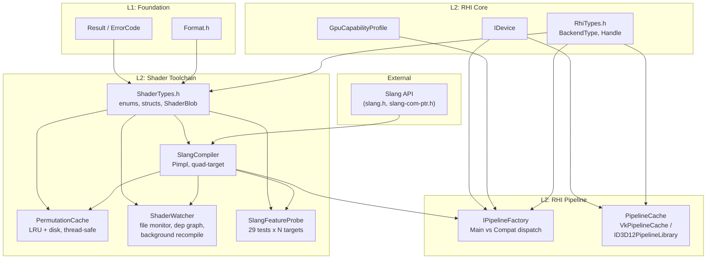
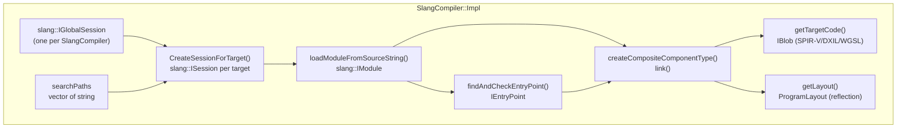
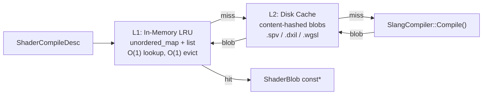
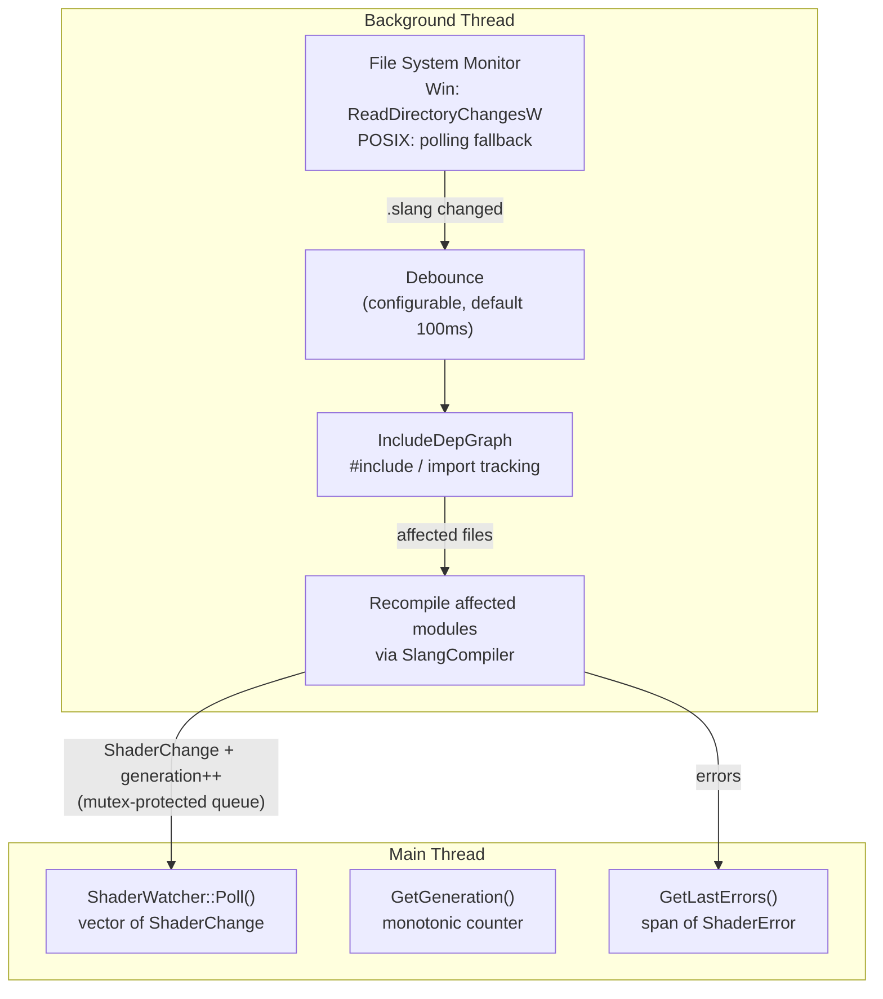
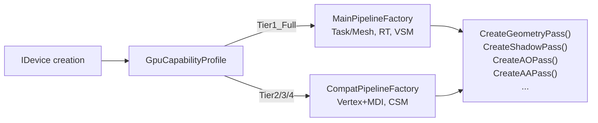

# 04 — Shader Compilation Pipeline Architecture

> **Scope**: Slang compiler integration, quad-target compilation, permutation cache,
> shader hot-reload, feature probe, push constant emulation, descriptor strategy integration.
> **Layer**: L2 (Shader Toolchain) — serves all 5 backends and all upper-layer rendering passes.
> **Depends on**: `00-infra` (ErrorCode, Result), `02-rhi-design` (Format, RhiTypes, IDevice, GpuCapabilityProfile).
> **Consumed by**: Phase 1a (dual-target), Phase 1b (quad-target + hot-reload), Phase 2+ (all rendering).

---

## 0. Confirmed Architectural Decisions

These decisions were locked before writing this spec. They are **non-negotiable** within this document.

| # | Decision | Detail |
|---|----------|--------|
| 1 | **Slang consumption** | Source-compiled default (`third_party/slang/`, CMake `add_subdirectory`). Hybrid option: CI fast path can use prebuilt DLLs via `MIKI_SLANG_PREBUILT=ON`. |
| 2 | **Shader IR cache** | Per-module incremental (Slang session reuse) + Pipeline cache (`VkPipelineCache` / `ID3D12PipelineLibrary`) dual-layer. |
| 3 | **Descriptor strategy** | Hybrid: bindless table layout locked at compile-time (fixed `set=3`), per-pass bindings (set 0-2) use reflection-driven layout generation. |
| 4 | **Push constant rewrite** | Dual-layer: Slang codegen rewrites `[vk::push_constant]` to UBO declarations for WGSL/GLSL targets; RHI backend validates and uploads UBO data at runtime. |
| 5 | **Hot-reload granularity** | Per-module: Slang module dependency graph tracks `import` edges; only affected modules recompile on file change. |
| 6 | **WASM/Emscripten** | Offline-only for shipping (all WGSL blobs pre-compiled at build time). Dev environment allows runtime Slang-in-WASM as opt-in debug option (`MIKI_WASM_RUNTIME_SLANG=ON`). |

---

## 1. Design Goals

| Goal | Metric |
|------|--------|
| **Single-source shading** | One `.slang` file compiles to SPIR-V, DXIL, GLSL 4.30 (via `GL_ARB_gl_spirv` SPIR-V), WGSL — zero per-backend shader forks |
| **Compile-once per module** | Slang parses each module once; codegen to N targets reuses the same IR. Incremental: only changed modules recompile |
| **Sub-100ms hot-reload** | File change → recompile affected module → pipeline swap in <100ms for typical shader (~500 LOC) |
| **Zero-overhead permutations** | 64-bit bitfield key → preprocessor defines; LRU in-memory cache + content-hashed disk cache. No runtime branching |
| **Reflection-driven per-pass layout** | `ShaderReflection` auto-generates `DescriptorSetLayout` for sets 0-2. Set 3 (bindless) is fixed at init time |
| **Tier degradation safety** | `SlangFeatureProbe` (29 tests) catches miscompiles and unsupported features at CI time, not at runtime |
| **Pimpl ABI stability** | `SlangCompiler`, `PermutationCache`, `ShaderWatcher` use Pimpl — Slang headers never leak to public API |

---

## 2. Module Decomposition

### 2.1 Namespace & Header Layout

```
include/miki/shader/
    ShaderTypes.h          # ShaderTarget, ShaderStage, ShaderBlob, ShaderReflection,
                           # ShaderPermutationKey, ShaderCompileDesc, BindingInfo,
                           # VertexInputInfo, PermutationCacheConfig
    SlangCompiler.h        # SlangCompiler (Pimpl) — Compile, CompileDualTarget,
                           # CompileQuadTarget, Reflect, AddSearchPath
    PermutationCache.h     # PermutationCache (Pimpl) — GetOrCompile, Insert, Clear
    ShaderWatcher.h        # ShaderWatcher (Pimpl) — Start, Stop, Poll, GetGeneration,
                           # GetLastErrors. ShaderChange, ShaderError, ShaderWatcherConfig
    SlangFeatureProbe.h    # SlangFeatureProbe (stateless) — RunAll, RunSingle.
                           # ProbeTestResult, ProbeReport

include/miki/rhi/
    IPipelineFactory.h     # IPipelineFactory — Create, CreateGeometryPass, CreateShadowPass, ...
                           # MainPipelineFactory (Tier1), CompatPipelineFactory (Tier2/3/4)
    PipelineCache.h        # PipelineCache — Load, Save, GetNativeHandle

src/miki/shader/
    SlangCompiler.cpp      # Slang API calls, session management, codegen, reflection extraction
    PermutationCache.cpp   # LRU list + unordered_map, disk cache read/write, source hash validation
    ShaderWatcher.cpp      # IncludeDepGraph, ReadDirectoryChangesW (Win) / polling (POSIX),
                           # debounce, background recompile thread
    SlangFeatureProbe.cpp  # Probe descriptor table, RunProbe per test x target
    CMakeLists.txt

src/miki/rhi/
    MainPipelineFactory.cpp
    CompatPipelineFactory.cpp
    PipelineCache.cpp
    PipelineFactoryImpl.cpp  # IPipelineFactory::Create dispatch

shaders/tests/
    probe_*.slang            # 29 probe test shaders (see S7)
```

### 2.2 Dependency Graph



---

## 3. ShaderTypes — Core Data Types

### 3.1 ShaderTarget

```cpp
enum class ShaderTarget : uint8_t {
    SPIRV,   // Vulkan (Tier1/Tier2), OpenGL (via GL_ARB_gl_spirv)
    DXIL,    // D3D12
    GLSL,    // Reserved — not used at runtime (GL consumes SPIR-V)
    WGSL,    // WebGPU (Dawn)
};
```

**Key design note**: OpenGL backend consumes **SPIR-V** via `GL_ARB_gl_spirv`, not GLSL text.
This eliminates an entire class of Slang GLSL codegen bugs and simplifies the pipeline.
The `GLSL` enum value exists for offline tooling / debug dump only.

### 3.2 ShaderTargetForBackend — Canonical Mapping

```cpp
[[nodiscard]] constexpr auto ShaderTargetForBackend(rhi::BackendType iBackend) noexcept -> ShaderTarget {
    switch (iBackend) {
        case rhi::BackendType::D3D12:  return ShaderTarget::DXIL;
        case rhi::BackendType::OpenGL: return ShaderTarget::SPIRV;  // GL_ARB_gl_spirv
        case rhi::BackendType::WebGPU: return ShaderTarget::WGSL;
        default:                       return ShaderTarget::SPIRV;   // Vulkan, Mock
    }
};
```

All render passes call `ShaderTargetForBackend()` — **no duplicate mapping logic allowed**.
`static_assert` in `SlangCompiler.cpp` validates `BackendType` enum values at compile time.

### 3.3 ShaderStage

```cpp
enum class ShaderStage : uint8_t {
    Vertex, Fragment, Compute, Mesh, Amplification,
    RayGen, ClosestHit, Miss, AnyHit, Intersection,
};
```

### 3.4 ShaderBlob

Move-only compiled bytecode container. `data` holds raw SPIR-V / DXIL / WGSL bytes.

```cpp
struct ShaderBlob {
    std::vector<uint8_t> data;
    ShaderTarget target = ShaderTarget::SPIRV;
    ShaderStage  stage  = ShaderStage::Vertex;
    std::string  entryPoint;
    // Move-only: shader blobs can be large (100KB+)
};
```

### 3.5 ShaderPermutationKey

64-bit bitfield → up to 64 boolean permutation axes. Combined with `ShaderCompileDesc::defines`
for non-boolean (string-valued) permutations. The cache key includes both.

```cpp
struct ShaderPermutationKey {
    uint64_t bits = 0;
    constexpr void SetBit(uint32_t iBit, bool iValue) noexcept;
    [[nodiscard]] constexpr auto GetBit(uint32_t iBit) const noexcept -> bool;
    constexpr auto operator==(ShaderPermutationKey const&) const noexcept -> bool = default;
};
```

### 3.6 ShaderCompileDesc

```cpp
struct ShaderCompileDesc {
    std::filesystem::path sourcePath;
    std::string           entryPoint;
    ShaderStage           stage       = ShaderStage::Vertex;
    ShaderTarget          target      = ShaderTarget::SPIRV;
    ShaderPermutationKey  permutation;
    std::span<std::pair<std::string, std::string>> defines;
};
```

### 3.7 ShaderReflection

Full reflection data extracted after compilation:

```cpp
struct ShaderReflection {
    struct ModuleConstant {
        std::string name;
        bool hasIntValue = false;
        int64_t intValue = 0;
    };
    struct StructField {
        std::string name;
        uint32_t offsetBytes = 0;
        uint32_t sizeBytes   = 0;
    };
    struct StructLayout {
        std::string              name;
        uint32_t                 sizeBytes = 0;
        uint32_t                 alignment = 0;
        std::vector<StructField> fields;
    };

    std::vector<EntryPointInfo>   entryPoints;
    std::vector<BindingInfo>      bindings;         // set, binding, type, count, name, user attribs
    uint32_t                      pushConstantSize = 0;
    std::vector<VertexInputInfo>  vertexInputs;     // location, format, offset, name
    uint32_t                      threadGroupSize[3] = {0, 0, 0};
    std::vector<ModuleConstant>   moduleConstants;  // static const int scalars in module scope
    std::vector<StructLayout>     structLayouts;    // field-level offset/size for C++ <-> GPU validation
};
```

Reflection captures:
- **Bindings**: set, binding, type, count, name, user attributes (`[vk::binding]`, etc.)
- **Vertex inputs**: location, format, offset, name (auto-mapped from Slang scalar type)
- **Push constant size**: global constant buffer size from Slang layout
- **Thread group size**: `[numthreads(X,Y,Z)]` for compute/mesh
- **Module constants**: `static const` integer scalars in module scope (AST walk)
- **Struct layouts**: field-level offset/size for C++ <-> GPU struct validation (`LayoutRules::DefaultStructuredBuffer`)

### 3.8 BindingInfo & VertexInputInfo

```cpp
struct BindingInfo {
    uint32_t set = 0, binding = 0;
    BindingType type = BindingType::UniformBuffer;
    uint32_t count = 1;
    std::string name;
    struct UserAttrib { std::string name; std::vector<std::string> args; };
    std::vector<UserAttrib> userAttribs;
};

struct VertexInputInfo {
    uint32_t location = 0;
    rhi::Format format = rhi::Format::Undefined;
    uint32_t offset = 0;
    std::string name;
};
```

---

## 4. SlangCompiler — Core Compilation Engine

### 4.1 Public API

```cpp
class SlangCompiler {
public:
    [[nodiscard]] static auto Create() -> core::Result<SlangCompiler>;
    [[nodiscard]] auto Compile(ShaderCompileDesc const& iDesc) -> core::Result<ShaderBlob>;
    [[nodiscard]] auto CompileDualTarget(
        std::filesystem::path const& iSourcePath,
        std::string const& iEntryPoint, ShaderStage iStage
    ) -> core::Result<std::pair<ShaderBlob, ShaderBlob>>;

    static constexpr size_t kTargetCount = 4;
    [[nodiscard]] auto CompileQuadTarget(
        std::filesystem::path const& iSourcePath,
        std::string const& iEntryPoint, ShaderStage iStage
    ) -> core::Result<std::array<ShaderBlob, kTargetCount>>;

    [[nodiscard]] auto Reflect(ShaderCompileDesc const& iDesc) -> core::Result<ShaderReflection>;
    auto AddSearchPath(std::filesystem::path const& iPath) -> void;
private:
    struct Impl;
    std::unique_ptr<Impl> impl_;
};
```

### 4.2 Internal Architecture (Impl)



#### Session Management

- One `slang::IGlobalSession` per `SlangCompiler` instance (expensive to create, reused across compilations)
- Per-compilation `slang::ISession` created with target-specific profile:

| ShaderTarget | Slang profile | Slang format | Notes |
|-------------|--------------|-------------|-------|
| SPIRV | `spirv_1_5` | `SLANG_SPIRV` | Vulkan 1.4, OpenGL `GL_ARB_gl_spirv` |
| DXIL | `sm_6_6` | `SLANG_DXIL` | D3D12 FL 12.2 |
| GLSL | `glsl_430` | `SLANG_GLSL` | Offline/debug only |
| WGSL | `wgsl` | `SLANG_WGSL` | Dawn / Emscripten |

#### Per-Module Incremental Compilation (Decision #2)

`CompileQuadTarget()` parses the module **once**, then creates 4 sessions with different
targets, each linking against the same parsed AST. This reduces parse overhead by ~75%
for quad-target compilation.

Future upgrade path (Phase 3a): Slang `ISession::loadModule()` caches parsed modules
within a session. By reusing sessions across frames, only re-parsing changed modules
while keeping unchanged modules hot.

#### Permutation Handling

Permutation bits are expanded to preprocessor defines:
- Bit N set → `#define MIKI_PERMUTATION_BIT_N 1`
- `ShaderCompileDesc::defines` provides additional string-valued defines
- Both passed to `slang::SessionDesc::preprocessorMacros`

#### Reflection Extraction Pipeline

`Reflect()` performs full AST + layout extraction in 8 steps:

1. Create session, load module, link program (same as compile path)
2. Iterate `layout->getParameterCount()` → map `TypeReflection::Kind` to `BindingType`
3. Extract user attributes (`[vk::binding(set, binding)]`) via `UserAttribute` API
4. For vertex stage: iterate entry point parameters → map Slang scalar type to `rhi::Format`
5. `layout->getGlobalConstantBufferSize()` → `pushConstantSize`
6. `entryPoint->getComputeThreadGroupSize()` → `threadGroupSize`
7. Recursive AST walk (`slang::DeclReflection`) → collect `static const` integer scalars
8. For each struct name: `layout->findTypeByName()` → field offset/size via `LayoutRules::DefaultStructuredBuffer`

Slang type → `rhi::Format` mapping for vertex inputs:

| Slang scalar | Columns | Format |
|-------------|---------|--------|
| `float32` | 1 | `R32_FLOAT` |
| `float32` | 2 | `RG32_FLOAT` |
| `float32` | 3/4 | `RGBA32_FLOAT` |
| `int32` | 1 | `R32_SINT` |
| `uint32` | 1 | `R32_UINT` |
| `float16` | 2 | `RG16_FLOAT` |
| `float16` | 4 | `RGBA16_FLOAT` |

### 4.3 Push Constant Emulation (Decision #4 — Dual Layer)

#### Layer 1: Slang Codegen Rewrite

When targeting WGSL or GLSL:
- Slang automatically rewrites `[vk::push_constant]` blocks to uniform buffer declarations
- WGSL: `@group(0) @binding(0) var<uniform> pushConstants: PushConstantsBlock;`
- GLSL: `layout(std140, binding = 0) uniform PushConstants { ... };`

#### Layer 2: RHI Runtime Protection

- `ICommandBuffer::PushConstants()` on WebGPU/OpenGL backends writes to a shadow UBO buffer
- WebGPU: `wgpu::Queue::WriteBuffer` to bind group 0, slot 0 (256B max)
- OpenGL: `glBufferSubData` to UBO binding point 0 (128B max)
- Debug builds: `assert(size <= maxPushConstantSize)` where max = 256B (Vulkan/D3D12) or 128B (GL)

#### Reserved Binding Convention

| Backend | Reserved Slot | Size | Mechanism |
|---------|:-------------|:-----|:----------|
| WebGPU | `@group(0) @binding(0)` | 256B | `var<uniform>` in WGSL |
| OpenGL | UBO binding 0 | 128B | `layout(std140, binding = 0)` |
| Vulkan / D3D12 | None | N/A | Native push/root constants |

User-declared descriptors in set 0 start from `binding=1` on WebGPU/OpenGL.
`CreatePipelineLayout` asserts no user binding collides with reserved slot in debug builds.

---

## 5. PermutationCache — Dual-Layer Caching

### 5.1 Architecture



### 5.2 Cache Key

```cpp
struct CacheKey {
    std::string          sourcePath;
    std::string          entryPoint;
    ShaderTarget         target;
    ShaderStage          stage;
    ShaderPermutationKey permutation;
};
// Hash: FNV-1a over concatenated fields. Equality: exact match on all fields.
```

### 5.3 Disk Cache

- Path: `{cacheDir}/{hash}.{spv|dxil|glsl|wgsl}`
- Validation: `.hash` sidecar file stores source content hash (`uint64_t`)
- On load: compare stored hash with current source hash → reject if stale
- Thread safety: `std::mutex` around LRU operations; disk I/O outside lock

### 5.4 Public API

```cpp
class PermutationCache {
public:
    explicit PermutationCache(PermutationCacheConfig iConfig = {});
    [[nodiscard]] auto GetOrCompile(ShaderCompileDesc const& iDesc, SlangCompiler& iCompiler)
        -> core::Result<ShaderBlob const*>;
    auto Insert(ShaderCompileDesc const& iDesc, ShaderBlob iBlob) -> void;
    auto Clear() -> void;
    [[nodiscard]] auto Size() const -> uint32_t;
private:
    struct Impl;  // LRU list + map + mutex + disk helpers
    std::unique_ptr<Impl> impl_;
};
```

### 5.5 Pipeline Cache (L3 — Driver Layer)

Separate from `PermutationCache`, `PipelineCache` operates at the driver level:

| Backend | Native Object | Persistence |
|---------|--------------|-------------|
| Vulkan | `VkPipelineCache` | Binary blob to disk, validated by `PipelineCacheHeader` (magic + driver version + device ID) |
| D3D12 | `ID3D12PipelineLibrary` | Serialized pipeline library |
| OpenGL / WebGPU / Mock | No-op | Pass-through |

```cpp
class PipelineCache {
public:
    [[nodiscard]] static auto Load(IDevice& iDevice, std::filesystem::path const& iPath)
        -> std::expected<PipelineCache, core::ErrorCode>;
    [[nodiscard]] auto Save(std::filesystem::path const& iPath) const
        -> std::expected<void, core::ErrorCode>;
    [[nodiscard]] auto GetNativeHandle() const noexcept -> void*;
};
```

On-disk header: `PipelineCacheHeader` { magic `0x4D4B5043`, version, driverVersion, deviceId, dataSize }.
On header mismatch (driver update, different GPU), the blob is discarded silently —
graceful rebuild, no error.

### 5.6 Three-Layer Cache Summary

```
Request → L1 (PermutationCache in-memory LRU)
  miss → L2 (PermutationCache disk, content-hash validated)
    miss → SlangCompiler::Compile() → store L2, L1
      ↓ ShaderBlob
IDevice::CreateGraphicsPipeline(blob, PipelineCache::GetNativeHandle())
  → L3 (VkPipelineCache / ID3D12PipelineLibrary — driver-optimized)
```

---

## 6. ShaderWatcher — Hot-Reload System

### 6.1 Architecture



### 6.2 IncludeDepGraph

Internal helper class that scans `.slang` files for:
- `#include "path"` → direct file path dependency
- `import module.name;` → resolved to `{parent_dir}/{module/name}.slang`

`GetAffected(changedFile)` returns all files that directly or transitively depend on the
changed file. Current implementation scans 1-level deep (direct deps); transitive closure
is a Phase 3a upgrade.

### 6.3 Per-Module Recompile Flow (Decision #5)

When a file changes:

1. `IncludeDepGraph::ScanFile()` re-parses changed file's dependencies
2. `GetAffected()` collects all `.slang` files that import/include the changed file
3. Each affected file is recompiled for all configured targets
4. `generation` counter increments atomically per successful recompile
5. Rendering code compares `GetGeneration()` with cached generation → recreate pipeline if stale

### 6.4 Platform-Specific File Watching

| Platform | Mechanism | Latency |
|----------|-----------|---------|
| Windows | `ReadDirectoryChangesW` + overlapped I/O | <50ms + debounce |
| POSIX | `std::filesystem::last_write_time` polling (200ms interval) | <400ms + debounce |
| Future | `inotify` (Linux), `FSEvents` (macOS) — Phase 15a | <20ms |

### 6.5 Public API

```cpp
struct ShaderWatcherConfig {
    uint32_t debounceMs = 100;
    std::vector<ShaderTarget> targets;  // targets to recompile to
};

struct ShaderChange {
    std::filesystem::path path;
    ShaderTarget target = ShaderTarget::SPIRV;
    ShaderBlob blob;       // move-only
    uint64_t generation = 0;
};

struct ShaderError {
    std::filesystem::path path;
    std::string message;
    uint32_t line = 0;
    uint32_t column = 0;
};

class ShaderWatcher {
public:
    [[nodiscard]] static auto Create(SlangCompiler& iCompiler, ShaderWatcherConfig iConfig = {})
        -> core::Result<ShaderWatcher>;
    [[nodiscard]] auto Start(std::filesystem::path const& iWatchDir) -> core::Result<void>;
    auto Stop() -> void;
    [[nodiscard]] auto Poll() -> std::vector<ShaderChange>;
    [[nodiscard]] auto GetGeneration() const noexcept -> uint64_t;
    [[nodiscard]] auto GetLastErrors() const -> std::span<const ShaderError>;
    [[nodiscard]] auto IsRunning() const noexcept -> bool;
private:
    struct Impl;
    std::unique_ptr<Impl> impl_;
};
```

### 6.6 Pipeline Swap Protocol

Rendering code integrates hot-reload via generation counter comparison:

```cpp
// Per render pass (e.g., ForwardPass, DeferredResolve)
if (watcher.GetGeneration() != cachedGeneration_) {
    auto changes = watcher.Poll();
    for (auto& change : changes) {
        if (change.path == myShaderPath_ && change.target == myTarget_) {
            // Recreate pipeline with new blob
            auto pipeline = device.CreateGraphicsPipeline(pipelineDesc, change.blob);
            if (pipeline) {
                std::swap(pipeline_, *pipeline);
                // Old pipeline deferred-destroyed via FrameManager
            }
        }
    }
    cachedGeneration_ = watcher.GetGeneration();
}
```

Error overlay (ImGui) displays `GetLastErrors()` in debug builds.

---

## 7. SlangFeatureProbe — Compilation Regression Suite

### 7.1 Purpose

Exhaustive shader feature regression suite that validates correct Slang codegen across
all targets. **Compilation-only — no GPU required**. Run on every CI build.

### 7.2 Probe Test Catalog (29 tests)

#### Universal Probes (all targets)

| # | Test Name | Feature | Tier1 only? |
|---|-----------|---------|:-----------:|
| 1 | `struct_array` | Nested structs with padding | No |
| 2 | `atomics_32` | 32-bit atomic operations | No |
| 3 | `atomics_64` | 64-bit atomics (`InterlockedAdd64`) | Yes |
| 4 | `subgroup_ballot` | `WaveBallot` / `subgroupBallot` | No |
| 5 | `subgroup_shuffle` | `WaveReadLaneAt` / `subgroupShuffle` | No |
| 6 | `subgroup_clustered` | `WaveActiveSum` clustered reduce | No |
| 7 | `push_constants` | `[vk::push_constant]` block | No |
| 8 | `texture_array` | Texture2DArray + bindless | No |
| 9 | `compute_shared` | `groupshared` / shared memory layout | No |
| 10 | `barrier_semantics` | Memory vs execution barriers | No |
| 11 | `binding_map` | `[vk::binding]` → layout mapping | No |
| 12 | `half_precision` | `float16_t` / `half` support detection | No |
| 13 | `image_atomics` | Image load/store + atomics | No |
| 14 | `mesh_shader` | `[shader("mesh")]` entry point | Yes |

#### GLSL-Specific Probes (Phase 1b)

| # | Test Name | Feature |
|---|-----------|---------|
| 15 | `glsl_ssbo_mapping` | BDA → SSBO array index mapping |
| 16 | `glsl_binding_layout` | `layout(binding=N)` vs descriptor set |
| 17 | `glsl_texture_units` | Texture unit limits |
| 18 | `glsl_workgroup` | Workgroup size constraints |
| 19 | `glsl_shared_memory` | Shared memory layout |
| 20 | `glsl_image_load_store` | Image load/store ops |
| 21 | `glsl_atomic_32` | 32-bit atomics in GLSL |
| 22 | `glsl_push_constant_ubo` | Push constant → UBO rewrite |

#### WGSL-Specific Probes (Phase 1b)

| # | Test Name | Feature |
|---|-----------|---------|
| 23 | `wgsl_storage_alignment` | Storage buffer alignment rules |
| 24 | `wgsl_workgroup_limits` | Workgroup size limits |
| 25 | `wgsl_no_64bit_atomics` | 64-bit atomic → error (not silent miscompile) |
| 26 | `wgsl_group_binding` | `@group(N) @binding(M)` mapping |
| 27 | `wgsl_texture_sample` | Texture sampling ops |
| 28 | `wgsl_array_stride` | Array stride alignment |
| 29 | `wgsl_push_constant_ubo` | Push constant → UBO `@group(0)@binding(0)` |

### 7.3 Tier Degradation Validation

**Critical**: compiling a Tier1-only shader (e.g., mesh shader, 64-bit atomics) for
Tier3/4 target **must produce a compilation error**, never a silent miscompile.

Probes marked `tier1Only = true` are expected to **fail** on GLSL/WGSL targets.
`ProbeTestResult::passed = false` on these targets is the correct behavior —
`SlangFeatureProbe` reports them as "correctly rejected".

### 7.4 Public API

```cpp
struct ProbeTestResult {
    std::string  name;
    ShaderTarget target = ShaderTarget::SPIRV;
    bool passed   = false;
    bool skipped  = false;
    std::string diagnostic;
};

struct ProbeReport {
    std::vector<ProbeTestResult> results;
    uint32_t totalPassed  = 0;
    uint32_t totalFailed  = 0;
    uint32_t totalSkipped = 0;
};

class SlangFeatureProbe {
public:
    [[nodiscard]] static auto RunAll(
        SlangCompiler& iCompiler,
        std::span<const ShaderTarget> iTargets,
        std::filesystem::path const& iShaderDir
    ) -> core::Result<ProbeReport>;

    [[nodiscard]] static auto RunSingle(
        SlangCompiler& iCompiler,
        std::string_view iTestName, ShaderTarget iTarget,
        std::filesystem::path const& iShaderDir
    ) -> core::Result<ProbeTestResult>;
};
```

---

## 8. IPipelineFactory — Dual Pipeline Dispatch

### 8.1 Factory Pattern



`IPipelineFactory::Create(IDevice&)` inspects `GpuCapabilityProfile::GetTier()`:
- `Tier1_Full` → `MainPipelineFactory`
- All others → `CompatPipelineFactory`

### 8.2 Pass Creation Methods

| Method | Main (Tier1) | Compat (Tier2/3/4) |
|--------|-------------|-------------------|
| `CreateGeometryPass` | Mesh shader pipeline | Vertex shader pipeline |
| `CreateShadowPass` | VSM (virtual shadow map) | CSM (cascade shadow map) |
| `CreateOITPass` | Linked-list OIT | Weighted OIT |
| `CreateAOPass` | GTAO | SSAO |
| `CreateAAPass` | TAA + FSR | FXAA / MSAA |
| `CreatePickPass` | RT ray query | CPU BVH |
| `CreateHLRPass` | GPU exact HLR | N/A (Phase 7b) |

Each factory method accepts a pass-specific descriptor (`ShadowPassDesc`, `AOPassDesc`, etc.)
and returns a `PipelineHandle`. Rendering code never contains `if (compat)` branches —
the factory dispatches to the correct implementation.

### 8.3 Phase 1a Scope

In Phase 1a, only `CreateGeometryPass()` is implemented (triangle rendering).
Other methods return `ErrorCode::NotImplemented` until their respective phases.

---

## 9. Descriptor Strategy Integration (Decision #3)

### 9.1 Hybrid Binding Model

```
Set 0: Per-frame    (camera UBO, global SSBOs)      — reflection-driven
Set 1: Per-pass     (shadow maps, AO buffer, etc.)   — reflection-driven
Set 2: Per-material (textures, material UBOs)         — reflection-driven
Set 3: Bindless     (all textures/buffers by index)   — compile-time fixed
```

### 9.2 Compile-Time Fixed Bindless Layout (Set 3)

```cpp
// Defined once at engine init, never changes
static constexpr DescriptorLayoutDesc kBindlessLayout = {
    .bindings = {
        {0, DescriptorType::SampledImage, kMaxBindlessTextures, ShaderStageAll},
        {1, DescriptorType::StorageBuffer, kMaxBindlessBuffers, ShaderStageAll},
        {2, DescriptorType::Sampler, kMaxBindlessSamplers, ShaderStageAll},
    }
};
```

This layout is **not** generated from reflection — it is a fixed contract between
the engine and all shaders. `BindlessTable` (Phase 4, Resource layer) manages
allocation of indices within this global set.

### 9.3 Reflection-Driven Per-Pass Layout (Sets 0-2)

For each render pass:
1. Compile shader → `Reflect()` → `ShaderReflection::bindings`
2. Filter bindings by set number (0, 1, or 2)
3. Auto-generate `DescriptorSetLayoutDesc` from reflected bindings
4. Create `DescriptorSetLayout` via `IDevice::CreateDescriptorLayout()`

This eliminates manual layout maintenance as shaders evolve.
**Validation**: in debug builds, reflection output is compared against previous
compilation's layout — layout-breaking changes trigger a warning.

---

## 10. Slang Build Integration (Decision #1)

### 10.1 Source-Compiled (Default)

```cmake
# third_party/slang/CMakeLists.txt
add_subdirectory(${SLANG_SOURCE_DIR} ${CMAKE_BINARY_DIR}/slang-build)
target_link_libraries(miki_shader PUBLIC slang::slang)
```

Slang source lives in `third_party/slang/` (git submodule). Full source build
enables: custom patches, LTO, debug symbols, deterministic codegen.

### 10.2 Prebuilt Hybrid (CI Fast Path)

```cmake
option(MIKI_SLANG_PREBUILT "Use prebuilt Slang DLLs instead of source build" OFF)
if(MIKI_SLANG_PREBUILT)
    # third_party/slang-prebuilt/ contains prebuilt binaries per platform
    add_library(slang::slang SHARED IMPORTED)
    set_target_properties(slang::slang PROPERTIES
        IMPORTED_LOCATION "${SLANG_PREBUILT_DIR}/lib/${CMAKE_SHARED_LIBRARY_PREFIX}slang${CMAKE_SHARED_LIBRARY_SUFFIX}"
        INTERFACE_INCLUDE_DIRECTORIES "${SLANG_PREBUILT_DIR}/include"
    )
endif()
```

### 10.3 WASM Build (Decision #6)

For Emscripten/WASM shipping:
- All WGSL blobs pre-compiled at build time via `SlangCompiler::CompileQuadTarget()`
- Offline tool: `miki-shader-compile --target wgsl --input shaders/ --output shaders/wgsl/`
- WASM runtime loads `.wgsl` blobs directly — no Slang dependency at runtime
- Dev option: `MIKI_WASM_RUNTIME_SLANG=ON` embeds Slang WASM build (~20MB) for live shader editing in browser

---

## 11. Gap Analysis — Reference vs Target

| Component | Reference (`D:\repos\miki`) | mitsuki Target | Action |
|-----------|---------------------------|---------------|--------|
| `SlangCompiler` | Pimpl, quad-target, session-per-compile | **Reuse** with upgrades: session reuse for incremental, module caching | Refactor Impl |
| `ShaderTypes` | Complete: all enums, BlOb, Reflection, PermutationKey | **Reuse** as-is | Direct import |
| `ShaderTargetForBackend` | Maps OpenGL → SPIRV (GL_ARB_gl_spirv) | **Reuse** — correct design | Direct import |
| `PermutationCache` | LRU + disk cache, thread-safe, source hash validation | **Reuse** with upgrades: `#include`-aware hash (hash all transitively included sources) | Refactor |
| `ShaderWatcher` | ReadDirectoryChangesW + polling, IncludeDepGraph, debounce | **Reuse** with upgrades: `std::jthread` (C++20 → C++23), transitive dep closure | Refactor |
| `SlangFeatureProbe` | 29 probes, SPIR-V/DXIL/GLSL/WGSL targets, tier1Only flag | **Reuse** as-is — well-designed | Direct import |
| `IPipelineFactory` | Dual factory (Main/Compat), 7 pass creation methods | **Reuse** — matches spec exactly | Direct import |
| `PipelineCache` | VkPipelineCache + D3D12PipelineLibrary + header validation | **Reuse** as-is | Direct import |
| `probe_*.slang` (29 files) | Comprehensive test shaders | **Reuse** — covers all target-specific edge cases | Direct import |
| Incremental module compilation | Not implemented (new session per compile) | **New**: session reuse + module cache across frames | New code |
| `#include`-aware disk cache hash | Hashes only root source file | **New**: hash must include all transitively `#include`'d files | New code |
| Transitive dep graph | 1-level deep `GetAffected()` | **New**: full transitive closure via BFS/DFS | New code |
| Offline WGSL compiler tool | Not implemented | **New**: CLI tool for WASM build pipeline | New code |
| Slang source CMake integration | Prebuilt DLLs | **New**: `add_subdirectory` source build + hybrid option | New CMake |

---

## 12. Phase Delivery Schedule

| Phase | Deliverables | Test Count |
|-------|-------------|:----------:|
| **1a** | `SlangCompiler` (dual-target SPIR-V+DXIL), `PermutationCache` (memory+disk), `SlangFeatureProbe` (14 universal probes), `ShaderTypes`, `IPipelineFactory` (CreateGeometryPass only), `PipelineCache` | ~55 |
| **1b** | Quad-target (+GLSL+WGSL), `ShaderWatcher` (hot-reload), GLSL probes (8), WGSL probes (7), `CompatPipelineFactory` validated | ~35 |
| **2** | Reflection-driven descriptor layout for forward pass, `StandardPBR` permutations | ~15 |
| **3a** | Session reuse / incremental module compilation, transitive dep graph, `#include`-aware cache hash | ~10 |

---

## 13. Test Strategy

### 13.1 Unit Tests

| Test Group | Count | Key Tests |
|-----------|:-----:|-----------|
| ShaderTypes | 5 | PermutationKey bit ops, ShaderTargetForBackend mapping, ShaderCompileDesc construction |
| SlangCompiler | 12 | Create, Compile SPIR-V, Compile DXIL, CompileDualTarget, CompileQuadTarget, Reflect bindings, Reflect vertex inputs, Reflect push constants, Reflect struct layouts, Reflect module constants, AddSearchPath, invalid source error |
| PermutationCache | 10 | GetOrCompile cache miss, cache hit, LRU eviction, disk cache write, disk cache read, stale hash rejection, Insert, Clear, Size, thread-safety (concurrent GetOrCompile) |
| ShaderWatcher | 8 | Create, Start valid dir, Start invalid dir, Poll empty, file change detection, generation increment, GetLastErrors on compile failure, Stop idempotent |
| SlangFeatureProbe (SPIR-V) | 14 | All universal probes compiled to SPIR-V |
| SlangFeatureProbe (DXIL) | 14 | All universal probes compiled to DXIL |
| SlangFeatureProbe (GLSL) | 8 | GLSL-specific probes (Phase 1b) |
| SlangFeatureProbe (WGSL) | 7 | WGSL-specific probes (Phase 1b) |
| IPipelineFactory | 5 | Create dispatch (Tier1→Main, Tier2→Compat), CreateGeometryPass, GetTier, NotImplemented for unimplemented passes |
| PipelineCache | 5 | Load empty, Load valid, Load stale header, Save, GetNativeHandle |

### 13.2 Integration Tests

| Test | Description |
|------|-------------|
| Dual-target E2E | Compile triangle.slang → SPIR-V + DXIL → create pipelines on Vulkan + D3D12 |
| Quad-target E2E | Compile → all 4 targets → create pipelines on all 5 backends (Phase 1b) |
| Hot-reload E2E | Start watcher → modify .slang → Poll → verify pipeline swap |
| Permutation E2E | Same shader with 4 permutation variants → verify distinct blobs |
| Reflection E2E | Compile PBR shader → verify bindings match expected layout → auto-generate DescriptorSetLayout |
