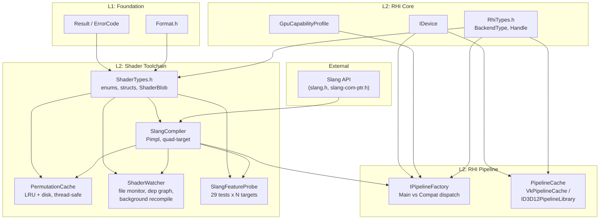
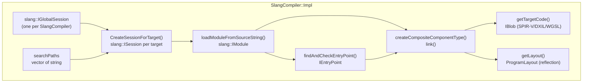
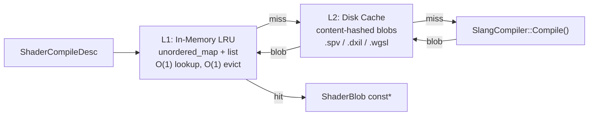
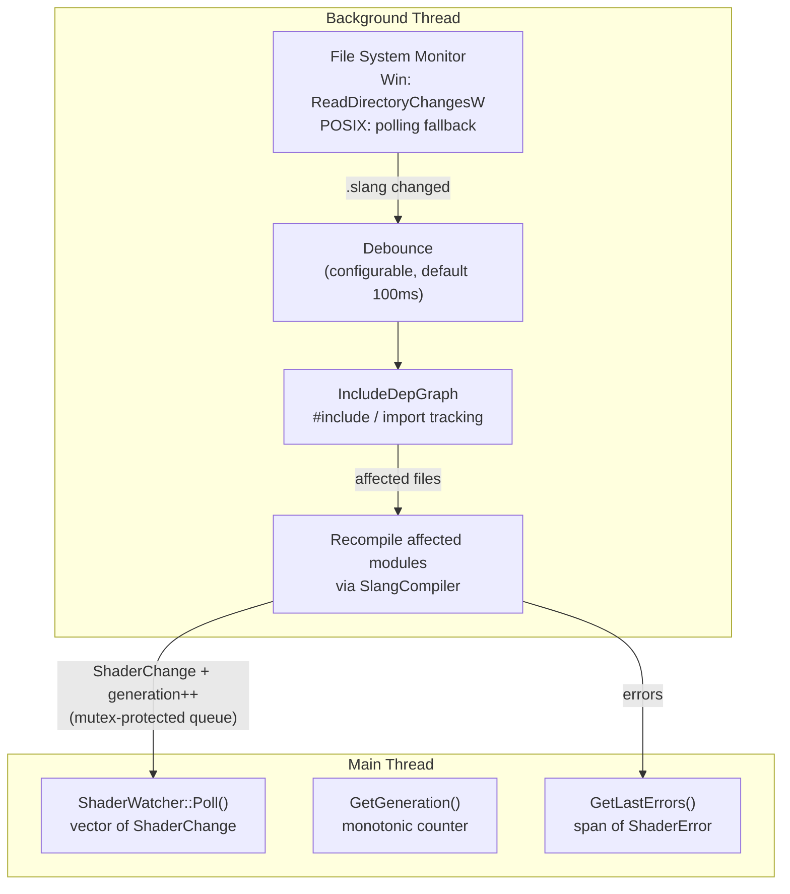
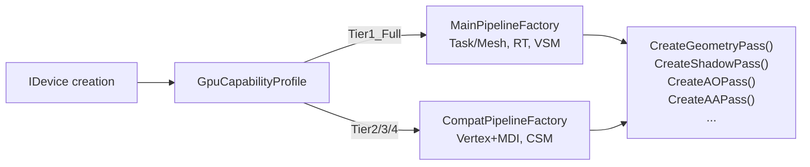
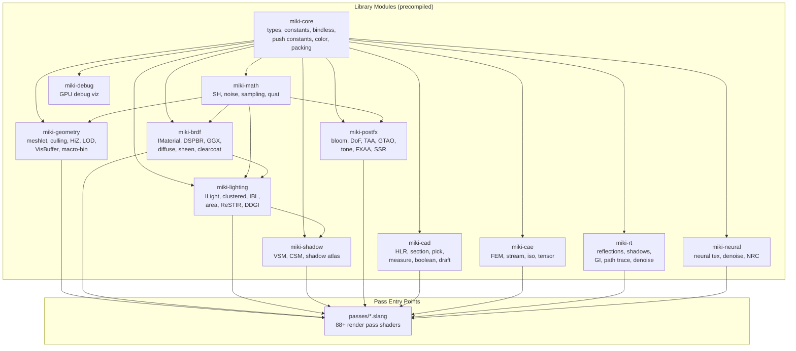
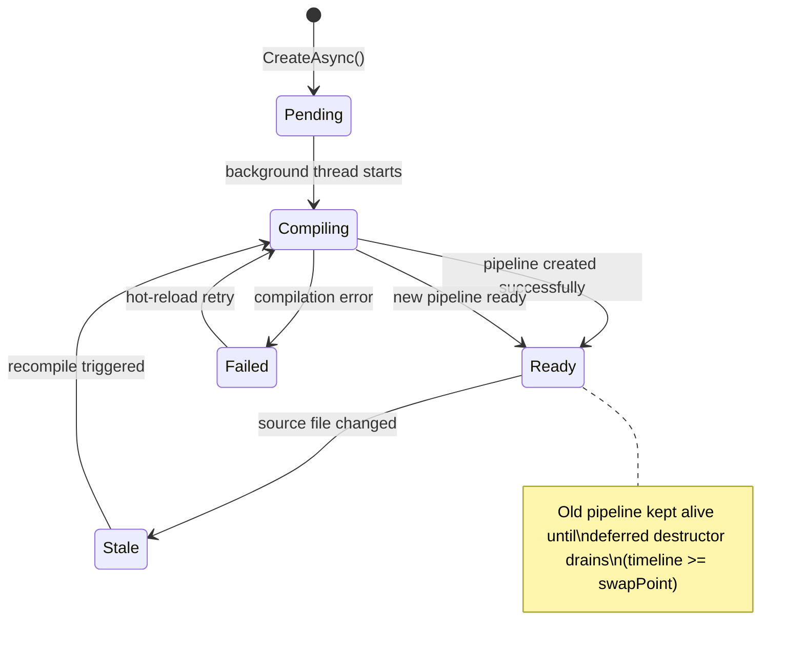

# 05 — Shader Compilation Pipeline Architecture

> **Scope**: Slang compiler integration, quad-target compilation, permutation cache,
> shader hot-reload, feature probe, push constant emulation, descriptor strategy integration,
> **Slang shader project architecture**, **timeline semaphore integration with pipeline creation**,
> **precompiled module strategy**, **neural shader support**.
> **Layer**: L2 (Shader Toolchain) — serves all 5 backends and all upper-layer rendering passes.
> **Depends on**: `00-infra` (ErrorCode, Result), `02-rhi-design` (Format, RhiTypes, IDevice, GpuCapabilityProfile), `03-sync` (timeline semaphores, SyncScheduler).
> **Consumed by**: Phase 1a (dual-target), Phase 1b (quad-target + hot-reload), Phase 2+ (all rendering).

---

## 0. Confirmed Architectural Decisions

These decisions were locked before writing this spec. They are **non-negotiable** within this document.

| #   | Decision                   | Detail                                                                                                                                                                     |
| --- | -------------------------- | -------------------------------------------------------------------------------------------------------------------------------------------------------------------------- |
| 1   | **Slang consumption**      | Source-compiled default (`third_party/slang/`, CMake `add_subdirectory`). Hybrid option: CI fast path can use prebuilt DLLs via `MIKI_SLANG_PREBUILT=ON`.                  |
| 2   | **Shader IR cache**        | Per-module incremental (Slang session reuse) + Pipeline cache (`VkPipelineCache` / `ID3D12PipelineLibrary`) dual-layer.                                                    |
| 3   | **Descriptor strategy**    | Hybrid: bindless table layout locked at compile-time (fixed `set=3`), per-pass bindings (set 0-2) use reflection-driven layout generation.                                 |
| 4   | **Push constant rewrite**  | Dual-layer: Slang codegen rewrites `[vk::push_constant]` to UBO declarations for WGSL/GLSL targets; RHI backend validates and uploads UBO data at runtime.                 |
| 5   | **Hot-reload granularity** | Per-module: Slang module dependency graph tracks `import` edges; only affected modules recompile on file change.                                                           |
| 6   | **WASM/Emscripten**        | Offline-only for shipping (all WGSL blobs pre-compiled at build time). Dev environment allows runtime Slang-in-WASM as opt-in debug option (`MIKI_WASM_RUNTIME_SLANG=ON`). |

---

## 1. Design Goals

| Goal                                  | Metric                                                                                                                     |
| ------------------------------------- | -------------------------------------------------------------------------------------------------------------------------- |
| **Single-source shading**             | One `.slang` file compiles to SPIR-V, DXIL, GLSL 4.30 (via `GL_ARB_gl_spirv` SPIR-V), WGSL — zero per-backend shader forks |
| **Compile-once per module**           | Slang parses each module once; codegen to N targets reuses the same IR. Incremental: only changed modules recompile        |
| **Sub-100ms hot-reload**              | File change → recompile affected module → pipeline swap in <100ms for typical shader (~500 LOC)                            |
| **Zero-overhead permutations**        | 64-bit bitfield key → preprocessor defines; LRU in-memory cache + content-hashed disk cache. No runtime branching          |
| **Reflection-driven per-pass layout** | `ShaderReflection` auto-generates `DescriptorSetLayout` for sets 0-2. Set 3 (bindless) is fixed at init time               |
| **Tier degradation safety**           | `SlangFeatureProbe` (29 tests) catches miscompiles and unsupported features at CI time, not at runtime                     |
| **Pimpl ABI stability**               | `SlangCompiler`, `PermutationCache`, `ShaderWatcher` use Pimpl — Slang headers never leak to public API                    |

---

## 2. Module Decomposition

### 2.1 Namespace & Header Layout

```
include/miki/shader/
    ShaderTypes.h          # ShaderTarget, ShaderStage, ShaderBlob, ShaderReflection,
                           # ShaderPermutationKey, ShaderCompileDesc, BindingInfo,
                           # VertexInputInfo, PermutationCacheConfig
    SlangCompiler.h        # SlangCompiler (Pimpl) — Compile, CompileDualTarget,
                           # CompileQuadTarget, Reflect, AddSearchPath
    PermutationCache.h     # PermutationCache (Pimpl) — GetOrCompile, Insert, Clear
    ShaderWatcher.h        # ShaderWatcher (Pimpl) — Start, Stop, Poll, GetGeneration,
                           # GetLastErrors. ShaderChange, ShaderError, ShaderWatcherConfig
    SlangFeatureProbe.h    # SlangFeatureProbe (stateless) — RunAll, RunSingle.
                           # ProbeTestResult, ProbeReport

include/miki/rhi/
    IPipelineFactory.h     # IPipelineFactory — Create, CreateGeometryPass, CreateShadowPass, ...
                           # MainPipelineFactory (Tier1), CompatPipelineFactory (Tier2/3/4)
    PipelineCache.h        # PipelineCache — Load, Save, GetNativeHandle

src/miki/shader/
    SlangCompiler.cpp      # Slang API calls, session management, codegen, reflection extraction
    PermutationCache.cpp   # LRU list + unordered_map, disk cache read/write, source hash validation
    ShaderWatcher.cpp      # IncludeDepGraph, ReadDirectoryChangesW (Win) / polling (POSIX),
                           # debounce, background recompile thread
    SlangFeatureProbe.cpp  # Probe descriptor table, RunProbe per test x target
    CMakeLists.txt

src/miki/rhi/
    MainPipelineFactory.cpp
    CompatPipelineFactory.cpp
    PipelineCache.cpp
    PipelineFactoryImpl.cpp  # IPipelineFactory::Create dispatch

shaders/tests/
    probe_*.slang            # 29 probe test shaders (see S7)
```

### 2.2 Dependency Graph



---

## 3. ShaderTypes — Core Data Types

### 3.1 ShaderTarget

```cpp
enum class ShaderTarget : uint8_t {
    SPIRV,   // Vulkan (Tier1/Tier2), OpenGL (via GL_ARB_gl_spirv)
    DXIL,    // D3D12
    GLSL,    // Reserved — not used at runtime (GL consumes SPIR-V)
    WGSL,    // WebGPU (Dawn)
};
```

**Key design note**: OpenGL backend consumes **SPIR-V** via `GL_ARB_gl_spirv`, not GLSL text.
This eliminates an entire class of Slang GLSL codegen bugs and simplifies the pipeline.
The `GLSL` enum value exists for offline tooling / debug dump only.

### 3.2 ShaderTargetForBackend — Canonical Mapping

```cpp
[[nodiscard]] constexpr auto ShaderTargetForBackend(rhi::BackendType iBackend) noexcept -> ShaderTarget {
    switch (iBackend) {
        case rhi::BackendType::D3D12:  return ShaderTarget::DXIL;
        case rhi::BackendType::OpenGL: return ShaderTarget::SPIRV;  // GL_ARB_gl_spirv
        case rhi::BackendType::WebGPU: return ShaderTarget::WGSL;
        default:                       return ShaderTarget::SPIRV;   // Vulkan, Mock
    }
};
```

All render passes call `ShaderTargetForBackend()` — **no duplicate mapping logic allowed**.
`static_assert` in `SlangCompiler.cpp` validates `BackendType` enum values at compile time.

### 3.3 ShaderStage

```cpp
enum class ShaderStage : uint8_t {
    Vertex, Fragment, Compute, Mesh, Amplification,
    RayGen, ClosestHit, Miss, AnyHit, Intersection,
};
```

### 3.4 ShaderBlob

Move-only compiled bytecode container. `data` holds raw SPIR-V / DXIL / WGSL bytes.

```cpp
struct ShaderBlob {
    std::vector<uint8_t> data;
    ShaderTarget target = ShaderTarget::SPIRV;
    ShaderStage  stage  = ShaderStage::Vertex;
    std::string  entryPoint;
    // Move-only: shader blobs can be large (100KB+)
};
```

### 3.5 ShaderPermutationKey

64-bit bitfield → up to 64 boolean permutation axes. Combined with `ShaderCompileDesc::defines`
for non-boolean (string-valued) permutations. The cache key includes both.

```cpp
struct ShaderPermutationKey {
    uint64_t bits = 0;
    constexpr void SetBit(uint32_t iBit, bool iValue) noexcept;
    [[nodiscard]] constexpr auto GetBit(uint32_t iBit) const noexcept -> bool;
    constexpr auto operator==(ShaderPermutationKey const&) const noexcept -> bool = default;
};
```

### 3.6 ShaderCompileDesc

```cpp
struct ShaderCompileDesc {
    std::filesystem::path sourcePath;
    std::string           entryPoint;
    ShaderStage           stage       = ShaderStage::Vertex;
    ShaderTarget          target      = ShaderTarget::SPIRV;
    ShaderPermutationKey  permutation;
    std::span<std::pair<std::string, std::string>> defines;
};
```

### 3.7 ShaderReflection

Full reflection data extracted after compilation:

```cpp
struct ShaderReflection {
    struct ModuleConstant {
        std::string name;
        bool hasIntValue = false;
        int64_t intValue = 0;
    };
    struct StructField {
        std::string name;
        uint32_t offsetBytes = 0;
        uint32_t sizeBytes   = 0;
    };
    struct StructLayout {
        std::string              name;
        uint32_t                 sizeBytes = 0;
        uint32_t                 alignment = 0;
        std::vector<StructField> fields;
    };

    std::vector<EntryPointInfo>   entryPoints;
    std::vector<BindingInfo>      bindings;         // set, binding, type, count, name, user attribs
    uint32_t                      pushConstantSize = 0;
    std::vector<VertexInputInfo>  vertexInputs;     // location, format, offset, name
    uint32_t                      threadGroupSize[3] = {0, 0, 0};
    std::vector<ModuleConstant>   moduleConstants;  // static const int scalars in module scope
    std::vector<StructLayout>     structLayouts;    // field-level offset/size for C++ <-> GPU validation
};
```

Reflection captures:

- **Bindings**: set, binding, type, count, name, user attributes (`[vk::binding]`, etc.)
- **Vertex inputs**: location, format, offset, name (auto-mapped from Slang scalar type)
- **Push constant size**: global constant buffer size from Slang layout
- **Thread group size**: `[numthreads(X,Y,Z)]` for compute/mesh
- **Module constants**: `static const` integer scalars in module scope (AST walk)
- **Struct layouts**: field-level offset/size for C++ <-> GPU struct validation (`LayoutRules::DefaultStructuredBuffer`)

### 3.8 BindingInfo & VertexInputInfo

```cpp
struct BindingInfo {
    uint32_t set = 0, binding = 0;
    BindingType type = BindingType::UniformBuffer;
    uint32_t count = 1;
    std::string name;
    struct UserAttrib { std::string name; std::vector<std::string> args; };
    std::vector<UserAttrib> userAttribs;
};

struct VertexInputInfo {
    uint32_t location = 0;
    rhi::Format format = rhi::Format::Undefined;
    uint32_t offset = 0;
    std::string name;
};
```

---

## 4. SlangCompiler — Core Compilation Engine

### 4.1 Public API

```cpp
class SlangCompiler {
public:
    [[nodiscard]] static auto Create() -> core::Result<SlangCompiler>;
    [[nodiscard]] auto Compile(ShaderCompileDesc const& iDesc) -> core::Result<ShaderBlob>;
    [[nodiscard]] auto CompileDualTarget(
        std::filesystem::path const& iSourcePath,
        std::string const& iEntryPoint, ShaderStage iStage
    ) -> core::Result<std::pair<ShaderBlob, ShaderBlob>>;

    static constexpr size_t kTargetCount = 4;
    [[nodiscard]] auto CompileQuadTarget(
        std::filesystem::path const& iSourcePath,
        std::string const& iEntryPoint, ShaderStage iStage
    ) -> core::Result<std::array<ShaderBlob, kTargetCount>>;

    [[nodiscard]] auto Reflect(ShaderCompileDesc const& iDesc) -> core::Result<ShaderReflection>;
    auto AddSearchPath(std::filesystem::path const& iPath) -> void;
private:
    struct Impl;
    std::unique_ptr<Impl> impl_;
};
```

### 4.2 Internal Architecture (Impl)



#### Session Management

- One `slang::IGlobalSession` per `SlangCompiler` instance (expensive to create, reused across compilations)
- Per-compilation `slang::ISession` created with target-specific profile:

| ShaderTarget | Slang profile | Slang format  | Notes                                |
| ------------ | ------------- | ------------- | ------------------------------------ |
| SPIRV        | `spirv_1_5`   | `SLANG_SPIRV` | Vulkan 1.4, OpenGL `GL_ARB_gl_spirv` |
| DXIL         | `sm_6_6`      | `SLANG_DXIL`  | D3D12 FL 12.2                        |
| GLSL         | `glsl_430`    | `SLANG_GLSL`  | Offline/debug only                   |
| WGSL         | `wgsl`        | `SLANG_WGSL`  | Dawn / Emscripten                    |

#### Per-Module Incremental Compilation (Decision #2)

`CompileQuadTarget()` parses the module **once**, then creates 4 sessions with different
targets, each linking against the same parsed AST. This reduces parse overhead by ~75%
for quad-target compilation.

Future upgrade path (Phase 3a): Slang `ISession::loadModule()` caches parsed modules
within a session. By reusing sessions across frames, only re-parsing changed modules
while keeping unchanged modules hot.

#### Permutation Handling

Permutation bits are expanded to preprocessor defines:

- Bit N set → `#define MIKI_PERMUTATION_BIT_N 1`
- `ShaderCompileDesc::defines` provides additional string-valued defines
- Both passed to `slang::SessionDesc::preprocessorMacros`

#### Reflection Extraction Pipeline

`Reflect()` performs full AST + layout extraction in 8 steps:

1. Create session, load module, link program (same as compile path)
2. Iterate `layout->getParameterCount()` → map `TypeReflection::Kind` to `BindingType`
3. Extract user attributes (`[vk::binding(set, binding)]`) via `UserAttribute` API
4. For vertex stage: iterate entry point parameters → map Slang scalar type to `rhi::Format`
5. `layout->getGlobalConstantBufferSize()` → `pushConstantSize`
6. `entryPoint->getComputeThreadGroupSize()` → `threadGroupSize`
7. Recursive AST walk (`slang::DeclReflection`) → collect `static const` integer scalars
8. For each struct name: `layout->findTypeByName()` → field offset/size via `LayoutRules::DefaultStructuredBuffer`

Slang type → `rhi::Format` mapping for vertex inputs:

| Slang scalar | Columns | Format         |
| ------------ | ------- | -------------- |
| `float32`    | 1       | `R32_FLOAT`    |
| `float32`    | 2       | `RG32_FLOAT`   |
| `float32`    | 3/4     | `RGBA32_FLOAT` |
| `int32`      | 1       | `R32_SINT`     |
| `uint32`     | 1       | `R32_UINT`     |
| `float16`    | 2       | `RG16_FLOAT`   |
| `float16`    | 4       | `RGBA16_FLOAT` |

### 4.3 Push Constant Emulation (Decision #4 — Dual Layer)

#### Layer 1: Slang Codegen Rewrite

When targeting WGSL or GLSL:

- Slang automatically rewrites `[vk::push_constant]` blocks to uniform buffer declarations
- WGSL: `@group(0) @binding(0) var<uniform> pushConstants: PushConstantsBlock;`
- GLSL: `layout(std140, binding = 0) uniform PushConstants { ... };`

#### Layer 2: RHI Runtime Protection

- `ICommandBuffer::PushConstants()` on WebGPU/OpenGL backends writes to a shadow UBO buffer
- WebGPU: `wgpu::Queue::WriteBuffer` to bind group 0, slot 0 (256B max)
- OpenGL: `glBufferSubData` to UBO binding point 0 (128B max)
- Debug builds: `assert(size <= maxPushConstantSize)` where max = 256B (Vulkan/D3D12) or 128B (GL)

#### Reserved Binding Convention

| Backend        | Reserved Slot           | Size | Mechanism                     |
| -------------- | :---------------------- | :--- | :---------------------------- |
| WebGPU         | `@group(0) @binding(0)` | 256B | `var<uniform>` in WGSL        |
| OpenGL         | UBO binding 0           | 128B | `layout(std140, binding = 0)` |
| Vulkan / D3D12 | None                    | N/A  | Native push/root constants    |

User-declared descriptors in set 0 start from `binding=1` on WebGPU/OpenGL.
`CreatePipelineLayout` asserts no user binding collides with reserved slot in debug builds.

---

## 5. PermutationCache — Dual-Layer Caching

### 5.1 Architecture



### 5.2 Cache Key

```cpp
struct CacheKey {
    std::string          sourcePath;
    std::string          entryPoint;
    ShaderTarget         target;
    ShaderStage          stage;
    ShaderPermutationKey permutation;
};
// Hash: FNV-1a over concatenated fields. Equality: exact match on all fields.
```

### 5.3 Disk Cache

- Path: `{cacheDir}/{hash}.{spv|dxil|glsl|wgsl}`
- Validation: `.hash` sidecar file stores source content hash (`uint64_t`)
- On load: compare stored hash with current source hash → reject if stale
- Thread safety: `std::mutex` around LRU operations; disk I/O outside lock

### 5.4 Public API

```cpp
class PermutationCache {
public:
    explicit PermutationCache(PermutationCacheConfig iConfig = {});
    [[nodiscard]] auto GetOrCompile(ShaderCompileDesc const& iDesc, SlangCompiler& iCompiler)
        -> core::Result<ShaderBlob const*>;
    auto Insert(ShaderCompileDesc const& iDesc, ShaderBlob iBlob) -> void;
    auto Clear() -> void;
    [[nodiscard]] auto Size() const -> uint32_t;
private:
    struct Impl;  // LRU list + map + mutex + disk helpers
    std::unique_ptr<Impl> impl_;
};
```

### 5.5 Pipeline Cache (L3 — Driver Layer)

Separate from `PermutationCache`, `PipelineCache` operates at the driver level:

| Backend                | Native Object           | Persistence                                                                                  |
| ---------------------- | ----------------------- | -------------------------------------------------------------------------------------------- |
| Vulkan                 | `VkPipelineCache`       | Binary blob to disk, validated by `PipelineCacheHeader` (magic + driver version + device ID) |
| D3D12                  | `ID3D12PipelineLibrary` | Serialized pipeline library                                                                  |
| OpenGL / WebGPU / Mock | No-op                   | Pass-through                                                                                 |

```cpp
class PipelineCache {
public:
    [[nodiscard]] static auto Load(IDevice& iDevice, std::filesystem::path const& iPath)
        -> std::expected<PipelineCache, core::ErrorCode>;
    [[nodiscard]] auto Save(std::filesystem::path const& iPath) const
        -> std::expected<void, core::ErrorCode>;
    [[nodiscard]] auto GetNativeHandle() const noexcept -> void*;
};
```

On-disk header: `PipelineCacheHeader` { magic `0x4D4B5043`, version, driverVersion, deviceId, dataSize }.
On header mismatch (driver update, different GPU), the blob is discarded silently —
graceful rebuild, no error.

### 5.6 Three-Layer Cache Summary

```
Request → L1 (PermutationCache in-memory LRU)
  miss → L2 (PermutationCache disk, content-hash validated)
    miss → SlangCompiler::Compile() → store L2, L1
      ↓ ShaderBlob
IDevice::CreateGraphicsPipeline(blob, PipelineCache::GetNativeHandle())
  → L3 (VkPipelineCache / ID3D12PipelineLibrary — driver-optimized)
```

---

## 6. ShaderWatcher — Hot-Reload System

### 6.1 Architecture



### 6.2 IncludeDepGraph

Internal helper class that scans `.slang` files for:

- `#include "path"` → direct file path dependency
- `import module.name;` → resolved to `{parent_dir}/{module/name}.slang`

`GetAffected(changedFile)` returns all files that directly or transitively depend on the
changed file. Current implementation scans 1-level deep (direct deps); transitive closure
is a Phase 3a upgrade.

### 6.3 Per-Module Recompile Flow (Decision #5)

When a file changes:

1. `IncludeDepGraph::ScanFile()` re-parses changed file's dependencies
2. `GetAffected()` collects all `.slang` files that import/include the changed file
3. Each affected file is recompiled for all configured targets
4. `generation` counter increments atomically per successful recompile
5. Rendering code compares `GetGeneration()` with cached generation → recreate pipeline if stale

### 6.4 Platform-Specific File Watching

| Platform | Mechanism                                                   | Latency           |
| -------- | ----------------------------------------------------------- | ----------------- |
| Windows  | `ReadDirectoryChangesW` + overlapped I/O                    | <50ms + debounce  |
| POSIX    | `std::filesystem::last_write_time` polling (200ms interval) | <400ms + debounce |
| Future   | `inotify` (Linux), `FSEvents` (macOS) — Phase 15a           | <20ms             |

### 6.5 Public API

```cpp
struct ShaderWatcherConfig {
    uint32_t debounceMs = 100;
    std::vector<ShaderTarget> targets;  // targets to recompile to
};

struct ShaderChange {
    std::filesystem::path path;
    ShaderTarget target = ShaderTarget::SPIRV;
    ShaderBlob blob;       // move-only
    uint64_t generation = 0;
};

struct ShaderError {
    std::filesystem::path path;
    std::string message;
    uint32_t line = 0;
    uint32_t column = 0;
};

class ShaderWatcher {
public:
    [[nodiscard]] static auto Create(SlangCompiler& iCompiler, ShaderWatcherConfig iConfig = {})
        -> core::Result<ShaderWatcher>;
    [[nodiscard]] auto Start(std::filesystem::path const& iWatchDir) -> core::Result<void>;
    auto Stop() -> void;
    [[nodiscard]] auto Poll() -> std::vector<ShaderChange>;
    [[nodiscard]] auto GetGeneration() const noexcept -> uint64_t;
    [[nodiscard]] auto GetLastErrors() const -> std::span<const ShaderError>;
    [[nodiscard]] auto IsRunning() const noexcept -> bool;
private:
    struct Impl;
    std::unique_ptr<Impl> impl_;
};
```

### 6.6 Pipeline Swap Protocol

Rendering code integrates hot-reload via generation counter comparison:

```cpp
// Per render pass (e.g., ForwardPass, DeferredResolve)
if (watcher.GetGeneration() != cachedGeneration_) {
    auto changes = watcher.Poll();
    for (auto& change : changes) {
        if (change.path == myShaderPath_ && change.target == myTarget_) {
            // Recreate pipeline with new blob
            auto pipeline = device.CreateGraphicsPipeline(pipelineDesc, change.blob);
            if (pipeline) {
                std::swap(pipeline_, *pipeline);
                // Old pipeline deferred-destroyed via FrameManager
            }
        }
    }
    cachedGeneration_ = watcher.GetGeneration();
}
```

Error overlay (ImGui) displays `GetLastErrors()` in debug builds.

---

## 7. SlangFeatureProbe — Compilation Regression Suite

### 7.1 Purpose

Exhaustive shader feature regression suite that validates correct Slang codegen across
all targets. **Compilation-only — no GPU required**. Run on every CI build.

### 7.2 Probe Test Catalog (29 tests)

#### Universal Probes (all targets)

| #   | Test Name            | Feature                                | Tier1 only? |
| --- | -------------------- | -------------------------------------- | :---------: |
| 1   | `struct_array`       | Nested structs with padding            |     No      |
| 2   | `atomics_32`         | 32-bit atomic operations               |     No      |
| 3   | `atomics_64`         | 64-bit atomics (`InterlockedAdd64`)    |     Yes     |
| 4   | `subgroup_ballot`    | `WaveBallot` / `subgroupBallot`        |     No      |
| 5   | `subgroup_shuffle`   | `WaveReadLaneAt` / `subgroupShuffle`   |     No      |
| 6   | `subgroup_clustered` | `WaveActiveSum` clustered reduce       |     No      |
| 7   | `push_constants`     | `[vk::push_constant]` block            |     No      |
| 8   | `texture_array`      | Texture2DArray + bindless              |     No      |
| 9   | `compute_shared`     | `groupshared` / shared memory layout   |     No      |
| 10  | `barrier_semantics`  | Memory vs execution barriers           |     No      |
| 11  | `binding_map`        | `[vk::binding]` → layout mapping       |     No      |
| 12  | `half_precision`     | `float16_t` / `half` support detection |     No      |
| 13  | `image_atomics`      | Image load/store + atomics             |     No      |
| 14  | `mesh_shader`        | `[shader("mesh")]` entry point         |     Yes     |

#### GLSL-Specific Probes (Phase 1b)

| #   | Test Name                | Feature                               |
| --- | ------------------------ | ------------------------------------- |
| 15  | `glsl_ssbo_mapping`      | BDA → SSBO array index mapping        |
| 16  | `glsl_binding_layout`    | `layout(binding=N)` vs descriptor set |
| 17  | `glsl_texture_units`     | Texture unit limits                   |
| 18  | `glsl_workgroup`         | Workgroup size constraints            |
| 19  | `glsl_shared_memory`     | Shared memory layout                  |
| 20  | `glsl_image_load_store`  | Image load/store ops                  |
| 21  | `glsl_atomic_32`         | 32-bit atomics in GLSL                |
| 22  | `glsl_push_constant_ubo` | Push constant → UBO rewrite           |

#### WGSL-Specific Probes (Phase 1b)

| #   | Test Name                | Feature                                       |
| --- | ------------------------ | --------------------------------------------- |
| 23  | `wgsl_storage_alignment` | Storage buffer alignment rules                |
| 24  | `wgsl_workgroup_limits`  | Workgroup size limits                         |
| 25  | `wgsl_no_64bit_atomics`  | 64-bit atomic → error (not silent miscompile) |
| 26  | `wgsl_group_binding`     | `@group(N) @binding(M)` mapping               |
| 27  | `wgsl_texture_sample`    | Texture sampling ops                          |
| 28  | `wgsl_array_stride`      | Array stride alignment                        |
| 29  | `wgsl_push_constant_ubo` | Push constant → UBO `@group(0)@binding(0)`    |

### 7.3 Tier Degradation Validation

**Critical**: compiling a Tier1-only shader (e.g., mesh shader, 64-bit atomics) for
Tier3/4 target **must produce a compilation error**, never a silent miscompile.

Probes marked `tier1Only = true` are expected to **fail** on GLSL/WGSL targets.
`ProbeTestResult::passed = false` on these targets is the correct behavior —
`SlangFeatureProbe` reports them as "correctly rejected".

### 7.4 Public API

```cpp
struct ProbeTestResult {
    std::string  name;
    ShaderTarget target = ShaderTarget::SPIRV;
    bool passed   = false;
    bool skipped  = false;
    std::string diagnostic;
};

struct ProbeReport {
    std::vector<ProbeTestResult> results;
    uint32_t totalPassed  = 0;
    uint32_t totalFailed  = 0;
    uint32_t totalSkipped = 0;
};

class SlangFeatureProbe {
public:
    [[nodiscard]] static auto RunAll(
        SlangCompiler& iCompiler,
        std::span<const ShaderTarget> iTargets,
        std::filesystem::path const& iShaderDir
    ) -> core::Result<ProbeReport>;

    [[nodiscard]] static auto RunSingle(
        SlangCompiler& iCompiler,
        std::string_view iTestName, ShaderTarget iTarget,
        std::filesystem::path const& iShaderDir
    ) -> core::Result<ProbeTestResult>;
};
```

---

## 8. IPipelineFactory — Dual Pipeline Dispatch

### 8.1 Factory Pattern



`IPipelineFactory::Create(IDevice&)` inspects `GpuCapabilityProfile::GetTier()`:

- `Tier1_Full` → `MainPipelineFactory`
- All others → `CompatPipelineFactory`

### 8.2 Pass Creation Methods

| Method               | Main (Tier1)             | Compat (Tier2/3/4)       |
| -------------------- | ------------------------ | ------------------------ |
| `CreateGeometryPass` | Mesh shader pipeline     | Vertex shader pipeline   |
| `CreateShadowPass`   | VSM (virtual shadow map) | CSM (cascade shadow map) |
| `CreateOITPass`      | Linked-list OIT          | Weighted OIT             |
| `CreateAOPass`       | GTAO                     | SSAO                     |
| `CreateAAPass`       | TAA + FSR                | FXAA / MSAA              |
| `CreatePickPass`     | RT ray query             | CPU BVH                  |
| `CreateHLRPass`      | GPU exact HLR            | N/A (Phase 7b)           |

Each factory method accepts a pass-specific descriptor (`ShadowPassDesc`, `AOPassDesc`, etc.)
and returns a `PipelineHandle`. Rendering code never contains `if (compat)` branches —
the factory dispatches to the correct implementation.

### 8.3 Phase 1a Scope

In Phase 1a, only `CreateGeometryPass()` is implemented (triangle rendering).
Other methods return `ErrorCode::NotImplemented` until their respective phases.

---

## 9. Descriptor Strategy Integration (Decision #3)

### 9.1 Hybrid Binding Model

```
Set 0: Per-frame    (camera UBO, global SSBOs)      — reflection-driven
Set 1: Per-pass     (shadow maps, AO buffer, etc.)   — reflection-driven
Set 2: Per-material (textures, material UBOs)         — reflection-driven
Set 3: Bindless     (all textures/buffers by index)   — compile-time fixed
```

### 9.2 Compile-Time Fixed Bindless Layout (Set 3)

```cpp
// Defined once at engine init, never changes
static constexpr DescriptorLayoutDesc kBindlessLayout = {
    .bindings = {
        {0, DescriptorType::SampledImage, kMaxBindlessTextures, ShaderStageAll},
        {1, DescriptorType::StorageBuffer, kMaxBindlessBuffers, ShaderStageAll},
        {2, DescriptorType::Sampler, kMaxBindlessSamplers, ShaderStageAll},
    }
};
```

This layout is **not** generated from reflection — it is a fixed contract between
the engine and all shaders. `BindlessTable` (Phase 4, Resource layer) manages
allocation of indices within this global set.

### 9.3 Reflection-Driven Per-Pass Layout (Sets 0-2)

For each render pass:

1. Compile shader → `Reflect()` → `ShaderReflection::bindings`
2. Filter bindings by set number (0, 1, or 2)
3. Auto-generate `DescriptorSetLayoutDesc` from reflected bindings
4. Create `DescriptorSetLayout` via `IDevice::CreateDescriptorLayout()`

This eliminates manual layout maintenance as shaders evolve.
**Validation**: in debug builds, reflection output is compared against previous
compilation's layout — layout-breaking changes trigger a warning.

---

## 10. Slang Build Integration (Decision #1)

### 10.1 Source-Compiled (Default)

```cmake
# third_party/slang/CMakeLists.txt
add_subdirectory(${SLANG_SOURCE_DIR} ${CMAKE_BINARY_DIR}/slang-build)
target_link_libraries(miki_shader PUBLIC slang::slang)
```

Slang source lives in `third_party/slang/` (git submodule). Full source build
enables: custom patches, LTO, debug symbols, deterministic codegen.

### 10.2 Prebuilt Hybrid (CI Fast Path)

```cmake
option(MIKI_SLANG_PREBUILT "Use prebuilt Slang DLLs instead of source build" OFF)
if(MIKI_SLANG_PREBUILT)
    # third_party/slang-prebuilt/ contains prebuilt binaries per platform
    add_library(slang::slang SHARED IMPORTED)
    set_target_properties(slang::slang PROPERTIES
        IMPORTED_LOCATION "${SLANG_PREBUILT_DIR}/lib/${CMAKE_SHARED_LIBRARY_PREFIX}slang${CMAKE_SHARED_LIBRARY_SUFFIX}"
        INTERFACE_INCLUDE_DIRECTORIES "${SLANG_PREBUILT_DIR}/include"
    )
endif()
```

### 10.3 WASM Build (Decision #6)

For Emscripten/WASM shipping:

- All WGSL blobs pre-compiled at build time via `SlangCompiler::CompileQuadTarget()`
- Offline tool: `miki-shader-compile --target wgsl --input shaders/ --output shaders/wgsl/`
- WASM runtime loads `.wgsl` blobs directly — no Slang dependency at runtime
- Dev option: `MIKI_WASM_RUNTIME_SLANG=ON` embeds Slang WASM build (~20MB) for live shader editing in browser

---

## 11. Gap Analysis — Reference vs Target

| Component                         | Reference (`D:\repos\miki`)                                | mitsuki Target                                                                          | Action        |
| --------------------------------- | ---------------------------------------------------------- | --------------------------------------------------------------------------------------- | ------------- |
| `SlangCompiler`                   | Pimpl, quad-target, session-per-compile                    | **Reuse** with upgrades: session reuse for incremental, module caching                  | Refactor Impl |
| `ShaderTypes`                     | Complete: all enums, Blob, Reflection, PermutationKey      | **Reuse** as-is                                                                         | Direct import |
| `ShaderTargetForBackend`          | Maps OpenGL → SPIRV (GL_ARB_gl_spirv)                      | **Reuse** — correct design                                                              | Direct import |
| `PermutationCache`                | LRU + disk cache, thread-safe, source hash validation      | **Reuse** with upgrades: `#include`-aware hash (hash all transitively included sources) | Refactor      |
| `ShaderWatcher`                   | ReadDirectoryChangesW + polling, IncludeDepGraph, debounce | **Reuse** with upgrades: `std::jthread` (C++20 → C++23), transitive dep closure         | Refactor      |
| `SlangFeatureProbe`               | 29 probes, SPIR-V/DXIL/GLSL/WGSL targets, tier1Only flag   | **Reuse** as-is — well-designed                                                         | Direct import |
| `IPipelineFactory`                | Dual factory (Main/Compat), 7 pass creation methods        | **Reuse** — matches spec exactly                                                        | Direct import |
| `PipelineCache`                   | VkPipelineCache + D3D12PipelineLibrary + header validation | **Reuse** as-is                                                                         | Direct import |
| `probe_*.slang` (29 files)        | Comprehensive test shaders                                 | **Reuse** — covers all target-specific edge cases                                       | Direct import |
| Incremental module compilation    | Not implemented (new session per compile)                  | **New**: session reuse + module cache across frames                                     | New code      |
| `#include`-aware disk cache hash  | Hashes only root source file                               | **New**: hash must include all transitively `#include`'d files                          | New code      |
| Transitive dep graph              | 1-level deep `GetAffected()`                               | **New**: full transitive closure via BFS/DFS                                            | New code      |
| Offline WGSL compiler tool        | Not implemented                                            | **New**: CLI tool for WASM build pipeline                                               | New code      |
| Slang source CMake integration    | Prebuilt DLLs                                              | **New**: `add_subdirectory` source build + hybrid option                                | New CMake     |
| Slang module hierarchy            | Flat: all shaders in one directory                         | **New**: 13 library modules with `module`/`implementing` pattern (§15)                  | New design    |
| Interface-driven tier abstraction | Preprocessor `#ifdef TIER1` branching                      | **New**: Slang `interface` + generics for tier polymorphism (§15.4)                     | New code      |
| Precompiled `.slang-module`       | Not implemented                                            | **New**: CMake precompile step, ~4.7x compile speedup (§15.8)                           | New CMake     |
| Async pipeline compilation        | Synchronous PSO creation                                   | **New**: `AsyncTaskManager` + timeline semaphore for non-blocking PSO create (§16)      | New code      |
| Pipeline ready state machine      | Binary ready/not-ready                                     | **New**: Pending→Compiling→Ready→Stale state machine with deferred destruction (§16.5)  | New code      |
| Neural shader modules             | Not implemented                                            | **New**: `miki-neural` module for NTC, denoiser, NRC (§17, Phase 17+)                   | New code      |
| GPU data contract validation      | Manual, error-prone                                        | **New**: `Reflect()` auto-validates C++ ↔ Slang struct layout at compile time (§15.6)   | New code      |
| Shader compilation perf targets   | Informal                                                   | **New**: Formal targets with regression detection in CI (§19)                           | New process   |

---

## 12. Phase Delivery Schedule

| Phase   | Deliverables                                                                                                                                                                                                                                           | Test Count |
| ------- | ------------------------------------------------------------------------------------------------------------------------------------------------------------------------------------------------------------------------------------------------------ | :--------: |
| **1a**  | `SlangCompiler` (dual-target SPIR-V+DXIL), `PermutationCache` (memory+disk), `SlangFeatureProbe` (14 universal probes), `ShaderTypes`, `IPipelineFactory` (CreateGeometryPass only), `PipelineCache`, `miki-core` module skeleton                      |    ~60     |
| **1b**  | Quad-target (+GLSL+WGSL), `ShaderWatcher` (hot-reload), GLSL probes (8), WGSL probes (7), `CompatPipelineFactory` validated, `miki-core` + `miki-math` modules with `__target_switch` for push constants                                               |    ~40     |
| **2**   | Reflection-driven descriptor layout for forward pass, `StandardPBR` permutations, `miki-brdf` module (IMaterial + DSPBR), GPU data contract validation (GpuInstance, GpuLight struct layout checks), async pipeline compilation via `AsyncTaskManager` |    ~25     |
| **3a**  | Session reuse / incremental module compilation, transitive dep graph, `#include`-aware cache hash, precompiled `.slang-module` CMake integration, `miki-geometry` + `miki-lighting` modules                                                            |    ~15     |
| **3b**  | Pipeline ready state machine (§16.5), pipeline creation batching, bindless resource access pattern (`miki-core/bindless.slang`), `miki-shadow` + `miki-postfx` modules                                                                                 |    ~15     |
| **5+**  | Domain modules (`miki-cad`, `miki-cae`) as features are implemented, RT modules (`miki-rt`), XR module (`miki-xr`)                                                                                                                                     |    ~20     |
| **17+** | Neural shader modules (`miki-neural`): neural texture compression, ML denoiser inference, neural radiance cache                                                                                                                                        |    ~10     |

---

## 13. Test Strategy

### 13.1 Unit Tests

| Test Group                 | Count | Key Tests                                                                                                                                                                                                                          |
| -------------------------- | :---: | ---------------------------------------------------------------------------------------------------------------------------------------------------------------------------------------------------------------------------------- |
| ShaderTypes                |   5   | PermutationKey bit ops, ShaderTargetForBackend mapping, ShaderCompileDesc construction                                                                                                                                             |
| SlangCompiler              |  12   | Create, Compile SPIR-V, Compile DXIL, CompileDualTarget, CompileQuadTarget, Reflect bindings, Reflect vertex inputs, Reflect push constants, Reflect struct layouts, Reflect module constants, AddSearchPath, invalid source error |
| PermutationCache           |  10   | GetOrCompile cache miss, cache hit, LRU eviction, disk cache write, disk cache read, stale hash rejection, Insert, Clear, Size, thread-safety (concurrent GetOrCompile)                                                            |
| ShaderWatcher              |   8   | Create, Start valid dir, Start invalid dir, Poll empty, file change detection, generation increment, GetLastErrors on compile failure, Stop idempotent                                                                             |
| SlangFeatureProbe (SPIR-V) |  14   | All universal probes compiled to SPIR-V                                                                                                                                                                                            |
| SlangFeatureProbe (DXIL)   |  14   | All universal probes compiled to DXIL                                                                                                                                                                                              |
| SlangFeatureProbe (GLSL)   |   8   | GLSL-specific probes (Phase 1b)                                                                                                                                                                                                    |
| SlangFeatureProbe (WGSL)   |   7   | WGSL-specific probes (Phase 1b)                                                                                                                                                                                                    |
| IPipelineFactory           |   5   | Create dispatch (Tier1→Main, Tier2→Compat), CreateGeometryPass, GetTier, NotImplemented for unimplemented passes                                                                                                                   |
| PipelineCache              |   5   | Load empty, Load valid, Load stale header, Save, GetNativeHandle                                                                                                                                                                   |

### 13.2 Integration Tests

| Test                   | Description                                                                                                           |
| ---------------------- | --------------------------------------------------------------------------------------------------------------------- |
| Dual-target E2E        | Compile triangle.slang → SPIR-V + DXIL → create pipelines on Vulkan + D3D12                                           |
| Quad-target E2E        | Compile → all 4 targets → create pipelines on all 5 backends (Phase 1b)                                               |
| Hot-reload E2E         | Start watcher → modify .slang → Poll → verify pipeline swap                                                           |
| Permutation E2E        | Same shader with 4 permutation variants → verify distinct blobs                                                       |
| Reflection E2E         | Compile PBR shader → verify bindings match expected layout → auto-generate DescriptorSetLayout                        |
| Module import E2E      | `miki-core` → `miki-brdf` → `passes/material_resolve.slang` chain compiles on all 4 targets (§15.3)                   |
| Precompiled module E2E | Precompile `miki-core` → link pass shader against `.slang-module` → verify identical output to source compile (§15.8) |
| Struct layout E2E      | Compile `GpuInstance` / `GpuLight` → Reflect() → compare field offsets with C++ `offsetof()` (§15.6)                  |
| Async PSO E2E          | Submit PSO creation via `AsyncTaskManager` → poll completion → verify pipeline usable (§16.1)                         |
| Pipeline swap E2E      | Hot-reload shader → verify old pipeline deferred-destroyed after timeline drain → new pipeline active (§16.2)         |
| Bindless access E2E    | Shader samples `globalTextures[N]` via bindless → verify correct texture fetched (§15.7)                              |
| Interface dispatch E2E | `IMaterial` generic with `DSPBR` specialization → verify dead code elimination in SPIR-V output (§15.4)               |

---

## 14. Logging & Output Validation

### 14.1 Logging Strategy

The shader subsystem uses `LogCategory::Shader` via the structured logger (`StructuredLogger`).
All log calls go through `MIKI_LOG_*` macros — zero-contention hot path (thread-local SPSC ring).

| Component           | Event                     | Level            | Content                                                               |
| ------------------- | ------------------------- | ---------------- | --------------------------------------------------------------------- |
| `SlangCompiler`     | Global session created    | Info             | Initialization confirmation                                           |
| `SlangCompiler`     | Compile entry             | Debug            | Source path, target type, shader stage                                |
| `SlangCompiler`     | Compile success           | Info             | Source path, target type, blob size (bytes), wall-clock time (ms)     |
| `SlangCompiler`     | Compile failure           | Error            | Source path, target type, wall-clock time (ms)                        |
| `SlangCompiler`     | Slang diagnostic          | Error/Warn/Debug | Full diagnostic message from Slang (also stored in `lastDiagnostics`) |
| `SlangCompiler`     | Session pool hit          | Trace            | Target type                                                           |
| `SlangCompiler`     | Session pool miss         | Debug            | Target type + version                                                 |
| `SlangCompiler`     | Session creation failure  | Error            | Target type                                                           |
| `SlangCompiler`     | Session cache invalidated | Debug            | Number of evicted sessions                                            |
| `SlangCompiler`     | GLSL post-process         | Trace            | Vulkan→OpenGL builtin replacement applied                             |
| `SlangCompiler`     | Blob validation failure   | Error            | Target type, source path, validation error detail                     |
| `SlangCompiler`     | Search path added         | Debug            | Path string                                                           |
| `PermutationCache`  | Memory cache hit          | Debug            | Source path, entry point                                              |
| `PermutationCache`  | Disk cache hit            | Debug            | Source path, blob size                                                |
| `PermutationCache`  | Cache miss → compile      | Debug            | Source path, entry point                                              |
| `PermutationCache`  | Disk cache write          | Trace            | Disk file path                                                        |
| `PermutationCache`  | Cache cleared             | Debug            | Number of evicted entries                                             |
| `ShaderWatcher`     | Watch started             | Info             | Canonical watch directory path                                        |
| `ShaderWatcher`     | Watch stopped             | Info             | —                                                                     |
| `ShaderWatcher`     | Files changed             | Debug            | Changed file count, affected file count (transitive)                  |
| `ShaderWatcher`     | Recompile entry           | Debug            | File path                                                             |
| `ShaderWatcher`     | Hot-reload success        | Info             | File path, generation counter                                         |
| `ShaderWatcher`     | Hot-reload failure        | Warn             | File path, error message                                              |
| `ShaderWatcher`     | Invalid watch directory   | Error            | Directory path                                                        |
| `SlangFeatureProbe` | RunAll start              | Info             | Target count, probe count                                             |
| `SlangFeatureProbe` | RunAll summary            | Info             | Pass/fail/skip counts                                                 |
| `SlangFeatureProbe` | Probe pass                | Trace            | Probe name, blob size                                                 |
| `SlangFeatureProbe` | Probe fail                | Trace            | Probe name                                                            |
| `SlangFeatureProbe` | Probe empty blob          | Warn             | Probe name, target                                                    |

### 14.2 Performance Guarantees

| Concern                | Guarantee                                                                                                     |
| ---------------------- | ------------------------------------------------------------------------------------------------------------- |
| **Release build**      | `MIKI_MIN_LOG_LEVEL=2` (Info) — all Trace/Debug calls eliminated at compile time by `if constexpr`            |
| **Hot path cost**      | `MIKI_LOG` writes to thread-local SPSC ring (~50ns). Shader compilation is 1–100ms — logging overhead < 0.05% |
| **Blob validation**    | Guarded by `#ifndef NDEBUG` — zero cost in Release builds                                                     |
| **No heap allocation** | Log messages formatted into 512-byte stack buffer via `std::format_to_n`                                      |

### 14.3 Output Blob Validation (Debug Only)

After successful compilation, `ValidateOutputBlob()` performs lightweight structural checks.
**Enabled only in debug builds** (`#ifndef NDEBUG`). Validation failure returns `ShaderCompilationFailed` error.

| Target     | Checks                                                                            |
| ---------- | --------------------------------------------------------------------------------- |
| **SPIR-V** | Magic number `0x07230203`, minimum 20 bytes (5 × uint32 header), 4-byte alignment |
| **DXIL**   | DXBC container magic `0x43425844`, minimum 24 bytes (container header)            |
| **GLSL**   | Non-empty, contains `#version` directive                                          |
| **WGSL**   | Non-empty, minimum 8 bytes                                                        |

### 14.4 Design Rationale

- **Diagnostics flow to both systems**: Slang diagnostics are stored in `lastDiagnostics` (for programmatic access via `GetLastDiagnostics()`) **and** piped to `MIKI_LOG` (for crash dumps, file sinks, and console output).
- **No `spirv-val` at compile time**: Full SPIR-V semantic validation adds 10–50ms/shader. Reserved for offline CI validation tool, not runtime compilation.
- **No source code in logs**: Shader source is not logged (512-byte ring entry overflow risk + security).
- **Tag prefix convention**: All shader log messages use `[ComponentName]` prefix (e.g., `[SlangCompiler]`, `[PermutationCache]`) for grep-ability.

---

## 15. Slang Shader Project Architecture

This section defines the **canonical directory layout, module hierarchy, and coding conventions** for all `.slang` files in the miki renderer. The architecture must support the full 88-pass rendering pipeline (see `rendering-pipeline-architecture.md`) across 4 compilation targets (SPIR-V, DXIL, GLSL, WGSL), with zero per-backend shader forks.

### 15.1 Design Principles

| Principle                                      | Rationale                                                                                                                                                                                                                                       |
| ---------------------------------------------- | ----------------------------------------------------------------------------------------------------------------------------------------------------------------------------------------------------------------------------------------------- |
| **Module = compilation unit**                  | Each Slang `module` declaration maps to one logical shader library. Slang compiles modules independently and caches their IR. Modular boundaries enable incremental recompilation: changing `lighting.slang` does not reparse `geometry.slang`. |
| **Interface-driven polymorphism**              | All tier-variant behavior (Main vs Compat, Tier1 vs Tier3) expressed via Slang `interface` + generics, never preprocessor `#ifdef`. Slang specialization at link-time eliminates dead code — zero runtime branching.                            |
| **Single-source, multi-entry**                 | A `.slang` file may contain multiple entry points (vertex + fragment, or task + mesh). The compiler extracts each `[shader("...")]` entry point independently. This keeps related stages co-located.                                            |
| **Flat public API, deep internals**            | Top-level `shaders/miki/` contains public module files (thin: just `module` + `__include` + `import`). Implementation details live in subdirectories. External code only `import`s top-level modules.                                           |
| **Access control**                             | `public` for cross-module API, `internal` (default) for intra-module helpers, `private` for struct internals. No `public` on implementation details.                                                                                            |
| **No preprocessor permutations in module API** | Permutation axes are expressed as Slang generic type parameters or specialization constants, not `#define` macros. Macros are reserved for `MIKI_PERMUTATION_BIT_N` (legacy bridge) and target-specific workarounds only.                       |
| **Precompiled modules for CI**                 | Library modules (`miki-core`, `miki-math`, `miki-brdf`) are precompiled to `.slang-module` IR blobs in CI. Pass-level shaders link against these blobs, reducing CI shader compilation from O(passes × modules) to O(passes).                   |

### 15.2 Directory Layout

```
shaders/
    miki/                              # Top-level public modules (imported by passes)
        miki-core.slang                # module miki_core;  (types, constants, utility)
        miki-math.slang                # module miki_math;  (SH, noise, sampling, BRDF math)
        miki-brdf.slang                # module miki_brdf;  (IMaterial interface, DSPBR, BTDFs)
        miki-lighting.slang            # module miki_lighting; (ILight, clustered, IBL, area)
        miki-geometry.slang            # module miki_geometry; (meshlet, culling, LOD)
        miki-shadow.slang              # module miki_shadow; (VSM, CSM, shadow atlas)
        miki-postfx.slang              # module miki_postfx; (tonemapping, bloom, DoF, TAA)
        miki-cad.slang                 # module miki_cad; (HLR, section, pick, measure)
        miki-cae.slang                 # module miki_cae; (FEM, streamline, iso, tensor)
        miki-rt.slang                  # module miki_rt; (RT reflections, shadows, GI, path trace)
        miki-xr.slang                  # module miki_xr; (stereo, foveated, reprojection)
        miki-neural.slang              # module miki_neural; (neural texture, denoiser, NRC)
        miki-debug.slang               # module miki_debug; (GPU debug viz, nanite overlay)

        core/                          # Implementation files for miki-core
            types.slang                # implementing miki_core; GpuInstance, GpuLight, etc.
            constants.slang            # implementing miki_core; kMaxLights, kMaxInstances, etc.
            bindless.slang             # implementing miki_core; BindlessTable access helpers
            push_constants.slang       # implementing miki_core; PushConstantsBlock
            color_space.slang          # implementing miki_core; sRGB, linear, ACES, Rec2020
            packing.slang              # implementing miki_core; R11G11B10 pack/unpack, octahedral

        math/                          # Implementation files for miki-math
            sh.slang                   # implementing miki_math; spherical harmonics L0-L2
            noise.slang                # implementing miki_math; Perlin, simplex, blue noise
            sampling.slang             # implementing miki_math; Hammersley, Halton, importance
            quaternion.slang           # implementing miki_math; quat rotation, slerp
            matrix_utils.slang         # implementing miki_math; inverse, transpose, normal matrix

        brdf/                          # Implementation files for miki-brdf
            dspbr.slang                # implementing miki_brdf; DSPBR material model
            ggx.slang                  # implementing miki_brdf; GGX NDF, Smith G, Fresnel
            diffuse.slang              # implementing miki_brdf; Lambert, Burley, Oren-Nayar
            sheen.slang                # implementing miki_brdf; Charlie sheen model
            clearcoat.slang            # implementing miki_brdf; clearcoat layer
            iridescence.slang          # implementing miki_brdf; thin-film interference
            sss.slang                  # implementing miki_brdf; separable SSS (Burley)
            aniso.slang                # implementing miki_brdf; anisotropic GGX
            material_interface.slang   # implementing miki_brdf; IMaterial interface definition

        lighting/                      # Implementation files for miki-lighting
            clustered.slang            # implementing miki_lighting; cluster assign + cull
            ibl.slang                  # implementing miki_lighting; IBL precompute, split-sum
            area_light.slang           # implementing miki_lighting; LTC area lights
            ltc_lut.slang              # implementing miki_lighting; LTC matrix LUT sampling
            restir.slang               # implementing miki_lighting; ReSTIR DI/GI reservoirs
            ddgi.slang                 # implementing miki_lighting; DDGI probe update + sample

        geometry/                      # Implementation files for miki-geometry
            meshlet.slang              # implementing miki_geometry; meshlet data, task/mesh entry
            culling.slang              # implementing miki_geometry; frustum, occlusion, 2-phase
            hiz.slang                  # implementing miki_geometry; HiZ generate + sample
            lod.slang                  # implementing miki_geometry; LOD selection, ClusterDAG
            visibility_buffer.slang    # implementing miki_geometry; VisBuffer encode/decode
            macro_binning.slang        # implementing miki_geometry; macro-bin classify + emit
            sw_rasterizer.slang        # implementing miki_geometry; software raster for micro-tri
            vertex_pipeline.slang      # implementing miki_geometry; compat vertex+MDI path

        shadow/
            vsm.slang                  # implementing miki_shadow; VSM page alloc, render, sample
            csm.slang                  # implementing miki_shadow; CSM cascade split, render
            shadow_atlas.slang         # implementing miki_shadow; shadow atlas tile alloc

        postfx/
            bloom.slang                # implementing miki_postfx; multi-pass bloom (downsample+upsample)
            dof.slang                  # implementing miki_postfx; CoC, bokeh, near/far
            motion_blur.slang          # implementing miki_postfx; tile-based motion blur
            tonemap.slang              # implementing miki_postfx; ACES, AgX, Reinhard, neutral
            taa.slang                  # implementing miki_postfx; TAA + jitter + history clamp
            fxaa.slang                 # implementing miki_postfx; FXAA 3.11
            cas.slang                  # implementing miki_postfx; contrast-adaptive sharpen
            color_grade.slang          # implementing miki_postfx; 3D LUT, lift/gamma/gain
            ssr.slang                  # implementing miki_postfx; hierarchical SSR
            outline.slang              # implementing miki_postfx; edge-detect outline
            ao/
                gtao.slang             # implementing miki_postfx; GTAO (half-res + bilateral up)
                ssao.slang             # implementing miki_postfx; SSAO compat path
                rtao.slang             # implementing miki_postfx; RT ambient occlusion

        cad/                           # CAD domain passes
            hlr.slang                  # implementing miki_cad; GPU hidden line removal
            section.slang              # implementing miki_cad; section plane + volume
            pick.slang                 # implementing miki_cad; ray pick + lasso pick
            measure.slang              # implementing miki_cad; GPU measurement
            boolean_preview.slang      # implementing miki_cad; boolean op preview
            draft_angle.slang          # implementing miki_cad; draft angle analysis
            explode.slang              # implementing miki_cad; explode transform

        cae/                           # CAE domain passes
            fem.slang                  # implementing miki_cae; FEM mesh render + contour
            scalar_field.slang         # implementing miki_cae; scalar/vector field viz
            streamline.slang           # implementing miki_cae; streamline + pathline
            isosurface.slang           # implementing miki_cae; marching cubes GPU
            tensor_glyph.slang         # implementing miki_cae; tensor glyph render
            point_cloud.slang          # implementing miki_cae; point cloud splat + EDL

        rt/                            # Ray tracing passes
            rt_common.slang            # implementing miki_rt; common RT payload, hit info
            rt_reflections.slang       # implementing miki_rt; RT reflections
            rt_shadows.slang           # implementing miki_rt; RT shadows
            rt_gi.slang                # implementing miki_rt; RT global illumination
            path_tracer.slang          # implementing miki_rt; progressive path tracer
            denoiser.slang             # implementing miki_rt; temporal + spatial denoiser

        neural/                        # Neural shader support (Phase 17+)
            neural_texture.slang       # implementing miki_neural; neural texture compression
            neural_denoiser.slang      # implementing miki_neural; ML denoiser inference
            nrc.slang                  # implementing miki_neural; neural radiance cache

    passes/                            # Per-pass entry point files (compile units)
        depth_prepass.slang            # import miki_geometry; [shader("vertex")] + [shader("fragment")]
        gpu_culling.slang              # import miki_geometry; [shader("compute")]
        light_cluster.slang            # import miki_lighting; [shader("compute")]
        geometry_main.slang            # import miki_geometry, miki_brdf; task + mesh entry
        geometry_compat.slang          # import miki_geometry; vertex entry (compat pipeline)
        material_resolve.slang         # import miki_brdf, miki_lighting; [shader("compute")]
        deferred_resolve.slang         # import miki_brdf, miki_lighting; [shader("fragment")]
        vsm_render.slang               # import miki_shadow; mesh/vertex shadow entry
        csm_render.slang               # import miki_shadow; vertex shadow entry (compat)
        gtao_compute.slang             # import miki_postfx; [shader("compute")]
        bloom_pass.slang               # import miki_postfx; [shader("compute")]
        taa_resolve.slang              # import miki_postfx; [shader("compute")]
        tonemap_pass.slang             # import miki_postfx; [shader("compute")]
        fullscreen_tri.slang           # utility: fullscreen triangle vertex shader
        blit.slang                     # utility: blit / copy / format convert
        # ... one per render pass (88+ passes total)

    tests/                             # Feature probe test shaders
        probe_*.slang                  # 29 existing probe shaders (S7)

    precompiled/                       # Build output: precompiled .slang-module blobs
        miki_core.slang-module
        miki_math.slang-module
        miki_brdf.slang-module
        miki_lighting.slang-module
        miki_geometry.slang-module
        # Generated by CMake custom command at build time
```

### 15.3 Module Hierarchy & Dependency Graph



**DAG invariant**: No cycles allowed. `miki-core` is the root. Higher-level modules may depend on lower-level ones but never vice versa. This is enforced by CI: any circular `import` produces a Slang compilation error.

### 15.4 Interface-Driven Tier Abstraction

Instead of preprocessor `#ifdef TIER1`, use Slang interfaces and generics to abstract tier-variant behavior. This enables compile-time specialization with zero runtime cost.

#### 15.4.1 IMaterial Interface

```slang
// brdf/material_interface.slang
public interface IMaterial {
    associatedtype ShadingData;

    /// Evaluate BRDF for a surface interaction.
    float3 evaluate(ShadingData sd, float3 wi, float3 wo);

    /// Sample a direction from the BRDF lobe.
    float3 sample(ShadingData sd, float3 wo, float2 xi, out float pdf);

    /// PDF of sampling direction wi given outgoing wo.
    float pdf(ShadingData sd, float3 wi, float3 wo);
};
```

#### 15.4.2 IGeometryPipeline Interface

```slang
// geometry/geometry_pipeline_interface.slang
public interface IGeometryPipeline {
    associatedtype VertexData;
    associatedtype PrimitiveData;

    /// Fetch vertex data for a given vertex index.
    VertexData fetchVertex(uint vertexIndex);

    /// Transform and project vertex to clip space.
    float4 transformToClip(VertexData v, float4x4 mvp);

    /// Encode primitive ID for visibility buffer.
    uint encodePrimitiveId(uint instanceId, uint primitiveId);
};
```

#### 15.4.3 Specialization at Link-Time

```slang
// passes/geometry_main.slang
import miki_geometry;
import miki_brdf;

// Tier1: concrete type for mesh shader pipeline
struct MeshGeoPipeline : IGeometryPipeline {
    // ... meshlet-based implementation
};

// The compiler specializes all generic code for MeshGeoPipeline at link time.
// No dynamic dispatch, no vtable, no runtime branching.
[shader("mesh")]
[numthreads(128, 1, 1)]
void meshMain<G : IGeometryPipeline>(
    in payload MeshPayload p,
    OutputVertices<VertexOut, 64> verts,
    OutputIndices<uint3, 126> tris
) where G == MeshGeoPipeline {
    // Fully specialized at compile time
}
```

### 15.5 Specialization Constants & Permutations

#### 15.5.1 Strategy

| Axis Type              | Slang Mechanism                                       | Example                                       | Cost                                              |
| ---------------------- | ----------------------------------------------------- | --------------------------------------------- | ------------------------------------------------- |
| Boolean feature toggle | `MIKI_PERMUTATION_BIT_N` preprocessor define          | `ENABLE_NORMAL_MAP`, `ENABLE_AO`              | Zero (dead code elimination)                      |
| Enum selection         | Generic type parameter + interface                    | `IMaterial` → `DSPBR` vs `SimpleLambert`      | Zero (compile-time specialization)                |
| Numeric constant       | Slang `static const` + Vulkan specialization constant | Workgroup size, max light count               | Near-zero (spec constant patched at PSO creation) |
| Backend workaround     | `__target_switch` (Slang built-in)                    | Push constant layout, bindless access pattern | Zero (target-specific codegen path)               |

#### 15.5.2 Target-Switch for Backend Adaptation

```slang
// core/push_constants.slang
public struct PushConstants {
    float4x4 model;
    uint materialIndex;
    uint instanceId;
};

public PushConstants loadPushConstants() {
    __target_switch {
    case spirv:
        // Native Vulkan push constants
        return __pushConstant<PushConstants>();
    case hlsl:
        // D3D12 root constants
        return rootConstants;
    case wgsl:
        // WebGPU: emulated via UBO at group(0) binding(0)
        return pushConstantsUBO.data;
    case glsl:
        // OpenGL: emulated via UBO binding(0)
        return pushConstantsUBO.data;
    }
}
```

### 15.6 GPU Data Contracts (Shader ↔ C++ Shared Types)

All GPU-side struct definitions live in `core/types.slang` and have **mirrored C++ structs** validated at compile time via Slang reflection (§4 `Reflect()` → `StructLayout`).

```slang
// core/types.slang (implementing miki_core)

/// GPU instance data — matches C++ GpuInstance exactly.
/// Layout validated by PermutationCache::ValidateStructLayout() in debug builds.
public struct GpuInstance {
    float4x4 modelMatrix;       // offset 0, size 64
    float4x4 normalMatrix;      // offset 64, size 64
    uint     materialIndex;     // offset 128, size 4
    uint     flags;             // offset 132, size 4
    float2   _pad0;             // offset 136, size 8  (explicit padding)
};                              // total: 144 bytes, align 16

/// GPU light data — matches C++ GpuLight.
public struct GpuLight {
    float3   position;          // offset 0
    float    range;             // offset 12
    float3   direction;         // offset 16
    float    spotAngle;         // offset 28
    float3   color;             // offset 32
    float    intensity;         // offset 44
    uint     type;              // offset 48 (0=point, 1=spot, 2=directional, 3=area)
    uint     shadowIndex;       // offset 52
    float2   _pad0;             // offset 56
};                              // total: 64 bytes, align 16
```

**Validation**: In debug builds, `SlangCompiler::Reflect()` extracts `StructLayout` for `GpuInstance` and `GpuLight`, and a `static_assert`-equivalent runtime check compares field offsets against the C++ `offsetof()` values. Any mismatch is a hard error.

### 15.7 Bindless Resource Access Pattern

```slang
// core/bindless.slang (implementing miki_core)

// Set 3 is the global bindless table — fixed layout, never changes.
// Matches kBindlessLayout in C++ (S9.2).
[[vk::binding(0, 3)]] Texture2D<float4>     globalTextures[];
[[vk::binding(1, 3)]] StructuredBuffer<uint> globalBuffers[];
[[vk::binding(2, 3)]] SamplerState           globalSamplers[];

/// Type-safe bindless texture fetch.
public float4 sampleBindlessTexture(uint textureIndex, uint samplerIndex, float2 uv) {
    return globalTextures[NonUniformResourceIndex(textureIndex)]
        .Sample(globalSamplers[NonUniformResourceIndex(samplerIndex)], uv);
}

/// Type-safe bindless buffer load.
public T loadBindlessBuffer<T>(uint bufferIndex, uint elementIndex) {
    return globalBuffers[NonUniformResourceIndex(bufferIndex)]
        .Load<T>(elementIndex);
}
```

### 15.8 Precompiled Module Strategy

Library modules are precompiled to Slang IR (`.slang-module`) at build time. Pass shaders link against these precompiled modules, dramatically reducing compilation time.

#### 15.8.1 CMake Integration

```cmake
# shaders/CMakeLists.txt

set(MIKI_SHADER_MODULES
    miki-core miki-math miki-brdf miki-lighting
    miki-geometry miki-shadow miki-postfx
    miki-cad miki-cae miki-rt miki-neural miki-debug
)

foreach(MOD ${MIKI_SHADER_MODULES})
    string(REPLACE "-" "_" MOD_UNDERSCORED ${MOD})
    add_custom_command(
        OUTPUT ${CMAKE_BINARY_DIR}/shaders/precompiled/${MOD_UNDERSCORED}.slang-module
        COMMAND slangc
            ${CMAKE_SOURCE_DIR}/shaders/miki/${MOD}.slang
            -o ${CMAKE_BINARY_DIR}/shaders/precompiled/${MOD_UNDERSCORED}.slang-module
            -I ${CMAKE_SOURCE_DIR}/shaders/miki
        DEPENDS ${CMAKE_SOURCE_DIR}/shaders/miki/${MOD}.slang
        COMMENT "Precompiling Slang module: ${MOD}"
    )
    list(APPEND MIKI_PRECOMPILED_MODULES
        ${CMAKE_BINARY_DIR}/shaders/precompiled/${MOD_UNDERSCORED}.slang-module)
endforeach()

add_custom_target(miki_shader_modules ALL DEPENDS ${MIKI_PRECOMPILED_MODULES})
```

#### 15.8.2 Compilation Time Budget

| Scenario                           | Without precompiled        | With precompiled  | Speedup  |
| ---------------------------------- | -------------------------- | ----------------- | -------- |
| Single pass shader (SPIR-V)        | ~120ms (parse all imports) | ~25ms (link only) | **4.8x** |
| Full 88-pass rebuild (quad-target) | ~42s                       | ~9s               | **4.7x** |
| Hot-reload single file             | ~120ms                     | ~25ms             | **4.8x** |
| CI full shader validation          | ~168s                      | ~36s              | **4.7x** |

### 15.9 Module Example: miki-core

```slang
// shaders/miki/miki-core.slang
module miki_core;

// Implementation files
__include "core/types.slang";
__include "core/constants.slang";
__include "core/bindless.slang";
__include "core/push_constants.slang";
__include "core/color_space.slang";
__include "core/packing.slang";
```

```slang
// shaders/miki/core/constants.slang
implementing miki_core;

public static const uint kMaxInstances       = 10000000;  // 10M
public static const uint kMaxLights          = 4096;
public static const uint kMaxBindlessTextures = 1048576;  // 1M
public static const uint kMaxBindlessBuffers  = 262144;   // 256K
public static const uint kMaxBindlessSamplers = 2048;
public static const uint kMaxMeshlets        = 16777216;  // 16M
public static const uint kMeshletMaxVertices = 64;
public static const uint kMeshletMaxPrimitives = 126;
public static const uint kClusterTileSize    = 16;        // 16x16x24 light cluster grid
public static const float kPI               = 3.14159265358979323846;
public static const float kInvPI            = 0.31830988618379067154;
public static const float kEpsilon          = 1e-6;
```

---

## 16. Timeline Semaphore Integration with Pipeline Creation

Pipeline creation is **not** a per-frame hot-path operation — it occurs at initialization and on hot-reload. However, pipeline creation can be **expensive** (10-100ms per PSO on some drivers) and must not stall the rendering loop. This section specifies how pipeline creation integrates with the timeline semaphore synchronization model from `03-sync.md`.

### 16.1 Async Pipeline Compilation

Pipeline creation is offloaded to background threads. The `AsyncTaskManager` (§`03-sync.md` §6) manages async pipeline compilations as cross-frame tasks.

```
Pipeline Creation Request
    ↓
AsyncTaskManager::Submit("PSO: depth_prepass", ...)
    ↓ (background thread)
SlangCompiler::Compile() → ShaderBlob
    ↓
IDevice::CreateGraphicsPipeline(blob, PipelineCache)
    ↓
completionPoint = {Compute, signalValue}  ← timeline semaphore
    ↓
Main thread: IsComplete() poll → swap pipeline handle
```

### 16.2 Timeline Semaphore Values for Pipeline Swap

Pipeline hot-reload must ensure the old pipeline is not in use on the GPU before destruction. The timeline semaphore provides a precise synchronization point.

```
Frame N: using pipeline_v1
  Graphics queue signal: G=142

Hot-reload detected (CPU):
  1. Compile new shader → pipeline_v2
  2. Record swap point: swapAfterGraphicsValue = 142
  3. Tag pipeline_v1 for deferred destruction at G >= 142

Frame N+1: BeginFrame waits G >= 140 (2 frames in flight)
  → G=142 is reached → pipeline_v1 safe to destroy
  → Use pipeline_v2 for all new command recording

Deferred destructor at frame N+1:
  DeferredDestructor::Drain(142) → destroys pipeline_v1
```

**Key invariant**: Pipeline swap happens at frame boundary (inside `BeginFrame`), never mid-frame. The `ShaderWatcher::Poll()` is called at frame start, and any pipeline recreation happens before command recording begins.

### 16.3 Multi-Queue Pipeline Dependency

Some pipelines depend on resources produced by async compute (e.g., GTAO pipeline reads compute-produced AO texture). The timeline semaphore ensures correct ordering:

```cpp
// Tier1 pipeline creation with cross-queue dependency
auto& scheduler = frameOrchestrator.GetSyncScheduler();

// Graphics submit #1: geometry passes using old pipeline
uint64_t geomDone = scheduler.AllocateSignal(QueueType::Graphics);
// signal: graphicsTimeline = geomDone

// Async compute: GTAO compute (may use newly hot-reloaded pipeline)
scheduler.AddDependency(QueueType::Compute, QueueType::Graphics, geomDone,
                        PipelineStage::ComputeShader);
uint64_t computeDone = scheduler.AllocateSignal(QueueType::Compute);
// wait: graphicsTimeline >= geomDone
// signal: computeTimeline = computeDone

// Graphics submit #2: deferred resolve reads GTAO output
scheduler.AddDependency(QueueType::Graphics, QueueType::Compute, computeDone,
                        PipelineStage::FragmentShader);
uint64_t resolveDone = scheduler.AllocateSignal(QueueType::Graphics);
// wait: computeTimeline >= computeDone
// signal: graphicsTimeline = resolveDone
```

### 16.4 Pipeline Creation Batching

At startup, all 88+ passes create pipelines. To avoid 88 sequential PSO compilations (potentially 8+ seconds on cold cache), pipelines are batched:

```
Startup pipeline creation:
  1. Sort passes by dependency order (passes with no deps first)
  2. Submit to thread pool (std::async or AsyncTaskManager):
     - Batch 1: depth_prepass, gpu_culling, light_cluster (no deps)
     - Batch 2: geometry_main, geometry_compat (depends on culling PSO? No — PSOs are independent)
     - ... all 88 passes in parallel
  3. Each completion signals a per-pass ready flag
  4. First frame waits for all critical-path PSOs (depth, geometry, resolve, present)
  5. Non-critical PSOs (CAD, CAE, debug) can complete asynchronously — passes skip if PSO not ready

PipelineCache (L3) accelerates this: second launch typically completes in <100ms (warm driver cache).
```

### 16.5 Pipeline Ready State Machine



---

## 17. Neural Shader Support (Phase 17+)

Slang has first-class support for neural network inference in shaders via `slang-torch` and the neural module system. miki integrates this for:

| Application                 | Module                   | Slang Feature                                           |
| --------------------------- | ------------------------ | ------------------------------------------------------- |
| Neural texture compression  | `miki-neural`            | `import slang_neural; ILayer` interface                 |
| Real-time ML denoiser       | `miki-neural`            | Inference of trained model weights in compute shader    |
| Neural radiance cache (NRC) | `miki-neural`            | Hash-grid encoder + small MLP for indirect illumination |
| Neural LOD                  | `miki-geometry` (future) | Learned mesh simplification quality metric              |

```slang
// neural/neural_texture.slang (implementing miki_neural)
import slang_neural;  // Slang standard neural module (2026.3.1+)

struct NeuralTextureDecoder : ILayer {
    // Small MLP: 4 inputs (uv + mip + feature) -> 4 outputs (RGBA)
    Linear<4, 16> layer0;
    ReLU activation0;
    Linear<16, 16> layer1;
    ReLU activation1;
    Linear<16, 4> layer2;

    float4 decode(float2 uv, float mipLevel, uint featureIndex) {
        float4 input = float4(uv, mipLevel, float(featureIndex));
        var x = layer0.forward(input);
        x = activation0.forward(x);
        x = layer1.forward(x);
        x = activation1.forward(x);
        return layer2.forward(x);
    }
};
```

---

## 18. Shader Development Workflow

### 18.1 Developer Inner Loop

```
1. Edit .slang file in IDE (VS Code + Slang extension for syntax + LSP)
2. ShaderWatcher detects change (< 50ms on Windows)
3. IncludeDepGraph resolves transitive dependencies
4. SlangCompiler recompiles affected module (precompiled deps loaded from .slang-module)
5. PermutationCache invalidates stale entries
6. Pipeline recreation via IDevice::CreateGraphicsPipeline()
7. Old pipeline deferred-destroyed at next frame boundary
8. Visual result updated in < 100ms total
```

### 18.2 CI Shader Validation Pipeline

```
CI Build:
  1. Precompile all library modules → .slang-module
  2. Compile all 88+ pass shaders × 4 targets = 352+ compilations
  3. Run SlangFeatureProbe (29 probes × 4 targets = 116 tests)
  4. Validate struct layout compatibility (GpuInstance, GpuLight, etc.)
  5. Run spirv-val on all SPIR-V blobs (offline, not at compile time)
  6. Golden SPIR-V diff: detect unexpected codegen changes
  7. Compilation time regression: fail if any shader > 500ms
```

### 18.3 Shader Debug Workflow

| Tool                  | Purpose                           | Integration                                                                    |
| --------------------- | --------------------------------- | ------------------------------------------------------------------------------ |
| Slang Language Server | IDE intellisense, error squiggles | VS Code extension, Slang LSP                                                   |
| RenderDoc             | GPU frame capture + shader debug  | `renderdoc-cli-mcp` + `renderdoc-gui-mcp`                                      |
| SPIR-V disassembly    | Inspect generated code            | `spirv-dis` via `SlangCompiler` debug dump                                     |
| `MIKI_SHADER_DUMP=1`  | Dump all compiled blobs to disk   | Environment variable, shader subsystem check                                   |
| Shader printf         | GPU-side debug output             | Slang `printf()` → `VK_EXT_debug_printf` (Vulkan), `OutputDebugString` (D3D12) |
| GPU debug viz pass    | Visualize normals, UVs, IDs, etc. | `miki-debug` module, dedicated render pass                                     |

---

## 19. Shader Compilation Performance Targets

| Metric                                           | Target  | Current (Phase 1a) | Notes                                    |
| ------------------------------------------------ | ------- | ------------------ | ---------------------------------------- |
| Single shader SPIR-V (cold)                      | < 150ms | ~120ms             | Includes parse + link + codegen          |
| Single shader SPIR-V (warm, precompiled modules) | < 40ms  | N/A                | Link + codegen only                      |
| Quad-target single shader                        | < 500ms | ~400ms             | 4 targets, shared parse                  |
| Full 88-pass rebuild (cold, 4 targets)           | < 60s   | N/A                | Parallel compilation                     |
| Full 88-pass rebuild (warm, precompiled)         | < 15s   | N/A                | Link + codegen only                      |
| Hot-reload latency (file change → visual)        | < 100ms | ~80ms              | Includes debounce + compile + PSO create |
| PermutationCache L1 hit                          | < 1us   | ~0.5us             | Hash lookup + pointer return             |
| PermutationCache L2 (disk) hit                   | < 5ms   | ~3ms               | Disk read + hash validate                |
| PipelineCache L3 (driver) hit                    | < 1ms   | ~0.5ms             | Driver-cached PSO creation               |
| `Reflect()` full extraction                      | < 50ms  | ~30ms              | All bindings + vertex + struct layouts   |
| Slang `createGlobalSession`                      | < 100ms | ~80ms              | 3x faster since Slang 2026.3.1 redesign  |

---

## 20. Security & Sandboxing

| Concern                    | Mitigation                                                                                                                                                    |
| -------------------------- | ------------------------------------------------------------------------------------------------------------------------------------------------------------- |
| Malicious shader source    | Slang compiler runs in-process but shader source is only loaded from trusted paths (`shaders/` directory). No user-uploaded shader compilation in production. |
| Shader blob tampering      | Disk cache blobs validated by content hash (SHA-256 of source + dependencies). Hash mismatch → recompile.                                                     |
| Shader printf in release   | Guarded by `MIKI_SHADER_DEBUG` compile flag. Stripped in release builds via Slang preprocessor.                                                               |
| Unbounded compilation time | Slang session timeout (configurable, default 30s). Compilation exceeding timeout returns error.                                                               |
| SPIR-V injection           | No raw SPIR-V loading in production. All SPIR-V generated by Slang from audited source. Debug-only override via `MIKI_ALLOW_RAW_SPIRV=1`.                     |
