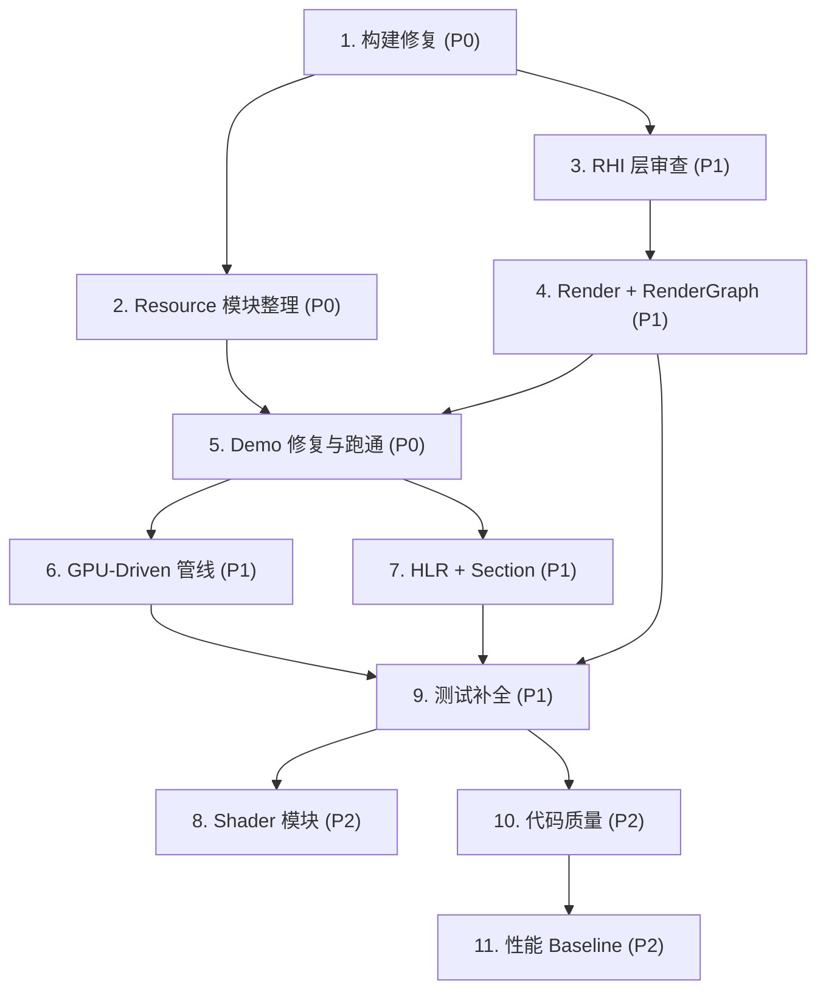

# Phase 7a-1 Codebase Cleanup & Stabilization Plan

**状态**: 计划中
**背景**: 当前 Phase 7a-1 所有 task spec 标记为 `[x]`（已有代码），但 demo 存在运行时 bug，多次 Agent 会话叠加导致代码质量不均。本计划旨在不添加新功能的前提下，系统性清理、修复、调优所有已有模块，确保 `geometry_pipeline` demo 各 stage 跑通后再向后推进。

**目标**:
- 所有 demo 可正常构建并运行（`debug` 与 `debug-vulkan` 两个 preset）
- 零 validation error（Vulkan validation layer 清洁）
- 所有现存 TODO/FIXME 清理或标注为 deferred
- 关键模块架构审查并优化
- 测试通过率 100%

---

## 0. 代码库现状审计

### 0.1 模块规模

| 模块 | src/ 文件数 | include/ 头文件数 | 主要职责 |
|------|-------------|-------------------|----------|
| rhi | 62 | 16 | 渲染硬件接口（Vulkan/D3D12/GL/WebGPU/Mock） |
| rendergraph | 22 | 33 | 渲染图构建/编译/执行/缓存 + 各 pass |
| resource | 12 | 13 | StagingRing, ReadbackRing, TransferQueue, BDA, ChunkPool |
| vgeo | 12 | 15 | GPU-driven: SceneBuffer, VisBuffer, meshlet, cull, sort |
| hlr | 10 | 11 | CAD HLR: edge classify/visibility/render, section |
| scene | 9 | 13 | 空间数据结构: BVH, octree, spatial hash |
| render | 8 | 10 | ForwardPass, GBuffer, ImGui, material, camera |
| kernel | 6 | 4 | OCCT 集成: import/tessellate/export |
| platform | 4 | 4 | WindowManager, Event, IWindowBackend |
| shader | 4 | 5 | SlangCompiler, ShaderWatcher, reflection |
| gfx | 1 | 1 | MeshData upload 工具 |
| topo | 2 | 3 | TopoGraph, TopoComponent |

### 0.2 已知代码质量标记

**src/ + include/ 中的 TODO/FIXME/HACK/WORKAROUND/TEMPORARY（按文件汇总）:**

| 文件 | 标记数 | 关键条目 |
|------|--------|----------|
| `VulkanDevice.cpp` | 34 | 大量 debug callback 相关（非 TODO） |
| `OpenGlDevice.cpp` | 21 | debug callback 相关 |
| `D3D12Device.cpp` | 8 | debug layer + stub methods |
| `D3D12CommandBuffer.cpp` | 4 | TODO(Phase 6a): DispatchMesh/ExecuteIndirect 未实现 |
| `BDAManager.cpp` | 1 | TODO(Phase 6a): GetBufferDeviceAddress() |
| `RenderGraphExecutor.cpp` | 1 | TODO(Phase4): 延迟资源销毁 |
| `PipelineCache.cpp` | 2 | TODO(Phase 4): driver/device validation |
| `EnvironmentRenderer.cpp` | 1 | TODO: rotation 参数传递 |
| `SectionCapPass.cpp` | 1 | TODO: stencil mark 子 pass |
| `GpuRadixSort.cpp` | 1 | Workaround: PrefixSum offset |
| `LinearOctree.cpp` | 1 | TODO: SVDAG production 路径 |

### 0.3 未提交变更（git status）

| 文件 | 说明 |
|------|------|
| `IDevice.h`, `IDevice.cpp` | 接口变更 |
| `ChunkPool.h`, `StagingRing.cpp`, `ReadbackRing.cpp`, `TransferQueue.cpp` | resource 模块重构中 |
| `FrameManager.cpp` | presentation 逻辑 |
| `VulkanDevice.cpp`, `VulkanDevice.h` | 后端适配 |
| `test_staging_ring.cpp`, `test_transfer_stress.cpp`, `test_transfer_benchmark.cpp` | 测试修改/新增 |
| `tests/unit/CMakeLists.txt` | 测试注册 |

---

## 1. 构建修复（优先级: P0）

**目标**: 两个 preset（`debug`, `debug-vulkan`）零错误构建。

| # | 任务 | 验收标准 |
|---|------|----------|
| 1.1 | 激活 COCA toolchain，`cmake --preset debug` + `cmake --build build/debug` | exit 0，零 error（warning 可容忍） |
| 1.2 | `cmake --preset debug-vulkan` + `cmake --build build/debug-vulkan` | 同上 |
| 1.3 | 解决 `resource` 模块未提交变更的编译问题（`ChunkPool.h`, `StagingRing.cpp` 等） | 编译通过 |
| 1.4 | 运行全部单元测试：`ctest --test-dir build/debug --output-on-failure` | 100% pass |
| 1.5 | 运行全部单元测试：`ctest --test-dir build/debug-vulkan --output-on-failure` | 100% pass |

---

## 2. Resource 模块整理（优先级: P0）

**背景**: `StagingUploader`（旧）→ `StagingRing`（新），`ReadbackRing`, `TransferQueue`, `ChunkPool` 正在重构中，有未提交变更，是当前 bug 的主要来源。

| # | 任务 | 说明 |
|---|------|------|
| 2.1 | **审查 StagingRing API** | 确保 `Reserve() -> span<byte>` 直写 staging 的 API 存在且正确；消除 `UploadMesh` 里的多余中间缓冲 |
| 2.2 | **审查 TransferQueue** | 确认与 `StagingRing::Flush` 的协作正确；验证 fence-based 生命周期管理 |
| 2.3 | **审查 ReadbackRing** | 确认 texture copy 路径正确（新增功能） |
| 2.4 | **审查 ChunkPool** | 确认 `ReadbackRing` 对其的依赖是否健壮 |
| 2.5 | **确保 WebGPU 路径不破** | `StagingRing` 的 unmap/remap 逻辑是否正确 |
| 2.6 | **对齐 MeshData::UploadMesh** | 要么使用 `StagingRing::Reserve` 直写（零拷贝 interleave），要么至少统一为单一路径 |
| 2.7 | **补充/修复 test_staging_ring.cpp** | 确保所有边界条件覆盖 |
| 2.8 | **提交 resource 模块变更** | 清理后 commit |

---

## 3. RHI 层审查（优先级: P1）

| # | 任务 | 说明 |
|---|------|------|
| 3.1 | **VulkanDevice 审查** | 34 处标记的分类: debug infra（保留）vs 实质 TODO → 逐条清理 |
| 3.2 | **VulkanRenderSurface 审查** | "Bug 3 fix" 的 per-swapchain-image semaphore 逻辑是否健壮; present/acquire 错误路径 |
| 3.3 | **FrameManager 审查** | 与 RenderSurface 的对齐；presentation staging（`704f6d1` commit）是否稳定 |
| 3.4 | **D3D12 stub 清理** | 4 个 TODO(Phase 6a) — 标注为 deferred，加 `static_assert` 或 `NotImplemented` error |
| 3.5 | **OpenGL 后端审查** | 21 处标记分类清理；确认与 demo 的兼容 |
| 3.6 | **WebGPU 后端审查** | placeholder bind group 逻辑；staging unmap 生命周期 |
| 3.7 | **Mock 后端** | 确认测试覆盖了所有 mock 路径 |
| 3.8 | **IDevice 接口变更** | 审查当前未提交的 `IDevice.h` 变更，确保向各后端对齐 |
| 3.9 | **DeviceConfig + Present feature** | 确认 `DemoInit` 中 `requiredFeatures.Add(Present)` 对所有 demo 生效 |

---

## 4. Render + RenderGraph 模块审查（优先级: P1）

| # | 任务 | 说明 |
|---|------|------|
| 4.1 | **ForwardPass** | 审查 pipeline 创建、draw call 流程 |
| 4.2 | **GBuffer + DeferredResolve** | GBuffer layout（`2360204` commit）是否稳定 |
| 4.3 | **ToneMapping** | 审查 + 确保与 HDR→LDR 链正确 |
| 4.4 | **Bloom** | 软降级路径（创建失败时跳过）是否正确 |
| 4.5 | **CSM Shadows** | 审查 cascade 计算、resolve |
| 4.6 | **FXAA** | 调整后的路径（`0261675` commit）是否稳定 |
| 4.7 | **GTAO / SSAO** | geometry_pipeline Stage 5 声称有但未调用 — 确认模块本身可用，标注 demo 中为 "not yet wired" |
| 4.8 | **TAA** | 同上 — 模块审查，确认与 demo 的 jitter 集成 |
| 4.9 | **EnvironmentMap + EnvironmentRenderer** | `TODO: rotation` 修复；placeholder identity matrix 处理 |
| 4.10 | **RenderGraphBuilder** | 2 个标记清理；条件节点是否正确 |
| 4.11 | **RenderGraphCache** | FNV-1a 碰撞概率说明是否足够 |
| 4.12 | **RenderGraphExecutor** | TODO(Phase4) 延迟销毁 — 评估是否现在就需要 |
| 4.13 | **PipelineCache** | TODO(Phase 4) driver/device ID 校验 — 是否影响稳定性 |
| 4.14 | **MaterialRegistry** | `std::hash<StandardPBR>` 迁移完成验证 |
| 4.15 | **ImGuiBackend** | 审查与 RenderSurface format 的对齐 |

---

## 5. Demo 修复与跑通（优先级: P0）

### 5.1 geometry_pipeline demo（核心目标）

| Stage | 功能 | 当前状态 | 任务 |
|-------|------|----------|------|
| 0 | Triangle | 应可用 | 验证 |
| 1 | PBR Cubes | 应可用 | 验证 |
| 2 | GBuffer Deferred | 依赖 GBuffer + DeferredResolve | 验证 + 修复 |
| 3 | IBL | EnvironmentMap + Skybox | 验证 + 修复 rotation TODO |
| 4 | Shadows | CSM | 验证 |
| 5 | AO | **GTAO/SSAO 未接入** | 如果模块可用则接入；否则标注跳过 |
| 6 | Post-Process | Bloom + FXAA（TAA 未接入） | 验证 Bloom + FXAA |
| 7 | HLR | **仅枚举存在，未在 BuildRenderGraph 中** | 评估是否接入或标注 |
| 8 | OCCT | **仅枚举存在** | 同上 |

**额外修复**:
- `forceCompatTier` CLI 参数未传入 `DemoInitDesc` → 修复
- 文件头注释与实际 Stage 实现对齐

### 5.2 其他 demo 跑通验证

| Demo | 目标 |
|------|------|
| triangle | 启动 + 渲染三角 + 关闭，无 validation error |
| forward_cubes | 启动 + 多 cube + 关闭 |
| deferred_pbr_basic | 启动 + deferred 渲染 |
| deferred_pbr | 启动 + 完整 post-process chain |
| bindless_scene | 启动 + bindless draw |
| gpu_driven_basic | 启动 + mesh shader 路径（若硬件支持） |
| cad_hlr_section | 启动 + HLR + section |
| kernel_demo | 启动（需 OCCT） |
| occt_mesh_tess | 启动（需 OCCT） |

---

## 6. GPU-Driven 管线审查（优先级: P1）

| # | 任务 | 说明 |
|---|------|------|
| 6.1 | **SceneBuffer** | 3 处标记 + resize 路径审查 |
| 6.2 | **VisibilityBuffer** | 审查 clear + render + resolve |
| 6.3 | **GpuCullPipeline** | mesh shader dispatch 正确性 |
| 6.4 | **HiZPyramid** | mipmap chain 构建 |
| 6.5 | **GpuPrefixSum** | 正确性（`GpuRadixSort` 有 workaround） |
| 6.6 | **GpuRadixSort** | workaround 评估：是否需要给 PrefixSum 加 offset |
| 6.7 | **MacroBinning** | Phase 6a 占位审查 |
| 6.8 | **BDAManager** | TODO(Phase 6a) `GetBufferDeviceAddress()` — 评估实现时机 |
| 6.9 | **gpu_driven_basic `kDebugLevel=0`** | 为何默认跳过几何 pass？修复 device lost 原因 |

---

## 7. HLR + Section 模块审查（优先级: P1）

| # | 任务 | 说明 |
|---|------|------|
| 7.1 | **EdgeTypes / EdgeBuffer** | GPU 对齐 `static_assert` 验证 |
| 7.2 | **EdgeClassifier** | Pre-cull + classify + compact 管线审查 |
| 7.3 | **EdgeVisibility** | HiZ ray-march 路径 |
| 7.4 | **EdgeRenderer** | SDF line render + DisplayStyle |
| 7.5 | **SectionCapPass** | TODO: stencil mark 子 pass — 修复或 deferred |
| 7.6 | **SectionPlane / SectionVolume** | 多平面 boolean 正确性 |
| 7.7 | **HatchLibrary** | 模式完整性 |
| 7.8 | **LinePatternLibrary** | ISO 128 完整性 |

---

## 8. Shader 模块审查（优先级: P2）

| # | 任务 | 说明 |
|---|------|------|
| 8.1 | **SlangCompiler** | 反射能力审查（`f474392` commit） |
| 8.2 | **ShaderWatcher** | 热重载路径 — `triangle` demo 中 TODO(Phase2) 未重绑 pipeline |
| 8.3 | **Shader 文件组织** | `shaders/` 下目录结构审查 |

---

## 9. 测试补全（优先级: P1）

| # | 任务 | 说明 |
|---|------|------|
| 9.1 | 修复当前失败的测试 | 构建 → ctest → 逐一修复 |
| 9.2 | 确认 128 个单元测试文件全部注册到 CMakeLists | 对比文件列表与 CMake 目标 |
| 9.3 | 确认 10 个集成测试全部注册 | 同上 |
| 9.4 | 审查 `test_transfer_benchmark.cpp`（未追踪） | 决定是否纳入 |

---

## 10. 代码质量扫尾（优先级: P2）

| # | 任务 | 说明 |
|---|------|------|
| 10.1 | **统一 demo 初始化模式** | 所有 demo 使用 `DemoInit` + `BindSurface`；`gpu_driven_basic` 仍直接调 `RenderSurface` API — 评估是否迁移 |
| 10.2 | **统一 Staging 路径** | 旧 `StagingUploader` vs 新 `StagingRing` — 确认是否仍有残留引用 |
| 10.3 | **消除重复 mesh 拷贝** | `UploadMesh` 使用 `StagingRing::Reserve` 直写 |
| 10.4 | **SceneData 生命周期** | demo 中 `OwnedMeshData` + `MeshBuffers` 双份 — 上传后释放 CPU mesh 或改为 `optional` |
| 10.5 | **LLDB 格式化器** | 验证 `Result<T>` formatter 正常工作 |
| 10.6 | **natvis** | 考虑为 `Result` 加 natvis 条目 |
| 10.7 | **launch.json** | 已完成 `geometry_pipeline_demo` 条目 |

---

## 11. 性能 Baseline（优先级: P2）

| # | 任务 | 说明 |
|---|------|------|
| 11.1 | 在本机 GPU 上运行 `geometry_pipeline` 各 stage，记录每 pass GPU 时间 | 时间戳查询 |
| 11.2 | 记录 `deferred_pbr` 完整链条 GPU 时间 | 作为后续回归基线 |
| 11.3 | 记录 `gpu_driven_basic` mesh shader 路径时间（若可跑通） | 同上 |

---

## 执行顺序

---

## Gate Check（整理完成标准）

| 维度 | 标准 |
|------|------|
| 构建 | `debug` + `debug-vulkan` 两 preset 零 error |
| 测试 | 全部 unit + integration 100% pass |
| Demo | `geometry_pipeline` Stage 0–6 可运行；其余 demo 可启动 |
| Validation | Vulkan validation layer 零 error（warning 可容忍） |
| TODO/FIXME | 无未标注的 TODO；所有保留的 TODO 标注对应 phase |
| 架构 | resource 模块统一；staging 路径清晰；demo 初始化一致 |
| 性能 | 有 baseline 数据（不需要优化到特定目标，但需要有记录） |

---

## 附录: Demo 列表与 CMake 目标

| Demo | CMake 目标 | Phase |
|------|-----------|-------|
| triangle | `triangle_demo` | 1b |
| forward_cubes | `forward_cubes_demo` | 2 |
| deferred_pbr_basic | `deferred_pbr_basic_demo` | 3a |
| deferred_pbr | `deferred_pbr_demo` | 3b |
| slang-playground | `slang_playground` | 1a |
| bindless_scene | `bindless_scene_demo` | 4 |
| spatial_debug | `spatial_debug_demo` | 5 |
| ecs_spatial | `ecs_spatial_demo` | 5 |
| kernel_demo | `kernel_demo` | 7b |
| gpu_driven_basic | `gpu_driven_basic` | 6a |
| geometry_pipeline | `geometry_pipeline_demo` | 7a1 |
| cad_hlr_section | `cad_hlr_section_demo` | 7a1 |
| occt_mesh_tess | `occt_mesh_tess_demo` | 7b |
| triangle_web | `triangle_web` | 1b (WASM) |
| forward_cubes_web | `forward_cubes_web` | 2 (WASM) |
