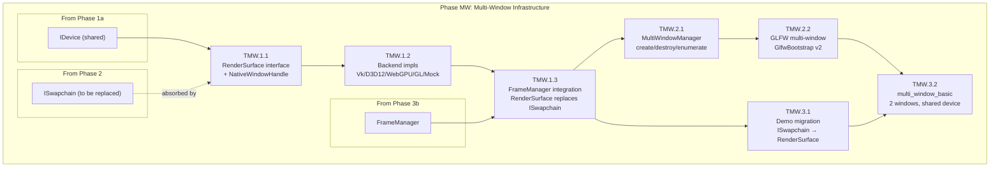

# Phase MW: Multi-Window Infrastructure (Side-Phase)

**Sequence**: Side-phase (extracted from Phase 12, executable after Phase 6a)
**Status**: Not Started
**Started**: —
**Completed**: —
**Prerequisite Phases**: 1a (IDevice), 2 (ISwapchain), 3a (RenderGraph), 3b (FrameManager refactor)
**Forward Target**: Phase 12 (Multi-View & Multi-Window full) absorbs this output

## Goal

Replace the temporary `ISwapchain` abstraction (Phase 2 stopgap) with a production-grade
`RenderSurface` that supports **multi-window rendering** with shared `IDevice`. Deliver
`MultiWindowManager` for dynamic window create/destroy, per-window `FrameManager` integration,
and a `multi_window_basic` demo showing 2+ independent windows with independent cameras.

**Explicitly NOT in scope** (remains in Phase 12):
- Multi-View GPU (`VK_KHR_multiview`, per-view cull dispatch)
- ViewRenderer (per-view CadScene config override)
- PresentationManager multi-view extension
- Per-view render graph conditional passes

## Industry Research Summary

| Engine | Surface Abstraction | Multi-Window Strategy | Sync Model |
|--------|--------------------|-----------------------|------------|
| **Filament** | `SwapChain` (per-window, created from native handle or headless) | Multiple `Renderer` instances share one `Engine` (=device). Each `Renderer` targets its own `SwapChain`. `beginFrame(swapChain)` → `render(view)` → `endFrame()` per window. | Per-SwapChain `FrameScheduledCallback`. Fence after resize. |
| **Diligent** | `ISwapChain` (core interface, `NativeWindow` abstraction for cross-platform handle). `SetMaximumFrameLatency()`. | Shared `IRenderDevice` + per-window `ISwapChain`. Tutorial15_MultipleWindows. | `Present(syncInterval)` per swapchain. Per-frame fence via device context. |
| **wgpu** | `Surface` (per-backend `hal::DynSurface` map). `configure()` / `get_current_texture()` / `present()`. | One `Device`, multiple `Surface` objects. Each surface configured independently (format, present mode, size). | Mutex on presentation state — one acquired texture per surface at a time. `WaitIdle` on reconfigure. |
| **bgfx** | `FrameBuffer` from native window handle. Multiple frame buffers = multiple windows. | Single device, `setViewFrameBuffer()` per view → multi-window. | Implicit via `frame()` submission. |

### Key Design Decisions (derived from industry research)

1. **Filament pattern adopted**: `RenderSurface` replaces `ISwapchain` as a strict superset.
   `FrameManager` binds to one `RenderSurface` (Filament: `Renderer` binds to one `SwapChain`).
   Multi-window = multiple `FrameManager` + `RenderSurface` pairs sharing one `IDevice`.

2. **wgpu-style lifecycle**: `RenderSurface::Configure()` for format/size/present-mode changes
   (not just `Resize(w,h)`). This decouples creation from configuration, matching modern APIs
   (wgpu `surface.configure()`, Vulkan `vkCreateSwapchainKHR` with oldSwapchain).

3. **Diligent `NativeWindow` pattern**: Cross-platform window handle abstraction in
   `RenderSurfaceDesc` (HWND on Win32, `wl_surface*` on Wayland, etc.), not raw `void*`.

4. **Data consistency invariant**: Each `RenderSurface` owns its sync objects (semaphores/fences).
   `MultiWindowManager` ensures no two surfaces submit to the same queue simultaneously
   without proper ordering. On single-queue devices (most consumer GPUs), windows are
   rendered sequentially within a frame; on multi-queue, each surface can use a dedicated
   present queue.

5. **No global WaitIdle on resize**: Per-surface `WaitIdle` (wait only for commands targeting
   THIS surface's images). Filament and wgpu both do per-surface wait, not global stall.

## Scope (3 Components, 7 Tasks)

| # | Component | Tasks | Test Target | Effort |
|---|-----------|-------|-------------|--------|
| 1 | RenderSurface | TMW.1.1, TMW.1.2, TMW.1.3 | ~22 | L (6-8h) |
| 2 | MultiWindowManager | TMW.2.1, TMW.2.2 | ~16 | M (4-6h) |
| 3 | Demo + Migration | TMW.3.1, TMW.3.2 | ~8 | M (3-4h) |
| | **Total** | **7** | **~46** | **~15h** |

## Component → Task Breakdown

### Component 1: RenderSurface (ISwapchain replacement)

| Task | Name | Deps | Effort | Layer |
|------|------|------|--------|-------|
| TMW.1.1 | RenderSurface interface + NativeWindowHandle | — | S | L0 |
| TMW.1.2 | Backend implementations (Vulkan, D3D12, WebGPU, GL, Mock) | TMW.1.1 | L | L1 |
| TMW.1.3 | FrameManager integration (RenderSurface replaces ISwapchain) | TMW.1.2 | M | L2 |

### Component 2: MultiWindowManager

| Task | Name | Deps | Effort | Layer |
|------|------|------|--------|-------|
| TMW.2.1 | MultiWindowManager core (create/destroy/enumerate) | TMW.1.3 | M | L3 |
| TMW.2.2 | GLFW multi-window integration (GlfwBootstrap v2) | TMW.2.1 | M | L3 |

### Component 3: Demo + Migration

| Task | Name | Deps | Effort | Layer |
|------|------|------|--------|-------|
| TMW.3.1 | Migrate all existing demos from ISwapchain → RenderSurface | TMW.1.3 | M | L4 |
| TMW.3.2 | multi_window_basic demo (2 windows, shared device, independent cameras) | TMW.2.2 | M | L4 |

## Component Dependency Graph



## Critical Technical Decisions

### D1: RenderSurface API (superset of ISwapchain)

```cpp
// New public interface — replaces ISwapchain
class RenderSurface {
public:
    // Factory: from NativeWindowHandle + device
    static auto Create(IDevice& device, const RenderSurfaceDesc& desc)
        -> Result<std::unique_ptr<RenderSurface>>;

    // Configure/reconfigure (wgpu pattern — decouples creation from config)
    auto Configure(const RenderSurfaceConfig& config) -> Result<void>;

    // ISwapchain-compatible subset (preserved for migration)
    auto AcquireNextImage() -> Result<TextureHandle>;
    auto Present() -> Result<void>;
    auto GetFormat() const noexcept -> Format;
    auto GetExtent() const noexcept -> Extent2D;
    auto GetCurrentTexture() const noexcept -> TextureHandle;
    auto GetSubmitSyncInfo() const noexcept -> SubmitSyncInfo;

    // New: explicit configuration query
    auto GetConfig() const noexcept -> RenderSurfaceConfig;
    auto GetCapabilities() const -> RenderSurfaceCapabilities;
};
```

**RenderSurfaceDesc** (creation-time, immutable):
- `NativeWindowHandle window` — typed union, not `void*`
- `IDevice& device` — shared device reference

**RenderSurfaceConfig** (mutable, re-configurable):
- `Format format`
- `uint32_t width, height`
- `PresentMode presentMode` (Fifo, Mailbox, Immediate)
- `uint32_t imageCount` (2 or 3)
- `bool hdr` (future-proof for HDR10/scRGB)

**RenderSurfaceCapabilities** (queried from hardware):
- `std::vector<Format> supportedFormats`
- `std::vector<PresentMode> supportedPresentModes`
- `Extent2D minExtent, maxExtent`
- `uint32_t minImageCount, maxImageCount`

### D2: NativeWindowHandle (typed, not void*)

```cpp
// Cross-platform native window handle (Diligent NativeWindow pattern)
struct NativeWindowHandle {
    enum class Type : uint8_t {
        Win32,      // HWND
        Xlib,       // Window + Display*
        Wayland,    // wl_surface* + wl_display*
        Cocoa,      // NSWindow* (future)
        Android,    // ANativeWindow* (future)
        Web,        // HTML canvas selector string
    };

    Type type = Type::Win32;

    union {
        struct { void* hwnd; } win32;
        struct { void* display; unsigned long window; } xlib;
        struct { void* display; void* surface; } wayland;
        struct { void* nsWindow; } cocoa;
        struct { void* aNativeWindow; } android;
        struct { const char* canvasSelector; } web;
    };
};
```

### D3: MultiWindowManager lifecycle

```cpp
class MultiWindowManager {
public:
    struct WindowDesc {
        std::string_view title;
        uint32_t width, height;
        RenderSurfaceConfig surfaceConfig;
    };

    struct WindowHandle {
        uint32_t id;  // stable, monotonically increasing
    };

    static auto Create(IDevice& device, std::unique_ptr<IWindowBackend> backend)
        -> Result<MultiWindowManager>;

    // Dynamic window management
    auto CreateWindow(const WindowDesc& desc) -> Result<WindowHandle>;
    auto DestroyWindow(WindowHandle handle) -> Result<void>;

    // Access per-window resources
    auto GetRenderSurface(WindowHandle h) -> RenderSurface*;
    auto GetFrameManager(WindowHandle h) -> FrameManager*;
    auto GetNativeWindow(WindowHandle h) -> void*;  // GLFWwindow* for GLFW

    // Enumerate
    auto GetWindowCount() const noexcept -> uint32_t;
    auto GetAllWindows() const -> std::span<const WindowHandle>;

    // Per-frame: returns windows that need rendering (not minimized, not occluded)
    auto GetActiveWindows() -> std::span<const WindowHandle>;

    // Poll events for all windows (GLFW: glfwPollEvents once)
    auto PollEvents() -> void;
    auto ShouldClose() const -> bool;  // true if ALL windows closed
};
```

**Ownership model** (Filament-inspired):
- `MultiWindowManager` owns all `RenderSurface` and `FrameManager` instances
- `IDevice` is shared (borrowed reference, not owned)
- Each window gets its own GLFW window + RenderSurface + FrameManager
- `DestroyWindow` waits for that surface's GPU work before cleanup (per-surface WaitIdle)

### D4: FrameManager changes

Current `FrameManager::Create(IDevice&, ISwapchain&)` changes to:
```cpp
FrameManager::Create(IDevice&, RenderSurface&)  // signature change
```

Internal `ISwapchain*` member becomes `RenderSurface*`. All method implementations
unchanged (AcquireNextImage, GetSubmitSyncInfo, Present are compatible).

### D5: GL backend strategy

OpenGL has no explicit swapchain. `RenderSurface` for GL:
- `Configure()` — no-op (GL surface is the default FBO 0)
- `AcquireNextImage()` — returns a sentinel `TextureHandle` representing FBO 0
- `Present()` — calls `glfwSwapBuffers(window)` (or platform equivalent)
- `GetSubmitSyncInfo()` — returns empty (GL has implicit sync)
- Multi-window GL: each window needs its own GL context. `MultiWindowManager` creates
  one GL context per window, uses `glfwMakeContextCurrent()` before rendering.
  **Alternative**: single shared context, `wglMakeCurrent` per-window per-frame.
  We use the shared context approach (matches GLFW `glfwWindowHint(GLFW_CONTEXT_CREATION_API)`)
  since miki GL is single-threaded.

### D6: Thread safety model

- `RenderSurface` is **not thread-safe** — all calls must be on the render thread.
- `MultiWindowManager` is **not thread-safe** — single-threaded orchestration.
- This matches Filament (all engine calls on engine thread) and wgpu (Surface has Mutex
  for single-acquire invariant). Phase 13 (Coca coroutines) may add thread-safe wrappers.

## Performance Targets

| Metric | Target | Rationale |
|--------|--------|-----------|
| Window create latency | < 50ms | GLFW window + swapchain creation |
| Window destroy latency | < 20ms | Per-surface WaitIdle + resource cleanup |
| Per-window frame overhead | < 0.1ms | Acquire + Present + sync bookkeeping |
| Resize latency | < 30ms | Per-surface WaitIdle + swapchain recreate |
| Max simultaneous windows | 8 | Reasonable for CAD 4-view + floating panels |

## Phase 12 Forward Compatibility Contract

When Phase 12 is implemented, it will:
1. **Consume** `RenderSurface` and `MultiWindowManager` directly (no replacement needed)
2. **Add** `ViewRenderer` that wraps `RenderSurface` + camera + render graph
3. **Add** Multi-View GPU cull on top of per-window `FrameManager`
4. **Extend** `MultiWindowManager` with `GetViewRenderer(handle)` accessor
5. `RenderSurface` API is **frozen** after this phase — Phase 12 only adds consumers

## Forward Design Notes

1. **Phase 12 ViewRenderer**: Will own a `RenderSurface*` (borrowed from MultiWindowManager)
   plus camera, display style, section planes. Per-view render graph built from shared template.
   TMW.1.1 must ensure `RenderSurface` provides everything ViewRenderer needs.

2. **Phase 13 Async**: `RenderSurface::AcquireNextImage` and `Present` are synchronous.
   Phase 13 may wrap them in `coca::Task<>` for async frame scheduling.

3. **Phase 15a SDK**: `MikiView` (public SDK type) will hold a `RenderSurface*` internally.
   `RenderSurface` must be Pimpl'd for ABI stability.

4. **HDR**: `RenderSurfaceConfig::hdr` is a placeholder. Phase 14+ will add HDR10/scRGB
   format negotiation in `RenderSurfaceCapabilities`.
