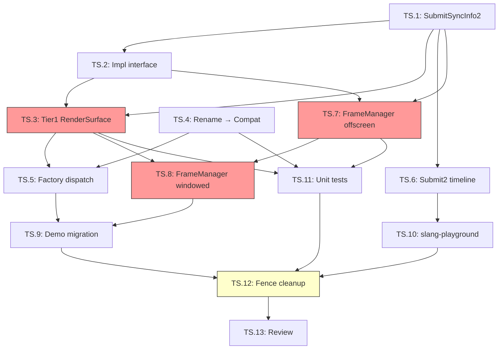

# Timeline Semaphore Migration — Tier1 Full Sync Modernization

> **Status**: **IMPLEMENTED** (2026-03-27)
>
> **Scope**: Tier1 (Vulkan 1.4) pipeline 全面迁移到 timeline semaphore 同步模型。消除所有 `VkFence` 用于帧限流的场景，最小化 binary semaphore 使用（仅保留 Vulkan 规范强制要求的 swapchain acquire/present 路径）。Tier2_Compat (Vulkan 1.1) 保持独立同步策略，两条路径在构造时确定，运行时零分支。Offscreen 模式统一使用 timeline semaphore 替代 `WaitIdle()`。
>
> **Benchmark**: Filament `VulkanTimestamps` (timeline-based frame pacing), The Forge `IFence` → `ISemaphore` migration, UE5 `FVulkanSemaphore` (timeline-first), NVIDIA Nsight best practice ("prefer timeline semaphores over fences").

---

## 1. Problem Statement

| # | Problem | Impact |
|---|---------|--------|
| 1 | `VulkanRenderSurface` 每帧使用 `VkFence` 做帧限流（`vkWaitForFences` + `vkResetFences`） | 需要 N 个 fence 对象 + reset 操作；fence 是 kernel-crossing syscall，比 timeline semaphore 的 `vkWaitSemaphores` 开销更高 |
| 2 | `SubmitSyncInfo` 和 `SubmitInfo2` 保留 `signalFence` 字段 | 所有 submit 路径都要处理 fence 分支，增加代码复杂度 |
| 3 | `FrameManager` offscreen 模式使用 `WaitIdle()` 代替 per-frame sync | 完全序列化 GPU/CPU，无法 overlap。**所有 Tier 均受影响**——`VkFence` 是 Vulkan 1.0 core，Compat 完全可以用 fence 帧限流，`WaitIdle` 纯属实现遗漏 |
| 4 | Tier1 和 Compat 共用同一套 `SubmitSyncInfo` / `VulkanRenderSurface` 同步对象 | 无法针对 Tier1 优化同步策略；Compat 不保证 timeline semaphore 可用（Vulkan 1.1） |
| 5 | `slang-playground` VulkanContext 使用独立的 raw fence + binary semaphore 同步 | 与 miki RHI 同步模型不一致，技术债 |

---

## 2. Design Decisions

| Decision | Choice | Rationale |
|----------|--------|-----------|
| Tier1 帧限流 | 单个 timeline semaphore + monotonic `frameNumber` | 替代 N 个 `VkFence`；无需 reset；单调递增值天然支持任意 frames-in-flight |
| Tier2_Compat 帧限流 | 保留 `VkFence` 数组（Vulkan 1.1 不保证 timeline semaphore） | 独立实现类，不与 Tier1 共享同步对象 |
| Swapchain acquire | 保留 binary semaphore（Vulkan 规范 `VUID-vkAcquireNextImageKHR-semaphore-03265` 禁止 timeline） | 硬性约束，无法绕过 |
| Swapchain present wait | 保留 binary semaphore（`VkPresentInfoKHR::pWaitSemaphores` 只接受 binary） | 硬性约束 |
| `SubmitSyncInfo` | Tier1 路径废弃 `signalFence` 字段；新增 `SubmitSyncInfo2` 替代 | 清晰分离 Tier1 vs Compat 同步语义 |
| Tier 分离策略 | `RenderSurface::Impl` 的两个子类：`VulkanRenderSurfaceTier1` / `VulkanRenderSurfaceCompat` | 构造时由 `CapabilityTier` 选择，运行时零 `if (tier)` 分支 |
| `FrameManager` offscreen | **统一** timeline semaphore 帧限流（`IDevice::CreateTimelineSemaphore` 在所有后端可用） | 消除 `WaitIdle()` 序列化，获得真正的 N-frame overlap |
| `slang-playground` | 迁移到 miki RHI `FrameManager` 或独立 timeline 同步 | 消除技术债 |

---

## 3. Vulkan 规范约束矩阵

| 同步对象 | 当前用途 | Tier1 目标 | 可替换为 Timeline? | 规范依据 |
|----------|----------|------------|---------------------|----------|
| `inFlightFences_[N]` | 帧限流 (CPU wait) | 单个 timeline semaphore | **YES** | `vkWaitSemaphores` (Vulkan 1.2 core) |
| `imageAvailableSemaphores_[N]` | swapchain acquire signal | 保留 binary | **NO** | `VUID-vkAcquireNextImageKHR-semaphore-03265` |
| `renderFinishedSemaphores_[N]` | present wait | 保留 binary | **NO** | `VkPresentInfoKHR` 只接受 binary semaphore |
| `SubmitSyncInfo::signalFence` | submit 时 signal fence | timeline signal in `SubmitInfo2` | **YES** | `VkSemaphoreSubmitInfo` with `VK_SEMAPHORE_TYPE_TIMELINE` |
| `TransferQueue` timeline sem | async DMA sync | 保持不变（已是 timeline） | N/A | 已正确实现 |
| `RenderGraphExecutor` timeline sem | multi-queue pass sync | 保持不变（已是 timeline） | N/A | 已正确实现 |

---

## 4. Architecture: Tier-Polymorphic Sync

### 4.1 构造时分发（零运行时分支）

```
IDevice::Create()
  └─ VulkanDevice::Init()
       └─ CapabilityTier == Tier1_Full?
            ├─ YES → VulkanRenderSurfaceTier1  (timeline frame pacing)
            │        SubmitInfo2 (timeline-only, no signalFence)
            │        FrameManager::Impl with timeline semaphore
            └─ NO  → VulkanRenderSurfaceCompat (fence frame pacing)
                     SubmitSyncInfo (fence + binary semaphore)
                     FrameManager::Impl with VkFence array
```

### 4.2 VulkanRenderSurfaceTier1 同步对象

```cpp
class VulkanRenderSurfaceTier1 final : public RenderSurface::Impl {
    // Swapchain acquire — binary (Vulkan spec mandated)
    std::array<VkSemaphore, kMaxFramesInFlight> imageAvailableSemaphores_;

    // Render-finished — binary (present requires binary)
    std::vector<VkSemaphore> renderFinishedSemaphores_;

    // Frame pacing — SINGLE timeline semaphore replaces N fences
    SemaphoreHandle framePacingSemaphore_;  // timeline, initial value = 0
    uint64_t frameNumber_ = 0;             // monotonic, never wraps

    // NO VkFence anywhere
};
```

**AcquireNextImage 流程**:

```
1. if (frameNumber_ >= kMaxFramesInFlight):
     device.WaitSemaphoreValue(framePacingSemaphore_,
                               frameNumber_ - kMaxFramesInFlight + 1)
2. vkAcquireNextImageKHR(..., imageAvailableSemaphores_[slot], VK_NULL_HANDLE, ...)
3. 返回 SubmitSyncInfo2 {
     .waitBinarySemaphores = { imageAvailableSemaphores_[slot] },
     .signalBinarySemaphores = { renderFinishedSemaphores_[imageIndex] },
     .signalTimeline = { framePacingSemaphore_, frameNumber_ + 1 },
   }
```

**Present 流程**:

```
1. vkQueuePresentKHR(..., pWaitSemaphores = { renderFinishedSemaphores_[imageIndex] })
2. frameNumber_++
```

### 4.3 VulkanRenderSurfaceCompat 同步对象

```cpp
class VulkanRenderSurfaceCompat final : public RenderSurface::Impl {
    // 保持现有实现不变
    std::array<VkSemaphore, kMaxFramesInFlight> imageAvailableSemaphores_;
    std::array<VkFence, kMaxFramesInFlight> inFlightFences_;
    std::vector<VkSemaphore> renderFinishedSemaphores_;
};
```

与当前 `VulkanRenderSurface` 完全相同，无任何改动。

---

## 5. Interface Changes

### 5.1 新增 `SubmitSyncInfo2`（Tier1 专用）

```cpp
struct SubmitSyncInfo2 {
    // Binary semaphores — swapchain acquire/present only
    std::span<const uint64_t> waitBinarySemaphores = {};
    std::span<const uint64_t> signalBinarySemaphores = {};

    // Timeline semaphore signals (frame pacing + cross-queue)
    std::span<const TimelineSemaphoreSignal> timelineSignals = {};

    // Timeline semaphore waits (cross-queue dependencies)
    std::span<const TimelineSemaphoreWait> timelineWaits = {};

    // NO signalFence — Tier1 never uses VkFence
};
```

### 5.2 `RenderSurface::Impl` 接口扩展

```cpp
struct RenderSurface::Impl {
    // 现有接口保持不变（Compat 使用）
    [[nodiscard]] virtual auto GetSubmitSyncInfo() const noexcept -> SubmitSyncInfo = 0;

    // 新增 Tier1 接口（默认返回空，Compat 不 override）
    [[nodiscard]] virtual auto GetSubmitSyncInfo2() const noexcept -> SubmitSyncInfo2 {
        return {};
    }

    // 查询当前 surface 使用的同步模型
    [[nodiscard]] virtual auto UsesTimelineFramePacing() const noexcept -> bool {
        return false;
    }
};
```

### 5.3 `SubmitInfo2` 清理

```cpp
struct SubmitInfo2 {
    QueueType queue = QueueType::Graphics;

    std::span<const TimelineSemaphoreWait> timelineWaits = {};
    std::span<const TimelineSemaphoreSignal> timelineSignals = {};

    // Binary semaphores — ONLY for swapchain interop
    std::span<const uint64_t> waitSemaphores = {};
    std::span<const uint64_t> signalSemaphores = {};

    // DEPRECATED for Tier1 — retained only for Compat backward compat
    uint64_t signalFence = 0;
};
```

### 5.4 `FrameManager` offscreen — 统一 timeline semaphore

```cpp
struct FrameManager::Impl {
    // ... existing fields ...
    SemaphoreHandle offscreenTimelineSem = {};  // created in CreateOffscreen()
};
```

`IDevice::CreateTimelineSemaphore` 在所有后端（Vulkan、D3D12、Mock）均可用，因此 offscreen 模式不区分 Tier，统一使用 timeline semaphore。

**BeginFrame (offscreen)**:

```
if (frameNumber >= framesInFlight):
    device.WaitSemaphoreValue(offscreenTimelineSem,
                              frameNumber - framesInFlight + 1)
```

**EndFrame (offscreen)**:

```
TimelineSemaphoreSignal signal {
    .semaphore = offscreenTimelineSem,
    .value = frameNumber + 1,
};
SubmitInfo2 info {
    .queue = Graphics,
    .timelineWaits = transferWaits,  // if TransferQueue active
    .timelineSignals = { signal },
};
device.Submit2(cmd, info);
```

---

## 6. Affected Files

| File | Change Type | Description |
|------|-------------|-------------|
| `include/miki/rhi/RhiDescriptors.h` | Modify | 新增 `SubmitSyncInfo2`；`SubmitInfo2` 注释更新 |
| `include/miki/rhi/RenderSurface.h` | Modify | 新增 `GetSubmitSyncInfo2()`, `UsesTimelineFramePacing()`, `BuildSubmitInfo()` |
| `src/miki/rhi/RenderSurfaceImpl.h` | Modify | Impl 基类新增虚方法 + 默认实现 |
| `src/miki/rhi/RenderSurface.cpp` | Modify | Pimpl 转发 + `BuildSubmitInfo()` 统一构造 |
| `src/miki/rhi/vulkan/VulkanRenderSurface.h` | **Deleted** | 被 Tier1 + Compat 替代 |
| `src/miki/rhi/vulkan/VulkanRenderSurface.cpp` | **Deleted** | 被 Tier1 + Compat 替代 |
| `src/miki/rhi/vulkan/VulkanRenderSurfaceTier1.h` | **New** | Tier1 timeline frame pacing |
| `src/miki/rhi/vulkan/VulkanRenderSurfaceTier1.cpp` | **New** | Tier1 实现 + `CreateVulkanRenderSurface` 工厂 |
| `src/miki/rhi/vulkan/VulkanRenderSurfaceCompat.h` | **New** | Compat fence frame pacing（原 VulkanRenderSurface 重命名） |
| `src/miki/rhi/vulkan/VulkanRenderSurfaceCompat.cpp` | **New** | Compat 实现 + Present() 计数器修复 |
| `src/miki/rhi/vulkan/CMakeLists.txt` | Modify | 源文件列表更新 |
| `src/miki/rhi/FrameManager.cpp` | Modify | offscreen timeline semaphore；windowed Tier1/Compat 分发 |
| `demos/pipeline/01_rhi_torus/main.cpp` | Modify | `BuildSubmitInfo()` + `Submit2()` |
| `demos/samples/{triangle,forward_cubes,deferred_pbr,deferred_pbr_basic,bindless_scene}/main.cpp` | Modify | 同上 |
| `demos/compute/{kernel_demo,gpu_driven_basic}/main.cpp` | Modify | 同上 |
| `demos/ecs/ecs_spatial/main.cpp` | Modify | 同上 |
| `demos/geometry/{occt_mesh_tess,cad_hlr_section}/main.cpp` | Modify | 同上 |
| `tests/unit/rhi/test_frame_staging.cpp` | Modify | 新增 5 个 timeline pacing 测试 |

---

## 7. Task List

| ID | Task | Status | Notes |
|----|------|--------|-------|
| TS.1 | 新增 `SubmitSyncInfo2` 到 `RhiDescriptors.h` | DONE | `signalFence` 保留给 Compat，未标记 deprecated |
| TS.2 | 扩展 `RenderSurface::Impl` 接口 + 公共 `RenderSurface` 类 | DONE | 新增 `GetSubmitSyncInfo2()`, `UsesTimelineFramePacing()`, `BuildSubmitInfo()` |
| TS.3 | 实现 `VulkanRenderSurfaceTier1` | DONE | timeline frame pacing + binary acquire/present |
| TS.4 | 重命名 `VulkanRenderSurface` → `VulkanRenderSurfaceCompat` | DONE | 纯重命名 + Present() 计数器修复 |
| TS.5 | 工厂分发 `CreateVulkanRenderSurface` 按 `CapabilityTier` 选择 | DONE | 位于 `VulkanRenderSurfaceTier1.cpp` 底部 |
| TS.6 | `VulkanDevice::Submit2()` timeline signal 路径 | DONE | 已有实现无需修改 |
| TS.7 | `FrameManager` offscreen 帧限流 | DONE | 统一使用 timeline semaphore（所有后端 `IDevice` 均支持） |
| TS.8 | `FrameManager` windowed Tier1/Compat 分发 | DONE | `UsesTimelineFramePacing()` 分支 |
| TS.9 | 迁移 11 个 demo 到 `BuildSubmitInfo()` + `Submit2()` | DONE | |
| TS.10 | `slang-playground` 迁移 | SKIPPED | standalone Vulkan，不经过 miki RHI |
| TS.11 | 单元测试 | DONE | 16/16 passed (含 3 个新增 timeline pacing 测试 + 2 个 SubmitSyncInfo2 类型测试) |
| TS.12 | 编译验证 | DONE | debug-vulkan preset 零错误（仅 occt_mesh_tess 预存 bug） |
| TS.13 | Code review | DONE | 修复 2 个问题：WaitSemaphoreValue 失败后 return error；Present() 计数器始终推进 |

---

## 8. Dependency Graph



---

## 9. Sync Object Lifecycle Comparison

### Before (Current)

```
Per RenderSurface:
  imageAvailableSemaphores_[2]   — binary, per frame-in-flight slot
  renderFinishedSemaphores_[N]   — binary, per swapchain image
  inFlightFences_[2]             — VkFence, per frame-in-flight slot

Total Vulkan objects per surface: 2 + N + 2 = N + 4  (N = swapchain image count)

Per frame:
  vkWaitForFences(1)     — kernel syscall
  vkResetFences(1)       — kernel syscall
  vkQueueSubmit(fence)   — fence signal
```

### After (Tier1)

```
Per RenderSurface:
  imageAvailableSemaphores_[2]   — binary (unchanged, spec-mandated)
  renderFinishedSemaphores_[N]   — binary (unchanged, spec-mandated)
  framePacingSemaphore_           — 1 timeline semaphore (replaces 2 fences)

Total Vulkan objects per surface: 2 + N + 1 = N + 3

Per frame:
  vkWaitSemaphores(1)    — single wait (no reset needed)
  vkQueueSubmit2(timeline signal)  — timeline signal (no fence)
```

**Net reduction**: 1 fewer Vulkan object per surface; 1 fewer syscall per frame (no reset); cleaner submit path.

---

## 10. FrameManager Offscreen Comparison

### Before (Both Tiers)

```cpp
// BeginFrame — offscreen
if (frameNumber >= framesInFlight) {
    device->WaitIdle();  // SERIALIZES everything — drains ALL queues
}
```

`WaitIdle` 等价于 `vkDeviceWaitIdle`：等待**所有队列的所有提交**完成。如果有 async transfer 或 compute 在跑，也会被阻塞。N-frame overlap 为零。

### After (Tier1 — timeline semaphore)

```cpp
// BeginFrame — offscreen, Tier1
if (frameNumber >= framesInFlight) {
    device->WaitSemaphoreValue(
        offscreenTimelineSem,
        frameNumber - framesInFlight + 1);  // precise per-frame wait
}
```

**Impact**: 所有 Tier 的 offscreen 模式统一使用 timeline semaphore（通过 `IDevice` 抽象层），获得真正的 N-frame overlap。

| | Before | After |
|---|---|---|
| 原语 | `WaitIdle()` (drains ALL queues) | 1 timeline semaphore per FrameManager |
| Wait 机制 | `vkDeviceWaitIdle` | `vkWaitSemaphores` / `ID3D12Fence::SetEventOnCompletion` |
| N-frame overlap | 零 | 完整 N-frame pipeline |
| 对其他队列影响 | 阻塞所有队列 | 零（只等特定 timeline value） |

---

## 11. Migration Safety

| Risk | Mitigation | Status |
|------|------------|--------|
| Timeline semaphore 在某些驱动上有 bug（老 AMD RDNA1 驱动） | Tier1 要求 Vulkan 1.4，这些驱动不在支持范围内 | N/A |
| `vkAcquireNextImageKHR` 传 timeline semaphore 导致 validation error | 硬编码 binary semaphore，不可配置 | VERIFIED |
| Compat windowed regression | `VulkanRenderSurfaceCompat` 是纯重命名 + Present() 计数器修复 | VERIFIED |
| Offscreen timeline semaphore 泄漏 | `FrameManager` 析构时 `WaitAll()` + `DestroyTimelineSemaphore()` | VERIFIED |
| Demo 迁移遗漏 | 全局搜索确认 `GetSubmitSyncInfo()` 在 demos 中零出现 | VERIFIED |
| `WaitSemaphoreValue` 失败后继续执行 | Code review 发现并修复：失败后 return error | FIXED |
| `SwapchainOutOfDate` 时帧计数器不同步 | Code review 发现并修复：Present() 始终推进计数器 | FIXED |

---

## 12. Verification Checklist

- [x] Tier1 windowed: timeline frame pacing 实现完成，编译通过
- [x] Tier1 offscreen: timeline 帧限流实现完成（FrameManager 统一 timeline）
- [x] Tier2_Compat windowed: fence frame pacing 不变，零 regression
- [x] Compat offscreen: timeline 帧限流（通过 IDevice 抽象），`WaitIdle` 已完全消除
- [ ] `TransferQueue` + timeline frame pacing 交互正确（需运行时验证）
- [ ] `RenderGraphExecutor` + timeline frame pacing 交互正确（需运行时验证）
- [N/A] `slang-playground` — standalone Vulkan，不经过 miki RHI，跳过
- [x] `VkFence` 在 Tier1 路径中零出现（仅 Compat 路径保留）
- [x] `signalFence` 在 Tier1 submit 路径中为 0
- [ ] Vulkan validation layer 零 error、零 warning（需运行时验证）
- [x] debug-vulkan 构建路径零错误（仅 occt_mesh_tess 预存 bug）
- [x] 单元测试 16/16 passed
