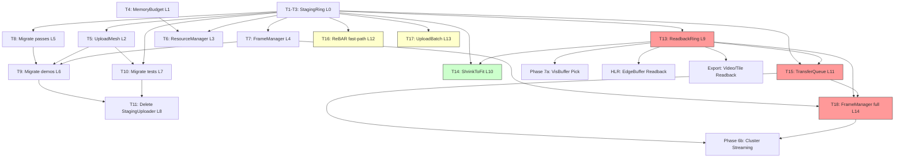

# Transfer Layer Rewrite — Bidirectional CPU/GPU Data Exchange

> **Scope**: Complete rewrite of all CPU-GPU data transfer infrastructure: upload (StagingRing), download (ReadbackRing), async DMA (TransferQueue), ReBAR fast-path, batch upload, and chunk lifecycle management. No backward compatibility.
> **Supersedes**: `miki::rhi::StagingUploader` (deleted after migration).
> **Benchmark**: Filament VulkanStagePool, Diligent DynamicHeap, wgpu StagingBelt, The Forge ResourceLoader, UE5 FUploadAllocation, Nanite streaming pipeline, bgfx TransientBuffer.

---

## 1. Problem Statement

| # | Problem | Impact |
|---|---------|--------|
| 1 | `Upload(span)` forces intermediate vector + double memcpy | 2x CPU copies on every mesh upload |
| 2 | Single fixed-size ring buffer, no auto-grow | OOM on large uploads |
| 3 | No texture upload | Texture init requires ad-hoc staging |
| 4 | No per-frame fence isolation | Manual Reset/Flush/WaitIdle boilerplate |
| 5 | No integration with ResourceManager or MemoryBudget | Staging VRAM untracked |
| 6 | No GPU-to-CPU readback path | Ad-hoc MapBuffer for every readback (pick, probe, HLR edge, video export, auto-exposure, OIT pool resize, residency counters) |
| 7 | No async DMA on dedicated transfer queue | All copies block graphics queue; cluster streaming (6b) requires concurrent DMA at 2-12 GB/s |
| 8 | No ReBAR detection or fast-path | Per-frame small uniforms (CameraUBO 368B, dirty GpuInstance <128KB) always go through staging + CopyBuffer |
| 9 | No batch upload API | Loading 1000-part STEP file requires 2000 individual Allocate+Enqueue calls; no copy merging |
| 10 | No chunk pool shrink/defrag | Long-running CAD app: chunk pool grows to maxChunks and never releases, even at low utilization |

---

## 2. Design Decisions

| Decision | Choice | Rationale |
|----------|--------|-----------|
| Chunk size | 4 MB default | VMA best practice; covers most mesh uploads |
| Oversized alloc | Dedicated chunk max(chunkSize, AlignUp(size)) | Simpler than The Forge multi-batch flush |
| Frame isolation | Per-frame pending lists (not single ring head/tail) | Cleaner for multi-chunk; no wraparound complexity |
| Fence model | FlushFrame(fenceValue) tags active chunks; ReclaimCompleted() frees them | Same as wgpu StagingBelt recall pattern |
| WebGPU compat | Per-chunk mappedAtCreation; unmap on RecordTransfers; recreate on reclaim | No global destroy+recreate hack |
| Alignment | 256B default (covers all backend requirements) | Matches Vulkan/D3D12/WebGPU alignment |
| Max staging VRAM | Configurable cap; default 256 MB (64 chunks x 4 MB) | Prevents runaway allocation |
| Eviction model | Pluggable IEvictionPolicy; default LRU with category priority weights | Better than current uniform-split |
| Budget tracking | Auto Track on Create, auto Release on deferred destroy | Zero manual budget management |
| Readback chunk size | 2 MB default (smaller than upload — readback data is typically small) | Pick: 8B, probe: 256B, auto-exposure: 4B; video export 24MB/frame uses dedicated oversized chunks |
| Readback model | ReadbackTicket with deferred poll (2-3 frame latency) | GPU readback has inherent fence latency; API must expose, not hide this |
| TransferQueue fallback | Transparent — if no dedicated queue, submits on graphics queue | Caller code never branches on queue availability |
| TransferQueue sync | Timeline semaphore; graphics queue waits before using uploaded data | Vulkan 1.4 core, D3D12 ID3D12Fence; no binary semaphore needed |
| Queue ownership transfer | Encapsulated release+acquire barrier pair inside TransferQueue | Vulkan requires explicit QFOT; D3D12 implicit — abstracted away |
| ReBAR detection | Probe `DEVICE_LOCAL\|HOST_VISIBLE` at Create(); use for chunks <=64KB | Transparent to caller; EnqueueBufferCopy becomes no-op for ReBAR allocs |
| ReBAR scope | Small+frequent only (uniforms, dirty patches); bulk upload stays DMA | ReBAR bandwidth is PCIe MMIO (~14 GB/s write, but high latency per-access) |
| Batch upload | UploadBatch collects N allocs, caller writes in parallel, single Commit | Enables multi-threaded asset loading; copy merging reduces cmd record overhead |
| Chunk shrink | ShrinkToFit(targetBytes) destroys excess free chunks | Integrates with MemoryBudget eviction callback on Staging/Readback categories |

---

## 3. Dependency Order

```
L0:  StagingRing rewrite (no deps on other changes)
L1:  MemoryBudget enhance (no deps)
L2:  UploadMesh rewrite (depends on L0)
L3:  ResourceManager enhance (depends on L0, L1)
L4:  FrameManager integrate (depends on L0)
L5:  Migrate render passes: ForwardPass, GBufferPass, KullaContyLut (depends on L0)
L6:  Migrate all 11 demos (depends on L0, L2, L4, L5)
L7:  Migrate all tests (depends on L0, L2)
L8:  Delete StagingUploader (depends on L5, L6, L7)
L9:  ReadbackRing core (depends on L0 for shared chunk/fence patterns)
L10: StagingRing + ReadbackRing ShrinkToFit (depends on L0, L9)
L11: TransferQueue — async DMA + timeline semaphore (depends on L0, L9)
L12: StagingRing ReBAR transparent fast-path (depends on L0)
L13: UploadBatch — batch alloc + copy merging (depends on L0)
L14: FrameManager full integration — ReadbackRing + TransferQueue (depends on L4, L9, L11)
```

**Dependency graph (mermaid)**:



---

## 4. Task List

| ID | Level | Task | Files |
|----|-------|------|-------|
| T1 | L0 | Rewrite StagingRing.h — multi-chunk, pending copies, RecordTransfers, texture, auto-grow | include/miki/resource/StagingRing.h |
| T2 | L0 | Rewrite StagingRing.cpp — full implementation | src/miki/resource/StagingRing.cpp |
| T3 | L0 | Rewrite test_staging_ring.cpp | tests/unit/test_staging_ring.cpp |
| T4 | L1 | Enhance MemoryBudget — IEvictionPolicy, per-resource LRU, VMA query, category weights | include/miki/resource/MemoryBudget.h, src/miki/resource/MemoryBudget.cpp |
| T5 | L2 | Rewrite UploadMesh to use StagingRing.Allocate (zero-copy interleave) | include/miki/gfx/MeshData.h, src/miki/gfx/MeshData.cpp |
| T6 | L3 | Enhance ResourceManager — StagingRing + Budget integration, CreateWithData, size tracking | include/miki/resource/ResourceManager.h, src/miki/resource/ResourceManager.cpp |
| T7 | L4 | Integrate StagingRing into FrameManager — auto RecordTransfers + AdvanceFrame | include/miki/rhi/FrameManager.h, src/miki/rhi/FrameManager.cpp |
| T8 | L5 | Migrate ForwardPass, GBufferPass, KullaContyLut from StagingUploader | src/miki/render/ForwardPass.cpp, GBufferPass.cpp, etc. |
| T9 | L6 | Migrate all 11 demos — eliminate FlushInitialUploads | demos/*/main.cpp |
| T10 | L7 | Migrate tests — test_frame_staging, test_mesh_data, integration tests | tests/ |
| T11 | L8 | Delete StagingUploader.h/.cpp, remove from rhi CMakeLists | include/miki/rhi/StagingUploader.h, src/miki/rhi/StagingUploader.cpp |
| T12 | L8 | *(renumbered — was L9, now absorbed into T15)* | — |
| T13 | L9 | ReadbackRing — multi-chunk GpuToCpu pool, ReadbackTicket, RecordTransfers, FlushFrame, ReclaimCompleted, poll API | include/miki/resource/ReadbackRing.h, src/miki/resource/ReadbackRing.cpp, tests/unit/test_readback_ring.cpp |
| T14 | L10 | ShrinkToFit for StagingRing + ReadbackRing — destroy excess free chunks, GetUtilization, MemoryBudget eviction callback integration | StagingRing.h/.cpp, ReadbackRing.h/.cpp |
| T15 | L11 | TransferQueue — dedicated async DMA queue + timeline semaphore sync + transparent fallback to graphics queue + queue ownership transfer barriers (QFOT) | include/miki/resource/TransferQueue.h, src/miki/resource/TransferQueue.cpp, tests/unit/test_transfer_queue.cpp |
| T16 | L12 | StagingRing ReBAR fast-path — detect DEVICE_LOCAL\|HOST_VISIBLE at Create(), allocate small chunks (<=64KB) as ReBAR, EnqueueBufferCopy no-op for ReBAR allocs | StagingRing.h/.cpp (modify), tests/unit/test_staging_ring.cpp (add ReBAR tests) |
| T17 | L13 | UploadBatch — batch Allocate + parallel write + Commit with copy merging + optional TransferQueue target | include/miki/resource/UploadBatch.h, src/miki/resource/UploadBatch.cpp, tests/unit/test_upload_batch.cpp |
| T18 | L14 | FrameManager full integration — SetReadbackRing + SetTransferQueue, BeginFrame reclaims both rings, EndFrame routes copies through TransferQueue when available | include/miki/rhi/FrameManager.h, src/miki/rhi/FrameManager.cpp, tests/unit/test_frame_staging.cpp |

---

## 5. StagingRing API

```cpp
namespace miki::resource {

inline constexpr uint64_t kStagingAlignment = 256;

struct StagingRingDesc {
    uint64_t chunkSize = uint64_t{4} << 20;  // 4 MB
    uint32_t maxChunks = 64;                  // 256 MB max
};

struct StagingAllocation {
    std::byte* mappedPtr    = nullptr;
    uint64_t   size         = 0;
    uint32_t   chunkIndex_  = ~0u;     // internal
    uint64_t   chunkOffset_ = 0;       // internal

    [[nodiscard]] constexpr auto IsValid() const noexcept -> bool;
};

struct TextureUploadRegion {
    uint32_t mipLevel   = 0;
    uint32_t arrayLayer = 0;
    uint32_t offsetX = 0, offsetY = 0, offsetZ = 0;
    uint32_t width = 0, height = 0, depth = 1;
    uint32_t rowLength   = 0;  // texels; 0 = tightly packed
    uint32_t imageHeight = 0;  // rows;   0 = tightly packed
};

class StagingRing {
public:
    ~StagingRing();
    StagingRing(StagingRing&&) noexcept;
    auto operator=(StagingRing&&) noexcept -> StagingRing&;

    [[nodiscard]] static auto Create(rhi::IDevice&, StagingRingDesc = {})
        -> core::Result<StagingRing>;

    // --- Write-in-place (zero intermediate copy) ---
    [[nodiscard]] auto Allocate(uint64_t iSize, uint64_t iAlignment = kStagingAlignment)
        -> core::Result<StagingAllocation>;

    auto EnqueueBufferCopy(StagingAllocation const& iAlloc,
                           rhi::BufferHandle iDst, uint64_t iDstOffset) -> void;

    auto EnqueueTextureCopy(StagingAllocation const& iAlloc,
                            rhi::TextureHandle iDst,
                            TextureUploadRegion const& iRegion) -> void;

    // --- Convenience (alloc + memcpy + enqueue) ---
    [[nodiscard]] auto UploadBuffer(std::span<const std::byte> iData,
                                    rhi::BufferHandle iDst, uint64_t iDstOffset)
        -> core::Result<void>;

    [[nodiscard]] auto UploadTexture(std::span<const std::byte> iData,
                                     rhi::TextureHandle iDst,
                                     TextureUploadRegion const& iRegion)
        -> core::Result<void>;

    // --- Frame lifecycle ---
    auto RecordTransfers(rhi::ICommandBuffer& iCmd) -> void;
    auto FlushFrame(uint64_t iFenceValue) -> void;
    auto ReclaimCompleted(uint64_t iCompletedFenceValue) -> void;

    // --- Metrics ---
    [[nodiscard]] auto GetBytesUploadedThisFrame() const noexcept -> uint64_t;
    [[nodiscard]] auto GetActiveChunkCount() const noexcept -> uint32_t;
    [[nodiscard]] auto GetFreeChunkCount() const noexcept -> uint32_t;
    [[nodiscard]] auto GetTotalAllocatedBytes() const noexcept -> uint64_t;
};
```

---

## 6. UploadMesh Rewrite

Before (3 CPU copies):
```
MakeSphere -> SOA vectors
  Copy 1: interleave into vector<byte>
  Copy 2: memcpy into staging ring
  Copy 3: GPU CopyBuffer (DMA)
```

After (1 write + 1 DMA):
```
MakeSphere -> SOA vectors
  ring.Allocate(vertexDataSize)
  Write interleaved data directly into mappedPtr  <-- single CPU write
  ring.EnqueueBufferCopy(alloc, vb, 0)
  GPU CopyBuffer (DMA)
```

New signature:
```cpp
[[nodiscard]] auto UploadMesh(resource::StagingRing& iRing,
                              rhi::IDevice& iDevice,
                              MeshData const& iMesh)
    -> core::Result<MeshBuffers>;
```

---

## 7. ReadbackRing API (T13)

```cpp
namespace miki::resource {

struct ReadbackRingDesc {
    uint64_t chunkSize = uint64_t{2} << 20;  // 2 MB (smaller than upload — most readbacks are tiny)
    uint32_t maxChunks = 32;                  // 64 MB max
};

/** @brief Opaque ticket for a pending GPU-to-CPU readback.
 *  Caller polls IsReady() or waits for fence, then calls GetData().
 *  Ticket is invalidated after the chunk is reclaimed.
 */
struct ReadbackTicket {
    uint32_t chunkIndex_  = ~0u;
    uint64_t chunkOffset_ = 0;
    uint64_t size         = 0;
    uint64_t fenceValue   = 0;

    [[nodiscard]] constexpr auto IsValid() const noexcept -> bool {
        return chunkIndex_ != ~0u;
    }
};

/** @brief Region descriptor for texture readback. */
struct TextureReadbackRegion {
    uint32_t mipLevel   = 0;
    uint32_t arrayLayer = 0;
    uint32_t offsetX = 0, offsetY = 0, offsetZ = 0;
    uint32_t width = 0, height = 0, depth = 1;
};

class ReadbackRing {
public:
    ~ReadbackRing();
    ReadbackRing(ReadbackRing&&) noexcept;
    auto operator=(ReadbackRing&&) noexcept -> ReadbackRing&;

    [[nodiscard]] static auto Create(rhi::IDevice&, ReadbackRingDesc = {})
        -> core::Result<ReadbackRing>;

    // --- Enqueue GPU-to-CPU copies ---

    /** @brief Enqueue a buffer readback. Returns a ticket to poll later. */
    [[nodiscard]] auto EnqueueBufferReadback(rhi::BufferHandle iSrc,
                                              uint64_t iSrcOffset,
                                              uint64_t iSize)
        -> core::Result<ReadbackTicket>;

    /** @brief Enqueue a texture readback (single mip/layer region). */
    [[nodiscard]] auto EnqueueTextureReadback(rhi::TextureHandle iSrc,
                                               TextureReadbackRegion const& iRegion,
                                               uint64_t iRowPitch)
        -> core::Result<ReadbackTicket>;

    // --- Frame lifecycle (mirrors StagingRing) ---

    /** @brief Record CopyBuffer / CopyTextureToBuffer into cmd. */
    auto RecordTransfers(rhi::ICommandBuffer& iCmd) -> void;

    /** @brief Tag active chunks with fence value. */
    auto FlushFrame(uint64_t iFenceValue) -> void;

    /** @brief Reclaim chunks whose fence has been signaled. */
    auto ReclaimCompleted(uint64_t iCompletedFenceValue) -> void;

    // --- Data access ---

    /** @brief Check if a ticket's data is available (fence completed). */
    [[nodiscard]] auto IsReady(ReadbackTicket const& iTicket) const noexcept -> bool;

    /** @brief Get CPU-visible data for a completed readback.
     *  Returns empty span if not ready or ticket invalidated.
     */
    [[nodiscard]] auto GetData(ReadbackTicket const& iTicket) const
        -> std::span<const std::byte>;

    // --- Memory management ---

    /** @brief Shrink chunk pool to target total bytes. Returns bytes freed. */
    auto ShrinkToFit(uint64_t iTargetTotalBytes) -> uint64_t;

    /** @brief Current utilization (0.0 = all free, 1.0 = all in flight). */
    [[nodiscard]] auto GetUtilization() const noexcept -> float;

    // --- Metrics ---
    [[nodiscard]] auto GetBytesReadbackThisFrame() const noexcept -> uint64_t;
    [[nodiscard]] auto GetActiveChunkCount() const noexcept -> uint32_t;
    [[nodiscard]] auto GetFreeChunkCount() const noexcept -> uint32_t;
    [[nodiscard]] auto GetTotalAllocatedBytes() const noexcept -> uint64_t;
};
```

**Key design notes**:
- Chunk pool uses `MemoryType::GpuToCpu` (Vulkan: `HOST_VISIBLE | HOST_CACHED`, D3D12: `D3D12_HEAP_TYPE_READBACK`)
- `ReadbackTicket` is stable for 2-3 frames (until the chunk is reclaimed). Caller must consume before reclaim.
- Video export pattern: triple-buffer — frame N enqueues readback, frame N-1 encodes from GetData(), frame N-2's chunk is reclaimed.
- `EnqueueTextureReadback` handles row pitch alignment internally (Vulkan: `VkBufferImageCopy`, D3D12: `D3D12_PLACED_SUBRESOURCE_FOOTPRINT`).

---

## 8. TransferQueue API (T15)

```cpp
namespace miki::resource {

/** @brief Async DMA queue with transparent fallback.
 *
 *  If the device has a dedicated transfer queue (IDevice::HasDedicatedTransferQueue()),
 *  copies run concurrently with rendering. Otherwise, copies are submitted on the
 *  graphics queue (still correct, no concurrency benefit).
 *
 *  Synchronization: internal timeline semaphore. Graphics queue must wait on
 *  GetTimelineSemaphore() at value GetLastSignaledValue() before using uploaded data.
 */
class TransferQueue {
public:
    ~TransferQueue();
    TransferQueue(TransferQueue&&) noexcept;
    auto operator=(TransferQueue&&) noexcept -> TransferQueue&;

    [[nodiscard]] static auto Create(rhi::IDevice&)
        -> core::Result<TransferQueue>;

    // --- Submit copies on the transfer queue ---

    /** @brief Submit a StagingRing's pending copies on the transfer queue.
     *  Replaces StagingRing::RecordTransfers() for the async path.
     *  @return Timeline semaphore value signaled after all copies complete.
     */
    [[nodiscard]] auto SubmitStagingRing(StagingRing& iRing) -> core::Result<uint64_t>;

    /** @brief Submit a ReadbackRing's pending copies on the transfer queue. */
    [[nodiscard]] auto SubmitReadbackRing(ReadbackRing& iRing) -> core::Result<uint64_t>;

    /** @brief Submit raw buffer copy requests. */
    [[nodiscard]] auto SubmitBufferCopies(std::span<const BufferCopyRequest> iCopies)
        -> core::Result<uint64_t>;

    /** @brief Submit raw texture copy requests. */
    [[nodiscard]] auto SubmitTextureCopies(std::span<const TextureCopyRequest> iCopies)
        -> core::Result<uint64_t>;

    // --- Synchronization ---

    /** @brief Timeline semaphore that graphics queue waits on. */
    [[nodiscard]] auto GetTimelineSemaphore() const noexcept -> rhi::SemaphoreHandle;

    /** @brief Last value signaled by a SubmitXxx call. */
    [[nodiscard]] auto GetLastSignaledValue() const noexcept -> uint64_t;

    /** @brief CPU-side poll: check if a specific submit has completed. */
    [[nodiscard]] auto IsCompleted(uint64_t iValue) const -> bool;

    // --- Queue ownership transfer (Vulkan QFOT) ---

    /** @brief Emit release barriers on the transfer command buffer.
     *  Call before Submit on the transfer queue.
     *  On D3D12/GL/WebGPU: no-op (no explicit QFOT needed).
     */
    auto EmitReleaseBarriers(rhi::ICommandBuffer& iTransferCmd,
                              std::span<const rhi::BufferBarrier> iBuffers,
                              std::span<const rhi::TextureBarrier> iTextures) -> void;

    /** @brief Emit acquire barriers on the graphics command buffer.
     *  Call after the graphics queue waits on the timeline semaphore.
     */
    auto EmitAcquireBarriers(rhi::ICommandBuffer& iGraphicsCmd,
                              std::span<const rhi::BufferBarrier> iBuffers,
                              std::span<const rhi::TextureBarrier> iTextures) -> void;

    // --- Info ---

    /** @brief True if running on a dedicated transfer queue (actual async DMA). */
    [[nodiscard]] auto IsAsync() const noexcept -> bool;

    /** @brief Metrics: total bytes transferred since creation. */
    [[nodiscard]] auto GetTotalBytesTransferred() const noexcept -> uint64_t;
};

/** @brief Request for a single buffer copy operation. */
struct BufferCopyRequest {
    rhi::BufferHandle src;
    uint64_t          srcOffset = 0;
    rhi::BufferHandle dst;
    uint64_t          dstOffset = 0;
    uint64_t          size      = 0;
};

/** @brief Request for a single texture copy operation. */
struct TextureCopyRequest {
    rhi::BufferHandle  srcBuffer;
    uint64_t           srcOffset = 0;
    rhi::TextureHandle dst;
    TextureUploadRegion region;
};
```

**Key design notes**:
- Internally owns one `ICommandBuffer` (QueueType::Transfer) and one timeline semaphore.
- Each `SubmitXxx()` call: `Begin()` → record copies → `End()` → `Submit2({.queue=Transfer, .timelineSignals=[{sem, ++value}]})`.
- Graphics queue submission adds `.timelineWaits=[{sem, lastValue, StageMask::Transfer}]` via `SubmitInfo2`.
- If `!HasDedicatedTransferQueue()`: uses QueueType::Graphics internally. QFOT barriers become regular pipeline barriers. IsAsync() returns false.
- Future cluster streaming `ChunkLoader` calls `SubmitBufferCopies()` directly, bypassing StagingRing for NVMe→VRAM paths.

---

## 9. StagingRing Enhancements (T14, T16)

```cpp
class StagingRing {
    // ... existing API unchanged ...

    // --- NEW: ShrinkToFit (T14) ---

    /** @brief Destroy excess free chunks to reduce total pool below target.
     *  Only destroys chunks in the free pool (not active or in-flight).
     *  @return Bytes actually freed.
     */
    auto ShrinkToFit(uint64_t iTargetTotalBytes) -> uint64_t;

    /** @brief Pool utilization ratio (0.0 = all free, 1.0 = all active/in-flight). */
    [[nodiscard]] auto GetUtilization() const noexcept -> float;

    // --- NEW: ReBAR transparent path (T16) ---
    // No API change. Behavioral change at Create() time:
    //
    // 1. Create() probes IDevice for DEVICE_LOCAL|HOST_VISIBLE memory with BAR > 256MB.
    // 2. If available, small chunks (<=64KB) are allocated as ReBAR (zero-copy GPU read).
    // 3. EnqueueBufferCopy() for ReBAR allocs becomes a no-op (data already in VRAM).
    // 4. RecordTransfers() skips ReBAR copies (no CopyBuffer command recorded).
    // 5. Bulk allocs (>64KB) always use standard CpuToGpu + CopyBuffer path.
    //
    // StagingAllocation gains an internal flag:
    //   bool isReBAR_ = false;
    //
    // Detection: StagingRingDesc gains:
    //   bool preferReBAR = true;   // default on; set false to force CpuToGpu
    //   uint64_t rebarThreshold = 64 * 1024;  // allocs <= this use ReBAR
};
```

---

## 10. UploadBatch API (T17)

```cpp
namespace miki::resource {

/** @brief Batch multiple upload allocations for parallel write + single commit.
 *
 *  Usage pattern:
 *    UploadBatch batch(ring);
 *    auto* p1 = batch.AddBuffer(buf1, 0, size1).value();
 *    auto* p2 = batch.AddBuffer(buf2, 0, size2).value();
 *    // parallel memcpy into p1, p2 from worker threads
 *    batch.Commit(cmd);  // records all copies, merges adjacent
 */
class UploadBatch {
public:
    explicit UploadBatch(StagingRing& iRing);

    /** @brief Allocate staging space for a buffer upload.
     *  @return Mapped pointer for direct write. Caller may write from any thread.
     */
    [[nodiscard]] auto AddBuffer(rhi::BufferHandle iDst,
                                  uint64_t iDstOffset,
                                  uint64_t iSize)
        -> core::Result<std::byte*>;

    /** @brief Allocate staging space for a texture upload. */
    [[nodiscard]] auto AddTexture(rhi::TextureHandle iDst,
                                   TextureUploadRegion const& iRegion,
                                   uint64_t iSize)
        -> core::Result<std::byte*>;

    /** @brief Record all copies into the command buffer.
     *  Merges adjacent buffer copies targeting the same dst buffer.
     *  After Commit, the batch is consumed (cannot be reused).
     */
    auto Commit(rhi::ICommandBuffer& iCmd) -> void;

    /** @brief Alternative: commit via TransferQueue for async DMA. */
    [[nodiscard]] auto CommitAsync(TransferQueue& iQueue) -> core::Result<uint64_t>;

    // --- Metrics ---
    [[nodiscard]] auto GetTotalBytes() const noexcept -> uint64_t;
    [[nodiscard]] auto GetCopyCount() const noexcept -> uint32_t;
    [[nodiscard]] auto GetMergedCopyCount() const noexcept -> uint32_t;
};
```

**Copy merging algorithm**: sort pending copies by `{dstBuffer, dstOffset}`. Adjacent copies where `copy[i].dstOffset + copy[i].size == copy[i+1].dstOffset` and both are in the same staging chunk with contiguous `chunkOffset` → merge into one `CopyBuffer` call.

---

## 11. FrameManager Full Integration (T18)

```cpp
class FrameManager {
    // EXISTING (T7):
    auto SetStagingRing(resource::StagingRing* iRing) -> void;

    // NEW (T18):
    auto SetReadbackRing(resource::ReadbackRing* iRing) noexcept -> void;
    auto SetTransferQueue(resource::TransferQueue* iQueue) noexcept -> void;

    // BeginFrame behavior:
    //   1. StagingRing->ReclaimCompleted(lastCompletedFence)   [existing]
    //   2. ReadbackRing->ReclaimCompleted(lastCompletedFence)  [NEW]
    //
    // EndFrame behavior:
    //   If TransferQueue is set:
    //     1. TransferQueue->SubmitStagingRing(ring)   → returns timelineValue
    //     2. TransferQueue->SubmitReadbackRing(ring)   → returns timelineValue
    //     3. Graphics Submit waits on TransferQueue timeline semaphore
    //     4. StagingRing->FlushFrame(frameNumber)
    //     5. ReadbackRing->FlushFrame(frameNumber)
    //   Else (fallback, current behavior):
    //     1. StagingRing->RecordTransfers(graphicsCmd)
    //     2. ReadbackRing->RecordTransfers(graphicsCmd)
    //     3. Graphics Submit
    //     4. FlushFrame for both rings
};
```

---

## 12. Performance Targets

| Metric | Current | After |
|--------|---------|-------|
| Init mesh upload CPU copies | 3 | 1 write + 1 DMA |
| Per-frame UBO upload copies | 2 | 1 write + 1 DMA (or 0 copy via ReBAR) |
| Texture upload | Not supported | Supported |
| Staging capacity | Fixed ring, OOM | Auto-grow multi-chunk + ShrinkToFit |
| GPU stall (WaitIdle) | FlushInitialUploads per demo | Zero (fence retire) |
| Budget tracking | Manual | Automatic (create/destroy) |
| Boilerplate (FlushInitialUploads) | ~15 lines/demo x 11 | 0 lines |
| GPU-to-CPU readback | Ad-hoc MapBuffer per site | Unified ReadbackRing + ticket poll |
| Readback latency | Unbounded (WaitIdle) | 2-3 frames (fence-based, non-blocking) |
| Video export readback throughput | N/A | ~1.4 GB/s (triple-buffer 1080p@60fps) |
| Async DMA concurrency | None (graphics queue only) | Dedicated transfer queue overlaps with rendering |
| Cluster streaming throughput | N/A | 2-12 GB/s (transfer queue + GDeflate) |
| Per-frame uniform upload (ReBAR) | Staging + CopyBuffer (~0.1ms) | Direct VRAM write (~0.01ms) |
| Batch upload (1000 meshes) | 2000 individual Allocate+Enqueue | Single UploadBatch with copy merging |
| Long-running VRAM waste | Chunk pool grows monotonically | ShrinkToFit reclaims to utilization target |
| Queue ownership transfer | Manual barriers per call site | Encapsulated in TransferQueue |

---

## 13. Readback Scenario Matrix

| Scenario | Direction | Frequency | Data Size | Ring | Queue | Latency |
|----------|-----------|-----------|-----------|------|-------|---------|
| VisBuffer pick | GPU→CPU | On click | 4-8 B | ReadbackRing | Graphics | 2 frames |
| Auto-exposure histogram | GPU→CPU | Per frame | 4 B | ReadbackRing | Graphics | 2 frames |
| OIT pool peak usage | GPU→CPU | Per frame | 4 B | ReadbackRing | Graphics | 2 frames |
| ResidencyFeedback counters | GPU→CPU | Per frame | <4 KB | ReadbackRing | Transfer | 2 frames |
| Probe query (CAE) | GPU→CPU | On demand | <256 B | ReadbackRing | Graphics | 2 frames |
| HLR EdgeBuffer | GPU→CPU | On demand | 1-50 MB | ReadbackRing | Transfer | 3 frames |
| Tile-based hi-res export | GPU→CPU | Per tile | 64 MB | ReadbackRing (oversized) | Transfer | 3 frames |
| Video export | GPU→CPU | 60 fps | 24 MB/frame | ReadbackRing (triple-buf) | Transfer | 3 frames |
| VSM dirty page query | GPU→CPU | Per frame | <1 KB | ReadbackRing | Graphics | 2 frames |
| Cluster streaming | Disk→GPU | Continuous | 2-12 GB/s | StagingRing | Transfer | 0 (async) |
| Mesh/texture init load | CPU→GPU | Once | 1 MB-1 GB | StagingRing (UploadBatch) | Transfer | 1 frame |
| Per-frame uniforms | CPU→GPU | Per frame | <1 KB | StagingRing (ReBAR) | Graphics | 0 (direct) |
| Dirty GpuInstance patch | CPU→GPU | Per frame | <128 KB | StagingRing (ReBAR) | Graphics | 0 (direct) |
