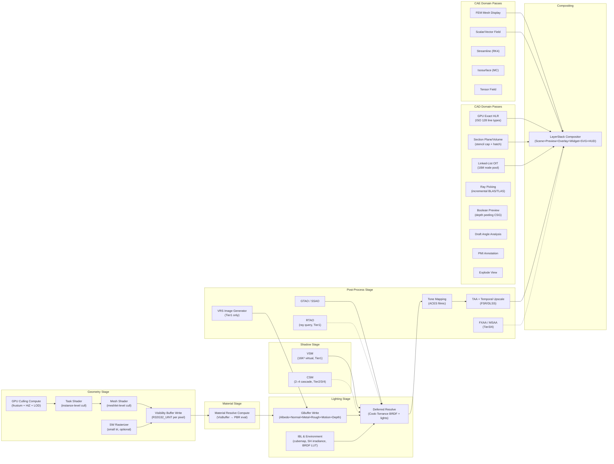
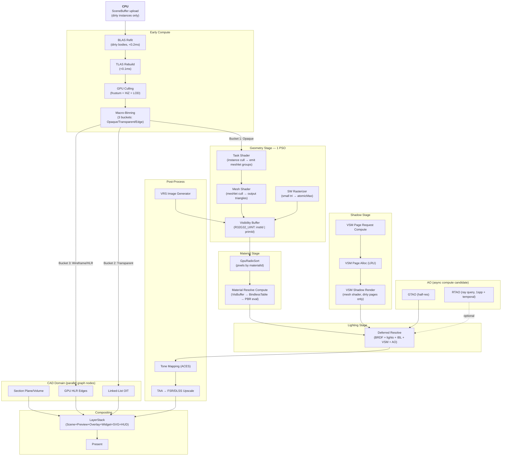
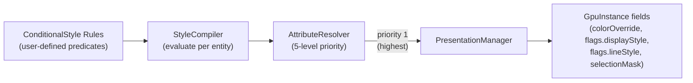
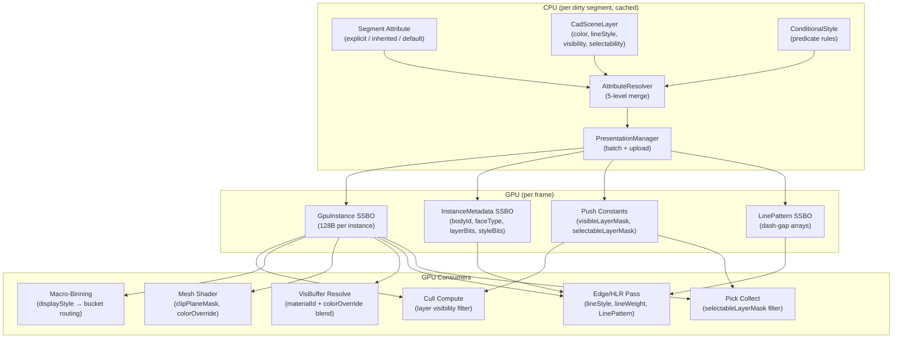
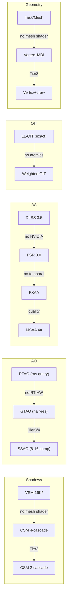
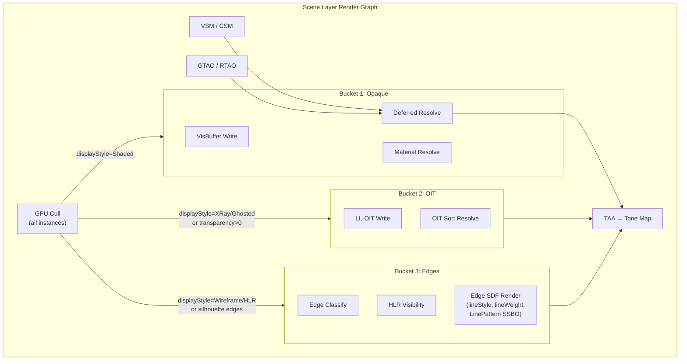

# miki Rendering Pipeline Architecture

> **Audience**: Engine team (30 engineers). Architecture reference — not a tutorial.
> **Scope**: Complete GPU rendering pipeline design across all 5 backends and 4 capability tiers.
> **Status**: Design blueprint. Implementation phases noted where relevant.

---

## 1. Overview

miki is a GPU-native CAD/CAE rendering engine. The rendering pipeline achieves **zero CPU draw calls** in steady state via a fully GPU-driven architecture:

- **Visibility Buffer** decouples geometry from materials — 1 PSO for all opaque geometry
- **Task/Mesh shaders** perform hierarchical culling (instance → meshlet → triangle)
- **RenderGraph** orchestrates all passes as a DAG with automatic barrier insertion and transient resource aliasing
- **3-bucket macro-binning** classifies all visible geometry into exactly 3 render paths per frame
- **Bindless + BDA** eliminates per-draw descriptor updates

The pipeline serves two render paths simultaneously:

| Path | Factory | Backends | Geometry | Shadows | AO | AA | OIT |
|------|---------|----------|----------|---------|----|----|-----|
| **Main** | `MainPipelineFactory` | Vulkan (Tier1), D3D12 (Tier1) | Task/Mesh | VSM 16K² | GTAO / RTAO | TAA + FSR/DLSS | Linked-List |
| **Compat** | `CompatPipelineFactory` | Compat (Tier2), WebGPU (Tier3), OpenGL (Tier4) | Vertex + MDI / draw | CSM 2–4 cascade | SSAO | FXAA / MSAA | Weighted |

Selection is at startup via `GpuCapabilityProfile` feature detection. **No `if (compat)` branches** in rendering code — `IPipelineFactory` virtualizes all pass creation.

---

## 2. Pass Taxonomy

All rendering work is expressed as **RenderGraph passes**. Each pass declares its resource reads/writes; the graph compiler inserts barriers, manages lifetimes, and schedules execution.

### 2.1 Pass Categories



### 2.2 Complete Pass Reference

| Pass | Type | Tier | Input | Output | Budget |
|------|------|------|-------|--------|--------|
| **DepthPrePass + HiZ** | Graphics | All | SceneBuffer | D32F + HiZ pyramid | <0.5ms |
| **GPU Culling** | Compute | All | HiZ, SceneBuffer, BVH | Visible instance/meshlet list | <0.3ms |
| **Task Shader** | Graphics (Amplification) | Tier1 | Visible list | Meshlet workgroups | — |
| **Mesh Shader** | Graphics (Mesh) | Tier1 | Meshlet descriptors (BDA) | Triangles | — |
| **Vertex+MDI** | Graphics (Vertex) | Tier2/3/4 | Vertex/Index buffers | Triangles | — |
| **VisBuffer Write** | Graphics | Tier1 | Triangles | R32G32_UINT (instId+primId) | <1ms |
| **SW Rasterizer** | Compute | Tier1 (optional) | Small triangles (<4px²) | atomicMax → VisBuffer | <0.3ms |
| **Material Resolve** | Compute | All | VisBuffer, BindlessTable | GBuffer targets | <1ms |
| **GBuffer** | Graphics (Compat path) | Tier2/3/4 | Triangles, materials | Albedo+Normal+Metal+Rough+Motion+Depth | <2ms |
| **VSM Render** | Graphics (Mesh) | Tier1 | Shadow casters | 16K² virtual pages | <2ms |
| **CSM Render** | Graphics (Vertex) | Tier2/3/4 | Shadow casters | 2–4 cascade maps | <2ms |
| **Deferred Resolve** | Compute / Fragment | All | GBuffer, shadow maps, AO | HDR color | <1ms |
| **IBL** | Compute (one-time) | All | HDRI | Cubemap + SH + BRDF LUT | one-time |
| **GTAO** | Compute | Tier1/2 | Depth (half-res) | AO buffer | <1ms |
| **SSAO** | Fragment | Tier3/4 | Depth | AO buffer | <1ms |
| **RTAO** | Compute (ray query) | Tier1 | BLAS/TLAS, depth | AO buffer | <2ms |
| **VRS Image** | Compute | Tier1 | Luminance gradient | VRS rate image (per-16×16) | <0.2ms |
| **TAA** | Compute | Tier1/2 | Color, motion, history | Anti-aliased color | <0.5ms |
| **Temporal Upscale** | Compute | Tier1/2 | 67% res input | Full-res output | <1ms |
| **FXAA** | Fragment | Tier3/4 | Color | Anti-aliased color | <0.5ms |
| **Tone Mapping** | Fragment | All | HDR color | LDR output | <0.2ms |
| **GPU HLR** | Compute + Graphics | All | Normals, adjacency, HiZ | Edge buffer (SDF AA) | <4ms @10M edges |
| **Section Plane/Volume** | Fragment (stencil) | All | Scene depth | Clip + cap + hatch | <0.5ms |
| **Linked-List OIT** | Fragment + Compute | Tier1/2 | Transparent geometry | Sorted color | <2ms @8 layers |
| **Weighted OIT** | Fragment | Tier3/4 | Transparent geometry | Blended color | <1ms |
| **Ray Pick** | Compute (ray query) | Tier1 | BLAS/TLAS | Hit buffer | <0.5ms |
| **Boolean Preview** | Compute | Tier1 | Depth layers (N=8) | CSG composite | <16ms |
| **Draft Angle** | Compute | All | Normals, pull direction | Per-face angle map | <1ms @1M tri |
| **PMI Render** | Graphics (instanced) | All | MSDF atlas, annotations | Text + leaders | <0.1ms @1K glyphs |
| **Explode** | Compute | All | Assembly hierarchy | Animated transforms | <0.1ms |
| **GPU Measurement** | Compute | All | BDA (float64/DS) | Distance/angle/mass | <2ms |
| **FEM Display** | Graphics | All | Element mesh, scalars | Colored elements | <1ms |
| **Streamline** | Compute + Graphics | All | Vector field | Tube geometry | <2ms |
| **Isosurface** | Compute | All | Scalar field | Marching Cubes mesh | <5ms |
| **Layer Composite** | Fragment | All | 6 layer targets | Final framebuffer | <0.2ms |

---

## 3. Full-Frame Data Flow

### 3.1 Tier1 Main Pipeline (Vulkan / D3D12)



**Single-frame timeline (Tier1)**:

```
Frame N:
┌─────────────────────────────────────────────────────────────────────────┐
│ Graphics Queue                                                          │
│ ┌──────┐ ┌───────┐ ┌─────────────────┐ ┌──────────┐ ┌────┐ ┌────────┐│
│ │BLAS/ │ │GPU    │ │Task→Mesh→VisBuffer│ │VSM Shadow│ │Def.│ │TAA→FSR ││
│ │TLAS  │ │Cull   │ │(1 PSO, 1 draw)   │ │(dirty pg)│ │Res.│ │→Tone   ││
│ └──────┘ └───────┘ └─────────────────┘ └──────────┘ └────┘ └────────┘│
│                                                                         │
│ Async Compute Queue (optional)                                          │
│ ┌──────────┐ ┌──────────────┐                                          │
│ │GTAO      │ │Material Sort │                                          │
│ │(half-res)│ │+ Resolve     │                                          │
│ └──────────┘ └──────────────┘                                          │
│                                                                         │
│ Transfer Queue (Vulkan 1.4 streaming)                                   │
│ ┌─────────────────────────┐                                             │
│ │Cluster stream upload    │                                             │
│ │(non-blocking)           │                                             │
│ └─────────────────────────┘                                             │
└─────────────────────────────────────────────────────────────────────────┘
```

### 3.2 Compat Pipeline (Tier2/3/4)

```
CPU: Draw batch sort (material → distance)
  ↓
GPU Graphics: Vertex Shader + MDI (Tier2/4) or Vertex + draw (Tier3)
  ↓
GPU Graphics: GBuffer write (Albedo+Normal+Metal+Rough+Motion+Depth)
  ↓
GPU Graphics: CSM shadow render (2–4 cascades)
  ↓
GPU Fragment: Deferred resolve (BRDF + CSM + SSAO)
  ↓
GPU Fragment: FXAA (Tier3/4) or TAA (Tier2)
  ↓
GPU Fragment: Tone Map → Present
```

Key compat differences:

| Aspect | Main (Tier1) | Compat (Tier2/3/4) |
|--------|-------------|-------------------|
| Geometry dispatch | Task/Mesh shader, 1 PSO | Vertex shader, N PSOs (material-sorted) |
| Culling | GPU compute (HiZ + frustum + meshlet) | CPU frustum + GPU depth pre-pass |
| ID buffer | VisBuffer (64-bit atomic) | No VisBuffer — direct GBuffer write |
| Material resolve | Compute mega-kernel | Per-draw fragment shader |
| Shadows | VSM 16K² virtual | CSM 2–4 cascade |
| AO | GTAO / RTAO | SSAO (8–16 samples) |
| AA | TAA + FSR/DLSS | FXAA or MSAA 4× |
| OIT | Linked-list (exact >8 layers) | Weighted (approximate) |
| Async compute | Timeline semaphore overlap | Single queue (GL/WebGPU) |

---

## 4. RenderGraph

### 4.1 Architecture

The RenderGraph is the backbone of GPU orchestration. All passes — deferred, shadow, post-process, CAD overlays, CAE visualization — are nodes in a directed acyclic graph.

```
RenderGraphBuilder  →  RenderGraphCompiler  →  RenderGraphExecutor
(declare passes,       (Kahn sort, cycle       (allocate transients,
 resources, deps)       detect, barriers,       emit barriers, wrap
                        aliasing, lifetime)     BeginRendering/EndRendering)
                            ↓
                     RenderGraphCache
                     (hash structure; skip
                      recompile on static scene)
```

**Key properties**:

- **Declarative**: passes declare read/write resources, not explicit barriers
- **Auto-barrier**: compiler inserts `VkPipelineBarrier` / `D3D12 ResourceBarrier` / `glMemoryBarrier` / WebGPU transitions
- **Transient aliasing**: compiler analyzes resource lifetimes via Kahn sort, aliases non-overlapping transients to the same memory (30–50% render target VRAM savings)
- **Conditional passes**: passes can be conditionally enabled/disabled (e.g., RTAO only when RT hardware present, VRS only Tier1)
- **Static cache**: if graph structure hasn't changed (static scene), skip recompilation
- **Per-layer graphs**: each LayerStack layer has its own render graph instance

### 4.2 Backend-Specific Execution

| Backend | Render Pass Model | Barrier Model | Async Compute |
|---------|------------------|---------------|---------------|
| **Vulkan** | Dynamic rendering (`VK_KHR_dynamic_rendering`) | Pipeline barriers (`vkCmdPipelineBarrier2`) | Timeline semaphore (`VK_KHR_timeline_semaphore`) |
| **D3D12** | Render passes (`BeginRenderPass`/`EndRenderPass`) | Resource barriers (`ResourceBarrier`) | Fence + secondary command list |
| **OpenGL** | FBO bind/unbind | `glMemoryBarrier` | N/A (single queue) |
| **WebGPU** | Render pass encoder | Implicit (Dawn managed) | N/A (single queue) |

### 4.3 Resource Lifetime Model

```
Create (CPU)  →  Upload (StagingRing)  →  Register (BindlessTable)  →  Use (GPU shader)
                                                                             ↓
                                           ResidencyFeedback ← GPU counters (readback)
                                                                             ↓
                                           MemoryBudget → LRU Evict → Destroy (deferred)
```

Deferred destruction uses per-frame free lists — resources are not freed until all in-flight frames referencing them have completed (2-frame latency with `kMaxFramesInFlight = 2`).

---

## 5. GPU-Driven Pipeline (Tier1 Detail)

### 5.1 Single-PSO Geometry Architecture

Because the Visibility Buffer decouples geometry from material, the **geometry pass uses exactly 1 PSO**. All opaque instances — regardless of material, selection state, section plane, or color override — are rendered by the same mesh shader writing `uint64_t {instanceId, primitiveId}` to the VisBuffer.

**State-to-Data principle**: selection highlight, section plane clipping, per-instance color override, draft angle display mode are all encoded as fields in `GpuInstance` (GPU SSBO), read by mesh shader or VisBuffer resolve compute. They are NOT separate PSOs.

### 5.2 Macro-Binning (3 Render Buckets)

GPU cull compute classifies each visible instance into one of 3 buckets via atomic append:

| Bucket | Pass | PSO Count | Dispatch |
|--------|------|-----------|----------|
| **1. Opaque Solid** | VisBuffer geometry | 1 | `vkCmdDrawMeshTasksIndirectCountEXT` |
| **2. Transparent / X-Ray** | Linked-list OIT | 1 | IndirectCount |
| **3. Wireframe / HLR edges** | SDF line pass | 1 | IndirectCount |

**Result**: 100K instances × 300 materials = still **3 PSO binds** per frame. CPU records exactly 3 `vkCmdBindPipeline` + 3 IndirectCount calls — fixed, deterministic, independent of material/state count.

### 5.3 Culling Pipeline

Two-phase hierarchical culling:

```
Phase 1 — Instance Level (Task Shader):
  For each GpuInstance:
    ├── Frustum test (AABB vs 6 planes)
    ├── HiZ occlusion test (project AABB → read HiZ from prev frame)
    ├── LOD select (ClusterDAG projected-sphere-error metric)
    └── Normal cone backface test (dp4a quantized, subgroup early-out)
  Emit surviving meshlet workgroups via SetMeshOutputCounts()

Phase 2 — Meshlet Level (Mesh Shader):
  For each meshlet:
    ├── Meshlet normal cone backface cull
    ├── Meshlet frustum test (bounding sphere)
    └── Output triangles → VisBuffer
```

Subgroup ops (`WaveBallot`, `WavePrefixSum`) for wave-level early-out. Static frames: skip cull entirely (dirty flag optimization).

### 5.4 Visibility Buffer

```
Format:  R32G32_UINT per pixel
Layout:  { instanceId : 24, primitiveId : 24, materialId : 16 }
Size:    4K = ~67 MB
```

**Material resolve** — Tile-based Binning (compute dispatch):

```
Step 1 — Tile Classification (16×16 tiles, shared memory):
  For each tile:
    Scan all pixels → build per-tile materialId histogram in LDS
    If uniqueMaterialCount == 1 → FAST PATH (single material, no sorting)
    If uniqueMaterialCount ≤ 8  → MEDIUM PATH (local LDS sort + resolve)
    If uniqueMaterialCount > 8   → SLOW PATH (per-tile radix sort fallback)

Step 2 — Material Resolve:
  Fast path tiles (~70-85% in typical CAD): direct resolve, zero sorting overhead
  Medium/Slow path tiles: sorted pixel runs → sequential material evaluation
```

Resolve mega-kernel reads `MaterialParameterBlock[]` from bindless array, evaluates `StandardPBR` (Cook-Torrance, metallic-roughness), writes to deferred targets (albedo, normal, roughness, metallic).

**Why tile-based over full-screen radix sort**: full-screen `GpuRadixSort` on 8.3M pixels (4K) costs ~1.0–1.5ms in bandwidth alone. Tile-based classification exploits spatial coherence — CAD models have large single-material regions where >70% of tiles contain only 1 material, hitting the zero-sort fast path. UE5 Nanite uses the same approach. `GpuRadixSort` is retained as general infrastructure (picking dedup, streamline sort) but not used for material resolve.

Zero PSO switches in resolve — it's a compute dispatch, not a rasterization pass.

### 5.5 GpuInstance Layout

```cpp
struct GpuInstance {                    // alignas(16), 128 bytes
    float4x4    worldMatrix;            // 64B
    float4      boundingSphere;         // 16B — xyz=center, w=radius
    uint32_t    entityId;               // 4B  — ECS Entity [gen:8|idx:24]
    uint32_t    meshletBaseIndex;       // 4B
    uint32_t    meshletCount;           // 4B
    uint32_t    materialId;             // 4B
    uint32_t    selectionMask;          // 4B  — selected/hovered/ghosted/isolated
    uint32_t    colorOverride;          // 4B  — RGBA8 packed, 0 = no override
    uint32_t    clipPlaneMask;          // 4B  — section plane enable bits
    uint32_t    flags;                  // 4B  — assembly level, layer bits, style
    uint32_t    _padding[4];            // 16B — pad to 128B
};
static_assert(sizeof(GpuInstance) == 128);
```

CPU-side `SceneBuffer` mirrors this for VisBuffer → Entity resolution:

```
VisBuffer[x,y].R32 → instanceId → GpuInstance.entityId → ECS Entity
                                 → meshletBaseIndex + primitiveId → global triangle index
VisBuffer[x,y].G32 → primitiveId → TopoGraph::PrimitiveToFace() → FaceId
```

### 5.6 ClusterDAG & Streaming (Out-of-Core)

For ultra-large models (10B+ triangles exceeding VRAM):

```
.miki archive (LZ4 per-cluster)
     ↓
ChunkLoader (Coca async IO + Vulkan 1.4 streaming transfer)
     ↓
OctreeResidency + LODSelector (GPU DAG cut optimizer)
     ↓
Decompressed meshlet pages → Mesh Shader
     ↓
Missing cluster → coarser ancestor (zero visual holes)
```

**Progressive rendering**: first frame renders coarse LOD within 100ms of file open; full detail streams in over subsequent frames.

### 5.7 Meshlet Compression

| Technique | Savings |
|-----------|---------|
| 16-bit quantized positions (per-meshlet AABB) | ~50% vertex data |
| Octahedral normal encoding (2×8-bit) | 83% normal data |
| 8-bit local triangle indices (max 64 vertices) | 75% index data |
| Delta encoding + variable-length packing | Additional ~20% |
| **Total** | **~50% per-meshlet** |

Decompression in mesh shader — zero CPU involvement.

### 5.8 Layer, Style & Attribute Pipeline

CAD rendering requires per-object visual attributes (color, transparency, line style, display mode) that are resolved from a complex inheritance hierarchy **on CPU**, then packed into GPU-resident data consumed by every pipeline stage. This section describes the full CPU→GPU data path.

#### 5.8.1 Attribute Resolution (CPU)

`AttributeResolver` resolves each visual attribute per-segment using a **5-level priority chain** (highest wins):

| Priority | Source | Example |
|----------|--------|---------|
| **1** | `ConditionalStyle` | "All cylindrical faces → blue" (StyleCompiler output) |
| **2** | `Explicit` | Per-segment override set by user |
| **3** | `Layer Override` | `CadSceneLayer.color` / `.lineStyle` / `.transparency` |
| **4** | `Inherited` | Walk `Segment.parent` chain upward |
| **5** | `Scene Default` | `CadScene::sceneDefaults_` (color=gray, transparency=0, lineStyle=solid) |

Resolution is **cached per-segment per-key** with dirty invalidation — setting an attribute on any segment invalidates its subtree for that key. Cache hit: O(1); cache miss: O(depth).

`PresentationManager` consumes resolved attributes to produce GPU draw batches. The resolved values are packed into `GpuInstance` fields and `InstanceMetadata` SSBO.

#### 5.8.2 GPU Encoding — Instance-Level Attributes

Resolved attributes are encoded into `GpuInstance` fields (§5.5) — **zero per-attribute PSO switches**:

```
GpuInstance.flags layout (32 bits):
┌──────────────────────────────────────────────────────────────┐
│ bits 0–15:  layerBits        (16 layers, 1 bit each)        │
│ bits 16–19: displayStyle     (14 modes, 4 bits — §9.7.4)    │
│ bits 20–23: lineStyle        (Solid/Dash/Dot/DashDot/       │
│                                DashDotDot/Phantom/Center/    │
│                                Hidden = 8 modes, 4 bits)    │
│ bits 24–27: assemblyLevel    (depth in segment tree, 4 bits)│
│ bits 28–31: analysisOverlay  (Zebra/Iso/Curv/Draft, §9.7.3)│
└──────────────────────────────────────────────────────────────┘

GpuInstance.colorOverride:     RGBA8 packed, 0x00000000 = no override
GpuInstance.selectionMask:     selected | hovered | ghosted | isolated
GpuInstance.clipPlaneMask:     per-instance section plane enable bits
```

All these fields are **read by shaders as data** — the mesh shader, VisBuffer resolve compute, and edge/line passes branch on these values, NOT on separate PSOs.

#### 5.8.3 DisplayStyle → Pass Activation Matrix

`DisplayStyle` determines which render passes execute for an instance. The mapping is resolved at macro-binning time:

| DisplayStyle | Shader Tier | Bucket 1 (Opaque Geometry) | Bucket 2 (OIT) | Bucket 3 (Edge/HLR) | Additional |
|-------------|------------|---------------------------|----------------|---------------------|------------|
| **Shaded** | B | All opaque faces | Transparent faces | — | Simplified PBR resolve |
| **ShadedEdges** | B | All opaque faces | Transparent faces | Silhouette + boundary + crease | PBR + edge composite |
| **Wireframe** | A | Skip | Skip | All edges (boundary + crease + silhouette) | No face fill, edge-only |
| **HLR** | A | Skip | Skip | Visible edges (solid) + hidden edges (dashed) | ISO 128 line types |
| **HLR_VisibleOnly** | A | Skip | Skip | Visible edges only | Hidden edges suppressed |
| **X-Ray** | B | Skip | All faces (forced alpha=0.3) | All edges (silhouette + boundary) | OIT forced on |
| **Ghosted** | B | All faces (desaturated, alpha=0.5) | — | Silhouette edges | Ambient only lighting |
| **Realistic** | C | GBuffer (full attribs) | Transparent faces (LL-OIT) | Silhouette edges | Full PBR + IBL + VSM + AO |
| **NoShading** | B | All faces (flat color, no lighting) | Skip | — | Layer/override color only |
| **Matcap** | B | All faces (matcap sphere lookup) | Skip | — | 1 texture read |
| **Arctic** | B | All faces (white albedo) | Skip | — | AO compute + composite |
| **Pen** | A | Skip | Skip | Silhouette + boundary + crease (black, jitter) | Pen-drawing style |
| **Artistic** | A | Skip | Skip | Silhouette + boundary (soft pencil lines) | Noise-modulated width |
| **Sketchy** | A | Skip | Skip | All edges (jitter + extension) | Hand-drawn feel |

Shader Tier determines vertex attribute requirements — see §9.7.2 for per-mode detail. Analysis overlays (Zebra, Curvature, DraftAngle, etc.) are orthogonal and composited on top of any base mode — see §9.7.3.

**Per-instance style mixing**: different instances in the same frame can have different `DisplayStyle` values. The GPU cull compute reads `displayStyle` from `GpuInstance.flags` and routes each instance to the correct bucket(s). This enables workflows like "show selected part as shaded, rest as X-Ray".

#### 5.8.4 Layer Visibility & Selectability in GPU Culling

Layer processing happens at two levels:

```
CPU: PresentationManager
  ├── Compute visibleLayerMask (16-bit) from CadSceneLayer visibility flags
  ├── Compute selectableLayerMask (16-bit) from CadSceneLayer selectability flags
  └── Upload as push constants (updated only on layer state change)

GPU: Cull Compute (Task Shader / Instance Cull)
  ├── if ((instance.layerBits & visibleLayerMask) == 0) → CULL (skip entirely)
  ├── if ((instance.layerBits & selectableLayerMask) == 0) → set non-selectable flag
  └── Pass surviving instances to geometry/edge passes
```

- **visibleLayerMask**: 16-bit push constant, one bit per layer, 1 = visible. Instances on hidden layers are culled before any geometry work. Cost: 1 AND + 1 branch per instance in task shader.
- **selectableLayerMask**: 16-bit push constant for pick pass. Non-selectable instances are excluded from `HitBuffer` in pick collect shaders.
- **Layer color/lineStyle override**: resolved on CPU by `AttributeResolver` (priority level 3), packed into `GpuInstance.colorOverride` and `GpuInstance.flags.lineStyle`. GPU sees only the final resolved value.

Static scenes: push constants are unchanged frame-to-frame — zero CPU cost.

#### 5.8.5 Line Type & Line Weight in Edge Passes

Edge rendering (HLR, wireframe, silhouette) reads line style from two sources:

| Source | Priority | Encoded In |
|--------|----------|-----------|
| Per-segment `lineStyle` attribute | AttributeResolver priority 1–5 | `GpuInstance.flags[16:19]` |
| Edge classification auto-mapping | Fallback when lineStyle = Auto | ISO 128 rule table |

**ISO 128 auto-mapping** (when `lineStyle == Auto`):

| Edge Type | Line Type | Line Weight |
|-----------|-----------|-------------|
| Silhouette | Continuous | 0.7mm |
| Visible boundary | Continuous | 0.35mm |
| Hidden edge | Dashed (12:3) | 0.18mm |
| Center line | Chain (24:3:2:3) | 0.25mm |
| Symmetry line | ChainDouble (24:3:2:3:2:3) | 0.25mm |
| Dimension line | Continuous thin | 0.18mm |

**Custom `LinePattern`** descriptor (for non-ISO standards — ANSI, JIS, DIN):

```
struct LinePattern {          // GPU SSBO entry
    float dashGapSequence[8]; // e.g., {12, 3, 2, 3, 0, 0, 0, 0} for chain
    uint32_t count;           // number of valid entries
    float totalLength;        // precomputed sum for parametric sampling
};
```

Edge mesh shader samples `LinePattern` SSBO by edge parametric coordinate `t`:

```
// Per-fragment in edge mesh shader / fragment shader:
float patternT = fmod(edgeParamCoord * totalLength, pattern.totalLength);
float accumulated = 0;
for (int i = 0; i < pattern.count; i++) {
    accumulated += pattern.dashGapSequence[i];
    if (patternT < accumulated) {
        bool isDash = (i % 2 == 0);  // even = dash, odd = gap
        if (!isDash) discard;
        break;
    }
}
```

**Line weight** is resolved to screen-space pixel width: `screenWidth = lineWeight_mm * (viewportDPI / 25.4)`. Print mode uses mm directly at target DPI.

#### 5.8.6 ConditionalStyle & StyleCompiler

`ConditionalStyle` enables predicate-driven visual overrides that evaluate at render-time:

```
ConditionalStyle examples:
  "FaceType == Cylindrical"  → color=blue, transparency=0.3
  "DraftAngle < 3°"          → color=red                     (DFM warning)
  "AssemblyLevel >= 2"       → ghosted                       (show only top assembly solid)
  "SelectionSet('Machined')" → highlight=orange              (highlight named set)
```

`StyleCompiler` resolves all active `ConditionalStyle` rules against the scene, producing per-entity effective style stored in `GpuInstance`:



ConditionalStyle has **highest priority** — it overrides explicit per-segment attributes, layer overrides, and inherited values. This is the mechanism for analysis visualization (draft angle color map, stress contour overlays) to override normal CAD colors without modifying the scene model.

#### 5.8.7 Full Attribute→GPU Data Flow



**Key invariant**: GPU never evaluates attribute inheritance or style predicates. All resolution happens on CPU (cached, O(1) per resolved query). GPU sees only flat, pre-resolved per-instance data. This keeps shader complexity minimal and ensures attribute resolution logic is testable without GPU.

---

## 6. Tier-Differentiated Strategy

### 6.1 IPipelineFactory

```cpp
class IPipelineFactory {
    static auto Create(IDevice& iDevice) -> std::unique_ptr<IPipelineFactory>;

    virtual auto CreateGeometryPass(const GeometryPassDesc&) -> Result<PipelineHandle> = 0;
    virtual auto CreateShadowPass(const ShadowPassDesc&)     -> Result<PipelineHandle> = 0;
    virtual auto CreateOITPass(const OITPassDesc&)           -> Result<PipelineHandle> = 0;
    virtual auto CreateAOPass(const AOPassDesc&)             -> Result<PipelineHandle> = 0;
    virtual auto CreateAAPass(const AAPassDesc&)             -> Result<PipelineHandle> = 0;
    virtual auto CreatePickPass(const PickPassDesc&)         -> Result<PipelineHandle> = 0;
    virtual auto CreateHLRPass(const HLRPassDesc&)           -> Result<PipelineHandle> = 0;
    virtual auto GetTier() const noexcept -> CapabilityTier  = 0;
};
```

`IPipelineFactory::Create()` returns `MainPipelineFactory` if `Tier1_Full`, `CompatPipelineFactory` otherwise. Rendering code calls `factory->CreateXxxPass()` — tier-appropriate implementation is transparent.

### 6.2 Feature Matrix

| Feature | Vulkan (Tier1) | D3D12 (Tier1) | Compat (Tier2) | WebGPU (Tier3) | OpenGL (Tier4) |
|---------|---------------|---------------|----------------|----------------|----------------|
| **Geometry** | Task/Mesh | Mesh Shader | Vertex+MDI | Vertex+draw | Vertex+MDI |
| **Shadow** | VSM 16K² | VSM 16K² | CSM 4-cascade | CSM 2-cascade | CSM 4-cascade |
| **AO** | GTAO / RTAO | GTAO / RTAO | SSAO | SSAO 8-sample | SSAO |
| **AA** | TAA + FSR | TAA + FSR | FXAA / MSAA 4× | FXAA only | FXAA / MSAA 4× |
| **OIT** | Linked-list | Linked-list | Weighted | Weighted | Weighted |
| **Pick** | RT ray query | DXR pick | CPU BVH | CPU BVH WASM | CPU BVH |
| **VRS** | Yes | Yes | No | No | No |
| **Async compute** | Timeline semaphore | Fence | No | No | No |
| **Descriptor model** | Descriptor buffer | Descriptor heap | Descriptor sets | Bind groups | UBO/SSBO |
| **Push constants** | Native (256B) | Root constants | Native | 256B UBO emulation | 128B UBO |
| **Float64 compute** | Native | Native | Native | DS emulation (2×f32) | `GL_ARB_gpu_shader_fp64` |
| **Shader IR** | SPIR-V | DXIL | SPIR-V | WGSL | GLSL 4.30 |
| **Programmable stages** | Task + Mesh + Frag | AS + MS + PS | Vert + Frag | Vert + Frag | Vert + Frag |
| **Max scene scale** | 2B tri / 10M inst | 2B tri / 10M inst | 100M tri / 1M inst | 10M tri / 500K inst | 100M tri / 1M inst |

Tier2/3/4 only use **Vertex + Fragment** stages. Tessellation and Geometry shaders are intentionally excluded:

- **Tessellation shader**: GPU surface subdivision in miki is handled by compute shader (Phase 7b GPU NURBS Eval + SDF Trim), not the fixed-function tessellation pipeline. WebGPU has no tessellation support. Intel iGPU tessellation performance is poor. Industry trend: UE5 Nanite and Unity 6 both abandoned hardware tessellation in favor of compute-based approaches.
- **Geometry shader**: all primitive amplification (line quad expansion for HLR, point splatting) uses vertex shader index tricks or instancing on Tier2/3/4, and mesh shader on Tier1. Geometry shaders serialize output per-invocation (no wave parallelism), causing severe throughput collapse on AMD RDNA. WebGPU has no geometry shader support. Vulkan Best Practices Guide explicitly recommends avoiding geometry shaders.

Tier3 (WebGPU) `maxStorageBufferBindingSize` is typically 128–256 MB (browser/device dependent). `GpuInstance` (128B) × 500K instances = 64 MB (within limit). Scenes exceeding 500K instances on Tier3 require chunked binding with CPU-side spatial pre-filtering (deferred to Phase 11b Compat Hardening).

### 6.3 Tier Fallback Chain

Each rendering feature has a defined fallback chain when the preferred implementation is unavailable:



### 6.4 Pipeline Parameter Reference

This section specifies the **concrete PSO parameters** for each `IPipelineFactory::CreateXxxPass()` method. Parameters are grouped by PSO sub-object. Where a tier diverges from the default, it is called out explicitly. All shader stages are authored in Slang; IR target per tier is listed in §6.2.

#### 6.4.1 CreateGeometryPass — VisBuffer / Forward Geometry

The geometry pass writes triangle IDs to the Visibility Buffer (Tier1) or renders forward-lit geometry (Tier2/3/4).

**Design rationale — shader stage selection**: Tier1 uses the Task/Mesh pipeline for GPU-driven amplification and culling. Tier2/3/4 use only Vertex + Fragment — tessellation and geometry shaders are excluded by design (see §6.2 for full rationale). Primitive amplification needs (HLR line quads, point splatting) are handled via vertex shader index techniques (`gl_VertexID`-based quad expansion from line endpoint SSBO) or instanced draws, achieving equivalent functionality without the performance and compatibility penalties of geometry shaders.

**Shader Stages**:

| Stage | Tier1 (Vulkan) | Tier1 (D3D12) | Tier2 (Compat) | Tier3 (WebGPU) | Tier4 (OpenGL) |
|-------|---------------|---------------|----------------|----------------|----------------|
| **Task** | `geometry.task.slang` → SPIR-V | `geometry.task.slang` → DXIL (AS) | — | — | — |
| **Mesh** | `geometry.mesh.slang` → SPIR-V | `geometry.mesh.slang` → DXIL (MS) | — | — | — |
| **Vertex** | — | — | `geometry.vert.slang` → SPIR-V | `geometry.vert.slang` → WGSL | `geometry.vert.slang` → GLSL 4.30 |
| **Fragment** | `visbuf_write.frag.slang` (64-bit atomic, no color output) | same | `forward_lit.frag.slang` (PBR eval) | same | same |

**Vertex Input Layout** (Tier2/3/4 only — Tier1 uses BDA in mesh shader):

| Attribute | Location | Format | Offset | Binding | Rate |
|-----------|----------|--------|--------|---------|------|
| `position` | 0 | `R32G32B32_SFLOAT` | 0 | 0 | per-vertex |
| `normal` | 1 | `R32G32B32_SFLOAT` | 12 | 0 | per-vertex |
| `uv0` | 2 | `R32G32_SFLOAT` | 24 | 0 | per-vertex |
| `tangent` | 3 | `R32G32B32A32_SFLOAT` | 32 | 0 | per-vertex (optional, 0 stride = reconstructed) |

Stride: 32B (no tangent) or 48B (with tangent). Single interleaved binding.

**Rasterizer State**:

| Parameter | Value | Notes |
|-----------|-------|-------|
| `polygonMode` | `Fill` | Wireframe handled by HLR pass, not geometry PSO |
| `cullMode` | `Back` | Two-sided materials: per-instance flag in `GpuInstance.flags`, mesh shader skips normal cone cull |
| `frontFace` | `CounterClockwise` | |
| `depthClamp` | `false` | |
| `depthBias` | `0, 0, 0` | Shadow pass uses separate bias |
| `lineWidth` | `1.0` | Not applicable (no line primitives in geometry pass) |
| `conservativeRaster` | `false` | |

**Depth / Stencil State**:

| Parameter | Value | Notes |
|-----------|-------|-------|
| `depthTestEnable` | `true` | |
| `depthWriteEnable` | `true` | |
| `depthCompareOp` | `GreaterOrEqual` | **Reverse-Z** [1,0] depth — near=1.0, far=0.0. Provides ~log₂ precision distribution, eliminating Z-fighting at distance. Projection matrix `P[2][2] = near/(near-far)`, `P[3][2] = (near*far)/(near-far)`. Clear depth = 0.0. All depth tests inverted vs standard Z. (demands C5.12, Q30.3) |
| `depthFormat` | `D32_SFLOAT` | Fallback: `D24_UNORM_S8_UINT` on Tier3/4 if D32F unavailable |
| `stencilEnable` | `false` | Section plane pass writes stencil separately |

**Color Blend State**:

| | Tier1 | Tier2/3/4 |
|---|---|---|
| **Attachment count** | 0 (VisBuffer is UAV/imageStore, not color attachment) | 4 (GBuffer: Albedo RGBA8, Normal RGBA16F, MetalRough RG8, Motion RG16F) |
| **Blend enable** | — | `false` (all attachments) |
| **Write mask** | — | `RGBA` (all attachments) |

**Dynamic State** (Vulkan `VK_DYNAMIC_STATE_*`):

| State | Dynamic? | Notes |
|-------|----------|-------|
| `Viewport` | Yes | All tiers |
| `Scissor` | Yes | All tiers |
| `DepthBias` | No | Fixed at 0 for geometry |
| `StencilReference` | No | Stencil not used |
| `CullMode` | Yes (Tier1 Vulkan 1.3+) | Two-sided override; Tier2/3/4: static `Back` |
| `LineWidth` | No | Not applicable |

**Descriptor / Resource Binding**:

| Set | Content | Tier1 (Vk) | Tier1 (D3D12) | Tier2 | Tier3 | Tier4 |
|-----|---------|-------------|---------------|-------|-------|-------|
| 0 | Per-frame UBO (camera, time) | Push descriptor | Root CBV | Descriptor set | Bind group 0 | UBO binding 0 |
| 1 | BindlessTable (textures + buffers) | Descriptor buffer | SRV/UAV heap (bindless) | Descriptor set | Bind group 1 (limited) | SSBO bindings |
| 2 | SceneBuffer (GpuInstance[]) | BDA pointer in push constant | Root SRV (structured) | SSBO binding | Storage buffer | SSBO binding |
| — | Push constants | 256B native | 128B root constants (32 DWORD) | 256B native | 256B UBO (set 0 slot 0) | 128B UBO |

#### 6.4.2 CreateShadowPass — VSM / CSM

**Shader Stages**:

| Stage | Tier1 | Tier2 | Tier3 | Tier4 |
|-------|-------|-------|-------|-------|
| **Task** | `shadow.task.slang` (cull to light frustum) | — | — | — |
| **Mesh** | `shadow.mesh.slang` (depth-only) | — | — | — |
| **Vertex** | — | `shadow.vert.slang` | `shadow.vert.slang` | `shadow.vert.slang` |
| **Fragment** | `vsm_page_write.frag.slang` (virtual page depth) | `csm_depth.frag.slang` (cascade depth) | same | same |

**Rasterizer State**:

| Parameter | Tier1 (VSM) | Tier2/3/4 (CSM) |
|-----------|-------------|-----------------|
| `polygonMode` | `Fill` | `Fill` |
| `cullMode` | `Front` (Peter Panning prevention) | `Front` |
| `depthBias` | `constant=2, slope=1.5` | `constant=4, slope=2.0` |
| `depthClamp` | `true` (avoid near-plane clip) | `true` |

**Depth / Stencil**:

| Parameter | Tier1 (VSM) | Tier2/3/4 (CSM) |
|-----------|-------------|-----------------|
| `depthTestEnable` | `true` | `true` |
| `depthWriteEnable` | `true` | `true` |
| `depthCompareOp` | `GreaterOrEqual` | `GreaterOrEqual` | Reverse-Z consistent |
| `depthFormat` | `D32_SFLOAT` (virtual page) | `D32_SFLOAT` (cascade atlas); Tier3 fallback `D24S8` |
| `stencilEnable` | `false` | `false` |

**Color Blend**: no color attachments (depth-only pass).

**Shadow Map Resolution**:

| Tier | Technique | Resolution | Cascade Count |
|------|-----------|------------|---------------|
| Tier1 | VSM | 16K×16K virtual, 128×128 physical pages | N/A (virtual) |
| Tier2 | CSM | 2048×2048 per cascade | 4 |
| Tier3 | CSM | 1024×1024 per cascade | 2 |
| Tier4 | CSM | 2048×2048 per cascade | 4 |

**Dynamic State**: `Viewport` (per cascade / per page), `Scissor`, `DepthBias` (dynamic on Tier1 for per-page tuning).

#### 6.4.3 CreateOITPass — Linked-List / Weighted

**Shader Stages**:

| Stage | Tier1 (LL-OIT) | Tier2/3/4 (Weighted OIT) |
|-------|----------------|--------------------------|
| **Vertex** | — (reuses Task/Mesh from geometry, filtered by transparent bucket) | `oit.vert.slang` |
| **Task/Mesh** | `oit.task.slang` / `oit.mesh.slang` (transparent instances only) | — |
| **Fragment** | `ll_oit_insert.frag.slang` (atomic linked-list node insert) | `weighted_oit_accum.frag.slang` (McGuire-Bavoil accumulation) |
| **Compute (resolve)** | `ll_oit_resolve.comp.slang` (sort + composite per pixel) | `weighted_oit_resolve.frag.slang` (fullscreen triangle) |

**Rasterizer State**:

| Parameter | Value |
|-----------|-------|
| `polygonMode` | `Fill` |
| `cullMode` | `None` (transparent objects must render both faces) |
| `frontFace` | `CounterClockwise` |
| `depthBias` | `0, 0, 0` |

**Depth / Stencil**:

| Parameter | Tier1 (LL-OIT) | Tier2/3/4 (Weighted) |
|-----------|----------------|----------------------|
| `depthTestEnable` | `true` (read-only, reject behind opaque) | `true` (read-only) |
| `depthWriteEnable` | `false` (transparency does not write depth) | `false` |
| `depthCompareOp` | `GreaterOrEqual` | `GreaterOrEqual` | Reverse-Z: reject fragments behind opaque |
| `stencilEnable` | `false` | `false` |

**Color Blend**:

| | Tier1 (LL-OIT) | Tier2/3/4 (Weighted) |
|---|---|---|
| **Insert pass** | No color attachment (UAV imageStore) | 2 attachments: accum (RGBA16F, `ONE`/`ONE` additive), revealage (R8, `ZERO`/`ONE_MINUS_SRC_ALPHA`) |
| **Resolve pass** | 1 attachment: final HDR (RGBA16F, `SRC_ALPHA`/`ONE_MINUS_SRC_ALPHA`) | 1 attachment: composite (RGBA16F, `ONE_MINUS_SRC_ALPHA`/`SRC_ALPHA`) |

**OIT Resource Binding** (Tier1 only):

| Resource | Type | Size |
|----------|------|------|
| Node pool SSBO | `{RGBA16F color, float depth, uint next}` = 16B/node | 16M nodes = 256 MB (adaptive, see §9.3) |
| Head pointer image | `R32_UINT` (imageAtomicExchange) | 4K = ~33 MB |
| Atomic counter | `uint32_t` | 4B |

#### 6.4.4 CreateAOPass — GTAO / RTAO / SSAO

**Shader Stages** (all compute-only):

| Stage | Tier1 (GTAO + RTAO) | Tier2 (SSAO) | Tier3 (SSAO) | Tier4 (SSAO) |
|-------|---------------------|--------------|--------------|--------------|
| **Compute** | `gtao.comp.slang` (half-res, 8 dirs × 2 steps) | `ssao.comp.slang` (16 samples) | `ssao.comp.slang` (8 samples) | `ssao.comp.slang` (16 samples) |
| **Compute (blur)** | `bilateral_upsample.comp.slang` | `ssao_blur.comp.slang` (separable) | same | same |
| **Compute (RTAO)** | `rtao.comp.slang` (ray query, 1spp + temporal) | — | — | — |

No rasterizer / depth / blend state (pure compute dispatches).

**AO Parameters**:

| Parameter | GTAO (Tier1) | RTAO (Tier1, optional) | SSAO (Tier2/3/4) |
|-----------|-------------|------------------------|-------------------|
| Resolution | Half-res (width/2 × height/2) | Full-res | Full-res (Tier3: half-res) |
| Sample count | 8 directions × 2 horizon steps | 1 ray/pixel + temporal | 8–16 samples (Tier3: 8) |
| Radius | 1.5m (world-space) | 0.5m (short-range only) | 1.0m |
| Falloff | Cosine-weighted | Linear | Linear |
| Output format | `R8_UNORM` | `R8_UNORM` | `R8_UNORM` |
| Temporal accumulation | No (single frame) | Yes (8-frame EWA) | No |
| GPU time budget | <0.5ms (half-res) | <1.0ms | <1.0ms (Tier3: <0.7ms) |

**Descriptor Binding**: reads `depthTexture` + `normalTexture` from GBuffer (sampled). RTAO additionally binds TLAS (acceleration structure descriptor).

#### 6.4.5 CreateAAPass — TAA / FXAA / MSAA

**TAA (Tier1/Tier2)** — compute pass:

| Parameter | Value |
|-----------|-------|
| **Compute shader** | `taa.comp.slang` |
| **Jitter** | Halton(2,3), 8-sample cycle |
| **History buffer** | `RGBA16F`, same resolution as render target |
| **Neighborhood clamp** | YCoCg min/max (3×3 cross) |
| **Motion rejection** | Discard history if `|motionVector| > threshold` per pixel |
| **Reactive mask** | UI / gizmo / annotation → force current frame (no ghosting) |
| **Output** | `RGBA16F` → input to temporal upscaler (FSR 3.0 / DLSS 3.5) or direct to tone map |
| **Temporal upscaler** | `TemporalUpscaler` interface: Ultra Quality 77%, Quality 67%, Balanced 58%, Perf 50% |

**FXAA (Tier3/Tier4)** — fullscreen triangle fragment:

| Parameter | Value |
|-----------|-------|
| **Vertex** | Fullscreen triangle (hardcoded in vertex shader, no VBO) |
| **Fragment** | `fxaa.frag.slang` (FXAA 3.11 quality preset 29) |
| **Input** | `RGBA8_UNORM` (post-tone-map, luma in alpha) |
| **Output** | `RGBA8_UNORM` |
| **Depth test** | Disabled |
| **Blend** | Disabled |

**MSAA (Tier2/Tier4, optional quality mode)**:

| Parameter | Value |
|-----------|-------|
| **Sample count** | 4× |
| **Resolve** | `vkCmdResolveImage` / `glBlitFramebuffer` / D3D12 `ResolveSubresource` |
| **Interaction** | MSAA and FXAA are mutually exclusive; user selects one |

#### 6.4.6 CreatePickPass — Ray Query / CPU BVH

**Tier1 (RT Ray Query)** — compute dispatch:

| Parameter | Value |
|-----------|-------|
| **Compute shader** | `pick_ray.comp.slang` |
| **Dispatch** | `(1, 1, 1)` for single pick; `(ceil(w/8), ceil(h/8), 1)` for area pick |
| **Input** | Pick request UBO `{Ray origin, direction, mode, filterMask}` |
| **TLAS binding** | Acceleration structure descriptor (set 2) |
| **SceneBuffer** | BDA pointer for `GpuInstance[]` entity ID resolution |
| **Output** | `PickResultBuffer` SSBO `{instanceId, primitiveId, barycentrics, tHit}[]` |
| **Max hits** | 1 (no-drill) or 256 (drill mode, sorted by tHit) |
| **GPU time** | <0.5ms single pick, <3ms area pick (box/lasso) |

**Tier2/3/4 (CPU BVH)**: no GPU pipeline — CPU-side `BVH::RayQuery` against the spatial index from Phase 5. Results are O(log N) per ray. Area pick: iterate visible pixels from VisBuffer readback (no RT required).

**Lasso / Polygon Pick** (all tiers):

| Parameter | Value |
|-----------|-------|
| **Compute shader** | `lasso_mask.comp.slang` — `PointInPolygon` test per pixel against polygon SSBO |
| **Input** | Polygon vertices SSBO `{float2 screenPoints[], uint vertexCount}` |
| **Output** | `R8_UINT` stencil mask (1 = inside polygon) |
| **Cross-ref** | AND stencil mask with VisBuffer entity IDs → selected entity set |
| **GPU time** | <1.5ms at 4K with 32-vertex polygon |

#### 6.4.7 CreateHLRPass — GPU Hidden Line Removal

**Shader Stages**:

| Stage | Tier1 | Tier2/3/4 |
|-------|-------|-----------|
| **Compute (classify)** | `hlr_classify.comp.slang` (silhouette / boundary / crease / wire) | same |
| **Compute (visibility)** | `hlr_visibility.comp.slang` (per-edge ray-march against HiZ) | same (use depth buffer instead of HiZ on Tier3/4) |
| **Task** | `hlr_edge.task.slang` (per-edge instance cull) | — |
| **Mesh** | `hlr_edge.mesh.slang` (line quad + SDF AA) | — |
| **Vertex** | — | `hlr_edge.vert.slang` (line quad expansion) |
| **Fragment** | `hlr_edge.frag.slang` (SDF coverage + dash pattern from LinePattern SSBO) | same |

**Rasterizer State**:

| Parameter | Value |
|-----------|-------|
| `polygonMode` | `Fill` (quad-expanded lines, not `GL_LINES`) |
| `cullMode` | `None` (line quads are camera-facing) |
| `lineWidth` | N/A (line width encoded in vertex data as quad half-width) |

**Depth / Stencil**:

| Parameter | Value |
|-----------|-------|
| `depthTestEnable` | `true` (visible edges in front of opaque geometry) |
| `depthWriteEnable` | `false` (edges are overlay) |
| `depthCompareOp` | `GreaterOrEqual` | Reverse-Z: edges in front of opaque |
| `depthBias` | `constant=1, slope=0` | Reverse-Z: positive bias pulls edges forward (toward near=1.0) |
| `stencilEnable` | `false` |

**Color Blend**:

| Parameter | Value |
|-----------|-------|
| Attachment count | 1 (edge color output, RGBA8) |
| Blend enable | `true` |
| Src/Dst color | `SRC_ALPHA` / `ONE_MINUS_SRC_ALPHA` (SDF AA alpha blend) |
| Write mask | `RGBA` |

**HLR Resource Binding**:

| Resource | Description |
|----------|-------------|
| Edge buffer SSBO | `{uint vertA, uint vertB, uint faceL, uint faceR, uint flags, float paramT}` per edge |
| LinePattern SSBO | `{float dashGap[], uint patternLen, float scale}` per line type (ISO 128 + custom) |
| HiZ pyramid | Sampled texture (mip chain from depth pre-pass) |
| GpuInstance[] | BDA pointer — reads `selectionMask`, `flags` (layerBits, displayStyle) for edge style selection |

**Edge Rendering Budget**: 10M edges < 4ms (classify 1ms + visibility 1.5ms + render 1.5ms).

#### 6.4.8 Pipeline Parameter Summary Table

Cross-cutting parameters for quick reference:

| Pass | PSO Count | Cull | DepthTest | DepthWrite | Blend | Topology | Dynamic States |
|------|-----------|------|-----------|------------|-------|----------|----------------|
| **Geometry** | 1 | Back | Yes | Yes | No (Tier1) / No (Tier2-4) | Triangle | Viewport, Scissor, CullMode(T1) |
| **Shadow** | 1 per cascade/page | Front | Yes | Yes | No | Triangle | Viewport, Scissor, DepthBias(T1) |
| **OIT insert** | 1 | None | Yes (read) | No | No(T1) / Additive(T2-4) | Triangle | Viewport, Scissor |
| **OIT resolve** | 1 | None | No | No | Alpha | Fullscreen | Viewport |
| **GTAO/SSAO** | 0 (compute) | — | — | — | — | — | — |
| **RTAO** | 0 (compute) | — | — | — | — | — | — |
| **TAA** | 0 (compute) | — | — | — | — | — | — |
| **FXAA** | 1 | None | No | No | No | Fullscreen tri | Viewport |
| **Pick (RT)** | 0 (compute) | — | — | — | — | — | — |
| **Pick (lasso)** | 0 (compute) | — | — | — | — | — | — |
| **HLR render** | 1 | None | Yes (read) | No | Alpha | Quad-line | Viewport, Scissor |

**Total PSO bind calls per frame** (Tier1 steady state): 3 geometry buckets + 1 shadow + 1 OIT resolve + 1 HLR + 1 FXAA/composite = **≤7 `vkCmdBindPipeline`** calls. All other passes are compute dispatches (no PSO bind).

---

## 7. Synchronization Model

### 7.1 Per-Frame-In-Flight

```
kMaxFramesInFlight = 2

Frame N:
  imageAvailableSemaphores_[N%2]  — swapchain → render
  renderFinishedSemaphores_[N%2]  — render → present
  inFlightFences_[N%2]            — CPU wait before reuse

Acquire → GetSubmitSyncInfo → Submit(cmd, sync) → Present
```

### 7.2 GPU↔GPU Synchronization

| Mechanism | Usage |
|-----------|-------|
| **Pipeline barrier** | Pass-to-pass resource transitions within same queue |
| **Timeline semaphore** (Tier1) | Graphics ↔ async compute overlap |
| **Fence** | Per-frame CPU↔GPU sync, command buffer reuse guard |
| **Event** | Fine-grained intra-queue dependency (split barriers) |

### 7.3 BLAS/TLAS Frame-Consistency Invariant

**Invariant**: at pick query execution, BLAS/TLAS state must reflect the same geometry version as the currently displayed VisBuffer frame.

**Enforcement (interactive path)**: BLAS/TLAS updates are in the **same command buffer** as the geometry pass:

```
1. Refit dirty BLAS (compute, per-body, <0.2ms)
2. Rebuild TLAS (compute, <0.1ms)
3. Pipeline barrier (accel struct → ray query)
4. GPU-Driven render pass (VisBuffer)
5. Pick query (if pending) — uses steps 1-2 accel struct
```

Interactive edits (boolean, fillet, transform) typically dirty 1–10 bodies → total refit <0.3ms. This is well within frame budget and does not create a meaningful pipeline bubble.

**Non-interactive path (import / batch)**: during bulk operations (STEP import with 10K+ bodies, scene load), BLAS construction is allowed on **async compute queue** with timeline semaphore sync:

```
Graphics Queue:  [render frame N with stale/partial BLAS] ──────────────→
Async Compute:   [BLAS build batch 1] → [BLAS build batch 2] → ... → [signal semaphore]
Graphics Queue:  ──────────────────── [wait semaphore] → [TLAS rebuild] → [pick now valid]
```

During async BLAS build, pick queries return `PickResult::Stale` (caller retries next frame). Progressive BLAS availability — bodies with completed BLAS are pickable immediately; pending bodies show as non-pickable until their batch completes.

**Async-eligible operations** (exhaustive list):

| Operation | Async Allowed | Reason |
|-----------|:---:|--------|
| Incremental refit (edit) | No | Must match VisBuffer geometry version |
| Bulk build (import) | Yes | No user expects instant pick during 10K-body import |
| Periodic compaction | Yes | Memory layout only, does not change traversal results |
| Instance add/remove (interactive) | No | New instance must be pickable on its first visible frame |

### 7.4 Render Graph Barrier Strategy

The RenderGraph compiler inserts minimal barriers:

```
Pass A writes Texture T (color attachment)
    ↓ barrier: COLOR_ATTACHMENT_OUTPUT → FRAGMENT_SHADER
Pass B reads Texture T (sampled)
```

Transient resources with non-overlapping lifetimes are aliased to the same `VkDeviceMemory` / `ID3D12Heap`. Aliasing barriers inserted at transition points.

---

## 8. VRAM Budget Strategy

Target: **2B triangles in <12GB VRAM**.

| Level | Mechanism | Savings | Phase |
|-------|-----------|---------|-------|
| **1. Out-of-core streaming** | Only active LOD clusters + coarse fallback resident | ~80% raw data not resident | 6b |
| **2. Meshlet compression** | 16-bit quantize + delta index + oct normal | ~50% per-meshlet | 6b |
| **3. Transient aliasing** | RenderGraph lifetime analysis (Kahn sort) | 30–50% render target VRAM | 3a |
| **4. On-demand pages** | VSM 16K² active tiles only; VisBuffer 4K = 67MB | Pay-per-use | 3b, 6a |

### 8.1 Memory Budget 4-Level Pressure

| State | Trigger | Action |
|-------|---------|--------|
| **Normal** | Usage < 70% budget | Full quality, background prefetch |
| **Warning** | 70–85% | Halt prefetch, reduce LOD bias |
| **Critical** | 85–95% | Aggressive LRU eviction, lower VSM resolution |
| **OOM** | >95% | Emergency evict, disable RTAO, reduce render resolution |

`ResidencyFeedback` (GPU access counters readback) drives load/evict priority — CPU cannot accurately predict which resources GPU actually accesses.

### 8.2 WebGPU StorageBuffer Chunked Binding (Tier3)

WebGPU `maxStorageBufferBindingSize` is typically 128–256 MB (browser/device dependent). For scenes exceeding the Tier3 design limit of 500K instances (see §6.2), a chunked binding strategy is required:

```
CPU spatial pre-filter (frustum + coarse octree):
  visible instances (typically 10-30% of total) → sorted by spatial tile

Per-chunk binding (chunk size = 32K instances = 4 MB):
  Bind group 0: camera UBO
  Bind group 1: GpuInstance[0..32767]     ← chunk 0
  Draw call for chunk 0 instances
  Bind group 1: GpuInstance[32768..65535] ← chunk 1
  Draw call for chunk 1 instances
  ...
```

CPU-side frustum culling ensures only visible chunks are bound — typical CAD viewpoints see <100K instances even in 500K-instance scenes. Chunked binding adds 1 rebind per 32K instances (~0.01ms each on WebGPU). This is deferred to Phase 11b (Compat Hardening); Phase 2–6 Tier3 assumes scenes within the 500K limit.

### 8.3 Camera-Predictive Prefetch (Streaming)

CAD zoom behavior is extreme — mousewheel can traverse >100× LOD range in <1 second. Naive demand-paging causes geometry popping when IO latency exceeds 2 frames.

**Prefetch strategy** (Phase 6b `ChunkLoader`):

| Signal | Prefetch Action |
|--------|-----------------|
| **Camera velocity** (`dPos/dt`) | Prefetch clusters along motion vector, lookahead = `velocity × 4 frames` |
| **Camera acceleration** (`d²Pos/dt²`) | If accelerating toward scene → aggressive prefetch (2× radius); decelerating → reduce prefetch budget |
| **Zoom velocity** (`dFOV/dt` or `dDistance/dt`) | Predict target LOD level from zoom rate; prefetch finer/coarser clusters before they become visible |
| **Scroll wheel discrete** | Each scroll tick → immediate request for ±2 LOD levels around predicted screen-space error threshold |

Prefetch requests are prioritized below on-demand requests (visible but missing clusters). Budget: prefetch may consume up to 20% of streaming bandwidth; remaining 80% reserved for demand loads. Under memory pressure (§8.1 Warning+), prefetch is halted entirely.

### 8.4 LOD Transition Smoothing (Geomorphing)

Abrupt LOD transitions produce visible vertex popping. Two mechanisms ensure smooth transitions:

**1. Dithered LOD fade** (Phase 6b, screen-space):
```
Per-meshlet in task shader:
  float screenError = ProjectedSphereError(meshlet.boundingSphere);
  float fadeRegion  = 0.15 * meshlet.parentError; // 15% overlap band
  float alpha       = saturate((screenError - meshlet.switchThreshold) / fadeRegion);
  // alpha ∈ [0,1]: 0 = fully parent LOD, 1 = fully child LOD
  // 8-frame dither pattern (Bayer 4x4 × 2 temporal) gates meshlet visibility
```
Dithered fade avoids rendering both LOD levels simultaneously (no overdraw cost). Converges in 8 frames at 60fps = 133ms — imperceptible during continuous zoom.

**2. Vertex geomorphing** (optional, for static camera after zoom stops):
```
In mesh shader (child LOD meshlet):
  float3 posChild  = meshletVertices[vid].position;
  float3 posParent = meshletVertices[vid].parentPosition; // stored during ClusterDAG build
  float  t         = pushConstant.geomorphBlend; // CPU ramps 0→1 over 200ms
  float3 posFinal  = lerp(posParent, posChild, t);
```
`parentPosition` costs 12B/vertex additional storage in meshlet data (opt-in, disabled by default to save VRAM). Enabled for high-quality modes (product visualization, screenshot capture). When disabled, dithered fade alone provides acceptable quality for interactive CAD editing.

---

## 9. CAD/CAE Specialized Passes

### 9.1 GPU Exact HLR (Hidden Line Removal)

**ISO 128 compliant** edge rendering:

1. **Edge classify** (compute): silhouette (dot(N,V) sign change), boundary, crease, wire — from normals + adjacency
2. **Visibility** (compute): per-edge ray-march against HiZ pyramid
3. **Visible edge render** (mesh shader): SDF AA lines
4. **Hidden edge render**: dashed/dotted from edge parametric coord

**Line type system** (ISO 128-20): Continuous, Dashed (12:3), Chain (24:3:2:3), ChainDouble, Dotted, Phantom. Custom `LinePattern` descriptor for non-ISO standards (ANSI, JIS, DIN).

**Line weight system** (ISO 128-20): 0.13–2.0mm. Auto-mapped from edge classification: silhouette→0.7mm, visible→0.35mm, hidden→0.18mm. Print-DPI-aware scaling.

Budget: 10M edges < 4ms.

### 9.2 Section Plane & Volume

- **Section Plane v2**: up to 8 planes (AND/OR boolean), stencil capping (watertight), contour extraction, ISO 128 hatch pattern library (12+ patterns: steel, aluminum, rubber, concrete, wood, copper)
- **Section Volume**: OBB / Cylinder / Boolean clip. Per-fragment inside-volume test (6 dot-products for OBB). Multi-volume boolean (AND/OR/SUBTRACT)
- **Animated Section** (demands V8.6): section plane position/normal animated via AnimationTrack (§17). CPU updates push constant per-frame. Smooth scrub through model at interactive rates.
- **Explode Lines** (demands V8.8): original-to-exploded trace lines rendered as SDF lines in Overlay layer. Per-instance: line from original centroid to exploded centroid. Instanced rendering, same tech as HLR edge pass (§9.1).
- **Partial Explosion** (demands V8.9): `GpuInstance.flags` explosion bit per-instance. GPU cull compute reads explosion mask → only flagged instances receive explode transform. Unflagged instances remain in-place.

### 9.3 Linked-List OIT

```
Per-pixel:  imageAtomicExchange → linked list
Node pool:  SSBO {color RGBA16F, depth float, next uint32}
Capacity:   16M nodes (256 MB)
Resolve:    insertion sort ≤16 layers, merge sort >16
Hybrid:     linked-list ≤8 (CAD), weighted >8 (CAE)
X-Ray mode: correct depth-sorted transparency
```

**Overflow protection** (mandatory):

```glsl
// In OIT fragment shader — atomic guard before every node allocation:
uint nodeIndex = atomicAdd(nodeCounter, 1);
if (nodeIndex >= MAX_NODES) {
    // Pool exhausted — fall back to weighted OIT for this fragment
    atomicAdd(nodeCounter, -1);  // release the slot
    weightedOitAccumulate(color, depth, alpha);
    return;
}
// Normal linked-list insertion with nodeIndex ...
```

This per-fragment guard ensures GPU never writes beyond the allocated SSBO range — no TDR, no memory corruption. Overflow fragments gracefully degrade to weighted OIT (approximate but visually acceptable).

**Adaptive pool monitoring** (optional, improves VRAM efficiency):

```
Frame N:   GPU atomic counter readback → CPU reads peak node usage
Frame N+1: if (peakUsage > 80% capacity) → grow pool (reallocate + copy)
           if (peakUsage < 30% capacity for 60 frames) → shrink pool
           Clamp: min 4M nodes (64 MB), max 64M nodes (1 GB)
```

Default 16M nodes (256 MB) is sized for typical CAD: 8.3M pixels × 30% transparent coverage × avg 3 layers = ~7.5M nodes. CAE dense visualization may trigger growth to 32–64M.

### 9.4 Ray Picking

6 interaction modes (3 shapes × 2 penetration):

| | **No-Drill** (front-most) | **Drill** (all layers) |
|---|---|---|
| **Point** | VisBuffer single-pixel readback (0.05ms) | RT ray query multi-hit (<0.5ms) |
| **Box** | VisBuffer mask + collect + dedup (<1ms) | 3-stage GPU volume culling (<3ms) |
| **Lasso** | Lasso mask + VisBuffer collect (<1.5ms) | 3-stage GPU volume culling (<5ms) |

Drill box/lasso uses **3-stage GPU volume culling** (not RT) because RT would require millions of rays for area selection:

1. Instance cull (AABB project → screen rect test) — 0.1ms @100K instances
2. Meshlet cull (bounding sphere project → mask overlap) — 0.3ms @1M meshlets
3. Triangle collect (vertex project → mask test) — 0.5ms @100K surviving tri

### 9.5 CAE Visualization Passes

All CAE passes are RenderGraph nodes, composited into the Scene layer:

| Pass | Algorithm | Input | Performance |
|------|-----------|-------|-------------|
| **FEM Mesh** | Element-colored rendering | Element mesh + scalar | <1ms |
| **Scalar Field** | Color map (per-vertex/per-cell) | Scalar array | <1ms |
| **Vector Field** | Arrow glyphs (instanced) | Vector array | <1ms |
| **Streamline** | RK4 integration + tube mesh | Vector field | <2ms |
| **Isosurface** | Marching Cubes (GPU compute) | Scalar volume | <5ms |
| **Deformation** | Displaced mesh + modal animation | Displacement vectors | <1ms |
| **Tensor Field** | Stress ellipsoid / principal direction / Mohr's circle | Tensor data | <2ms |
| **Result Comparison** | Side-by-side or overlay diff | Two result sets | <2ms |

### 9.6 Tier-Differentiated CAD Feature Processing

The three most CAD-characteristic rendering features — HLR edge rendering, line type/weight system, and Preview layer — have fundamentally different implementations on Main (Tier1) vs Compat (Tier2/3/4) pipelines. This section describes each feature's per-tier processing in detail.

#### 9.6.1 Hidden Line Removal (HLR) — Main vs Compat

**Problem statement**: CAD requires correct visible/hidden edge classification and rendering with ISO 128 compliant line styles. This is the single most important differentiator between CAD visualization and game rendering — no game engine solves this problem.

**Tier1 (Main Pipeline) — GPU HLR**:

The full GPU pipeline runs 4 stages in a single frame, all on the graphics/compute queue:

```
Stage 1: Edge Classify (compute)
  Input:  SceneBuffer (GpuInstance[]), vertex positions (BDA), adjacency (TopoGraph SSBO)
  Method: per-edge compute — dot(faceNormal_L, viewDir) vs dot(faceNormal_R, viewDir)
          sign change → silhouette; single-face → boundary; dihedral angle > threshold → crease
  Output: EdgeBuffer SSBO {vertA, vertB, faceL, faceR, flags, edgeType, paramT}
  Cost:   ~1ms @ 10M edges

Stage 2: Visibility (compute)
  Input:  EdgeBuffer, HiZ pyramid (from depth pre-pass)
  Method: per-edge ray-march along screen-space edge projection; sample HiZ at each step
          if edge depth > HiZ depth + bias → hidden segment; else → visible segment
          segment splitting: single edge may produce multiple visible + hidden sub-segments
  Output: VisibleEdgeBuffer, HiddenEdgeBuffer (with parametric [t0, t1] intervals)
  Cost:   ~1.5ms @ 10M edges

Stage 3: Visible Edge Render (task/mesh shader)
  Input:  VisibleEdgeBuffer, LinePattern SSBO, GpuInstance[] (for style lookup)
  Method: task shader: per-edge amplification (1 edge → 1 quad)
          mesh shader: expand edge to screen-space quad (2 triangles, half-width from lineWeight)
          fragment shader: SDF coverage (smooth AA at edge boundary) + solid line pattern
  Output: edge color attachment (RGBA8)
  Cost:   ~0.7ms @ 5M visible edges

Stage 4: Hidden Edge Render (task/mesh shader)
  Input:  HiddenEdgeBuffer, LinePattern SSBO
  Method: same quad expansion as Stage 3
          fragment shader: SDF coverage + dash pattern from LinePattern SSBO
          parametric coord along edge → fmod(paramT * patternScale, patternLength) → dash/gap test
  Output: same edge color attachment (alpha-blended, hidden edges are dimmer)
  Cost:   ~0.8ms @ 5M hidden edges
```

Total: **<4ms for 10M edges** on RTX 4070.

**Tier2/3/4 (Compat Pipeline) — CPU + Vertex Shader HLR**:

Without mesh shaders, edge amplification (1 edge → 1 screen-space quad) must be prepared differently. The compat pipeline splits work between CPU and vertex shader:

```
Stage 1: Edge Classify (compute shader — same as Tier1)
  Compute shaders are available on all tiers (Vulkan 1.1, GL 4.3, WebGPU).
  Same algorithm, same EdgeBuffer output.
  Cost: ~1ms (same as Tier1)

Stage 2: Visibility (compute shader — depth buffer fallback)
  Tier2/4: same HiZ ray-march compute as Tier1 (compute available)
  Tier3 (WebGPU): depth buffer direct sample (no HiZ mip chain — build mip chain
          via compute if maxComputeWorkGroupSize allows, else brute-force depth comparison)
  Cost: ~2ms (Tier2/4), ~3ms (Tier3 without HiZ)

Stage 3+4: Edge Render (vertex shader quad expansion)
  CPU pre-pass: expand each visible/hidden edge into a quad (4 vertices, 6 indices)
          stored in a pre-allocated edge mesh buffer (capacity: 2 × maxEdges × 4 verts)
          per-vertex attributes: {pos_A, pos_B, quadCorner, lineWeight, edgeType, paramT}
  Vertex shader: project pos_A and pos_B to screen-space, compute perpendicular direction,
          offset by quadCorner × lineWeight × 0.5 / viewport.height (screen-space half-width)
  Fragment shader: identical to Tier1 — SDF coverage + dash pattern from LinePattern SSBO
  Draw call: single DrawIndexed (all edges in one batch, sorted by edgeType for minimal state)
  Cost: CPU expand ~2ms (1M edges), GPU render ~4ms
```

Total: **<8–12ms for 1M edges** (compat target from Phase 11b: <16ms for 1M edges).

**Comparison**:

| Dimension | Tier1 (GPU HLR) | Tier2/3/4 (CPU+VS HLR) |
|-----------|-----------------|------------------------|
| Edge classify | Compute shader | Compute shader (same) |
| Visibility | Compute + HiZ | Compute + depth buffer |
| Quad expansion | Task/Mesh shader (GPU) | CPU pre-pass → vertex buffer |
| Fragment shading | SDF + dash pattern | SDF + dash pattern (same) |
| Max edge budget | 10M edges <4ms | 1M edges <16ms |
| Bottleneck | GPU compute bandwidth | CPU quad expansion + upload |
| Draw calls | 0 CPU (task shader amplification) | 1 DrawIndexed (batched) |

#### 9.6.2 Line Type & Line Weight System — Per-Tier Implementation

The line type system (ISO 128-20 + custom patterns) and line weight system (ISO 128-20 weight values) are consumed identically in the fragment shader across all tiers. The difference is in how pattern data reaches the GPU.

**Line Pattern Data Flow**:

```
                    ┌─────────────────────────────────────────────────────┐
                    │              LinePatternRegistry (CPU)               │
                    │  ISO 128 built-in: Continuous, Dashed (12:3),       │
                    │    Chain (24:3:2:3), ChainDouble, Dotted, Phantom   │
                    │  Custom: user-defined float[] dashGapSequence       │
                    │  Per-standard presets: ANSI, JIS, DIN, GB/T         │
                    └──────────────────┬──────────────────────────────────┘
                                       │ Upload once + on pattern change
                                       ▼
                    ┌─────────────────────────────────────────────────────┐
                    │          LinePattern SSBO (GPU)                      │
                    │  struct LinePatternEntry {                           │
                    │      float dashGap[16];  // max 16 segments          │
                    │      uint  patternLen;   // actual segment count     │
                    │      float totalLength;  // sum of all segments      │
                    │      float scale;        // DPI-aware scale factor   │
                    │  };                                                  │
                    │  LinePatternEntry patterns[64]; // max 64 line types │
                    └──────────────────┬──────────────────────────────────┘
                                       │ Sampled in fragment shader
                                       ▼
                    ┌─────────────────────────────────────────────────────┐
                    │  Fragment Shader (all tiers — identical logic)       │
                    │                                                      │
                    │  float t = edgeParamT * pattern.scale;               │
                    │  float tMod = fmod(t, pattern.totalLength);          │
                    │  float accum = 0.0;                                  │
                    │  for (uint i = 0; i < pattern.patternLen; i += 2) {  │
                    │      float dash = pattern.dashGap[i];                │
                    │      float gap  = pattern.dashGap[i+1];              │
                    │      if (tMod < accum + dash) { /* in dash */ break;}│
                    │      accum += dash;                                  │
                    │      if (tMod < accum + gap)  { discard; }           │
                    │      accum += gap;                                   │
                    │  }                                                   │
                    │  // SDF coverage for anti-aliased edge boundary      │
                    │  float coverage = smoothstep(0.5 + aa, 0.5 - aa, d);│
                    └─────────────────────────────────────────────────────┘
```

**Per-Tier Differences**:

| Dimension | Tier1 | Tier2 | Tier3 | Tier4 |
|-----------|-------|-------|-------|-------|
| **SSBO access** | BDA pointer | SSBO binding | Storage buffer | SSBO binding |
| **Pattern update** | Push constant flags dirty pattern index | Same | Bind group re-create on pattern change | glBufferSubData |
| **Max patterns** | 64 (SSBO size: 64 × 80B = 5KB) | 64 | 32 (WebGPU binding size caution) | 64 |
| **DPI scaling** | Push constant `dpiScale` | Same | Uniform buffer | Uniform |
| **Print mode** | Switch scale factor: screen px → mm at target DPI | Same | Same | Same |

**Line Weight Resolution**:

```
Input: edgeType (from classify) + per-segment CadScene attribute override

Resolution chain (highest priority first):
  1. Per-segment explicit lineWeight attribute (CadScene AttributeKey)
  2. Per-layer lineWeight override (CadSceneLayer)
  3. DisplayStyle default weight per edgeType:
       silhouette → 0.7mm, visible → 0.35mm, hidden → 0.18mm,
       center → 0.25mm, dimension → 0.18mm
  4. ISO 128-20 default (0.35mm)

Output: float lineWeight_mm → converted to screen pixels:
  screen mode:  px = lineWeight_mm * viewport.dpi / 25.4
  print mode:   px = lineWeight_mm * targetDPI / 25.4
```

This resolution runs on CPU (once per dirty segment, cached in `GpuInstance.flags` line weight bits) and is identical across all tiers.

#### 9.6.3 Preview Layer — Per-Tier Rendering

The Preview layer (§10.2) renders transient/ephemeral objects: operation previews, placement ghosts, measurement feedback, sketch rubber-band. Its rendering contract differs from the Scene layer.

**Preview Layer Rendering Contract**:

| Property | Scene Layer | Preview Layer |
|----------|-------------|---------------|
| Lighting | Full PBR + IBL + VSM shadows + AO | Ambient + 1 directional (no shadows, no AO) |
| Transparency | LL-OIT (Tier1) / Weighted OIT | LL-OIT (always — preview objects are semi-transparent) |
| Geometry source | SceneBuffer (GpuInstance[]) | PreviewMeshPool (separate ring buffer) |
| Lifetime | Persistent (scene entities) | Transient (cleared every frame) |
| Style | DisplayStyle (shaded/wireframe/HLR/X-Ray) | PhantomStyle (per-operation-type color + opacity) |
| HLR edges | Full GPU/CPU HLR pipeline | Simplified: silhouette edges only (no hidden edges) |
| Depth interaction | Self-contained depth buffer | Reads Scene depth for compositing (depth bias) |

**Tier1 (Main Pipeline) — Preview Rendering**:

```
Preview Render Graph (per frame, if preview active):
  1. Cull preview instances (trivial — typically <100 meshlets)
  2. Task/Mesh geometry pass → write to preview VisBuffer (small: 1K×1K)
  3. Material resolve → simplified PBR (PhantomStyle albedo, fixed roughness 0.6)
  4. Lighting: ambient term + single directional light (push constant, no shadow lookup)
  5. LL-OIT insert (preview objects are PhantomStyle semi-transparent)
  6. OIT resolve
  7. Silhouette edge pass only (edge classify → visible edge render, skip hidden edges)
  8. Output: preview color + depth → LayerCompositor
```

Cost: <2ms total (geometry is small, simplified lighting).

**Tier2/3/4 (Compat Pipeline) — Preview Rendering**:

```
Preview Render Graph:
  1. CPU frustum cull preview instances (trivial at preview scale)
  2. Vertex shader forward pass → GBuffer (or direct forward lit)
  3. Simplified PBR: PhantomStyle albedo + ambient + 1 light
  4. Weighted OIT accumulation (even on Tier2/3/4, preview objects are always OIT)
  5. OIT resolve
  6. Silhouette edge only: CPU quad expansion → single DrawIndexed
  7. Output: preview color + depth → LayerCompositor
```

Cost: <4ms total.

**PhantomStyle per Operation Type**:

| Operation | Color | Opacity | Edge Overlay | Animation |
|-----------|-------|---------|-------------|-----------|
| Fillet / Chamfer | Green `#4CAF50` | 40% | Wireframe overlay (white) | None |
| Boolean subtract | Red `#F44336` | 50% | Wireframe overlay | None |
| Boolean add | Blue `#2196F3` | 40% | Wireframe overlay | None |
| Extrude / Revolve | Yellow `#FFC107` | 35% | Wireframe overlay | None |
| Placement ghost | Gray `#9E9E9E` | 60% | None | None |
| Measurement | Cyan `#00BCD4` | 100% (lines only) | N/A | None |
| Error / interference | Red `#FF1744` | 80% | None | Pulse (0.5Hz) |

PhantomStyle parameters are pushed as a single UBO (48B) — same on all tiers. The visual output is identical across Tier1–4; only the underlying pipeline path differs.

**Preview Mesh Pool — Per-Tier Memory**:

| Pool | Tier1 | Tier2/3/4 |
|------|-------|-----------|
| Staging (CPU-visible) | 32 MB | 16 MB |
| Device (GPU-local) | 64 MB | 32 MB |
| Max concurrent previews | 64 | 32 |
| Upload path | Dedicated transfer queue (async) | Same-queue copy (blocking) |
| Ring buffer eviction | LRU with generation counter | Same |

Tier3 (WebGPU) additionally constrains: `PreviewMeshPool` device pool must fit within a single `GPUBuffer` (`maxBufferSize` typically 256MB — 32MB well within limit).

#### 9.6.4 Symbol Line Pattern (Complex Linetype Extension)

The §9.6.2 `LinePattern` system supports dash-gap sequences only. CAD industry practice (AutoCAD "Complex Linetype", MicroStation "Custom Line Styles") also requires **embedded symbols** along line paths — essential for P&ID (piping & instrumentation diagrams), electrical schematics, GIS, and architectural drawings.

**Industry examples**:

| Application | Pattern | Visual |
|-------------|---------|--------|
| Gas pipeline (P&ID) | `──G──G──G──` | Letter "G" repeated along pipe |
| Hot water supply | `──▶──▶──▶──` | Flow direction arrows |
| Fence line (architecture) | `──×──×──×──` | Cross marks at intervals |
| Railroad (GIS) | `──┤├──┤├──` | Tie marks perpendicular to track |
| Ground line (electrical) | `──⏚──⏚──⏚──` | Ground symbols |
| Insulation (HVAC) | `──∿──∿──∿──` | Wave symbols |
| Property boundary (survey) | `──○──○──○──` | Circle markers |

**Extended data model** (backward-compatible with dash-gap):

```
struct LinePatternSegment {
    float length;          // dash/gap length (units: mm at reference scale)
    uint  type;            // 0 = dash (solid), 1 = gap (empty), 2 = symbol
    uint  glyphIndex;      // type==2: index into SymbolAtlas (Unicode codepoint → atlas slot)
    float symbolScale;     // type==2: symbol size relative to lineWeight (default 1.0)
    float symbolRotation;  // type==2: rotation mode:
                           //   0.0 = aligned to edge tangent (default)
                           //   NaN = fixed upright (screen-space up)
                           //   other = fixed angle in radians
};

struct LinePatternEntry {
    LinePatternSegment segments[16]; // max 16 segments per pattern period
    uint  segmentCount;
    float totalLength;               // sum of all segment lengths (precomputed)
    float scale;                     // DPI-aware scaling factor
    uint  flags;                     // bit 0: hasSymbols (fast path skip for dash-gap only)
};
```

**GPU rendering — fragment shader extension**:

```
// In edge fragment shader (all tiers):
float t = edgeParamT * pattern.scale;
float tMod = fmod(t, pattern.totalLength);
float accum = 0.0;

for (uint i = 0; i < pattern.segmentCount; ++i) {
    LinePatternSegment seg = pattern.segments[i];
    if (tMod < accum + seg.length) {
        if (seg.type == 0) break;           // dash — render solid line
        if (seg.type == 1) discard;         // gap — transparent
        if (seg.type == 2) {                // symbol
            float localT = (tMod - accum) / seg.length;   // [0,1] within segment
            float2 symbolCenter = float2(localT - 0.5, 0); // centered
            float2 rotatedUV = RotateByTangent(symbolCenter, edgeTangent, seg.symbolRotation);
            float2 atlasUV = SymbolAtlasLookup(seg.glyphIndex, rotatedUV * seg.symbolScale);
            float4 symbolColor = SampleMSDF(symbolAtlas, atlasUV);
            if (symbolColor.a < 0.01) discard;
            outputColor = symbolColor;
            return;
        }
    }
    accum += seg.length;
}
```

**Architecture dependencies**:

| Dependency | Source | Notes |
|------------|--------|-------|
| **SymbolAtlas texture** | Phase 2 TextRenderer `GlyphAtlas` | MSDF atlas — Unicode symbols already renderable |
| **Descriptor binding** | HLR pass descriptor set | Add `sampler2D symbolAtlas` to edge pass descriptor set (not bound in dash-gap-only mode) |
| **Glyph registration** | `LinePatternRegistry` | On pattern registration, pre-load glyph into atlas: `GlyphAtlas::EnsureGlyph(codepoint)` |

**Tier differences**: none — fragment shader logic is identical on all tiers. The `symbolAtlas` texture binding follows the same per-tier descriptor model as material textures. Performance: symbol sampling adds ~2 ALU + 1 texture fetch per symbol pixel; for patterns with `hasSymbols == false` (bit 0 of `flags`), the symbol branch is never entered (predicted skip).

**Phase assignment**: `LinePatternSegment.type` field is **reserved in Phase 7a-1** (only values 0/1 implemented). Symbol line patterns (type=2) activate in **Phase 9 or Phase 15a** (2D Drawing Projection), whichever requires P&ID/electrical symbols first.

### 9.7 Display Mode Architecture — Vertex Attribute Demand, Shader Complexity & Switching

#### 9.7.1 Industry Survey — CAD Display Modes

The following table consolidates display modes available across major CAD systems. miki's `DisplayStyle` enum must cover the union of these modes, plus additional modes that leverage modern GPU capabilities.

**Standard CAD display modes** (present in ≥3 major systems):

| Mode | SW | NX | Creo | CATIA | AutoCAD | Rhino | Onshape | FreeCAD | Description |
|------|----|----|------|-------|---------|-------|---------|---------|-------------|
| **Shaded** | ✓ | ✓ | ✓ | ✓ | ✓ | ✓ | ✓ | ✓ | Smooth-shaded surfaces with material colors |
| **Shaded + Edges** | ✓ | ✓ | ✓ | ✓ | ✓ | — | ✓ | Flat Lines | Shaded surfaces + visible boundary/crease edges |
| **Wireframe** | ✓ | ✓ | ✓ | ✓ | ✓ | ✓ | ✓ | ✓ | Edges only, no face fill |
| **Hidden Line (HLR)** | ✓ | ✓ | ✓ | ✓ | ✓ | — | ✓ | ✓ | Visible edges solid, hidden edges suppressed or dashed |
| **HLR + Visible Only** | ✓ | ✓ | ✓ | — | Hidden | — | ✓ | — | Visible edges only, hidden edges removed |
| **X-Ray / Transparent** | ✓ | — | ✓ | — | ✓ | ✓ | — | — | Semi-transparent surfaces, all edges visible |
| **Ghosted** | — | — | — | — | — | ✓ | — | — | Semi-transparent with reduced color saturation |
| **Realistic / Rendered** | — | True | ✓ | ✓ | ✓ | ✓ | — | — | PBR materials, environment lighting, shadows |
| **No Shading (Flat)** | — | ✓ | — | — | — | — | — | ✓ | Flat-colored faces, no lighting |
| **Draft Quality** | ✓ | ✓ | — | — | — | — | — | — | Reduced tessellation/LOD for interactive speed |

**Specialized modes** (present in 1–2 systems or domain-specific):

| Mode | System | Description |
|------|--------|-------------|
| **Conceptual** | AutoCAD | Gooch shading (cool/warm color transfer, not light/dark) |
| **Sketchy** | AutoCAD | Hand-drawn pencil effect (edge jitter + extension) |
| **Shades of Gray** | AutoCAD | Monochromatic gray shading |
| **Technical** | Rhino | Silhouette + intersection + crease edges with shaded fill |
| **Artistic** | Rhino | Pencil-drawing simulation with soft lines |
| **Pen** | Rhino | Black pen-drawing simulation (outline only) |
| **Arctic** | Rhino | All-white objects + white background + soft shadows (AO) |
| **Monochrome** | Rhino 8 | White studio look + sketch edges |
| **Raytraced** | Rhino 8, NX | Real-time path tracing |

**miki additional modes** (leveraging GPU capabilities beyond existing CAD):

| Mode | Description | GPU Technique | Value Proposition |
|------|-------------|---------------|-------------------|
| **Ambient Occlusion Only** | White surfaces + screen-space AO shadows | GTAO/RTAO output as albedo modulation | Surface continuity inspection (like Rhino Arctic, but with real AO) |
| **Curvature Map** | Per-vertex Gaussian/mean curvature → diverging color map | Compute shader quadric fit | Class-A surface quality assessment |
| **Draft Angle** | Per-face dot(normal, pull direction) → traffic-light color | Single compute dispatch | DFM (injection molding) validation |
| **Zebra Stripes** | High-frequency B/W stripes on surface normals | Fragment shader `step(fmod(dot(N,V)*freq, 1), 0.5)` | G2 surface continuity check (automotive/aerospace) |
| **Isophotes** | Iso-illuminance contour lines | Fragment shader `dot(N,L)` contours | G3 continuity / highlight line analysis |
| **Thickness Map** | Per-vertex wall thickness → color map | GPU ray-based thickness sampling | Minimum wall thickness validation (casting/3D printing) |
| **Deviation Map** | Hausdorff distance between two meshes → color map | Nearest-point compute shader | Revision comparison / scan-to-CAD alignment |
| **Matcap** | Material capture sphere mapping | Fragment shader `textureLod(matcap, N.xy * 0.5 + 0.5, 0)` | Quick artistic visualization without environment setup |

#### 9.7.2 Per-Mode Vertex Attribute & Shader Requirements

Different display modes have **radically different** vertex attribute and shader complexity demands. Rendering all modes through a single "uber-shader" with runtime branches wastes GPU bandwidth and ALU. The following table quantifies per-mode requirements:

| Display Mode | Vertex Attribs Needed | Fragment Shader Complexity | Texture Reads | Pass Count | GPU Cost Tier |
|-------------|----------------------|---------------------------|---------------|------------|---------------|
| **Wireframe** | pos | Solid color (layer/override color) | 0 | 1 (edge only) | Trivial |
| **HLR** | pos | SDF line + dash pattern | 1 (LinePattern SSBO) | 2 (classify + render) | Low |
| **Pen / Artistic** | pos, normal | SDF line + noise/jitter | 1 (noise texture) | 2 | Low |
| **No Shading (Flat)** | pos | Flat face color | 0 | 1 | Trivial |
| **Shaded** | pos, normal | Blinn-Phong or simplified PBR | 0 | 1 | Low |
| **Shaded + Edges** | pos, normal | PBR + edge overlay | 0–1 | 2 (faces + edges) | Medium |
| **Ghosted / X-Ray** | pos, normal | Simplified PBR + OIT insert | 0 | 2 (OIT write + resolve) | Medium |
| **Realistic** | pos, normal, uv, tangent | Full PBR + IBL + shadow lookup + AO | 5–8 (albedo, normal, MR, env, shadow, AO, BRDF LUT) | 4+ (GBuffer, shadow, AO, resolve) | High |
| **Arctic / AO-Only** | pos, normal | White albedo × AO | 1 (AO texture) | 2 (AO compute + composite) | Medium |
| **Zebra / Isophotes** | pos, normal | `dot(N,V)` or `dot(N,L)` → stripe/contour | 0 | 1 (fullscreen overlay on GBuffer normals) | Trivial |
| **Curvature Map** | pos, normal | Pre-computed curvature → color LUT | 1 (color ramp) | 1 (compute) + 1 (overlay) | Medium |
| **Matcap** | pos, normal | Matcap sphere lookup | 1 (matcap texture) | 1 | Trivial |
| **Raytraced** | pos, normal, uv, tangent | Path tracing (accumulation) | Many | N/A (RT pipeline) | Very High |

**Key insight**: the vertex attribute set varies from **{pos}** (wireframe/HLR) to **{pos, normal, uv, tangent}** (realistic/raytraced). Uploading unused attributes wastes memory bandwidth:

```
Wireframe:     12 B/vertex (pos only)
Shaded:        24 B/vertex (pos + normal)
Realistic:     56 B/vertex (pos + normal + uv + tangent)
                            ↑ 4.7× bandwidth of wireframe
```

At 10M vertices / frame, the difference is 120 MB vs 560 MB memory read — **significant** on bandwidth-limited hardware (integrated GPUs, WebGPU).

#### 9.7.3 Efficient Mode Switching — Architecture

The challenge: the user can switch display mode **per-viewport** and **per-instance** at interactive rates. The pipeline must avoid:

1. Pipeline (PSO) recompilation on mode switch
2. Vertex buffer rebinding when attribute set changes
3. Shader branch divergence within a single draw call

**Strategy: Shader Tier + Pass Activation (not uber-shader)**

miki uses a **3-tier shader complexity model** combined with **pass activation gating** rather than a single uber-shader with mode branches:

```
Shader Tier A ("Edge-Only")
  Vertex attribs: pos only
  Shader: SDF edge render + dash pattern
  Modes:  Wireframe, HLR, Pen, Artistic
  PSO:    CreateHLRPass() — pre-built, cached

Shader Tier B ("Flat/Simple Shading")
  Vertex attribs: pos + normal
  Shader: simple lighting (Blinn-Phong / ambient+directional / matcap / flat color)
  Modes:  Shaded, Ghosted, X-Ray, Arctic, No Shading, Matcap, Shaded+Edges (face pass)
  PSO:    CreateGeometryPass() — pre-built, cached

Shader Tier C ("Full PBR")
  Vertex attribs: pos + normal + uv + tangent
  Shader: Cook-Torrance PBR + IBL + shadow + AO + multi-scattering
  Modes:  Realistic, Raytraced (raster fallback)
  PSO:    CreateGeometryPass() with full material descriptor — pre-built, cached

Analysis Overlays (orthogonal, any tier):
  Vertex attribs: (none additional — read from GBuffer normal)
  Shader: fullscreen fragment (zebra/isophotes/curvature/draft angle/deviation)
  Activation: composited on top of any base mode
```

**All PSOs are pre-built at init time** — mode switching never triggers pipeline compilation. Each `DisplayStyle` maps to a (Shader Tier, Pass Set) tuple:

```
DisplayStyle → {ShaderTier, ActivePasses[], AnalysisOverlays[]}

Shaded        → {B, [GeometryPass],                              []}
Shaded+Edges  → {B, [GeometryPass, EdgePass(silhouette)],        []}
Wireframe     → {A, [EdgePass(all)],                             []}
HLR           → {A, [EdgePass(visible+hidden)],                  []}
X-Ray         → {B, [OITPass(forced alpha), EdgePass(silh)],     []}
Ghosted       → {B, [OITPass(desaturated), EdgePass(silh)],      []}
Realistic     → {C, [GBufferPass, ShadowPass, AOPass, ResolvePass, EdgePass(silh)], []}
Arctic        → {B, [GeometryPass(white albedo), AOPass],        []}
Matcap        → {B, [GeometryPass(matcap)],                      []}
Pen           → {A, [EdgePass(silh+boundary+crease, jitter)],    []}
Artistic      → {A, [EdgePass(silh+boundary, soft line)],        []}
Zebra         → {B, [GeometryPass],                              [ZebraOverlay]}
Curvature     → {B, [GeometryPass],                              [CurvatureOverlay]}
DraftAngle    → {B, [GeometryPass],                              [DraftAngleOverlay]}
```

**Vertex buffer strategy — interleaved multi-stream**:

Rather than a single interleaved VBO, miki uses **separate vertex streams** that are selectively bound:

```
Stream 0 (always bound):  float3 position       — 12 B/vertex
Stream 1 (Tier B+C):      float3 normal          — 12 B/vertex
Stream 2 (Tier C only):   float2 uv              — 8 B/vertex
Stream 3 (Tier C only):   float4 tangent          — 16 B/vertex
```

On Tier1 (mesh shader pipeline), this is irrelevant — meshlets store vertex data in SSBO, and the mesh shader reads only the attributes it needs. On Tier2/3/4 (vertex shader pipeline), separate VBO streams allow binding only streams 0–1 for Tier B modes and streams 0–3 for Tier C modes:

| Mode Switch | Vertex Buffer Action | PSO Switch | Cost |
|------------|---------------------|------------|------|
| Shaded → Wireframe | Unbind stream 1 (or ignore — edge pass uses different VBO) | Switch to HLR PSO | <0.01ms |
| Shaded → Realistic | Bind streams 2+3 | Switch to Tier C PSO | <0.01ms |
| Shaded → X-Ray | Keep streams 0+1 | Switch to OIT PSO | <0.01ms |
| Shaded → Zebra | Keep streams 0+1, activate overlay | No PSO switch (overlay is additive) | 0 |
| Any → Any | At most: rebind 2 streams + 1 PSO switch | 1 | <0.02ms |

**Per-instance mixed mode** (the hardest case):

When different instances in the same frame use different `DisplayStyle` values (e.g., selected part = Shaded, rest = X-Ray), the GPU cull compute routes each instance to the correct pass set based on `GpuInstance.flags.displayStyle`:

```
GPU Cull Compute (per instance):
  displayStyle = instance.flags.displayStyle
  
  if (displayStyle needs Tier A) → append to EdgeDrawList
  if (displayStyle needs Tier B) → append to GeometryDrawList (simple)
  if (displayStyle needs Tier C) → append to GeometryDrawList (full PBR)
  if (displayStyle needs OIT)    → append to OITDrawList (→ §9.3 LL-OIT render graph node:
                                     accumulation + revealage buffers, atomic guard overflow)
  if (displayStyle needs edges)  → append to EdgeDrawList (silhouette subset)
```

All lists execute in the same render graph — **zero per-instance PSO switching**. The cost of mixed-mode rendering is the union of active passes, not the product.

**Analysis overlay activation** is orthogonal: overlays read from the **normal attachment** and composite via a fullscreen fragment shader. The normal source differs by pipeline tier:

| Pipeline | Normal Source | Written By |
|----------|--------------|------------|
| **Tier1 (Main)** | VisBuffer resolve normal output (§5.4) — **not** a traditional GBuffer; VisBuffer stores `{instanceId, primitiveId}`, material resolve compute reconstructs normal per-pixel | VisBuffer Resolve compute shader |
| **Tier2/3/4 (Compat)** | Depth/Normal prepass attachment (Forward rendering, no deferred GBuffer) | Forward geometry pass (MRT output 0 = color, output 1 = normal) |

Neither tier uses a traditional multi-target GBuffer (albedo + normal + PBR params). This avoids the MSAA × GBuffer memory explosion ($3840{\times}2160{\times}8{\times}20\text{B} \approx 1.32\text{ GB}$) that would occur with deferred + 8× MSAA. Anti-aliasing strategy:

| Tier | AA Method | MSAA on Normal? |
|------|-----------|----------------|
| Tier1 | TAA + FSR 2.0 (temporal) | No — VisBuffer is non-MSAA, AA is post-process |
| Tier2 | FXAA or MSAA 4× on forward color+depth only | Normal prepass can share MSAA resolve |
| Tier3 | FXAA only (WebGPU) | No |
| Tier4 | FXAA or MSAA 4× | Same as Tier2 |

Edge anti-aliasing (Tier A) uses SDF `smoothstep` coverage — analytical AA superior to MSAA for line primitives.

Activating/deactivating an overlay adds/removes a single render graph node — no geometry re-rendering.

#### 9.7.4 DisplayStyle Enum — Complete Definition

Based on the industry survey (§9.7.1), miki defines the following `DisplayStyle` enum:

```cpp
enum class DisplayStyle : uint8_t {
    // --- Standard CAD modes (§5.8.3) ---
    Shaded          = 0,   // Smooth-shaded PBR surfaces
    ShadedEdges     = 1,   // Shaded + visible boundary/crease/silhouette edges
    Wireframe       = 2,   // All edges, no face fill
    HLR             = 3,   // Visible edges (solid) + hidden edges (dashed per ISO 128)
    HLR_VisibleOnly = 4,   // Visible edges only, hidden edges suppressed
    XRay            = 5,   // Semi-transparent (alpha=0.3) + all edges
    Ghosted         = 6,   // Desaturated semi-transparent (alpha=0.5) + silhouette edges

    // --- Extended rendering modes ---
    Realistic       = 7,   // Full PBR + IBL + VSM shadows + AO
    NoShading       = 8,   // Flat face color (no lighting)
    Matcap          = 9,   // Material capture sphere mapping (quick artistic)
    Arctic          = 10,  // White surfaces + AO shadows (surface continuity focus)

    // --- Artistic/documentation modes ---
    Pen             = 11,  // Black outline edges only (pen-drawing style)
    Artistic        = 12,  // Soft pencil lines with optional subtle shading
    Sketchy         = 13,  // Hand-drawn effect with edge jitter + extension

    // --- Analysis overlays (composited on top of base mode) ---
    // These are NOT standalone modes — they are flags composited with any base mode.
    // Stored separately in GpuInstance.flags analysis bits, not in displayStyle field.
    
    Count_          = 14,  // sentinel
};
// 4 bits (§5.8.2 bits 16–19) can hold values 0–15 — 14 modes fits.
```

Analysis overlays (Zebra, Isophotes, Curvature, DraftAngle, Deviation, Thickness) are **not** display styles — they are compositable flags stored in a separate `analysisOverlay` field (or additional bits in `GpuInstance.flags.reserved[28:31]`), activated per-viewport via `ViewportConfig`.

#### 9.7.5 Extended Analysis Overlays (demands A11.7-A11.10)

Additional analysis overlays beyond §9.7.1:

| Overlay | demands | GPU Method | Budget |
|---------|---------|-----------|--------|
| **Interference Viz** | A11.7 | Boolean intersection compute → highlight interfering volume with red translucent + pulsing emissive | <5ms (compute intersection) |
| **Dihedral Angle** | A11.8 | Per-edge dihedral angle from adjacency (same as HLR classify §9.1) → color map | <1ms @10M edges |
| **Configurable Color Maps** | A11.9 | 1D LUT texture (256 texels): rainbow, viridis, plasma, magma, inferno, coolwarm, diverging, sequential. User-uploadable custom LUT. Shared by all scalar visualizations (CAE, point cloud, analysis). | ~0 (texture swap) |
| **Legend / Color Bar** | A11.10 | Screen-space colored rectangle in Widgets layer (Layer 4) + MSDF tick labels. Auto-generated from active color map min/max range. | <0.05ms |

#### 9.7.6 Halo / Gap Lines (demands LE15.10)

T-junction clarity lines for technical illustration:

```
Halo line algorithm (edge fragment shader):
  For each edge fragment at screen position P:
    Sample depth buffer in perpendicular direction (±haloWidth pixels)
    If neighboring depth indicates a crossing edge closer to camera:
      Discard this fragment (create gap)
    Else if this edge is closer:
      Render with white halo (expand quad width by haloWidth, white color at margin)
  
  Parameters: haloWidth (default 2px), gap detection threshold
  Cost: 2 extra depth samples per edge fragment, ~0.1ms additional for 1M edges
  All tiers (fragment shader logic identical).
```

---

## 10. LayerStack Compositing

6 built-in layers, bottom-to-top compositing:

| Order | Layer | Content | Render Quality |
|-------|-------|---------|---------------|
| 1 | **Scene** | Full pipeline (all passes above) | Full (VSM, GTAO, PBR) |
| 2 | **Preview** | Transient: operation previews, measurement feedback, placement ghosts | Reduced (ambient + 1 directional, no VSM, LL-OIT) |
| 3 | **Overlay** | Screen-space: gizmo, compass, snap guides | Simple (no lighting) |
| 4 | **Viewport Widgets** | In-viewport 2D controls: buttons, toolbar, scale bar, minimap | 2D raster |
| 5 | **SVG Overlay** | Vector graphics overlay (SDF stroke, stencil fill) | SDF / raster |
| 6 | **HUD** | Debug UI / ImGui | ImGui backend |

Each layer has its own render graph. `LayerCompositor` alpha-blends with depth-aware composite. Up to 16 layers total (10 custom).

### 10.1 Scene Layer — DisplayStyle Interaction

The Scene layer runs the full rendering pipeline, but the active `DisplayStyle` per-instance (§5.8.3) controls which sub-passes actually produce output:



**Mixed-style rendering** (common in CAD): when the user isolates one part (Shaded) and ghosts the rest (X-Ray), the cull compute routes each instance to its correct bucket based on `GpuInstance.flags.displayStyle`. All three buckets execute in parallel within the same render graph — no per-style render pass switching.

### 10.2 Preview Layer — Transient Geometry

The Preview layer renders ephemeral objects that exist only during interactive operations:

| Use Case | Content | Lifetime |
|----------|---------|----------|
| Boolean preview | CSG result mesh (depth-peeled) | While tool active |
| Fillet/chamfer preview | Modified body mesh | While dragging radius |
| Measurement feedback | Dimension lines + distance text | While measuring |
| Placement ghost | Semi-transparent part at cursor | While drag-placing |
| Sketch rubber-band | Line/arc preview during sketch | While sketching |

**Rendering contract**:
- Reduced quality: ambient + single directional light, no VSM shadows, no GTAO
- LL-OIT enabled (preview objects are often semi-transparent)
- Depth-composited with Scene layer (preview objects respect scene depth via depth bias)
- Cleared every frame — all preview content is transient, zero persistent state
- GPU resource: preview meshlets drawn from `PreviewMeshPool`, not from main `SceneBuffer`

### 10.3 Overlay Layer — Screen-Space Elements

Screen-space 3D gizmos and guides that must depth-composite with the scene but render with simple shading:

| Element | Rendering |
|---------|-----------|
| Transform gizmo (translate/rotate/scale) | SDF-based axes + handles, always-on-top for active axis |
| View compass (orientation cube) | Miniature cube in corner, unlit, constant screen size |
| Snap indicators | SDF dots/crosses at snap points, green = active |
| Measurement leaders | SDF lines + arrow heads + text (TextRenderer) |
| Grid (adaptive) | Compute-generated line mesh, fading by distance |
| Section plane gizmo | Interactive plane handle with translate/rotate |

### 10.4 Compositing Pipeline

```
Layer 1 (Scene):     color + depth → LayerCompositor input
Layer 2 (Preview):   color + depth → depth-aware alpha blend over Scene
Layer 3 (Overlay):   color + depth → depth-aware alpha blend (gizmo portions always-on-top)
Layer 4 (Widgets):   color only    → alpha blend (no depth test — 2D controls)
Layer 5 (SVG):       color only    → alpha blend
Layer 6 (HUD):       color only    → alpha blend (topmost)
                         ↓
                    Final framebuffer → Present
```

`LayerCompositor` is a single fragment shader pass that reads all layer color+depth targets and produces the final composited output. Cost: <0.2ms at 4K.

---

## 11. Light Management

### 11.1 Light Types & Data Model (demands L4.1-L4.4)

```cpp
struct GpuLight {                          // 64 bytes, alignas(16)
    float3   position;                     // point/spot/area world-space
    float    range;                        // attenuation cutoff
    float3   direction;                    // directional/spot normalized
    float    innerConeAngle;               // spot inner cos, 0 for non-spot
    float3   color;                        // linear RGB radiance
    float    outerConeAngle;               // spot outer cos
    float    intensity;                    // lm (point/spot/area) or lx (directional)
    uint32_t type;                         // 0=Dir,1=Point,2=Spot,3=AreaRect,4=AreaDisc,5=AreaTube
    uint32_t shadowIndex;                  // ShadowAtlas tile, 0xFFFF=none
    uint32_t flags;                        // castShadow|volumetric|animated
    float2   areaSize;                     // rect w×h / disc radius / tube length
};
static_assert(sizeof(GpuLight) == 64);
```

Physical units: Directional=lux, Point/Spot/Area=lumens (Filament/UE5/DSPBR convention).

### 11.2 Clustered Light Culling (demands S29.5: 1K+ lights)

**Tier1** — GPU 3D froxel grid:

```
Grid: ceil(w/64) × ceil(h/64) × 32 depth slices (log₂, Reverse-Z)
Pass 1 (compute): per-light → project AABB → atomicAdd to overlapping clusters. <0.1ms @1K lights
Pass 2 (deferred resolve): per-pixel read cluster → iterate lights → accumulate BRDF
```

**Tier2/3/4**: CPU-sorted UBO array, max 64-256 lights.

| Tier | Max Lights | Method | Budget |
|------|-----------|--------|--------|
| Tier1 | 4096 | GPU clustered 3D froxels | <0.3ms |
| Tier2 | 256 | CPU sorted | <0.1ms CPU |
| Tier3 | 64 | CPU sorted UBO | <0.1ms CPU |
| Tier4 | 256 | CPU sorted | <0.1ms CPU |

### 11.3 Shadow Atlas (demands L4.9, L4.10)

Point/spot lights share a Shadow Atlas (single D32F texture with per-light viewports):

| Light | Tier1 Tile | Tier2/3/4 Tile | Method |
|-------|-----------|---------------|--------|
| Directional | VSM 16K² (unchanged §6.4.2) | CSM 4-cascade | Existing |
| Point | 512² per cubemap face | 256² dual-paraboloid | Atlas |
| Spot | 1024² single frustum | 512² | Atlas |
| Area | 1024² (as wide spot) | 512² | Atlas |

Atlas: 8192² (Tier1), 4096² (Tier2/3/4). LRU tile management. Max 32 shadow-casting lights/frame (Tier1), 8 (Tier2/3/4).

### 11.4 Area Light — LTC (demands L4.4)

Specular: LTC integration (2× RGBA32F 64×64 LUT, 128KB). Diffuse: analytic polygon integration. Cost: ~15 ALU + 2 tex fetches per area light per pixel.

### 11.5 Environment & Background (demands L4.5-L4.7)

| Feature | Method | Budget |
|---------|--------|--------|
| HDRI env map | Equirect→cubemap compute (one-time) | <5ms |
| Diffuse irradiance | SH L2 (9 coeff) | <1ms |
| Specular pre-filter | Split-sum (5 mip) + BRDF LUT | <10ms |
| Skybox | Fullscreen cubemap at infinite depth | <0.1ms |
| Solid/gradient bg | Push constant in tone-map pass | ~0 |
| Ground shadow | Shadow-only plane y=0, configurable opacity | <0.1ms |

### 11.6 Light Animation (demands L4.13)

CPU keyframe interpolation → upload dirty lights to LightBuffer SSBO. <0.01ms for 100 lights.

---

## 12. Material System Architecture

### 12.1 DSPBR Material Model (demands M3.1-M3.18)

```cpp
struct MaterialParameterBlock {           // 128B, alignas(16)
    float4   albedoFactor;                // base color × alpha (M3.2, M3.13 cut-out)
    float    metallicFactor;              // M3.4
    float    roughnessFactor;             // M3.5
    float    normalScale;                 // M3.3
    float    occlusionStrength;           // M3.6
    float3   emissiveFactor;              // M3.7
    float    emissiveIntensity;           // HDR emission multiplier
    float    clearcoatFactor;             // M3.8 (0=off)
    float    clearcoatRoughness;
    float    anisotropyStrength;          // M3.9 (0=isotropic)
    float    anisotropyRotation;
    float3   sheenColor;                  // M3.10 (0=off)
    float    sheenRoughness;
    float3   subsurfaceColor;             // M3.11
    float    subsurfaceRadius;            // mean free path mm
    float    transmissionFactor;          // M3.12 (0=opaque)
    float    ior;                         // default 1.5
    float3   attenuationColor;            // volumetric absorption
    float    attenuationDistance;
    // Bindless texture indices (0xFFFFFFFF = no texture)
    uint32_t albedoTex, normalTex, metalRoughTex, emissiveTex;
    uint32_t clearcoatTex, sheenTex, transmissionTex, occlusionTex;
    uint32_t _pad[2];
};
static_assert(sizeof(MaterialParameterBlock) == 128);
```

### 12.2 BSDF Evaluation Order

Material resolve mega-kernel evaluates layered BSDF:

| Layer | Cost/px | Skip condition |
|-------|---------|---------------|
| Base PBR (Cook-Torrance + Lambertian) | ~20 ALU | Always |
| Clearcoat (GGX) | ~12 ALU + 1 tex | clearcoatFactor==0 |
| Anisotropy (Ashikhmin-Shirley) | ~8 ALU | anisotropyStrength==0 |
| Sheen (Charlie NDF) | ~10 ALU | sheenColor==0 |
| SSS (Burley profile) | Separate blur pass 0.5ms | No SSS materials visible |
| Transmission (screen-space refraction) | ~15 ALU + 1 tex | transmissionFactor==0 |
| Emission | ~2 ALU | emissiveFactor==0 |
| Multi-scatter (Kulla-Conty LUT) | ~3 ALU + 1 tex | Always on |
| **Total worst** | ~70 ALU + 4 tex | Typical CAD: base only ~20 ALU |

Tile-based resolve (§5.4): per-tile feature detection → 90%+ tiles in CAD hit base-only fast path.

SSS: Tier1 = separable screen-space blur (Burley); Tier2/3/4 = wrap-diffuse approximation (no extra pass).

Transmission: Tier1 = screen-space ray march; Tier2/3/4 = single-sample background grab.

---

## 13. Post-Processing Pipeline

### 13.1 Pass Chain

```
HDR → SSR → Bloom → DoF → MotionBlur → ToneMap → TAA/FXAA → CAS → ColorGrade → Vignette → LDR
```

Each pass is a conditional RenderGraph node.

### 13.2 SSR (demands P10.2)

Hi-Z ray march, Tier1/2 only. Half-res trace + bilateral upsample. Roughness>0.5 skipped. Temporal accumulation. Fallback: IBL. Budget: <1.5ms @4K.

### 13.3 Bloom (demands P10.4)

Brightness extract (>1.0 luminance) → 6-level Gaussian downsample/upsample chain → composite. All tiers. Budget: <0.5ms (Tier1), <0.8ms (Tier3/4).

### 13.4 DoF (demands P10.6, C5.11)

Gather-based bokeh (Jimenez 2014). CoC from depth + aperture + focal length. Half-res gather, 16 samples. Tier1/2. Tier3/4: weighted Gaussian. Budget: <1.5ms. Active only in Realistic mode or explicit request.

### 13.5 Motion Blur (demands P10.7)

Per-pixel directional blur along motion vectors (McGuire 2012). Tile max velocity → gather. Tier1/2 only (requires GBuffer motion vectors). Budget: <1.0ms @4K.

### 13.6 Tone Mapping (expanded)

Options: ACES Filmic (default), AgX, Khronos PBR Neutral, Reinhard, Uncharted 2, Linear (HDR passthrough). Auto-exposure via histogram compute (<0.1ms). Push constant selector.

### 13.7 CAS Sharpen (demands P10.10)

AMD FidelityFX CAS post-TAA. Single compute pass. All tiers. <0.2ms @4K.

### 13.8 Color Grading (demands P10.12)

User-authored 3D LUT (32³ RGBA8, 128KB) as sampler3D. Optional curves (shadow/midtone/highlight). <0.1ms.

### 13.9 Vignette + Chromatic Aberration (demands P10.8, P10.9)

Folded into tone-map pass (zero extra pass). Vignette: 2 ALU. Chromatic aberration: 2 extra tex fetches.

### 13.10 Outline Post-Process (demands P10.11)

Sobel on depth + normal discontinuities → edge mask → configurable outline color. All tiers. <0.2ms. Separate from GPU HLR (§9.1): this is screen-space approximation for illustration style.

---

## 14. Camera & Navigation Architecture

### 14.1 Camera Data Model (demands C5.1-C5.4)

```cpp
struct GpuCameraUBO {                       // 256B per-frame UBO (set 0 binding 0)
    float4x4  viewMatrix;                   // 64B
    float4x4  projMatrix;                   // 64B — Reverse-Z, infinite far
    float4x4  viewProjMatrix;               // 64B
    float4x4  invViewProjMatrix;            // 64B — screen→world reconstruction
    float4    cameraPosition;               // 16B (xyz + pad)
    float4    viewport;                     // w, h, 1/w, 1/h
    float2    jitter;                       // TAA Halton(2,3)
    float     nearPlane, farPlane;
    float     time;                         // frame time
    float     _pad[3];
};
```

Projection modes: `Perspective` (configurable FOV/near/far), `Orthographic` (half-height scale), `Axonometric` (Isometric/Dimetric/Trimetric presets), `Stereographic` (stereo pair for XR §22).

### 14.2 Navigation Controller (demands C5.5-C5.8)

| Mode | Input | Behavior |
|------|-------|----------|
| Orbit | MMB drag | Arcball around pivot |
| Turntable | MMB drag | Y-up constrained (SolidWorks style) |
| Trackball | MMB drag | Unconstrained Shoemake |
| Pan | Shift+MMB | Screen-space translate |
| Zoom | Scroll | Dolly toward cursor (persp) / scale (ortho) |
| Zoom to Fit | F key | Frame scene AABB |
| Zoom to Selection | Shift+F | Frame selected AABB |
| Walk / Fly | WASD + mouse | First-person with collision |

Inertia: exponential decay `velocity *= damping^dt`. Configurable.

### 14.3 Smooth Transitions (demands C5.10)

Position: cubic Bezier arc. Orientation: SLERP. FOV: linear. Default 300ms ease-in-out. During transition: TAA reactive mask = 1.0 (suppress ghosting).

### 14.4 Named Views (demands C5.9)

`NamedView{name, CameraState, DisplayStyle, ClipPlaneSet}`. Serialized to JSON (demands API28.8). Transition via §14.3.

### 14.5 6-DOF Input (demands C5.13)

3Dconnexion SpaceMouse: 6 axes + buttons. Separate polling thread, accumulated delta applied per-frame. Configurable axis inversion/sensitivity/dead zone.

---

## 15. Annotation & PMI Architecture

### 15.1 PMI Rendering Pipeline (demands A7.1-A7.13)

PMI renders in Scene layer via dedicated RenderGraph pass:

```
PMI Pass:
  1. Leader lines: SDF line rendering (same tech as HLR §9.1)
     Arrow heads: pre-defined glyph from SymbolAtlas
  2. Datum symbols: instanced filled triangle + text letter
  3. GD&T frames: instanced rectangles + MSDF text compartments (A7.1)
  4. Surface finish: ISO 1302 MSDF glyphs (A7.4)
  5. Weld symbols: ISO 2553 MSDF glyphs (A7.5)
  6. Dimension text: MSDF + DimensionStyle (A7.10)
  7. Balloons: circle/rectangle + leader + text (A7.11)
  
  All geometry: screen-facing billboard (constant size) or model-space (scaled by distance).
  Annotation planes: dot(viewDir, annotationNormal) > threshold → visible (A7.12)
  Budget: <0.1ms @1K annotations (instanced MSDF rendering)
```

### 15.2 PMI Data Model

```cpp
struct PmiAnnotation {                      // 96B
    float3     anchor;                      // world-space
    float3     annotationNormal;            // view-direction filter (A7.12)
    float2     screenOffset;                // px offset from projected anchor
    uint32_t   type;                        // Dimension|GDT|SurfFinish|Weld|Datum|Balloon|Note|Markup
    uint32_t   styleIndex;                  // DimensionStyle array index
    uint32_t   textOffset, textLength;      // into text string buffer
    uint32_t   leaderIndex, leaderCount;    // LeaderLine SSBO range
    float4     color;                       // override (0 = style default)
    uint32_t   flags;                       // visible|selected|screenSpace
};

struct DimensionStyle {                     // 64B
    float      textHeight, arrowSize;       // mm or px
    float      extensionGap, extensionOvershoot;
    uint32_t   arrowType;                   // ClosedFilled|Open|Dot|Tick|None
    uint32_t   textAlignment;               // Above|Center|Outside
    uint32_t   toleranceDisplay;            // None|Bilateral|Limit|Basic|MMC|LMC (A7.10)
    float4     textColor, lineColor;
    uint32_t   fontId;
};
```

### 15.3 Semantic PMI (demands A7.7)

STEP AP242 semantic PMI parsed by CAD kernel. Renderer receives pre-computed `PmiAnnotation[]`. Semantic info (tolerance values, datum refs) in ECS — renderer only visualizes.

### 15.4 Rich Text (demands A7.8, A7.9)

Phase 2 TextRenderer: FreeType + HarfBuzz + MSDF atlas. Rich text: `RichTextSpan[]` with mixed fonts/sizes/bold/italic/sub-super. Phase 7b upgrade: GPU direct curve rendering for large text.

### 15.5 Markup / Redline (demands A7.13)

Renders in SVG Overlay layer (Layer 5): freehand stroke, arrow, rectangle, circle, cloud, text note. SDF instanced rendering. Serialized for collaborative review (demands CO23.3). Budget: <0.3ms @1K markups.

---

## 16. Point Cloud Rendering

### 16.1 Architecture (demands PC14.1-PC14.8)

```cpp
struct GpuPoint {                           // 16B per point (quantized)
    uint16_t x, y, z;                       // relative to chunk AABB
    uint8_t  r, g, b;                       // RGB (PC14.3)
    uint8_t  normal_oct;                    // octahedral normal (PC14.7), 0xFF=none
    uint16_t intensity;                     // scalar (PC14.4)
    uint16_t _pad;
};
```

### 16.2 Hierarchical LOD & Streaming (demands PC14.1, PC14.8)

Octree LOD (Potree 2.0 / 3D Tiles style). Screen-space error metric. Same ChunkLoader + camera-predictive prefetch (§5.6, §8.3). Shares VRAM budget (§8.1). Capacity: 10B+ points streaming.

### 16.3 Splat Render Pass (demands PC14.2)

| Tier | Method | Budget |
|------|--------|--------|
| Tier1 | Task/Mesh shader: point→quad, disc SDF + paraboloid depth | <2ms @10M pts |
| Tier2/3/4 | Instanced vertex shader: billboard quad expansion | <4ms @5M pts |

### 16.4 Eye-Dome Lighting (demands PC14.6)

Compute pass: 8-neighbor depth gradient → occlusion response. Applied only to point cloud depth. Hybrid: EDL for points without normals, Lambertian for points with. <0.3ms @4K.

### 16.5 Point Cloud Clipping (demands PC14.5)

Reuses section plane infrastructure (§9.2). Per-point clip test in mesh/vertex shader. 1 dot product per plane per point. <0.1ms overhead for 8 planes.

### 16.6 Scalar Visualization (demands PC14.4)

Scalar → [0,1] → sample colorRamp 1D texture (256 texels). Ramps: viridis, plasma, coolwarm, rainbow, grayscale. Same infrastructure reused by CAE (§9.5).

---

## 17. Animation & Motion Framework

### 17.1 Architecture (demands AN16.1-AN16.7)

CPU-driven: animation evaluates keyframes → updates GPU buffers → existing pipeline renders.

```cpp
struct AnimationTrack {
    AnimationTarget  target;                // Camera|Instance|Light|ClipPlane
    uint32_t         targetId;
    PropertyKey      property;              // Position|Orientation|FOV|Color|Alpha|...
    InterpolationMode interp;               // Linear|CubicBezier|Slerp|Step
    std::vector<Keyframe> keyframes;
};
```

### 17.2 Animation Types

| Type | demands | Animated Target | GPU Impact |
|------|---------|----------------|------------|
| Exploded View | AN16.1 | Instance transforms in SceneBuffer | Zero |
| Turntable | AN16.2 | Camera orientation | Zero |
| Flythrough | AN16.3 | Camera pos+orient (spline) | Zero |
| Kinematic | AN16.4 | Joint angles → FK/IK → transforms | Zero |
| Transient Results | AN16.5 | CAE scalar SSBO swap | Streaming upload |
| Keyframe | AN16.6 | Any animatable property | Respective buffer update |
| Section Plane | (V8.6) | Clip plane pos+normal | Push constant |

### 17.3 Video Export (demands AN16.7)

Offscreen render loop: set time → full pipeline → readback → encode (H.264/H.265/ProRes via FFmpeg). Resolution: up to 8K. GIF: downsample + palette + dither. No frame budget constraint (offline).

---

## 18. Multi-View & Layout Architecture

### 18.1 Viewport System (demands MV17.1-MV17.7)

```cpp
struct Viewport {
    uint32_t       id;
    Rect2D         screenRect;              // pixel rect within window
    CameraState    camera;                  // independent camera
    DisplayStyle   displayStyle;            // independent display mode
    RenderGraph    renderGraph;             // independent RG instance
    LayerStack     layerStack;              // independent layers
    uint32_t       analysisOverlay;         // independent analysis flags
    ClipPlaneSet   clipPlanes;              // independent section planes
};
```

Each viewport owns its own RenderGraph and LayerStack — fully independent rendering.

### 18.2 Layout Modes

| Mode | Viewports | Description |
|------|-----------|-------------|
| Single | 1 | Full window |
| SplitH / SplitV | 2 | Adjustable divider |
| Quad | 4 | Top/Front/Right + Perspective |
| Tri | 3 | 1 large + 2 small |
| Custom | 1-8 | User-defined grid |
| PiP | 1+1 | Main + inset overview (MV17.6) |

### 18.3 Linked Views (demands MV17.4)

Selection sync always on (GpuInstance.selectionMask broadcast). Optional camera sync (linked group orbits together). GPU impact: zero.

### 18.4 Multi-Window (demands MV17.5)

Each OS window: own ViewportLayout + swapchain. Shared: SceneBuffer, BindlessTable, LightBuffer, MaterialParameterBlock[]. Independent: per-window swapchain, per-viewport render targets. Thread model: render thread per window, shared scene read-lock. Phase 12 RenderSurface.

### 18.5 Model/Layout Tabs (demands MV17.7)

Model tab: 3D viewport(s). Layout tab: 2D paper space with render-to-texture viewport windows + 2D annotation layer (title block, dimensions). Uses Drawing Generation (§20).

---

## 19. Image & Document Export

### 19.1 Export Pipeline (demands EX18.1-EX18.8)

All exports render to OffscreenTarget. Resolution: viewport / custom / DPI-based (up to 16K×16K).

### 19.2 Formats

| Format | demands | Alpha | HDR |
|--------|---------|-------|-----|
| PNG | EX18.1 | Yes (EX18.3) | No |
| JPEG | EX18.1 | No | No |
| BMP/TIFF | EX18.1 | Yes | TIFF: float32 |
| EXR | EX18.7 | Yes | float16/32 |
| SVG/PDF | EX18.4 | N/A | N/A |
| 3D PDF (PRC) | EX18.5 | 3D | N/A |
| glTF 2.0 / USD | EX18.6 | N/A | N/A |

### 19.3 High-Res Offscreen (demands EX18.2)

Tile-based: split target into 4K×4K tiles, render each with sub-frustum jitter, CPU stitch. Memory: 1 tile at a time. Budget: N × frame time (offline).

### 19.4 Vector Export from HLR (demands EX18.4)

GPU HLR (§9.1 stages 1-2) → readback EdgeBuffer → project to 2D → generate SVG paths (visible=solid, hidden=dashed, ISO 128 line weights) → SVG file or PDF via cairo. Sub-pixel precise. <5s for 1M edges.

### 19.5 Batch Rendering (demands EX18.8)

Queue of `{NamedView, Format, Resolution, OutputPath}`. Sequential offscreen render + export. Progress callback per frame.

---

## 20. 3D-to-2D Drawing Generation

### 20.1 Pipeline (demands DG19.1-DG19.7)

```
1. Orthographic camera for view direction (DG19.1)
2. GPU HLR (§9.1) → visible/hidden edge classification
3. Project edges to 2D view plane with scale
4. ISO 128 line types (visible=continuous, hidden=dashed)
5. Section views (DG19.3): section plane → contour + hatch
6. Detail views (DG19.4): circular/rect region → scale up
7. Auxiliary views (DG19.5): project onto inclined datum plane
8. Break views (DG19.6): insert break lines, compress middle
9. Export SVG/PDF or display in Layout tab (§18.5)
```

Associativity (DG19.7): views store 3D model ref + view params. On model change → re-project dirty bodies (ECS dirty flags). Incremental: <500ms for 1 body.

### 20.2 Performance

| Operation | Budget |
|-----------|--------|
| Single ortho view (1M tri) | <2s |
| Section view + hatch | <3s |
| Full sheet (6 views) | <15s |
| Incremental (1 body) | <500ms |

---

## 21. Ray Tracing & Photorealistic Rendering

### 21.1 Hybrid RT Architecture (demands RT20.1, RT20.6)

Tier1 only. Rasterization for primary visibility (VisBuffer, unchanged). Ray tracing additive via ray query compute:

| RT Feature | Method | Fallback | Budget |
|-----------|--------|----------|--------|
| RT Reflections | Ray query, roughness<0.3 | SSR (§13.2) → IBL | <2ms @4K |
| RT Shadows | 1 shadow ray/pixel/light, jittered | VSM (§6.4.2) | <1ms/light |
| RT AO | Existing RTAO (§6.4.4) | GTAO | <1ms |
| RT GI (1 bounce) | Half-res diffuse ray + SH probe cache | IBL ambient | <3ms |

### 21.2 Path Tracing (demands RT20.2)

Progressive path tracer (Tier1, offline/preview): unidirectional + NEE (Next Event Estimation). 1 spp/frame → accumulate in RGBA32F. Russian roulette (min 3, max 16 bounces). Full DSPBR evaluation (§12.1). ~50ms/spp @4K on RTX 4070. 64 spp usable, 256 spp clean, 1024 spp reference.

### 21.3 Denoising (demands RT20.3)

NVIDIA OptiX Denoiser (Tier1 NVIDIA) or Intel OIDN (CPU fallback). Auxiliary buffers: albedo + normal → denoiser. 2-4 spp + denoise ≈ 64 spp quality. <10ms denoise @4K.

### 21.4 GI & Caustics (demands RT20.4, RT20.5)

GI: §21.1 RT GI (1 bounce) for interactive; path tracer (§21.2) for reference. Caustics: path tracer only (no real-time caustics — photon mapping deferred to future).

---

## 22. XR / Immersive Rendering

### 22.1 Stereo Pipeline (demands XR21.1-XR21.7)

```
XR render path (Tier1, OpenXR):
  1. Acquire XR swapchain images (left + right eye)
  2. Per-eye: Reverse-Z projection with per-eye view matrix + IPD offset
  3. Single-pass stereo: instanced rendering with SV_ViewID (Vulkan multiview)
     - VisBuffer write: 2× width, single dispatch
     - Material resolve: 2× width
     - All post-process: 2× width or VRS (foveated)
  4. Submit to XR compositor (OpenXR xrEndFrame)
  
  Target: 90 fps per eye, <11.1ms total GPU
  Optimizations:
    - Foveated rendering (XR21.3): VRS image generator (§2.2) with eye-tracking input
    - Late-latch: camera pose updated after CPU frame start (reduces motion-to-photon)
    - Reduced render resolution + FSR upscale for performance headroom
```

### 22.2 Pass-Through AR (demands XR21.4)

Composite virtual model over camera feed: render scene with transparent background → alpha blend over passthrough video. Requires per-pixel depth comparison with reconstructed environment depth (Quest 3 / Vision Pro API).

### 22.3 Controller & Hand Tracking (demands XR21.5-XR21.7)

6-DOF controller input → CameraController (§14.2) + Gizmo interaction (§24). Hand tracking: pinch=select, grab=orbit/pan. OpenXR hand tracking extension. Room-scale: physical walking mapped to scene navigation with configurable scale factor.

---

## 23. Cloud & Remote Rendering

### 23.1 Architecture (demands CR22.1-CR22.6)

```
Server-side rendering (CR22.1, CR22.2):
  GPU renders on cloud server → H.264/H.265 encode → WebRTC/WebSocket stream to client
  Client sends input events (mouse, keyboard) → server applies to scene
  
  Pixel streaming pipeline:
    1. Render to offscreen framebuffer (standard pipeline)
    2. GPU video encode (NVENC/AMF/VA-API) → <2ms encode latency
    3. Network transport (WebRTC for <50ms total latency)
    4. Client decode + display

  Hybrid rendering (CR22.4):
    Server: scene geometry + lighting → compressed color stream
    Client: UI overlays (gizmo, toolbar, HUD) rendered locally in WebGPU
    → Reduces bandwidth, improves UI responsiveness

  Adaptive quality (CR22.5):
    Monitor bandwidth → adjust: resolution, frame rate, encode quality
    Low bandwidth: 720p/30fps/CRF28 → High bandwidth: 4K/60fps/CRF18
```

### 23.2 WebGPU Client (demands CR22.3)

Tier3 pipeline (§6.2) runs natively in browser. Zero-install. Scenes within 500K instance / 10M tri limit render client-side. Larger scenes fall back to server-side streaming.

---

## 24. Collaborative & Multi-User

### 24.1 Architecture (demands CO23.1-CO23.6)

```
Shared viewport (CO23.1): server broadcasts camera state → all clients sync
Independent viewpoints (CO23.2): each client has own camera, same model data
Real-time markup (CO23.3): markup annotations (§15.5) broadcast via WebSocket
Presence indicators (CO23.4): other users' cursor position rendered as colored dot in Overlay layer
Version comparison (CO23.5): side-by-side viewports (§18) with different model versions
Design review (CO23.6): structured session with issue markers anchored to 3D positions
```

Renderer provides: multi-viewport (§18), markup overlay (§15.5), pick→entity API. Collaboration protocol is application-layer (not renderer responsibility).

---

## 25. Digital Twin & IoT Overlay

### 25.1 Architecture (demands DT24.1-DT24.5)

Sensor overlay (DT24.1): live values rendered as PMI annotations (§15) anchored to sensor positions. Heatmap (DT24.2): interpolated scalar field → color ramp (§16.6) on mesh surface. Alert viz (DT24.3): pulsing highlight via animated `GpuInstance.colorOverride` + emissive flicker. Time slider (DT24.4): animation timeline (§17) with historical sensor data as CAE scalar field. State machine (DT24.5): per-instance color coding via `ConditionalStyle` (§5.8.6).

All digital twin features compose from existing rendering infrastructure — no new GPU passes required.

---

## 26. Additive Manufacturing Visualization

### 26.1 Architecture (demands AM25.1-AM25.5)

| Feature | demands | Method |
|---------|---------|--------|
| Slice preview | AM25.1 | Section plane (§9.2) at build height + toolpath overlay (SDF lines) |
| Support structures | AM25.2 | Separate geometry with distinct DisplayStyle (translucent, different color) |
| Lattice/infill | AM25.3 | Wireframe DisplayStyle on internal geometry |
| Build orientation | AM25.4 | Draft angle analysis (§9.7.1) with build direction = pull direction |
| Distortion prediction | AM25.5 | CAE scalar contour (§9.5) from simulation results |

All compose from existing passes — no new GPU architecture.

---

## 27. Accessibility & Theming

### 27.1 Architecture (demands AC26.1-AC26.6)

| Feature | demands | Method |
|---------|---------|--------|
| Dark/light theme | AC26.1 | Background color + UI colors via push constants; no pipeline change |
| High-contrast | AC26.2 | Force high-contrast color palette in GpuInstance.colorOverride |
| Color-blind palettes | AC26.3 | Color ramp LUT swap (viridis/cividis default); configurable per-viewport |
| Configurable colors | AC26.4 | Selection/hover/background as push constants |
| Font size scaling | AC26.5 | TextRenderer DPI-aware scaling (Phase 2) |
| Keyboard navigation | AC26.6 | CameraController (§14.2) supports keyboard-only orbit/pan/zoom |

No GPU pipeline changes — purely parametric.

---

## 28. Platform & API Extensions

### 28.1 Metal Backend (demands PL27.3)

Not in initial 5-backend plan. Architecture supports addition via `IPipelineFactory` (§6.1) — Metal would be Tier1 equivalent (mesh shader via Metal 3, ray tracing via Metal RT). Deferred post-1.0.

### 28.2 Headless/Offscreen (demands PL27.6)

Existing OffscreenTarget (Phase 1a). Vulkan headless: `VK_EXT_headless_surface`. EGL/OSMesa for OpenGL. WebGPU: headless canvas. No display server required for CI/batch/cloud.

### 28.3 Multi-GPU (demands PL27.7)

Split-frame rendering (SFR) or alternate-frame (AFR) via Vulkan device groups / D3D12 multi-adapter. Deferred post-1.0. RenderGraph abstraction supports multi-queue → multi-GPU extension.

### 28.4 Mobile GPU (demands PL27.8)

Tile-based renderer optimizations: subpass merging in RenderGraph, transient attachments (`VK_IMAGE_USAGE_TRANSIENT_ATTACHMENT_BIT`), bandwidth-optimal load/store ops. Applied to Vulkan mobile path. Filament best practices.

### 28.5 API Surface (demands API28.1-API28.11)

| Feature | demands | Status |
|---------|---------|--------|
| C++ Core API | API28.1 | Primary interface, thread-safe RAII |
| C Wrapper | API28.2 | Flat C89 API generated from C++ headers (Phase 11) |
| Scene Graph API | API28.3 | CadScene + Segment hierarchy (Phase 4+) |
| Render Graph API | API28.4 | RenderGraph (§4) — declarative pass scheduling |
| Custom Shader Hook | API28.5 | User-defined RenderGraph passes with custom shaders |
| Plugin / Extension | API28.6 | `IPipelineFactory` extension + custom pass registration |
| Callback / Events | API28.7 | Pre/post-render, selection, resize, frame-complete delegates |
| State Serialization | API28.8 | JSON serialization of camera, lights, materials, display state |
| UI Framework Agnostic | API28.9 | IUiBridge abstraction (Qt/GLFW/SDL/WinUI/native) |
| Scripting | API28.10 | Python bindings via pybind11 (Phase 16) |
| Debug / Profiling | API28.11 | Frame timing, draw calls, tri count, VRAM via profiling API + RenderDoc integration |

---

## 29. Expanded Performance Targets

### 29.1 Frame Rate (demands §29.1)

| Scenario | Target FPS | Max Frame Time | Hardware |
|----------|-----------|----------------|----------|
| <1M tri interactive | ≥60 | ≤16.7ms | Any Tier |
| 1-10M tri interactive | ≥60 | ≤16.7ms | RTX 4070 |
| 10-100M tri interactive | ≥30 | ≤33.3ms | RTX 4070 + LOD |
| 100M+ tri interactive | ≥15 | ≤66.7ms | RTX 4070 + streaming |
| 2B tri streaming | ≥30 | ≤33.3ms | RTX 4090 |
| Static design review | ≥60 | ≤16.7ms | After convergence |
| VR/XR per-eye | ≥90 | ≤11.1ms | RTX 4070 |
| CAE 10M elements | ≥30 | ≤33.3ms | RTX 4070 |
| Point cloud 1B pts | ≥20 | ≤50ms | RTX 4070 |

### 29.2 Latency (demands §29.2)

| Metric | Target |
|--------|--------|
| Input-to-display | ≤50ms |
| Selection feedback | ≤100ms |
| Progressive first frame (100M tri) | ≤2s |
| Mode switch | ≤500ms (≤1 frame for pre-built PSOs) |
| Resize re-render | ≤1 frame (no black flash) |
| Pick query | ≤0.5ms (Tier1), ≤5ms (Tier2/3/4 CPU) |

### 29.3 Memory (demands §29.3)

| Resource | Budget |
|----------|--------|
| Base VRAM (empty scene) | ≤50 MB |
| Per 1M tri (shaded) | ≤40 MB |
| Per 1M tri (PBR textured) | ≤100 MB |
| GBuffer 4K (4 MRT) | ~128 MB |
| Shadow atlas (Tier1) | ~256 MB (8K² D32F) |
| Point cloud 1B (streaming) | ≤4 GB budget |
| CPU scene graph | ≤1 KB/object |
| Total VRAM 2B tri | ≤12 GB |

### 29.4 Throughput (demands §29.4)

| Metric | Target |
|--------|--------|
| Triangle throughput | ≥100M tri/s sustained |
| Draw calls | ≥100K/frame (GPU-driven) |
| Texture upload | ≥1 GB/s |
| Mesh streaming | ≥2 GB/s |
| Pick query | ≤1ms |

### 29.5 Scalability (demands §29.5)

| Metric | Target |
|--------|--------|
| Max tri (interactive) | 100M+ |
| Max tri (static/streaming) | 2B+ |
| Max unique parts | 10M instances |
| Max lights (clustered) | 4096 (Tier1) |
| Max viewports | 8 |
| Max point cloud points | 10B+ |
| Max CAE elements | 100M+ |

---

## 30. Quality Metrics (demands §30)

| ID | Metric | Architecture Response |
|----|--------|----------------------|
| Q30.1 | Edge aliasing | TAA/FXAA/MSAA (§6.4.5) + SDF AA for edges (§9.6.1) |
| Q30.2 | Wireframe precision | SDF coverage — sub-pixel accurate |
| Q30.3 | Depth precision | **Reverse-Z** (§6.4.1) + D32F — eliminates Z-fighting |
| Q30.4 | Color accuracy | Linear internal pipeline, sRGB output, correct gamma in tone-map |
| Q30.5 | HDR range | RGBA16F intermediate — ≥10 stops |
| Q30.6 | Shadow acne | Front-face cull + depth bias (§6.4.2) |
| Q30.7 | Temporal stability | TAA YCoCg neighborhood clamp + motion rejection (§6.4.5) |
| Q30.8 | Energy conservation | Kulla-Conty multi-scatter compensation (§12.2) — normalized BRDF |
| Q30.9 | Transparency | LL-OIT exact sorted (§9.3) |
| Q30.10 | Text legibility | MSDF + Phase 7b direct curve (§15.4) |

---

## 31. Gizmo & Manipulator Architecture

### 31.1 Gizmo Rendering (demands GZ31.1-GZ31.17)

Gizmos render in the **Overlay layer** (Layer 3, §10). They are screen-space 3D objects with constant screen size, depth-composited with the scene but rendered with simple shading (no PBR, no shadows, no AO).

```
Gizmo Render Pass (Overlay layer RenderGraph):
  Input: GizmoState SSBO {type, transform, activeAxis, hoverAxis, mode}
  Geometry: pre-built meshes (arrows, rings, cubes, planes) in dedicated GizmoMeshPool
  Rendering: instanced, unlit, SDF edge AA, always-on-top for active axis (depth override)
  
  Vertex: GizmoMeshPool vertex buffer (low-poly: ~500 tri total for all handles)
  Fragment: solid color per-axis (R=X, G=Y, B=Z, yellow=uniform) + hover highlight
  Depth: read scene depth for occlusion, write gizmo depth for compositing
         Active axis: depth forced to near plane (always visible)
  
  Budget: <0.1ms (trivial geometry)
```

### 31.2 Gizmo Types

| Gizmo | demands | Handles | Interaction |
|-------|---------|---------|-------------|
| Translate | GZ31.1 | 3 arrow + 3 plane squares + center | Axis/plane/free drag |
| Rotate | GZ31.2 | 3 rings + trackball sphere + screen ring | Arc sweep preview |
| Scale | GZ31.3 | 3 cube handles + center uniform | Axis/uniform |
| Combined | GZ31.4 | Merged translate+rotate+scale | Mode toggle hotkey |
| Section Plane | GZ31.12 | Normal arrow + rotation ring | Interactive section |
| Light | GZ31.13 | Position + direction + cone angle | Light parameter edit |
| Camera | GZ31.14 | Frustum wireframe + focal length | Scene camera edit |

### 31.3 Coordinate Spaces & Pivot (demands GZ31.5, GZ31.6)

```
Coordinate spaces for gizmo orientation:
  World:   gizmo axes = world XYZ
  Local:   gizmo axes = object local frame
  Parent:  gizmo axes = parent transform frame
  Screen:  gizmo axes = camera right/up/forward
  Custom:  user-defined UCS

Pivot modes:
  Object center, Bounding box center, World origin, Selection centroid, User-defined point
  
CPU-side: PivotResolver computes gizmo worldMatrix from pivot mode + coordinate space.
GPU-side: GizmoState.transform = final world matrix (pre-resolved).
```

### 31.4 Snapping (demands GZ31.7, GZ31.8)

```
Grid snap (GZ31.7):
  CPU: round(dragDelta, gridIncrement) — linear and angular
  Configurable: per-axis increment, angle snap (15°, 30°, 45°, 90°)

Geometry snap (GZ31.8):
  GPU pick query (§9.4) at cursor → snap to vertex/midpoint/center/endpoint/intersection
  Visual: snap indicator (colored dot) in Overlay layer
  CPU: SnapEngine maintains snap candidate list, priority: vertex > endpoint > midpoint > nearest
```

### 31.5 Numeric Input, Preview, Undo (demands GZ31.9, GZ31.15, GZ31.16)

Numeric input: dynamic tooltip near cursor (HUD layer text). Ghost preview: Preview layer (§10.2) renders semi-transparent object at target position. Undo: every gizmo operation emits a Command for undo/redo stack (application-layer).

### 31.6 Multi-Object & Assembly Gizmo (demands GZ31.11, GZ31.17)

Multi-object: single gizmo at shared pivot (centroid), delta transform applied to all selected. Assembly constraint gizmo: specialized handles showing DOF from mates (e.g., translate-along-axis for prismatic joint, revolve-around-axis for revolute).

---

## 32. Viewport Overlay & HUD Architecture

### 32.1 Overlay Layer Elements (demands OV32.1-OV32.22)

All overlay elements render in Layers 3-6 (Overlay, Widgets, SVG, HUD):

| Element | demands | Layer | Rendering | Budget |
|---------|---------|-------|-----------|--------|
| ViewCube | OV32.1 | Overlay(3) | Pre-built cube mesh, unlit, clickable faces | <0.05ms |
| Axis Triad | OV32.2 | Overlay(3) | 3 colored lines + labels (MSDF) | <0.02ms |
| Compass Rose | OV32.3 | Overlay(3) | SDF ring + NSEW labels | <0.02ms |
| Ground Grid | OV32.4 | Overlay(3) | Compute-generated lines, distance fade, log-spacing | <0.2ms |
| World Origin | OV32.5 | Overlay(3) | 3 axis arrows at (0,0,0) | <0.01ms |
| UCS Indicator | OV32.6 | Overlay(3) | Colored axes at UCS origin | <0.01ms |
| Construction Planes | OV32.7 | Overlay(3) | Semi-transparent quads, depth-composited | <0.05ms |
| Scale Bar | OV32.8 | Widgets(4) | 2D ruler graphic, auto-updates with zoom | <0.01ms |
| Coordinate Readout | OV32.9 | Widgets(4) | MSDF text at fixed screen position | <0.01ms |
| Dynamic Input | OV32.10 | Widgets(4) | Tooltip near cursor (distance/angle/coords) | <0.01ms |
| Crosshair | OV32.11 | Widgets(4) | 2 screen-space lines, configurable size/color | <0.01ms |
| Snap Indicator | OV32.12 | Overlay(3) | SDF dot/cross at snap point | <0.01ms |
| Status Bar | OV32.13 | HUD(6) | ImGui or custom 2D text bar | <0.05ms |
| FPS Overlay | OV32.14 | HUD(6) | ImGui text | <0.01ms |
| Progress | OV32.15 | HUD(6) | ImGui progress bar | <0.01ms |
| Toast | OV32.16 | HUD(6) | Animated fade-in/out text box | <0.01ms |
| Measurement | OV32.17 | Overlay(3) | SDF lines + MSDF text (§33) | <0.1ms |
| Bounding Box | OV32.18 | Overlay(3) | 12 wireframe edges from AABB/OBB | <0.02ms |
| CoM Marker | OV32.19 | Overlay(3) | Cross-hair + sphere at center of mass | <0.01ms |
| Safe Frame | OV32.20 | Widgets(4) | Rectangle outline at render resolution | <0.01ms |
| Navigation Bar | OV32.21 | HUD(6) | ImGui toolbar or custom 2D | <0.05ms |
| Mini-Map | OV32.22 | Widgets(4) | Render-to-texture (low-res, ortho top-down) | <1ms |

### 32.2 Ground Grid Architecture (OV32.4)

```
Adaptive infinite grid (compute + graphics):
  Algorithm: screen-space grid (fwidth-based anti-aliasing)
  Major/minor lines: configurable spacing (1/10/100 units)
  Distance fade: alpha = 1.0 - smoothstep(fadeStart, fadeEnd, distanceToCamera)
  Log-spacing: grid density adapts to camera distance (coarse when zoomed out)
  Depth: writes to Overlay depth for proper scene occlusion
  
  Implementation: fullscreen quad fragment shader (no geometry generation)
    UV = worldPosition.xz (from depth-reconstructed world pos)
    grid = abs(frac(UV * gridScale - 0.5) - 0.5) / fwidth(UV * gridScale)
    alpha = 1.0 - min(grid.x, grid.y) / lineWidth
```

---

## 33. Interactive Measurement Tools

### 33.1 Architecture (demands IM34.1-IM34.10)

Measurements are a collaboration between CPU (geometric computation) and GPU (visualization in Overlay layer).

```
Measurement Pipeline:
  1. User picks point/edge/face via GPU pick (§9.4)
  2. CPU: SnapEngine resolves exact geometric point (vertex, midpoint, center, nearest)
  3. CPU: MeasurementEngine computes result:
     - Point-to-point distance (IM34.1): Euclidean distance
     - Edge length (IM34.2): parametric arc length integration
     - Face-to-face (IM34.3): minimum distance via BVH nearest-point query
     - Angle (IM34.4): dihedral angle from face normals or edge tangents
     - Radius/diameter (IM34.5): circle fit on circular edge/face
     - Wall thickness (IM34.6): bidirectional ray-cast from clicked point
     - Clearance (IM34.7): min distance between two bodies (BVH)
  4. GPU: render measurement annotation in Overlay layer
     - Leader lines + dimension text (SDF line + MSDF text)
     - Same rendering as PMI (§15.1) but in Overlay layer (persistent until cleared)
```

### 33.2 GPU Measurement Compute (demands IM34.6)

```
Wall Thickness (GPU-accelerated):
  Compute shader: per-pixel or per-picked-point
  For each measurement point:
    Ray1 = (point, -normal) → trace against BLAS/TLAS → hit distance d1
    Ray2 = (point, +normal) → trace against BLAS/TLAS → hit distance d2
    thickness = min(d1, d2)
  
  Tier1: RT ray query (<0.5ms per measurement point)
  Tier2/3/4: CPU BVH ray-cast (<5ms)
```

### 33.3 Cumulative & Persistent (demands IM34.8, IM34.9)

Cumulative: chain of point-to-point measurements with running total. Stored as `MeasurementResult[]`. Persistent: measurements remain in Overlay layer until user clears. Export (IM34.10): serialize to clipboard / CSV / JSON.

---

## 34. Scene Tree & Property Panel Renderer Interface

### 34.1 Renderer-Provided APIs (demands ST33.1-ST33.16)

Scene tree and property panel are **application-layer UI** (Qt/ImGui), not renderer responsibility. However, the renderer must provide APIs that enable these features:

| Feature | demands | Renderer API |
|---------|---------|-------------|
| Feature/Assembly/Scene tree | ST33.1-3 | ECS Entity hierarchy traversal |
| Visibility toggle | ST33.4 | `CadScene::SetVisibility(entityId, bool)` → layer visibility |
| Transparency toggle | ST33.5 | `AttributeResolver::SetTransparency(entityId, float)` |
| Color override | ST33.6 | `GpuInstance.colorOverride` via AttributeResolver |
| Tree↔3D sync | ST33.7 | Pick→entityId (§9.4) + `SelectionManager::Select(entityId)` |
| Search/filter | ST33.8 | ECS query by name/type/property (CPU) |
| Property panel | ST33.10 | `SceneBuffer::GetInstance(entityId)` → read transform, material, etc. |
| Mass properties | ST33.11 | CPU compute (volume, area, CoM, inertia) — cached in ECS |
| Layer management | ST33.14 | `CadSceneLayer` visibility/selectability/color (§5.8.4) |
| Freeze/lock | ST33.15 | `GpuInstance.flags` freeze bit → exclude from pick + transform |
| Isolate/focus | ST33.16 | Temporary layer mask: show only selected, hide rest |

No new GPU passes — all features are API contracts between renderer and application.

---

## Appendix A: Shader IR Compilation

All shaders authored in **Slang**. Compiled at runtime to target IR:

```
Slang source (.slang)
    ↓ SlangCompiler
    ├── SPIR-V  (Vulkan, Compat)
    ├── DXIL    (D3D12)
    ├── GLSL    (OpenGL 4.30)
    └── WGSL    (WebGPU)
```

- **Reflection-driven** descriptor layout generation
- **File-hash disk cache** for compiled modules
- **Shader permutation cache** for material graph variants
- **Hot-reload** in debug builds

## Appendix B: Key Vulkan Extensions

| Extension | Usage | Core In |
|-----------|-------|---------|
| `VK_KHR_dynamic_rendering` | Renderpass-less rendering | Vulkan 1.3 |
| `VK_EXT_mesh_shader` | Task/Mesh shader | — |
| `VK_KHR_ray_query` | Picking, RTAO | — |
| `VK_KHR_acceleration_structure` | BLAS/TLAS | — |
| `VK_EXT_descriptor_buffer` | Bindless descriptor | Vulkan 1.4 |
| `VK_KHR_fragment_shading_rate` | VRS | — |
| `VK_KHR_timeline_semaphore` | Async compute sync | Vulkan 1.2 |
| `VK_KHR_cooperative_matrix` | Batched 4×4 transform | — |
| `VK_KHR_shader_integer_dot_product` | dp4a normal cone cull | Vulkan 1.3 |

## Appendix C: Performance Targets (Reference Hardware)

Superseded by §29 (Expanded Performance Targets). Legacy summary retained for quick reference:

| Metric | Target | Hardware |
|--------|--------|----------|
| 10M tri opaque | 60 fps @ 4K | RTX 4070 |
| 100M tri + LOD | 60 fps @ 4K | RTX 4070 |
| 2B tri streaming | 30 fps @ 4K | RTX 4090 (24GB) |
| Single pick | <0.5ms | All Tier1 |
| Area pick (box) | <3ms (drill) | All Tier1 |
| HLR 10M edges | <4ms | RTX 4070 |
| Point cloud 10M pts | <2ms splat | RTX 4070 |
| VRAM 2B tri scene | <12GB | — |
| First frame (streaming) | <100ms | — |
| VR/XR per-eye | 90 fps, <11.1ms | RTX 4070 |
| Clustered lights 1K | <0.3ms culling | RTX 4070 |
| Full post-process chain | <5ms total | RTX 4070 @4K |

See §29 for complete frame-rate, latency, memory, throughput, and scalability targets mapped to demands §29.

---

**Last updated**: 2026-03-16
