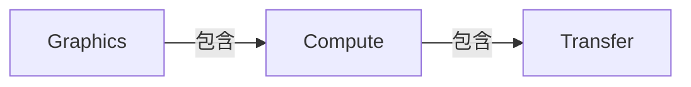
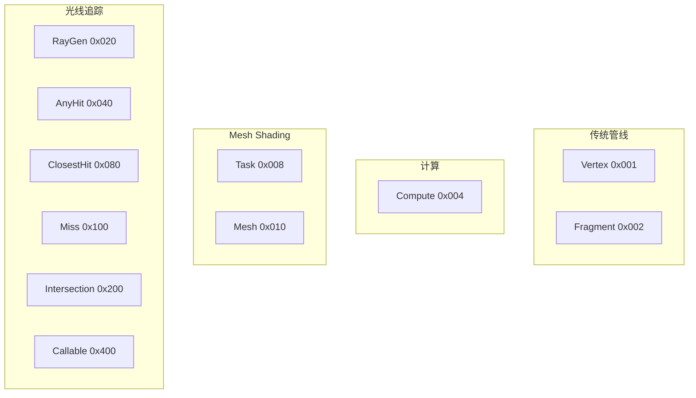
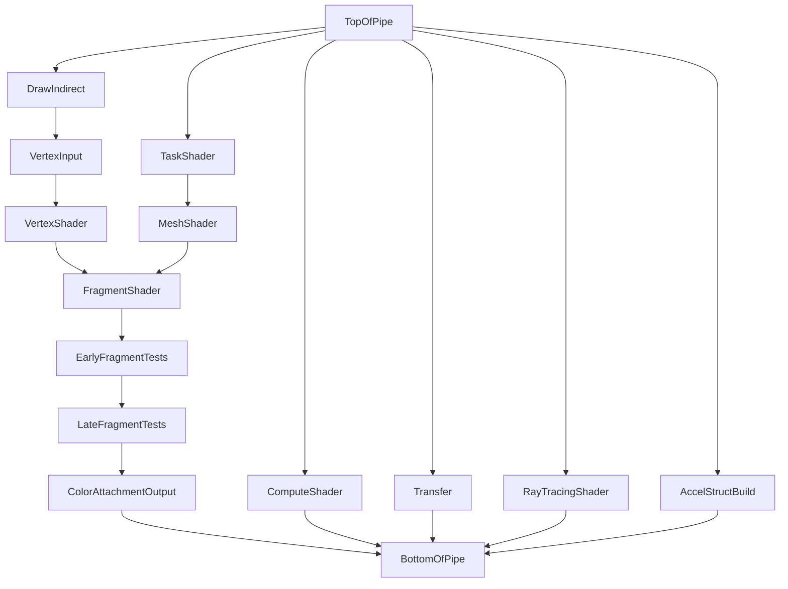
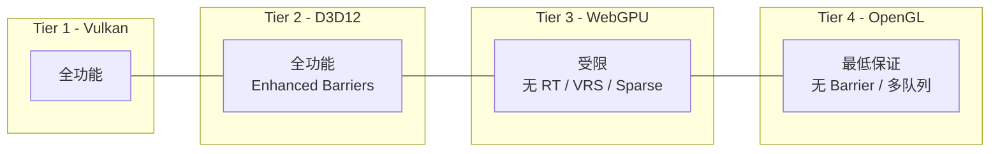

# RhiEnums.h 枚举值参考手册

> 本文档基于 `miki::rhi::RhiEnums.h` 中定义的所有枚举类型，详细说明每个枚举值的语义、使用场景，以及各 Backend（Vulkan T1、D3D12 T2、WebGPU T3、OpenGL T4）的映射方式。

---

## 目录

1. [QueueType](#1-queuetype)
2. [ShaderStage](#2-shaderstage)
3. [PipelineStage](#3-pipelinestage)
4. [AccessFlags](#4-accessflags)
5. [TextureLayout](#5-texturelayout)
6. [BufferUsage](#6-bufferusage)
7. [TextureUsage](#7-textureusage)
8. [MemoryLocation](#8-memorylocation)
9. [TextureDimension](#9-texturedimension)
10. [TextureAspect](#10-textureaspect)
11. [采样器相关枚举](#11-采样器相关枚举)
12. [比较与模板操作](#12-比较与模板操作)
13. [混合相关枚举](#13-混合相关枚举)
14. [光栅化相关枚举](#14-光栅化相关枚举)
15. [顶点输入与索引](#15-顶点输入与索引)
16. [Attachment 操作](#16-attachment-操作)
17. [PresentMode](#17-presentmode)
18. [SemaphoreType](#18-semaphoretype)
19. [QueryType](#19-querytype)
20. [VRS 相关枚举](#20-vrs-相关枚举)
21. [DescriptorModel](#21-descriptormodel)
22. [加速结构相关枚举](#22-加速结构相关枚举)
23. [PipelineLibraryPart](#23-pipelinelibrarypart)
24. [FormatFeatureFlags](#24-formatfeatureflags)
25. [CompressionFormat](#25-compressionformat)
26. [RayTracingShaderGroupType](#26-raytracingshadergrouptype)

---

## 1. QueueType

**底层类型**: `uint8_t`（非位掩码）

| 值         | 语义               | 使用场景                         |
| ---------- | ------------------ | -------------------------------- |
| `Graphics` | 图形 + 计算 + 传输 | 渲染 Pass、全功能队列            |
| `Compute`  | 计算 + 传输        | 异步计算（GPU 粒子、后处理 FFT） |
| `Transfer` | 仅传输             | DMA 拷贝引擎（纹理上传、回读）   |

**详细行为**：

- **`Graphics`**：这是功能最全的队列类型，支持所有图形管线命令（Draw/DrawIndexed/DrawMeshTasks）、计算派发（Dispatch）和传输操作（Copy/Blit/Resolve）。在现代 GPU 上对应 GFX 引擎（Graphics Command Processor），具有最高优先级调度。所有渲染 Pass 必须提交到此队列。同时也是唯一能执行片段着色和光栅化的队列。
- **`Compute`**：支持计算派发和传输操作，不能执行任何光栅化命令。在 Vulkan/D3D12 上对应独立的异步计算引擎（ACE），可与 Graphics 队列并行执行。典型用途：异步计算粒子模拟、FFT 水面、光照剔除、异步光追降噪。使用时需注意跨队列同步（Timeline Semaphore 或 Fence）。
- **`Transfer`**：仅支持内存拷贝操作（buffer-to-buffer、buffer-to-image、image-to-image）。在硬件上对应 DMA/SDMA 引擎，与 GFX/ACE 引擎物理独立，可并行传输而不阻塞渲染。典型用途：纹理流送上传、回读查询结果、staging buffer 拷贝。NVIDIA 有 2 个 copy engine，AMD 有 1-2 个 SDMA engine。

### Backend 映射

| miki       | Vulkan                  | D3D12                             | WebGPU       | OpenGL         |
| ---------- | ----------------------- | --------------------------------- | ------------ | -------------- |
| `Graphics` | `VK_QUEUE_GRAPHICS_BIT` | `D3D12_COMMAND_LIST_TYPE_DIRECT`  | 默认队列     | 单队列（隐式） |
| `Compute`  | `VK_QUEUE_COMPUTE_BIT`  | `D3D12_COMMAND_LIST_TYPE_COMPUTE` | 不支持多队列 | 不支持         |
| `Transfer` | `VK_QUEUE_TRANSFER_BIT` | `D3D12_COMMAND_LIST_TYPE_COPY`    | 不支持多队列 | 不支持         |

---

## 2. ShaderStage

**底层类型**: `uint32_t`（位掩码）

| 值                       | bit     | 使用场景                                                |
| ------------------------ | ------- | ------------------------------------------------------- |
| `Vertex`                 | `1<<0`  | 传统顶点着色                                            |
| `Fragment`               | `1<<1`  | 片段着色                                                |
| `Compute`                | `1<<2`  | 通用计算                                                |
| `Task` / `Amplification` | `1<<3`  | Mesh Shading 管线的任务着色器（D3D12 称 Amplification） |
| `Mesh`                   | `1<<4`  | Mesh Shader                                             |
| `RayGen`                 | `1<<5`  | 光追：射线生成                                          |
| `AnyHit`                 | `1<<6`  | 光追：任意命中（透明度测试）                            |
| `ClosestHit`             | `1<<7`  | 光追：最近命中（材质着色）                              |
| `Miss`                   | `1<<8`  | 光追：未命中（天空盒等）                                |
| `Intersection`           | `1<<9`  | 光追：自定义相交测试（程序化几何）                      |
| `Callable`               | `1<<10` | 光追：可调用着色器（间接调用）                          |
| `AllGraphics`            | V\|F    | 便捷：所有图形阶段                                      |
| `All`                    | `0x7FF` | 便捷：所有阶段                                          |

**详细行为**：

- **`Vertex`**：传统顶点着色器阶段。每个输入顶点执行一次，负责将模型空间顶点变换到裁剪空间（MVP 变换）、计算逐顶点属性（法线、UV、切线）并传递给后续阶段。输入来自顶点缓冲（通过 `VertexInput` 阶段），输出 `gl_Position` 和自定义 varying。在 Mesh Shading 管线中不使用。
- **`Fragment`**：片段着色器（D3D12 称 Pixel Shader）。每个光栅化后的片段执行一次，负责计算最终像素颜色。接收顶点着色器插值后的 varying，可采样纹理、读写 SSBO。输出一或多个颜色附件。支持 `discard` 丢弃片段（影响 Early-Z 优化）。
- **`Compute`**：通用计算着色器。以工作组（workgroup）为单位并行执行，每个工作组包含 `local_size_x * local_size_y * local_size_z` 个调用。通过 `Dispatch(groupX, groupY, groupZ)` 启动。可读写 SSBO/存储纹理，支持共享内存（shared memory）和组内同步（barrier）。不参与图形管线，可在 Graphics 或 Compute 队列执行。
- **`Task`/`Amplification`**：Mesh Shading 管线的第一阶段（可选）。以工作组为单位执行，每个工作组决定要生成多少个 Mesh Shader 工作组（amplification）。典型用途：GPU 驱动的 meshlet 剔除——读取 meshlet 列表，执行视锥/遮挡剔除，只派发可见 meshlet 到 Mesh 阶段。D3D12 称其为 Amplification Shader（`Amplification` 是 `Task` 的别名）。
- **`Mesh`**：Mesh Shading 管线的第二阶段。替代传统的 IA + VS + GS 流程，每个工作组直接输出一组顶点和图元索引。支持灵活的 meshlet 化渲染：从 SSBO/存储缓冲读取压缩后的 meshlet 数据，在 shader 中解码并输出三角形。每个工作组最多输出 256 个顶点和 256 个图元。
- **`RayGen`**：光线追踪的入口着色器。每个像素/样本执行一次（通过 `TraceRaysKHR`/`DispatchRays` 启动），负责生成初始光线方向并调用 `traceRay()` 发射光线到加速结构。类似于计算着色器的角色，但可以递归调用光追管线。
- **`AnyHit`**：光线与几何体相交时可选调用的着色器。主要用于透明度测试：采样 alpha 纹理决定是否接受或忽略（`ignoreIntersection()`）此交点。每次相交可能调用多次（除非设置 `Opaque` 标志跳过）。性能敏感——应尽量简短。
- **`ClosestHit`**：光线找到最近交点后调用的着色器。负责计算该交点的材质着色（采样纹理、计算光照），可以递归发射新光线（反射/折射/阴影查询）。每条光线最多调用一次。
- **`Miss`**：光线未命中任何几何体时调用的着色器。典型用途：返回天空盒颜色、环境光照、或沿光线方向采样 HDR 环境贴图。每条未命中的光线调用一次。
- **`Intersection`**：自定义射线-几何体相交测试着色器。用于程序化几何（SDF、球、柱体等非三角形形状）。当光线命中 AABB 后调用，着色器需输出自定义的 hit distance 和 hit attributes。若不使用，硬件使用内置的射线-三角形相交测试。
- **`Callable`**：可从其他光追着色器（RayGen/ClosestHit/Miss/另一个 Callable）间接调用的通用着色器。类似函数指针机制，通过 SBT（Shader Binding Table）索引调度。用途：在不同材质间共享光照计算逻辑、实现分支避免的间接调用。
- **`AllGraphics`**：`Vertex | Fragment` 的便捷组合。用于描述符集/push constant 绑定时表示"所有图形阶段可见"。
- **`All`**：`0x7FF`，所有 11 个阶段的 OR 值。用于描述符绑定时表示"所有阶段可见"。

### Backend 映射

| miki       | Vulkan                           | D3D12                | WebGPU                    | OpenGL               |
| ---------- | -------------------------------- | -------------------- | ------------------------- | -------------------- |
| `Vertex`   | `VK_SHADER_STAGE_VERTEX_BIT`     | 内嵌于 PSO           | `GPUShaderStage.VERTEX`   | `GL_VERTEX_SHADER`   |
| `Fragment` | `VK_SHADER_STAGE_FRAGMENT_BIT`   | 内嵌于 PSO           | `GPUShaderStage.FRAGMENT` | `GL_FRAGMENT_SHADER` |
| `Compute`  | `VK_SHADER_STAGE_COMPUTE_BIT`    | 内嵌于 PSO           | `GPUShaderStage.COMPUTE`  | `GL_COMPUTE_SHADER`  |
| `Task`     | `VK_SHADER_STAGE_TASK_BIT_EXT`   | Amplification Shader | 不支持                    | 不支持               |
| `Mesh`     | `VK_SHADER_STAGE_MESH_BIT_EXT`   | Mesh Shader          | 不支持                    | 不支持               |
| `RayGen`   | `VK_SHADER_STAGE_RAYGEN_BIT_KHR` | DXIL Library         | 不支持                    | 不支持               |
| 其他 RT    | 对应 `_KHR` 扩展                 | DXIL Library         | 不支持                    | 不支持               |

---

## 3. PipelineStage

**底层类型**: `uint32_t`（位掩码）

**关键设计**: miki 的 bit 值**与 Vulkan Synchronization2 完全对齐**，Vulkan 后端通过 `static_cast` 零成本转换，无需查表。D3D12 后端需要显式映射到 `D3D12_BARRIER_SYNC`。

| 值                      | bit     | Vulkan                                     | D3D12                                     | 状态   |
| ----------------------- | ------- | ------------------------------------------ | ----------------------------------------- | ------ |
| `None`                  | `0`     | `NONE`                                     | `NONE`                                    | 活跃   |
| `TopOfPipe`             | `1<<0`  | `TOP_OF_PIPE_BIT`                          | `ALL`                                     | 活跃   |
| `DrawIndirect`          | `1<<1`  | `DRAW_INDIRECT_BIT`                        | `EXECUTE_INDIRECT`                        | 活跃   |
| `VertexInput`           | `1<<2`  | `VERTEX_INPUT_BIT`                         | `INDEX_INPUT`                             | 活跃   |
| `VertexShader`          | `1<<3`  | `VERTEX_SHADER_BIT`                        | `VERTEX_SHADING`                          | 活跃   |
| `TessControlShader`     | `1<<4`  | `TESSELLATION_CONTROL_SHADER_BIT`          | —                                         | 未使用 |
| `TessEvalShader`        | `1<<5`  | `TESSELLATION_EVALUATION_SHADER_BIT`       | —                                         | 未使用 |
| `GeometryShader`        | `1<<6`  | `GEOMETRY_SHADER_BIT`                      | —                                         | 未使用 |
| `FragmentShader`        | `1<<7`  | `FRAGMENT_SHADER_BIT`                      | `PIXEL_SHADING`                           | 活跃   |
| `EarlyFragmentTests`    | `1<<8`  | `EARLY_FRAGMENT_TESTS_BIT`                 | `DEPTH_STENCIL`                           | 活跃   |
| `LateFragmentTests`     | `1<<9`  | `LATE_FRAGMENT_TESTS_BIT`                  | `DEPTH_STENCIL`                           | 活跃   |
| `ColorAttachmentOutput` | `1<<10` | `COLOR_ATTACHMENT_OUTPUT_BIT`              | `RENDER_TARGET`                           | 活跃   |
| `ComputeShader`         | `1<<11` | `COMPUTE_SHADER_BIT`                       | `COMPUTE_SHADING`                         | 活跃   |
| `Transfer`              | `1<<12` | `ALL_TRANSFER_BIT`                         | `COPY`                                    | 活跃   |
| `BottomOfPipe`          | `1<<13` | `BOTTOM_OF_PIPE_BIT`                       | `ALL`                                     | 活跃   |
| `Host`                  | `1<<14` | `HOST_BIT`                                 | —                                         | 活跃   |
| `AllGraphics`           | `1<<15` | `ALL_GRAPHICS_BIT`                         | `ALL_SHADING`                             | 活跃   |
| `AllCommands`           | `1<<16` | `ALL_COMMANDS_BIT`                         | `ALL`                                     | 活跃   |
| `CommandPreprocess`     | `1<<17` | `COMMAND_PREPROCESS_BIT_EXT`               | —                                         | 未使用 |
| `ConditionalRendering`  | `1<<18` | `CONDITIONAL_RENDERING_BIT_EXT`            | —                                         | 未使用 |
| `TaskShader`            | `1<<19` | `TASK_SHADER_BIT_EXT`                      | 对应 AS                                   | 活跃   |
| `MeshShader`            | `1<<20` | `MESH_SHADER_BIT_EXT`                      | 对应 MS                                   | 活跃   |
| `RayTracingShader`      | `1<<21` | `RAY_TRACING_SHADER_BIT_KHR`               | `RAYTRACING`                              | 活跃   |
| `ShadingRateImage`      | `1<<22` | `FRAGMENT_SHADING_RATE_ATTACHMENT_BIT_KHR` | —                                         | 活跃   |
| `FragmentDensity`       | `1<<23` | `FRAGMENT_DENSITY_PROCESS_BIT_EXT`         | —                                         | 未使用 |
| `TransformFeedback`     | `1<<24` | `TRANSFORM_FEEDBACK_BIT_EXT`               | —                                         | 未使用 |
| `AccelStructBuild`      | `1<<25` | `ACCELERATION_STRUCTURE_BUILD_BIT_KHR`     | `BUILD_RAYTRACING_ACCELERATION_STRUCTURE` | 活跃   |

**详细行为**：

PipelineStage 用于同步屏障（barrier），指定"等待哪个阶段完成"或"阻塞哪个阶段开始"。正确的 stage 选择直接影响 GPU 并行度——过于宽泛（如 `AllCommands`）会导致不必要的 stall，过于狭窄则可能引入数据竞争。

- **`None`**：无阶段。用于 `VkSubpassDependency` 中的 external dependency 或空同步。
- **`TopOfPipe`**：伪阶段，代表命令缓冲执行的最开始。在 src 中等价于"不等待任何操作"，在 dst 中等价于"阻塞所有操作"。通常与 `BottomOfPipe` 配对用于执行顺序依赖（不涉及内存可见性）。**注意**：Synchronization2 中已不推荐单独使用，建议用具体 stage。
- **`DrawIndirect`**：GPU 读取间接绘制/派发参数缓冲的阶段。当 buffer A 在 compute shader 中写入间接参数，随后 `DrawIndirect(A)` 使用时，需在 `ComputeShader → DrawIndirect` 之间插入屏障。
- **`VertexInput`**：Input Assembler 读取顶点缓冲和索引缓冲的阶段。当 buffer 在上一个 pass 中被写入（如 compute skinning），需要 barrier 到此阶段。
- **`VertexShader`**：顶点着色器执行阶段。当 VS 需要读取刚写入的 SSBO/UBO 时，src 应包含写入的 stage，dst 包含此值。
- **`TessControlShader` / `TessEvalShader` / `GeometryShader`**：传统曲面细分和几何着色器阶段。miki 不使用这些着色器（全面转向 Mesh Shading），保留仅为与 Vulkan bit 对齐。
- **`FragmentShader`**：片段着色器执行阶段。当 FS 需要采样上一个 pass 写入的纹理时，需 barrier `ColorAttachmentOutput → FragmentShader`（配合 layout 转换 `ColorAttachment → ShaderReadOnly`）。
- **`EarlyFragmentTests`**：Early-Z/Stencil 测试阶段。在片段着色器之前执行深度模板测试，剔除不可见片段。若 depth buffer 在此 pass 中既读又写，需用此阶段同步。
- **`LateFragmentTests`**：Late-Z/Stencil 测试阶段。在片段着色器之后执行（当 FS 写入 `gl_FragDepth` 或使用 `discard` 时，硬件回退到 late test）。与 `EarlyFragmentTests` 在 D3D12 中统一映射为 `DEPTH_STENCIL`。
- **`ColorAttachmentOutput`**：颜色附件读写阶段。涵盖混合（blend）操作和最终写入 render target。这是图形管线的最后一个实际执行阶段。交换链 acquire 后的 layout transition 通常以此为 dst stage。
- **`ComputeShader`**：计算着色器执行阶段。用于 compute-to-compute 或 compute-to-graphics 同步。
- **`Transfer`**：所有传输操作（`CmdCopyBuffer`、`CmdCopyTexture`、`CmdBlit`、`CmdResolve`、`CmdClearColor` 等）。当拷贝结果需被着色器读取时，src 设为此值。
- **`BottomOfPipe`**：伪阶段，代表命令缓冲执行的最末尾。与 `TopOfPipe` 对称。在 src 中等价于"等待所有操作完成"，在 dst 中等价于"不阻塞任何操作"。
- **`Host`**：CPU 读写设备内存的阶段。当 CPU 通过 mapped pointer 写入数据后，GPU 需要 `Host → 目标 stage` 的可见性保证。反之，GPU 写入结果需 `源 stage → Host` 后 CPU 才能安全读取。
- **`AllGraphics`**：所有图形管线阶段的聚合。等价于 `VertexInput | VertexShader | FragmentShader | EarlyFragmentTests | LateFragmentTests | ColorAttachmentOutput` 等。用于简化不需要精确同步的场景。
- **`AllCommands`**：所有命令的聚合。最粗粒度同步，等价于全 pipeline stall。仅在调试或不确定依赖时使用。
- **`CommandPreprocess`**：设备生成命令（Device Generated Commands, DGC）的预处理阶段。miki 当前不使用。
- **`ConditionalRendering`**：条件渲染谓词读取阶段。miki 当前不使用。
- **`TaskShader`**：Mesh Shading 管线中 Task Shader 的执行阶段。
- **`MeshShader`**：Mesh Shading 管线中 Mesh Shader 的执行阶段。
- **`RayTracingShader`**：光线追踪着色器执行阶段（包括 RayGen/AnyHit/ClosestHit/Miss/Intersection/Callable）。
- **`ShadingRateImage`**：读取 VRS（Variable Rate Shading）附件的阶段。在光栅化开始前读取 shading rate image 决定每个 tile 的着色率。
- **`FragmentDensity`**：Fragment Density Map 处理阶段。Qualcomm 主导的移动端 VRS 替代方案，miki 不使用。
- **`TransformFeedback`**：流输出（stream-out）阶段。传统 GS-based 流输出，miki 不使用（偏好 compute shader + SSBO）。
- **`AccelStructBuild`**：加速结构（BLAS/TLAS）构建阶段。当构建完成后需要光追着色器读取时，需 `AccelStructBuild → RayTracingShader` 屏障。

> WebGPU / OpenGL 无显式 pipeline barrier 概念，这两个后端忽略 PipelineStage。

---

## 4. AccessFlags

**底层类型**: `uint32_t`（位掩码）

与 `PipelineStage` 同理，bit 值与 Vulkan `VkAccessFlags2` 对齐，零成本 `static_cast`。

| 值                         | bit     | Vulkan                                          | D3D12                                     |
| -------------------------- | ------- | ----------------------------------------------- | ----------------------------------------- |
| `None`                     | `0`     | `NONE`                                          | `NO_ACCESS`                               |
| `IndirectCommandRead`      | `1<<0`  | `INDIRECT_COMMAND_READ_BIT`                     | `INDIRECT_ARGUMENT`                       |
| `IndexRead`                | `1<<1`  | `INDEX_READ_BIT`                                | `INDEX_BUFFER`                            |
| `VertexAttributeRead`      | `1<<2`  | `VERTEX_ATTRIBUTE_READ_BIT`                     | `VERTEX_BUFFER`                           |
| `UniformRead`              | `1<<3`  | `UNIFORM_READ_BIT`                              | `CONSTANT_BUFFER`                         |
| `InputAttachmentRead`      | `1<<4`  | `INPUT_ATTACHMENT_READ_BIT`                     | —                                         |
| `ShaderRead`               | `1<<5`  | `SHADER_READ_BIT`                               | `SHADER_RESOURCE`                         |
| `ShaderWrite`              | `1<<6`  | `SHADER_WRITE_BIT`                              | `UNORDERED_ACCESS`                        |
| `ColorAttachmentRead`      | `1<<7`  | `COLOR_ATTACHMENT_READ_BIT`                     | `RENDER_TARGET`                           |
| `ColorAttachmentWrite`     | `1<<8`  | `COLOR_ATTACHMENT_WRITE_BIT`                    | `RENDER_TARGET`                           |
| `DepthStencilRead`         | `1<<9`  | `DEPTH_STENCIL_ATTACHMENT_READ_BIT`             | `DEPTH_STENCIL_READ`                      |
| `DepthStencilWrite`        | `1<<10` | `DEPTH_STENCIL_ATTACHMENT_WRITE_BIT`            | `DEPTH_STENCIL_WRITE`                     |
| `TransferRead`             | `1<<11` | `TRANSFER_READ_BIT`                             | `COPY_SOURCE`                             |
| `TransferWrite`            | `1<<12` | `TRANSFER_WRITE_BIT`                            | `COPY_DEST`                               |
| `HostRead`                 | `1<<13` | `HOST_READ_BIT`                                 | —                                         |
| `HostWrite`                | `1<<14` | `HOST_WRITE_BIT`                                | —                                         |
| `MemoryRead`               | `1<<15` | `MEMORY_READ_BIT`                               | —                                         |
| `MemoryWrite`              | `1<<16` | `MEMORY_WRITE_BIT`                              | —                                         |
| `CommandPreprocessRead`    | `1<<17` | `COMMAND_PREPROCESS_READ_BIT_EXT`               | — (未使用)                                |
| `CommandPreprocessWrite`   | `1<<18` | `COMMAND_PREPROCESS_WRITE_BIT_EXT`              | — (未使用)                                |
| `ConditionalRenderingRead` | `1<<20` | `CONDITIONAL_RENDERING_READ_BIT_EXT`            | — (未使用)                                |
| `AccelStructRead`          | `1<<21` | `ACCELERATION_STRUCTURE_READ_BIT_KHR`           | `RAYTRACING_ACCELERATION_STRUCTURE_READ`  |
| `AccelStructWrite`         | `1<<22` | `ACCELERATION_STRUCTURE_WRITE_BIT_KHR`          | `RAYTRACING_ACCELERATION_STRUCTURE_WRITE` |
| `ShadingRateImageRead`     | `1<<23` | `FRAGMENT_SHADING_RATE_ATTACHMENT_READ_BIT_KHR` | —                                         |

**详细行为**：

AccessFlags 描述资源在屏障前后的**内存访问类型**，与 PipelineStage 配合使用。PipelineStage 定义"何时"同步，AccessFlags 定义"什么数据"需要可见。不匹配的 stage + access 组合是验证层常见错误来源。

- **`None`**：无访问。用于 layout-only 转换（仅改变纹理布局而不涉及数据依赖），或表示"该方向无访问需求"。
- **`IndirectCommandRead`**：GPU 读取间接绘制/派发参数。对应 `DrawIndirect` 阶段。buffer 内容为 `VkDrawIndirectCommand` / `D3D12_DRAW_ARGUMENTS` 结构体。
- **`IndexRead`**：Input Assembler 读取索引缓冲。对应 `VertexInput` 阶段。buffer 包含 uint16/uint32 索引序列。
- **`VertexAttributeRead`**：Input Assembler 读取顶点属性缓冲。对应 `VertexInput` 阶段。buffer 包含按 vertex layout 排列的顶点数据。
- **`UniformRead`**：着色器读取 Uniform Buffer (UBO/CBV)。对应任何着色器阶段。通常走 L1/L2 cache 的只读路径，硬件可做广播优化。每次绘制/派发的 uniform 数据在所有 invocation 间共享。
- **`InputAttachmentRead`**：片段着色器通过 `subpassLoad()` 读取 input attachment。Vulkan 独有概念，允许在同一 render pass 内读取前一个 subpass 的输出。D3D12/WebGPU 无此概念（需拆分 render pass）。
- **`ShaderRead`**：着色器通用读取（SRV/采样纹理/SSBO 读取）。这是最常用的读访问标志，覆盖所有采样和 buffer load 操作。
- **`ShaderWrite`**：着色器通用写入（UAV/存储纹理/SSBO 写入）。对应 D3D12 的 Unordered Access。写入后若需被其他阶段读取，必须显式同步（WAR/WAW hazard）。
- **`ColorAttachmentRead`**：读取颜色附件（blend 的 src 或 load 操作）。混合操作需要先读取 framebuffer 中的已有像素，再与片段着色器输出混合。
- **`ColorAttachmentWrite`**：写入颜色附件。render pass 的最终颜色输出。
- **`DepthStencilRead`**：读取深度/模板附件。Early-Z 测试、depth comparison 采样等。
- **`DepthStencilWrite`**：写入深度/模板附件。深度测试通过后写入 z 值，或模板操作写入模板值。
- **`TransferRead`**：传输操作读取源数据。`CmdCopyBuffer` / `CmdCopyTexture` 等的 src 侧。
- **`TransferWrite`**：传输操作写入目标数据。`CmdCopyBuffer` / `CmdCopyTexture` 等的 dst 侧。
- **`HostRead`**：CPU 通过 mapped pointer 读取 GPU 写入的数据。需要在 `源 stage → Host` 屏障后才能安全读取（确保 GPU 写入对 CPU 可见）。
- **`HostWrite`**：CPU 通过 mapped pointer 写入数据。需要在 `Host → 目标 stage` 屏障后 GPU 才能安全读取（确保 CPU 写入对 GPU 可见）。
- **`MemoryRead` / `MemoryWrite`**：全局 catch-all 内存访问标志。当无法确定精确访问类型时使用。等价于"所有读/写"。性能开销最大，应仅用于调试。
- **`CommandPreprocessRead` / `CommandPreprocessWrite`**：设备生成命令的预处理读写。miki 当前不使用。
- **`ConditionalRenderingRead`**：条件渲染谓词缓冲读取。miki 当前不使用。
- **`AccelStructRead`**：读取加速结构。包括光追着色器中的 `traceRay()` 遍历，以及 BLAS 构建时读取 TLAS 引用。
- **`AccelStructWrite`**：写入加速结构。BLAS/TLAS 构建和更新操作的输出。
- **`ShadingRateImageRead`**：读取 VRS shading rate 附件。在光栅化前读取每个 tile 的着色率。

> **注意**: bit 19 在 Vulkan spec 中未分配，miki 保持空位以维持对齐。

---

## 5. TextureLayout

**底层类型**: `uint8_t`（非位掩码，顺序枚举）

用于 Barrier 中描述纹理的内存布局转换。

| 值                       | 语义                 | Vulkan                                         | D3D12 Enhanced Barrier | D3D12 Legacy          |
| ------------------------ | -------------------- | ---------------------------------------------- | ---------------------- | --------------------- |
| `Undefined`              | 内容可丢弃           | `UNDEFINED`                                    | `UNDEFINED`            | `COMMON`              |
| `General`                | 通用布局（性能最差） | `GENERAL`                                      | `COMMON`               | `COMMON`              |
| `ColorAttachment`        | 颜色附件写入         | `COLOR_ATTACHMENT_OPTIMAL`                     | `RENDER_TARGET`        | `RENDER_TARGET`       |
| `DepthStencilAttachment` | 深度模板附件写入     | `DEPTH_STENCIL_ATTACHMENT_OPTIMAL`             | `DEPTH_STENCIL_WRITE`  | `DEPTH_WRITE`         |
| `DepthStencilReadOnly`   | 深度模板只读         | `DEPTH_STENCIL_READ_ONLY_OPTIMAL`              | `DEPTH_STENCIL_READ`   | `DEPTH_READ`          |
| `ShaderReadOnly`         | 采样/SRV             | `SHADER_READ_ONLY_OPTIMAL`                     | `SHADER_RESOURCE`      | `ALL_SHADER_RESOURCE` |
| `TransferSrc`            | 拷贝源               | `TRANSFER_SRC_OPTIMAL`                         | `COPY_SOURCE`          | `COPY_SOURCE`         |
| `TransferDst`            | 拷贝目的             | `TRANSFER_DST_OPTIMAL`                         | `COPY_DEST`            | `COPY_DEST`           |
| `Present`                | 交换链呈现           | `PRESENT_SRC_KHR`                              | `PRESENT`              | `PRESENT`             |
| `ShadingRate`            | VRS 附件             | `FRAGMENT_SHADING_RATE_ATTACHMENT_OPTIMAL_KHR` | `SHADING_RATE_SOURCE`  | `SHADING_RATE_SOURCE` |

**详细行为**：

TextureLayout 描述纹理在 GPU 内存中的**数据排列方式**。GPU 硬件为不同用途优化了不同的内存布局（压缩元数据、tiling 模式），因此同一纹理在不同操作前必须转换到正确的 layout。Layout 转换通过 image barrier 实现，是渲染引擎中最常见的同步操作之一。

- **`Undefined`**：纹理内容不确定，可被丢弃。仅用于 barrier 的 `oldLayout`，表示"不关心先前内容"。常用于纹理首次使用前的初始化（避免不必要的 load 开销）。**不可**用于 `newLayout`（读取结果未定义）。
- **`General`**：通用布局，所有操作均可执行。这是性能最差的布局，因为 GPU 无法对数据做任何特化压缩或 tiling 优化。仅在纹理需同时用于多种不兼容操作时使用（如 storage image 读写），或作为 fallback。
- **`ColorAttachment`**：优化为颜色附件写入。GPU 启用 delta color compression (DCC) 和快速清除（fast clear）。render pass 期间的颜色附件必须处于此布局。从此布局转出时可能触发 DCC 解压缩。
- **`DepthStencilAttachment`**：优化为深度模板附件读写。GPU 启用 Hi-Z（hierarchical Z）压缩和快速深度清除。render pass 中深度模板附件在可写时必须处于此布局。
- **`DepthStencilReadOnly`**：优化为深度模板只读访问。允许在 render pass 中作为只读深度附件（用于 depth pre-pass 结果重用），同时也允许着色器采样。比 `General` 性能好，因为 Hi-Z 元数据可保持。
- **`ShaderReadOnly`**：优化为着色器采样/SRV 读取。GPU 确保采样缓存（texture cache）可以高效访问纹理数据。这是纹理被着色器采样前的标准布局。从 `ColorAttachment` 转到此布局是最常见的 layout transition。
- **`TransferSrc`**：优化为拷贝/blit 源。`CmdCopyTexture`、`CmdBlit` 的源纹理必须处于此布局。GPU 可按线性/最优路径读取。
- **`TransferDst`**：优化为拷贝/blit 目的。`CmdCopyTexture`、`CmdBlit`、`CmdClearColor` 的目标纹理必须处于此布局。GPU 可按最优路径写入。
- **`Present`**：交换链呈现布局。Swapchain image 在 `Present` 前必须转换到此布局。显示引擎（Display Controller / CRTC）从此布局直接扫描输出。Vulkan 中对应 `VK_IMAGE_LAYOUT_PRESENT_SRC_KHR`，是 WSI 专用布局。
- **`ShadingRate`**：VRS 着色率附件布局。shading rate image 在 render pass 中被读取前必须转换到此布局。该 image 每个 texel 对应一个 tile 的着色率。

> WebGPU / OpenGL 无显式 layout 转换概念。

---

## 6. BufferUsage

**底层类型**: `uint32_t`（位掩码）

| 值                    | bit     | 语义             | Vulkan                                                 | D3D12                    | WebGPU     |
| --------------------- | ------- | ---------------- | ------------------------------------------------------ | ------------------------ | ---------- |
| `Vertex`              | `1<<0`  | 顶点缓冲         | `VERTEX_BUFFER_BIT`                                    | （隐式，通过 SRV）       | `Vertex`   |
| `Index`               | `1<<1`  | 索引缓冲         | `INDEX_BUFFER_BIT`                                     | （隐式）                 | `Index`    |
| `Uniform`             | `1<<2`  | Uniform/Constant | `UNIFORM_BUFFER_BIT`                                   | （CBV）                  | `Uniform`  |
| `Storage`             | `1<<3`  | SSBO/UAV         | `STORAGE_BUFFER_BIT`                                   | `ALLOW_UNORDERED_ACCESS` | `Storage`  |
| `Indirect`            | `1<<4`  | 间接绘制参数     | `INDIRECT_BUFFER_BIT`                                  | （隐式）                 | `Indirect` |
| `TransferSrc`         | `1<<5`  | 拷贝源           | `TRANSFER_SRC_BIT`                                     | （隐式）                 | `CopySrc`  |
| `TransferDst`         | `1<<6`  | 拷贝目的         | `TRANSFER_DST_BIT`                                     | （隐式）                 | `CopyDst`  |
| `AccelStructInput`    | `1<<7`  | 加速结构构建输入 | `ACCELERATION_STRUCTURE_BUILD_INPUT_READ_ONLY_BIT_KHR` | （隐式）                 | 不支持     |
| `AccelStructStorage`  | `1<<8`  | 加速结构存储     | `ACCELERATION_STRUCTURE_STORAGE_BIT_KHR`               | （隐式）                 | 不支持     |
| `ShaderDeviceAddress` | `1<<9`  | BDA              | `SHADER_DEVICE_ADDRESS_BIT`                            | （GPU VA 隐式）          | 不支持     |
| `SparseBinding`       | `1<<10` | 稀疏绑定         | `SPARSE_BINDING_BIT`                                   | —                        | 不支持     |

**详细行为**：

BufferUsage 是位掩码，创建 buffer 时声明其全生命周期内可能的用途。GPU 驱动依据 usage 选择最优的内部分配策略和缓存行为。

- **`Vertex`**：buffer 将作为顶点缓冲绑定到 Input Assembler。数据按 vertex layout（stride + offset）排列。GPU 通过专用的 vertex fetch 单元读取，通常走 L2 cache。每个顶点的属性在 VS 中通过 `layout(location=N) in` 访问。
- **`Index`**：buffer 将作为索引缓冲绑定。包含 uint16 或 uint32 索引值。GPU 通过 Index Fetch 单元读取，支持 post-transform cache 优化（相同索引的顶点可复用 VS 输出）。
- **`Uniform`**：buffer 将作为 Uniform Buffer (UBO/CBV) 绑定。通常存放变换矩阵、材质参数等。硬件限制单次绑定大小（Vulkan 保证至少 16KB，D3D12 为 64KB）。所有 shader invocation 共享相同数据，GPU 可做广播优化。
- **`Storage`**：buffer 将作为 Storage Buffer (SSBO/UAV) 绑定。支持任意大小读写，可用于计算着色器的通用数据缓冲。无大小限制（受 device memory 限制）。支持原子操作。相比 UBO 缓存效率稍低但灵活性极高。
- **`Indirect`**：buffer 存放间接绘制/派发参数（`DrawIndirectCommand`、`DispatchIndirectCommand`）。GPU 从此 buffer 读取参数执行绘制/派发，实现 GPU-driven rendering。常与 compute shader 配合：CS 填写参数 → barrier → DrawIndirect 消费。
- **`TransferSrc`**：buffer 可作为拷贝操作的源（`CmdCopyBuffer` 的 src）。Staging buffer 上传数据时必须设此标志。
- **`TransferDst`**：buffer 可作为拷贝操作的目标（`CmdCopyBuffer` 的 dst）。GPU-local buffer 接收上传数据时必须设此标志。
- **`AccelStructInput`**：buffer 包含加速结构构建输入（顶点/索引/AABB/transform 数据）。Vulkan 中对应 `BUILD_INPUT_READ_ONLY_BIT_KHR`，确保驱动知道此 buffer 用于 RT 构建输入。
- **`AccelStructStorage`**：buffer 用于存储构建后的加速结构（BLAS/TLAS）。该 buffer 本身就是加速结构对象的后端存储。
- **`ShaderDeviceAddress`**：buffer 可通过 GPU 虚拟地址（Buffer Device Address, BDA）直接寻址。着色器中使用 `buffer_reference` 类型或 64-bit 指针访问。需要 `VK_BUFFER_USAGE_SHADER_DEVICE_ADDRESS_BIT`。所有光追相关 buffer（SBT、instance buffer）通常需要此标志。
- **`SparseBinding`**：buffer 使用稀疏绑定。物理内存可按页（通常 64KB）动态绑定/解绑。用于超大 buffer（虚拟纹理后端存储）的按需加载。需要 `sparseBinding` 设备特性。

### D3D12 特殊说明

D3D12 的 buffer 不使用 usage flags 创建（`D3D12_RESOURCE_DESC` 没有 buffer usage），而是在创建描述符视图（CBV/SRV/UAV/IBV/VBV）时隐式确定用途。唯一通过 `D3D12_RESOURCE_FLAGS` 体现的是 `Storage → ALLOW_UNORDERED_ACCESS`。

### WebGPU 特殊说明

WebGPU 不允许 `MapWrite` 与 `Vertex|Index|Uniform|Storage` 组合。miki 使用 **ShadowBuffer 策略**：对于 `CpuToGpu` + GPU 用途的 buffer，GPU 侧仅设 `CopyDst`，CPU 侧用 shadow vector 暂存写入，Unmap 时通过 `wgpuQueueWriteBuffer` 刷新。

---

## 7. TextureUsage

**底层类型**: `uint32_t`（位掩码）

| 值                | bit    | Vulkan                                     | D3D12                                                               | WebGPU             |
| ----------------- | ------ | ------------------------------------------ | ------------------------------------------------------------------- | ------------------ |
| `Sampled`         | `1<<0` | `SAMPLED_BIT`                              | （SRV，若同时有 DepthStencil 则不设 `DENY_SHADER_RESOURCE`）        | `TextureBinding`   |
| `Storage`         | `1<<1` | `STORAGE_BIT`                              | `ALLOW_UNORDERED_ACCESS`                                            | `StorageBinding`   |
| `ColorAttachment` | `1<<2` | `COLOR_ATTACHMENT_BIT`                     | `ALLOW_RENDER_TARGET`                                               | `RenderAttachment` |
| `DepthStencil`    | `1<<3` | `DEPTH_STENCIL_ATTACHMENT_BIT`             | `ALLOW_DEPTH_STENCIL`（若无 Sampled 则追加 `DENY_SHADER_RESOURCE`） | `RenderAttachment` |
| `TransferSrc`     | `1<<4` | `TRANSFER_SRC_BIT`                         | （隐式）                                                            | `CopySrc`          |
| `TransferDst`     | `1<<5` | `TRANSFER_DST_BIT`                         | （隐式）                                                            | `CopyDst`          |
| `InputAttachment` | `1<<6` | `INPUT_ATTACHMENT_BIT`                     | —                                                                   | 不支持             |
| `ShadingRate`     | `1<<7` | `FRAGMENT_SHADING_RATE_ATTACHMENT_BIT_KHR` | —                                                                   | 不支持             |
| `SparseBinding`   | `1<<8` | 稀疏绑定                                   | —                                                                   | 不支持             |

**详细行为**：

TextureUsage 声明纹理在其生命周期内可能的用途。与 BufferUsage 类似，驱动依据 usage 选择最优的内存布局和压缩策略。声明过多不必要的 usage 可能阻止硬件优化（如 DCC 压缩）。

- **`Sampled`**：纹理可被着色器作为采样纹理（SRV）读取。这是最常见的 usage，用于材质贴图、环境贴图等。GPU 利用 texture cache 和各向异性过滤硬件加速采样。在 D3D12 中，若同时设置了 `DepthStencil`，此标志阻止 `DENY_SHADER_RESOURCE` 的设置，使深度缓冲可被采样。
- **`Storage`**：纹理可作为存储图像（UAV/image load-store）被着色器随机读写。compute shader 写入结果纹理、后处理 in-place 操作等。相比 `Sampled` 不经过 texture filter 硬件，直接做像素级别的 load/store。支持原子操作（如 imageAtomicAdd）。
- **`ColorAttachment`**：纹理可作为 render pass 的颜色附件。GPU 分配 DCC 压缩元数据、fast-clear 状态。render target 在写入时启用混合硬件。每个 render pass 最多绑定 8 个颜色附件（Vulkan 保证至少 4 个）。
- **`DepthStencil`**：纹理可作为 render pass 的深度/模板附件。GPU 分配 Hi-Z 元数据、HiS（hierarchical stencil）。格式必须是深度格式（D16/D24/D32/D24S8/D32S8）。在 D3D12 中，若不同时设置 `Sampled`，驱动自动添加 `DENY_SHADER_RESOURCE` 以允许更激进的压缩。
- **`TransferSrc`**：纹理可作为拷贝/blit 操作的源。mipmap 生成（`CmdBlit` 逐级缩小）需要此标志。截屏（readback swapchain image）也需要此标志。
- **`TransferDst`**：纹理可作为拷贝/blit 操作的目标。从 staging buffer 上传纹理数据、mipmap 生成的目标级别、`CmdClearColor` 都需要此标志。
- **`InputAttachment`**：纹理可作为 Vulkan subpass 的 input attachment。允许片段着色器通过 `subpassLoad()` 读取同一 render pass 内前一个 subpass 的输出。这是 tile-based GPU 的关键优化，数据不离开 tile memory。D3D12/WebGPU 不支持此概念。
- **`ShadingRate`**：纹理可作为 VRS shading rate image。格式通常为 `R8_UINT`，每个 texel 编码一个 tile 的着色率。仅 T1 (Vulkan) 后端支持。
- **`SparseBinding`**：纹理使用稀疏绑定（Virtual Textures / Partially Resident Textures）。物理内存按 tile（通常 64KB）动态绑定。用于超大纹理的按需流送，仅加载可见部分到显存。

> OpenGL 不区分纹理用途，所有纹理创建后均可用于任意操作。

---

## 8. MemoryLocation

**底层类型**: `uint8_t`（非位掩码）

| 值         | 语义         | Vulkan (VMA)                     | D3D12                | WebGPU                     | OpenGL                                             |
| ---------- | ------------ | -------------------------------- | -------------------- | -------------------------- | -------------------------------------------------- |
| `GpuOnly`  | 纯显存       | `GPU_ONLY`                       | `HEAP_TYPE_DEFAULT`  | 默认（无 map）             | 无 map flags                                       |
| `CpuToGpu` | 上传/Staging | `CPU_TO_GPU`                     | `HEAP_TYPE_UPLOAD`   | `MapWrite` 或 ShadowBuffer | `DYNAMIC_STORAGE\|MAP_WRITE\|PERSISTENT\|COHERENT` |
| `GpuToCpu` | 回读         | `GPU_TO_CPU`                     | `HEAP_TYPE_READBACK` | `MapRead`                  | `MAP_READ\|PERSISTENT\|COHERENT`                   |
| `Auto`     | 后端决定     | `AUTO`（VMA 决定，可利用 ReBAR） | `HEAP_TYPE_DEFAULT`  | 默认                       | `DYNAMIC_STORAGE`                                  |

**详细行为**：

MemoryLocation 控制 buffer/texture 的**物理内存位置**，直接影响 CPU/GPU 访问性能和可映射性。

- **`GpuOnly`**：资源分配在设备本地显存（VRAM）中，CPU 不可直接访问。这是 GPU 读写性能最高的位置。所有 render target、深度缓冲、长期驻留的纹理和几何体 buffer 都应使用此位置。数据通过 staging buffer + transfer queue 上传。
- **`CpuToGpu`**：资源分配在 CPU 可写、GPU 可读的内存中。在离散 GPU 上通常是 PCIe BAR 映射的显存（写合并，非缓存），带宽约 12-16 GB/s（PCIe 4.0 x16）。在集成 GPU 上等价于统一内存。用于每帧更新的动态数据：per-frame UBO、动态顶点数据、staging buffer。支持持久映射（persistent mapping），避免每帧 map/unmap 开销。
- **`GpuToCpu`**：资源分配在 GPU 可写、CPU 可读的内存中。用于回读 GPU 计算结果：截屏、遮挡查询结果、compute shader 输出的调试数据。带宽通常受 PCIe 反向传输限制。读取前需确保 GPU 写入完成（fence/timeline semaphore 同步）。
- **`Auto`**：由内存分配器（VMA / D3D12 运行时）自动决定最优位置。在支持 Resizable BAR (ReBAR / SAM) 的硬件上，VMA 可能将频繁更新的资源直接放入 VRAM 并允许 CPU 写入，获得 VRAM 的 GPU 读取带宽和 ReBAR 的 CPU 写入路径。这是推荐的默认选择——让驱动/分配器做最优决策。

---

## 9. TextureDimension

**底层类型**: `uint8_t`

| 值             | Vulkan                             | D3D12                   | WebGPU | OpenGL                      |
| -------------- | ---------------------------------- | ----------------------- | ------ | --------------------------- |
| `Tex1D`        | `VK_IMAGE_TYPE_1D`                 | `TEXTURE1D`             | 不支持 | `GL_TEXTURE_1D`             |
| `Tex2D`        | `VK_IMAGE_TYPE_2D`                 | `TEXTURE2D`             | `2d`   | `GL_TEXTURE_2D`             |
| `Tex3D`        | `VK_IMAGE_TYPE_3D`                 | `TEXTURE3D`             | `3d`   | `GL_TEXTURE_3D`             |
| `TexCube`      | `VK_IMAGE_TYPE_2D` + flag          | `TEXTURE2D` + 6 layers  | —      | `GL_TEXTURE_CUBE_MAP`       |
| `Tex2DArray`   | `VK_IMAGE_TYPE_2D` + layers        | `TEXTURE2D` + layers    | —      | `GL_TEXTURE_2D_ARRAY`       |
| `TexCubeArray` | `VK_IMAGE_TYPE_2D` + flag + layers | `TEXTURE2D` + 6N layers | —      | `GL_TEXTURE_CUBE_MAP_ARRAY` |

**详细行为**：

TextureDimension 定义纹理的**拓扑维度**，决定纹理坐标的维数和底层图像类型。

- **`Tex1D`**：一维纹理。纹理坐标为单一 `u` 值。用途：查找表（LUT）、渐变色带、一维函数曲线。WebGPU 不支持 1D 纹理。
- **`Tex2D`**：二维纹理。纹理坐标为 `(u, v)`。这是最常用的纹理类型：材质贴图、render target、depth buffer、后处理中间纹理等。支持 mipmap 和各向异性过滤。
- **`Tex3D`**：三维纹理（体纹理）。纹理坐标为 `(u, v, w)`。用途：体积雾密度场、3D 噪声（如 Worley/Perlin）、体积光照探针（irradiance volume）、医学成像（CT/MRI）。支持硬件三线性插值。内存占用 = width _ height _ depth \* bpp，增长极快。
- **`TexCube`**：立方体贴图。6 个面的 2D 纹理组成，纹理坐标为 3D 方向向量。GPU 硬件自动选择面和计算 2D 坐标。用途：环境贴图（反射/天空盒）、点光源阴影贴图、IBL（Image-Based Lighting）的 specular/diffuse 探针。在 Vulkan 中是 `IMAGE_TYPE_2D` + `VK_IMAGE_CREATE_CUBE_COMPATIBLE_BIT` + 6 layers。
- **`Tex2DArray`**：2D 纹理数组。多个同尺寸的 2D 纹理打包为一个资源，着色器通过 `(u, v, layer)` 访问。用途：纹理图集替代方案（每个材质一个 layer）、CSM（Cascaded Shadow Maps，每级一个 layer）、动画纹理帧。所有 layer 共享相同分辨率和格式。
- **`TexCubeArray`**：立方体贴图数组。多个 cube map 打包为一个资源。每个 cube 占 6 个 layer。用途：多光源环境探针数组、多点光源 omnidirectional shadow maps。在 Vulkan 中是 6N layers + cube compatible bit。

---

## 10. TextureAspect

**底层类型**: `uint8_t`

| 值             | Vulkan                        | D3D12        | 使用场景         |
| -------------- | ----------------------------- | ------------ | ---------------- |
| `Color`        | `VK_IMAGE_ASPECT_COLOR_BIT`   | 默认 plane 0 | 颜色纹理         |
| `Depth`        | `VK_IMAGE_ASPECT_DEPTH_BIT`   | plane 0      | 深度纹理读取     |
| `Stencil`      | `VK_IMAGE_ASPECT_STENCIL_BIT` | plane 1      | 模板纹理读取     |
| `DepthStencil` | `DEPTH_BIT \| STENCIL_BIT`    | plane 0 + 1  | 深度模板同时操作 |

**详细行为**：

TextureAspect 指定访问纹理的**哪个数据平面**。对于组合深度-模板格式（D24S8 / D32S8），深度和模板是物理上独立的数据平面。

- **`Color`**：访问颜色数据平面。适用于所有非深度-模板格式的纹理。创建 SRV/UAV/RTV 时默认选择此 aspect。barrier 中若纹理是颜色格式，aspect 必须为 `Color`。
- **`Depth`**：仅访问深度平面。用于采样深度缓冲时只读取深度值（如 shadow comparison、SSAO 的深度读取）。在 D3D12 中对应 plane 0。创建深度纹理的 SRV 时需指定此 aspect。
- **`Stencil`**：仅访问模板平面。用于读取模板值进行后处理（如 stencil-based outline）。在 D3D12 中对应 plane 1（与深度分离存储）。Vulkan 中采样模板需要 `VK_KHR_stencil_export` 或 `VK_FORMAT_S8_UINT`。
- **`DepthStencil`**：同时访问深度和模板平面。用于 barrier 中同时转换两个平面的布局，或深度-模板附件的 clear/load/store 操作。等价于 `Depth | Stencil` 的组合。

---

## 11. 采样器相关枚举

### Filter

| 值        | Vulkan    | D3D12    | WebGPU    | OpenGL       |
| --------- | --------- | -------- | --------- | ------------ |
| `Nearest` | `NEAREST` | `POINT`  | `nearest` | `GL_NEAREST` |
| `Linear`  | `LINEAR`  | `LINEAR` | `linear`  | `GL_LINEAR`  |

**详细行为**：

- **`Nearest`**：最近邻采样。返回离采样坐标最近的 texel 值，不做任何插值。结果是阶梯状的，像素化明显。用途：像素艺术风格、采样整数纹理（ID buffer）、需要精确 texel 值的场景（如 noise LUT）。性能最高——只读一个 texel。
- **`Linear`**：（双）线性插值采样。根据采样坐标在相邻 texel 间做加权平均。2D 纹理读取 4 个相邻 texel，mipmap 间还可做三线性（trilinear）插值（需 8 个 texel）。这是绝大多数材质贴图的默认过滤模式。启用各向异性过滤（anisotropy）后，采样数可达 16+，性能开销更高但质量显著提升。

### AddressMode

| 值               | Vulkan            | D3D12    | WebGPU          | OpenGL               |
| ---------------- | ----------------- | -------- | --------------- | -------------------- |
| `Repeat`         | `REPEAT`          | `WRAP`   | `repeat`        | `GL_REPEAT`          |
| `MirroredRepeat` | `MIRRORED_REPEAT` | `MIRROR` | `mirror-repeat` | `GL_MIRRORED_REPEAT` |
| `ClampToEdge`    | `CLAMP_TO_EDGE`   | `CLAMP`  | `clamp-to-edge` | `GL_CLAMP_TO_EDGE`   |
| `ClampToBorder`  | `CLAMP_TO_BORDER` | `BORDER` | —               | `GL_CLAMP_TO_BORDER` |

**详细行为**：

AddressMode 控制纹理坐标超出 [0, 1] 范围时的**寻址行为**。

- **`Repeat`**：坐标取小数部分（fract），纹理在 UV 空间无限平铺。最常用模式——地面、墙壁等 tiling 材质。
- **`MirroredRepeat`**：每次跨越整数边界时翻转方向，形成镜像平铺。消除 `Repeat` 在接缝处的不连续（适用于对称纹理、布料等）。
- **`ClampToEdge`**：坐标钳位到 [0, 1]，超出部分返回边缘 texel。用途：UI 元素、render target 采样（避免边缘泄漏）、全屏后处理纹理。
- **`ClampToBorder`**：超出范围返回预定义的边框颜色（由 `BorderColor` 指定）。用途：阴影贴图（边界外返回 1.0 表示无阴影）、衰减效果。**注意**：WebGPU 不支持此模式。

### BorderColor

| 值                 | Vulkan                    | D3D12       |
| ------------------ | ------------------------- | ----------- |
| `TransparentBlack` | `FLOAT_TRANSPARENT_BLACK` | `{0,0,0,0}` |
| `OpaqueBlack`      | `FLOAT_OPAQUE_BLACK`      | `{0,0,0,1}` |
| `OpaqueWhite`      | `FLOAT_OPAQUE_WHITE`      | `{1,1,1,1}` |

**详细行为**：

BorderColor 定义 `ClampToBorder` 寻址模式下超出范围的返回颜色。

- **`TransparentBlack`**：`(0, 0, 0, 0)`。alpha 为 0。用于透明衰减效果、粒子贴图边界。
- **`OpaqueBlack`**：`(0, 0, 0, 1)`。alpha 为 1。用于通用边界颜色。
- **`OpaqueWhite`**：`(1, 1, 1, 1)`。用于阴影贴图（边界外表示完全受光/无阴影）、AO 贴图（边界外 AO=1 表示无遮蔽）。

---

## 12. 比较与模板操作

### CompareOp

| 值               | Vulkan             | D3D12           | 使用场景             |
| ---------------- | ------------------ | --------------- | -------------------- |
| `Never`          | `NEVER`            | `NEVER`         | 永远不通过           |
| `Less`           | `LESS`             | `LESS`          | 深度测试（近处优先） |
| `Equal`          | `EQUAL`            | `EQUAL`         | 模板匹配             |
| `LessOrEqual`    | `LESS_OR_EQUAL`    | `LESS_EQUAL`    | 深度测试（含等于）   |
| `Greater`        | `GREATER`          | `GREATER`       | 反向深度             |
| `NotEqual`       | `NOT_EQUAL`        | `NOT_EQUAL`     | 模板不等             |
| `GreaterOrEqual` | `GREATER_OR_EQUAL` | `GREATER_EQUAL` | 反向深度（含等于）   |
| `Always`         | `ALWAYS`           | `ALWAYS`        | 始终通过             |
| `None`           | —                  | —               | 采样器无比较         |

**详细行为**：

CompareOp 用于深度测试、模板测试和采样器比较（shadow sampler）。公式：`if (ref OP value) then pass`。

- **`Never`**：永远不通过。所有片段被丢弃。用途：调试、强制不渲染但执行 side effect（如模板写入）。
- **`Less`**：当参考值 < 存储值时通过。标准正向深度测试——近处物体遮挡远处物体。最常用的深度比较模式。
- **`Equal`**：当参考值 == 存储值时通过。用途：模板匹配（只在特定模板值区域绘制）、depth equal pass（第二遍只绘制 z 值完全匹配的片段）。
- **`LessOrEqual`**：当参考值 <= 存储值时通过。在同一深度的多个物体可同时通过深度测试。用于重叠几何体的绘制。
- **`Greater`**：当参考值 > 存储值时通过。反向深度缓冲（reversed-Z）中的标准深度测试模式。reversed-Z 将近平面映射为 1.0、远平面映射为 0.0，利用浮点精度在近处更高的特性，显著减少远处 z-fighting。
- **`NotEqual`**：当参考值 != 存储值时通过。用于模板不等比较。
- **`GreaterOrEqual`**：当参考值 >= 存储值时通过。reversed-Z 配合 depth equal 的变体。
- **`Always`**：始终通过。忽略比较结果。用途：禁用深度测试但保留深度写入、全屏 pass、UI 覆盖层。
- **`None`**：采样器不执行比较操作。用于普通纹理采样器（非 shadow sampler）。

### StencilOp

| 值                  | 语义         |
| ------------------- | ------------ |
| `Keep`              | 保持不变     |
| `Zero`              | 置零         |
| `Replace`           | 替换为参考值 |
| `IncrementAndClamp` | 递增并钳位   |
| `DecrementAndClamp` | 递减并钳位   |
| `Invert`            | 按位取反     |
| `IncrementAndWrap`  | 递增并回绕   |
| `DecrementAndWrap`  | 递减并回绕   |

**详细行为**：

StencilOp 定义模板测试通过/失败/深度失败时对模板缓冲值的操作。模板缓冲通常为 8-bit unsigned，每个像素存储 0-255 的整数。

- **`Keep`**：保持当前模板值不变。最常用——当不需要修改模板缓冲时。
- **`Zero`**：将模板值设为 0。清除模板标记。
- **`Replace`**：将模板值替换为当前模板参考值（`stencilReference`）。用于"标记"物体轮廓（先 Replace 标记区域，再用 Equal 只在标记区域绘制效果）。
- **`IncrementAndClamp`**：模板值 +1，若达到最大值（255）则保持 255。用于累加式效果（如计数重叠区域）。
- **`DecrementAndClamp`**：模板值 -1，若达到 0 则保持 0。与 IncrementAndClamp 配对使用（如 stencil shadow volumes）。
- **`Invert`**：按位取反模板值。用于快速切换标记状态。
- **`IncrementAndWrap`**：模板值 +1，若溢出则回绕到 0。用于需要回绕语义的计数。
- **`DecrementAndWrap`**：模板值 -1，若下溢则回绕到 255。与 IncrementAndWrap 配对。

---

## 13. 混合相关枚举

### BlendFactor

| 值                      | 公式中的含义          |
| ----------------------- | --------------------- |
| `Zero`                  | `0`                   |
| `One`                   | `1`                   |
| `SrcColor`              | `src.rgb`             |
| `OneMinusSrcColor`      | `1 - src.rgb`         |
| `DstColor`              | `dst.rgb`             |
| `OneMinusDstColor`      | `1 - dst.rgb`         |
| `SrcAlpha`              | `src.a`               |
| `OneMinusSrcAlpha`      | `1 - src.a`           |
| `DstAlpha`              | `dst.a`               |
| `OneMinusDstAlpha`      | `1 - dst.a`           |
| `ConstantColor`         | 管线常量颜色          |
| `OneMinusConstantColor` | `1 - constant`        |
| `SrcAlphaSaturate`      | `min(src.a, 1-dst.a)` |

**详细行为**：

BlendFactor 用于混合方程中的乘法系数。最终颜色 = `srcColor * srcFactor BlendOp dstColor * dstFactor`（RGB 和 alpha 通道可分别设置不同 factor）。

- **`Zero`** / **`One`**：常数 0 或 1。`One` + `Zero` = 无混合（完全覆盖）。`Zero` + `One` = 保持目标不变。
- **`SrcColor`** / **`OneMinusSrcColor`**：用源颜色 RGB 作为系数。用于颜色乘法混合、自定义效果。
- **`DstColor`** / **`OneMinusDstColor`**：用目标颜色 RGB 作为系数。用于 modulate 混合（乘法叠加）。
- **`SrcAlpha`** / **`OneMinusSrcAlpha`**：最常见的 alpha blending 配置：`srcFactor=SrcAlpha, dstFactor=OneMinusSrcAlpha`，实现标准透明度混合 `result = src.rgb * src.a + dst.rgb * (1 - src.a)`。
- **`DstAlpha`** / **`OneMinusDstAlpha`**：用目标 alpha 作为系数。用于预乘 alpha 混合和 MRT 技巧。
- **`ConstantColor`** / **`OneMinusConstantColor`**：使用管线中设置的 blend constant 颜色。通过 `CmdSetBlendConstants()` 动态设置。用于全局淡入淡出效果。
- **`SrcAlphaSaturate`**：`min(src.a, 1 - dst.a)`。用于 order-independent additive blending（早期 MSAA 抗锯齿的 resolve 技巧）。确保累加不超过 1.0。

### BlendOp

| 值                | 公式                                |
| ----------------- | ----------------------------------- |
| `Add`             | `src * srcFactor + dst * dstFactor` |
| `Subtract`        | `src * srcFactor - dst * dstFactor` |
| `ReverseSubtract` | `dst * dstFactor - src * srcFactor` |
| `Min`             | `min(src, dst)`                     |
| `Max`             | `max(src, dst)`                     |

**详细行为**：

BlendOp 定义混合方程的**运算符**。

- **`Add`**：`src * srcFactor + dst * dstFactor`。标准加法混合。绝大多数透明度、发光效果使用此操作。
- **`Subtract`**：`src * srcFactor - dst * dstFactor`。减法混合。用于特殊效果（如阴影区域变暗、颜色差异效果）。
- **`ReverseSubtract`**：`dst * dstFactor - src * srcFactor`。反向减法。与 Subtract 相反的减法方向。
- **`Min`**：`min(src, dst)`。忽略 factor，取分量最小值。用于 stencil shadow volume 的 darkening pass。
- **`Max`**：`max(src, dst)`。忽略 factor，取分量最大值。用于 additive 效果的亮度上限。

### ColorWriteMask（位掩码）

| 值     | bit    | 含义       |
| ------ | ------ | ---------- |
| `None` | `0`    | 不写入     |
| `R`    | `1<<0` | 写红通道   |
| `G`    | `1<<1` | 写绿通道   |
| `B`    | `1<<2` | 写蓝通道   |
| `A`    | `1<<3` | 写 Alpha   |
| `All`  | `0xF`  | 写全部通道 |

**详细行为**：

ColorWriteMask 控制 render target 的**哪些颜色通道被写入**。

- **`None`**：不写入任何通道。片段着色器仍会执行，但不影响 render target。用途：仅写入深度/模板（depth pre-pass）、执行 side-effect（SSBO 写入）而不修改颜色。
- **`R`/`G`/`B`/`A`**：分别控制各通道。可自由组合。用途：只写入 alpha 通道（alpha test 结果缓存）、只写 R 通道（单通道效果如 SSAO）。
- **`All`**：写入所有 RGBA 通道。这是默认值。

---

## 14. 光栅化相关枚举

### PrimitiveTopology

| 值              | Vulkan           | D3D12            | WebGPU           | OpenGL              |
| --------------- | ---------------- | ---------------- | ---------------- | ------------------- |
| `PointList`     | `POINT_LIST`     | `POINT`          | `point-list`     | `GL_POINTS`         |
| `LineList`      | `LINE_LIST`      | `LINE`           | `line-list`      | `GL_LINES`          |
| `LineStrip`     | `LINE_STRIP`     | `LINE_STRIP`     | `line-strip`     | `GL_LINE_STRIP`     |
| `TriangleList`  | `TRIANGLE_LIST`  | `TRIANGLE`       | `triangle-list`  | `GL_TRIANGLES`      |
| `TriangleStrip` | `TRIANGLE_STRIP` | `TRIANGLE_STRIP` | `triangle-strip` | `GL_TRIANGLE_STRIP` |
| `TriangleFan`   | `TRIANGLE_FAN`   | —                | —                | `GL_TRIANGLE_FAN`   |
| `PatchList`     | `PATCH_LIST`     | `PATCH`          | —                | `GL_PATCHES`        |

**详细行为**：

PrimitiveTopology 定义顶点缓冲中的顶点如何被**组装为图元**。

- **`PointList`**：每个顶点独立渲染为一个点。点大小由 `gl_PointSize` 或固定管线状态控制。用途：粒子系统、调试可视化（光源位置、控制点）、点云渲染。
- **`LineList`**：每 2 个顶点组成一条独立线段。N 个顶点产生 N/2 条线。用途：线框渲染、边缘检测结果可视化、物理调试线（射线、碑撞体边缘）。
- **`LineStrip`**：顶点依次连接成连续线段。N 个顶点产生 N-1 条线。用途：轨迹线、曲线可视化。
- **`TriangleList`**：每 3 个顶点组成一个独立三角形。N 个顶点产生 N/3 个三角形。这是 **最常用**的拓扑，几乎所有 3D 网格都用此格式。
- **`TriangleStrip`**：每个新顶点与前两个顶点组成三角形。N 个顶点产生 N-2 个三角形。用途：地形 heightmap、简单的四边形条带、GPU 内存节约。
- **`TriangleFan`**：所有三角形共享第一个顶点。N 个顶点产生 N-2 个三角形。用于简单的凸多边形填充。**注意**：D3D12 和 WebGPU 不支持，仅 Vulkan 和 OpenGL 可用。
- **`PatchList`**：曲面细分控制点列表。每个 patch 的顶点数由管线状态指定（如 3 为三角形 patch，4 为 quad patch……最大 32）。仅用于曲面细分管线（TCS + TES），miki 不使用曲面细分（偏好 Mesh Shading）。WebGPU 不支持。

### PolygonMode

| 值      | 含义 | WebGPU/OpenGL 说明 |
| ------- | ---- | ------------------ |
| `Fill`  | 填充 | 所有后端支持       |
| `Line`  | 线框 | WebGPU 不支持      |
| `Point` | 点   | WebGPU 不支持      |

**详细行为**：

PolygonMode 控制三角形的**光栅化填充方式**。

- **`Fill`**：实心填充三角形。这是正常渲染的默认模式，所有后端均支持。
- **`Line`**：仅渲染三角形边缘（线框模式）。用途：调试可视化网格拓扑、CAD 线框显示、LOD 检查。WebGPU 不支持此模式。
- **`Point`**：仅渲染三角形顶点（点模式）。用途：调试可视化顶点分布、点云效果。WebGPU 不支持。

### CullMode

| 值             | 含义                              |
| -------------- | --------------------------------- |
| `None`         | 不剔除                            |
| `Front`        | 剔除正面                          |
| `Back`         | 剔除背面                          |
| `FrontAndBack` | 全剔除（仅用于 side-effect pass） |

**详细行为**：

CullMode 控制**背面剪除**，在光栅化阶段丢弃不面向摄像机的三角形。

- **`None`**：不剪除任何面。所有三角形均被光栅化。用途：双面材质（叶子、纱布）、透明物体、调试。性能最差——光栅化量加倍。
- **`Front`**：剪除正面三角形。仅渲染背面。用途：阴影贴图生成（用背面深度避免 shadow acne）、内部可见的封闭体。
- **`Back`**：剪除背面三角形。**默认选择**——封闭几何体的背面不可见，剪除后可减少约 50% 的光栅化和片段着色工作量。
- **`FrontAndBack`**：剪除所有三角形。不会产生任何可见片段。用途：仅执行 side effect（如 transform feedback、SSBO 写入）而不实际渲染任何像素。

### FrontFace

| 值                 | 含义                               |
| ------------------ | ---------------------------------- |
| `CounterClockwise` | 逆时针为正面（Vulkan/OpenGL 默认） |
| `Clockwise`        | 顺时针为正面（D3D12 默认）         |

**详细行为**：

FrontFace 定义三角形的**正面绕行方向**。与 CullMode 配合使用——确定哪个方向是“正面”才能正确剪除。

- **`CounterClockwise`**：顶点按屏幕空间逆时针顺序为正面。这是 Vulkan 和 OpenGL 的默认约定，符合数学上的右手定则。
- **`Clockwise`**：顶点按屏幕空间顺时针顺序为正面。这是 D3D12 的默认约定。使用 D3D12 导出的模型数据时可能需要此设置。

> **跨 API 注意**：miki 默认使用 `CounterClockwise`（Vulkan 约定）。D3D12 后端在创建 PSO 时会自动翻转绕行方向以匹配原生 API 默认。

---

## 15. 顶点输入与索引

### IndexType

| 值       | Vulkan   | D3D12      | WebGPU   | OpenGL              |
| -------- | -------- | ---------- | -------- | ------------------- |
| `Uint16` | `UINT16` | `R16_UINT` | `uint16` | `GL_UNSIGNED_SHORT` |
| `Uint32` | `UINT32` | `R32_UINT` | `uint32` | `GL_UNSIGNED_INT`   |

### VertexInputRate

| 值            | 含义       |
| ------------- | ---------- |
| `PerVertex`   | 每顶点推进 |
| `PerInstance` | 每实例推进 |

**详细行为**：

IndexType：

- **`Uint16`**：16-bit 无符号整数索引。最大索引值 65535（即最多 65536 个唯一顶点）。每个索引占 2 字节，索引缓冲体积是 Uint32 的一半。适用于中小型网格（大多数游戏模型）。GPU 的 index fetch 单元对 16-bit 有优化路径。
- **`Uint32`**：32-bit 无符号整数索引。最大索引值约 42 亿。每个索引占 4 字节。适用于超大网格（如地形、CAD 模型）或程序化生成的巨量几何体。

VertexInputRate：

- **`PerVertex`**：每处理一个顶点时推进一次顶点缓冲偏移。这是标准模式——每个顶点读取自己的属性数据。
- **`PerInstance`**：每处理一个实例时推进一次顶点缓冲偏移。同一实例内的所有顶点共享相同属性值。用途：实例化渲染中的 per-instance 变换矩阵、颜色、材质 ID 等。配合 `DrawIndexedInstanced` 使用。

---

## 16. Attachment 操作

### AttachmentLoadOp

| 值         | 含义         | 性能提示                                             |
| ---------- | ------------ | ---------------------------------------------------- |
| `Load`     | 保留先前内容 | 需要从 framebuffer 读取，tile-based GPU 需从主存加载 |
| `Clear`    | 清除为指定值 | 最优：tile-based GPU 可跳过加载                      |
| `DontCare` | 内容不确定   | 最优：驱动可跳过加载                                 |

### AttachmentStoreOp

| 值         | 含义     | 性能提示                                |
| ---------- | -------- | --------------------------------------- |
| `Store`    | 写回结果 | 必须写出                                |
| `DontCare` | 可丢弃   | tile-based GPU 可跳过写回（如临时深度） |

**详细行为**：

AttachmentLoadOp（render pass 开始时对附件的操作）：

- **`Load`**：保留附件中的先前内容。GPU 需要从显存读取 framebuffer 数据到 tile memory（在 tile-based GPU 如 Mali/Adreno/Apple 上代价显著）。用途：多 pass 累积渲染（如 additive lighting pass）、UI 叠加在 3D 场景之上。
- **`Clear`**：将附件清除为 `clearValue` 指定的值。**性能最优**——tile-based GPU 可直接用清除值初始化 tile memory 而无需从主存加载。desktop GPU 上触发 fast-clear 路径（DCC/Hi-Z 快速清除）。始终优先使用 Clear 而非手动 CmdClearColor。
- **`DontCare`**：附件内容不确定，驱动可自由选择是否加载。**性能最优**——与 Clear 等价的开销，但无需指定清除值。用途：临时附件（如仅用于当前 pass 的深度缓冲，不需要先前内容）。

AttachmentStoreOp（render pass 结束时对附件的操作）：

- **`Store`**：将附件内容写回显存。后续 pass 或操作需要读取此附件时必须使用。tile-based GPU 将 tile memory 刷回主存。
- **`DontCare`**：附件内容可被丢弃。**性能优化**——tile-based GPU 可跳过写回操作，节省显存带宽。用途：临时深度缓冲（仅用于当前 pass 的深度测试，后续不再读取）、MSAA resolve 后的多采样附件。

---

## 17. PresentMode

| 值            | 含义                     | Vulkan             | D3D12                           |
| ------------- | ------------------------ | ------------------ | ------------------------------- |
| `Immediate`   | 不等待 VSync（可能撕裂） | `IMMEDIATE_KHR`    | `AllowTearing`                  |
| `Mailbox`     | 三缓冲（最低延迟无撕裂） | `MAILBOX_KHR`      | 手动三缓冲                      |
| `Fifo`        | VSync 双缓冲             | `FIFO_KHR`         | `SyncInterval=1`                |
| `FifoRelaxed` | VSync 但迟交帧可立即显示 | `FIFO_RELAXED_KHR` | `AllowTearing + SyncInterval=1` |

**详细行为**：

PresentMode 控制交换链呈现时与显示器**垂直同步（VSync）**的关系，直接影响帧延迟和画面撕裂。

- **`Immediate`**：不等待 VSync，GPU 渲染完成立即呈现。延迟最低但可能出现画面撕裂（上下半帧属于不同渲染帧）。适用于竞技游戏、基准测试。
- **`Mailbox`**：三缓冲模式。GPU 渲染到最新的 back buffer，VSync 时始终显示最新帧（丢弃未显示的旧帧）。无撕裂、延迟比 Fifo 低（不排队等待），但 GPU 功耗最高（始终全速渲染）。适用于需要低延迟且不在意功耗的场景。
- **`Fifo`**：经典 VSync 双缓冲。GPU 渲染的帧按先进先出排队，每次 VSync 从队列取一帧显示。无撕裂、帧率锁定在刷新率（60/120/144 Hz）。若 GPU 不够快则帧率减半（60→30）。适用于常规应用、移动端（节能）。**所有平台必须支持此模式**。
- **`FifoRelaxed`**：VSync 但允许迟交帧立即显示。若 GPU 在 VSync 前完成则与 Fifo 行为相同；若 GPU 迟交（帧率低于刷新率），则不等待下一个 VSync 而立即呈现，可能产生局部撕裂。折衷方案——大部分时间无撕裂，帧率降低时避免延迟翻倍。

---

## 18. SemaphoreType

| 值         | 含义         | 使用场景                    |
| ---------- | ------------ | --------------------------- |
| `Binary`   | 二值信号量   | 帧间同步（acquire/present） |
| `Timeline` | 时间线信号量 | 多队列同步、CPU-GPU 同步    |

**详细行为**：

- **`Binary`**：经典的二值信号量——只有 signaled / unsignaled 两种状态。每次 signal 后必须 wait 一次才能重新 signal（不可重入）。用途：交换链的 image acquire/present 同步——`vkAcquireNextImageKHR` signal 一个 binary semaphore，render queue wait 该 semaphore 后开始渲染，渲染完成 signal 另一个 binary semaphore 给 present。
- **`Timeline`**：基于单调递增 64-bit 计数器的信号量。GPU/CPU 均可 signal 和 wait 任意计数器值，无需 1:1 配对。用途：多队列同步（Graphics queue 完成第 N 帧后 signal N，Compute queue wait N 再开始后处理）、CPU-GPU 同步（CPU 调用 `WaitSemaphoreValue` 等待 GPU 完成特定帧，替代粗粒度的 Fence）、帧级流水线控制。Timeline semaphore 是现代渲染引擎同步的核心原语，比 Binary + Fence 组合更灵活且开销更低。

---

## 19. QueryType

| 值                   | 含义       | 使用场景   |
| -------------------- | ---------- | ---------- |
| `Timestamp`          | GPU 时间戳 | 性能计时   |
| `Occlusion`          | 遮挡查询   | 可见性剔除 |
| `PipelineStatistics` | 管线统计   | 调试分析   |

**详细行为**：

- **`Timestamp`**：在命令缓冲中插入一个 GPU 时间戳采样点。GPU 将当前时钟值写入 query pool。两个 timestamp 之差乘以 `timestampPeriod`（纳秒/tick）即得经过时间。用途：GPU pass 级别的性能计时、帧内各阶段耗时分析。精度取决于硬件——通常为纳秒级。
- **`Occlusion`**：遮挡查询。在 begin/end 查询区间内，统计通过深度测试的片段数量。若结果为 0 则物体完全被遮挡。用途：可见性剔除——先用低精度代理几何体查询，下一帧只渲染上一帧可见的物体。有 `precise`（精确片段数）和 `binary`（仅 0/非 0）两种模式，binary 模式性能更好。
- **`PipelineStatistics`**：管线统计查询。返回一组计数器：输入顶点数、输入图元数、VS/FS/CS 调用次数、裁剪后图元数等。用途：调试和性能分析——检测过多的 VS 调用（索引缓冲效率差）、过多的 FS 调用（overdraw 高）。开销较大，仅用于调试/profiling 构建。

---

## 20. VRS 相关枚举

**仅 T1 (Vulkan) 完整支持**

### ShadingRate

| 值        | 含义             | 片段大小 |
| --------- | ---------------- | -------- |
| `Rate1x1` | 全分辨率         | 1x1 像素 |
| `Rate1x2` | 垂直半分辨率     | 1x2 像素 |
| `Rate2x1` | 水平半分辨率     | 2x1 像素 |
| `Rate2x2` | 四分之一分辨率   | 2x2 像素 |
| `Rate2x4` | 八分之一分辨率   | 2x4 像素 |
| `Rate4x2` | 八分之一分辨率   | 4x2 像素 |
| `Rate4x4` | 十六分之一分辨率 | 4x4 像素 |

### ShadingRateCombinerOp

| 值        | 含义             |
| --------- | ---------------- |
| `Keep`    | 保持当前着色率   |
| `Replace` | 替换为新着色率   |
| `Min`     | 取最小（更精细） |
| `Max`     | 取最大（更粗糙） |
| `Mul`     | 相乘             |

**详细行为**：

ShadingRate（VRS, Variable Rate Shading）允许以不同的粒度着色不同区域，在不显著影响画质的前提下大幅降低片段着色开销。

ShadingRate 值：

- **`Rate1x1`**：每像素一次片段着色器调用。全分辨率，无质量损失。默认模式。
- **`Rate1x2` / `Rate2x1`**：半分辨率——一次调用覆盖 1x2 或 2x1 像素。节约约 50% 的 FS 开销。适用于运动模糊较大的区域或视野边缘。
- **`Rate2x2`**：四分之一分辨率——一次调用覆盖 2x2 像素。节约约 75% 的 FS 开销。适用于画面边缘、低对比度区域。VR 渲染中常用于镜头边缘。
- **`Rate2x4` / `Rate4x2`**：八分之一分辨率。节约约 87.5%。仅在几乎无细节的区域使用。
- **`Rate4x4`**：十六分之一分辨率。极端降质，仅用于完全被运动模糊/景深覆盖的区域或 debug。

ShadingRateCombinerOp 定义 VRS 的三级着色率如何组合：

VRS 的最终着色率由三级来源组合：(1) per-draw 管线状态、(2) per-primitive VS 输出、(3) per-tile shading rate image。两个 combiner op 分别控制 `(1) op (2)` 和 `result op (3)` 的组合方式。

- **`Keep`**：保持前一级的着色率。忽略后一级输入。
- **`Replace`**：用后一级替换前一级。完全覆盖。
- **`Min`**：取最精细的着色率（较小的像素块）。确保不低于某个最低质量。
- **`Max`**：取最粗糙的着色率（较大的像素块）。优先降低开销。
- **`Mul`**：将两级着色率相乘（维度独立相乘）。如 1x2 \* 2x1 = 2x2。最灵活的组合方式。

---

## 21. DescriptorModel

**按 Tier 分配**

| 值                 | 适用 Backend       | 说明                               |
| ------------------ | ------------------ | ---------------------------------- |
| `DescriptorHeap`   | Vulkan 1.4 / D3D12 | 基于描述符堆的 bindless 模型       |
| `DescriptorBuffer` | Vulkan (扩展)      | `VK_EXT_descriptor_buffer`，更高效 |
| `DescriptorSet`    | Vulkan (传统)      | 传统描述符集                       |
| `BindGroup`        | WebGPU             | WebGPU Bind Group                  |
| `DirectBind`       | OpenGL             | `glBindBufferRange` 等直接绑定     |

**详细行为**：

DescriptorModel 定义后端使用的**资源描述符绑定模型**，决定着色器如何访问资源（buffer/texture/sampler）。

- **`DescriptorHeap`**：基于描述符堆的 bindless 模型。所有描述符预先写入一个大堆（Vulkan `VK_EXT_descriptor_indexing` / D3D12 Shader Visible Descriptor Heap），着色器通过索引访问。最现代的绑定方式——无需频繁更新描述符集，支持无界数组（unbounded arrays）。miki 在 Vulkan 1.4 和 D3D12 上默认使用此模型。
- **`DescriptorBuffer`**：Vulkan 专用的 `VK_EXT_descriptor_buffer` 扩展。将描述符直接写入 GPU buffer 而非通过驱动管理的 pool。比 DescriptorHeap 更高效——消除了描述符池分配开销，描述符更新等同于 buffer write。NVIDIA/AMD 最新驱动支持。
- **`DescriptorSet`**：Vulkan 传统描述符集模型。通过 `vkAllocateDescriptorSets` + `vkUpdateDescriptorSets` 管理。每个 set 是一组绑定的快照。兼容性最好但管理开销最大——需要 pool 分配、set 生命周期管理。作为 fallback 使用。
- **`BindGroup`**：WebGPU 的绑定组模型。类似 Vulkan 的 DescriptorSet 但更简化——通过 `GPUBindGroup` 将资源绑定到 `GPUBindGroupLayout` 定义的槽位。每次绘制/派发前调用 `setBindGroup()`。不支持 bindless/unbounded arrays。
- **`DirectBind`**：OpenGL 的直接绑定模型。通过 `glBindBufferRange`、`glBindTextureUnit`、`glBindSampler` 等调用将资源直接绑定到编号槽位。无描述符抽象层。最简单但灵活性最低——每次绑定是全局状态修改。

---

## 22. 加速结构相关枚举

**仅 T1 (Vulkan) / D3D12 支持**

### AccelStructGeometryType

| 值          | 含义                       |
| ----------- | -------------------------- |
| `Triangles` | 三角形网格                 |
| `AABBs`     | 轴对齐包围盒（程序化几何） |

### AccelStructGeometryFlags（位掩码）

| 值                  | bit    | 含义                                |
| ------------------- | ------ | ----------------------------------- |
| `None`              | `0`    | 默认                                |
| `Opaque`            | `1<<0` | 跳过 any-hit shader                 |
| `NoDuplicateAnyHit` | `1<<1` | 保证 any-hit 对每个交点最多调用一次 |

### AccelStructBuildFlags（位掩码）

| 值                | bit    | 含义                             |
| ----------------- | ------ | -------------------------------- |
| `None`            | `0`    | 默认                             |
| `PreferFastTrace` | `1<<0` | 优化追踪性能（更慢的构建）       |
| `PreferFastBuild` | `1<<1` | 优化构建速度（可能降低追踪性能） |
| `AllowUpdate`     | `1<<2` | 允许就地更新（动态场景）         |

### AccelStructInstanceFlags（位掩码）

| 值                              | bit    | 含义                 |
| ------------------------------- | ------ | -------------------- |
| `None`                          | `0`    | 默认                 |
| `TriangleFacingCullDisable`     | `1<<0` | 禁用背面剔除         |
| `TriangleFrontCounterClockwise` | `1<<1` | 设置正面方向为逆时针 |
| `ForceOpaque`                   | `1<<2` | 强制不透明           |
| `ForceNoOpaque`                 | `1<<3` | 强制非不透明         |

**详细行为**：

AccelStructGeometryType：

- **`Triangles`**：三角形网格几何。加速结构使用硬件内置的光线-三角形相交测试（BVH 遍历 + Moller-Trumbore）。这是最高效的几何类型。BLAS 从顶点/索引缓冲直接构建。
- **`AABBs`**：轴对齐包围盒。用于程序化几何（SDF 球、柱体、体素等非三角形形状）。光线命中 AABB 后调用 Intersection shader 执行自定义相交测试。灵活性高但性能低于 Triangles。

AccelStructGeometryFlags：

- **`None`**：默认行为。任何光线-几何体相交都可能调用 any-hit shader。
- **`Opaque`**：声明此几何体完全不透明，跳过 any-hit shader 调用。**性能关键优化**——绝大多数静态不透明几何体应设此标志，可使硬件跳过 any-hit shader 调度开销。
- **`NoDuplicateAnyHit`**：保证 any-hit shader 对每个交点最多调用一次。默认情况下硬件可能对同一交点调用多次 any-hit（实现细节）。此标志确保确定性行为，但可能降低追踪性能。

AccelStructBuildFlags：

- **`None`**：默认构建。驱动自行选择构建/追踪的平衡。
- **`PreferFastTrace`**：优化追踪性能。驱动投入更多时间构建更高质量的 BVH（更低的 SAH cost），追踪时需要更少的 BVH 遍历步骤。适用于静态场景几何体的 BLAS。
- **`PreferFastBuild`**：优化构建速度。驱动生成较低质量但构建更快的 BVH。适用于每帧重建的动态几何体（如骨骼动画、粒子）的 BLAS。
- **`AllowUpdate`**：允许就地更新加速结构（refit）而非全量重建。适用于顶点位置变化但拓扑不变的动态对象。更新比重建快但 BVH 质量可能逐渐退化。

AccelStructInstanceFlags：

- **`None`**：默认实例行为。
- **`TriangleFacingCullDisable`**：禁用此实例的背面剔除。等效于光追中的双面材质。用于薄片几何体（叶子、纸张）。
- **`TriangleFrontCounterClockwise`**：将此实例的正面方向设为逆时针（默认取决于 API）。用于翻转法线方向。
- **`ForceOpaque`**：强制此实例的所有几何体为不透明，无论几何体自身的 Opaque 标志。跳过所有 any-hit shader。用于 LOD 切换——远处物体强制不透明省去透明度测试。
- **`ForceNoOpaque`**：强制此实例的所有几何体为非不透明。确保 any-hit shader 被调用。用于动态切换透明度行为。

---

## 23. PipelineLibraryPart

**管线分片编译**（用于 Vulkan Graphics Pipeline Library / D3D12 Pipeline State Stream）

| 值                 | 含义         | 编译内容                                   |
| ------------------ | ------------ | ------------------------------------------ |
| `VertexInput`      | 顶点输入状态 | 顶点格式、IA topology                      |
| `PreRasterization` | 预光栅化     | VS/GS/TS/MS + viewport/scissor             |
| `FragmentShader`   | 片段着色器   | FS + depth/stencil state                   |
| `FragmentOutput`   | 片段输出     | color blend + MSAA + render target formats |

**详细行为**：

PipelineLibraryPart 将图形管线状态拆分为 4 个独立编译单元，实现**管线分片编译**（Pipeline Library）。各部分可独立编译和缓存，运行时按需组合链接为完整管线，大幅减少管线创建时的 shader 编译 stall。

- **`VertexInput`**：顶点输入状态。包含顶点属性布局（format、offset、stride）、顶点绑定描述（binding、inputRate）和 Input Assembler 拓扑（topology）。此部分不涉及着色器编译，链接开销最低。
- **`PreRasterization`**：预光栅化阶段。包含 VS（或 MS + 可选 TS）着色器编译、viewport/scissor 状态、光栅化状态（cull mode、front face、depth bias、polygon mode）。这是编译最耗时的部分之一（包含完整的着色器编译）。
- **`FragmentShader`**：片段着色器阶段。包含 FS 着色器编译、深度/模板测试状态（compare op、stencil op）。与 PreRasterization 一样涉及着色器编译，开销大。
- **`FragmentOutput`**：片段输出阶段。包含颜色混合状态（blend factor、blend op、color write mask）、MSAA 采样数、render target 格式。不涉及着色器编译，链接开销低。

> 典型工作流：引擎在加载时预编译 PreRasterization 和 FragmentShader 部分（最耗时），运行时仅链接 VertexInput 和 FragmentOutput（毫秒级）。Vulkan 通过 `VK_EXT_graphics_pipeline_library` 实现，D3D12 通过 Pipeline State Stream 的分段编译实现。

---

## 24. FormatFeatureFlags

**底层类型**: `uint32_t`（位掩码）

用于查询某格式在当前设备上支持的功能。

| 值                | bit    | 含义               |
| ----------------- | ------ | ------------------ |
| `None`            | `0`    | 无                 |
| `Sampled`         | `1<<0` | 可作为采样纹理     |
| `Storage`         | `1<<1` | 可作为存储图像     |
| `ColorAttachment` | `1<<2` | 可作为颜色附件     |
| `DepthStencil`    | `1<<3` | 可作为深度模板附件 |
| `BlendSrc`        | `1<<4` | 支持混合           |
| `Filter`          | `1<<5` | 支持线性过滤       |
| `All`             | `0x3F` | 全部特性           |

**详细行为**：

FormatFeatureFlags 是通过 `QueryFormatFeatures()` 查询返回的位掩码，描述某个纹理/缓冲格式在当前 GPU 上支持哪些操作。不同 GPU 对同一格式的支持不同——例如 `R32_SFLOAT` 在所有 GPU 上支持 Sampled + Storage，但 `R11G11B10_UFLOAT` 可能不支持 Storage。

- **`Sampled`**：该格式可作为采样纹理（SRV）使用。几乎所有标准颜色和深度格式都支持。
- **`Storage`**：该格式可作为存储图像（UAV/image load-store）使用。部分压缩格式和特殊格式不支持。创建 storage texture 前必须检查此标志。
- **`ColorAttachment`**：该格式可作为 render target 的颜色附件。大多数非压缩颜色格式支持。
- **`DepthStencil`**：该格式可作为深度/模板附件。仅深度格式（D16/D24/D32/D24S8/D32S8）支持。
- **`BlendSrc`**：该格式在作为颜色附件时支持硬件混合。部分整数格式或高精度浮点格式不支持混合。
- **`Filter`**：该格式在采样时支持线性过滤（bilinear/trilinear/anisotropic）。整数格式通常不支持线性过滤。创建 Linear filter 的 sampler 前应检查此标志。
- **`All`**：所有特性均支持。便捷检查值。

---

## 25. CompressionFormat

| 值         | 含义                                                           |
| ---------- | -------------------------------------------------------------- |
| `GDeflate` | GPU 直接解压缩（DirectStorage / `VK_NV_memory_decompression`） |

**详细行为**：

- **`GDeflate`**：GPU 原生解压缩格式。允许 GPU 在数据从 NVMe SSD 到达显存的路径上直接执行解压缩，无需 CPU 参与。基于 Deflate 算法的 GPU 优化变体。在 Windows 上通过 DirectStorage 2.0+ API 使用；在 Vulkan 上通过 `VK_NV_memory_decompression` 扩展使用。典型场景：纹理和几何资产的流式加载——资产在磁盘上以 GDeflate 压缩存储，加载时 GPU 直接解压到 VRAM，可实现 20+ GB/s 的有效加载带宽（远超 SSD 物理带宽）。压缩率约 2:1 到 3:1。

---

## 26. RayTracingShaderGroupType

| 值                   | 含义                               | SBT 槽位         |
| -------------------- | ---------------------------------- | ---------------- |
| `General`            | RayGen / Miss / Callable           | 独立着色器       |
| `TrianglesHitGroup`  | ClosestHit + AnyHit                | 三角形命中组     |
| `ProceduralHitGroup` | Intersection + ClosestHit + AnyHit | 程序化几何命中组 |

**详细行为**：

RayTracingShaderGroupType 定义光线追踪管线中 **Shader Binding Table (SBT)** 的分组类型。SBT 是一个 GPU buffer，存储每个着色器组的着色器句柄和可选的局部参数。光线与场景交互时，硬件根据命中的几何体在 SBT 中查找对应的着色器组来执行。

- **`General`**：独立着色器组。包含单个着色器——RayGen、Miss 或 Callable。SBT 中 RayGen 区域、Miss 区域和 Callable 区域使用此类型。每个 General 组只有一个着色器入口。
- **`TrianglesHitGroup`**：三角形命中组。包含 ClosestHit shader（必选）和 AnyHit shader（可选）。当光线命中三角形几何体时，硬件使用内置的光线-三角形相交测试，然后调用此组中的着色器。SBT 中 Hit Group 区域使用此类型。每个材质通常对应一个 TrianglesHitGroup。
- **`ProceduralHitGroup`**：程序化几何命中组。包含 Intersection shader（必选）+ ClosestHit shader（必选）+ AnyHit shader（可选）。当光线命中 AABB 几何体时，先调用 Intersection shader 执行自定义相交测试，通过后调用 ClosestHit/AnyHit。用于 SDF 渲染、体素光追、曲面相交等非三角形场景。

---

## 附录：Backend Tier 概览

| 特性               | Vulkan                            | D3D12                                  | WebGPU    | OpenGL     |
| ------------------ | --------------------------------- | -------------------------------------- | --------- | ---------- |
| Pipeline Barrier   | `VkPipelineBarrier2` (零成本映射) | `D3D12_BARRIER_SYNC/ACCESS` (显式映射) | 隐式      | 隐式       |
| 多队列             | 完整                              | 完整                                   | 单队列    | 单队列     |
| Mesh Shading       | 完整                              | 完整                                   | 不支持    | 不支持     |
| Ray Tracing        | 完整                              | 完整                                   | 不支持    | 不支持     |
| VRS                | 完整                              | 部分                                   | 不支持    | 不支持     |
| Timeline Semaphore | 完整                              | 完整                                   | 不支持    | 不支持     |
| Descriptor Model   | Heap/Buffer/Set                   | Heap                                   | BindGroup | DirectBind |
