# miki Renderer — From-Zero Reimplementation Roadmap

> **Purpose**: If rebuilding the entire engine from scratch with today's knowledge, what would the ideal architecture, phase ordering, and success criteria look like?
> **Audience**: Architecture team planning the next-generation renderer
> **Scope**: Complete clean-room design — foundation through shipping

---

## Part I: Lessons From the Current Codebase

### What to Preserve (proven designs)

| Design | Why It Works |
|--------|-------------|
| **RHI handle system** | `Handle<Tag>` typed wrappers, generation-based staleness detection, `SlotMap` backing — zero-overhead abstraction |
| **Render Graph** | Declarative pass DAG, Kahn topological sort, automatic barrier insertion, transient resource aliasing |
| **Slang shader pipeline** | Runtime Slang → SPIR-V/DXIL, reflection-driven descriptor layout, file-hash disk cache |
| **ECS (archetype SOA)** | Cache-friendly component storage, `QueryEngine` (All/Any/None), parallel `SystemScheduler` |
| **Bindless + BDA** | Global descriptor set, `BindlessIndex` (4B), `BDAPointer` (16B) with FNV-1a checksum |
| **CadScene segment tree** | Hierarchical segment model with attribute inheritance, layers, conditional styles |
| **Kernel abstraction** | `IKernel` — pluggable geometry kernel interface. `OcctKernel` (full OpenCASCADE V7.8.1 integration, compiled from source with COCA toolchain, `MIKI_KERNEL_OCCT=ON`), `SimKernel` (procedural shapes test fallback). miki is kernel-agnostic: all shape CRUD, tessellation, boolean, import/export delegated to `IKernel`. `IGpuGeometry` — GPU compute APIs (tessellation, boolean preview, interference, distance, curvature, QEM) exposed for future GPU-native kernels |
| **C++23 conventions** | `std::expected`, `std::span`, `std::move_only_function`, `[[nodiscard]]`, `alignas(16)` GPU structs |

### What to Fix (structural problems)

| Problem | Root Cause | Fix |
|---------|-----------|-----|
| **Simulation-first** | 60+ phases of CPU-only code before first GPU pixel | GPU-first: every feature starts with a shader |
| **Header-heavy** | ~200 headers, many with full implementations; 48 .cpp files, many placeholder TUs | implementations in .cpp unless performance hotpath |
| **Namespace explosion** | 35+ namespaces | Consolidate to ~20 well-bounded namespaces |
| **Demo duplication** | 38 demos with repeated boilerplate | Shared `AppFramework` from day one; demos are thin |
| **Stub backends** | D3D12/Metal/WebGPU stubs that never render | Five real backends from day one (Vulkan Tier1, D3D12, Compat Tier2, GL Tier4, WebGPU Tier3); no stubs |
| **Hardening debt** | 20+ dedicated hardening phases | Build correctly from the start; no separate hardening |
| **No visual regression** | All tests are unit/integration; zero screenshot diff | Automated golden-image comparison in CI from Phase 3 |

---

## Part II: Architecture Blueprint

### Target Architecture (11 Layers)

```
Layer 11 ─ Application & Integration
           SDK (MikiEngine/MikiView), Reference UI (miki_editor), Cloud Render
           Collaborative Viewer, LLM Agent Adapter, Multi-Window, HeadlessDevice
Layer 10 ─ Plugin / Extension
           IPlugin (lifecycle: Discover→Load→Init→Activate→Deactivate→Unload)
           PluginRegistry, PluginManifest (JSON), versioned API surface
           Extension points: ITranslator, IKernel, IUiBridge, custom RenderGraph passes
           Vertical industry plugins: Piping, HVAC, Electrical, Shipbuilding (post-1.1)
Layer 9  ─ Interactive Tools
           Gizmo, Compass, Snap, CommandBus, OpHistory, PreviewManager
           SelectionOutline, RichTextInput, MeshEditor, TopoEditEngine
Layer 8b ─ CAE / DFM / PointCloud / Import
           CAE Vis (FEM/Scalar/Vector/Contour/Streamline/Deformation/Tensor)
           PointCloud (Loader/Renderer/ICP/ScanToCAD), PointCloudFilter
           Import (STEP/JT/glTF/3DXML), GPU Tess, Boolean Preview
           DFM (DraftAngle/WallThickness/Undercut/Curvature/Interference/Distance/MassProps)
Layer 8a ─ CAD Core
           CadScene, LayerStack, ConfigurationManager, DisplayStyles
           GPU HLR, SectionPlane, SectionVolume, OIT, Explode, RTAO
           PMI Renderer, DrawingProjector, 2D Markup
Layer 7  ─ Rendering Layer Stack
           Scene / Preview / Overlay / HUD — per-layer render graph
Layer 6  ─ GPU-Driven Geometry
           Task/Mesh Amplification, VisBuffer, ClusterDAG, Radix Sort
           GPU Scene Submission, Persistent Compute, Nanite-grade LOD
           GPU QEM (Mesh Simplification), Meshlet Compression, Cooperative Matrix
Layer 5  ─ Core Rendering
           RenderGraph (conditional + async), Deferred, PBR, VSM Shadows
           TAA/FSR/DLSS, FXAA/MSAA, GTAO/SSAO, VRS, BackgroundMode
           Material Graph, Shader Permutation Cache, Hot-Reload, SlangCompiler
           ReSTIR DI/GI, DDGI, Neural Denoiser (1.1 optional quality tier)
Layer 4  ─ Scene & Data
           ECS, SpatialIndex (BVH+Octree), RTE, IUiBridge
           IKernel (pluggable, OCCT=ref impl), IGpuGeometry
Layer 3  ─ Resource & Memory
           Bindless (descriptor buffer), BDA, SlotMap, StagingRing
           ChunkLoader, MemBudget, Residency Feedback
Layer 2  ─ RHI
           IDevice, ICommandBuffer, VulkanDevice, D3D12Device
           OpenGlDevice, WebGpuDevice, MockDevice, ImGuiBackend
Layer 1  ─ Foundation
           Math, GFX Types, Coca Runtime, ErrorCode
           Debug & Profiling, Telemetry, StructuredLogger
```

### Target Namespace Map (~21)

| Namespace | Scope |
|-----------|-------|
| `miki` | Root: `ErrorCode`, `Result<T>`, shared constants |
| `miki::math` | Math types, BVH, Octree, spatial hash, ray |
| `miki::gfx` | Format, vertex layout, material types, GPU structs |
| `miki::coca` | Coroutine runtime, lock-free queue |
| `miki::rhi` | IDevice, all backends (Vulkan, D3D12, OpenGL, WebGPU, Mock), pools, ImGui backend |
| `miki::resource` | Handles, bindless, BDA, staging, streaming, memory budget |
| `miki::scene` | ECS, spatial index, RTE, EventSystem |
| `miki::core` | RenderGraph, deferred pipeline, Slang, async compute, shadows, TAA, CommandBus, EventRecorder |
| `miki::vgeo` | Virtual geometry: ClusterDAG, VisBuffer, HybridRaster |
| `miki::topo` | TopoGraph, MeshTopoMap, TopoHighlighter |
| `miki::kernel` | IKernel (pluggable), IGpuGeometry, KernelFactory, OcctKernel (ref impl, optional), SimKernel (test) |
| `miki::import` | GltfPipeline, JtImporter, MeshImporter, 3dxmlImporter, UsdImporter, ParallelTessellator, ITranslator |
| `miki::cad` | HLR, section plane, OIT, picking, explode, measure, boolean preview, PMI, draft angle, sketch renderer |
| `miki::cae` | FEM mesh, scalar/vector field, contour, streamline, isosurface, deformation, result compare, animation |
| `miki::pointcloud` | PointCloudLoader, PointCloudRenderer, IcpRegistrator, ScanToCadAligner, PointCloudFilter |
| `miki::cadscene` | CadScene, layers, styles, views, history, configuration, serialization, presentation |
| `miki::text` | TextRenderer, FontManager, GlyphAtlas, RichTextInput, SymbolPalette |
| `miki::ui` | IUiBridge, ImGuiBridge, NullBridge, TreeNode, AttributeMap. Input event type = `neko::platform::Event` (canonical, direct `#include`) |
| `miki::tools` | Gizmo, compass, snap, OpHistory, PreviewManager, topo edit, mesh edit, selection outline, interference, curvature |
| `miki::plugin` | IPlugin, PluginRegistry, PluginManifest, PluginContext, versioned extension points |
| `miki::debug` | Profilers (CPU/GPU/memory), logger, GPU capture, breadcrumbs, shader printf |
| `neko::platform` | **External (neko-platform)**: Event types (`std::variant<CloseRequested, Resize, MouseMove, MouseButton, KeyDown, KeyUp, Scroll, TextInput, Focus, DpiChanged>`), Window, EventLoop, NativeHandle. Used directly by libmiki for `Event` type definitions and by demo backends for window creation. Backends: `win32/` (Phase 1a), `x11/` + `wayland/` (Phase 15a). No `terminal/` backend. |
| `neko::ipc` | **External (neko-ipc)**: SharedMemoryRegion, ProcessHandle, EventPort, PipeStream, MappedFile, MessageChannel, IpcError. OS IPC primitives (Phase 5 parallel track, sync). Async wrappers added in Phase 13 (Coca integration). Backends: `win32/`, `posix/`. |

---

## Part II-B: Project Folder Structure

```
miki/
├── CMakeLists.txt                     # Root CMake 4.0, C++23, NO vcpkg — all deps source-compiled
├── CMakePresets.json                  # Debug / Release / Vulkan / ASAN / TSAN / UBSAN
├── third_party/                       # All dependencies as source (git submodule or vendored)
│   ├── glm/                           #   Header-only math (MIT)
│   ├── googletest/                    #   Google Test (BSD-3)
│   ├── vma/                           #   Vulkan Memory Allocator, header-only (MIT)
│   ├── slang/                         #   Shader compiler (MIT)
│   ├── imgui/                         #   Dear ImGui + docking branch (MIT)
│   ├── freetype/                      #   Font parsing/hinting (FTL/GPL)
│   ├── harfbuzz/                      #   Text shaping (MIT)
│   ├── msdfgen/                       #   MSDF glyph generation (MIT)
│   ├── lunasvg/                       #   SVG parsing + rasterization (MIT)
│   ├── nanosvg/                       #   Lightweight SVG path parser (zlib) — fallback
│   ├── cgltf/                         #   glTF loader, single header (MIT)
│   ├── tinyxml2/                      #   XML parser (zlib)
│   ├── stb/                           #   stb_image, stb_image_write (public domain)
│   ├── dawn/                          #   WebGPU implementation (BSD-3, optional)
│   ├── glad/                          #   OpenGL loader, generated (MIT)
│   ├── directx-headers/               #   D3D12 headers (MIT, Windows-only)
│   ├── occt/                          #   OpenCASCADE (LGPL, optional: MIKI_KERNEL_OCCT=ON)
│   ├── neko-platform/                 #   neko PAL: Event, Window, EventLoop, NativeHandle
│   │                                  #   Backends: win32/ (Phase 1a), x11/ + wayland/ (Phase 15a)
│   │                                  #   Absolute path ref (temporary): D:\backup\repos\LayoutNG\nekomiya-mixed4
│   │                                  #   libmiki links neko-platform for Event type definitions
│   └── neko-ipc/                      #   neko IPC: SharedMemoryRegion, ProcessHandle, EventPort,
│                                      #   PipeStream, MappedFile, MessageChannel, IpcError
│                                      #   Backends: win32/, posix/. Phase 5 parallel track (sync),
│                                      #   Phase 13 (async wrappers). Absolute path ref (temporary).
│   # Build: each subdir has CMakeLists.txt, compiled as STATIC libs
│   # No vcpkg, no Conan, no system packages — fully self-contained
│
├── include/miki/                      # Public headers (all modules)
│   ├── core/                          #   ErrorCode, Result<T>, SlangCompiler, RenderGraph,
│   │                                  #   Deferred pipeline, Shadows, TAA, IBL, ToneMapping,
│   │                                  #   CommandBus, EventRecorder
│   ├── math/                          #   float3/4, float4x4, AABB, Ray, Plane, BVH, Octree
│   ├── gfx/                           #   Format, VertexLayout, MaterialTypes, GPU structs
│   ├── coca/                          #   CocaRuntime, LockFreeQueue, sender/receiver
│   ├── rhi/                           #   IDevice, ICommandBuffer, ExternalContext,
│   │                                  #   OffscreenTarget, FrameManager, StagingUploader,
│   │                                  #   ImGuiBackend, IPipelineFactory, CompatPipelineFactory
│   │   ├── vulkan/                    #   VulkanDevice, VulkanCommandBuffer (Tier1 + Tier2)
│   │   ├── d3d12/                     #   D3D12Device, D3D12CommandBuffer (Windows-only)
│   │   ├── opengl/                    #   OpenGlDevice, OpenGlCommandBuffer (Tier4)
│   │   ├── webgpu/                    #   WebGpuDevice, WebGpuCommandBuffer (Tier3, Dawn)
│   │   └── mock/                      #   MockDevice (headless testing)
│   ├── resource/                      #   ResourceHandle, BindlessManager, BDAPointer,
│   │                                  #   ChunkLoader, MemBudget, ResidencyFeedback
│   ├── scene/                         #   ECS (Archetype), SpatialIndex, RTE, EventSystem
│   ├── vgeo/                          #   ClusterDAG, VisBuffer, MeshletCompressor,
│   │                                  #   HybridRasterizer, StreamingManager
│   ├── text/                          #   TextRenderer, FontManager, MsdfGlyphCache,
│   │                                  #   GlyphAtlas, RichTextSpan, RichTextLayout,
│   │                                  #   RichTextInput, SymbolPalette
│   ├── cad/                           #   HLR, SectionPlane, OIT, RayPicking, Explode,
│   │                                  #   Measurement, BooleanPreview, PMI, DraftAngle,
│   │                                  #   SketchRenderer
│   ├── cae/                           #   FemMeshRenderer, ScalarField, VectorField,
│   │                                  #   Contour, Streamline, Isosurface, Deformation,
│   │                                  #   ResultCompare, AnimationController, VolumeRenderer
│   ├── pointcloud/                    #   PointCloudLoader, PointCloudRenderer,
│   │                                  #   IcpRegistrator, ScanToCadAligner, PointCloudFilter
│   ├── kernel/                        #   IKernel, IGpuGeometry, KernelFactory, SimKernel,
│   │                                  #   OcctKernel (optional, MIKI_KERNEL_OCCT=ON)
│   ├── import/                        #   GltfPipeline, JtImporter, MeshImporter,
│   │                                  #   3dxmlImporter, UsdImporter, ParallelTessellator,
│   │                                  #   ITranslator
│   ├── topo/                          #   TopoGraph, MeshTopoMap, TopoHighlighter
│   ├── cadscene/                      #   CadScene, Layers, Styles, Views, History,
│   │                                  #   Configuration, Serialization, Presentation
│   ├── tools/                         #   Gizmo, Compass, SnapEngine, OpHistory, OpCommand,
│   │                                  #   PreviewManager, PreviewMeshPool, PhantomStyle,
│   │                                  #   PreviewChain, TopoEdit, MeshEditor, SelectionOutline,
│   │                                  #   InterferenceDetector, CurvatureAnalyzer
│   ├── debug/                         #   CpuProfiler, GpuProfiler, MemProfiler, Logger,
│   │                                  #   GpuCapture, Breadcrumbs, ShaderPrintf,
│   │                                  #   ImGuiDebugPanel
│   ├── ui/                            #   IUiBridge, ImGuiBridge, NullBridge,
│   │                                  #   TreeNode, AttributeMap
│   └── sdk/                           #   MikiEngine, MikiScene, MikiView, MikiPicker,
│                                      #   MikiExporter, C wrapper (miki_c.h)
│
├── src/miki/                          # Implementation files (.cpp, mirrors include/ structure)
│   ├── core/                          #   SlangCompiler, RenderGraph executor, CommandBus, ...
│   ├── rhi/                           #   Shared RHI impl
│   │   ├── vulkan/                    #   VulkanDevice, VulkanCommandBuffer
│   │   ├── d3d12/                     #   D3D12Device, D3D12CommandBuffer
│   │   ├── opengl/                    #   OpenGlDevice, OpenGlCommandBuffer
│   │   ├── webgpu/                    #   WebGpuDevice, WebGpuCommandBuffer
│   │   └── mock/                      #   MockDevice
│   ├── resource/                      #   BindlessManager, ChunkLoader, MemBudget
│   ├── scene/                         #   ECS runtime, BVH build, Octree build
│   ├── kernel/                        #   IKernel impl, IGpuGeometry impl, SimKernel,
│   │                                  #   OcctKernel (conditional, links OCCT only when MIKI_KERNEL_OCCT=ON)
│   ├── import/                        #   GltfPipeline, JtImporter, MeshImporter, ...
│   ├── pointcloud/                    #   PointCloudLoader, IcpRegistrator, ...
│   └── ...                            #   (remaining modules mirror include/ structure)
│
├── shaders/                           # Slang shader sources (.slang)
│   ├── core/                          #   GBuffer, Deferred resolve, IBL, ToneMapping,
│   │                                  #   VSM, TAA, GTAO, VRS, MotionVectors
│   ├── vgeo/                          #   Task/Mesh amplification, VisBuffer resolve,
│   │                                  #   ClusterCull, MeshletDecode, HiZ
│   ├── cad/                           #   HLR edge render, SectionHatch, OIT resolve,
│   │                                  #   BooleanCSG, Measurement, PMI text, DraftAngle
│   ├── cae/                           #   FEM wireframe, ScalarColorMap, Contour,
│   │                                  #   Streamline, VolumeRayMarch, SurfaceLIC
│   ├── tools/                         #   JFA outline, Gizmo overlay, GridSDF,
│   │                                  #   CurvatureCompute, InterferenceCompute
│   ├── compat/                        #   Vertex shader equivalents for compat pipeline
│   └── common/                        #   Shared utilities, BRDF, noise, SDF AA
│
├── tests/
│   ├── unit/                          # Google Test unit tests (per-module)
│   ├── integration/                   # Multi-module integration tests
│   ├── visual/                        # Golden image regression tests
│   └── benchmark/                     # Performance benchmarks (CI gate)
│
├── demos/                             # Runnable demo applications (NOT part of libmiki)
│   ├── framework/                     #   Dual-backend demo harness. CMake option:
│   │   │                              #   MIKI_DEMO_BACKEND=glfw|neko (default: glfw)
│   │   ├── common/                    #   AppLoop (abstract event loop interface),
│   │   │                              #   OrbitCamera, ProceduralGeometry, FrameManager ref
│   │   ├── glfw/                      #   GlfwBootstrap: GLFW window + event loop.
│   │   │                              #   GlfwBridge: GLFW callbacks → neko::platform::Event.
│   │   │                              #   GLFW is a demo-only dependency — libmiki has ZERO
│   │   │                              #   windowing deps. Creates window + API context →
│   │   │                              #   calls IDevice::CreateFromExisting()
│   │   └── neko/                      #   NekoBootstrap: neko::platform::Window + EventLoop.
│   │                                  #   NekoBridge: neko Event → AppLoop (near 1:1).
│   │                                  #   Uses neko-platform Win32 backend (Phase 1a),
│   │                                  #   X11/Wayland (Phase 15a). No GLFW dependency.
│   ├── triangle/                      #   Phase 1: first GPU pixel
│   ├── forward_cubes/                 #   Phase 2: 1000 PBR cubes
│   ├── deferred_pbr/                  #   Phase 3: full deferred + VSM + TAA
│   ├── gpu_cull/                      #   Phase 6a: zero CPU draw calls
│   ├── virtual_geometry/              #   Phase 6b: ClusterDAG + streaming
│   ├── cad_viewer/                    #   Phase 7b: full CAD viewer
│   ├── cadscene_production/           #   Phase 8: CadScene + layers + configs
│   ├── topo_editor/                   #   Phase 9: interactive editing
│   ├── cae_viewer/                    #   Phase 10: CAE post-processing
│   ├── pointcloud_viewer/             #   Phase 10: point cloud + ICP
│   ├── debug_viewer/                  #   Phase 11: debug & profiling panels
│   ├── compat_viewer/                 #   Phase 11b: legacy GPU demo
│   ├── opengl_viewer/                 #   Phase 11c: OpenGL backend demo
│   ├── multi_window/                  #   Phase 12: multi-view 4 viewports
│   ├── async_assembly/                #   Phase 13: progressive STEP load
│   ├── billion_tri_benchmark/         #   Phase 14: 2B tri benchmark
│   ├── sdk_demo/                      #   Phase 15a: minimal SDK usage
│   ├── markup_demo/                   #   Phase 15a: 2D annotation
│   ├── cloud_viewer/                  #   Phase 15b: WebRTC browser viewer
│   └── ...                            #   1.1: dfm_tools, product_viz, miki_editor, etc.
│
├── spec/                              # Design documents
│   └── miki_renderer_review_and_ideal_roadmap.md
│
├── .github/workflows/                 # CI pipeline
│   └── ci.yml                         #   Win MSVC + Linux GCC/Clang, ASAN/TSAN/UBSAN,
│                                      #   benchmark gate, golden image gate
│
└── .windsurf/workflows/               # Development workflow automation
    ├── miki-roadmap.md
```

---

## Part II-C: Architecture Diagram

> See `specs/miki_architecture_v2.svg` for the visual architecture diagram.
> The following mermaid diagrams provide a **module-level architecture map** organized by architectural layer and data flow, not by phase timeline.

### Architecture Layer Summary

| Layer | Module Group | CPU / GPU | Core Responsibility |
|-------|-------------|-----------|---------------------|
| **L1** | Foundation (`neko::core`) | CPU | Type system, logging, math, platform events/window |
| **L2** | RHI + Shader (`miki::rhi`, `miki::shader`) | CPU→GPU | Hardware abstraction, Slang quad-target compilation, pipeline factory |
| **L3** | Backends | CPU→GPU | 5 backend implementations (Vulkan Tier1, D3D12, Compat Tier2, GL Tier4, WebGPU Tier3, Mock) |
| **L4** | Resource (`miki::resource`) | CPU+GPU | Global bindless heap, BDA, staging, memory budget, residency feedback |
| **L5** | ECS / Scene / Kernel (`miki::scene`, `miki::kernel`) | CPU | Entity archetype storage, BVH/Octree, IKernel, RTE precision |
| **L6** | RenderGraph + Deferred (`miki::render`) | GPU | Declarative pass DAG, GBuffer, VSM/CSM, TAA/FSR, VRS |
| **L7** | GPU-Driven Core | GPU | Meshlet, Task/Mesh shader, VisBuffer, ClusterDAG, streaming |
| **L8** | CAD Rendering | GPU | GPU HLR, Section, LL-OIT, Ray Picking, PMI, Parametric Tess |
| **L9** | CadScene (`miki::cad`) | CPU→GPU | Assembly tree, layers, config, presentation, IUiBridge |
| **L10** | Tools + CAE + PointCloud | CPU+GPU | Gizmo, Measure, FEM, Streamline, Point Cloud ICP |
| **L11** | Debug / Profiling | CPU+GPU | GPU profiler, breadcrumbs, perf regression CI |
| **L12** | Coca Async | CPU+GPU | Coroutine runtime, async compute overlap, OOP compute |
| **L13** | SDK + Cloud | CPU+GPU+Net | MikiView embedding, headless batch, WebRTC cloud render |

### L1–L3: Foundation + RHI Abstraction + 5-Backend + Shader Toolchain

All upper layers communicate with the GPU exclusively through `IDevice` / `ICommandBuffer`. `IPipelineFactory` + `GpuCapabilityProfile` route to Main (Tier1 mesh shader) or Compat (Tier2/3/4 vertex+MDI) pipeline at init time — zero `if (compat)` in shared code after that.

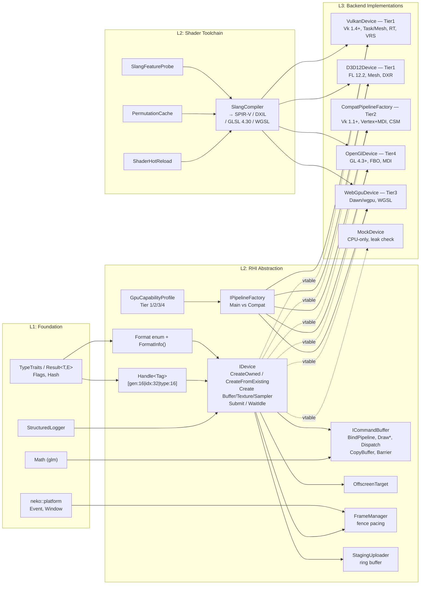
```mermaid
graph LR
    subgraph "L1: Foundation"
        TYPES["TypeTraits / Result&lt;T,E&gt;<br/>Flags, Hash"]
        LOG["StructuredLogger"]
        MATH["Math (glm)"]
        PLATFORM["neko::platform<br/>Event, Window"]
    end

    subgraph "L2: RHI Abstraction"
        HANDLE["Handle&lt;Tag&gt;<br/>[gen:16|idx:32|type:16]"]
        FORMAT["Format enum + FormatInfo()"]
        IDEVICE["IDevice<br/>CreateOwned / CreateFromExisting<br/>Create Buffer/Texture/Sampler<br/>Submit / WaitIdle"]
        ICMDBUF["ICommandBuffer<br/>BindPipeline, Draw*, Dispatch<br/>CopyBuffer, Barrier"]
        GCAP["GpuCapabilityProfile<br/>Tier 1/2/3/4"]
        IPIPE["IPipelineFactory<br/>Main vs Compat"]
        OFFSCREEN["OffscreenTarget"]
        FRAME["FrameManager<br/>fence pacing"]
        STAGING["StagingUploader<br/>ring buffer"]
    end

    subgraph "L2: Shader Toolchain"
        SLANG["SlangCompiler<br/>→ SPIR-V / DXIL<br/>/ GLSL 4.30 / WGSL"]
        HOTRELOAD["ShaderHotReload"]
        PERMCACHE["PermutationCache"]
        FEATPROBE["SlangFeatureProbe"]
    end

    subgraph "L3: Backend Implementations"
        VK["VulkanDevice — Tier1<br/>Vk 1.4+, Task/Mesh, RT, VRS"]
        D3D12["D3D12Device — Tier1<br/>FL 12.2, Mesh, DXR"]
        COMPAT["CompatPipelineFactory — Tier2<br/>Vk 1.1+, Vertex+MDI, CSM"]
        GL["OpenGlDevice — Tier4<br/>GL 4.3+, FBO, MDI"]
        WGPU["WebGpuDevice — Tier3<br/>Dawn/wgpu, WGSL"]
        MOCK["MockDevice<br/>CPU-only, leak check"]
    end

    TYPES --> HANDLE
    TYPES --> FORMAT
    LOG --> IDEVICE
    MATH --> ICMDBUF
    HANDLE --> IDEVICE
    FORMAT --> IDEVICE
    IDEVICE --> ICMDBUF
    IDEVICE --> OFFSCREEN
    IDEVICE --> FRAME
    IDEVICE --> STAGING
    GCAP --> IPIPE
    PLATFORM --> FRAME

    SLANG --> VK
    SLANG --> D3D12
    SLANG --> GL
    SLANG --> WGPU
    HOTRELOAD --> SLANG
    PERMCACHE --> SLANG
    FEATPROBE --> SLANG

    IDEVICE -.->|"vtable"| VK
    IDEVICE -.->|"vtable"| D3D12
    IDEVICE -.->|"vtable"| COMPAT
    IDEVICE -.->|"vtable"| GL
    IDEVICE -.->|"vtable"| WGPU
    IDEVICE -.->|"vtable"| MOCK

    IPIPE --> VK
    IPIPE --> D3D12
    IPIPE --> COMPAT
    IPIPE --> GL
    IPIPE --> WGPU
```

**5-Backend Tier Feature Matrix**:

| | Vulkan (Tier1) | D3D12 (Tier1) | Compat (Tier2) | WebGPU (Tier3) | OpenGL (Tier4) |
|---|---|---|---|---|---|
| **Geometry** | Task/Mesh | Mesh Shader | Vertex+MDI | Vertex+draw | Vertex+MDI |
| **Shadow** | VSM | VSM | CSM 4-casc | CSM 2-casc | CSM 4-casc |
| **AO** | GTAO/RTAO | GTAO/RTAO | SSAO | SSAO 8-samp | SSAO |
| **AA** | TAA+FSR | TAA+FSR | FXAA/MSAA4× | FXAA only | FXAA/MSAA4× |
| **OIT** | LL-OIT | LL-OIT | Weighted | Weighted | Weighted |
| **Pick** | RT ray query | DXR pick | CPU BVH | CPU BVH WASM | CPU BVH |
| **Shader IR** | SPIR-V | DXIL | SPIR-V | WGSL | GLSL 4.30 |

### L4–L5: Resource Management + Bindless + ECS / Scene / Kernel

The resource layer establishes a **global bindless heap** (descriptor buffer or descriptor set) + BDA pointer table. The ECS layer provides CPU-side scene structure. `IKernel` is the pluggable geometry kernel — miki never directly calls OCCT.

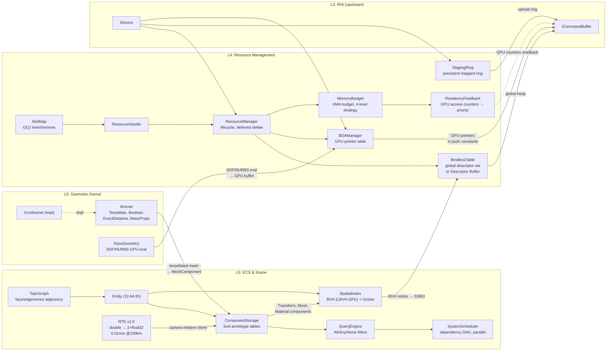
```mermaid
graph LR
    subgraph "L4: Resource Management"
        SLOTMAP["SlotMap<br/>O(1) insert/remove"]
        RHANDLE["ResourceHandle"]
        BINDLESS["BindlessTable<br/>global descriptor set<br/>or Descriptor Buffer"]
        BDA["BDAManager<br/>GPU pointer table"]
        STAGERING["StagingRing<br/>persistent mapped ring"]
        RESMGR["ResourceManager<br/>lifecycle, deferred delete"]
        BUDGET["MemoryBudget<br/>VMA budget, 4-level strategy"]
        RESID["ResidencyFeedback<br/>GPU access counters → priority"]
    end

    subgraph "L5: ECS & Scene"
        ENTITY["Entity (32-bit ID)"]
        COMP["ComponentStorage<br/>SoA archetype tables"]
        QUERY["QueryEngine<br/>All/Any/None filters"]
        SCHED["SystemScheduler<br/>dependency DAG, parallel"]
        SPATIAL["SpatialIndex<br/>BVH (LBVH GPU) + Octree"]
        RTE["RTE v2.0<br/>double → 2×float32<br/>0.01mm @100km"]
        TOPO["TopoGraph<br/>face/edge/vertex adjacency"]
    end

    subgraph "L5: Geometric Kernel"
        IKERNEL["IKernel<br/>Tessellate, Boolean,<br/>ExactDistance, MassProps"]
        IGPUGEO["IGpuGeometry<br/>SDF/NURBS GPU eval"]
        OCCT["OcctKernel (impl)"]
    end

    subgraph "L2: RHI (upstream)"
        IDEVICE["IDevice"]
        ICMDBUF["ICommandBuffer"]
    end

    IDEVICE --> RESMGR
    IDEVICE --> STAGERING
    IDEVICE --> BDA
    SLOTMAP --> RHANDLE
    RHANDLE --> RESMGR
    RESMGR --> BINDLESS
    RESMGR --> BDA
    RESMGR --> BUDGET
    BUDGET --> RESID

    BINDLESS -->|"global heap"| ICMDBUF
    BDA -->|"GPU pointers<br/>in push constants"| ICMDBUF
    STAGERING -->|"upload ring"| ICMDBUF

    ENTITY --> COMP
    COMP --> QUERY
    QUERY --> SCHED
    ENTITY --> SPATIAL
    COMP -->|"Transform, Mesh,<br/>Material components"| SPATIAL

    IKERNEL -->|"tessellated mesh<br/>→ MeshComponent"| COMP
    IGPUGEO -->|"SDF/NURBS eval<br/>→ GPU buffer"| BDA
    OCCT -.->|"impl"| IKERNEL

    SPATIAL -->|"BVH nodes → SSBO"| BINDLESS
    RTE -->|"camera-relative xform"| COMP
    TOPO --> ENTITY
    RESID -.->|"GPU counters readback"| ICMDBUF
```

**Resource Lifecycle**:

```
Create (CPU) → Upload (StagingRing) → Register (BindlessTable) → Use (GPU shader)
                                                                       ↓
                                      ResidencyFeedback ← GPU counters (readback)
                                                                       ↓
                                      MemoryBudget → LRU Evict → Destroy (deferred)
```

### L6–L7: RenderGraph + GPU-Driven Pipeline + Deferred Rendering

The RenderGraph is the backbone — all passes (deferred, shadow, post-process, CAD overlays, CAE) are nodes in a DAG. The GPU-driven core achieves **zero CPU draw calls** via compute culling → Task/Mesh shader → Visibility Buffer.

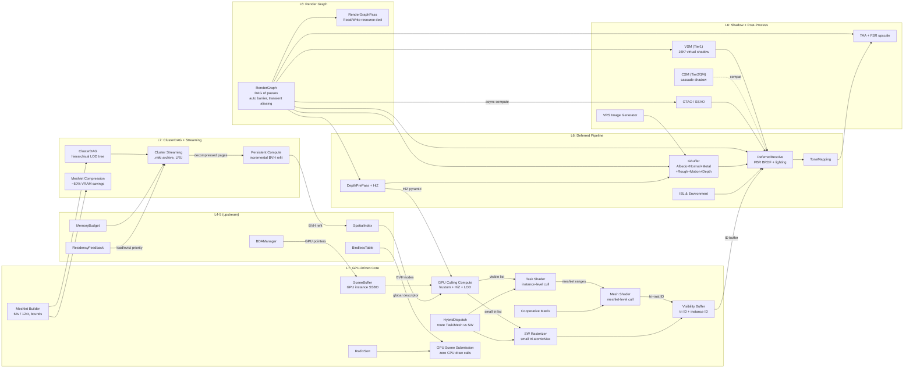
```mermaid
graph LR
    subgraph "L6: Render Graph"
        RG["RenderGraph<br/>DAG of passes<br/>auto barrier, transient aliasing"]
        RGPASS["RenderGraphPass<br/>Read/Write resource decl"]
    end

    subgraph "L6: Deferred Pipeline"
        DEPTH["DepthPrePass + HiZ"]
        GBUF["GBuffer<br/>Albedo+Normal+Metal<br/>+Rough+Motion+Depth"]
        DEFERRED["DeferredResolve<br/>PBR BRDF + lighting"]
        IBL["IBL & Environment"]
        TONE["ToneMapping"]
    end

    subgraph "L6: Shadow + Post-Process"
        VSM["VSM (Tier1)<br/>16K² virtual shadow"]
        CSM["CSM (Tier2/3/4)<br/>cascade shadow"]
        TAA["TAA + FSR upscale"]
        GTAO["GTAO / SSAO"]
        VRS["VRS Image Generator"]
    end

    subgraph "L7: GPU-Driven Core"
        MESHLET["Meshlet Builder<br/>64v / 124t, bounds"]
        TASK["Task Shader<br/>instance-level cull"]
        MESH["Mesh Shader<br/>meshlet-level cull"]
        GPUCULL["GPU Culling Compute<br/>frustum + HiZ + LOD"]
        VISBUF["Visibility Buffer<br/>tri ID + instance ID"]
        SWRAST["SW Rasterizer<br/>small tri atomicMax"]
        HYBRID["HybridDispatch<br/>route Task/Mesh vs SW"]
        SCENEBUF["SceneBuffer<br/>GPU instance SSBO"]
        GPUSUB["GPU Scene Submission<br/>zero CPU draw calls"]
        RADIX["RadixSort"]
        COOP["Cooperative Matrix"]
    end

    subgraph "L7: ClusterDAG + Streaming"
        CDAG["ClusterDAG<br/>hierarchical LOD tree"]
        PERSIST["Persistent Compute<br/>incremental BVH refit"]
        MCOMP["Meshlet Compression<br/>~50% VRAM savings"]
        CSTREAM["Cluster Streaming<br/>.miki archive, LRU"]
    end

    subgraph "L4-5 (upstream)"
        BINDLESS["BindlessTable"]
        BDA["BDAManager"]
        SPATIAL["SpatialIndex"]
        BUDGET["MemoryBudget"]
        RESID["ResidencyFeedback"]
    end

    BINDLESS -->|"global descriptor"| GPUSUB
    BDA -->|"GPU pointers"| SCENEBUF
    BUDGET --> CSTREAM
    RESID -->|"load/evict priority"| CSTREAM

    MESHLET --> CDAG
    MESHLET --> MCOMP
    CDAG --> CSTREAM
    CSTREAM -->|"decompressed pages"| PERSIST
    PERSIST -->|"BVH refit"| SPATIAL

    SCENEBUF --> GPUCULL
    SPATIAL -->|"BVH nodes"| GPUCULL
    GPUCULL -->|"visible list"| TASK
    TASK -->|"meshlet ranges"| MESH
    MESH -->|"tri+inst ID"| VISBUF
    GPUCULL -->|"small tri list"| SWRAST
    SWRAST --> VISBUF
    HYBRID --> TASK
    HYBRID --> SWRAST
    COOP --> MESH
    RADIX --> GPUSUB

    RG --> RGPASS
    RG --> DEPTH
    RG --> GBUF
    RG --> VSM
    RG --> DEFERRED
    RG --> TAA
    RG -->|"async compute"| GTAO

    DEPTH -->|"HiZ pyramid"| GPUCULL
    DEPTH --> GBUF
    GBUF --> DEFERRED
    IBL --> DEFERRED
    VSM --> DEFERRED
    CSM -.->|"compat"| DEFERRED
    GTAO --> DEFERRED
    DEFERRED --> TONE
    TONE --> TAA
    VRS --> GBUF
    VISBUF -->|"ID buffer"| DEFERRED
```

**Single-Frame GPU Data Flow**:

```
CPU: SceneBuffer upload (instance transforms / materials / flags)
  ↓
GPU Compute: Culling (frustum + HiZ occlusion + LOD select)
  ↓ visible instance list
GPU Compute: Task Shader (instance-level cull → emit meshlet groups)
  ↓ surviving meshlet ranges
GPU Graphics: Mesh Shader (meshlet-level cull → output triangles)
  ↓ triangle ID + instance ID
GPU Graphics: Visibility Buffer write (R32G32_UINT per pixel)
  ↓ (parallel) SW Rasterizer for <4px² triangles → atomicMax
GPU Compute: Material Resolve (VisBuffer → BindlessTable fetch → PBR eval)
  ↓ lit color
GPU Graphics: Post-Process (TAA → FSR → Tone Map → Present)
```

**VRAM 4-Level Budget Strategy (2B tri @ <12GB)**:

| Level | Mechanism | Savings |
|-------|-----------|---------|
| **1. Out-of-core streaming** | Only active LOD clusters + coarse fallback resident | ~80% raw data not resident |
| **2. Meshlet compression** | 16-bit quantize + delta index encoding | ~50% per-meshlet |
| **3. Transient aliasing** | RenderGraph lifetime analysis (Kahn sort) | 30-50% render target VRAM |
| **4. On-demand pages** | VSM 16K² active tiles only; VisBuffer 4K = 67MB | Pay-per-use |

### L8–L10: CAD Rendering + CadScene + Tools + CAE + Point Cloud

Domain specialization layer — extends the GPU-driven pipeline for CAD visualization (HLR, section, OIT, PMI), scene management (CadScene, layers, configurations), interactive tools (gizmo, measure, snap), CAE post-processing, and point cloud processing.

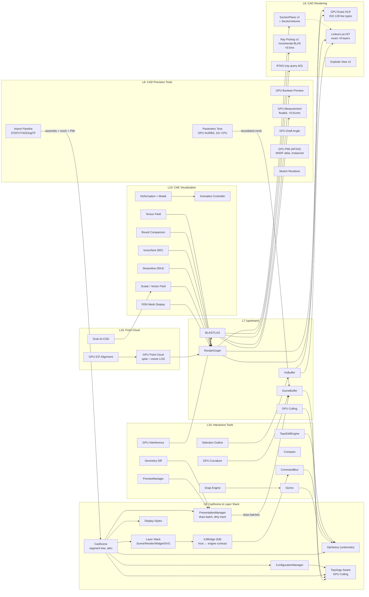
```mermaid
graph LR
    subgraph "L8: CAD Rendering"
        HLR["GPU Exact HLR<br/>ISO 128 line types"]
        SECTION["SectionPlane v2<br/>+ SectionVolume"]
        LLOOIT["Linked-List OIT<br/>exact >8 layers"]
        RAYPICK["Ray Picking v2<br/>incremental BLAS<br/><0.5ms"]
        EXPLODE["Explode View v2"]
        RTAO["RTAO (ray query AO)"]
    end

    subgraph "L8: CAD Precision Tools"
        GPUBOOL["GPU Boolean Preview"]
        GPUMEAS["GPU Measurement<br/>float64, <0.01mm"]
        DRAFT["GPU Draft Angle"]
        PMI["GPU PMI (AP242)<br/>MSDF atlas, instanced"]
        SKETCH["Sketch Renderer"]
        PTESS["Parametric Tess<br/>GPU NURBS, 10× CPU"]
        IMPORT["Import Pipeline<br/>STEP/JT/IGES/glTF"]
    end

    subgraph "L9: CadScene & Layer Stack"
        CADSCENE["CadScene<br/>segment tree, attrs"]
        LAYERS["Layer Stack<br/>Scene/Render/Widget/SVG"]
        STYLES["Display Styles"]
        CONFIG["ConfigurationManager"]
        HISTORY["OpHistory (undo/redo)"]
        TOPOCULL["Topology-Aware<br/>GPU Culling"]
        PRESENT["PresentationManager<br/>draw batch, dirty track"]
        UIBRIDGE["IUiBridge (full)<br/>host ↔ engine contract"]
    end

    subgraph "L10: Interactive Tools"
        GIZMO["Gizmo"]
        COMPASS["Compass"]
        SNAP["Snap Engine"]
        CMDBUS["CommandBus"]
        PREVIEW["PreviewManager"]
        INTERF["GPU Interference"]
        CURV["GPU Curvature"]
        SELOUT["Selection Outline"]
        TOPOEDIT["TopoEditEngine"]
        GEODIFF["Geometry Diff"]
    end

    subgraph "L10: CAE Visualization"
        FEM["FEM Mesh Display"]
        SCALAR["Scalar / Vector Field"]
        STREAM["Streamline (RK4)"]
        DEFORM["Deformation + Modal"]
        ISO["Isosurface (MC)"]
        COMPARE["Result Comparison"]
        TENSOR["Tensor Field"]
        ANIM["Animation Controller"]
    end

    subgraph "L10: Point Cloud"
        PCRENDER["GPU Point Cloud<br/>splat + octree LOD"]
        PCICP["GPU ICP Alignment"]
        SCAN2CAD["Scan-to-CAD"]
    end

    subgraph "L7 (upstream)"
        VISBUF["VisBuffer"]
        GPUCULL["GPU Culling"]
        SCENEBUF["SceneBuffer"]
        BLAS["BLAS/TLAS"]
        RG["RenderGraph"]
    end

    VISBUF --> HLR
    VISBUF --> LLOOIT
    BLAS --> RAYPICK
    BLAS --> RTAO
    BLAS --> GPUBOOL
    BLAS --> GPUMEAS
    GPUCULL --> TOPOCULL
    SCENEBUF --> TOPOCULL
    RG --> HLR
    RG --> LLOOIT
    RG --> SECTION
    SECTION -.-> LLOOIT
    PTESS -->|"tessellated mesh"| SCENEBUF

    CADSCENE --> LAYERS
    CADSCENE --> STYLES
    CADSCENE --> CONFIG
    CADSCENE --> HISTORY
    CADSCENE --> TOPOCULL
    CADSCENE --> PRESENT
    LAYERS --> UIBRIDGE
    CONFIG --> TOPOCULL
    PRESENT -->|"draw batches"| SCENEBUF
    UIBRIDGE --> CMDBUS
    IMPORT -->|"assembly + mesh + PMI"| CADSCENE

    GIZMO --> HISTORY
    SNAP --> GIZMO
    CMDBUS --> HISTORY
    TOPOEDIT --> HISTORY
    PREVIEW --> PRESENT
    INTERF --> BLAS
    CURV --> SCENEBUF
    SELOUT --> VISBUF
    GEODIFF --> PRESENT

    FEM --> RG
    SCALAR --> RG
    STREAM --> RG
    DEFORM --> ANIM
    ISO --> RG
    COMPARE --> RG
    TENSOR --> RG

    PCRENDER --> RG
    PCICP --> PCRENDER
    SCAN2CAD --> SCALAR
```

**CAD Scene Data Flow (Load → Display)**:

```
STEP file → Import Pipeline → IKernel::Tessellate() (per body)
    ↓
CadScene (assembly tree, attributes, PMI refs)
    ↓
PresentationManager (material sort → draw batches)
    ↓
SceneBuffer (GPU instance SSBO) → GPU Culling → VisBuffer → Deferred Resolve
    ↓ (parallel domain passes as RenderGraph nodes)
HLR edges │ Section caps │ OIT layers │ PMI quads │ Selection outline
CAE color map │ Point cloud splats │ Debug vis │ 2D Markup overlay
    ↓
LayerStack compositing → TAA → Present
```

**Interactive Tool Data Flow**:

```
User Input (mouse/keyboard) → IUiBridge::OnInputEvent()
    ↓
Active Tool (Gizmo / SnapEngine / MeasureTool / ...)
    ↓
CommandBus::Execute("move part:123 dx:10")
    ↓
OpHistory::Push(MoveOp) → CadScene::ApplyOp()
    ↓
PresentationManager::MarkDirty() → SceneBuffer update → next frame
    ↓ (parallel)
PreviewManager: ghost preview → transient draw batch
```

### L11–L13: Debug + Async + SDK + Cloud + 1.1 Extensions

Infrastructure layers (debug/profiling), concurrency layer (Coca coroutine runtime), external interface layer (SDK/Cloud), and 1.1 extension modules.

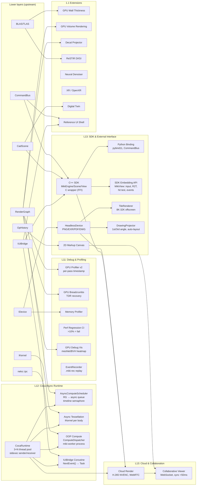
```mermaid
graph LR
    subgraph "L11: Debug & Profiling"
        GPUPROF["GPU Profiler v2<br/>per-pass timestamp"]
        BREAD["GPU Breadcrumbs<br/>TDR recovery"]
        MEMPROF["Memory Profiler"]
        PERFREG["Perf Regression CI<br/>>10% = fail"]
        GPUDBGVIS["GPU Debug Vis<br/>meshlet/BVH heatmap"]
        EVTREC["EventRecorder<br/>.miki-rec replay"]
    end

    subgraph "L12: Coca Async Runtime"
        COCA["CocaRuntime<br/>3+N thread pool<br/>stdexec sender/receiver"]
        ASYNCCOMP["AsyncComputeScheduler<br/>RG → async queue<br/>timeline semaphore"]
        ASYNCTESS["Async Tessellation<br/>IKernel per body"]
        OOP["OOP Compute<br/>ComputeDispatcher<br/>miki-worker process"]
        UIBCORO["IUiBridge Coroutine<br/>NextEvent() → Task"]
    end

    subgraph "L13: SDK & External Interface"
        CPPSDK["C++ SDK<br/>MikiEngine/Scene/View<br/>C wrapper (FFI)"]
        PYBIND["Python Binding<br/>pybind11, CommandBus"]
        SDKEMBED["SDK Embedding API<br/>MikiView: input, R2T,<br/>hit test, events"]
        HEADLESS["HeadlessDevice<br/>PNG/EXR/PDF/DWG"]
        TILE["TileRenderer<br/>8K-32K offscreen"]
        MARKUP["2D Markup Canvas"]
        DRAWING["DrawingProjector<br/>1st/3rd angle, auto-layout"]
    end

    subgraph "L13: Cloud & Collaboration"
        CLOUD["Cloud Render<br/>H.265 NVENC, WebRTC"]
        COLLAB["Collaborative Viewer<br/>WebSocket, sync <50ms"]
    end

    subgraph "1.1 Extensions"
        WALL["GPU Wall Thickness"]
        VOLREND["GPU Volume Rendering"]
        DECAL["Decal Projector"]
        RESTIR["ReSTIR DI/GI"]
        DENOISER["Neural Denoiser"]
        XR["XR / OpenXR"]
        TWIN["Digital Twin"]
        EDITOR["Reference UI Shell"]
    end

    subgraph "Lower layers (upstream)"
        RG["RenderGraph"]
        CADSCENE["CadScene"]
        CMDBUS["CommandBus"]
        IDEVICE["IDevice"]
        IKERNEL["IKernel"]
        BLAS["BLAS/TLAS"]
        UIBRIDGE["IUiBridge"]
        OPHIST["OpHistory"]
        IPC["neko::ipc"]
    end

    RG --> GPUPROF
    RG --> BREAD
    RG --> GPUDBGVIS
    IDEVICE --> MEMPROF

    COCA --> ASYNCCOMP
    COCA --> ASYNCTESS
    COCA --> OOP
    COCA --> UIBCORO
    RG --> ASYNCCOMP
    IKERNEL --> ASYNCTESS
    IPC --> OOP
    UIBRIDGE --> UIBCORO

    UIBRIDGE --> CPPSDK
    CADSCENE --> CPPSDK
    CMDBUS --> CPPSDK
    CPPSDK --> PYBIND
    CPPSDK --> SDKEMBED
    IDEVICE --> HEADLESS
    HEADLESS --> TILE
    HEADLESS --> DRAWING
    OPHIST --> MARKUP
    CPPSDK --> CLOUD
    HEADLESS --> CLOUD
    COCA --> CLOUD
    CLOUD --> COLLAB
    MARKUP --> COLLAB

    BLAS --> WALL
    BLAS --> RESTIR
    RG --> VOLREND
    RG --> DECAL
    CADSCENE --> TWIN
    UIBRIDGE --> EDITOR
    CMDBUS --> EDITOR
```

### End-to-End Data Flow (File → Pixel)

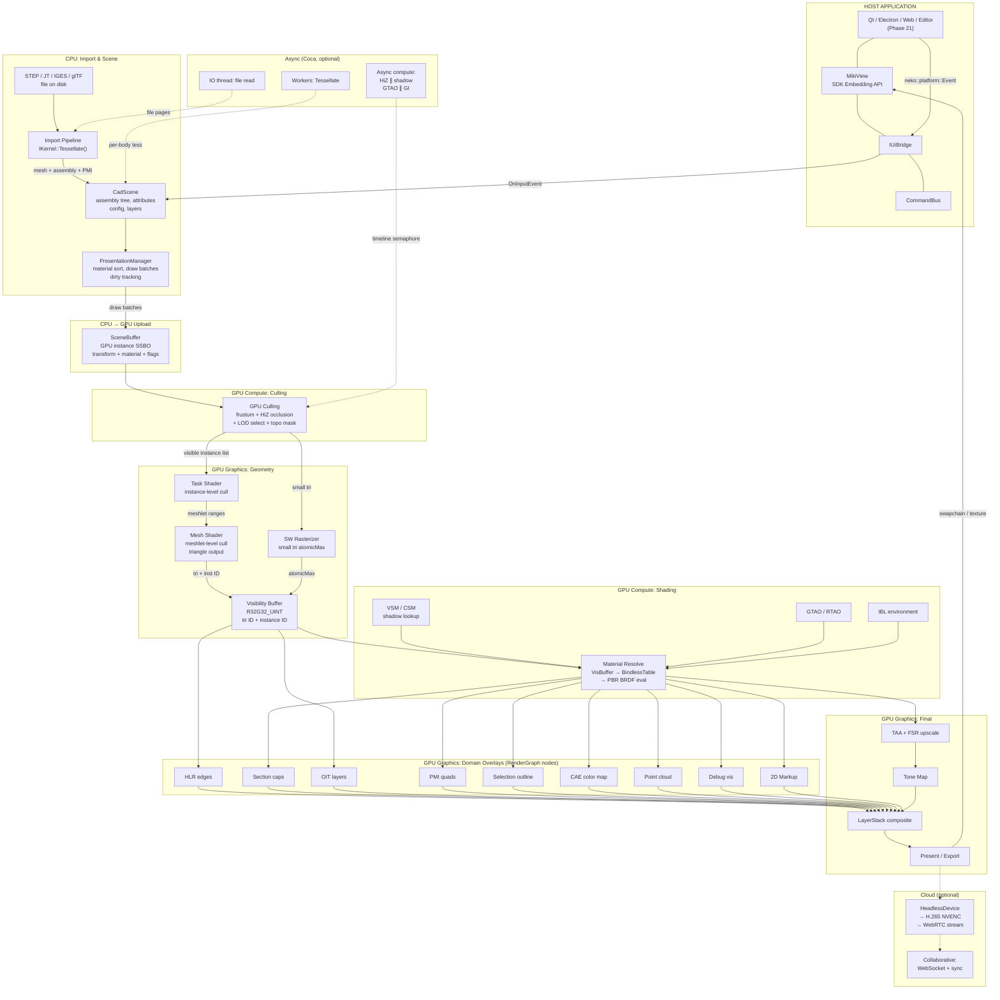
```mermaid
graph TD
    subgraph "HOST APPLICATION"
        HOST["Qt / Electron / Web / Editor<br/>(Phase 21)"]
        MVIEW["MikiView<br/>SDK Embedding API"]
        UIB["IUiBridge"]
        CB["CommandBus"]
        HOST --- MVIEW
        MVIEW --- UIB
        UIB --- CB
    end

    subgraph "CPU: Import & Scene"
        FILE["STEP / JT / IGES / glTF<br/>file on disk"]
        IMPORT["Import Pipeline<br/>IKernel::Tessellate()"]
        CADSCENE["CadScene<br/>assembly tree, attributes<br/>config, layers"]
        PRESENT["PresentationManager<br/>material sort, draw batches<br/>dirty tracking"]
    end

    subgraph "CPU → GPU Upload"
        SCENEBUF["SceneBuffer<br/>GPU instance SSBO<br/>transform + material + flags"]
    end

    subgraph "GPU Compute: Culling"
        CULL["GPU Culling<br/>frustum + HiZ occlusion<br/>+ LOD select + topo mask"]
    end

    subgraph "GPU Graphics: Geometry"
        TASK["Task Shader<br/>instance-level cull"]
        MESH["Mesh Shader<br/>meshlet-level cull<br/>triangle output"]
        SWRAST["SW Rasterizer<br/>small tri atomicMax"]
        VISBUF["Visibility Buffer<br/>R32G32_UINT<br/>tri ID + instance ID"]
    end

    subgraph "GPU Compute: Shading"
        MATRESOLVE["Material Resolve<br/>VisBuffer → BindlessTable<br/>→ PBR BRDF eval"]
        SHADOW["VSM / CSM<br/>shadow lookup"]
        AO["GTAO / RTAO"]
        IBL["IBL environment"]
    end

    subgraph "GPU Graphics: Domain Overlays (RenderGraph nodes)"
        HLR["HLR edges"]
        SECT["Section caps"]
        OIT["OIT layers"]
        PMI["PMI quads"]
        SEL["Selection outline"]
        CAE["CAE color map"]
        PC["Point cloud"]
        DBG["Debug vis"]
        MK["2D Markup"]
    end

    subgraph "GPU Graphics: Final"
        TAA["TAA + FSR upscale"]
        TONE["Tone Map"]
        LAYER["LayerStack composite"]
        OUTPUT["Present / Export"]
    end

    subgraph "Async (Coca, optional)"
        ASYNCIO["IO thread: file read"]
        ASYNCTESS["Workers: Tessellate"]
        ASYNCGPU["Async compute:<br/>HiZ ∥ shadow<br/>GTAO ∥ GI"]
    end

    subgraph "Cloud (optional)"
        CLOUD["HeadlessDevice<br/>→ H.265 NVENC<br/>→ WebRTC stream"]
        COLLAB["Collaborative:<br/>WebSocket + sync"]
    end

    %% Host → Engine
    HOST -->|"neko::platform::Event"| UIB
    UIB -->|"OnInputEvent"| CADSCENE

    %% Import → Scene → GPU
    FILE --> IMPORT
    IMPORT -->|"mesh + assembly + PMI"| CADSCENE
    CADSCENE --> PRESENT
    PRESENT -->|"draw batches"| SCENEBUF

    %% GPU pipeline
    SCENEBUF --> CULL
    CULL -->|"visible instance list"| TASK
    TASK -->|"meshlet ranges"| MESH
    MESH -->|"tri + inst ID"| VISBUF
    CULL -->|"small tri"| SWRAST
    SWRAST -->|"atomicMax"| VISBUF

    VISBUF --> MATRESOLVE
    SHADOW --> MATRESOLVE
    AO --> MATRESOLVE
    IBL --> MATRESOLVE

    %% Domain overlays (parallel RG nodes)
    VISBUF --> HLR
    VISBUF --> OIT
    MATRESOLVE --> SECT
    MATRESOLVE --> PMI
    MATRESOLVE --> SEL
    MATRESOLVE --> CAE
    MATRESOLVE --> PC
    MATRESOLVE --> DBG
    MATRESOLVE --> MK

    %% Final compositing
    MATRESOLVE --> TAA
    HLR --> LAYER
    SECT --> LAYER
    OIT --> LAYER
    PMI --> LAYER
    SEL --> LAYER
    CAE --> LAYER
    PC --> LAYER
    DBG --> LAYER
    MK --> LAYER
    TAA --> TONE
    TONE --> LAYER
    LAYER --> OUTPUT

    %% Async side-channels
    ASYNCIO -.->|"file pages"| IMPORT
    ASYNCTESS -.->|"per-body tess"| CADSCENE
    ASYNCGPU -.->|"timeline semaphore"| CULL

    %% Cloud
    OUTPUT -.-> CLOUD
    CLOUD -.-> COLLAB

    %% Output back to host
    OUTPUT -->|"swapchain / texture"| MVIEW
```

---

## Part III: Reimplementation Roadmap (15 Phases)

### Guiding Principles

1. **GPU-first**: Every rendering feature starts with a real Slang shader running on real hardware. No CPU simulation phases.
2. **Vertical slices**: Each phase delivers a runnable demo, not just headers and tests.
3. **Depth before breadth**: Core pipeline must be rock-solid before adding domain features.
4. **Injection-first architecture**: miki **never creates windows or graphics API contexts**. The host application creates the window + API context and injects them into miki via `IDevice::CreateFromExisting(ExternalContext)`. Swapchain images are imported, not created. Window creation is an external dependency — `libmiki` has **zero** window-creation dependencies in its core rendering pipeline. However, libmiki **does** directly `#include <neko/platform/Event.h>` for its canonical input event type (`neko::platform::Event` = `std::variant<CloseRequested, Resize, MouseMove, MouseButton, KeyDown, KeyUp, Scroll, TextInput, Focus, DpiChanged>`), used by `IUiBridge::OnInputEvent`. This is a header-only value-type dependency, not a windowing dependency. The demo harness (`demos/framework/`) provides **two selectable backends** via `MIKI_DEMO_BACKEND=glfw|neko` (default: `glfw`): (a) **GLFW backend** — `GlfwBootstrap` creates window via GLFW, converts GLFW callbacks to `neko::platform::Event`; (b) **neko backend** — `NekoBootstrap` creates window via `neko::platform::Window` + `EventLoop`, events are natively `neko::platform::Event`. Both call `IDevice::CreateFromExisting()` identically. This guarantees miki can embed into Qt, Electron, Win32, GTK, SDL, Emscripten canvas, or any future windowing system without modification.
5. **Source-compiled dependencies + LLVM sandbox toolchain**: All third-party libraries live in `third_party/` as git submodules or vendored source. No vcpkg, no Conan, no system packages. `git clone --recursive` + `cmake --preset release` builds everything from source. Fully self-contained, reproducible, and cross-platform. **Toolchain policy**: the project ships a pinned LLVM/Clang build (latest stable, currently LLVM 20) with **libc++** as the standard library. All miki code and all third-party libraries are compiled in a **libc++ sandbox** — no mixing with libstdc++ or MSVC STL at ABI boundaries. This eliminates cross-platform STL ABI incompatibilities, guarantees identical `std::expected`, `std::generator`, `std::flat_map`, `std::mdspan` behavior on all platforms, and ensures C++23 module support is consistent. On Windows, Clang-cl + libc++ is the primary toolchain; MSVC is a secondary CI target (validated but not the canonical build). On Linux, Clang + libc++ is canonical; GCC + libstdc++ is a secondary CI target. The LLVM toolchain is bootstrapped by `third_party/llvm/bootstrap.cmake` — downloads prebuilt LLVM or builds from source if unavailable.
6. **Shared framework from day one**: `OrbitCamera`, `StagingUploader`, `FrameManager` are built in Phase 1 (core miki). Demo harness lives in `demos/framework/` with dual backends: `glfw/GlfwBootstrap` and `neko/NekoBootstrap`, selectable via `MIKI_DEMO_BACKEND`. Both backends implement `AppLoop` (abstract: `PollEvents() → span<neko::platform::Event>`, `ShouldClose()`, `SwapBuffers()`). All demo code depends only on `AppLoop`, never on GLFW or neko APIs directly.
7. **Five backends from day one with no stubs**: All five backends (Vulkan 1.4 Tier1, Vulkan 1.1 Compat Tier2, D3D12, OpenGL 4.3 Tier4, WebGPU Tier3) are implemented in parallel from Phase 1. Every phase delivers working demos on all five backends. Slang compiles to SPIR-V, DXIL, GLSL 4.30, and WGSL in CI from day one. `IPipelineFactory` abstraction established in Phase 1 — main pipeline (Task/Mesh, runs on Vulkan Tier1 + D3D12) and compat pipeline (Vertex+MDI, runs on Tier2/3/4) are authored simultaneously for every rendering feature. This adds ~30% effort per phase but eliminates all compatibility debt and ensures RHI interfaces never accumulate API-specific assumptions.
8. **Visual regression from Phase 3**: Automated golden-image comparison in CI.
9. **GPU-driven everything**: Scene submission, culling, LOD selection, sorting — all on GPU compute. CPU only touches data that changes.
10. **Latest rendering tech (main pipeline)**: Task/mesh shader amplification, visibility buffer, virtual shadow maps, temporal upscaling. The primary development target. The compat pipeline (Vertex+MDI) is authored simultaneously for every feature, sharing RHI and scene graph but with its own render passes.
11. **CAD-native GPU**: HLR edge extraction, section plane capping, measurement precision, boolean preview — all as GPU compute/shader, not CPU post-process.
12. **Sanitizer CI from day one**: ASAN/TSAN/UBSAN in CI matrix from Phase 1. Memory and thread bugs caught at origin, not in late hardening.
13. **Pimpl for ABI boundaries, header-only for hot paths**: Public SDK types use Pimpl (`std::unique_ptr<Impl>`). Internal GPU structs, math types, and performance-critical code stay header-only for inlining. Decision per-class, not per-module.
14. **Distributed schedule buffer (3×3+3)**: Every phase estimate includes no buffer. The project plan adds **12 weeks** of buffer distributed across the timeline as **3 Cooldown periods + 3-week tail**: (a) **Cooldown #1** (Weeks 35–37, after Phase 6b) — GPU pipeline core stabilization, tech debt, API freeze for RHI/RenderGraph, performance baseline. (b) **Cooldown #2** (Weeks 57–59, after Phase 8) — CAD core stabilization, IUiBridge contract validation, CadScene stress test, API freeze for IKernel/CadScene. (c) **Cooldown #3** (Weeks 85–87, after Phase 14) — pre-release stabilization, performance regression lock, 48-hour stress test, SDK API surface review, RC1 tag. (d) **Tail buffer** (Weeks 98–100, end of Phase 15b) — final release polish. Each Cooldown is a **mandatory no-new-features period** — only tech debt, test gap-fill, API review, and documentation. This prevents mid-project schedule anxiety and catches architecture rot before it compounds.
15. **Compatibility pipeline is a separate render path, not a degraded main path**: The compat pipeline shares RHI, scene graph, resource management, and ECS — but has its own render passes registered to the render graph. Selection is at startup via `GpuCapabilityProfile` feature detection, not runtime toggle. Main pipeline code never contains `if (compat)` branches. Both pipelines are developed simultaneously from Phase 1 — the compat pipeline is never a late bolt-on.
16. **WebGPU as first-class backend (Tier3)**: `WebGpuDevice` implements `IDevice` via Dawn from Phase 1. Push constants emulated as 256B UBO (bind set 0 slot 0). Slang → WGSL compilation validated in CI from day one. WebGPU runs the compat pipeline subset (Vertex+draw, no mesh shader, no RT). Each phase's demo runs in browser via Emscripten + WASM. Texture format fallback (no BC → ASTC or uncompressed). Single-queue render graph path (no async compute).
17. **D3D12 as RHI-level backend**: `D3D12Device` implements `IDevice` from Phase 1 (Windows-only, `MIKI_BUILD_D3D12=ON`). Maps to `Tier1_Full` (mesh shader + DXR 1.1 + bindless descriptor heap). Push constants → root constants (128B). Slang → DXIL compilation. D3D12 and Vulkan share the same `MainPipelineFactory` code path. D3D12 Tier formalization (separate tier enum, dedicated hardening phase) deferred to post-ship. Every phase’s demo and test runs on D3D12 in Windows CI alongside Vulkan.

---

### Phase 1a: Core Architecture & Tier1 Backends (Weeks 1–2)

**Goal**: Build system, RHI injection architecture, Foundation types, **Vulkan Tier1 + D3D12 + Mock** backends, Slang → SPIR-V + DXIL dual-target compilation, `IPipelineFactory` + `GpuCapabilityProfile`. Colored triangle on Vulkan Tier1 and D3D12. This phase focuses on getting the **core API design right** — injection-first `IDevice`, `ExternalContext`, `ImportSwapchainImage` — before expanding to all backends. **LLVM/libc++ sandbox bootstrap**: first day task — bootstrap the pinned LLVM toolchain (LLVM 20 + Clang 20 + libc++ 20) via `third_party/llvm/bootstrap.cmake`. Verify all miki modules and all third-party libs compile against libc++ (not libstdc++/MSVC STL). **C++23 Module toolchain validation**: build a 10-module dependency graph (`import std;`, inter-module `export`, `export import`) on Clang 20 + libc++ (primary) and MSVC 17.12+ (secondary CI). GCC 15+ / libstdc++ is a tertiary CI target — if it fails C++23 modules, it is dropped from the support matrix without blocking.

| Component | Deliverable |
|-----------|-------------|
| **Build System** | CMake 4.0 — **no vcpkg, no Conan, no system packages**. All third-party dependencies live in `third_party/` as git submodules or vendored source, compiled as STATIC libraries by CMake `add_subdirectory()`. Fully self-contained: `git clone --recursive` + `cmake --preset release` builds everything from source. C++23. **Toolchain**: pinned **LLVM 20 + Clang 20 + libc++ 20** — all code (miki + all third-party) compiled in a **libc++ sandbox** (`-stdlib=libc++ -fexperimental-library`). No libstdc++ or MSVC STL at any ABI boundary. `third_party/llvm/bootstrap.cmake` downloads prebuilt LLVM binary release for host platform (Windows x64, Linux x64, macOS arm64) or builds from source. CMake toolchain file: `cmake/toolchain/clang-libc++.cmake` — sets `CMAKE_C_COMPILER`, `CMAKE_CXX_COMPILER`, `CMAKE_CXX_FLAGS` for libc++. **Secondary CI**: MSVC 17.12+ (Windows, validates compilation but not canonical), GCC 15+ / libstdc++ (Linux, tertiary — dropped if C++23 modules fail). Presets: Debug/Release/ASAN/TSAN/UBSAN. Emscripten preset for WASM. D3D12 preset (Windows-only, `MIKI_BUILD_D3D12=ON`). Third-party libs: glm (header-only), googletest, vma (header-only), slang, imgui (docking branch), freetype, harfbuzz, msdfgen, lunasvg, nanosvg, cgltf (header-only), tinyxml2, stb (header-only), glad (generated), dawn (optional), directx-headers (Windows-only), occt (optional), **neko-platform** (Event types + Window + EventLoop, Win32 backend in Phase 1a), **neko-ipc** (IPC primitives, Phase 5 parallel track). Each lib wrapped in a thin `third_party/<name>/CMakeLists.txt` that exposes a CMake target (e.g., `miki::third_party::freetype`). neko-platform and neko-ipc currently referenced via absolute path (temporary, will be reorganized). `MIKI_DEMO_BACKEND` CMake option (`glfw`\|`neko`, default `glfw`) selects the demo windowing backend. |
| **Foundation** | `ErrorCode.h` (module error ranges), `Result<T>` = `std::expected<T, ErrorCode>`. `Types.h` (`float3/4`, `float4x4`, `AABB`, `BoundingSphere`, `FrustumPlanes`, `Ray`, `Plane`). All `alignas(16)`, `static_assert(sizeof)`. |
| **RHI Core — Injection Architecture** | Injection-first `IDevice`, `ExternalContext`, `ImportSwapchainImage`. Three creation paths, shared device resource isolation, per-backend shared mode. `RhiTypes.h`, `ICommandBuffer.h`, `GpuCapabilityProfile`. See **RHI Core Details** below. |
| **IPipelineFactory** | Abstract factory established in Phase 1: `CreateGeometryPass()`, `CreateShadowPass()`, `CreateOITPass()`, `CreateAOPass()`, `CreateAAPass()`, `CreatePickPass()`, `CreateHLRPass()`. `MainPipelineFactory` (Task/Mesh path, Tier1) and `CompatPipelineFactory` (Vertex+MDI path, Tier2/3/4) both created. In Phase 1 only `CreateGeometryPass()` is implemented (triangle); other factory methods return `NotImplemented` until their respective phases. |
| **Vulkan Tier1 Backend** | `VulkanDevice` — wraps **injected** `VkInstance`/`VkPhysicalDevice`/`VkDevice` + queue families from host, OR creates its own via `CreateOwned` (headless/standalone). VMA initialized on the injected device. Vulkan 1.4 core features: `synchronization2`, `dynamicRendering`, `maintenance4/5/6`, `pipelineRobustness`, `pushDescriptor`, subgroup clustered+rotate ops, 256B push constants, streaming transfers. `VulkanCommandBuffer` — barriers via core sync2, dynamic rendering. Swapchain images imported via `ImportSwapchainImage(VkImage)` — miki renders to them but never creates/manages the swapchain itself. |
| **D3D12 Backend** | `D3D12Device` — `IDevice` implementation wrapping **injected** `ID3D12Device` + `IDXGIFactory` + command queue from host, OR creates its own via `CreateOwned`. `D3D12MA` (AMD D3D12 Memory Allocator, source-compiled from `third_party/`) or built-in placed resources. `D3D12CommandBuffer` — maps to `ID3D12GraphicsCommandList7`. Push constants → root constants (32 DWORD = 128B). Descriptor management: shader-visible CBV/SRV/UAV heap (bindless), sampler heap. Barriers via `ID3D12GraphicsCommandList::ResourceBarrier` (enhanced barriers when available). Slang → DXIL compilation. Mesh shader via `D3D12_FEATURE_D3D12_OPTIONS7` (`MeshShaderTier`). Ray tracing via DXR 1.1. Timeline fence via `ID3D12Fence`. Swapchain images imported via `ImportSwapchainImage(ID3D12Resource*)`. Capability: maps to `Tier1_Full`. Conditional build: `MIKI_BUILD_D3D12=ON` (CMake option, Windows-only). |
| **OffscreenTarget** | `OffscreenTarget` — RHI-level abstraction for rendering without a swapchain. `device->CreateOffscreenTarget(width, height, format, msaaSamples) → OffscreenTargetHandle`. Internally: Vulkan `VkImage` + `VkImageView` (no `VkSwapchainKHR`); D3D12 committed `ID3D12Resource`; GL `FBO` + `glRenderbufferStorageMultisample`; WebGPU `GPUTexture` (offscreen canvas). `ReadbackBuffer` — fence-synced GPU→CPU copy (`vkCmdCopyImageToBuffer` + timeline semaphore wait; D3D12 `CopyTextureRegion` + fence; GL `glReadPixels` + sync; WebGPU `copyBufferToBuffer` + `mapAsync`). Supports MSAA (2/4/8) with resolve target. Used from Phase 1 onwards for: CI golden image capture, visual regression (Phase 3b), thumbnails (Phase 15a), headless batch (Phase 15a), render-to-texture embedding (Phase 15a SDK). Providing this at RHI level means all 5 backends gain offscreen capability from day one. |
| **Mock Backend** | `MockDevice` — CPU-side mock for no-GPU CI. Tracks resource lifecycle, validates call sequences. |
| **App Framework (demo-only, NOT a core dependency)** | **Dual-backend demo harness** — lives in `demos/framework/`, not in `src/miki/`. CMake option `MIKI_DEMO_BACKEND=glfw|neko` (default: `glfw`). **Shared layer** (`demos/framework/common/`): `AppLoop` abstract interface (`PollEvents() → span<neko::platform::Event>`, `ShouldClose()`, `SwapBuffers()`), `OrbitCamera` (mouse/keyboard + **velocity-driven 6-DOF mode** for 3Dconnexion SpaceMouse: `OnContinuousInput(ContinuousInputState{float3 translationVelocity, float3 rotationVelocity})` — velocity × deltaTime, configurable sensitivity, dominant-axis lock), `ProceduralGeometry` (cube, sphere, grid). **GLFW backend** (`demos/framework/glfw/`): `GlfwBootstrap` — creates GLFW window → API context → `IDevice::CreateFromExisting()`. `GlfwBridge` — converts GLFW callbacks to `neko::platform::Event`. GLFW is a demo-only dependency. **neko backend** (`demos/framework/neko/`): `NekoBootstrap` — creates window via `neko::platform::Window` + `neko::platform::EventLoop` (Win32 backend in Phase 1a, X11/Wayland in Phase 15a). Events are natively `neko::platform::Event` (near zero conversion). No GLFW dependency. Both backends call `IDevice::CreateFromExisting()` identically. All demo code depends only on `AppLoop`, never on GLFW or neko APIs directly. `FrameManager` (double-buffered, fence-per-frame; GL/WebGPU: single-buffered fallback) — part of core miki (no windowing dependency). `StagingUploader` (ring buffer CPU→GPU; GL: `glBufferSubData` ring or persistent mapped via `GL_ARB_buffer_storage`; WebGPU: `wgpu::Queue::WriteBuffer`). |
| **Slang Compiler (dual-target)** | `SlangCompiler` — Slang → **SPIR-V + DXIL** dual-target compilation in Phase 1a (GLSL + WGSL added in Phase 1b). Reflection (bindings, push constants, root signature), disk cache. Pimpl for ABI. `ShaderPermutationKey` (64-bit bitfield) + `PermutationCache` (lazy compile, background thread). CI validates shaders compile to SPIR-V and DXIL. **Slang fork patch strategy**: Slang is source-compiled from `third_party/slang/`. If Slang upstream has a blocking bug, miki team maintains a local fork patch and rebases periodically. Slang is a single-point-of-failure for all 5 backends — treating it as a vendored dependency (not an opaque external) is mandatory. |
| **SlangFeatureProbe** | `SlangFeatureProbe` — **exhaustive shader feature regression suite** (~30 tests). Validates correct code generation for: struct arrays (nested, with padding), atomic operations (32/64-bit, image atomics), subgroup ops (ballot, shuffle, clustered reduce), BDA → SSBO array index mapping on GL/WebGPU targets, push constant → UBO rewrite correctness, texture arrays + bindless on degraded targets, compute shared memory layout, barrier semantics (memory vs execution) across targets, `[[vk::binding]]` vs `layout(binding=N)` mapping, half-precision (`float16_t`) support detection. **Tier degradation validation**: attempting to compile a Tier1-only shader (e.g., mesh shader, BDA, 64-bit atomics) for Tier3/4 target must produce `SlangError::FeatureNotSupported`, never a silent miscompile. Run on every CI build. |
| **Demos** | `triangle` — colored triangle at 60fps on **Vulkan Tier1 and D3D12**. CLI flag `--backend vulkan|d3d12`. D3D12 demo Windows-only. |
| **Tests** | ~90: C++23 module toolchain validation (10-module dependency graph on 3 compilers), math types, RHI handle lifecycle, `ExternalContext` variant correctness, `ImportSwapchainImage` round-trip, MockDevice sequences, VulkanDevice creation (GTEST_SKIP on no-GPU), D3D12Device creation (GTEST_SKIP on non-Windows/no-GPU), GpuCapabilityProfile tier detection, IPipelineFactory dispatch, Slang dual-target compilation (SPIR-V + DXIL), **SlangFeatureProbe full suite (~30)**, permutation cache, staging upload (Vulkan + D3D12), push constant / root constant correctness, OffscreenTarget create + readback (Vulkan + D3D12), **neko::platform::Event type round-trip** (variant visit, all event subtypes construct/move/compare), **AppLoop GLFW bridge** (GLFW key/mouse → `neko::platform::Event` conversion correctness), **AppLoop neko bridge** (neko EventLoop poll + Window create/destroy lifecycle). |
| **CI Matrix** | **Primary**: Windows Clang 20 + libc++ × (Vulkan Tier1 + D3D12) + Linux Clang 20 + libc++ × (Vulkan Tier1) × (ASAN/TSAN/UBSAN). **Secondary**: Windows MSVC 17.12+ × (Vulkan Tier1 + D3D12) — compilation validation only. **Tertiary**: Linux GCC 15+ / libstdc++ × (Vulkan Tier1) — dropped if C++23 modules fail. Triangle demos produce correct output on Tier1 backends. |

#### RHI Core — Details

**Injection-first principle**: miki never creates windows or graphics API contexts. The host application (or miki's own demo harness) creates the window + API context and **injects** them into miki. This strict separation ensures miki can be embedded into any windowing framework (Qt, GLFW, SDL, Win32, GTK, Emscripten canvas, headless) without any coupling.

**`IDevice` creation paths**:

- **(a) `IDevice::CreateFromExisting(ExternalContext)`** — primary path. Host passes an already-initialized API context: Vulkan (`VkInstance`, `VkPhysicalDevice`, `VkDevice`, queue families, optional `VkSurfaceKHR`); D3D12 (`ID3D12Device`, `IDXGIFactory`, command queue); OpenGL (current GL context, `getProcAddress` optional — auto-detected if omitted); WebGPU (`wgpu::Device`). miki wraps the external context — it does **not** call `vkCreateInstance`, `D3D12CreateDevice`, or create GL contexts.
- **(b) `IDevice::CreateOwned(DeviceConfig)`** — convenience path for standalone use. miki creates its own context internally (Vulkan: instance+device, GL: EGL/OSMesa headless, WebGPU: Dawn headless). Used by headless batch mode and tests. No window dependency.
- **(c) `IDevice::CreateForWindow(NativeWindowInfo, DeviceConfig)`** — host owns a window but has **not** created a GPU device/context. miki creates the appropriate backend device on the provided window. Vulkan: creates `VkInstance` + `VkSurfaceKHR` + `VkDevice`; D3D12: creates `IDXGIFactory` + `ID3D12Device` + swap chain; OpenGL: creates GL context on the window via platform API (`wglCreateContext`/`glXCreateContext`/EGL) + glad init; WebGPU: requests adapter + device targeting the window surface. Window ownership stays with the host. This is the most common integration path for applications using Qt/SDL/Win32/GTK that create their own windows.
  - **Per-backend implementation schedule**:
    - **OpenGL**: Phase 1b (T1b.2.3) — GL context creation on native window via WGL (Windows). GL has no separate swapchain concept (default FBO 0), so this is straightforward.
    - **Vulkan**: Phase 12 (Multi-Window) — requires `VkSurfaceKHR` + internal swapchain management (`vkCreateSwapchainKHR`). Deferred because `CreateForWindow` for Vulkan **contradicts** the "swapchain is external" principle in (d) below — miki must own swapchain lifecycle in this path. Phase 12's `RenderSurface` abstraction provides the necessary swapchain management infrastructure.
    - **D3D12**: Phase 12 — requires `IDXGISwapChain` creation via `CreateSwapChainForHwnd`. Same reasoning as Vulkan — depends on Phase 12's `RenderSurface`.
    - **WebGPU**: Phase 12 — requires `wgpu::Surface` creation from native window handle + `surface.Configure()`. Simpler than Vulkan/D3D12 but still needs `RenderSurface` for present/resize.
  - **Exception to (d)**: when `CreateForWindow` is used, miki **does** create and own the swapchain/surface internally (Vulkan: `VkSwapchainKHR`; D3D12: `IDXGISwapChain`; WebGPU: `wgpu::Surface`). The "swapchain is external" rule in (d) applies only to `CreateFromExisting` and `CreateOwned` paths.
- **(d) Swapchain is external** (for `CreateFromExisting` / `CreateOwned` paths): miki renders to `OffscreenTarget` or to a host-provided render target (`TextureHandle` from imported swapchain image). `IDevice::ImportSwapchainImage(nativeHandle) -> TextureHandle` — Vulkan: `VkImage` from host's `VkSwapchainKHR`; D3D12: `ID3D12Resource` from host's `IDXGISwapChain`; GL: default FBO 0 or host FBO; WebGPU: `GPUTexture` from `getCurrentTexture()`. miki never calls `vkCreateSwapchainKHR` or `CreateSwapChainForHwnd`.

**DeviceFeature extension management** (added Phase 2, T2.2.3 prerequisite):

Backend-agnostic `DeviceFeature` enum (`include/miki/rhi/DeviceFeature.h`) + `DeviceFeatureSet` class (bitset-backed, O(1) `Has`/`Add`/`Remove`, zero heap allocation, `ForEach` iterator). `DeviceConfig` extended with `requiredFeatures` / `optionalFeatures` (`DeviceFeatureSet`). Vulkan backend resolves features via `VulkanFeatureMap` (`src/miki/rhi/vulkan/VulkanFeatureMap.h/.cpp`): static table maps each `DeviceFeature` to instance/device extensions + implicit dependencies + Vulkan core version. Resolver expands transitive deps (e.g. `RayTracingPipeline` → `AccelerationStructure` → `BufferDeviceAddress`), skips extensions promoted to Vulkan core (1.1/1.2/1.3/1.4), validates required vs optional availability. `GpuCapabilityProfile.enabledFeatures` (`DeviceFeatureSet`) is the single source of truth for enabled features — convenience accessors `HasMeshShader()`, `HasRayTracing()`, etc. delegate to it. All 5 backends + all tests use this system. Design inspired by WebGPU `requiredFeatures` / `adapter.features` model. New features are added by: (1) adding enum value, (2) adding `VulkanFeatureMap` table entry with extensions + deps, (3) optionally adding convenience accessor.

**Shared Device resource isolation** (when `CreateFromExisting` is used):

- **(i) VMA**: miki creates its own `VmaAllocator` on the injected `VkDevice` (separate pools, separate budget tracking) — host and miki allocations are invisible to each other.
- **(ii) Descriptor pool**: miki creates its own `VkDescriptorPool` / D3D12 descriptor heap — no contention with host descriptors.
- **(iii) Pipeline cache**: miki owns its own `VkPipelineCache` / D3D12 PSO cache.
- **(iv) Queue**: host must dedicate a graphics queue (and optionally a compute/transfer queue) to miki — miki does not share queue submission with host. `ExternalContext` includes `dedicatedGraphicsQueue` + optional `dedicatedComputeQueue` + optional `dedicatedTransferQueue`. If host cannot dedicate queues, miki uses host's queue with external timeline semaphore synchronization (`VK_KHR_timeline_semaphore` / `ID3D12Fence`).
- **(v) Lifetime**: `CreateFromExisting` does NOT take ownership — `IDevice::Destroy()` releases miki-internal resources (pools, caches, allocator) but does NOT destroy the injected device/instance. Host is responsible for device lifetime (must outlive miki).

**Per-backend shared mode details**:

- **Vulkan** — host passes `VkInstance`+`VkPhysicalDevice`+`VkDevice`+queue family indices; miki queries `vkGetPhysicalDeviceFeatures2` to verify minimum feature set (mesh shader / timeline semaphore / descriptor indexing for Tier1; relaxed for Tier2).
- **D3D12** — host passes `ID3D12Device`+`IDXGIFactory`+`ID3D12CommandQueue`; miki creates own `ID3D12CommandAllocator` per frame.
- **OpenGL** — host makes GL context current on miki's thread; miki auto-detects the platform's `getProcAddress` (`wglGetProcAddress`/`glXGetProcAddress`/`eglGetProcAddress`) if not provided in `OpenGlExternalContext`. Queries `GL_ARB_buffer_storage`/`GL_ARB_direct_state_access` etc.; **GL context cannot be shared across threads** — host must guarantee miki's render thread is the only user during miki's frame.
- **WebGPU** — host passes `wgpu::Device`; miki creates own `wgpu::Queue` if API permits, otherwise shares host queue with `wgpu::Queue::OnSubmittedWorkDone` fence.

**`CreateOwned` vs `CreateFromExisting` decision matrix**:

| Scenario | Path | Notes |
|----------|------|-------|
| Standalone app / headless / CI | `CreateOwned` | miki manages full device lifecycle |
| Embedded in host Vulkan/D3D12 engine | `CreateFromExisting` | Zero-copy texture sharing, single device |
| App has window, no GPU device (Qt/SDL/Win32) | `CreateForWindow` | Most common integration: host owns window, miki creates device |
| Embedded in non-GPU host (Qt widget, Electron) | `CreateOwned` + `RenderToTexture` | External memory export |

**`CreateForWindow` backend availability**:

| Backend | Available Since | Swapchain Strategy | Notes |
|---------|----------------|-------------------|-------|
| OpenGL | Phase 1b (T1b.2.3) | Default FBO 0 (no explicit swapchain) | WGL on Windows; GLX/EGL on Linux (future) |
| Vulkan | **Phase 2 (T2.2.3)** `ISwapchain` → Phase 12 `RenderSurface` | Phase 2: `ISwapchain` (single-window `VkSwapchainKHR`). Phase 12: upgraded to `RenderSurface` (multi-window). | `vkCreateWin32SurfaceKHR` / `vkCreateXlibSurfaceKHR` |
| D3D12 | **Phase 2 (T2.2.3)** `ISwapchain` → Phase 12 `RenderSurface` | Phase 2: `ISwapchain` (single-window `IDXGISwapChain`). Phase 12: upgraded to `RenderSurface` (multi-window). | `CreateSwapChainForHwnd` |
| WebGPU | Phase 12 | miki-owned `wgpu::Surface` via `RenderSurface` | `wgpu::Instance::CreateSurface` from native handle |

**`RhiTypes.h`**: typed `Handle<Tag>`, descriptors, `Format`, `PipelineStage`. `ExternalContext` — variant holding API-specific context info. `ICommandBuffer.h`: barriers, bind, draw, dispatch, dynamic rendering. `GpuCapabilityProfile` — feature detection: mesh shader, RT, VRS, 64-bit atomics, descriptor buffer/heap, cooperative matrix. `CapabilityTier` enum: `Tier1_Full`, `Tier2_Compat`, `Tier3_WebGPU`, `Tier4_OpenGL`. D3D12 maps to `Tier1_Full`. Immutable after init. Push constants = native on Vulkan/D3D12, emulated as UBO on GL/WebGPU.

**Component Dependency Graph (Phase 1a)**:

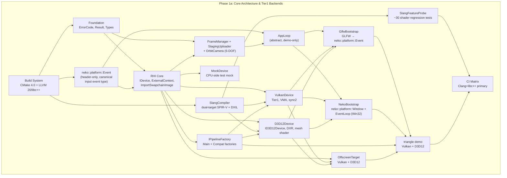
```mermaid
graph TD
    subgraph "Phase 1a: Core Architecture & Tier1 Backends"
        BUILD["Build System<br/>CMake 4.0 + LLVM 20/libc++"]
        FOUND["Foundation<br/>ErrorCode, Result, Types"]
        NEKO_EVT["neko::platform::Event<br/>(header-only, canonical<br/>input event type)"]
        RHI["RHI Core<br/>IDevice, ExternalContext,<br/>ImportSwapchainImage"]
        IPIPE["IPipelineFactory<br/>Main + Compat factories"]
        VK["VulkanDevice<br/>Tier1, VMA, sync2"]
        D3D["D3D12Device<br/>ID3D12Device, DXR, mesh shader"]
        MOCK["MockDevice<br/>CPU-side test mock"]
        OFF["OffscreenTarget<br/>Vulkan + D3D12"]
        SLANG["SlangCompiler<br/>dual-target SPIR-V + DXIL"]
        PROBE["SlangFeatureProbe<br/>~30 shader regression tests"]
        APPLOOP["AppLoop<br/>(abstract, demo-only)"]
        GLFW_BE["GlfwBootstrap<br/>GLFW → neko::platform::Event"]
        NEKO_BE["NekoBootstrap<br/>neko::platform::Window +<br/>EventLoop (Win32)"]
        FRAME["FrameManager + StagingUploader<br/>+ OrbitCamera (6-DOF)"]
        DEMO["triangle demo<br/>Vulkan + D3D12"]
        CI["CI Matrix<br/>Clang+libc++ primary"]

        BUILD --> FOUND
        BUILD --> SLANG
        BUILD --> NEKO_EVT
        FOUND --> RHI
        NEKO_EVT --> RHI
        RHI --> IPIPE
        RHI --> VK
        RHI --> D3D
        RHI --> MOCK
        RHI --> OFF
        VK --> OFF
        D3D --> OFF
        SLANG --> PROBE
        SLANG --> VK
        SLANG --> D3D
        IPIPE --> VK
        IPIPE --> D3D
        FOUND --> FRAME
        RHI --> FRAME
        NEKO_EVT --> APPLOOP
        FRAME --> APPLOOP
        APPLOOP --> GLFW_BE
        APPLOOP --> NEKO_BE
        VK --> GLFW_BE
        D3D --> GLFW_BE
        VK --> NEKO_BE
        D3D --> NEKO_BE
        GLFW_BE --> DEMO
        NEKO_BE --> DEMO
        IPIPE --> DEMO
        OFF --> DEMO
        PROBE --> CI
        DEMO --> CI
    end
```

**Key difference from current miki**: Core API design (injection-first `IDevice`, `ExternalContext`, `ImportSwapchainImage`) locked down before expanding to all backends. Slang feature probe catches cross-target miscompiles from day one. C++23 module toolchain validated on first day.

---

### Phase 1b: Compat Backends & Full Coverage (Weeks 3–4)

**Goal**: Expand to **all five backends** — add Vulkan Tier2 Compat, OpenGL 4.3, WebGPU/Dawn. Slang gains GLSL 4.30 + WGSL targets (quad-target). Shader hot-reload. Colored triangle on all 5 backends. `CompatPipelineFactory` validated.

| Component | Deliverable |
|-----------|-------------|
| **Vulkan Tier2 Compat Backend** | Same `VulkanDevice` with `Tier2_Compat` profile — disables mesh shader, RT, VRS, 64-bit atomics, descriptor buffer. Validates Vulkan 1.1 feature subset. Vertex shader + `vkCmdDrawIndexed` path. Used on GTX 10xx / RX 500 / Intel UHD. |
| **OpenGL Tier4 Backend** | `OpenGlDevice` — `IDevice` implementation wrapping an **externally-provided** OpenGL 4.3+ context (host makes it current before calling miki). No GLFW dependency — miki only needs a valid current GL context + `glGetProcAddress` function pointer (via glad loader). `OpenGlCommandBuffer` — deferred command recording (`std::vector<GlCommand>`), flushed on `Submit()`. Push constant → 128B UBO emulation. `glMemoryBarrier` mapping. `glMultiDrawElementsIndirect` for batched draws. Slang → GLSL 4.30 compilation. GL debug callback (`GL_KHR_debug`). |
| **WebGPU Tier3 Backend** | `WebGpuDevice` — `IDevice` implementation via Dawn (native C++) or wgpu-native. **Accepts external `WGPUSurface` for swapchain creation**. Push constant → 256B UBO (bind set 0 slot 0). `WebGpuCommandBuffer` — maps to `wgpu::CommandEncoder`. Slang → WGSL compilation. Emscripten + WASM build. Texture format subset fallback (no BC → uncompressed). Single-queue render graph path. |
| **OffscreenTarget (GL + WebGPU)** | Extend `OffscreenTarget` to GL (`FBO` + `glRenderbufferStorageMultisample`) and WebGPU (`GPUTexture` offscreen canvas). Phase 1a delivered Vulkan + D3D12 offscreen; Phase 1b completes all 5 backends. |
| **Slang Compiler (quad-target)** | Extend `SlangCompiler` to **SPIR-V + DXIL + GLSL 4.30 + WGSL** quad-target. CI validates all shaders compile to all four targets. **SlangFeatureProbe** extended: GLSL-specific tests (BDA→SSBO mapping, `layout(binding)` vs descriptor set, texture unit limits) + WGSL-specific tests (storage buffer alignment, workgroup size limits, no 64-bit atomics → error). |
| **Shader Hot-Reload** | `ShaderWatcher` — file watcher on `.slang`, `#include` dependency tracking, atomic pipeline swap via generation counter. Error overlay (ImGui). Works on all backends (GL: `glDeleteProgram` + relink; WebGPU: `wgpu::Device::CreateShaderModule` + recreate pipeline). |
| **Demos** | `triangle` — colored triangle at 60fps on **all 5 backends**. CLI flag `--backend vulkan|compat|d3d12|gl|webgpu`. WebGPU demo also compiles to WASM and runs in browser. D3D12 demo Windows-only. |
| **Tests** | ~50 (cumulative with 1a: ~130): OpenGlDevice creation (GTEST_SKIP on no-GL), WebGpuDevice creation (Dawn headless), Vulkan Compat tier detection, Slang GLSL + WGSL compilation, SlangFeatureProbe GLSL/WGSL extensions (~15 new), hot-reload lifecycle, staging upload (GL + WebGPU), push constant UBO emulation correctness (GL + WebGPU), OffscreenTarget GL + WebGPU. |
| **CI Matrix** | **Primary**: Windows Clang 20 + libc++ × (Vulkan Tier1 + Vulkan Compat + D3D12 + Dawn headless) + Linux Clang 20 + libc++ × (Vulkan Tier1 + Vulkan Compat + OpenGL llvmpipe + Dawn headless) × (ASAN/TSAN/UBSAN). **Secondary**: Windows MSVC 17.12+ × (all backends). **Tertiary**: Linux GCC 15+ / libstdc++ × (Vulkan + GL). All 5 backend triangle demos produce correct output. Golden image diff across backends <5%. |

**Component Dependency Graph (Phase 1b)**:

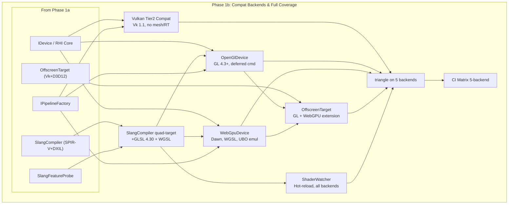
```mermaid
graph TD
    subgraph "Phase 1b: Compat Backends & Full Coverage"
        subgraph "From Phase 1a"
            RHI_1a["IDevice / RHI Core"]
            SLANG_1a["SlangCompiler (SPIR-V+DXIL)"]
            PROBE_1a["SlangFeatureProbe"]
            OFF_1a["OffscreenTarget (Vk+D3D12)"]
            IPIPE_1a["IPipelineFactory"]
        end

        VK2["Vulkan Tier2 Compat<br/>Vk 1.1, no mesh/RT"]
        GL["OpenGlDevice<br/>GL 4.3+, deferred cmd"]
        WGPU["WebGpuDevice<br/>Dawn, WGSL, UBO emul"]
        OFF2["OffscreenTarget<br/>GL + WebGPU extension"]
        SLANG4["SlangCompiler quad-target<br/>+GLSL 4.30 + WGSL"]
        HOTRL["ShaderWatcher<br/>Hot-reload, all backends"]
        DEMO["triangle on 5 backends"]
        CI["CI Matrix 5-backend"]

        RHI_1a --> VK2
        RHI_1a --> GL
        RHI_1a --> WGPU
        SLANG_1a --> SLANG4
        SLANG4 --> GL
        SLANG4 --> WGPU
        SLANG4 --> HOTRL
        PROBE_1a --> SLANG4
        OFF_1a --> OFF2
        GL --> OFF2
        WGPU --> OFF2
        IPIPE_1a --> VK2
        IPIPE_1a --> GL
        IPIPE_1a --> WGPU
        VK2 --> DEMO
        GL --> DEMO
        WGPU --> DEMO
        OFF2 --> DEMO
        HOTRL --> DEMO
        DEMO --> CI
    end
```

**Key difference**: All five backends validated against real output. RHI never accumulates API-specific assumptions. D3D12 and Vulkan both support Tier1_Full (mesh shader + RT + bindless); D3D12 Tier formalization deferred to post-ship. `IPipelineFactory` abstraction proven before any rendering features are added. Mock exists for CI only.

---

### Phase 2: Forward Rendering & Depth (Weeks 5–10)

**Goal**: Render 1000+ meshes with depth testing, lighting, camera control, ImGui overlay. **All 5 backends**.

| Component | Deliverable |
|-----------|-------------|
| **Mesh Upload** | Vertex/index buffer creation via `StagingUploader`. Mesh data struct (positions, normals, indices, optional tangent float4). Backend-agnostic — same API on Vulkan, GL (`glCreateBuffers`), WebGPU (`wgpu::Device::CreateBuffer`). Tangent field declared but empty in Phase 2 (populated in Phase 3a+ via MikkTSpace). |
| **Pipeline** | `GraphicsPipelineDesc` with depth test, back-face cull, polygon mode, `BlendState`, `CompareOp`. Tier1: dynamic rendering pipeline. Tier2/4: vertex shader pipeline. Tier3: WebGPU render pipeline. Split into 3 sub-tasks: T2.2.1a (real pipeline Vk+D3D12), T2.2.1b (CopyTextureToBuffer/CopyBufferToTexture + real ReadPixels, all 5 backends), T2.2.1c (golden image comparison utility). |
| **Swapchain (Windowed Present)** | `ISwapchain` — lightweight single-window present abstraction (Vulkan `VkSwapchainKHR` + D3D12 `IDXGISwapChain`). `AcquireNextImage() → TextureHandle`, `Present()`, `Resize()`, `GetSubmitSyncInfo() → SubmitSyncInfo`. Swapchain images imported via `ImportSwapchainImage`. **Per-frame-in-flight sync** (`kMaxFramesInFlight=2`): arrays of semaphores + fences per frame slot; `SubmitSyncInfo{waitSemaphores, signalSemaphores, signalFence}` passed to `IDevice::Submit()` (default `{}` = backward compatible). `AcquireNextImage()` does fence-wait for CPU↔GPU throttle; `Present()` rotates frame slot. Demo render loop: `Acquire → GetSubmitSyncInfo → Submit(cmd, sync) → Present`. `GlfwBootstrap` integration. GL uses native `glfwSwapBuffers` (no `ISwapchain` needed). WebGPU deferred to T2.2.2. **T2.2.3**. **⚠ Phase 12 refactor target**: `ISwapchain` is an intentionally minimal stopgap — Phase 12 `RenderSurface` absorbs and replaces it. `SubmitSyncInfo` is forward-compatible infrastructure reused by `RenderSurface`. See `specs/phases/phase-03-2/T2.2.3.md` §Architecture Decision for sync details, §Phase 2↔Phase 12 Relationship for migration contract. |
| **Descriptor System** | `DescriptorSetLayout`, `PipelineLayout`, `DescriptorSet` creation + update on `IDevice`. Push constants for per-draw transforms (Vulkan: native push constants; GL: 128B UBO `glBufferSubData`; WebGPU: 256B UBO bind set 0). Phase 2 uses **traditional descriptor sets on all backends** (Vulkan `vkAllocateDescriptorSets`, D3D12 descriptor heap, GL UBO/SSBO bindings, WebGPU bind groups). `VK_EXT_descriptor_buffer` deferred to Phase 4 `BindlessTable`. |
| **Material System** | `IMaterial` Slang interface (`ShadeSurface → float4`). `StandardPBR` (Cook-Torrance GGX) with **anisotropic BRDF extension** + **clearcoat top-layer Fresnel** + **Kulla-Conty multi-scattering compensation**. Anisotropic: GGX-Smith anisotropic NDF (Heitz 2014), `roughnessX/Y = roughness × (1±anisotropy)`. +2 ALU vs isotropic. Clearcoat: minimal Fresnel top-layer (`F_Schlick(VoH, 0.04) * clearcoat`) + isotropic GGX specular, attenuates base BRDF by `(1-Fc)`. +5 ALU. Ensures carbon fiber preset (`clearcoat=0.8`) renders correctly. Full clearcoat (separate normal, thickness) deferred to Phase 3a. Multi-scattering: `KullaContyLut` class (renamed from BrdfLut for clarity) generates `E_lut` (512×512 R16F) + `E_avg` (512×1 R16F). Phase 3a IBL adds separate `SplitSumLut` (RG16F). Matches Dassault Enterprise PBR spec-2025x. `MaterialRegistry` (hash-dedup). **Built-in CAD material presets**: metals (steel, aluminum, titanium, copper, brass, chrome, **brushed aluminum** `anisotropy=0.7 angle=0`, **brushed steel** `anisotropy=0.6 angle=0`), plastics (ABS, nylon, polycarbonate, PMMA), glass (clear, tinted, frosted), rubber (black, silicone), ceramics (white, porcelain), **carbon fiber** (`anisotropy=0.8 angle=π/4`, clearcoat=0.8), wood (oak, walnut). |
| **Forward Pass** | Single-pass forward: vertex transform + PBR material evaluation. `LightBuffer` UBO (MAX_LIGHTS=4, all tiers in Phase 2; Phase 3a upgrades Tier1/2 to SSBO via `StructuredBuffer<Light>`, capacity N; Tier3/4 remain UBO). 3-step API: `BeginPass(cmdBuf, renderTarget)` / `RecordDraws(cmdBuf, draws, camera, lights)` / `EndPass(cmdBuf)` — Phase 3a render graph calls only `RecordDraws()`, zero refactor. Depth format from `CapabilityProfile::preferredDepthFormat()` (D32F default, D24S8 fallback). **Duff-Frisvad-Nayar-Stein-Ling revised ONB** (JCGT 2017) for TBN construction in fragment shader (no tangent attribute in Phase 2) — fixes original Frisvad singularity at normal ≈ (0,0,-1). normalMatrix computed in vertex shader from model matrix (not via push constants). **GPU timestamp query**: basic `CreateTimestampQueryPool` / `WriteTimestamp` / `GetTimestampResults` on `IDevice`, all 5 backends. **Golden image comparison utility**: `GoldenImageCompare()` RMSE-based, shared by all integration tests. Performance target: 1000 draws < 2ms GPU. Both main and compat paths identical at this stage. |
| **ImGui Backend** | `ImGuiBackend` — multi-backend ImGui (Vulkan, D3D12, OpenGL, WebGPU). Frame stats panel. Backend auto-detected from `IDevice` type. |
| **TextRenderer** | GPU text rendering infrastructure (FreeType + HarfBuzz + MSDF + virtual glyph atlas). Used by PMI, sketch, CAE labels, measurement, markup, HUD. See **TextRenderer Details** below. |
| **5-Backend Sync** | All 5 backends render `forward_cubes` demo. Slang shaders compiled to SPIR-V + DXIL + GLSL + WGSL. Golden image diff <5% across backends. CI runs all 5 backend tests. |
| **Demo** | `forward_cubes` — 1000 procedural cubes, orbit camera, PBR, ImGui FPS overlay. `text_demo` — ASCII + CJK + engineering symbols rendered at multiple sizes (8px–72px), world-space billboarded labels, MSDF vs bitmap fallback with [8,16]px crossfade band (Behdad State of Text 2024: hinted bitmap <16ppem still superior). Runs on all 5 backends. **Parallel tracks**: Components 1-6 (forward rendering core) and Component 7 (TextRenderer) assignable to separate sub-teams. |
| **Tests** | ~145: MeshData(7), Pipeline(12: 6 T2.2.1a + 6 T2.2.2), TextureCopy(4: T2.2.1b), GoldenImage(2: T2.2.1c), Swapchain(6: T2.2.3), Descriptor(14: 10+4 writer), Material(12: T2.4.1=7 incl. clearcoat+KullaContyLut, T2.4.2=5), ForwardPass(11: 9+timestamp+Frisvad), ImGui(8), TextRenderer(50: font=7, shaping=9, msdf=6, atlas=7, pipeline=8, richtext=7, outline=6), forward_cubes E2E(7), text_demo E2E(5), shader(3). |

#### TextRenderer — Details

`TextRenderer` — **GPU text rendering infrastructure** used by all modules that display text (PMI, sketch dimensions, CAE labels, measurement, markup, HUD). Established early as shared foundation.

**Font loading**: `FontManager` — loads TTF/OTF via **FreeType 2** (font parsing, hinting, metrics). System font discovery (platform-specific: `DirectWrite` on Windows, `fontconfig` on Linux, `CTFontManager` on macOS). Font fallback chain (e.g., primary -> CJK -> symbol -> last-resort).

**Text shaping**: **HarfBuzz** integration — complex script shaping (kerning, ligatures, RTL Arabic/Hebrew, vertical CJK, combining marks). **ShapingCache** — LRU cache (key = `hash(string, fontId, fontSize, isRTL)`, 1024 entries) avoids re-shaping repeated strings (e.g. PMI labels, axis names, HUD counters). For ASCII-only fast path: simple left-to-right advance-width layout (no HarfBuzz call, <0.01ms).

**Glyph rendering — MSDF pipeline**: `MsdfGlyphCache` — generates **4-channel MSDF** (Multi-channel Signed Distance Field) glyph bitmaps via **msdfgen** (CPU, MIT license). MSDF preserves sharp corners at arbitrary scale (superior to single-channel SDF). Glyph size: 32x32 px per em (configurable). Generation: ~0.5ms/glyph on CPU. **AsyncMsdfBatch** — background `std::jthread` generates MSDF glyphs off the render thread; pending glyphs display a placeholder (solid quad at 50% alpha) until ready, avoiding CJK first-frame stalls when loading hundreds of new glyphs.

**Dynamic Virtual Atlas**: `GlyphAtlas` — virtual texture atlas with page-based management.

- **Resident pages** (always loaded): ASCII (U+0020-U+007E, 95 glyphs), Latin Extended (U+00A0-U+024F, ~400 glyphs), engineering symbols (~50 glyphs), GD&T symbols (ISO 1101 set, ~30 glyphs).
- **On-demand pages**: CJK Unified Ideographs (U+4E00-U+9FFF, ~20K glyphs, loaded per-page of 256 glyphs as accessed), Hangul (U+AC00-U+D7AF), Arabic (U+0600-U+06FF), Cyrillic, etc.
- Page size: 256 glyphs per 512x512 texture page. LRU eviction when atlas exceeds budget (default 16 pages = 8M texels).
- **Total atlas capacity**: ~4K resident + ~60K on-demand glyphs — sufficient for full CJK + multi-script.
- Fallback: if virtual texture paging unavailable, use **multi-page atlas** (4x2Kx2K = 16K glyph capacity, pre-allocated).

**GPU rendering pipeline**: compute shader glyph layout (input: `TextDrawCmd {string, position, fontId, size, color, flags}` -> output: instanced quad buffer `{pos, uv, color}` per glyph). Fragment shader: sample MSDF atlas, `median(r,g,b)` -> distance -> `smoothstep` for anti-aliased coverage. Screen-space text: pixel-snapped quad positions (no sub-pixel jitter). World-space text: billboarded or plane-anchored, with mm/px dual sizing.

**Small-size fallback with crossfade**: for text <8px screen height, use **pre-rasterized hinted bitmap cache** (FreeType rasterizer with auto-hinter, per-size cache). In the **[8,16]px crossfade band**, both MSDF and bitmap atlas entries coexist; fragment shader blends: `float t = smoothstep(8.0, 16.0, effectiveScreenPx); alpha = mix(bitmapAlpha, msdfAlpha, t);`. Above 16px, pure MSDF. This eliminates visible pop during continuous scroll-zoom (Behdad, State of Text 2024: hinted bitmap <16ppem still superior). Threshold band configurable.

**Continuous zoom quality**: MSDF `screenPxRange` is clamped to `max(screenPxRange(), 1.0)` in the fragment shader — prevents salt-and-pepper noise when world-space text is very far. When `screenPxRange < 1.0`, overall alpha fades proportionally (`saturate(screenPxRange())`), ensuring distant labels smoothly disappear rather than becoming noisy artifacts. World-space text labels undergo frustum culling before shaping to avoid wasted CPU/GPU work on off-screen labels.

**Print-quality vector output**: `TextRenderer::GetGlyphOutlines(string, font) -> vector<BezierPath>` — extract TTF glyph outlines for SVG/PDF embedding (Phase 15a). Text in vector exports uses embedded font subsets, not rasterization.

**Rich text support**: `RichTextSpan` — `{start, end, fontId, size, bold, italic, underline, strikethrough, color, superscript, subscript}`. `RichTextLayout` — processes span array -> per-glyph position/style. Supports inline format changes (bold/italic mid-string), superscript/subscript (0.7x size, vertical offset), underline/strikethrough (SDF line at baseline offset). Used by PMI annotation editing, markup canvas text tool, and `RichTextInput` (Phase 9).

**Special symbol atlas**: dedicated MSDF page for CAD/CAE symbols not in Unicode — welding symbols (ISO 2553 set), surface texture symbols (ISO 1302), GD&T feature control frame elements, electrical symbols. Pre-baked at build time.

**GPU Direct Curve Rendering (Phase 7b quality upgrade)**: for text >48px screen height or when maximum quality is required (PMI annotation editing, print preview, zoom-in focus), switch from MSDF atlas sampling to **GPU direct Bézier curve rendering** — fragment shader computes per-pixel winding number from glyph outline curves stored in a storage buffer (SSBO/StructuredBuffer). Algorithm based on Lengyel 2017 (Slug) / GreenLightning approach: per-glyph bounding quad → fragment shader iterates curve segments → solves quadratic intersection → accumulates winding number → coverage. **Subpixel AA (opt-in)**: on LCD displays, evaluate coverage at 3 subpixel offsets (R/G/B) per pixel for ~3× effective horizontal resolution (osor.io 2025 technique). Subpixel layout detected via platform API (`GetFontSmoothingOrientation` / fontconfig `rgba`). Disabled by default on OLED/HiDPI (coverage AA sufficient at ≥192 DPI). **Band-based curve acceleration**: split glyph vertically into N bands, per-band bitset marks relevant curves, reducing per-pixel intersection count from O(curves) to O(curves/N). **Hybrid pipeline**: `TextRenderer` selects rendering path per-glyph based on `effectiveScreenPx`: [0,8) bitmap+hinting → [8,16) crossfade → [16,48) MSDF atlas → [48,∞) direct curve. Thresholds configurable. **5-backend compatible**: only requires storage buffer read in fragment shader — supported by Vulkan (SSBO), D3D12 (StructuredBuffer), GL 4.3 (SSBO), WebGPU (storage buffer, read-only). No compute shader, no atomics, no prefix sum. **Temporal accumulation (stretch goal)**: for static text, accumulate multi-sample coverage across frames (8 initial → 1/frame → 512 max) for ultra-smooth AA convergence. **Quality target**: with direct curve + subpixel AA, screen-space text at 12-16px matches Skia/FreeType hinted output quality; world-space PMI text at any zoom level renders with zero aliasing artifacts.

**CAD Rich Text Annotation Editing (Phase 7b prerequisite → Phase 9 full)**: CAD applications require in-viewport rich text editing for PMI annotations, dimension notes, title block templates, and markup text. Phase 7b establishes the **read-only rendering** of rich text PMI entities imported from STEP AP242 (using `TextRenderer` + `RichTextSpan`). Phase 9 builds the full **`RichTextInput` editor** — GPU-rendered editable text field with cursor, selection, clipboard, IME/CJK, undo/redo, inline formatting (bold/italic/underline/color/super/subscript), `SymbolPalette` for GD&T/welding symbols, `$PROPERTY` auto-complete from `CadScene` attributes, and `RichTextDocument` JSON serialization attached to PMI entities. Phase 7b must ensure: (a) `RichTextSpan` can represent all PMI text styles (tolerances, stacked fractions, GD&T frames), (b) `TextRenderer` supports inline symbol insertion from engineering atlas, (c) Color Emoji + paragraph BiDi are functional (see "Color Emoji & BiDi" component in Phase 7b).

**Performance**: <0.1ms for 1000 glyphs (instanced quads), <0.5ms for 10K glyphs (CAE labels). Direct curve path: <0.3ms for 100 large glyphs (>48px). Atlas upload: async via `StagingUploader` on first access, non-blocking. **Dynamic quality target**: continuous scroll-zoom from 72px to 4px produces no visible pop or flicker at any frame; world-space labels at camera distance > 100m fade out smoothly without noise.

**Component Dependency Graph (Phase 2)**:

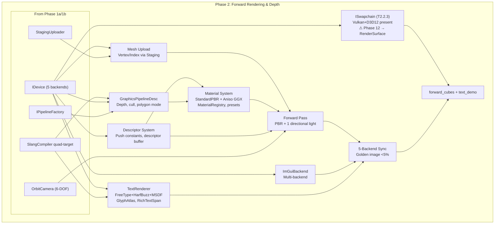
```mermaid
graph TD
    subgraph "Phase 2: Forward Rendering & Depth"
        subgraph "From Phase 1a/1b"
            RHI["IDevice (5 backends)"]
            STAGE["StagingUploader"]
            SLANG["SlangCompiler quad-target"]
            IPIPE["IPipelineFactory"]
            CAM["OrbitCamera (6-DOF)"]
        end

        MESH["Mesh Upload<br/>Vertex/Index via Staging"]
        PIPE["GraphicsPipelineDesc<br/>Depth, cull, polygon mode"]
        SWAP["ISwapchain (T2.2.3)<br/>Vulkan+D3D12 present<br/>⚠ Phase 12 → RenderSurface"]
        DESC["Descriptor System<br/>Push constants, descriptor buffer"]
        MAT["Material System<br/>StandardPBR + Aniso GGX<br/>MaterialRegistry, presets"]
        FWD["Forward Pass<br/>PBR + 1 directional light"]
        IMGUI["ImGuiBackend<br/>Multi-backend"]
        TEXT["TextRenderer<br/>FreeType+HarfBuzz+MSDF<br/>GlyphAtlas, RichTextSpan"]
        SYNC["5-Backend Sync<br/>Golden image <5%"]
        DEMO["forward_cubes + text_demo"]

        RHI --> MESH
        STAGE --> MESH
        SLANG --> PIPE
        RHI --> PIPE
        RHI --> SWAP
        RHI --> DESC
        DESC --> MAT
        PIPE --> MAT
        MESH --> FWD
        MAT --> FWD
        DESC --> FWD
        CAM --> FWD
        RHI --> IMGUI
        RHI --> TEXT
        SLANG --> TEXT
        FWD --> SYNC
        IMGUI --> SYNC
        TEXT --> SYNC
        SWAP --> DEMO
        SYNC --> DEMO
        IPIPE --> PIPE
    end
```

---

### Phase 3a: Render Graph & Deferred Pipeline (Weeks 10–12)

**Goal**: Declarative render graph, GBuffer, deferred PBR lighting, tone mapping. This is the engine's backbone — all subsequent GPU work plugs in as render graph nodes. **All 5 backends**. Render graph executor has backend-specific paths: Vulkan (dynamic rendering + pipeline barriers), D3D12 (render pass + resource barriers), GL (FBO bind/unbind + `glMemoryBarrier`), WebGPU (render pass encoder + buffer/texture transitions).

| Component | Deliverable |
|-----------|-------------|
| **Render Graph** | `RenderGraphBuilder` — declare passes (graphics/compute/transfer), resources (texture/buffer), read/write deps. Resources use `std::variant` (transient texture/buffer, imported texture/buffer). `RGTextureDesc` includes usage flags, dimension, arrayLayers. `RGBufferDesc` uses typed `RGBufferUsage` enum. Handles embed generation for stale-handle detection. Builder supports `Reset()` for per-frame reuse. `RenderGraphCompiler` — Kahn sort, cycle detection, barrier insertion, resource lifetime, transient aliasing, **dead pass culling** (reverse reachability BFS from external outputs; side-effect passes marked `side_effect=true` survive). `RenderGraphExecutor` — allocate transients, emit barriers, wrap in `BeginRendering`/`EndRendering`. `RenderGraphCache` — hash graph structure; skip recompilation when no structural change (static scene optimization). |
| **GBuffer** | Albedo+Metallic (RGBA8), Normal+Roughness (RGBA16F), Depth (D32F), Motion (RG16F). |
| **PBR Lighting** | Cook-Torrance BRDF, metallic-roughness. Deferred lighting compute pass. Multiple lights. |
| **IBL & Environment** | `EnvironmentMap` — HDRI equirectangular → cubemap conversion (compute shader, one-time). Pre-filtered specular mip chain (split-sum GGX, 5 mip levels, compute). Diffuse irradiance convolution (spherical harmonics L2, 9 coefficients, or low-res cubemap 32³). `EnvironmentRenderer` — skybox pass (cubemap sample at infinity depth) + IBL lighting in deferred resolve (specular: pre-filtered env × BRDF LUT; diffuse: irradiance SH). BRDF LUT (512×512 RG16F, generated once). Environment rotation (uniform). Exposure-matched to scene (auto-exposure feedback). Built-in presets: studio soft, studio hard, outdoor overcast, outdoor sunny, neutral gray. Custom HDRI load via `.hdr`/`.exr`. **Background mode**: `BackgroundMode` enum — `SolidColor` (user-defined RGB), `VerticalGradient` (top/bottom colors, GPU lerp), `HDRI` (environment cubemap), `Transparent` (alpha=0, for compositing/screenshot export). Default: `HDRI`. Mode switch at zero cost (skybox pass conditional). **Ground plane shadow/AO receiver**: optional infinite ground plane that receives VSM shadow + GTAO but does not occlude scene — eliminates "floating object" appearance in product visualization. Screen-space contact shadows (ray-march in depth buffer, 8 steps, <0.3ms) for small-scale occlusion near contact points. |
| **Tone Mapping** | ACES filmic (Narkowicz 2015). `ToneMappingMode` enum `{AcesNarkowicz, Neutral, Reinhard}` — Phase 3a implements ACES only; Neutral/Reinhard are placeholder stubs. Exposure control. Final blit pass. |
| **5-Backend Sync** | Render graph executes on all 5 backends. Vulkan: pipeline barriers + dynamic rendering. D3D12: resource barriers + render passes. GL: `glMemoryBarrier` + FBO bind/unbind. WebGPU: render pass encoder transitions. Compat/GL/WebGPU: deferred resolve via fragment shader (no compute on WebGPU Tier3 for lighting resolve — use fullscreen triangle). Golden image parity: per-backend PSNR > 30 dB vs Vulkan Tier1 reference; RMSE < 0.02 normalized. |
| **Demo** | `deferred_pbr_basic` — 49 PBR spheres, deferred lighting, orbit camera, ImGui overlay. Runs on all 5 backends. |
| **Tests** | ~77 (render graph core incl. 12 builder hardening) + ~50 (TextRenderer, merged from Phase 2) = ~127 total. Graph compilation, per-backend barrier correctness (Vulkan + D3D12 + GL + WebGPU), transient aliasing memory reduction, conditional pass skip, cycle detection, graph cache hit/miss + debug collision detection, PBR BRDF energy conservation, GBuffer MRT formats + motion vector non-zero + zero-size error, ToneMap ACES + high-exposure clamp + unsupported-mode assert, EnvironmentMap invalid-HDRI error, render graph single-queue fallback (GL/WebGPU), FBO render target (GL), WebGPU render pass encode. TextRenderer: font loading + metrics, shaping + cache, MSDF generation + async batch, atlas packing + LRU, GPU pipeline + instanced quad, RichText layout, outline extraction. |

**Component Dependency Graph (Phase 3a)**:

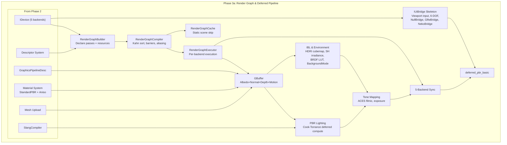
```mermaid
graph TD
    subgraph "Phase 3a: Render Graph & Deferred Pipeline"
        subgraph "From Phase 2"
            RHI["IDevice (5 backends)"]
            PIPE["GraphicsPipelineDesc"]
            MAT["Material System<br/>StandardPBR + Aniso"]
            DESC["Descriptor System"]
            SLANG["SlangCompiler"]
            MESH_UP["Mesh Upload"]
        end

        RG_BUILD["RenderGraphBuilder<br/>Declare passes + resources"]
        RG_COMP["RenderGraphCompiler<br/>Kahn sort, barriers, aliasing"]
        RG_EXEC["RenderGraphExecutor<br/>Per-backend execution"]
        RG_CACHE["RenderGraphCache<br/>Static scene skip"]
        GBUF["GBuffer<br/>Albedo+Normal+Depth+Motion"]
        PBR_LIT["PBR Lighting<br/>Cook-Torrance deferred compute"]
        IBL["IBL & Environment<br/>HDRI cubemap, SH irradiance,<br/>BRDF LUT, BackgroundMode"]
        TONE["Tone Mapping<br/>ACES filmic, exposure"]
        UIBRIDGE["IUiBridge Skeleton<br/>Viewport input, 6-DOF,<br/>NullBridge, GlfwBridge, NekoBridge"]
        SYNC["5-Backend Sync"]
        DEMO["deferred_pbr_basic"]

        RHI --> RG_BUILD
        DESC --> RG_BUILD
        RG_BUILD --> RG_COMP
        RG_COMP --> RG_EXEC
        RG_COMP --> RG_CACHE
        RG_EXEC --> GBUF
        PIPE --> GBUF
        MAT --> GBUF
        MESH_UP --> GBUF
        GBUF --> PBR_LIT
        SLANG --> PBR_LIT
        GBUF --> IBL
        PBR_LIT --> TONE
        IBL --> TONE
        TONE --> SYNC
        RG_EXEC --> SYNC
        RHI --> UIBRIDGE
        SYNC --> DEMO
        UIBRIDGE --> DEMO
    end
```

**Key Architecture Decisions (Phase 3a)**:
- **IBL integration model**: IBL terms (specular pre-filtered env + BRDF LUT + diffuse irradiance SH) are computed **inside** the deferred resolve pass via `DeferredResolve::Execute(... EnvironmentRenderer const* env)`. `EnvironmentRenderer` is a data provider, not a separate lighting pass. Skybox is the only independent graphics pass.
- **ExecuteFn lambda lifetime**: captured references/pointers must outlive `RenderGraphExecutor::Execute()` for the current frame. Same contract as UE5 RDG / Filament FrameGraph.
- **RenderGraphExecutor barrier strategy**: barriers OR-merge `srcStage`/`dstStage` across all `BarrierCommand`s per pass (not overwrite). GL/WebGPU backends skip barrier emission entirely. `BarrierCommand` and `CompiledPass` include pre-reserved fields for split barriers (Phase 4-5) and async compute queue ownership (`RGQueueType`, Phase 6-7). Buffer usage mapping is explicit (not bit-cast) due to `RGBufferUsage` ↔ `rhi::BufferUsage` layout mismatch.
- **TextRenderer ↔ RenderGraph**: Phase 3a TextRenderer uses direct `ICommandBuffer` recording (post-tone-map UI overlay). `RegisterAsPass(RenderGraphBuilder&) -> RGHandle` declared as stub; Phase 3b activates for TAA reactive mask.
- **RenderGraphCache debug collision detection**: debug builds perform full structural comparison on hash hit; assert on mismatch.
- **AsyncMsdfBatch ↔ GlyphAtlas thread boundary**: SPSC lock-free ring buffer (256 entries). Producer = jthread, consumer = render thread `FlushUploads()`.
- **Ground plane**: deferred to Phase 3b (requires VSM shadow data). Phase 3a prepares depth buffer only.
- **`EnvironmentMap::CreateFromHDRI`**: accepts raw `.hdr`/`.exr` file bytes; internal decoding via stb_image_hdr (private dependency).
- **`ToneMappingMode`**: enum `{AcesNarkowicz, Neutral, Reinhard}`. Phase 3a implements ACES only; others are placeholder stubs.

**Milestone gate**: Render graph compiles and executes correctly on all 5 backends. Phase 4 (Resource) may start after this gate.

**IUiBridge Skeleton (introduced at Phase 3a gate)**: At this milestone, define the **minimal `IUiBridge` skeleton** — viewport interaction subset only. This ensures all subsequent demos drive input through the bridge, not hardcoded GLFW/neko callbacks. **Canonical event type**: `IUiBridge::OnInputEvent(neko::platform::Event)` — uses `neko::platform::Event` (`std::variant<CloseRequested, Resize, MouseMove, MouseButton, KeyDown, KeyUp, Scroll, TextInput, Focus, DpiChanged>`) directly as the input event type. No miki-specific `InputEvent` wrapper — neko's definition is canonical. **Minimal interface**: `GetViewportRect() → Rect`, `ScreenToWorld(x,y) → Ray` (requires `SetCamera(ICamera const*)` — returns zero ray if no camera set), `WorldToScreen(pos) → Point2D`, `SetCamera(ICamera const*) → void`, `OnResize(w,h)`, `OnInputEvent(neko::platform::Event) → bool` (returns true if consumed — enables Phase 9 event propagation control), `OnContinuousInput(ContinuousInputState)` (**6-DOF input**: `{float3 translationVelocity, float3 rotationVelocity, float dominantAxis}` — frame-rate decoupled velocity integration for 3Dconnexion SpaceMouse and generic HID 6-DOF devices; `OrbitCamera` consumes this via velocity × deltaTime with configurable sensitivity curve and dominant-axis lock), `OnFocusChange(focused)`. **Implementations**: `NullBridge` (headless, no-op), `GlfwBridge` (wraps GLFW callbacks → `neko::platform::Event` → `OnInputEvent`, lives in `demos/framework/glfw/`), `NekoBridge` (wraps `neko::platform::EventLoop` poll → `OnInputEvent`, near 1:1, lives in `demos/framework/neko/`). All demo code from Phase 3b onwards receives input via `IUiBridge::OnInputEvent`, not via GLFW/neko callbacks directly. **Phase 13 coroutine extension (preview)**: `IUiBridge` will gain `NextEvent() → coca::Task<neko::platform::Event>` (coroutine event stream for tool state machines) and `ExecuteOpAsync(cmd, params) → coca::Task<OpResult>` (async long operations). These are added when Coca is ready (Phase 13) — the Phase 3a skeleton is callback-only. Scene Model Queries (`GetAssemblyTree`, `GetEntityAttributes`, etc.) added later when CadScene exists (Phase 8). Command interface (`SetVisibility`, `ExecuteOp`, etc.) added when interactive tools exist (Phase 9). This incremental approach prevents the front-loading problem while ensuring API contracts are established early.

---

### Phase 3b: Shadows, Post-Processing & Visual Regression (Weeks 13–16) ∥ Phase 4

**Goal**: VSM shadows, TAA + temporal upscale, AO (GTAO), VRS, **Bloom**, **tone mapping options** (ACES + AgX + Khronos PBR Neutral), visual regression CI. All plug into the render graph from Phase 3a. RTAO deferred to Phase 7a-2 when BLAS/TLAS is available. SSR/DoF/MotionBlur/CAS/ColorGrading deferred to Phase 7a-2 (requires full deferred pipeline + motion vectors). **Tier-differentiated**: VSM (Tier1), CSM (Tier2/3/4); TAA+FSR (Tier1/2), FXAA (Tier3/4); GTAO (Tier1/2), SSAO (Tier3/4); VRS (Tier1 only); Bloom (all tiers).

| Component | Deliverable |
|-----------|-------------|
| **Virtual Shadow Maps** | 16K×16K virtual texture, 128×128 physical pages. Page request compute, LRU page allocation, mesh shader shadow render, page table sample + PCF. Dirty page invalidation. Replaces CSM — no cascade seams, infinite range. CSM fallback for non-VSM hardware. |
| **TAA / Temporal Upscale** | Halton 8-sample jitter. History buffer. Neighborhood clamp (YCoCg). Motion vector rejection. FXAA fallback. `TemporalUpscaler` interface abstracting FSR 3.0 / DLSS 3.5 / native TAA. Reactive mask for UI overlays. Quality modes: Ultra Quality (77%), Quality (67%), Balanced (58%), Performance (50%). |
| **GTAO** | Half-res screen-space AO. Bilateral upsample. <1ms GPU. |
| **RTAO** *(stub only)* | Interface + config defined here. **Actual activation in Phase 7a-2** when BLAS/TLAS is built for picking — RTAO reuses the same acceleration structure. `VK_KHR_ray_query` in compute shader (short-range rays, 1spp + temporal accumulation). Fallback to GTAO when RT hardware unavailable. Until Phase 7a-2, GTAO is the only active AO. |
| **VRS** | `VrsImageGenerator` compute: per-16×16-tile shading rate from luminance gradient + edge detection. 1×1 at edges, 2×2 smooth, 4×4 background. CAD-aware override (force 1×1 on selected/annotation/gizmo). `VK_KHR_fragment_shading_rate`. |
| **Bloom** | Brightness extract (>1.0 luminance) → 6-level separable Gaussian downsample/upsample chain → additive composite. All tiers: compute (T1/T2), fragment (T3/T4). Parameters: threshold, intensity, radius (push constants). Budget: <0.5ms (T1/T2), <0.8ms (T3/T4). |
| **Tone Mapping (expanded)** | Push constant selector: ACES Filmic (default), AgX (Blender 4.0+, superior chroma), Khronos PBR Neutral, Reinhard Extended, Uncharted 2, Linear (HDR passthrough). Auto-exposure via histogram compute (<0.1ms). Vignette folded into tone-map pass (~0 extra cost). |
| **Visual Regression** | Headless render → PNG capture → pixel-diff against golden images. CI integration. |
| **Pipeline Cache** | `VkPipelineCache` persistent to disk. Warm on first launch, incremental updates. Reduces second-launch shader compile to <1s. |
| **5-Backend Sync** | Tier1 (Vulkan+D3D12): VSM + TAA + GTAO + VRS + Bloom. Tier2 (Compat): CSM 4-cascade + TAA + GTAO + Bloom + no VRS. Tier4 (GL): CSM 4-cascade + FXAA + SSAO + Bloom. Tier3 (WebGPU): CSM 2-cascade + FXAA + SSAO 8-sample + Bloom. Visual regression golden images per-backend. `IPipelineFactory::CreateShadowPass()` and `CreateAOPass()` and `CreateAAPass()` now implemented with tier-appropriate algorithms. |
| **Demo** | `deferred_pbr` — 49 PBR material-graph spheres, VSM/CSM shadows, TAA/FXAA, GTAO/SSAO, VRS, bloom, tone mapping (all 6 modes). Runs on all 5 backends. (RTAO toggle added in Phase 7a-2.) |
| **Tests** | ~246 (expanded from ~80 via tests-as-contracts audit — see `phase-05-3b.md`): VSM page table(13)+pool(14)+render(11)+resolve(11), CSM cascade(13)+resolve(8), TAA jitter(10)+history(13), FXAA(8), GTAO+AO integration(14), SSAO(10), RTAO stub(7), VRS(10), Bloom(12), ToneMap+CA(15), AutoExposure(11), PipelineCache(9), VisRegression(9), TechDebt(10+10), IPipelineFactory(11), GroundPlane(13), Demo golden(13). 17 components, 23 tasks. Every Task covers all 5 mandatory categories (Positive/Boundary/Error/State/Integration) + MoveSemantics for every RAII class. (RTAO comparison tests added in Phase 7a-2.) |

**Component Dependency Graph (Phase 3b)**:

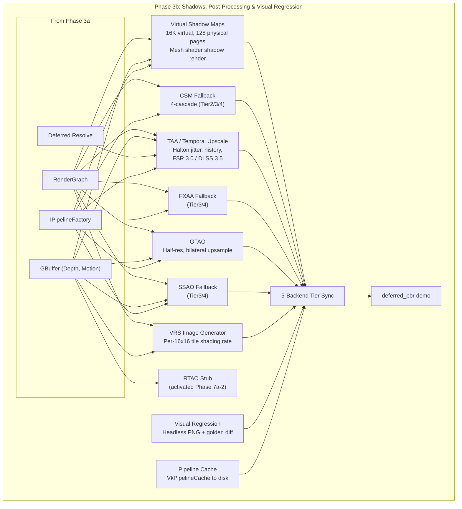
```mermaid
graph TD
    subgraph "Phase 3b: Shadows, Post-Processing & Visual Regression"
        subgraph "From Phase 3a"
            RG["RenderGraph"]
            GBUF["GBuffer (Depth, Motion)"]
            DEFERRED["Deferred Resolve"]
            IPIPE["IPipelineFactory"]
        end

        VSM["Virtual Shadow Maps<br/>16K virtual, 128 physical pages<br/>Mesh shader shadow render"]
        CSM["CSM Fallback<br/>4-cascade (Tier2/3/4)"]
        TAA["TAA / Temporal Upscale<br/>Halton jitter, history,<br/>FSR 3.0 / DLSS 3.5"]
        FXAA["FXAA Fallback<br/>(Tier3/4)"]
        GTAO["GTAO<br/>Half-res, bilateral upsample"]
        SSAO["SSAO Fallback<br/>(Tier3/4)"]
        RTAO_STUB["RTAO Stub<br/>(activated Phase 7a-2)"]
        VRS["VRS Image Generator<br/>Per-16x16 tile shading rate"]
        VISREG["Visual Regression<br/>Headless PNG + golden diff"]
        PCACHE["Pipeline Cache<br/>VkPipelineCache to disk"]
        SYNC["5-Backend Tier Sync"]
        DEMO["deferred_pbr demo"]

        RG --> VSM
        RG --> CSM
        RG --> TAA
        RG --> FXAA
        RG --> GTAO
        RG --> SSAO
        RG --> VRS
        GBUF --> VSM
        GBUF --> TAA
        GBUF --> GTAO
        GBUF --> SSAO
        GBUF --> VRS
        GBUF --> RTAO_STUB
        DEFERRED --> TAA
        IPIPE --> VSM
        IPIPE --> CSM
        IPIPE --> TAA
        IPIPE --> FXAA
        IPIPE --> GTAO
        IPIPE --> SSAO
        VSM --> SYNC
        CSM --> SYNC
        TAA --> SYNC
        FXAA --> SYNC
        GTAO --> SYNC
        SSAO --> SYNC
        VRS --> SYNC
        VISREG --> SYNC
        PCACHE --> SYNC
        SYNC --> DEMO
    end
```

**Key difference**: VSM + TAA + VRS + temporal upscaling on Tier1 from day one. CSM + FXAA + SSAO on Tier2/3/4 simultaneously. Visual regression starts here with per-backend golden images. Every shadow/AO/AA algorithm is authored simultaneously for its target tier.

---

### Phase 4: Resource Management & Bindless (Weeks 13–16) ∥ Phase 3b

**Goal**: Production resource pipeline — bindless, BDA, streaming, memory budget. Starts after Phase 3a milestone gate, runs in parallel with Phase 3b. **Tier-differentiated**: Tier1 uses descriptor buffer (`VK_EXT_descriptor_buffer`) + BDA; Tier2 uses descriptor sets + BDA; Tier4 (GL) uses `glBindBufferRange` + SSBO bindings; Tier3 (WebGPU) uses bind groups + storage buffers. All share the same `ResourceHandle` and `BindlessIndex` abstraction.

| Component | Deliverable |
|-----------|-------------|
| **ResourceHandle** | 8B packed `[type:4][generation:12][index:32][reserved:16]`. |
| **SlotMap** | Generational slot allocator. O(1) alloc/free/lookup. |
| **BindlessTable** | Global descriptor set (v1) + descriptor buffer backend (`VK_EXT_descriptor_buffer`, v2). Texture/buffer/sampler binding via `BindlessIndex` (4B). Auto-grow. Feature-detect + fallback. |
| **BDAManager** | Buffer device address tracking. `BDAPointer` (16B) with FNV-1a checksum. |
| **StagingRing** | Per-frame ring buffer for CPU→GPU copies. Auto-fence. |
| **ResourceManager** | Unified create/destroy, deferred destruction (per-frame free lists), lifetime tracking. |
| **Memory Budget** | Per-category tracking (geometry/texture/staging/accel), pressure states (Normal/Warning/Critical/OOM), LRU eviction callbacks. |
| **Residency Feedback** | GPU access tracking buffer (per-resource counter in fragment shader). Residency compute shader analyzes access patterns → load/evict priorities. `ChunkLoader` uses GPU feedback for streaming priority. Overcommit detection with graceful quality degradation. |
| **Demo** | `bindless_scene` — 10K objects via bindless indices, memory budget + residency feedback ImGui panel. |
| **Tests** | ~60: SlotMap lifecycle, handle generation, bindless grow, descriptor buffer fallback, BDA checksum, budget pressure, LRU eviction, residency tracking, overcommit. |

**Phase 4 Implementation Notes (2026-03-19)**:

| Item | Status | Detail |
|------|--------|--------|
| DescriptorBuffer fast-path | Skeleton only | `VK_EXT_descriptor_buffer` extension correctly enabled in `vkCreateDevice` + pNext chain. `DescBufferStrategy` class compiled. `TryCreate()` returns `NotSupported` — needs VkDevice handle pass-through from BindlessTable. **Phase 5 priority: activate real descriptor buffer path.** |
| D3D12 descriptor heap | Bump allocator | `D3D12DescriptorHeapAllocator` (65536 slots, shader-visible CBV_SRV_UAV + CPU-staging). No free-range reclaim. **Phase 5+: replace with ring/free-list sub-allocator** before CadScene material switching (Phase 8+). |
| resource → vulkan coupling | `#ifdef MIKI_HAS_VULKAN` | `BindlessTable.cpp` conditionally includes `BindlessTableDescBuffer.h`; `CMakeLists.txt` links `miki::rhi_vulkan` PRIVATE. **Phase 5: eliminate via `IDevice::GetDescriptorBufferCapability()` interface.** |
| ResourceManager autoBindless | Null sampler crash | `CreateTexture(desc, autoBindless=true)` registers with `SamplerHandle{}` (null) → Vulkan SEH crash. Workaround: manual `RegisterTexture(tex, validSampler)`. **Phase 5: add `SetDefaultSampler()` or sampler param to `CreateTexture`.** |
| MockDevice DescriptorBuffer | Removed | MockDevice no longer claims `HasDescriptorBuffer()`. Prevents false descriptor buffer strategy activation on Mock. |
| `float3_packed` (12B) | Not yet needed | Current `float3` is 16B (GPU-padded). ECS SOA storage (Phase 5) may benefit from a 12B packed variant to save 25% memory. Evaluate at Phase 5 gate. |

**Component Dependency Graph (Phase 4)**:

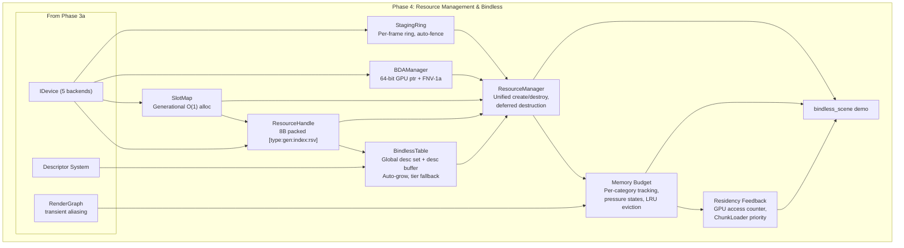
```mermaid
graph TD
    subgraph "Phase 4: Resource Management & Bindless"
        subgraph "From Phase 3a"
            RHI["IDevice (5 backends)"]
            RG["RenderGraph<br/>transient aliasing"]
            DESC["Descriptor System"]
        end

        HANDLE["ResourceHandle<br/>8B packed [type:gen:index:rsv]"]
        SLOT["SlotMap<br/>Generational O(1) alloc"]
        BINDLESS["BindlessTable<br/>Global desc set + desc buffer<br/>Auto-grow, tier fallback"]
        BDA["BDAManager<br/>64-bit GPU ptr + FNV-1a"]
        STAGING["StagingRing<br/>Per-frame ring, auto-fence"]
        RESMGR["ResourceManager<br/>Unified create/destroy,<br/>deferred destruction"]
        BUDGET["Memory Budget<br/>Per-category tracking,<br/>pressure states, LRU eviction"]
        FEEDBACK["Residency Feedback<br/>GPU access counter,<br/>ChunkLoader priority"]
        DEMO["bindless_scene demo"]

        RHI --> HANDLE
        RHI --> SLOT
        SLOT --> HANDLE
        HANDLE --> BINDLESS
        DESC --> BINDLESS
        RHI --> BDA
        RHI --> STAGING
        HANDLE --> RESMGR
        SLOT --> RESMGR
        BINDLESS --> RESMGR
        BDA --> RESMGR
        STAGING --> RESMGR
        RESMGR --> BUDGET
        RG --> BUDGET
        BUDGET --> FEEDBACK
        RESMGR --> DEMO
        BUDGET --> DEMO
        FEEDBACK --> DEMO
    end
```

---

### Phase 5: ECS & Scene (Weeks 17–23)

**Goal**: Entity-Component-System, spatial acceleration, RTE, kernel abstraction.

| Component | Deliverable |
|-----------|-------------|
| **Entity** | 32-bit `[generation:8][index:24]`. 16M entity capacity (sufficient for 10K parts × 1000 faces). `EntityManager` — O(1) create/destroy with recycling. |
| **Component Storage** | Archetype SOA. `ComponentPool<T>` swap-and-pop. `ComponentRegistry` type→pool. |
| **Query Engine** | `Query<All<T...>, Any<T...>, None<T...>>` — O(1) archetype match, parallel iteration. |
| **System Scheduler** | Dependency-graph parallel execution. `std::jthread` + `std::stop_token`. |
| **Spatial Index** | `BVH` — SAH build, iterative traversal, frustum/ray queries. `Octree` — Morton addressing, adaptive subdivision, dynamic insert/remove. `SpatialHash` — uniform grid broad-phase. |
| **RTE v2.0** | `RteManager` — progressive re-origin, double-buffered world coords, float32 ULP validation (0.01mm @ 100km). **Precision strategy per tier**: Tier1 (Vulkan/D3D12): native `float64` in compute shaders for distance/measurement/mass-properties (via `shaderFloat64` or `VK_KHR_shader_float64_packing`). Tier2 (Compat Vulkan 1.1): same `float64` (widely supported). **Tier3 (WebGPU)**: `float64` not available in WGSL — use **Double-Single (DS) emulation** (`ds_mul`, `ds_add`: each value stored as `vec2<f32>` = high + low, Knuth TwoSum/TwoProd). DS provides ~48-bit mantissa (vs float64's 52-bit), sufficient for sub-mm at 100km. **DS register pressure warning**: each DS variable consumes 2× VGPR; `ds_mul` expands to ~10 FMA ops; complex expressions (QEM error quadric, 4×4 matrix ops, distance field evaluation) can push VGPR usage past occupancy cliff (>128 VGPR on RDNA, >64 on Mali). Mitigation: (a) limit DS to final accumulation only (intermediate results stay float32), (b) split DS-heavy compute into multiple smaller kernels to reduce live register count, (c) Phase 14 Shader PGO includes DS-specific register audit on WebGPU target. Tier4 (OpenGL 4.3): `float64` via `GL_ARB_gpu_shader_fp64` (widely available on desktop GL, not on mobile — mobile uses DS like Tier3). |
| **Kernel Abstraction** | `IKernel` — **pluggable geometry kernel interface**. miki delegates all geometric operations to `IKernel`; it never directly calls OCCT or any specific kernel API. **Interface groups**: (1) **Shape CRUD**: `CreateBody/DeleteBody/CloneBody/GetBoundingBox`. (2) **Tessellation**: `Tessellate(shapeId, quality) → MeshData` — kernel is responsible for surface discretization; miki consumes triangles. (3) **Topology Query**: `GetFaces/Edges/Vertices(shapeId)`, adjacency, classification (planar/cylindrical/etc.). (4) **Surface/Curve Eval**: `EvalSurface(faceId, u, v) → Point3d`, `EvalCurve(edgeId, t) → Point3d` — for GPU parametric tessellation data source. (5) **Boolean**: `BooleanOp(bodyA, bodyB, Union/Subtract/Intersect) → Body` — kernel-side exact boolean. (6) **Import/Export**: `Import(path, format) → ImportResult {bodies[], assembly_tree, pmi[], sketches[]}`, `Export(bodies, path, format)`. (7) **Sketch**: `CreateSketchOnPlane(plane) → SketchId`, `AddLine/AddArc/AddCircle/AddSpline`, `AddConstraint(type, entities[])`, `SolveSketch() → SolveResult` — 2D constraint solver lives in kernel, miki only renders. (8) **Measurement (exact)**: `ExactDistance(bodyA, bodyB) → double`, `ExactArea/Volume(body)` — CPU double-precision reference values. **Implementations**: `OcctKernel` (reference implementation, optional `MIKI_KERNEL_OCCT=ON`, links OCCT libraries), `SimKernel` (test fallback: procedural shapes, no real B-Rep), future custom kernels register via `KernelFactory::Register<T>()`. **Design contract**: miki builds and runs without any kernel (pure renderer mode — load meshlets from `.miki` archive). With `IKernel` plugged in, miki gains B-Rep-aware editing, import, and exact measurement. |
| **IGpuGeometry** | GPU compute APIs exposed by miki for geometry kernels and CAD/CAE applications. **Purpose**: allow future GPU-native geometry kernels to leverage miki's GPU compute infrastructure without reimplementing RHI/resource management. **Interface groups**: (1) **GPU Tessellation**: `GpuTessellate(nurbsSSBO, trimSdfAtlas) → MeshletSSBO` — GPU NURBS eval + SDF trim (Phase 7b parametric tess internals exposed as API). (2) **GPU Boolean Preview**: `GpuBooleanPreview(bodyA, bodyB, op) → DepthLayerImage` — real-time CSG visualization (Phase 7b internals). (3) **GPU Interference**: `GpuInterference(blasHandleA, blasHandleB) → InterferencePairs` — BVH pair-traversal (Phase 9 internals). (4) **GPU Distance**: `GpuMinDistance(blasA, blasB) → float64` — double-precision BDA (Phase 7b internals). (5) **GPU Draft Angle**: `GpuDraftAngle(meshHandle, pullDir) → PerFaceAngleMap` (Phase 7b). (6) **GPU Curvature**: `GpuCurvature(meshHandle) → PerVertexCurvature` (Phase 9). (7) **GPU QEM Simplify**: `GpuSimplify(meshHandle, targetCount) → SimplifiedMesh` (Phase 6b). (8) **GPU Mass Properties**: `GpuMassProperties(meshHandle) → MassProps {area, volume, centroid, inertiaTensor}` (Phase 7b). (9) **GPU Constraint Solve** (reserved): `GpuSolveConstraints(systemDesc) → SolveResult` — placeholder for future GPU parallel geometric constraint solving. Each API is a thin wrapper around existing internal compute dispatches, exposing them through stable Pimpl interfaces. Host kernel calls `IGpuGeometry` methods, miki handles all GPU resource lifecycle. |
| **Topo Graph** | BRep topology (Compound→Solid→Shell→Face→Wire→Edge→Vertex). `TopoInspector` — query by type, adjacency. **Kernel-agnostic**: `TopoGraph` is miki's own lightweight topology representation, populated from `IKernel::Import` results. Stored in ECS as components. miki rendering and tools operate on `TopoGraph`, never on kernel-specific types (e.g., `TopoDS_Shape`). **Tessellation topology mapping**: `IKernel::Tessellate()` returns `TessellationResult { MeshData mesh, std::vector<FaceId> triangleToFaceMap, std::vector<EdgePolyline> edgePolylines }`. `triangleToFaceMap[globalTriIdx] → FaceId` enables O(1) lookup from any triangle to its owning B-Rep face (consumed by Phase 7a-2 picking for face/edge/vertex level selection). `edgePolylines` stores the 3D polyline approximation of each B-Rep edge (consumed by proximity tolerance picking for screen-space distance computation). Both are stored in `TopoGraphComponent` per-entity in ECS. For `.miki` archive (no-kernel mode), the mapping table is serialized alongside meshlet data. **Face geometry type classification**: each Face in `TopoGraph` carries a `FaceType` enum: `{Planar, Cylindrical, Conical, Spherical, Toroidal, BSpline, Offset, Other}`. Populated by `IKernel::Import()` (OCCT: `BRepAdaptor_Surface::GetType()` maps directly; other kernels: analytic detection or `Other` fallback). Stored per-face in `TopoGraphComponent`. Consumed by Phase 7a-2 `SelectionFilter` for geometry-type pick filtering (e.g., "only select cylindrical faces"). For `.miki` archive, `FaceType` is serialized per-face alongside `triangleToFaceMap`. |
| **Demo** | `ecs_spatial` — 100K entities with spatial queries, orbit camera, ImGui entity inspector. `kernel_demo` — load STEP via `OcctKernel`, tessellate, render; same scene from `.miki` archive without kernel. |
| **Tests** | ~90: entity lifecycle, archetype migration, query correctness, BVH ray/frustum, octree insert/remove, RTE precision, IKernel interface contract tests (run against SimKernel always + OcctKernel when `MIKI_KERNEL_OCCT=ON`), TopoGraph traversal, IGpuGeometry smoke tests (tessellate/distance/curvature on known shapes). |

**Phase 4 → Phase 5 Inherited TODOs** (from Phase 4 review, 2026-03-19):

| Priority | Item | Detail |
|----------|------|--------|
| **High** | Activate DescriptorBuffer fast-path | Wire `VkDevice`/`VkPhysicalDevice` handles into `DescBufferStrategy::TryCreate()` via `BindlessTableDesc` or a `VulkanDevice` accessor. This unblocks zero-overhead descriptor binding for Phase 6a GPU-Driven. |
| **High** | Eliminate resource→vulkan coupling | Replace `#ifdef MIKI_HAS_VULKAN` in `BindlessTable.cpp` + CMake PRIVATE link with `IDevice::GetDescriptorBufferCapability()` interface. resource layer must not depend on any specific backend. |
| **High** | Fix ResourceManager autoBindless | Add `SetDefaultSampler()` to `ResourceManager` or add sampler param to `CreateTexture()`. Current null-sampler crash (pitfalls.md) blocks safe auto-registration. |
| **Medium** | D3D12 descriptor heap sub-allocator | Replace bump-only `D3D12DescriptorHeapAllocator` with ring buffer or free-list. Current 65536-slot bump will exhaust during CadScene material switching (Phase 8+). |
| **Medium** | Evaluate `float3_packed` (12B) | ECS SOA component storage may benefit from 12B packed float3 (no padding) to save 25% memory on position/normal arrays. Add `struct float3_packed { float x,y,z; }` if profiling shows memory pressure in entity-dense scenes. |

**Component Dependency Graph (Phase 5)**:

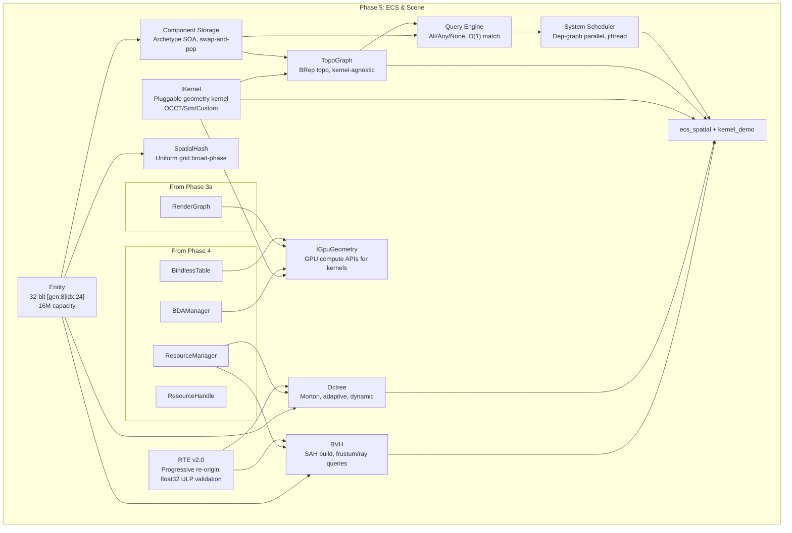
```mermaid
graph TD
    subgraph "Phase 5: ECS & Scene"
        subgraph "From Phase 4"
            RESMGR["ResourceManager"]
            HANDLE["ResourceHandle"]
            BDA["BDAManager"]
            BINDLESS["BindlessTable"]
        end
        subgraph "From Phase 3a"
            RG["RenderGraph"]
        end

        ENTITY["Entity<br/>32-bit [gen:8|idx:24]<br/>16M capacity"]
        COMP["Component Storage<br/>Archetype SOA, swap-and-pop"]
        QUERY["Query Engine<br/>All/Any/None, O(1) match"]
        SCHED["System Scheduler<br/>Dep-graph parallel, jthread"]
        BVH["BVH<br/>SAH build, frustum/ray queries"]
        OCTREE["Octree<br/>Morton, adaptive, dynamic"]
        SHASH["SpatialHash<br/>Uniform grid broad-phase"]
        RTE["RTE v2.0<br/>Progressive re-origin,<br/>float32 ULP validation"]
        IKERNEL["IKernel<br/>Pluggable geometry kernel<br/>OCCT/Sim/Custom"]
        IGPU["IGpuGeometry<br/>GPU compute APIs for kernels"]
        TOPO["TopoGraph<br/>BRep topo, kernel-agnostic"]
        DEMO["ecs_spatial + kernel_demo"]

        ENTITY --> COMP
        COMP --> QUERY
        QUERY --> SCHED
        ENTITY --> BVH
        ENTITY --> OCTREE
        ENTITY --> SHASH
        RESMGR --> BVH
        RESMGR --> OCTREE
        RTE --> BVH
        RTE --> OCTREE
        IKERNEL --> TOPO
        IKERNEL --> IGPU
        BDA --> IGPU
        RG --> IGPU
        BINDLESS --> IGPU
        TOPO --> QUERY
        COMP --> TOPO
        BVH --> DEMO
        OCTREE --> DEMO
        IKERNEL --> DEMO
        TOPO --> DEMO
        SCHED --> DEMO
    end
```

---

### IPC OS Primitives (Weeks 17+, ~2 weeks) ∥ Phase 5

**Goal**: Cross-platform OS-level IPC primitives for process isolation — shared memory, child process lifecycle, cross-process event notification, byte stream channels, memory-mapped files. These are pure OS abstractions (no GPU, no UI) from **neko-ipc**, integrated as a parallel track alongside Phase 5. All APIs are **synchronous-blocking** in this phase; async (`co_await`) wrappers added in Phase 13 when Coca is available. Namespace: `neko::ipc` (preserved from neko-ipc, not renamed).

**Motivation**: `IKernel::Import` and `IKernel::Tessellate` (OCCT) have ~2-5% crash rate on malformed STEP files. In-process crash = application crash. Out-of-process isolation (Phase 13 `ComputeDispatcher`) requires these IPC primitives as foundation. Additionally, deterministic memory reclamation (process exit → 100% OS reclaim) solves the OCCT memory fragmentation problem (1-3GB retained after tessellation of 10K parts).

| Component | Deliverable |
|-----------|-------------|
| **SharedMemoryRegion** | RAII cross-platform shared memory. `Create(name, size)`, `Open(name)`, `Data() → span<byte>`, `Size()`, `Name()`. Win32: `CreateFileMappingW` + `MapViewOfFile`. POSIX: `shm_open` + `mmap`. Position-independent data layout (offsets, not pointers). Security: `PAGE_READWRITE` / `PROT_READ|PROT_WRITE`. |
| **ProcessHandle** | RAII child process management. `Spawn(exe, args, ResourceLimits)`, `Pid()`, `IsAlive()`, `Wait() → std::expected<int32_t, IpcError>` (blocking), `Kill()`, `Stdout/Stderr() → PipeStream`. `ResourceLimits {maxMemoryBytes, maxCpuTimeSeconds}`. Win32: `CreateProcessW` + Job Objects (`JOB_OBJECT_LIMIT_PROCESS_MEMORY`, `JOB_OBJECT_LIMIT_PROCESS_TIME`). POSIX: `posix_spawn` / `fork+exec` + `setrlimit` / cgroup v2. |
| **EventPort** | Cross-process wake-up notification. `Create(name)`, `Open(name)`, `Signal()`, `Wait() → std::expected<void, IpcError>` (blocking), `NativeHandle()`. Win32: named `CreateEventW`. Linux: `eventfd`. macOS/BSD: named POSIX semaphore or Unix domain socket pair. |
| **PipeStream** | Async bidirectional byte stream (blocking read/write in this phase). `CreateAnonymous() → {reader, writer}`, `CreateNamed(name)`, `Connect(name)`, `Read(buf) → std::expected<size_t, IpcError>`, `Write(buf) → std::expected<size_t, IpcError>`. Win32: Named Pipes + overlapped IO. POSIX: Unix domain sockets / `pipe2`. Used for worker stdout/stderr streaming. |
| **MappedFile** | Cross-process read-only file mapping. `Open(path) → std::expected<MappedFile, IpcError>`, `Data() → span<const byte>`, `Size()`. Win32: `CreateFileMappingW` (read-only). POSIX: `mmap` (PROT_READ). Thin wrapper. Used for `.miki` archive shared access (Phase 6b cluster streaming cross-process). |
| **IpcError** | `enum class IpcError`: `PermissionDenied`, `NameConflict`, `NotFound`, `Timeout`, `BrokenPipe`, `ProcessCrashed`, `ResourceLimitExceeded`, `OutOfMemory`, `InvalidArgument`, `Unknown`. All IPC APIs return `std::expected<T, IpcError>`. |
| **Tests** | ~25: SharedMemoryRegion create/open/read-write round-trip (same process + two-process), ProcessHandle spawn/wait/kill/resource-limits (spawn test helper exe), EventPort signal/wait (cross-thread + cross-process), PipeStream read/write (anonymous + named), MappedFile open/read, IpcError propagation, RAII cleanup (handle leak detection via `_CrtSetDbgFlag` on Win32). |

**Component Dependency Graph (IPC OS Primitives)**:

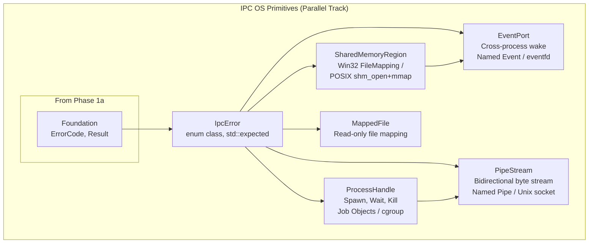
```mermaid
graph TD
    subgraph "IPC OS Primitives (Parallel Track)"
        subgraph "From Phase 1a"
            FOUND["Foundation<br/>ErrorCode, Result"]
        end

        SHM["SharedMemoryRegion<br/>Win32 FileMapping /<br/>POSIX shm_open+mmap"]
        PROC["ProcessHandle<br/>Spawn, Wait, Kill<br/>Job Objects / cgroup"]
        EVT["EventPort<br/>Cross-process wake<br/>Named Event / eventfd"]
        PIPE["PipeStream<br/>Bidirectional byte stream<br/>Named Pipe / Unix socket"]
        MMAP["MappedFile<br/>Read-only file mapping"]
        ERR["IpcError<br/>enum class, std::expected"]

        FOUND --> ERR
        ERR --> SHM
        ERR --> PROC
        ERR --> EVT
        ERR --> PIPE
        ERR --> MMAP
        PROC --> PIPE
        SHM --> EVT
    end
```

**Design note**: `neko::ipc` is linked as a static library from `third_party/neko-ipc/`. It depends only on Foundation types (`std::expected`) and OS APIs. No dependency on miki RHI, ECS, or neko-platform. Phase 13 adds: (a) `co_await processHandle.Wait()` via Coca IO thread, (b) `co_await eventPort.Wait()` via `io_awaitable`, (c) `MessageChannel<T>` (lock-free SPSC over SharedMemoryRegion + EventPort), (d) `ComputeDispatcher` + `ProcessSupervisor` + `WorkerProtocol` for OOP compute.

---

### GPU Trim Tech Spike (Week 22)

**Goal**: 1-week isolated technical investigation to validate the **SDF Trim Texture** approach for GPU parametric surface trimming (Phase 7b). This spike does NOT block Phase 6a — it runs in the gap between Phase 5 completion and Phase 6a start. Results feed into Phase 7b planning.

| Task | Deliverable |
|------|-------------|
| **SDF Trim Prototype** | Generate SDF trim textures (16×16 and 32×32 per face) for 50 representative trimmed STEP faces (planar, cylindrical, toroidal, freeform). Measure: (a) CPU generation time per face, (b) VRAM consumption extrapolation for 1M faces, (c) trim boundary accuracy vs CPU `IKernel::Tessellate` reference (max deviation in pixels at typical zoom). |
| **VRAM Budget Analysis** | If 1M faces × 32² × 1B = 1GB exceeds target (>512MB for trim atlas), evaluate: (a) 16×16 SDF (250MB) with quality trade-off, (b) virtual texture paging (reuse Phase 3b VSM page logic) to keep resident set <256MB, (c) adaptive resolution (higher SDF resolution for faces near camera). |
| **Decision Gate** | If VRAM ≤ 512MB AND accuracy < 0.5px deviation at typical CAD zoom → proceed with GPU SDF Trim in Phase 7b Phase 2. If VRAM > 1GB OR accuracy > 2px → **abandon GPU trim, commit to CPU multi-threaded pre-tessellation as permanent strategy** (no further GPU trim investment). Document decision and rationale. |

**Component Dependency Graph (GPU Trim Tech Spike)**:

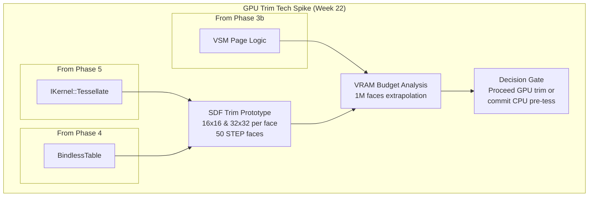
```mermaid
graph TD
    subgraph "GPU Trim Tech Spike (Week 22)"
        subgraph "From Phase 5"
            IKERNEL["IKernel::Tessellate"]
        end
        subgraph "From Phase 3b"
            VSM_PAGE["VSM Page Logic"]
        end
        subgraph "From Phase 4"
            BINDLESS["BindlessTable"]
        end

        SDF_PROTO["SDF Trim Prototype<br/>16x16 & 32x32 per face<br/>50 STEP faces"]
        VRAM_ANALYSIS["VRAM Budget Analysis<br/>1M faces extrapolation"]
        DECISION["Decision Gate<br/>Proceed GPU trim or<br/>commit CPU pre-tess"]

        IKERNEL --> SDF_PROTO
        VSM_PAGE --> VRAM_ANALYSIS
        BINDLESS --> SDF_PROTO
        SDF_PROTO --> VRAM_ANALYSIS
        VRAM_ANALYSIS --> DECISION
    end
```

---

### Phase 6a: GPU-Driven Rendering Core (Weeks 25–29)

**Goal**: Task/mesh amplification, visibility buffer, GPU scene submission, GPU compute primitives. Zero CPU draw calls from the start.

| Component | Deliverable |
|-----------|-------------|
| **Meshlet** | `MeshletGenerator` — greedy partitioning (64 vert / 124 prim), bounding sphere, normal cone. **Cache-aware geometry reordering**: Morton Code (Z-order curve) reorder of triangle indices and vertex data within each meshlet at partition time. Ensures physically contiguous vertex memory layout per-meshlet, maximizing L1/L2 cache hit rate during BDA attribute reconstruction in Material Resolve (#10). Offline cost only (partition-time, not per-frame). |
| **Task Shader Amplification** | Slang task shader: read instance buffer, per-instance frustum+occlusion cull, emit mesh workgroups via `SetMeshOutputCounts()`. `TaskPayload { uint meshletIndices[32]; uint count; }`. Replaces CPU-orchestrated dispatch entirely. |
| **Mesh Shader** | Slang mesh shader: read meshlet descriptor via BDA, unpack vertices/indices, per-meshlet normal cone backface cull, output primitives. **Tangent reconstruction**: tangent vector is NOT stored per-vertex; instead reconstructed in mesh shader from normal + UV partial derivatives (screen-space `dFdx`/`dFdy` in VisBuffer resolve, or analytic from adjacent vertices in mesh shader). Saves 12–16 B/vertex (vec3 or vec4 tangent eliminated). Fallback: precomputed tangent attribute for assets with non-trivial tangent spaces (e.g., normal-mapped hard-surface CAD with explicit UV seams). |
| **GPU Culling** | Two-phase: (1) HiZ pyramid from previous frame depth, (2) per-meshlet frustum + occlusion + normal-cone test in task shader. Subgroup ops (`WaveBallot`, `WavePrefixSum`) for wave-level early-out. `dp4a` quantized normal cones for less bandwidth. **Adaptive Near-Plane**: during instance-level cull, compute tight near plane from visible geometry AABB min-Z (parallel reduction). Pushes near plane away from camera when no geometry is close, improving far-field depth precision and reducing wasted culling work. Cost: 1 extra reduction pass (~0.02ms). |
| **Visibility Buffer** | 64-bit atomic vis buffer (`{instanceId:24, primitiveId:24, materialId:16}`). Material resolve compute reads vis buffer, fetches vertex attribs via BDA, evaluates material graph, writes to deferred targets. |
| **Software Rasterizer** *(optional, can defer to 6b)* | Compute shader fine rasterizer for small triangles (<4px). Uses 64-bit packed `{depth:32, payload:32}` with `atomicMax` on **uint64 SSBO** (buffer atomics, `VK_KHR_shader_atomic_int64`, Vulkan 1.2 core) — NOT 64-bit image atomics. Lightweight resolve pass copies surviving pixels from SSBO to VisBuffer R32G32_UINT image. Avoids hardware 2×2 quad waste. ~10-15% perf gain on Nanite-grade scenes. Fallback: disable SW rasterizer if `shaderBufferInt64Atomics` unavailable; mesh shader handles all triangles (correct but suboptimal for <4px). |
| **Hybrid Dispatch** *(optional, follows SW Raster)* | `TriangleClassifier` (area-based). Large → mesh shader HW path. Small → compute SW path. Both write to same vis buffer. |
| **GPU Scene Submission** | `SceneBuffer` — GPU-resident flat array of all instances (transform, AABB, material, meshlet range, LOD, `selectionMask`, `colorOverride`, `clipPlanes`). Compute update on change only. **Single-PSO geometry architecture**: because VisBuffer decouples geometry from material, the **geometry pass uses exactly 1 PSO** — all opaque instances (regardless of material, selection state, section plane, or color override) are rendered by the same mesh shader writing `uint64_t {instanceId, primitiveId}` to the vis buffer. No material sorting in the geometry stage. **Macro-Binning (3 render buckets)**: GPU cull compute classifies each visible instance into one of 3 pre-defined buckets via atomic append: **(1) Opaque Solid** → VisBuffer geometry pass, 1 PSO, 1 `vkCmdDrawMeshTasksIndirectCountEXT`; **(2) Transparent / X-Ray** → Linked-list OIT pass (Phase 7a-2), 1 PSO, 1 IndirectCount; **(3) Wireframe / HLR edges** → SDF line pass (Phase 7a-1), 1 PSO, 1 IndirectCount. CPU records exactly **3 `vkCmdBindPipeline` + 3 IndirectCount** calls per frame — fixed, deterministic, independent of material/state count. **State-to-Data**: selection highlight, section plane clipping, per-instance color override, draft angle display mode — all encoded as fields in `InstanceMetadata` GPU buffer (read by mesh shader or VisBuffer resolve compute), NOT as separate PSOs. **Material resolve**: `GpuRadixSort` sorts **screen pixels** by `materialId` in the VisBuffer resolve compute pass (not geometry instances). Resolve evaluates `StandardPBR` via a single mega-kernel reading material parameters from `MaterialParameterBlock[]` bindless array. Zero PSO switches in resolve (it's a compute dispatch). **Result**: 100K instances × 300 materials = still 3 PSO binds total. DGC (Phase 20) reserved for future scenarios requiring truly dynamic PSO generation on GPU. Dirty flags: skip cull on static frames. |
| **GPU Compute Primitives** | `GpuRadixSort` (Onesweep, 16M keys <2ms). `GpuPrefixSum` (Blelloch, 16M <0.5ms). `GpuCompact` (stream compaction). `GpuHistogram`. Reusable across all GPU sort/compact ops. |
| **Cooperative Matrix** *(nice-to-have)* | `VK_KHR_cooperative_matrix` (WMMA) for batched 4×4 transform in mesh shader. Hardware coverage limited (Ampere+, RDNA3+). ROI low — transform is not the mesh shader bottleneck. `VK_KHR_shader_integer_dot_product` (`dp4a`) for INT8 normal cone cull (this part is high-value, wide coverage). Feature detection + scalar fallback for both. |
| **Demo** | `gpu_driven_basic` — 10M triangle scene, task/mesh cull stats overlay, GPU scene submission stats, zero CPU draw calls. |
| **Tests** | ~60: meshlet partition quality, task shader cull vs CPU reference, mesh shader output, vis buffer resolve, SW raster vs HW raster parity, GPU radix sort correctness, prefix sum, scene submission draw count, cooperative matrix vs scalar. |

#### Pick Data Path (Phase 6a → Phase 7a-2 contract)

Phase 6a establishes the GPU-side data that Phase 7a-2 picking consumes. The contract is defined here to ensure `SceneBuffer` and `VisBuffer` carry the fields needed for the full **VisBuffer pixel → ECS Entity → CadScene PickPath** resolution chain.

**`GpuInstance` struct** (GPU SSBO, one entry per visible instance):

```
struct GpuInstance {                    // alignas(16), 96 bytes
    float4x4    worldMatrix;            // 64B — current frame transform
    float4      boundingSphere;         // 16B — xyz=center, w=radius (world-space)
    uint32_t    entityId;               // 4B  — maps to ECS Entity [gen:8|idx:24]
    uint32_t    meshletBaseIndex;       // 4B  — offset into global meshlet descriptor array
    uint32_t    meshletCount;           // 4B  — number of meshlets for this instance
    uint32_t    materialId;             // 4B  — index into MaterialParameterBlock[]
    uint32_t    selectionMask;          // 4B  — bitmask: selected / hovered / ghosted / isolated
    uint32_t    colorOverride;          // 4B  — RGBA8 packed, 0 = no override
    uint32_t    clipPlaneMask;          // 4B  — per-instance section plane enable bits
    uint32_t    flags;                  // 4B  — assembly level, layer bits, style bits
    // total = 64 + 16 + 8*4 = 112B; pad to 128B for 16-byte alignment
    uint32_t    _padding[4];            // 16B
};
static_assert(sizeof(GpuInstance) == 128);
```

**CPU mirror**: `SceneBuffer` maintains a CPU-side `std::vector<GpuInstance>` updated in lockstep with GPU uploads (compute update on dirty only). After VisBuffer readback, `instanceId` (24-bit, from VisBuffer R32 channel) indexes directly into this CPU mirror to retrieve `entityId` in O(1).

**VisBuffer → Entity resolution** (consumed by Phase 7a-2 picking, Phase 8 CadScene):

```
VisBuffer[x,y].R32 → instanceId (24-bit) → GpuInstance.entityId → ECS Entity
                                           → GpuInstance.meshletBaseIndex + primitiveId → global triangle index
VisBuffer[x,y].G32 → primitiveId (24-bit) → TopoGraph::PrimitiveToFace(entityId, globalTriIdx) → FaceId
                                           → (optional) TopoGraph::FaceToEdges/Vertices → EdgeId / VertexId
```

**`PickPath` forward declaration** (data structure defined here, full implementation in Phase 7a-2 + Phase 8):

- `PickPath`: ordered node chain from CadScene root to hit leaf — `[root, assembly, ..., part, body]` + optional `TopoElement {face, edge, vertex}`.
- `PickResult`: `{PickPath, PickLevel, worldPosition, worldNormal, depth, instanceId, primitiveId}`.
- `PickLevel` enum: `Assembly | Part | Body | Face | Edge | Vertex` — pick filter truncates the path to the requested level.
- **Pick filter is a post-processing step** — GPU pipeline is identical regardless of filter; CPU truncates the resolved path after the fact.

**Component Dependency Graph (Phase 6a)**:

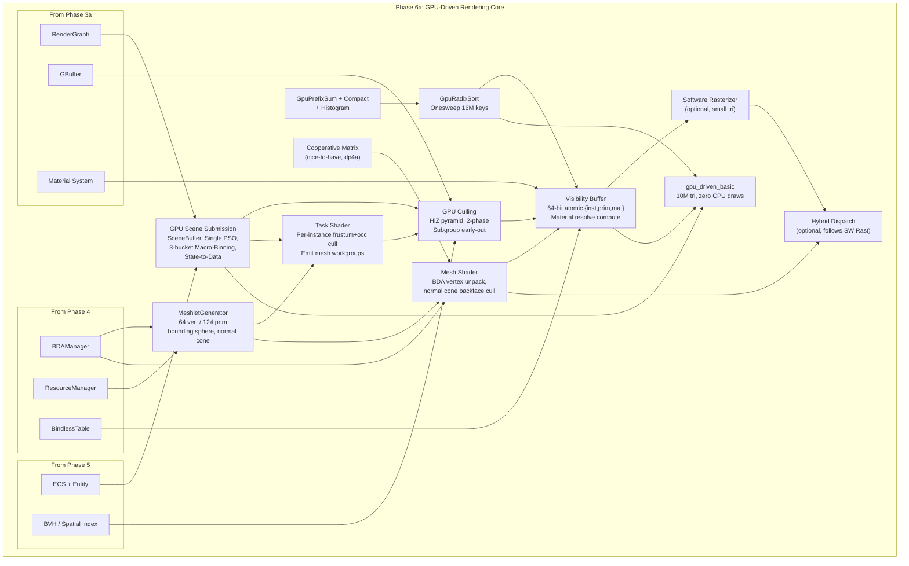
```mermaid
graph TD
    subgraph "Phase 6a: GPU-Driven Rendering Core"
        subgraph "From Phase 5"
            ECS["ECS + Entity"]
            BVH_5["BVH / Spatial Index"]
        end
        subgraph "From Phase 4"
            BDA["BDAManager"]
            BINDLESS["BindlessTable"]
            RESMGR["ResourceManager"]
        end
        subgraph "From Phase 3a"
            RG["RenderGraph"]
            GBUF["GBuffer"]
            MAT["Material System"]
        end

        MESHLET["MeshletGenerator<br/>64 vert / 124 prim<br/>bounding sphere, normal cone"]
        TASK["Task Shader<br/>Per-instance frustum+occ cull<br/>Emit mesh workgroups"]
        MESH_SH["Mesh Shader<br/>BDA vertex unpack,<br/>normal cone backface cull"]
        GPU_CULL["GPU Culling<br/>HiZ pyramid, 2-phase<br/>Subgroup early-out"]
        VISBUF["Visibility Buffer<br/>64-bit atomic {inst,prim,mat}<br/>Material resolve compute"]
        SW_RAST["Software Rasterizer<br/>(optional, small tri)"]
        HYBRID["Hybrid Dispatch<br/>(optional, follows SW Rast)"]
        SCENE_BUF["GPU Scene Submission<br/>SceneBuffer, Single PSO,<br/>3-bucket Macro-Binning,<br/>State-to-Data"]
        GPU_SORT["GpuRadixSort<br/>Onesweep 16M keys"]
        GPU_PREFIX["GpuPrefixSum + Compact<br/>+ Histogram"]
        COOP["Cooperative Matrix<br/>(nice-to-have, dp4a)"]
        DEMO["gpu_driven_basic<br/>10M tri, zero CPU draws"]

        BDA --> MESHLET
        RESMGR --> MESHLET
        MESHLET --> TASK
        MESHLET --> MESH_SH
        BDA --> MESH_SH
        GBUF --> GPU_CULL
        TASK --> GPU_CULL
        GPU_CULL --> VISBUF
        MESH_SH --> VISBUF
        BINDLESS --> VISBUF
        MAT --> VISBUF
        VISBUF --> SW_RAST
        SW_RAST --> HYBRID
        MESH_SH --> HYBRID
        ECS --> SCENE_BUF
        BVH_5 --> GPU_CULL
        SCENE_BUF --> GPU_CULL
        SCENE_BUF --> TASK
        RG --> SCENE_BUF
        GPU_SORT --> VISBUF
        GPU_PREFIX --> GPU_SORT
        COOP --> MESH_SH
        SCENE_BUF --> DEMO
        VISBUF --> DEMO
        GPU_SORT --> DEMO
    end
```

**Risk mitigation**: Software Rasterizer and Hybrid Dispatch are explicitly marked *optional* and can defer to Phase 6b, reducing Phase 6a to 5 core components (Meshlet, Task Shader, Mesh Shader, GPU Culling, Visibility Buffer, GPU Scene Submission, GPU Compute Primitives). Cooperative Matrix is *nice-to-have* with scalar fallback. If Phase 6a overruns, defer SW Raster + Cooperative Matrix first (zero functional impact — mesh shader handles all triangles correctly).

**Milestone gate**: Zero CPU draw calls in steady state. GPU scene submission produces correct frame. Phase 6b builds on this.

---

### Phase 6b: ClusterDAG, Streaming, LOD & GPU Mesh Simplification (Weeks 30–34)

**Goal**: Nanite-grade hierarchical LOD, cluster streaming, persistent compute, meshlet compression. 100M+ tri at 60fps.

| Component | Deliverable |
|-----------|-------------|
| **ClusterDAG** | Hierarchical LOD tree. SAH-optimal grouping. Projected-sphere-error metric with parent/child monotonicity. GPU DAG cut optimizer compute (minimize error subject to triangle budget). 10+ LOD levels. Dithered LOD transitions (screen-space, 8-frame cycle). |
| **Persistent Compute** | `PersistentDispatch` — N workgroups loop on work queue. Use cases: incremental BVH refit (<0.1ms for 1K dirty nodes), cluster streaming decompression (≥2GB/s), incremental TLAS rebuild (<0.5ms for 1K moved instances). |
| **Meshlet Compression** | Quantized vertex positions (16-bit normalized per meshlet AABB). Octahedral normal encoding (2×8-bit). **8-bit local triangle indices** (meshlet max 64 vertices → index ∈ [0,63], fits in `uint8`; 75% smaller than global `uint32` indices). Triangle index delta encoding + variable-length packing on top of local indices. Target: ~50% size reduction vs uncompressed meshlets. GPU decode in mesh shader (zero CPU decompression). |
| **Cluster Streaming** | Chunk-based cluster loading for out-of-core rendering of ultra-large models (10B+ tri, exceeding VRAM). `ChunkLoader` with async IO via Coca + Vulkan 1.4 streaming transfers (dedicated transfer queue or `hostImageCopy`, guaranteed by spec — non-blocking upload while rendering continues). `OctreeResidency` + `OctreeLODSelector`. Streaming-aware LOD: missing cluster → coarser ancestor, zero visual holes (always renderable, progressively refining). LRU eviction integrated with memory budget + residency feedback. **Out-of-core BVH**: TLAS nodes resident; BLAS pages loaded on demand via same streaming path. **Progressive rendering**: first frame renders coarse LOD within 100ms of file open; full detail streams in over subsequent frames. Disk format: custom `.miki` chunked archive with per-cluster compression (LZ4), spatial indexing (octree page table), and random-access seek. **DirectStorage / GPU decompression** *(stretch goal)*: on Windows, optional `DirectStorageLoader` backend bypasses CPU entirely (NVMe → GPU VRAM via DirectStorage API). GPU-side decompression via GDeflate compute shader (RTX 30+/RDNA3+ hardware decode, software fallback on older GPUs). On RTX 40+/RDNA3+ with `VK_NV_memory_decompression` (or D3D12 GPU decompression metadata), hardware-accelerated GDeflate decode at memory controller level — 2-3× faster than compute shader path, frees compute units for LOD/cull work. Feature-detected at init (`vkGetPhysicalDeviceFeatures2` → `VkPhysicalDeviceMemoryDecompressionFeaturesNV`); falls back to compute GDeflate → CPU LZ4 in degradation order. Eliminates CPU decompression bottleneck for streaming throughput >6 GB/s (hardware path: >12 GB/s theoretical on PCIe Gen5). Linux: `io_uring` direct-to-pinned-memory path as equivalent optimization. **Vulkan Sparse Memory Binding**: cluster page pool uses `VkSparseBufferMemoryBindInfo` for page-granular VRAM commit/evict (64KB or 2MB pages matching OS large-page size). Avoids VMA sub-allocation fragmentation for streaming workloads — bind/unbind individual pages without reallocating the entire buffer. Shared page table with VSM physical page pool (§5.6). D3D12 equivalent: `ID3D12Heap` tiled resources (`CreateReservedResource` + `UpdateTileMappings`). **ReBAR / Host-Visible Device-Local** *(opportunistic)*: for per-frame uniform updates (CameraUBO 368B, dirty GpuInstance patches <128KB), allocate with `VK_MEMORY_PROPERTY_DEVICE_LOCAL_BIT | VK_MEMORY_PROPERTY_HOST_VISIBLE_BIT` when ReBAR is available (>256MB BAR detected). CPU writes directly to VRAM via PCIe MMIO — eliminates staging copy for small, high-frequency updates. Ring allocator + timeline semaphore ensures no write-while-read hazard. Falls back to StagingRing DMA when ReBAR unavailable. Value: marginal for miki's current data volumes but enables future real-time editing scenarios (per-vertex displacement brush, live constraint solving) where sub-millisecond CPU→GPU latency matters. |
| **GPU Mesh Simplification (QEM)** | `MeshSimplifier` — quadric error metric edge-collapse on GPU compute. Algorithm: (1) compute per-vertex quadric (Q matrix, 10 floats, from incident face planes), (2) compute per-edge collapse cost (v_bar^T Q v_bar), (3) parallel edge collapse with independent set selection (graph coloring — no adjacent edges collapse simultaneously), (4) iterate until target triangle count or max error. GPU implementation: compute shader per-edge cost → parallel prefix min → independent set selection → collapse + compact. Preserves: boundary edges (infinite cost), material boundaries, UV seams (weighted quadric). Quality: Garland-Heckbert 1997 quality with GPU parallelism. Performance: 1M → 100K triangles in <50ms. Output: simplified mesh for export (STL/OBJ/glTF), lightweight preview, 3D printing preparation. Integration with Phase 15a export pipeline. Moved here from post-ship because meshlet pipeline (Phase 6a) provides the vertex/index data infrastructure, and LOD generation (this phase) is the natural consumer of mesh simplification for generating coarser LOD levels. |
| **Perceptual LOD Selection** | Extend LOD selector with perceptual weighting: `LOD_error = base_screen_error * perceptual_weight`. `perceptual_weight = max(silhouette_factor, curvature_factor, selection_factor)`. Silhouette edges get 1.0 weight (preserve detail), flat interiors get 0.3 (aggressive simplification). Per-meshlet curvature bound stored in MeshletDescriptor (4 bytes). Reduces visible meshlet count ~25% for typical CAD assemblies (70% flat faces) with zero perceptual quality loss. Overhead: ~2 ALU per meshlet in task shader. |
| **Zero-Stall Async Streaming** | 3-queue architecture: dedicated transfer queue (Vulkan 1.4) runs continuously without synchronizing with graphics queue. CPU prefetch thread predicts target LOD 2-5 frames ahead from camera velocity + acceleration + zoom-rate. >95% cache hit rate during smooth navigation; 100% for turntable/flythrough (fully predictable trajectory). Section plane sweep: prefetch exploits known animation trajectory. Advantage over Nanite: Nanite stalls on complex camera transitions; miki's predictive prefetch eliminates stalls entirely. |
| **Two-Phase Occlusion Culling** | Early+late HiZ cull (niagara pattern): early pass renders prev-frame-visible meshlets → builds current-frame depth → late pass culls remaining against current HiZ. `VisibilityPersistenceBuffer` per-meshlet uint8 visibility bit, double-buffered. Eliminates 1-frame temporal lag on camera rotation. Static frame optimization: skip cull when no dirty instances. |
| **LOD Transition Smoothing** | Dithered fade (8-frame 4×4 Bayer pattern, zero overdraw cost — alpha test, not blend). Parent+child meshlets rendered simultaneously during transition with complementary dither patterns. ~133ms transition at 60fps. Optional vertex geomorphing stretch goal (lerp parent/child vertex positions over 200ms). |
| **Demo** | `virtual_geometry` — 100M triangle scene (Dragon × 1000), seamless LOD, two-phase occlusion stats, streaming stats, compression ratio display. `mesh_simplify_demo` — interactive QEM simplification with quality slider. |
| **Tests** | ~80: ClusterDAG error monotonicity, DAG cut optimizer, persistent compute work queue, streaming residency, LOD transition smoothness (no popping), meshlet compression ratio, decode correctness vs uncompressed reference, out-of-core BVH page load/evict, progressive rendering first-frame latency (<100ms), `.miki` archive write/read round-trip, LZ4 cluster decompression throughput (≥2GB/s), QEM edge collapse cost vs CPU reference, boundary preservation, simplification ratio accuracy, UV seam preservation, 1M tri simplification perf benchmark, two-phase occlusion temporal coherence, visibility persistence buffer correctness, dithered LOD fade pattern validation. |

**Component Dependency Graph (Phase 6b)**:

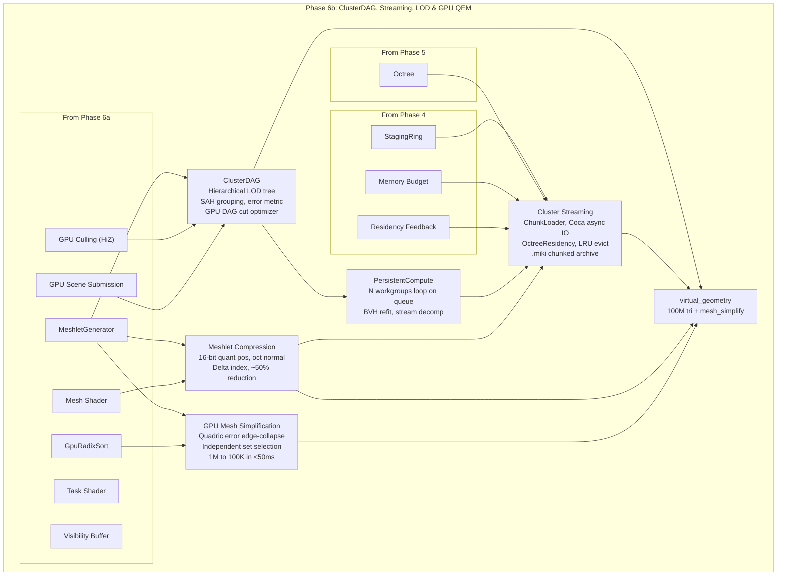
```mermaid
graph TD
    subgraph "Phase 6b: ClusterDAG, Streaming, LOD & GPU QEM"
        subgraph "From Phase 6a"
            MESHLET["MeshletGenerator"]
            TASK["Task Shader"]
            MESH_SH["Mesh Shader"]
            GPU_CULL["GPU Culling (HiZ)"]
            VISBUF["Visibility Buffer"]
            SCENE_BUF["GPU Scene Submission"]
            GPU_SORT["GpuRadixSort"]
        end
        subgraph "From Phase 4"
            BUDGET["Memory Budget"]
            FEEDBACK["Residency Feedback"]
            STAGING["StagingRing"]
        end
        subgraph "From Phase 5"
            OCTREE_5["Octree"]
        end

        CDAG["ClusterDAG<br/>Hierarchical LOD tree<br/>SAH grouping, error metric<br/>GPU DAG cut optimizer"]
        PERSIST["PersistentCompute<br/>N workgroups loop on queue<br/>BVH refit, stream decomp"]
        COMPRESS["Meshlet Compression<br/>16-bit quant pos, oct normal<br/>Delta index, ~50% reduction"]
        STREAM["Cluster Streaming<br/>ChunkLoader, Coca async IO<br/>OctreeResidency, LRU evict<br/>.miki chunked archive"]
        QEM["GPU Mesh Simplification<br/>Quadric error edge-collapse<br/>Independent set selection<br/>1M to 100K in <50ms"]
        DEMO["virtual_geometry<br/>100M tri + mesh_simplify"]

        MESHLET --> CDAG
        GPU_CULL --> CDAG
        SCENE_BUF --> CDAG
        CDAG --> PERSIST
        STAGING --> STREAM
        OCTREE_5 --> STREAM
        BUDGET --> STREAM
        FEEDBACK --> STREAM
        PERSIST --> STREAM
        MESHLET --> COMPRESS
        MESH_SH --> COMPRESS
        COMPRESS --> STREAM
        MESHLET --> QEM
        GPU_SORT --> QEM
        CDAG --> DEMO
        STREAM --> DEMO
        COMPRESS --> DEMO
        QEM --> DEMO
    end
```

**Key difference**: Task/mesh amplification, GPU scene submission, and GPU compute primitives are designed together. Zero CPU draw calls from Phase 6a. ClusterDAG and streaming build on a proven GPU pipeline. Meshlet compression enables 2B tri in <12GB VRAM. GPU QEM mesh simplification provides LOD generation and export-quality simplified meshes.

---

### Cooldown #1: GPU Pipeline Core Stabilization (Weeks 35–37)

**Goal**: 3-week stabilization buffer after the GPU-driven rendering core (Phase 6a+6b) is complete. No new features. Focus: technical debt cleanup, regression test gap-fill, API review, performance profiling baseline.

| Activity | Deliverable |
|----------|-------------|
| **Tech Debt** | Resolve all `TODO` / `FIXME` / `HACK` markers accumulated in Phases 1–6b. Code review sweep on RHI, render graph, meshlet pipeline. |
| **Test Gap-Fill** | Audit test coverage per module. Add missing edge-case tests. Target: ≥80% line coverage on core modules (RHI, render graph, meshlet, visibility buffer). |
| **API Review** | Freeze `IDevice`, `ICommandBuffer`, `RenderGraphBuilder` APIs. Breaking changes after this point require deprecation cycle. |
| **Performance Baseline** | Profile all demos on reference hardware (RTX 4070, RX 7800 XT, GTX 1060, Intel UHD 630). Record baseline FPS, GPU time per pass, VRAM usage. Stored as CI benchmark artifacts — all subsequent phases must not regress >5%. |
| **Documentation** | Architecture overview document (module map, data flow, threading model). API reference stubs (Doxygen). |

**Component Dependency Graph (Cooldown #1)**:

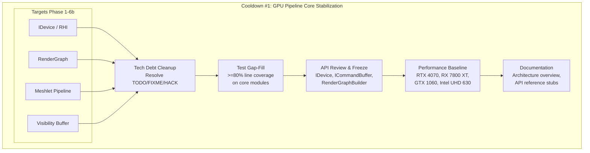
```mermaid
graph TD
    subgraph "Cooldown #1: GPU Pipeline Core Stabilization"
        subgraph "Targets Phase 1-6b"
            RHI["IDevice / RHI"]
            RG["RenderGraph"]
            MESHLET_PIPE["Meshlet Pipeline"]
            VISBUF["Visibility Buffer"]
        end

        DEBT["Tech Debt Cleanup<br/>Resolve TODO/FIXME/HACK"]
        TEST_GAP["Test Gap-Fill<br/>>=80% line coverage<br/>on core modules"]
        API_FREEZE["API Review & Freeze<br/>IDevice, ICommandBuffer,<br/>RenderGraphBuilder"]
        PERF_BASE["Performance Baseline<br/>RTX 4070, RX 7800 XT,<br/>GTX 1060, Intel UHD 630"]
        DOCS["Documentation<br/>Architecture overview,<br/>API reference stubs"]

        RHI --> DEBT
        RG --> DEBT
        MESHLET_PIPE --> DEBT
        VISBUF --> DEBT
        DEBT --> TEST_GAP
        TEST_GAP --> API_FREEZE
        API_FREEZE --> PERF_BASE
        PERF_BASE --> DOCS
    end
```

---

### Phase 7a-1: CAD Rendering — Edges & Section (Weeks 38–40)

**Goal**: GPU hidden-line removal and section plane/volume — the two most geometry-intensive CAD visualization features. Split from the original Phase 7a to reduce single-phase technical density (7 heavyweight components → 3+4).

| Component | Deliverable |
|-----------|-------------|
| **GPU Exact HLR** | Edge extraction compute (classify: silhouette, boundary, crease, wire from normals + adjacency). Visibility compute (per-edge ray-march against HiZ). Visible edge render (mesh shader lines + SDF AA). Hidden edge render (dashed/dotted from edge parametric coord). Sub-pixel edge AA: SDF-based coverage. **ISO 128-20 line type system**: `LineType` enum — Continuous (visible outline), Dashed (hidden edge, dash:gap = 12:3), Chain (center line, long dash:gap:short dash:gap = 24:3:2:3), ChainDouble (symmetry line, 24:3:2:3:2:3), Dotted (construction), Phantom (alternate position). Dash-gap ratios per ISO 128-24, scaled by line weight. **ISO 128-20 line weight system**: `LineWeight` enum — 0.13/0.18/0.25/0.35/0.5/0.7/1.0/1.4/2.0 mm. Automatic mapping from edge classification: silhouette → 0.7mm, visible → 0.35mm, hidden → 0.18mm, center/symmetry → 0.25mm, dimension → 0.18mm. Print-DPI-aware scaling (screen: pt, print: mm at target DPI). Per-segment `lineStyle` / `lineWeight` attribute override via CadScene `AttributeKey`. Silhouette enhancement (dot(N,V) sign change). **Custom line type pattern**: `LinePattern` descriptor — user-defined `float[] dashGapSequence` (e.g., `{12, 3, 2, 3}` for chain), replaces enum for non-ISO patterns. Pattern stored as SSBO, sampled by edge parametric coord in mesh shader. Supports arbitrary dash-gap-dot sequences for industry-specific standards (ANSI, JIS, DIN) beyond ISO 128. 10M edges <4ms budget. |
| **Section Plane v2** | Multi-plane clip (up to 8 planes, AND/OR boolean). Stencil capping (watertight). Contour extraction compute. Cross-hatch procedural fill (per-material spacing/angle) with **ISO 128 hatch pattern library** (steel: 45° lines, aluminum: crossed 45°, rubber: diagonal dots, concrete: gravel pattern, wood: grain lines, copper: dashed 45° — 12+ standard patterns). Custom hatch via pattern descriptor (spacing, angle, dash, offset). Animated section sweep. Gizmo integration. |
| **Section Volume (Solid Clip)** | `SectionVolume` — clip geometry by arbitrary convex volumes, not just infinite planes. Volume types: `OBB` (oriented bounding box, 6-plane intersection), `Cylinder` (axis + radius + height), `Boolean` (union/subtract of multiple volumes). Implementation: per-fragment inside-volume test via push-constant volume params (OBB: 3 axes + half-extents + center = 40B; cylinder: axis + center + radius + height = 28B). Stencil capping reuses Phase 7a-1 section plane capping logic (volume boundary faces → stencil write → cap fill). Cross-hatch fill on cap faces (reuses ISO 128 hatch library). Multi-volume boolean: AND (intersection of volumes) / OR (union) / SUBTRACT (exclude volume). Interactive volume gizmo (translate/rotate/scale via Phase 9 gizmo infrastructure). Performance: volume test is 6 dot-products per fragment for OBB, trivial cost. Used for: interior inspection of assemblies, cutaway views, interference region isolation. |
| **Demo** | `cad_hlr_section` — STEP assembly with GPU HLR (visible + hidden edges), section plane v2 (multi-plane + stencil cap + hatch), section volume (OBB cutaway). |
| **Tests** | ~40: edge classification vs CPU ref, SDF precision, HLR 10M edge benchmark, stencil section watertight, section volume OBB/cylinder/boolean, hatch pattern correctness, line type/weight rendering, custom line pattern. |

**Component Dependency Graph (Phase 7a-1)**:

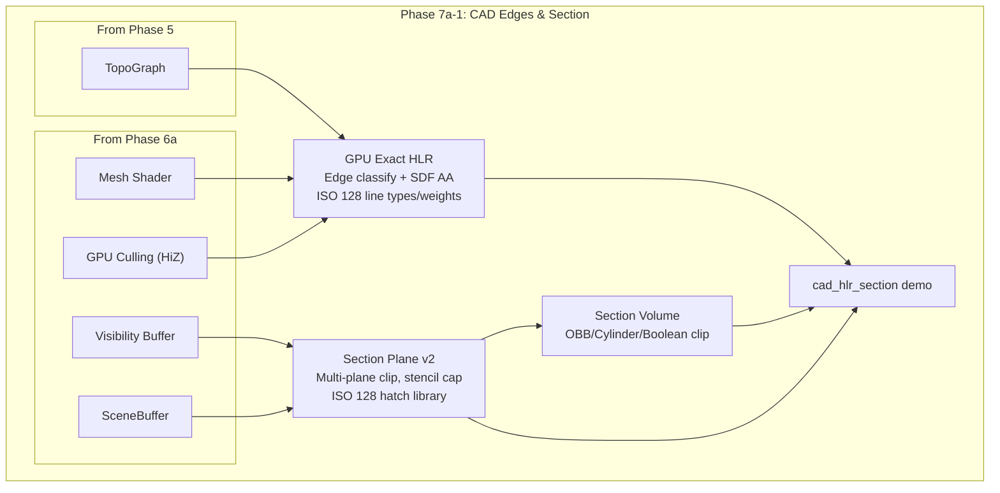
```mermaid
graph TD
    subgraph "Phase 7a-1: CAD Edges & Section"
        subgraph "From Phase 6a"
            MESH_SH["Mesh Shader"]
            GPU_CULL["GPU Culling (HiZ)"]
            VISBUF["Visibility Buffer"]
            SCENE_BUF["SceneBuffer"]
        end
        subgraph "From Phase 5"
            TOPO["TopoGraph"]
        end

        HLR["GPU Exact HLR<br/>Edge classify + SDF AA<br/>ISO 128 line types/weights"]
        SECTION["Section Plane v2<br/>Multi-plane clip, stencil cap<br/>ISO 128 hatch library"]
        SECVOL["Section Volume<br/>OBB/Cylinder/Boolean clip"]
        DEMO["cad_hlr_section demo"]

        MESH_SH --> HLR
        GPU_CULL --> HLR
        TOPO --> HLR
        VISBUF --> SECTION
        SCENE_BUF --> SECTION
        SECTION --> SECVOL
        HLR --> DEMO
        SECTION --> DEMO
        SECVOL --> DEMO
    end
```

**Milestone gate**: HLR renders correct visible/hidden edges with ISO 128 line types. Section plane + volume produce watertight caps. Phase 7a-2 builds on this.

---

### Phase 7a-2: CAD Rendering — Transparency, Picking & Lighting (Weeks 41–43)

**Goal**: Order-independent transparency, ray picking with acceleration structure, explode view, RTAO activation, **plus the remaining post-processing passes** (SSR, DoF, Motion Blur, CAS Sharpen, Color Grading, Chromatic Aberration, Outline), **clustered light culling** (4096 lights Tier1), and **Shadow Atlas** (point/spot/area light shadows). These features complete the core CAD interaction loop (select → inspect → visualize) and bring the Realistic display mode to full quality.

| Component | Deliverable |
|-----------|-------------|
| **Linked-List OIT** | Per-pixel atomic linked list (`imageAtomicExchange`). Node pool SSBO (`{color, depth, next}`). Sort resolve (insertion ≤16, merge >16). 16M node pool (adaptive: grow >80%, shrink <30%). Hybrid mode: linked-list ≤8 layers (CAD), weighted >8 (CAE). X-Ray mode with correct depth-sorted transparency. |
| **Ray Picking v2** | Incremental BLAS (refit dirty, periodic compact, <0.2ms). Incremental TLAS (update moved instances, <0.1ms). Multi-hit drilling selection. Area picking (frustum from rectangle). **Lasso / Polygon Selection**: `PolygonPick(screenPoints[]) → EntityId[]` — user draws arbitrary screen-space polygon (freehand lasso or click-to-place polygon vertices). GPU implementation: (a) rasterize polygon to stencil mask (compute shader `PointInPolygon` test per pixel against polygon SSBO), (b) cross-reference stencil mask with visibility buffer entity IDs → selected set. Handles concave polygons (winding number test). Performance: <1ms for 4K resolution with 32-vertex polygon. Eliminates the rectangular box-select problem in dense assemblies where background objects are accidentally selected. Topology-level return `(instance, meshlet, primitive, face, edge, vertex)`. Async readback via timeline semaphore. <0.5ms total latency for single-pick; <2ms for polygon pick. |
| **Explode View v2** | Explode compute shader: GPU-computed transforms from assembly hierarchy buffer. Multi-level (per-depth factor). `smoothstep(t)` animation. Double-buffered transform, vertex shader lerp via push constant `t`. Path visualization. |
| **RTAO Activation** | Activate the RTAO stub from Phase 3b. Reuse BLAS/TLAS built for picking — `VK_KHR_ray_query` in compute shader (short-range rays, 1spp + temporal accumulation). Fallback to GTAO when RT hardware unavailable. |
| **Clustered Light Culling** | GPU 3D froxel grid: `ceil(w/64) × ceil(h/64) × 32` depth slices (log₂, Reverse-Z). Compute pass: per-light project AABB → atomicAdd to overlapping clusters. Deferred resolve reads cluster → iterates lights. Tier1: 4096 lights, <0.3ms. Tier2/3/4: CPU-sorted UBO array fallback (64–256 lights). `GpuLight` struct (64B): position, direction, color, intensity (lumens/lux), type (Dir/Point/Spot/AreaRect/AreaDisc/AreaTube), shadowIndex, areaSize. LTC lookup textures (2× RGBA32F 64×64, 128KB) for area light specular. |
| **Shadow Atlas** | Single D32F atlas for point/spot/area light shadows. Tier1: 8192² atlas, point=512²/face, spot=1024², area=1024². Tier2/3/4: 4096² atlas, point=256², spot=512². LRU tile management. Max 32 shadow-casting lights/frame (Tier1), 8 (Tier2/3/4). Distance-based resolution scaling. Overflow: excess lights shadow-less. |
| **SSR (Screen-Space Reflections)** | Hi-Z ray march compute, Tier1/2 only. Half-res trace + bilateral upsample. Roughness>0.5 skip. Temporal accumulation. Fallback: IBL cubemap. Budget: <1.5ms @4K. |
| **Depth of Field** | Gather-based bokeh (Jimenez 2014). CoC from depth + aperture + focal length. Half-res gather, 16 samples. Tier1/2 compute. Tier3/4: simplified Gaussian blur. Budget: <1.5ms. Active only in Realistic mode or explicit user request. |
| **Motion Blur** | Per-pixel directional blur along GBuffer motion vectors (McGuire 2012). Tile max velocity → gather. Tier1/2 only. Budget: <1.0ms @4K. Active during turntable/flythrough/kinematic animation, not interactive editing. |
| **CAS Sharpen** | AMD FidelityFX Contrast-Adaptive Sharpening. Single compute pass post-TAA/FXAA. All tiers. Budget: <0.2ms @4K. |
| **Color Grading** | User-authored 3D LUT (32³ RGBA8, 128KB) as sampler3D. Optional curves (shadow/midtone/highlight). Budget: <0.1ms. All tiers. |
| **Chromatic Aberration** | 3-channel radial distortion folded into tone-map pass. 2 extra texture fetches. Tier1/2. ~0 extra cost (folded). |
| **Outline Post-Process** | Sobel on depth + normal discontinuities → edge mask → configurable outline color. All tiers. <0.2ms. Separate from GPU HLR — screen-space approximation for illustration style. |
| **Texture Projection Modes** | `MaterialParameterBlock.projectionMode`: UV (default), Triplanar, Box, Sphere, Cylinder, Decal. Material resolve compute (T1) and forward fragment (T2/3/4) calculate UV from world position + projection mode. Triplanar: 3 axis-aligned texture samples blended by surface normal. Budget: +2 ALU per non-UV pixel (branch on projectionMode, skip if UV). (demands M3.12) |
| **Material Graph (Procedural Materials)** | `MaterialGraphCompiler` — node-based material authoring compiled to Slang shader permutations at edit time (not runtime). Nodes: noise (Perlin/Simplex/Worley), checker, gradient, wood grain, carbon fiber, marble, mix, multiply, remap. Output: `MaterialParameterBlock` fields (albedo, roughness, metallic, normal, emission). Compiled material → `ShaderPermutationKey` (64-bit bitfield, Phase 1a `PermutationCache`). Runtime cost: zero extra vs hand-authored shader (compiled away). Editor: ImGui node graph (Phase 9 UI). Built-in presets: brushed metal, anodized aluminum, carbon fiber, wood, concrete. (demands M3.13, M3.14, M3.15) |
| **Demo** | `cad_oit_pick` — STEP assembly with linked-list OIT, X-Ray mode, picking (single + multi-hit + lasso), explode, RTAO toggle, **clustered lights (100+ point/spot)**, **SSR on reflective surfaces**, **shadow atlas**, **bloom + DoF + motion blur in turntable**. Combined with Phase 7a-1 demo: `cad_hlr_oit` runs all Phase 7a-1 + 7a-2 features together. |
| **Tests** | ~95: linked-list sort correctness (1/4/8/16/64 layers), pool overflow, picking incremental BLAS/TLAS, multi-hit order, area pick, lasso polygon pick, explode GPU transform, RTAO quality vs GTAO baseline, **clustered light culling correctness (100/1K/4K lights)**, **shadow atlas tile allocation/LRU**, **SSR reflection quality vs IBL**, **DoF CoC correctness**, **motion blur directional accuracy**, **CAS sharpening metric**, **color grading LUT round-trip**, **outline edge detection**, **drill box-select finds 100%-occluded instances**, **drill lasso vs no-drill result superset invariant**, **edge proximity pick within tolerance**, **edge proximity pick outside tolerance returns face**, **lasso mask bbox-clipped dispatch pixel count**, **BLAS version == VisBuffer geometry version invariant**, **selectability: non-selectable layer objects excluded from pick results**, **selectability: GPU collect skips non-selectable instances (hit buffer count check)**, **selectability: CPU safety net catches manually injected non-selectable hit**, **SelectionFilter: faceType=Cylindrical returns only cylindrical faces**, **SelectionFilter: faceType=Planar excludes cylindrical/spherical**, **SelectionFilter: layerMask filters hits to specified layers**, **SelectionFilter: customPredicate lambda filters by surface area**, **SelectionFilter: default filter (no faceType) returns all faces**, **CommandBus selection.set_filter round-trip**, **CommandBus selection.clear_filter resets to default**. |

#### Pick Architecture — Details

The picking system supports **6 interaction modes** (3 selection shapes × 2 penetration modes). All modes share a unified GPU pipeline with minimal branching.

**Mode Matrix**:

| | **No-Drill** (front-most only) | **Drill** (all layers, including fully occluded) |
|---|---|---|
| **Point** | VisBuffer single-pixel readback (0.05ms) | RT ray query multi-hit through TLAS (<0.5ms) |
| **Box** | VisBuffer mask + collect + dedup (<1ms) | Three-stage GPU volume culling (<3ms) |
| **Lasso** | Lasso mask + VisBuffer collect + dedup (<1.5ms) | Three-stage GPU volume culling (<5ms) |

**No-Drill Box/Lasso — VisBuffer Collect Pipeline**: Dispatch a collect compute shader over the mask region. For each pixel where `selectionMask == 1`, read VisBuffer `{instanceId, primitiveId}` and atomic-append to `HitBuffer` SSBO. Dedup via `GpuRadixSort` (Phase 6a) by `instanceId` → `GpuCompact` → readback unique instance list. Cost dominated by mask size, not scene complexity.

**(1) Drill Box/Lasso — Three-Stage GPU Volume Culling**

VisBuffer only contains the front-most layer. Fully occluded instances (e.g., pistons inside an engine block) are invisible in VisBuffer. Therefore, **Drill box/lasso selection MUST NOT depend on VisBuffer**. Instead, the 2D selection region is treated as a selection volume (near-plane to far-plane extrusion) and tested against the scene hierarchy using the same GPU culling infrastructure from Phase 6a:

- **Stage 1 — Instance cull (compute)**: For each instance in `SceneBuffer`, project its world-space AABB to screen-space 2D rect + depth range `[zMin, zMax]`. Test: (a) 2D rect overlaps selection bounding box, AND (b) depth range intersects camera `[near, far]`. Output: `CandidateInstanceList` (atomic append). Reuses `GpuInstance.boundingSphere` from Phase 6a. Cost: ~0.1ms for 100K instances.
- **Stage 2 — Meshlet cull (compute)**: For each meshlet of surviving instances, project meshlet bounding sphere to screen-space circle. Test: circle overlaps selection mask (for box: simple rect test; for lasso: sample mask texture at circle center ± radius). Output: `CandidateMeshletList`. Reuses meshlet bounding data from Phase 6a task shader. Cost: ~0.3ms for 1M meshlets.
- **Stage 3 — Triangle collect (compute)**: For each triangle of surviving meshlets, project 3 vertices to screen-space. Test: any vertex inside selection mask, OR triangle bbox overlaps mask region. Output: atomic append `{instanceId, primitiveId}` to `HitBuffer` SSBO. Cost: ~0.5ms for 100K surviving triangles.

**Design rationale — why not RT for drill box/lasso**: RT ray query is optimal for single-point drill (1 ray), but for area selection you would need to fire millions of rays (one per pixel in the selection area) to find all intersections. The three-stage culling approach is O(instances + meshlets + triangles) regardless of selection area pixel count, making it dramatically more efficient for large selections.

**Why not conservative rasterization for Stage 3**: `VK_EXT_conservative_rasterization` could replace the compute triangle-in-mask test with a hardware rasterization pass, but hardware coverage is insufficient — unavailable on Tier2 (Vulkan 1.1 compat), Tier3 (WebGPU), and Tier4 (OpenGL 4.3). The compute path (project 3 vertices → sample mask) is simple, correct on all tiers, and fast enough after Stage 1+2 culling reduces surviving triangles to 10K–100K range.

**Tier compatibility**: All three stages are pure compute shaders — no RT hardware required. Works on all tiers including WebGPU (Tier3) and OpenGL (Tier4).

**(2) Edge/Vertex Proximity Tolerance (Snap-to-Edge)**

VisBuffer provides pixel-exact selection (zero tolerance). CAD users need **3–10 pixel tolerance** when clicking near edges or vertices, with priority order: `Vertex > Edge > Face`.

**Primary approach — On-demand neighborhood sampling** (pick-time only, zero per-frame cost):

When a pick request arrives and `PickLevel` is `Edge` or `Vertex`:
1. Read VisBuffer in an `N×N` neighborhood centered on click point (default `N=21`, i.e., 10-pixel radius, 441 pixels total).
2. Extract all unique `{instanceId, primitiveId}` pairs from the neighborhood.
3. For each unique primitiveId, query `TopoGraph::PrimitiveToFace(entityId, triIdx)` to get the owning face, then `TopoGraph::FaceToEdges()` to get boundary edges.
4. For each candidate edge, compute screen-space distance from click point to the edge's projected polyline (edge tessellation from `TopoGraph`).
5. Return the closest element within tolerance, respecting priority: Vertex (if distance < 5px) > Edge (if distance < 10px) > Face (fallback).

Cost: ~0.02ms (441 VisBuffer reads + CPU distance computation). No per-frame GPU overhead.

**Optional enhancement — JFA (Jump Flooding Algorithm)**: For real-time hover-highlight of nearest edge (continuous feedback as mouse moves), a per-frame edge SDF is needed. JFA generates exact 2D distance field in `O(log2(max(w,h)))` = 12 passes at 4K. Cost: ~1.2ms/frame. **Only activated when `PickLevel::Edge` or `PickLevel::Vertex` mode is active** — disabled in Part/Assembly selection modes (most common). Activation is a user-facing mode toggle, not always-on.

**(3) Lasso Mask Performance**

The winding-number compute shader for lasso mask generation has `O(pixels × vertices)` complexity. Mitigations (all mandatory):

- **Douglas-Peucker simplification**: Reduce raw lasso polyline (potentially 500+ samples from mouse movement) to 20–50 vertices on CPU before upload to GPU. Tolerance: 2 screen pixels.
- **Bounding-box dispatch clip**: Compute lasso AABB on CPU. Dispatch compute shader only over the AABB region, not full screen. Typical coverage: 10–30% of screen area.
- **Result**: 4K screen × 30 vertices × 20% coverage = ~480M loop iterations. At ~20 TFLOPS (RTX 3070), completes in <0.5ms.
- **Stencil fallback (Tier1/2 only)**: For very complex lasso polygons (>100 vertices after simplification), use GPU rasterization: draw lasso as triangle fan with stencil increment → stencil odd/even = inside. Faster than compute winding number for high vertex counts, but requires a rasterization pass.

**(4) BLAS/TLAS Frame-Consistency Invariant**

**Invariant**: *At the moment a pick query executes, the BLAS/TLAS state must reflect the same geometry version as the currently displayed VisBuffer frame.* Violation = picking "ghost triangles" from stale geometry.

**Enforcement**: BLAS/TLAS updates are recorded in the **same command buffer** as the geometry rendering pass, in this order:

```
1. Refit dirty BLAS (compute, per-body, <0.2ms)     ← geometry edit triggers dirty flag
2. Rebuild TLAS  (compute, <0.1ms)                   ← instance transform/add/remove
3. Pipeline barrier (acceleration structure → ray query)
4. GPU-Driven render pass (VisBuffer, uses same geometry)
5. [Pick query, if pending] — uses BLAS/TLAS from step 1-2
```

BLAS/TLAS update MUST NOT be deferred to async compute or next frame. If a `CadScene::ApplyOp()` dirties geometry, the next frame's command buffer includes refit before render. Cost is bounded: incremental refit touches only dirty bodies (typically 1–10 per edit operation), not the full scene.

**Periodic compaction**: Every N frames (configurable, default 60), a full BLAS compact pass runs to reclaim fragmented acceleration structure memory. This is the only BLAS operation that may be deferred to async compute (it does not change traversal results, only memory layout).

**(5) Selectability Enforcement**

CAD layers have a `selectable` flag (Phase 8 `CadSceneLayer`). Objects on non-selectable layers must be excluded from pick results regardless of visibility.

**Two-layer enforcement** (GPU reduce + CPU safety net):

- **GPU layer** (collect shader / Drill Stage 1): `GpuInstance.flags` encodes `layerBits` (16-bit, matches `CadSceneLayer` table). A push constant `selectableMask` (16-bit, one bit per layer, set = selectable) is provided each frame. Collect shader adds: `if ((instance.flags & selectableMask) == 0) return;` before atomic append. This prevents non-selectable hits from entering `HitBuffer`, reducing readback volume. Same check added to Drill Stage 1 instance cull.
- **CPU layer** (defense-in-depth): `ApplySelectionFilter()` re-checks `selectableOnly` against CadScene layer table. If GPU-side check has a bug or race, CPU layer catches it. Cost: negligible (already iterating hits).
- **Push constant update**: `selectableMask` is recomputed whenever layer selectability changes (`CadScene::SetLayerSelectable(layerId, bool)` → dirty flag → next frame push constant update). Static scenes: zero per-frame cost.

**(6) SelectionFilter (Attribute & Geometry Type Filtering)**

Beyond `PickLevel` (topology-level truncation) and selectability (layer-level gate), CAD programs need **attribute-condition filtering** — e.g., "only select cylindrical faces", "only select faces on Layer 'Machined' with radius > 10mm".

**Design decision**: CPU post-processing filter (not GPU). Rationale: (a) geometry type (`FaceType`) lives in `TopoGraph` on CPU, not uploaded to GPU; (b) hit count after dedup is typically <1000, CPU filtering costs <0.01ms; (c) arbitrary predicates (`std::function`) cannot run on GPU; (d) consistent with Phase 6a principle "pick filter is a post-processing step".

**`SelectionFilter` struct**:

```
struct SelectionFilter {
    PickLevel                level;               // topology level (required)
    std::optional<FaceType>  faceType;            // Planar|Cylindrical|Conical|Spherical|Toroidal|BSpline|Any
    uint16_t                 layerMask = 0xFFFF;  // only select from these layers (bitmask)
    bool                     selectableOnly = true;// exclude layer.selectable==false
    std::function<bool(const PickResult&)> customPredicate = nullptr; // extension point
};
```

**`FaceType` enum**: `{Any, Planar, Cylindrical, Conical, Spherical, Toroidal, BSpline, Offset, Other}`. Populated by `IKernel::Import()` into `TopoGraph` per-face (OCCT: `BRepAdaptor_Surface::GetType()` maps directly). Stored in `TopoGraphComponent` per-entity. See Phase 5 TopoGraph for data source.

**Execution pipeline** (extends the existing pick resolve chain):

```
GPU pick → HitBuffer → dedup → readback
  → ApplyPickLevel(hits, filter.level)           // existing: truncate path
  → ApplySelectionFilter(hits, filter)            // NEW: attribute/type/layer filter
  → return filtered results
```

**`ApplySelectionFilter` logic**:

1. **Layer mask**: `(instance.layerBits & filter.layerMask) != 0` — skip hits not on requested layers.
2. **Selectability**: `(instance.layerBits & selectableLayerMask) != 0` — CPU safety net (redundant with GPU check).
3. **FaceType** (only when `filter.level >= PickLevel::Face` and `filter.faceType` is set): query `TopoGraph::GetFaceType(entityId, faceId)`, compare against `filter.faceType`.
4. **Custom predicate**: if `filter.customPredicate` is non-null, invoke it on each `PickResult`. Used by host applications for domain-specific filtering (e.g., "only faces with surface area > 100mm²").

**CommandBus integration**: `selection.set_filter level:Face faceType:Cylindrical layerMask:0x000F` — text command to set active selection filter. Filter persists until changed. `selection.clear_filter` resets to default (`{level: Part, layerMask: 0xFFFF}`).

**Component Dependency Graph (Phase 7a-2)**:

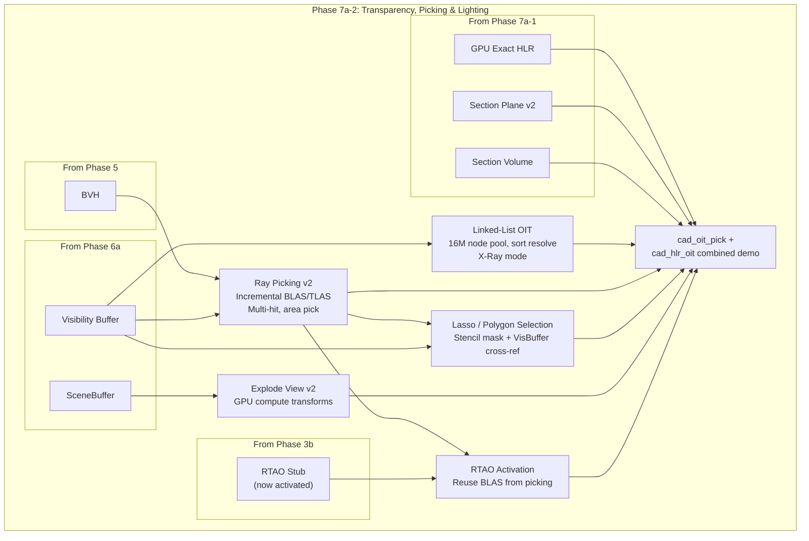
```mermaid
graph TD
    subgraph "Phase 7a-2: Transparency, Picking & Lighting"
        subgraph "From Phase 7a-1"
            HLR["GPU Exact HLR"]
            SECTION["Section Plane v2"]
            SECVOL["Section Volume"]
        end
        subgraph "From Phase 6a"
            VISBUF["Visibility Buffer"]
            SCENE_BUF["SceneBuffer"]
        end
        subgraph "From Phase 5"
            BVH["BVH"]
        end
        subgraph "From Phase 3b"
            RTAO_STUB["RTAO Stub<br/>(now activated)"]
        end

        OIT["Linked-List OIT<br/>16M node pool, sort resolve<br/>X-Ray mode"]
        PICK["Ray Picking v2<br/>Incremental BLAS/TLAS<br/>Multi-hit, area pick"]
        LASSO["Lasso / Polygon Selection<br/>Stencil mask + VisBuffer cross-ref"]
        EXPLODE["Explode View v2<br/>GPU compute transforms"]
        RTAO["RTAO Activation<br/>Reuse BLAS from picking"]
        DEMO["cad_oit_pick +<br/>cad_hlr_oit combined demo"]

        VISBUF --> OIT
        BVH --> PICK
        VISBUF --> PICK
        PICK --> LASSO
        VISBUF --> LASSO
        SCENE_BUF --> EXPLODE
        PICK --> RTAO
        RTAO_STUB --> RTAO
        HLR --> DEMO
        SECTION --> DEMO
        SECVOL --> DEMO
        OIT --> DEMO
        PICK --> DEMO
        LASSO --> DEMO
        EXPLODE --> DEMO
        RTAO --> DEMO
    end
```

**Milestone gate**: HLR, section, OIT, and picking all functional with correct output. Phase 7b builds on this.

---

### Phase 7b: CAD Rendering — Measurement, PMI, Tessellation & Import (Weeks 44–50)

**Goal**: Precision tools, full PMI rendering, GPU parametric tessellation, multi-format import, **iso-parameter line rendering**, **specular-glossiness import conversion**, **displacement mapping**. These features complete the CAD viewer for engineering use.

| Component | Deliverable |
|-----------|-------------|
| **Iso-Parameter Lines** | CPU pre-computation of iso-u/v curves from IKernel NURBS surface evaluation at configurable density (default: 10 iso-lines per parameter direction). Output: polyline vertex buffer per-surface. GPU rendering: SDF line pass (same pipeline as HLR §10.1 — shared EdgeBuffer + LinePattern SSBO). Per-surface toggling via GpuInstance.flags. Budget: <0.5ms @100K iso-lines. (demands G2.3) |
| **Specular-Glossiness Import Conversion** | CPU-side converter in import pipeline: `SpecGlossToMetalRough(diffuse, specular, glossiness) -> (baseColor, metallic, roughness)`. Khronos recommended algorithm (glTF spec appendix). Runs once per material during STEP/glTF import — zero runtime cost. MaterialParameterBlock stores only metallic-roughness. (demands M3.2) |
| **Displacement Mapping** | Compute shader vertex displacement pass: read displacement texture, offset vertices along normal by `displacementScale * textureSample`. Runs before meshlet compression (modifies vertex positions in-place in staging buffer). Optional — only for materials with `displacementTex != 0xFFFFFFFF`. Budget: <0.5ms @1M vertices. Tier1 only (requires compute write to vertex buffer). Tier2/3/4: baked into tessellation at import time via IKernel. (demands M3.11) |
| **GPU Boolean Preview** | Depth peeling compute (N=8 layers). CSG resolve compute (per-pixel boolean on depth intervals). Preview layer render (<16ms for 100K tri bodies). Union/subtract/intersect. Edge highlight. |
| **GPU Measurement** | Sub-mm GPU-parallel precision measurement. Point/face/distance/angle/radius queries, body-to-body min distance (BVH), mass properties, OBB. Double-Single emulation for WebGPU f64 mitigation. See **GPU Measurement Details** below. |
| **GPU Draft Angle Analysis** | Per-face dot(normal, pullDirection) compute → draft angle map. Configurable pull direction (mold axis). Color map overlay (green=OK, red=insufficient, yellow=marginal). Threshold-based pass/fail per face. Used for DFM (Design for Manufacturing) validation — injection molding, casting, forging die design. Single compute dispatch, <1ms for 1M triangles. |
| **Color Emoji & BiDi** | **Color Emoji**: `ColorGlyphCache` — FreeType `FT_LOAD_COLOR` + `FT_RENDER_MODE_NORMAL` → RGBA bitmap → dedicated atlas pages (true RGBA, not MSDF). Shader `isColor` flag bypasses median-SDF, samples texture directly. Covers COLR/CBDT/sbix color font formats. Needed for Phase 9 RichTextInput user-facing text fields. **Paragraph-level BiDi**: integrate FriBidi (LGPL-2.1+) or ICU for UAX #9 paragraph reordering. `TextShaper::ShapeText()` calls FriBidi before HarfBuzz to reorder mixed LTR+RTL runs (e.g., "Ø12.5 مم"). Required for correct PMI annotation display with Arabic/Hebrew mixed text. Phase 2 placeholder: color glyphs render as replacement glyph (U+FFFD); BiDi is run-level only (explicit `isRTL` flag). |
| **GPU Direct Curve Text** | Quality upgrade for `TextRenderer`: GPU direct Bézier curve rendering for text >48px or quality-critical paths (PMI editing, print preview). Fragment shader winding-number algorithm (Lengyel 2017 / GreenLightning). Glyph curve data in storage buffer (SSBO/StructuredBuffer), per-glyph bounding quad, per-pixel quadratic intersection. Band-based curve acceleration (N vertical bands, per-band bitset). Optional subpixel AA (3× R/G/B coverage sampling, platform-detected subpixel layout). Hybrid pipeline: `TextRenderer` auto-selects MSDF (<48px) vs direct curve (≥48px) based on `effectiveScreenPx`. Temporal accumulation stretch goal (8→1→512 samples/glyph for static text). All 5 backends supported (fragment shader SSBO read only, no compute/atomic). Target: 12-16px screen text matches Skia/FreeType hinted quality; world-space PMI at any zoom = zero aliasing. See **TextRenderer Details** in Phase 2 section. |
| **PMI RichText Prerequisites** | Ensure `RichTextSpan` (Phase 2) can represent all PMI text styles: tolerance stacks (`+0.02/-0.01` as super/subscript spans), stacked fractions (`1/2` vertical layout), GD&T feature control frames (symbol + datum + tolerance in structured spans), multi-line notes with paragraph breaks. `TextRenderer` must support inline symbol insertion from engineering atlas (T2.7.7). Atlas BC7 compression (4:1, 16MB→4MB) to handle large PMI-heavy assemblies with 64+ atlas pages. These are prerequisites for Phase 9 `RichTextInput` full editor. |
| **GPU PMI & Annotation** | Reuses `TextRenderer` (Phase 2) for all text rendering — MSDF glyph atlas, instanced quad pipeline, rich text spans. 3D dimension lines + arrow heads (compute-generated). Billboarding. World-space mm or screen-space px sizing. **Full PMI entity support**: GD&T symbols (position, flatness, perpendicularity, etc.), datum markers (triangle + letter), surface roughness symbols (Ra/Rz with value), weld symbols (ISO 2553), tolerance frames (feature control frame rendering). PMI imported from STEP AP242 as first-class entities attached to topology. PMI visibility toggleable per-view. **PMI type filter**: `PmiFilter` — filter visible PMI entities by type bitmask (`Dimension`, `GDT`, `SurfaceRoughness`, `WeldSymbol`, `DatumMarker`, `ToleranceFrame`) and/or by view plane alignment (show only PMI whose annotation plane is within ±15° of current view normal). Filter UI in ImGui panel. Used for decluttering complex assemblies with hundreds of PMI annotations. |
| **Sketch Renderer** | GPU rendering of 2D sketch entities from IKernel. SDF lines/arcs/splines, constraint icons (MSDF atlas), dimension rendering, sketch plane display, 2D snap, sketch edit mode, analysis overlay. No-kernel fallback for read-only display. See **Sketch Renderer Details** below. |
| **Parametric Tessellation** | GPU NURBS/BSpline evaluation compute. Phase 1: adaptive subdivision for untrimmed surfaces (>=10x faster than CPU). Phase 2: trimmed surface support (SDF trim textures or GPU point-in-curve). Asset pipeline vs render pipeline separation. See **Parametric Tessellation Details** below. |
| **Import** | All B-Rep format import delegates to `IKernel::Import(path, format)`. **Kernel-mediated formats**: STEP AP203/AP214/AP242 (with PMI), IGES 5.3, Parasolid XT, ACIS SAT — the active `IKernel` implementation handles parsing and B-Rep construction (e.g., `OcctKernel` uses `STEPControl_Reader`, `IGESControl_Reader`). miki receives `ImportResult {bodies[], assembly_tree, pmi[], sketches[], metadata}` and populates `TopoGraph` + ECS. **Kernel-independent formats** (miki handles directly, no kernel needed): `GltfPipeline` — cgltf, auto-meshlet. `JtImporter` — Siemens JT format (tessellated LOD + PMI + assembly structure, no B-Rep kernel required). `MeshImporter` — STL/OBJ/PLY (trivial parsers, auto-meshlet). `.miki` archive — native chunked format (meshlets + metadata, zero kernel dependency). `UsdImporter` — USD stage loading (optional). `ParallelTessellator` — dispatches `IKernel::Tessellate(shapeId, quality)` per-body on Coca worker pool. Progressive upload (render as bodies complete). Priority scheduling (visible first). **No-kernel mode**: miki operates as pure renderer loading `.miki`/glTF/JT/STL/OBJ/PLY without any geometry kernel linked. |
| **CAD Translator SDK Integration** | `ITranslator` plugin interface for commercial CAD format translators. Architecture: `ITranslator::Import(path) → ImportResult { bodies[], assembly_tree, pmi[], metadata }`. Plugin DLL/SO loaded at runtime via `TranslatorRegistry`. **Explicitly supported kernel formats**: **Parasolid XT/X_T** (via ODA or direct Parasolid SDK license), **ACIS SAT/SAB** (via ODA Drawings SDK or Spatial ACIS license). These are the two dominant B-Rep kernels — NX/SolidWorks/SolidEdge use Parasolid, CATIA/SpaceClaim/FreeCAD use ACIS-derived formats. `ITranslator` plugin interface ensures kernel-agnostic import. **Target SDKs**: (a) **ODA (Open Design Alliance)** — DWG/DXF read/write (Teigha/ODA Drawings SDK), Parasolid XT read, ACIS SAT read. (b) **Datakit CrossCad/Ware** — native Catia V5/V6 (.CATProduct/.CATPart), NX (.prt), Creo/Pro-E (.prt/.asm), Inventor (.ipt/.iam), SolidEdge (.par/.asm) direct read without original CAD license. (c) **CoreTechnologie 3D_Kernel_IO** — alternative to Datakit with broader format coverage. Plugin selection at build time (`MIKI_TRANSLATOR_DATAKIT=ON`, `MIKI_TRANSLATOR_ODA=ON`). Fallback: STEP/JT/IGES for all formats not covered by licensed translator. SDK license cost is external to this roadmap — `ITranslator` interface is always available, plugins are optional commercial add-ons. |
| **Demo** | `cad_viewer` — STEP/JT file loaded, assembly tree, GPU HLR, section v2, linked-list OIT, picking v2, boolean preview, explode v2, measurement (incl. body-to-body distance, mass properties), draft angle overlay, PMI annotation, full ImGui control panel. |
| **Tests** | ~80: boolean CSG correctness, measurement accuracy (vs analytical, RTE distances), body-to-body min distance vs CPU reference, mass properties (area/volume/centroid/inertia) vs `IKernel::ExactMassProperties` reference (<0.01% error), draft angle map correctness vs per-face analytical, MSDF text quality, GD&T symbol rendering correctness, datum marker placement, PMI import round-trip (AP242), parametric tess vs `IKernel::Tessellate` ref, parallel tess thread safety, STEP round-trip (via IKernel), JT import structure/LOD, glTF integrity, sketch entity render correctness, no-kernel mode: load .miki archive without kernel linked. |

#### GPU Measurement — Details

Sub-mm precision entirely on GPU. Point query (ray query -> float64 BDA, readback 24B). Face query. Distance compute (double-precision, single dispatch). Angle (<0.001 deg). Radius (least-squares fit).

**Body-to-body minimum distance**: BVH pair-traversal compute (reuse Phase 7a-2 BLAS) -> per-triangle-pair closest-point, double-precision, <2ms for 100K tri pairs.

**Mass properties compute**: GPU parallel reduction on triangle mesh -> area, volume, centroid, inertia tensor (float64 accumulation). Single dispatch per body, 1000-body assembly <10ms vs CPU >1s.

**Oriented Bounding Box (OBB)**: GPU compute minimum-volume OBB via PCA on vertex positions (covariance matrix -> eigenvalue decomposition -> oriented axes -> project extremes). Single dispatch per body. Used for precision assembly gap measurement (OBB gap < AABB gap), packaging volume estimation, and collision bounding. Visualization: wireframe OBB overlay with dimensions.

**WebGPU float64 mitigation -- Double-Single (DS) emulation**: WebGPU does not support `f64`. All measurement/mass-property compute shaders use `precision_float` abstraction defined in Slang utility module `PrecisionArithmetic.slang`. On Tier1/2/4 (Vulkan `shaderFloat64` / D3D12 native doubles / GL `GL_ARB_gpu_shader_fp64`): `precision_float = double`. On **Tier3 WebGPU**: `precision_float = DSFloat` -- Knuth TwoSum + Dekker TwoProduct emulation in 2xfloat32 pairs, yielding ~48-bit mantissa (vs float64's 52-bit). Implementation: `ds_add(DSFloat a, DSFloat b)`, `ds_mul`, `ds_div`, `ds_sqrt`, `ds_fma` -- each 3-6x float32 ALU cost but fully parallel in compute shader. Precision: <1e-10 relative error (sufficient for sub-mm at 10km scale). `SlangFeatureProbe` detects `shaderFloat64` at startup -> selects DS path automatically. No CPU fallback needed -- measurement remains GPU-parallel on all 5 backends. DS validation test: compute sphere volume (R=1km) via GPU reduction on both `double` and `DSFloat` paths -> compare relative error < 1e-9.

#### Sketch Renderer — Details

`SketchRenderer` -- GPU rendering of 2D sketch entities received from `IKernel::Import` (sketches in `ImportResult.sketches[]`) or created live via `IKernel::CreateSketch`. miki renders sketches; the kernel owns sketch geometry and constraint solving.

**Sketch entity rendering**: line segments (SDF AA, reuse Phase 7a-1 SDF line infrastructure), circular arcs (SDF parametric arc), full circles, ellipses/elliptic arcs, B-Spline curves (adaptive polyline from `IKernel::EvalCurve` samples, SDF render), construction geometry (dashed lines via `LinePattern`), reference points (cross/diamond/square markers).

**Endpoint/midpoint/center decorators**: small screen-space markers (square=endpoint, diamond=midpoint, cross=center, triangle=tangent point) rendered as instanced quads with SDF shapes.

**Constraint icons**: MSDF icon atlas (32x32 px per icon) for: Fixed (lock), Coincident (dot), Parallel, Perpendicular, Tangent, Equal (=), Symmetric, Horizontal (H), Vertical (V), Concentric. Icons positioned at constraint midpoint, billboarded.

**Constraint color coding**: under-constrained entities = blue, fully-constrained = green (or user-configured "solved" color), over-constrained = red. Color applied per-entity based on DOF info from `IKernel::GetSketchDOF(sketchId)`.

**Sketch dimension rendering**: reuses `TextRenderer` (Phase 2) MSDF text + arrow/leader infrastructure, projected onto sketch plane. Dimension types: linear (horizontal/vertical/aligned), angular, radial, diametral, arc length. Driving dimensions = black, reference (driven) dimensions = gray italic. Dimension drag interaction: miki captures drag -> calls `IKernel::SetDimensionValue(dimId, newValue)` -> kernel re-solves -> miki re-renders.

**Sketch plane display**: semi-transparent quad at sketch plane position + normal arrow. Configurable opacity.

**Sketch edit mode**: when user enters sketch editing, non-sketch 3D geometry fades to 30% opacity (LayerStack opacity override), sketch plane grid appears (reuse AdaptiveGrid projected to sketch plane local coords), camera auto-orients to sketch plane normal (smooth interpolation).

**Sketch 2D snap**: `Sketch2DSnap` -- project 3D cursor to sketch plane, snap to: endpoint, midpoint, center, intersection, nearest point on curve, tangent point. Visual snap indicator (green dot + type label). Reuses Phase 9 SnapEngine architecture with 2D-specialized candidates.

**Sketch analysis overlay**: closed-loop detection (highlight closed profiles in green, open profiles in orange -- enables `IKernel::Extrude` pre-validation), self-intersection detection (highlight intersecting segments in red), area/perimeter display (ImGui tooltip).

**No-kernel fallback**: without `IKernel`, sketch entities from imported files are rendered read-only (display only, no editing/constraint solving). Performance: <0.5ms for 1000 sketch entities.

#### Parametric Tessellation — Details

GPU NURBS/BSpline evaluation compute.

**Phase 1 (mandatory)**: Adaptive subdivision by screen-space curvature for untrimmed surfaces (simpler, high ROI, >=10x faster than kernel CPU tessellation). Ships in Phase 7b. Control point buffer (SSBO), knot vector buffer, order/degree uniforms. Compute shader evaluates surface points on adaptive grid, outputs position + normal + UV. Second compute pass: generate index buffer. Screen-space error metric: subdivide until pixel deviation < 1px. LOD: coarser tessellation for distant surfaces. Output feeds directly into `StagingUploader` -> GPU vertex buffer (zero CPU readback). Validated against `IKernel::Tessellate` CPU reference (max deviation < 0.01mm).

**Phase 2 (incremental, can defer to post-ship)**: Trim curve handling on GPU (complex -- known industry hard problem). `IKernel::Tessellate` CPU trim is the permanent fallback for trimmed surfaces until GPU trim passes a validation suite of >=500 trimmed STEP faces with zero topology errors. Cache by (surface_id, distance, quality). If GPU trim is not production-ready by Phase 14, it ships as experimental opt-in with `IKernel::Tessellate` as default.

**Critical design note -- Asset Pipeline vs Render Pipeline**: kernel CPU trim occurs in the *asset pipeline* (import/load stage), NOT in the per-frame render loop. `ParallelTessellator` (Coca worker pool) tessellates trimmed surfaces asynchronously during STEP import -> standard triangle mesh -> meshlet partitioning -> GPU upload. At runtime, GPU sees only meshlets -- zero CPU draw calls, Task/Mesh shader pipeline unaffected. The cost of CPU trim fallback is *longer load time* and *higher mesh memory* (pre-tessellated triangles vs parametric representation), not lower framerate.

**GPU trim candidate approaches (Phase 2 research directions)**: (a) **SDF Trim Textures** -- CPU generates low-res signed distance field in UV parameter space per face; GPU evaluates untrimmed surface + samples SDF to discard trimmed fragments. Pros: mathematically smooth at all zoom levels, tiny per-face footprint (16x16 or 32x32 SDF), reuses Phase 7a-1 SDF AA and Phase 4 Bindless infrastructure. Cons: 1M faces x 32^2 x 1B = ~1GB atlas VRAM; requires virtual texture paging for industrial-scale assemblies. (b) **GPU point-in-curve classification** -- direct evaluation of trim loop equations on GPU per tessellation vertex.

**Component Dependency Graph (Phase 7b)**:

```mermaid
graph TD
    subgraph "Phase 7b: Measurement, PMI, Tessellation & Import"
        subgraph "From Phase 7a-1 / 7a-2"
            BLAS["BLAS/TLAS (picking)"]
            HLR["GPU HLR + SDF lines"]
            SECTION["Section Plane v2"]
            OIT["Linked-List OIT"]
            PICK["Ray Picking v2"]
        end
        subgraph "From Phase 5"
            IKERNEL["IKernel"]
            TOPO["TopoGraph"]
        end
        subgraph "From Phase 2"
            TEXT["TextRenderer (MSDF)"]
            MAT["Material System"]
        end
        subgraph "From Phase 4"
            BDA["BDAManager (float64)"]
            BINDLESS["BindlessTable"]
        end

        BOOL_PREV["GPU Boolean Preview<br/>Depth peeling CSG"]
        MEASURE["GPU Measurement<br/>float64 BDA, DS emulation<br/>Distance/Angle/Radius/OBB<br/>Mass properties, body-body"]
        DRAFT["GPU Draft Angle<br/>Per-face dot(N,pullDir)"]
        PMI["GPU PMI & Annotation<br/>GD&T, datum, roughness,<br/>weld, tolerance frames"]
        SKETCH["Sketch Renderer<br/>SDF entities, constraints,<br/>dimension drag"]
        PARAM_TESS["Parametric Tessellation<br/>GPU NURBS eval, SDF trim"]
        IMPORT["Import Pipeline<br/>STEP/JT/glTF/STL/OBJ<br/>ParallelTessellator"]
        CAD_SDK["CAD Translator SDK<br/>ITranslator plugin interface"]
        DEMO["cad_viewer demo"]

        BLAS --> BOOL_PREV
        BLAS --> MEASURE
        BDA --> MEASURE
        PICK --> MEASURE
        TOPO --> DRAFT
        TEXT --> PMI
        TOPO --> PMI
        BINDLESS --> PMI
        TEXT --> SKETCH
        IKERNEL --> SKETCH
        HLR --> SKETCH
        IKERNEL --> PARAM_TESS
        IKERNEL --> IMPORT
        TOPO --> IMPORT
        IMPORT --> CAD_SDK
        MAT --> IMPORT
        BOOL_PREV --> DEMO
        MEASURE --> DEMO
        DRAFT --> DEMO
        PMI --> DEMO
        SKETCH --> DEMO
        PARAM_TESS --> DEMO
        IMPORT --> DEMO
    end
```

**Key difference**: All CAD features built with latest GPU techniques from the start. Linked-list OIT (not just weighted). GPU exact HLR (not 3-pass approximate). Incremental BLAS/TLAS for <0.5ms picking (not <4ms). GPU boolean preview. Parallel STEP tessellation. GPU parametric tessellation. Full PMI/GD&T rendering (not just dimension lines). JT import for Siemens ecosystem coverage. GPU body-to-body distance + mass properties + draft angle analysis — CAD measurement and DFM validation entirely on GPU compute.

---

### Phase 8: CadScene & Layer Stack (Weeks 51–56)

**Goal**: Production scene model with layers, styles, views, history, configuration management, serialization, and a composited multi-layer rendering pipeline.

| Component | Deliverable |
|-----------|-------------|
| **CadScene** | Top-level scene owner. Segment tree (root → assemblies → parts). `Segment` CRUD. Child/parent traversal. Name index. Scene defaults for all attribute keys. **PickPath construction**: each `Segment` stores a `parent` pointer (back-link to parent segment) enabling O(depth) root-to-leaf path assembly. `CadNodeComponent` (ECS component) links each renderable Entity to its owning `Segment`. `CadScene::BuildPickPath(entityId, primitiveId, pickLevel) → PickResult` resolves the full chain: `entityId → CadNodeComponent → Segment → walk parent chain → PickPath`. `PickFilter(PickLevel)` truncates the path to the requested granularity (Assembly/Part/Body/Face/Edge/Vertex). For Face/Edge/Vertex levels, consults `TopoGraphComponent::triangleToFaceMap` (Phase 5) to resolve primitiveId → FaceId → EdgeId → VertexId. `PickPath::ToString() → "/Assembly/SubAsm/Part/Body/Face_42"` for debug display and `IUiBridge::OnSelectionChanged` payload. |
| **CadScene Types** | `SegmentId`, `Segment`, `AttributeKey` (visibility, color, transparency, transform, material, line style, etc.), `AttributeValue`, `AttributeSource` (explicit/inherited/default). |
| **Attribute Resolution** | Hierarchical attribute inheritance with **5-level priority chain** (highest → lowest): **(1) ConditionalStyle** — `StyleCompiler` output, per-face-type or per-predicate override (e.g., "all cylindrical faces → blue"); evaluated per-entity at render-time; overrides all other sources. **(2) Explicit** — per-segment attribute set directly on this segment (`AttributeSource::Explicit`); the "single-object override" in CAD terminology. **(3) Layer Override** — `CadSceneLayer` color/transparency/lineStyle override; applies to all segments on this layer that have no Explicit value for the key. **(4) Inherited** — walk `Segment.parent` chain upward until a segment with an Explicit value is found (`AttributeSource::Inherited`); standard CAD assembly attribute propagation. **(5) Scene Default** — `CadScene::sceneDefaults_` per-key fallback (`AttributeSource::Default`); guaranteed non-null for all standard keys (color=gray, transparency=0, visibility=true, lineStyle=solid). `AttributeResolver::Resolve(segmentId, key) → {effectiveValue, source, sourceSegmentId}` — returns the resolved value plus its origin for UI display (e.g., property panel shows "Color: Red (inherited from Assembly_Engine)"). Resolution is **cached per-segment per-key** with dirty invalidation: setting an attribute on any segment invalidates its subtree for that key. Cache hit: O(1). Cache miss: O(depth) walk. `AttributeResolver` is consumed by `PresentationManager` (Phase 8) to produce GPU draw batches, and by `IUiBridge::GetEntityAttributes()` for UI property panels. |
| **Display Styles** | `DisplayStyle` — rendering recipe (shaded, wireframe, HLR, X-Ray, ghosted). `ConditionalStyle` — style applied by query predicate (e.g., "all faces of type Cylinder → blue"). `StyleCompiler` — resolves conditional styles to per-segment effective style. |
| **Layers** | `CadSceneLayer` — named layers with visibility, selectability, transparency override, **color override** (`std::optional<RGBA8>`, nullopt = no override; when set, all segments on this layer without an Explicit color use this layer color — priority level 3 in `AttributeResolver`), **lineStyle override** (`std::optional<LineStyle>` where `LineStyle` enum = `{Solid, Dash, Dot, DashDot, DashDotDot, Phantom, Center, Hidden}`; nullopt = no override; governs wireframe/HLR/edge rendering for segments on this layer). Layer table on CadScene. Max 16 layers (matching `GpuInstance.flags` 16-bit `layerBits`). Layer 0 = "Default" (always exists, cannot be deleted). `CadScene::CreateLayer(name) → LayerId`, `CadScene::DeleteLayer(id)`, `CadScene::SetLayerAttribute(id, key, value)`, `CadScene::AssignToLayer(segmentId, layerId)`. Each segment belongs to exactly one layer (default: layer 0). Layer assignment stored as `AttributeKey::Layer` on the segment. IUiBridge: `GetLayers() → LayerDesc[]` (name, visibility, selectability, color, lineStyle, segment count), `SetLayerVisibility(id, bool)`, `SetLayerSelectability(id, bool)`, `SetLayerColor(id, RGBA8)`, `SetLayerLineStyle(id, LineStyle)`. |
| **Selection Sets** | `NamedSelectionSet` — persistent, named collections of entities stored on `CadScene` (same level as Layers/Views/Configurations). Two flavors: **(a) Explicit set**: user-curated `std::vector<EntityId>` — created from current selection via `CadScene::CreateSelectionSet(name, ids)`. **(b) Smart set**: condition-driven — `CadScene::CreateSmartSelectionSet(name, SelectionFilter)` stores a `SelectionFilter` (Phase 7a-2); `entities` auto-populated by evaluating the filter against all scene entities. Smart sets are **lazy-refreshed**: marked dirty on scene change (`CadScene::OnSceneChanged` dirty flag), re-evaluated on next `GetSelectionSet()` access. `isLocked` flag freezes a smart set into an explicit snapshot. **Set operations**: `UnionSets(a, b)`, `IntersectSets(a, b)`, `SubtractSets(a, b)` — return new `NamedSelectionSet`. Implementation: sorted `EntityId` vectors + `std::ranges::set_union/set_intersection/set_difference`, O(N log N + M log M) for sort + O(N+M) merge, <0.1ms for typical 10K-entity sets. **Persistence**: serialized in `.miki` archive alongside Layers/Views/Configurations. Explicit sets store entity ID list; smart sets store `SelectionFilter` serialization (re-evaluated on load). **Undo/redo**: set create/delete/modify operations are `OpCommand` entries in `OpHistory`, fully undoable. **IUiBridge extension**: `GetSelectionSets() → SelectionSetDesc[]` (name, count, isSmartSet), `ActivateSelectionSet(setId)` (sets current selection to set contents), `CreateSelectionSetFromCurrent(name)`. **CommandBus integration**: `selection.create_set name:"Machined Faces"`, `selection.activate_set name:"Machined Faces"`, `selection.set_op union a:"SetA" b:"SetB" result:"Combined"`, `selection.create_smart_set name:"All Cylinders" level:Face faceType:Cylindrical`. |
| **Render Layer Stack** | `LayerStack` with 6 built-in layers (bottom-to-top compositing order): **(1) Scene** (full pipeline), **(2) Preview** (ephemeral/transient objects — see below), **(3) Overlay** (screen-space gizmo/compass/snap/guide lines), **(4) Viewport Widgets** (in-viewport custom 2D controls — see below), **(5) SVG Overlay** (vector graphics overlay — see below), **(6) HUD** (debug UI/ImGui, topmost). Per-layer render graph. `LayerCompositor` (alpha blend, depth-aware composite). Up to 16 layers (10 custom). **Preview Layer specification**: dedicated render graph for transient geometry (operation previews, measurement feedback, placement ghosts, sketch rubber-band). Rendering: reduced quality (no VSM shadows, no GTAO, simplified PBR — ambient + single directional) + linked-list OIT for correct transparency. Depth-composited with Scene layer (preview objects respect scene depth — no Z-fighting via depth bias). Clear per frame (all preview content is transient — zero persistent state). GPU resource: preview meshlets drawn from `PreviewMeshPool` (Phase 9), not from main scene buffer. |
| **Viewport Widget Layer** | In-viewport 2D controls rendered by miki (not host UI). ViewportButton, ViewportToolbar, CompassWidget, ScaleBar, Minimap, AnnotationCallout, ProgressIndicator. Anchor-based layout, theming, hit testing. See **Viewport Widget Layer Details** below. |
| **SVG Overlay Layer** | Vector graphics overlay for SVG content composited on 3D viewport. Raster mode (textured quad) and vector mode (SDF stroke, stencil fill). lunasvg/nanosvg parsing. Screen-space, NDC, or world-space anchoring. See **SVG Overlay Layer Details** below. |
| **Views** | `CadSceneView` — saved camera, active section planes, visibility overrides, display mode. Named view library. Animated transitions (lerp camera + cross-fade). `ViewTemplate` — predefined engineering view presets (Design, Assembly, Section, Inspection, Review, Construction) with default display style, layer visibility, section plane set, and interaction mode. Users create views from templates; templates provide sensible defaults per engineering workflow (e.g., Inspection template: X-Ray style + tolerance ConditionalStyle + measurement tool active). Custom templates via JSON. **Camera path animation**: `CameraPath` — sequence of keyframes (position, target, up, FOV, time). Catmull-Rom spline interpolation for smooth flythrough. Playback controls (play/pause/speed/loop). Path visualization (spline curve + keyframe markers on overlay layer). Video export (frame sequence → ffmpeg, MP4/H.265, configurable resolution/fps). Used for design reviews, marketing presentations, assembly walkthroughs. |
| **History** | `CadSceneHistory` — undo/redo stack. Command pattern (`ICommand`). Compound commands (begin/end transaction). Memory-bounded undo depth. |
| **Configuration & Variant Management** | `ConfigurationManager` — named configurations (display configs, part substitution). Each configuration stores: visibility overrides, part replacement mappings, color overrides, section plane sets. `BomView` — flattened/structured BOM extraction from assembly tree. Configuration switching with animated transition. Supports PLM integration pattern (external config file → apply to scene). |
| **Explode** | `CadSceneExplode` — per-level explosion with animated transition. Configurable direction/distance per assembly level. |
| **Clipping** | `CadSceneClipping` — per-segment clip planes (in addition to global section planes). Combinatorial clip (AND/OR). |
| **Serialization** | `CadSceneSerializer` — binary save/load of entire scene state (segments, attributes, layers, views, configurations, history). Versioned format with forward-compatibility. |
| **Topology-Aware GPU Culling** | `InstanceMetadata` GPU struct (`{ bodyId, faceType, assemblyLevel, layerBits, styleBits }`). Cull compute filter chain: frustum → occlusion → topology (visibility mask per body/layer). Layer visibility via 16-bit mask (push constant). Conditional style per-face-type. Assembly-level filter. |
| **Presentation** | `PresentationManager` — maps CadScene segment tree to GPU draw batches. `DrawBatcher` — sorts by material/pipeline for minimal state changes. `IndirectDrawCompiler` — produces GPU indirect draw command buffers. `GpuResourceCache` — caches tessellation results keyed by segment + quality. |
| **IUiBridge** | Pluggable UI engine integration interface. miki defines the contract; any UI framework (Qt, Slint, Web, ImGui) implements it. Viewport input, scene model queries, command interface, theming, drag-and-drop, accessibility. See **IUiBridge Details** below. |
| **Demo** | `cadscene_production` — large assembly (1000+ parts), layer toggling, style switching, configuration switching, BOM view, view animation, undo/redo, save/load. |
| **Tests** | ~175: segment CRUD, attribute resolution chain, style compilation, layer visibility, configuration switch/restore, BOM extraction, view save/restore, history undo/redo, serialization round-trip (including configs), draw batch sorting, indirect draw count, **AttributeResolver 5-level priority: ConditionalStyle overrides Explicit, Explicit overrides LayerOverride, LayerOverride overrides Inherited, Inherited overrides SceneDefault, source tracking returns correct sourceSegmentId for inherited, cache invalidation on parent attribute change propagates to subtree, cache hit O(1) vs cache miss O(depth), Resolve returns AttributeSource::Default when no ancestor sets key, layer color override applies to segments without Explicit color, layer color override does NOT apply to segments with Explicit color, layer lineStyle override governs HLR/wireframe edge rendering, SetLayerColor updates all affected segments on next resolve, layer 0 Default cannot be deleted, AssignToLayer changes segment layer, segment belongs to exactly one layer, layer serialization round-trip (color + lineStyle + selectability)**. **NamedSelectionSet: CreateSelectionSet stores entities correctly, CreateSmartSelectionSet evaluates filter on access, smart set lazy refresh after scene change, smart set isLocked freezes to explicit snapshot, UnionSets produces correct superset, IntersectSets produces correct intersection, SubtractSets produces correct difference, set ops on empty sets, serialization round-trip (explicit set + smart set filter), undo/redo CreateSelectionSet restores previous state, ActivateSelectionSet sets current selection, CommandBus selection.create_set round-trip, CommandBus selection.create_smart_set with faceType filter, CommandBus selection.set_op union/intersect/subtract**. **IUiBridge: GetAssemblyTree returns correct hierarchy, GetEntityAttributes matches segment attributes, SetVisibility toggles render, SetSelection fires OnSelectionChanged, ExecuteOp triggers PreviewManager, Undo/Redo round-trip via IUiBridge, OnSceneChanged fires on load/modify, OnHover returns valid entityId+worldPos, viewport insets shrink camera aspect correctly, ScreenToWorld/WorldToScreen round-trip, SetHighlightColor changes 3D selection color, OnDrop triggers placement preview, NullBridge no-op (headless mode), ImGuiBridge demo panels render**. **ViewportWidgetLayer: ViewportTreeWidget expand/collapse/select round-trip, DrillMenu open/navigate/select, ViewportToolbar toggle/radio state, HoverTooltip position near cursor, PieMenu sector hit-test, ViewportSlider value change → IUiBridge command, widget input priority (widget claims hit → 3D scene does not receive), scroll on tree does not orbit camera. SVG Overlay: lunasvg parse SVG 1.1 subset (paths/shapes/gradients), nanosvg fallback (path-only), SvgOverlay AddSvg/UpdateSvg/RemoveSvg lifecycle, ScreenFixed positioning pixel-accurate, WorldProjected positioning tracks camera movement, SVG texture cache (re-rasterize only on content change), HiDPI re-rasterize at 2× scale, 100 SVG elements composite <0.1ms**. |

#### Viewport Widget Layer — Details

`ViewportWidgetLayer` -- **in-viewport 2D controls rendered by miki** (not by the host UI). miki is not a UI framework, but it supports rendering structured 2D controls *inside the 3D viewport* that are tightly coupled with the 3D scene. These are controls that must overlay the 3D viewport with scene-aware positioning -- the host UI framework cannot easily provide these because they require per-frame screen-space projection, depth compositing, and hit-testing against 3D geometry.

**Widget types**:

- **(a) Assembly Tree Flyout** -- `ViewportTreeWidget`: collapsible hierarchical tree rendered in-viewport (left edge), driven by `IUiBridge::GetAssemblyTree()`. Expand/collapse, single/multi-select, visibility eye toggle, search/filter bar. Click -> `IUiBridge::SetSelection`. Semi-transparent background, scrollable, auto-hide on viewport click.
- **(b) Drill-down Menu** -- `DrillMenu`: cascading dropdown attached to a 3D pick point. Triggered by right-click on entity -> shows context-sensitive options (Isolate/Hide/Fillet/Chamfer/Measure/Properties...). Each item has icon (MSDF from `TextRenderer` atlas) + label + optional shortcut. Nested sub-menus. Menu content provided by `IUiBridge::GetContextMenu(entityId, topoLevel)`.
- **(c) Mini Toolbar** -- `ViewportToolbar`: horizontal/vertical icon strip docked to viewport edge (configurable: top/bottom/left/right). Toggle buttons (grid/PMI/wireframe/edges), radio groups (shading mode, selection mode), dropdown buttons (view orientation). Toolbar layout defined by `IUiBridge::GetToolbarLayout()`.
- **(d) Property Tooltip** -- `HoverTooltip`: popup near cursor showing entity name, face type, material, distance from selection -- auto-positioned, fade in/out. Driven by `IUiBridge::OnHover`.
- **(e) Radial/Pie Menu** -- `PieMenu`: shortcut-triggered (e.g., middle-click) radial menu with 4-8 sectors. Actions configurable.
- **(f) Slider/Scrubber** -- `ViewportSlider`: in-viewport slider for continuous-value operations (fillet radius, explode factor, section plane position). Renders as SDF-based track + thumb, positioned near the active gizmo/tool. Value change -> `IUiBridge::ExecuteOp(opType, {value})`.
- **(g) Progress Bar** -- `ViewportProgress`: in-viewport progress indicator for long operations (tessellation, import).

**Rendering**: all viewport widgets rendered via `TextRenderer` (Phase 2) for text + SDF-based shapes (rounded rects, circles, lines, icons) on a dedicated compute pass. Screen-space pixel-snapped quads. Background: semi-transparent rounded-rect panels (configurable color/opacity via theme).

**Input handling**: `ViewportWidgetLayer` consumes input events before they reach the 3D scene (event priority: widgets first -> gizmo/picking second). `HitTestWidget(x,y) -> WidgetHitResult` -- if a widget claims the hit, the 3D scene does not receive the event. Scrolling: mouse wheel on tree widget scrolls tree, not orbit camera.

**Theme**: all widget colors, font sizes, corner radii, and padding sourced from `ThemeManager` (Phase 21), or defaults if `ThemeManager` not initialized.

**Extensibility**: `IViewportWidget` abstract base -- host applications can register custom viewport widget types via `ViewportWidgetLayer::RegisterWidget(unique_ptr<IViewportWidget>)`. miki provides the rendering infrastructure (SDF shapes + TextRenderer + input dispatch); the host defines widget content and behavior.

#### SVG Overlay Layer — Details

`SvgOverlayLayer` -- **vector graphics overlay** for rendering SVG content composited on top of the 3D viewport. Use cases: (a) **CAD symbols and logos** (company logo watermark, standard symbols), (b) **2D drawing views** (2D projected views overlaid on 3D for drawing creation workflow), (c) **Schematic overlays** (electrical/hydraulic/pneumatic schematics superimposed on 3D assembly), (d) **Custom host decorations** (branded headers, scale bars, copyright notices), (e) **Icon sets** for viewport widgets (SVG icons instead of bitmap -- resolution-independent).

**SVG parsing**: `SvgParser` -- parses SVG 1.1 Tiny subset (paths, basic shapes, text, groups, transforms, fill/stroke, opacity, gradients, clip-path). Primary parser: **lunasvg** (MIT, `third_party/lunasvg/`). Fallback: **nanosvg** (zlib, `third_party/nanosvg/`, path-only subset).

**GPU rendering pipeline**: SVG paths -> tessellated triangle mesh (CPU, via lunasvg rasterizer or custom path tessellator) -> upload to GPU quad buffer -> fragment shader with SDF AA for edges. For simple cases (flat-color fills, no gradients): direct SDF path rendering. For complex cases (gradients, clip-path, text): CPU rasterize to RGBA texture (lunasvg `Bitmap`) -> upload as GPU texture -> textured quad composite.

**`SvgOverlay` API**: `AddSvg(svgId, svgData, position, size, anchor)`, `UpdateSvg(svgId, svgData)`, `RemoveSvg(svgId)`, `SetSvgTransform(svgId, matrix)`, `SetSvgOpacity(svgId, float)`. Position modes: `ScreenFixed` (pixel coordinates), `ScreenRelative` (percentage of viewport), `WorldProjected` (world-space point -> screen projection, SVG follows 3D anchor as camera moves).

**Performance**: SVG rasterized to texture cache -- re-rasterized only on content change or viewport resize. Cached SVGs composited as textured quads (<0.1ms for 100 SVG elements). **Resolution independence**: SVG re-rasterized at current viewport DPI (handles HiDPI/Retina). Scale factor from `ThemeManager`.

#### IUiBridge — Details

`IUiBridge` -- **pluggable UI engine integration interface**. miki defines the contract; any UI framework (Qt, Slint, Web, ImGui, custom) implements it. miki is a renderer SDK -- it does **not** ship a production UI framework, but provides all hooks for one. **Design principle**: miki owns the 3D viewport and rendering; the UI engine owns 2D chrome (trees, panels, menus, dialogs). They communicate via `IUiBridge`.

**Interface groups**:

- **(1) Scene Model Queries** (UI reads miki data): `GetAssemblyTree() -> TreeNode[]` (full hierarchy with name, type, icon hint, visibility, selected state), `GetEntityAttributes(id) -> AttributeMap` (key-value pairs for property panel), `GetSelectionSet() -> EntityId[]`, `GetSelectionSets() -> SelectionSetDesc[]` (all named selection sets: name, entity count, isSmart, isLocked), `ActivateSelectionSet(setId)` (replaces current selection with named set contents), `CreateSelectionSetFromCurrent(name)` (saves current selection as named set), `GetAvailableDisplayStyles() -> string[]`, `GetSectionPlanes() -> PlaneDesc[]`, `GetConfigurations() -> ConfigDesc[]`, `GetLayers() -> LayerDesc[]`, `GetUndoStack() -> OpDesc[]`.
- **(2) Commands** (UI drives miki actions): `SetVisibility(ids[], visible)`, `SetSelection(ids[])`, `SetDisplayStyle(style)`, `SetSectionPlane(index, plane)`, `SetConfiguration(name)`, `SetLayerVisibility(layerId, visible)`, `ExecuteOp(opType, params)` (fillet/chamfer/boolean/extrude -- triggers PreviewManager), `Undo()`, `Redo()`, `SetViewOrientation(front/back/top/iso/...)`, `FitAll()`, `FitSelection()`, `Isolate(ids[])`, `SetExplodeFactor(float)`.
- **(3) Event Callbacks** (miki notifies UI): `OnSelectionChanged(ids[])`, `OnSceneChanged(changeType)` (load/modify/undo/redo -- UI refreshes tree/properties), `OnOperationPreviewUpdate(opId, status)` (preview started/computing/ready/failed -- UI shows progress), `OnMeasurementResult(result)`, `OnHover(entityId, faceId, worldPos)` (UI shows tooltip/status bar), `OnProgressUpdate(taskId, percent, message)` (import/tessellation progress for dialog).
- **(4) Viewport Coordination**: `GetViewportRect() -> Rect`, `ScreenToWorld(x,y) -> Ray`, `WorldToScreen(pos) -> Point2D` -- UI can draw custom overlays aligned with 3D scene. `SetViewportInsets(top, bottom, left, right)` -- UI panels shrink the 3D viewport area (miki adjusts camera aspect ratio and pick coordinates accordingly).
- **(5) Theme Integration**: `SetHighlightColor(r,g,b)`, `SetSelectionColor(r,g,b)`, `SetPreviewOpacity(float)`, `SetBackgroundColors(top, bottom)` -- UI theme controls 3D visual style.
- **(6) Drag-and-Drop**: `OnDragEnter(format, position)`, `OnDragOver(position) -> DropEffect`, `OnDrop(data, position)` -- drag file/part from UI tree into viewport -> miki handles placement preview.

**Canonical input event type**: `IUiBridge::OnInputEvent(neko::platform::Event)` — all input flows through `neko::platform::Event` (`std::variant<CloseRequested, Resize, MouseMove, MouseButton, KeyDown, KeyUp, Scroll, TextInput, Focus, DpiChanged>`), established in Phase 3a. Host frameworks convert their native events to `neko::platform::Event` and call `OnInputEvent`. **Phase 13 coroutine extension**: `NextEvent() → coca::Task<neko::platform::Event>` (miki-internal tools consume events as coroutine stream), `ExecuteOpAsync(cmd, params) → coca::Task<OpResult>` (async operations via Coca worker pool or OOP `ComputeDispatcher`).

**No dependency on any specific UI framework** -- `IUiBridge` is a pure C++ abstract interface (Pimpl, ABI-stable). Provided implementations: `ImGuiBridge` (built-in, uses ImGui for standalone demo/dev mode), `NullBridge` (headless/batch -- no UI, default), `GlfwBridge` (demo-only, GLFW callbacks → `neko::platform::Event`, in `demos/framework/glfw/`), `NekoBridge` (demo-only, neko EventLoop → `neko::platform::Event`, in `demos/framework/neko/`). Host applications implement their own bridge (e.g., `QtBridge`, `ElectronBridge`).

**Component Dependency Graph (Phase 8)**:

```mermaid
graph TD
    subgraph "Phase 8: CadScene & Layer Stack"
        subgraph "From Phase 7a-1/7a-2/7b"
            HLR["GPU HLR"]
            OIT["Linked-List OIT"]
            PICK["Ray Picking v2"]
            SECTION["Section Plane v2"]
            PMI["GPU PMI"]
            IMPORT["Import Pipeline"]
        end
        subgraph "From Phase 5"
            ECS["ECS + Entity"]
            TOPO["TopoGraph"]
        end
        subgraph "From Phase 3a"
            RG["RenderGraph"]
            UIBRIDGE_SKEL["IUiBridge Skeleton"]
        end
        subgraph "From Phase 2"
            TEXT["TextRenderer"]
        end

        CADSCENE["CadScene<br/>Segment tree, CRUD,<br/>name index, defaults"]
        TYPES["CadScene Types<br/>SegmentId, AttributeKey/Value"]
        ATTR["Attribute Resolution<br/>Hierarchical inheritance"]
        STYLES["Display Styles<br/>Shaded/Wireframe/HLR/XRay<br/>ConditionalStyle compiler"]
        LAYERS["CadScene Layers<br/>Named, visibility, selectability"]
        LAYERSTACK["Render Layer Stack<br/>Scene+Preview+Overlay+<br/>Widgets+SVG+HUD (6 layers)"]
        WIDGETS["Viewport Widget Layer<br/>Tree flyout, drill menu,<br/>mini toolbar, pie menu"]
        SVG_OVL["SVG Overlay Layer<br/>lunasvg + nanosvg<br/>SDF path rendering"]
        VIEWS["CadScene Views<br/>Saved camera, CameraPath<br/>Animated transitions"]
        HISTORY["CadScene History<br/>Undo/redo, ICommand"]
        CONFIG["Configuration Manager<br/>Named configs, BomView"]
        SERIAL["Serialization<br/>Binary versioned format"]
        TOPO_CULL["Topology-Aware GPU Cull<br/>InstanceMetadata, layer mask"]
        PRESENT["Presentation<br/>DrawBatcher, IndirectDraw"]
        UIBRIDGE["IUiBridge (full)<br/>Scene queries, commands,<br/>event callbacks"]
        DEMO["cadscene_production"]

        ECS --> CADSCENE
        TOPO --> CADSCENE
        CADSCENE --> TYPES
        TYPES --> ATTR
        ATTR --> STYLES
        CADSCENE --> LAYERS
        RG --> LAYERSTACK
        LAYERS --> LAYERSTACK
        STYLES --> LAYERSTACK
        LAYERSTACK --> WIDGETS
        TEXT --> WIDGETS
        UIBRIDGE_SKEL --> WIDGETS
        LAYERSTACK --> SVG_OVL
        CADSCENE --> VIEWS
        CADSCENE --> HISTORY
        CADSCENE --> CONFIG
        CADSCENE --> SERIAL
        HISTORY --> SERIAL
        CONFIG --> SERIAL
        CADSCENE --> TOPO_CULL
        LAYERS --> TOPO_CULL
        STYLES --> TOPO_CULL
        TOPO_CULL --> PRESENT
        UIBRIDGE_SKEL --> UIBRIDGE
        CADSCENE --> UIBRIDGE
        PICK --> UIBRIDGE
        SECTION --> UIBRIDGE
        HISTORY --> UIBRIDGE
        PRESENT --> DEMO
        UIBRIDGE --> DEMO
        WIDGETS --> DEMO
        SVG_OVL --> DEMO
        VIEWS --> DEMO
    end
```

---

### Cooldown #2: CAD Core Stabilization (Weeks 57–59)

**Goal**: 3-week stabilization buffer after the CAD scene model and rendering pipeline (Phases 7a+7b+8) are complete. No new features. Focus: CAD-specific quality, IUiBridge contract validation, cross-backend CAD rendering parity.

| Activity | Deliverable |
|----------|-------------|
| **CAD Rendering Audit** | Golden image comparison of HLR, OIT, section, PMI across all 5 backends. Fix any backend-specific rendering discrepancies (>2% pixel diff). |
| **IUiBridge Contract Test** | Verify all Phase 8 `IUiBridge` queries return correct data for a 1000-part STEP assembly. Verify all commands produce expected scene state changes. |
| **CadScene Stress Test** | 10K-part assembly: load time, memory usage, undo stack depth, serialization round-trip, configuration switch latency. Performance budget established. |
| **Tech Debt** | Resolve all `TODO` / `FIXME` in Phases 7a–8. Code review sweep on CAD modules (HLR, OIT, picking, measurement, PMI, CadScene). |
| **API Review** | Freeze `IKernel`, `IUiBridge`, `CadScene`, `LayerStack` APIs. Breaking changes after this point require deprecation cycle. |

**Component Dependency Graph (Cooldown #2)**:

```mermaid
graph TD
    subgraph "Cooldown #2: CAD Core Stabilization"
        subgraph "Targets Phase 7a-8"
            HLR["GPU HLR"]
            OIT["Linked-List OIT"]
            SECTION["Section Plane"]
            PMI["GPU PMI"]
            CADSCENE["CadScene"]
            UIBRIDGE["IUiBridge"]
        end

        AUDIT["CAD Rendering Audit<br/>Golden image 5-backend<br/> <=2% pixel diff"]
        CONTRACT["IUiBridge Contract Test<br/>1000-part STEP assembly"]
        STRESS["CadScene Stress Test<br/>10K parts, memory, undo,<br/>serialization, config switch"]
        DEBT2["Tech Debt Cleanup<br/>Phase 7a-8 TODO/FIXME"]
        API_FREEZE2["API Freeze<br/>IKernel, IUiBridge,<br/>CadScene, LayerStack"]

        HLR --> AUDIT
        OIT --> AUDIT
        SECTION --> AUDIT
        PMI --> AUDIT
        UIBRIDGE --> CONTRACT
        CADSCENE --> STRESS
        AUDIT --> DEBT2
        CONTRACT --> DEBT2
        STRESS --> DEBT2
        DEBT2 --> API_FREEZE2
    end
```

---

### Phase 9: Interactive Tools (Weeks 60–64)

**Goal**: Transform gizmo, 3D compass, snap engine, operation history, and **PreviewManager** — the central subsystem for all transient/ephemeral objects (feature previews, sketch rubber-band, measurement feedback, section drag, assembly placement ghosts, CAE deformation drag, visual feedback indicators).

| Component | Deliverable |
|-----------|-------------|
| **Gizmo** | `Gizmo` — translate/rotate/scale modes. `GizmoController` — mouse interaction, axis/plane constraint. `GizmoRenderer` — overlay rendering (anti-aliased lines, cones, cubes, rotation rings). `GizmoConstraintSolver` — snap-to-grid, snap-to-face, angular snap. |
| **Compass** | `Compass` — always-visible 3D orientation widget. `CompassController` — click-to-orient (front/back/left/right/top/bottom/iso views). `CompassAttachment` — anchored to viewport corner. `CompassInteraction` — drag-to-orbit. |
| **Snap Engine** | `SnapEngine` — snap to vertex, edge midpoint, face center, grid intersection. Priority-based candidate selection. Visual snap indicator (overlay layer). `SnapTypes` — snap mode bitmask, snap result with world-space position + normal. |
| **Operation System** | `OpHistory` — command-based operation stack with undo/redo. Transaction grouping. `OpCommand` — base class for all undoable operations; stores pre-state snapshot + delta for redo. Compound command (begin/end transaction) for multi-step atomic ops. Memory-bounded undo depth (configurable, default 50 steps). |
| **CommandBus** | `CommandBus` — text-serializable command dispatch system. **Every user-facing operation** (tool activation, selection, measurement, camera, visibility, export) is expressible as a text command string: `miki::Execute("measure.distance face:123 face:456")`, `miki::Execute("view.set_camera pos:0,0,100 target:0,0,0")`, `miki::Execute("selection.lasso points:[[10,20],[30,40],[50,20]]")`, `miki::Execute("export.screenshot path:out.png width:4096")`. Architecture: `CommandBus::Register(name, handler)` — each tool/subsystem registers its commands at init. `CommandBus::Execute(cmdString) → Result<CommandResult>` — parses command name + key:value args, dispatches to handler, returns structured result (success/failure + optional data payload as JSON). All commands are **serializable** — can be recorded to file, replayed, sent over network (Phase 15b collaboration), or invoked by external scripts/LLM agents. `CommandBus` integrates with `OpHistory`: commands that modify scene state automatically create `OpCommand` entries for undo/redo. **Command categories**: `view.*` (camera, background, render mode), `selection.*` (pick, lasso, clear, filter), `measure.*` (distance, angle, radius, mass), `tool.*` (gizmo, snap, section), `scene.*` (visibility, color, explode), `export.*` (screenshot, video, data), `debug.*` (profiler, wireframe, stats). **Query commands**: `miki::Query("scene.assembly_tree") → JSON`, `miki::Query("selection.current") → EntityId[]` — read-only, no OpHistory entry. Thread-safe: commands can be dispatched from any thread (queued, executed on main thread). |
| **PreviewManager** | Central subsystem for all transient/ephemeral objects in viewport. Full lifecycle: Request -> Compute -> Upload -> Render -> Update -> Commit/Cancel. Fillet/chamfer/boolean/extrude/pattern/shell previews. GPU-side preview rendering, IKernel integration, multi-body batch preview. See **PreviewManager Details** below. |
| **Transient Object Categories** | The 7 categories of transient objects managed by `PreviewManager`: **(a) Feature Preview** — fillet/chamfer/extrude/revolve/shell/offset/draft/pattern: `IKernel` async re-tess → `PreviewMeshPool` → `PhantomStyle` render. **(b) Sketch Rubber-band** — line/arc/circle being drawn, auto-constraint inference icons, dimension drag feedback: pure 2D on sketch plane, rendered via `SketchRenderer` (Phase 7b) on Preview layer, no kernel call needed (CPU geometry). **(c) Measurement Feedback** — hover distance/angle/radius display, two-body distance line during selection, temporary dimension lines with arrows + text: rendered as Overlay layer 2D primitives (MSDF text + SDF lines), created/destroyed per hover frame. **(d) Section Plane Interactive** — section plane gizmo drag → plane position updates in real-time → cap face + hatch re-rendered: lightweight (push constant update, no re-tess). Section volume boundary drag: same principle. **(e) Assembly Placement** — drag part from tree → ghost follows cursor at 60% opacity; snap engine provides alignment; interference detector provides red highlight: ghost is `PreviewEntity` with existing meshlets (no re-tess, just transform update). **(f) CAE Deformation Drag** — deformation scale factor slider, time-step scrubber, probe drag: vertex displacement update (GPU compute, no CPU re-tess). **(g) Visual Feedback** — snap indicators, gizmo axis highlights, selection rubber-band rectangle, alignment guide lines, bounding box wireframe, error indicators (red flash): pure Overlay/HUD layer primitives, sub-frame lifetime. |
| **GPU Interference Detection** | `InterferenceDetector` — assembly-level collision check via GPU compute. BVH pair-traversal (reuse Phase 7a-2 BLAS/TLAS): broad phase (AABB overlap test on TLAS nodes) → narrow phase (triangle-triangle intersection compute). Output: list of interfering body pairs + intersection volume estimate + penetration depth. Batch mode (check all N×N pairs, O(N²) broad → O(K) narrow where K = overlapping pairs) and interactive mode (check moved body against neighbors, <4ms for 100-body neighborhood). Interference highlight overlay (red transparent region at intersection). ImGui result table (body A, body B, volume, depth). Used for assembly validation, clearance verification, collision avoidance during part placement. |
| **GPU Curvature Analysis** | Per-vertex principal curvature (k1, k2), Gaussian curvature (K=k1·k2), mean curvature (H=(k1+k2)/2) via compute shader. Quadric fitting on 1-ring neighborhood (covariance matrix → eigenvalue decomposition). Color map overlay (diverging palette). Curvature comb visualization (normal-scaled curvature vectors along edges). Used for surface quality assessment, fillet/blend inspection, Class-A surface evaluation. Single compute dispatch, <2ms for 1M vertices. |
| **Surface Analysis Overlay (Zebra / Isophotes)** | `SurfaceAnalysisOverlay` — GPU Class-A surface continuity evaluation, the industry standard for automotive and aerospace surfacing. Three analysis modes: (a) **Zebra Stripes**: high-frequency black/white stripes projected via `step(fmod(dot(worldNormal, viewDir) * frequency, 1.0), 0.5)`. Stripe discontinuity at surface joins reveals G0 (gap), G1 (crease), G2 (curvature break). Configurable stripe frequency (4–64 bands), stripe width ratio, color pair. (b) **Isophotes**: iso-illuminance contour lines from `dot(N, L)` — contour kinks indicate curvature discontinuity. Configurable light direction, contour count (8–32), line width. (c) **Highlight Lines** (reflection lines): simulated cylindrical environment reflection — stripe deformation reveals G3 continuity. Implementation: single fullscreen fragment shader pass reading GBuffer normals (Phase 3a), zero additional geometry. GPU cost: <0.1ms at 4K. Overlay composited on the 3D layer (Phase 8 LayerStack), toggled per viewport. Interactive: stripe orientation follows camera (Zebra) or fixed light (Isophotes). Used by industrial designers to evaluate fillet blends, A-pillar reflections, hood surface flow. |
| **Selection Outline & Highlight** | `SelectionOutline` — per-object screen-space outline via **Jump Flood Algorithm (JFA)**. Pipeline: (1) render selected object IDs to stencil/ID buffer, (2) JFA seed pass (mark selected pixels), (3) JFA flood passes (log₂(max_dim) iterations, ~12 passes for 4K), (4) outline composite (distance to nearest seed < threshold → outline color). Configurable outline width (1-5 px), color per selection group, animated pulse for hover. GPU cost: <0.5ms at 4K. Four highlight modes: **Outline** (JFA, default), **Color Tint** (multiply albedo by selection color in deferred resolve), **X-Ray** (depth-ignore transparent overlay, selected objects visible through occluders), **Glow** (Gaussian blur on selection mask, additive blend). Mode selectable per viewport. Hover highlight (dimmer outline, instant on/off). **`TopoHighlighter` — topology-level precise highlight pipeline** (Face/Edge/Vertex granularity, the core differentiator from game-engine object-level highlight): **(a) Face highlight**: input = `{entityId, faceId}` from pick/hover. `TopoGraph::faceToTriangleRange[faceId]` → `[triStart, triEnd)` index range. Compute shader scans VisBuffer: for each pixel where `instanceId == targetInstance AND primitiveId ∈ [triStart, triEnd)`, write 1 to JFA seed buffer. Then run standard JFA flood + outline composite. Alternative fast path: **Color Tint mode** — in deferred material resolve, pixels matching the face's primitive range are multiplied by highlight color (zero extra passes, <0.02ms). Cost: compute scan <0.1ms + JFA <0.5ms = <0.6ms total for Outline mode. **(b) Edge highlight**: input = `{entityId, edgeId}` from pick/hover. `TopoGraph::edgePolylines[edgeId]` → 3D polyline (from Phase 5 tessellation). Project polyline vertices to screen-space → rasterize as **SDF anti-aliased line** (2-3px width, configurable) on Overlay layer. For Outline mode: write rasterized edge pixels to JFA seed buffer → JFA flood → outline composite (produces a glow-like edge highlight). For Color Tint mode: blend edge line color directly on deferred resolve output. Cost: <0.05ms (typically <100 line segments per edge). **Multi-edge highlight**: when multiple edges are selected, batch all polylines into a single draw call (instanced line rendering). **(c) Vertex highlight**: input = `{entityId, vertexId}` from pick/hover. `TopoGraph::vertexPosition[vertexId]` → 3D world position. Project to screen → render as **point sprite** (filled circle, 6-8px diameter, configurable, SDF edge for crisp rendering at all DPIs). Write to JFA seed buffer for Outline mode, or direct composite for Color Tint mode. Cost: negligible (<0.01ms). **Multi-vertex highlight**: instanced point sprite draw. **(d) Hover pipeline**: on `MouseMove`, single-pixel VisBuffer readback → resolve to `{entityId, primitiveId}` → `TopoGraph` lookup based on active `PickLevel` → `TopoHighlighter::SetHoverTarget(entityId, topoId, topoLevel)`. If target unchanged from previous frame, skip re-seed (cached). If changed, re-seed + JFA in same frame. Hover uses dimmer outline color (50% alpha of selection color). Latency: <1 frame (hover highlight appears on the frame the mouse moves). **(e) Simultaneous highlight**: selection (solid outline) + hover (dimmer outline) rendered in separate JFA seed channels (2-bit seed: bit 0 = selected, bit 1 = hovered). Single JFA flood produces distance fields for both. Composite: selection outline on top, hover outline behind. Cost: same as single JFA (flood is channel-agnostic). |
| **Topo Editing** | `TopoEditEngine` — delegates exact B-Rep operations to `IKernel`: Boolean ops (`IKernel::BooleanOp` union/subtract/intersect), face ops (`IKernel::FaceOffset/Fillet/Chamfer`), edge ops (`IKernel::EdgeBlend/Split`). **Integration with PreviewManager**: all operations use `PreviewManager.RequestPreview(op, params, Interactive)` during drag → async `IKernel` call → `PreviewEntity` with `PhantomStyle` on Preview layer. On confirm: `PreviewManager.Commit()` → full-quality `IKernel` call → scene update → `OpHistory.Push()`. On cancel: `PreviewManager.Cancel()` → cleanup. **Multi-step editing**: `PreviewChain` for fillet → chamfer → boolean sequences. GPU boolean preview (Phase 7b depth-peeling CSG) used as **instant fallback** when `IKernel` async response is pending (screen-space CSG < 1ms vs kernel re-tess ~50ms). `ConstraintSolver` — parametric constraints (distance, angle, tangent, coincident) — delegates to `IKernel::SolveConstraints` for exact solving; miki provides real-time GPU preview during drag via `PreviewManager`. `SelectionFeedback` — highlight hovered/selected topo elements (uses `SelectionOutline` for visual feedback). **No-kernel fallback**: without `IKernel`, TopoEditEngine is disabled (viewer-only mode); mesh editing (below) remains available. |
| **RichTextInput** | GPU-rendered editable text field for CAD annotation editing, PMI dimension input, script console, note authoring. Built on TextRenderer + RichTextSpan. Cursor navigation, selection, clipboard, IME/CJK, undo/redo, auto-complete. See **RichTextInput Details** below. |
| **Mesh Editing** | `MeshEditor` — vertex/edge/face selection, extrude, inset, loop cut, merge. Preview rendering. **FEM mesh vertex editing**: vertex drag with real-time quality feedback (aspect ratio, skewness, Jacobian per affected element). Local Laplacian smoothing (1-ring neighborhood). Node merge/split. Element-type-aware selection (tet/hex/wedge/pyramid). Undo integration via `OpHistory`. |
| **Geometry Diff Renderer** | `GeometryDiffRenderer` — visualize differences between two revisions of a CAD model. **Input**: `DiffResult` from `IKernel::DiffBodies(bodyA, bodyB)` — returns per-face classification: `Added`, `Removed`, `Modified`, `Unchanged` (via persistent naming / topological correspondence in kernel). **Visualization**: Added faces → green overlay, Removed faces → red overlay (ghost at original position, 50% opacity), Modified faces → yellow overlay + per-vertex Hausdorff distance color map (GPU compute: nearest-point query on mesh B for each vertex of mesh A, BDA float64, <2ms for 100K tri pairs). **View modes**: (a) Side-by-side (reuse Phase 10 `ResultCompare` A/B split-view), (b) Overlay (diff colors on current revision), (c) Flicker (toggle A/B at configurable rate). **Mesh-level diff** (no kernel): when `IKernel` is unavailable, fallback to pure mesh Hausdorff distance — no Added/Removed/Modified classification, only deviation color map. **IKernel extension**: `IKernel::DiffBodies(bodyA, bodyB) → DiffResult { faces: [{faceIdA, faceIdB, status, maxDeviation}] }` added to IKernel interface group (7) Import/Export. ImGui diff summary panel (added/removed/modified counts, max deviation). Used for engineering change review, PLM revision comparison, supplier model validation. |
| **Adaptive Grid** | `AdaptiveGrid` — infinite ground grid with LOD. `AdaptiveGridTransitions` — smooth fade between grid levels. |
| **Demo** | `topo_editor` — interactive BRep editing: select edge → fillet with radius drag (PreviewManager async preview, PhantomStyle green translucent), confirm → committed body. Boolean subtract with GPU CSG instant fallback during async kernel. Multi-step: fillet → chamfer chain via PreviewChain. Cancel (Esc) → clean revert. Gizmo for positioning. Compass for orientation. Snap for precision. Interference check on assembly. Curvature overlay on selected body. Draft angle overlay. Measurement hover preview (distance tooltip while hovering between faces). Assembly part placement with ghost preview + snap + interference highlight. |
| **Tests** | ~135: gizmo axis intersection math, compass click-to-orient angles, snap candidate ranking, op history undo/redo, boolean op topology correctness, constraint solver convergence, grid LOD transitions, interference detection (known overlap vs no-overlap pairs, penetration depth vs analytical), curvature compute vs analytical (sphere=1/R, plane=0, cylinder k1=1/R k2=0), curvature comb direction, JFA outline width accuracy, outline vs stencil parity, highlight mode switching (outline/tint/xray/glow), hover highlight latency <1 frame, multi-level selection (part/face/edge) outline correctness, **TopoHighlighter: face highlight seeds only pixels within faceToTriangleRange, face highlight Color Tint fast path <0.02ms, edge highlight polyline projection matches screen-space reference, edge highlight SDF line width matches configured px, vertex highlight point sprite diameter matches configured px, vertex highlight screen projection pixel-accurate, hover target unchanged skips re-seed (cache hit), hover target changed re-seeds in same frame, simultaneous selection+hover renders both outlines (2-bit seed channel), multi-edge batch highlight instanced draw, multi-vertex batch highlight instanced draw, face highlight on occluded face produces no seed pixels (VisBuffer correctness), edge highlight on back-face edge still renders (edges have no facing), hover latency = 0 frames (same-frame readback + highlight)**, **GeometryDiffRenderer: DiffResult classification (added/removed/modified/unchanged), Hausdorff distance vs analytical (translated cube = known offset), mesh-only fallback (no IKernel -> deviation map only), side-by-side view split, overlay color correctness (green/red/yellow), flicker toggle rate**, **PreviewMeshPool alloc/release/generation-stale detection, PreviewMeshPool ring-buffer wrap-around + LRU eviction, PreviewEntity lifecycle (create → render → destroy in same frame), PreviewManager request coalescing (rapid drag → only last request dispatched), PreviewManager throttle (≤30 kernel calls/sec during drag), PreviewManager commit protocol (preview → full-quality → scene replace → OpHistory push), PreviewManager cancel protocol (Esc → cleanup → scene unchanged), PreviewChain multi-step (2-step fillet+chamfer → commit → verify combined result), PhantomStyle per-op-type color/opacity correctness, double-buffer swap (no flicker during async update), Preview layer depth composite (preview respects scene depth), no-kernel fallback (PreviewManager degrades gracefully without IKernel)**. |

#### PreviewManager — Details

`PreviewManager` -- central subsystem for **all transient/ephemeral objects** in the viewport. Manages the full lifecycle: **Request -> Compute -> Upload -> Render -> Update -> Commit/Cancel -> Cleanup**. Designed for 7 categories of transient objects.

**Architecture**:

- **(1) PreviewEntity**: ECS entity with `PreviewTag` component (differentiates from scene entities), `PreviewStyleId`, `PreviewGroupId` (for multi-object previews), `PreviewPriority`. Created/destroyed by `PreviewManager`, rendered exclusively on the Preview layer (Phase 8 LayerStack).
- **(2) PreviewMeshPool**: ring-buffer GPU memory pool for rapidly changing preview geometry. Two sub-pools: `StagingPool` (CPU-visible, write-combined, 32MB default) and `DevicePool` (GPU-local, 64MB default). Slot-based allocation with generation counter (stale handle detection). `Alloc(vertexCount, indexCount) -> PreviewMeshHandle {slot, generation}`. `Upload(handle, vertices, indices)` -- async DMA via staging ring. `Release(handle)` -- returns slot to free list. Ring-buffer wrap-around with LRU eviction of oldest unreferenced slots. Zero per-frame heap allocation.
- **(3) PreviewRequest**: `RequestPreview(op, params, priority) -> PreviewRequestId`. Request coalescing: if a new request arrives for the same operation before the previous one completes, the previous is cancelled. Throttling: configurable minimum interval between kernel calls (default 32ms = ~30 updates/sec during drag). Priority levels: `Interactive` (drag -- throttled), `Committed` (release -- full quality, no throttle).
- **(4) Async Preview Pipeline**: `PreviewManager` dispatches `IKernel` calls asynchronously via Coca worker pool (Phase 13, but works synchronously before Phase 13). Pipeline: user drag -> `RequestPreview` -> throttle gate -> `IKernel::Fillet/Extrude/...` (async, low-quality tessellation for Interactive priority) -> callback with `MeshData` -> `PreviewMeshPool.Upload` -> create/update `PreviewEntity` in ECS -> Preview layer renders. **Double-buffering**: during async kernel computation, the previous preview frame remains visible (no flicker). On completion, atomic swap to new preview mesh.
- **(5) Commit/Cancel protocol**: **Commit** (Enter/double-click): `PreviewManager.Commit(requestId)` -> dispatches `IKernel` operation at full quality (sync) -> replaces original scene body -> destroys `PreviewEntity` -> pushes `OpCommand` to `OpHistory` -> releases pool slot. **Cancel** (Esc): `PreviewManager.Cancel(requestId)` -> destroys `PreviewEntity` -> releases pool slot -> cancels pending async kernel call -> scene unchanged. **Cancel-all**: `PreviewManager.CancelAll()` -- clears all active previews (e.g., mode switch).
- **(6) PhantomStyle**: per-operation-type rendering style for preview objects. `PhantomStyleTable` -- maps `OpType` -> `PhantomStyle {color, opacity, wireframeOverlay, edgeColor, edgeWidth, pulseAnimation}`. Defaults: Fillet/Chamfer = green 40% opacity + wireframe overlay; Boolean subtract = red 50%; Boolean add = blue 40%; Extrude/Revolve = yellow 35%; Placement ghost = gray 60%; Measurement = cyan lines; Error = red 80% + pulse. User-configurable via ImGui style editor.
- **(7) PreviewChain**: multi-step operation preview. `BeginChain() -> ChainId`, `AddStep(chainId, op, params)`, `CommitChain(chainId)`, `CancelChain(chainId)`. Each step accumulates: step N preview = kernel result of (original body + step 1 + ... + step N-1) + step N op. Intermediate results cached in `PreviewMeshPool`. Used for: fillet -> chamfer chain, multi-body boolean sequence, sketch -> extrude -> fillet workflow.

#### RichTextInput — Details

`RichTextInput` -- GPU-rendered editable text field for CAD annotation editing, PMI dimension input, script console, and note authoring. Built on `TextRenderer` (Phase 2) + `RichTextSpan` + `OpHistory`.

**Rendering**: text content rendered via `TextRenderer` MSDF pipeline on Overlay/HUD layer. Cursor: SDF vertical line, 500ms blink timer, pixel-snapped position from HarfBuzz glyph advance. Selection highlight: translucent rectangle behind selected text (GPU quad).

**Input handling**: `RichTextInput` receives keyboard events from `MikiView` (Phase 15a SDK) or the host's event forwarding. Character input via OS text input API (`WM_CHAR` on Windows, `XIM` on Linux, `NSTextInputClient` on macOS).

**IME integration**: `OnIMEComposition(compositionString, cursor, clauses[])` -- renders inline composition string with underline decoration (solid for confirmed, dashed for composing). `OnIMECommit(text)` -- inserts committed text. Essential for CJK input (Chinese Pinyin, Japanese IME, Korean).

**Clipboard**: OS clipboard read/write (`CF_UNICODETEXT` / `text/plain` + `text/html` for rich text). Paste strips unsupported formatting, preserves bold/italic/color.

**Editing operations**: insert, delete, backspace, word-delete (Ctrl+Backspace), select all (Ctrl+A), select word (double-click), select line (triple-click), move by word (Ctrl+Arrow), home/end, undo/redo (text-level, separate from scene `OpHistory`).

**Inline formatting**: toggle bold/italic/underline/strikethrough via keyboard shortcuts (Ctrl+B/I/U) or toolbar. Color picker. Font size dropdown. **Superscript/subscript**: Ctrl+Shift+= (super), Ctrl+= (sub) -- used for tolerance notation (+0.02/-0.01).

**Special symbol insertion**: `SymbolPalette` popup -- grid of CAD/CAE symbols from `TextRenderer` engineering symbol atlas. Click to insert at cursor. Recently-used row. Search by name ("diameter" -> dia symbol).

**Auto-complete**: `$PROPERTY` syntax -- type `$` -> dropdown of available property keys (`$PART_NUMBER`, `$MATERIAL`, `$MASS`, `$DATE`). Values resolved from `CadScene` segment attributes. Used in PMI notes and title block templates.

**Multi-line**: line break support, vertical scroll, line wrapping (word-boundary). Optional line numbers (for script console).

**Validation**: optional input validation callback (`OnValidate(text) -> {valid, errorMsg}`) -- used for dimension value input (numeric only, range check).

**Serialization**: `RichTextDocument` -- `{spans[], plainText}` serialized as JSON. Attached to PMI entities, markup annotations, CadScene notes. **Fallback**: without full `RichTextInput` (e.g., headless/batch mode), plain `std::string` input via ImGui `InputText` remains available for all text fields.

**Component Dependency Graph (Phase 9)**:

```mermaid
graph TD
    subgraph "Phase 9: Interactive Tools"
        subgraph "From Phase 8"
            CADSCENE["CadScene"]
            LAYERSTACK["LayerStack (Preview layer)"]
            HISTORY["CadScene History"]
            UIBRIDGE["IUiBridge"]
        end
        subgraph "From Phase 7a-1/7a-2"
            PICK["Ray Picking v2"]
            BLAS["BLAS/TLAS"]
            HLR["GPU HLR SDF lines"]
        end
        subgraph "From Phase 7b"
            MEASURE["GPU Measurement"]
            SKETCH_R["Sketch Renderer"]
        end
        subgraph "From Phase 5"
            IKERNEL["IKernel"]
            TOPO["TopoGraph"]
            BVH["BVH"]
        end

        GIZMO["Gizmo<br/>Translate/Rotate/Scale<br/>Axis constraint, snap"]
        COMPASS["Compass<br/>3D orientation widget<br/>Click-to-orient"]
        SNAP["Snap Engine<br/>Vertex/Edge/Face/Grid<br/>Priority candidates"]
        OPHIST["OpHistory<br/>Undo/redo stack,<br/>compound commands"]
        CMDBUS["CommandBus<br/>Text-serializable dispatch<br/>All user ops as commands<br/>JSON query, thread-safe"]
        PREVIEW["PreviewManager<br/>7 transient categories<br/>PreviewMeshPool, async pipeline<br/>Throttle, coalesce, commit"]
        TRANSIENT["Transient Objects<br/>Feature/Sketch/Measure/<br/>Section/Placement/CAE/Feedback"]
        INTERF["GPU Interference<br/>BVH pair-traversal<br/>Assembly collision check"]
        CURV["GPU Curvature Analysis<br/>k1,k2 per-vertex<br/>Quadric fitting"]
        ZEBRA["Surface Analysis<br/>Zebra/Isophotes/Highlight<br/>GBuffer normal pass"]
        SEL_OUT["Selection Outline<br/>JFA + 4 highlight modes"]
        TOPO_EDIT["TopoEditEngine<br/>Boolean/Fillet/Chamfer<br/>PreviewChain, GPU CSG fallback"]
        RICHTEXT["RichTextInput<br/>IME, clipboard, formatting"]
        MESH_EDIT["Mesh Editor<br/>Vertex/edge/face ops<br/>FEM vertex drag"]
        GRID["Adaptive Grid<br/>Infinite, LOD, SDF"]
        DEMO["topo_editor demo"]

        CADSCENE --> GIZMO
        PICK --> GIZMO
        UIBRIDGE --> COMPASS
        PICK --> SNAP
        BVH --> SNAP
        HISTORY --> OPHIST
        OPHIST --> CMDBUS
        UIBRIDGE --> CMDBUS
        LAYERSTACK --> PREVIEW
        IKERNEL --> PREVIEW
        PREVIEW --> TRANSIENT
        GIZMO --> TRANSIENT
        SNAP --> TRANSIENT
        MEASURE --> TRANSIENT
        SKETCH_R --> TRANSIENT
        BLAS --> INTERF
        BVH --> INTERF
        TOPO --> CURV
        HLR --> ZEBRA
        PICK --> SEL_OUT
        IKERNEL --> TOPO_EDIT
        PREVIEW --> TOPO_EDIT
        OPHIST --> TOPO_EDIT
        SEL_OUT --> TOPO_EDIT
        UIBRIDGE --> RICHTEXT
        ECS_DUMMY["ECS"] --> MESH_EDIT
        OPHIST --> MESH_EDIT
        GIZMO --> DEMO
        COMPASS --> DEMO
        SNAP --> DEMO
        CMDBUS --> DEMO
        PREVIEW --> DEMO
        INTERF --> DEMO
        CURV --> DEMO
        ZEBRA --> DEMO
        TOPO_EDIT --> DEMO
        RICHTEXT --> DEMO
        GRID --> DEMO
    end
```

---

### Phase 10: CAE Visualization & Point Cloud (Weeks 65–70)

**Goal**: Scientific visualization for CAE post-processing and GPU point cloud rendering for scan data. FEM mesh display, scalar/vector fields, contour, streamlines, deformation, result comparison, animation control. Point cloud rendering with octree LOD, GPU ICP registration, and scan-to-CAD alignment. Point Cloud is moved here from post-ship because it shares octree infrastructure (Phase 6b), spatial index (Phase 5 BVH), and scalar field visualization — natural synergy with CAE tooling.

| Component | Deliverable |
|-----------|-------------|
| **FEM Mesh Display** | `FemMeshRenderer` — GPU-driven wireframe-on-solid overlay via mesh shader (edge extraction from element connectivity, no CPU line generation). Multi-element-type support: triangle, quad, tetrahedron, hexahedron, wedge, pyramid. Element shrink display (per-element centroid contraction, configurable factor 0.0–0.5, GPU compute). Element quality coloring (aspect ratio, skewness, Jacobian, orthogonality — computed on GPU, displayed as per-element color map). Free-edge / boundary-edge highlighting. Element numbering overlay (via `TextRenderer` Phase 2 — MSDF instanced quads at centroid, auto-culled by distance). Feature-edge extraction (dihedral angle threshold). LOD: at distance, collapse to surface-only wireframe. Performance target: 1M elements wireframe-on-solid @ 60fps. |
| **Scalar Field** | GPU color map (jet/rainbow/diverging palettes, **colorblind-safe**: viridis, cividis, inferno, plasma, turbo). Per-node or per-element values. Range clamping, logarithmic scale. Smooth interpolation via fragment shader. Palette selector UI with preview. Custom palette import (JSON color ramp). |
| **Vector Field** | Arrow glyph rendering (instanced, GPU-driven). Arrow scale/density controls. |
| **Contour Plot** | GPU isoline extraction via marching-squares-on-triangles. Labeled contour lines (via `TextRenderer` Phase 2 — value labels placed along isolines with auto-declutter: min spacing, orientation-aligned, background box for readability). |
| **Streamline** | Runge-Kutta 4th-order integration on GPU. Tube/ribbon rendering. Seeding strategies (uniform, rake). |
| **Deformation** | Displacement field applied to mesh. Animation (time-step interpolation). Scale factor control. Modal superposition support (combine mode shapes with amplitude/phase). |
| **Isosurface** | Marching tetrahedra on GPU compute. Real-time threshold adjustment. |
| **Probe** | Point/line/plane probe queries with GPU readback. Value display in ImGui. |
| **Result Comparison** | `ResultCompare` — A/B split-view (vertical/horizontal divider, draggable). Difference plot (A−B as scalar field with diverging palette). Synchronized camera/selection between views. Side-by-side and overlay modes. Per-node difference computation on GPU. |
| **Animation Controller** | `TimeStepAnimator` — play/pause/step/loop through time-step results. Adjustable playback speed. Keyframe interpolation (linear/cubic). Timeline scrubber UI. Video export (frame sequence → ffmpeg encode). **Trace Curves** (`TraceCurveRecorder`): record world-space position of user-designated track points (up to 16 simultaneous) per animation frame → append to GPU ring buffer (SSBO, configurable depth, default 1000 frames). GPU ribbon/tube mesh generation via compute shader (per-segment tangent, Frenet frame, configurable tube radius 0.5–5px screen-space). Rendering: overlay layer, SDF anti-aliased lines or tube mesh. Color encoding: time-based gradient (start=blue, end=red) or velocity magnitude. Fade-out for oldest samples. Used for mechanism kinematics visualization — track robot end-effector path, linkage coupler curves, cam follower trajectories. Clear/reset per animation restart. Export trace as polyline (CSV or glTF extra). |
| **Multi-Physics Overlay** | `MultiFieldRenderer` — overlay two fields on same mesh (e.g., temperature as color map + displacement as deformation). Field selector UI. Opacity blending between fields. Supports FEA+CFD result co-visualization. |
| **Tensor Field Visualization** | `TensorFieldRenderer` — visualize symmetric 2nd-order tensors (stress, strain) from FEA results. Per-element 3×3 symmetric tensor → eigenvalue decomposition (GPU compute, Jacobi iteration) → 3 principal values (σ1, σ2, σ3) + 3 principal directions. **Visualization modes**: (a) **Principal stress crosses** — per-element oriented cross glyph (3 orthogonal lines, length ∝ |σ|, color: tension=red, compression=blue), instanced rendering. (b) **Stress ellipsoids** — per-element procedural ellipsoid (axes = principal directions, radii = |σ|), instanced low-poly sphere scaled by eigenvalues. (c) **Von Mises / Tresca scalar** — derived scalar field rendered via existing scalar field infrastructure (color map). (d) **Mohr circle overlay** — 2D ImGui overlay showing Mohr's circle for selected element (3 circles for 3D stress state, interactive cursor shows σ,τ at angle). Tensor data: per-element `float[6]` (Voigt notation: σxx, σyy, σzz, τxy, τyz, τxz) stored in SSBO. Performance: eigenvalue decomposition <1ms for 100K elements. Used for structural analysis post-processing — stress concentration identification, fatigue assessment, failure prediction. |
| **Point Cloud Filter** | `PointCloudFilter` — GPU compute pre-processing for raw scan data. **Statistical Outlier Removal (SOR)**: per-point mean distance to k nearest neighbors (reuse KD-tree from ICP) → reject points where mean distance > μ + α·σ (configurable multiplier α, default 1.0). **Radius filter**: reject points with fewer than N neighbors within radius R. Both filters run as single compute dispatch, <5ms for 10M points. Output: filtered point buffer + rejection mask. Visualization: rejected points shown as red overlay (toggleable). Used for noise removal before ICP alignment, surface reconstruction, and scan-to-CAD comparison. |
| **Frequency Response Visualization** | `FrequencyResponseRenderer` — visualize frequency-domain results from modal/harmonic analysis. **Frequency Response Function (FRF)** plot: magnitude + phase vs frequency (2D ImGui chart, linear/log scale, multiple node overlay). **Mode shape animation**: animate individual mode shapes at natural frequency (reuses deformation + modal superposition infrastructure). **Operational Deflection Shape (ODS)**: weighted sum of mode shapes at user-specified frequency, animated. **Campbell diagram** overlay (2D): frequency vs RPM with mode tracking lines. Used for vibration analysis, NVH (Noise Vibration Harshness), and rotating machinery diagnostics. |
| **Adaptive Grid v2** | GPU infinite ground plane (full-screen quad + SDF). Logarithmic spacing (1mm→10m). Smooth level transitions by camera distance. Axis highlighting (RGB). Depth writes for scene occlusion. |
| **Point Cloud Loader** | `PointCloudLoader` — PCD, PLY, E57, LAS/LAZ import. Streaming for >100M points (chunked load via Coca IO). Per-point attributes: position (float64 for RTE), normal (optional), color (RGB/intensity), scalar (classification). |
| **GPU Point Cloud Renderer** | `PointCloudRenderer` — four rendering modes: (a) **Screen-aligned quads** (instanced, size from screen-space density, <1ms for 10M points), (b) **Compute splatting** (atomic min depth + color accumulation, handles overlap correctly, <2ms for 10M points), (c) **Surfel reconstruction** (normal-aligned elliptical discs for watertight appearance), (d) **Eye-Dome Lighting (EDL)** — pure screen-space depth-based shading for **normal-less point clouds** (raw LiDAR scans without normals). Algorithm: for each pixel, compare `log2(depth_center)` vs `log2(depth_neighbor)` for 4 or 8 neighbors → `edl_response = max(0, sum(log2(center) - log2(neighbor)))` → `shade = exp(-edl_response * edl_strength)`. No normal data required — only depth buffer. Produces strong silhouette-like depth cues that make point clouds legible without any lighting model. Configurable: `edl_strength` (0.1–5.0), `edl_radius` (1–4 pixels), neighbor count (4 or 8). GPU cost: <0.2ms at 4K (single compute pass, reuses depth buffer from splat/quad pass). Industry standard — CloudCompare, Potree, Entwine all use EDL as default point cloud shading. Composites with other color modes (EDL shade × RGB color). Octree-based LOD (Phase 6b octree reuse): coarse nodes at distance, full density near camera. Frustum + occlusion culling (reuse Phase 6a HiZ cull). Color modes: RGB, intensity ramp, height ramp, classification palette, scalar field (reuses CAE scalar field infrastructure above), EDL. Point size: fixed, distance-attenuated, or density-adaptive. |
| **GPU Point Cloud ICP** | `IcpRegistrator` — iterative closest point on GPU compute. KD-tree build (GPU radix sort + partition, <5ms for 10M points). Per-iteration: closest-point query (parallel, <2ms) → SVD alignment (Kabsch algorithm, GPU reduction → CPU 3×3 SVD, <0.1ms) → transform update. Convergence: RMSE delta < threshold or max iterations. Supports: rigid (6-DOF), rigid + uniform scale (7-DOF). Outlier rejection (trimmed ICP, distance threshold). Visualization: source/target overlay, correspondence lines, residual color map. Performance: 1M×1M point alignment <500ms (30 iterations). |
| **Scan-to-CAD Alignment** | `ScanToCadAligner` — align point cloud to CAD model. Coarse alignment: 3-point pick (user selects 3 corresponding points) or FPFH feature matching (GPU compute). Fine alignment: ICP against CAD tessellation. Result: 4×4 rigid transform, RMSE, max deviation. Deviation color map (point cloud colored by distance to nearest CAD surface). Used for inspection, quality control, as-built vs as-designed comparison. |
| **Demo** | `cae_viewer` — FEM mesh with wireframe-on-solid, element shrink, quality coloring, stress field, contour lines, vector arrows, deformation animation, probe query, A/B result comparison, multi-physics overlay. Adaptive grid. Timeline controller. Vertex drag with quality feedback. `pointcloud_viewer` — load PCD/PLY scan, render with LOD, ICP align to STEP model, deviation color map. |
| **Tests** | ~120: FEM wireframe edge extraction, element shrink correctness, quality metric computation (Jacobian/skewness), free-edge detection, 1M element perf benchmark, color map interpolation, contour line topology, streamline integration accuracy, deformation displacement, modal superposition, isosurface watertightness, probe readback precision, result diff correctness, animation timeline step/loop, multi-field overlay blend, grid SDF precision, level transitions, PCD/PLY/E57 parse, octree LOD build, splat correctness, ICP convergence (known rotation recovery), FPFH feature descriptor, scan-to-CAD deviation, 10M point render perf benchmark. |

**Component Dependency Graph (Phase 10)**:

```mermaid
graph TD
    subgraph "Phase 10: CAE Visualization & Point Cloud"
        subgraph "From Phase 6a/6b"
            MESH_SH["Mesh Shader"]
            OCTREE["Octree (Phase 6b)"]
            GPU_CULL["GPU Culling (HiZ)"]
        end
        subgraph "From Phase 5"
            BVH["BVH"]
            RTE["RTE v2.0"]
        end
        subgraph "From Phase 2"
            TEXT["TextRenderer"]
        end
        subgraph "From Phase 3a"
            RG["RenderGraph"]
            GBUF["GBuffer"]
        end
        subgraph "From Phase 9"
            GRID["Adaptive Grid"]
            OPHIST["OpHistory"]
        end

        FEM["FEM Mesh Display<br/>Wireframe-on-solid, shrink,<br/>quality coloring, numbering"]
        SCALAR["Scalar Field<br/>Color maps, colorblind-safe"]
        VECTOR["Vector Field<br/>Arrow glyphs, instanced"]
        CONTOUR["Contour Plot<br/>Marching-squares isolines"]
        STREAM["Streamline<br/>RK4 GPU, tube/ribbon"]
        DEFORM["Deformation<br/>Displacement field, modal"]
        ISO["Isosurface<br/>Marching tet GPU compute"]
        PROBE["Probe<br/>Point/line/plane readback"]
        COMPARE["Result Comparison<br/>A/B split-view, diff plot"]
        ANIM["Animation Controller<br/>TimeStepAnimator, video export"]
        TRACE["Trace Curves<br/>GPU ring buffer, ribbon mesh"]
        MULTI["Multi-Physics Overlay"]
        TENSOR["Tensor Field<br/>Principal stress, ellipsoids,<br/>Mohr circle overlay"]
        PC_FILTER["Point Cloud Filter<br/>SOR, radius filter"]
        FREQ["Frequency Response<br/>FRF, mode shape, ODS"]
        GRID2["Adaptive Grid v2<br/>SDF infinite plane"]
        PC_LOAD["Point Cloud Loader<br/>PCD/PLY/E57/LAS"]
        PC_RENDER["GPU Point Cloud Renderer<br/>Quad/Splat/Surfel/EDL<br/>Octree LOD"]
        ICP["GPU ICP<br/>KD-tree, Kabsch SVD"]
        SCAN_CAD["Scan-to-CAD Alignment<br/>FPFH feature match + ICP"]
        DEMO["cae_viewer + pointcloud_viewer"]

        MESH_SH --> FEM
        RG --> FEM
        TEXT --> FEM
        SCALAR --> FEM
        GBUF --> SCALAR
        SCALAR --> CONTOUR
        TEXT --> CONTOUR
        SCALAR --> VECTOR
        RG --> STREAM
        RG --> DEFORM
        DEFORM --> ANIM
        ANIM --> TRACE
        SCALAR --> MULTI
        DEFORM --> MULTI
        SCALAR --> TENSOR
        RG --> ISO
        SCALAR --> COMPARE
        RTE --> PC_LOAD
        OCTREE --> PC_RENDER
        GPU_CULL --> PC_RENDER
        SCALAR --> PC_RENDER
        PC_LOAD --> PC_RENDER
        PC_LOAD --> PC_FILTER
        PC_RENDER --> ICP
        BVH --> ICP
        ICP --> SCAN_CAD
        GRID --> GRID2
        FEM --> DEMO
        SCALAR --> DEMO
        CONTOUR --> DEMO
        STREAM --> DEMO
        DEFORM --> DEMO
        ANIM --> DEMO
        TRACE --> DEMO
        PC_RENDER --> DEMO
        ICP --> DEMO
        SCAN_CAD --> DEMO
    end
```

---

### Phase 11: Debug & Profiling Infrastructure (Weeks 71–73)

**Goal**: Production-quality debug tools, structured GPU profiling, GPU state visualization, crash diagnostics.

| Component | Deliverable |
|-----------|-------------|
| **Structured Logger** | `StructuredLogger` — severity/category/source filtering, ring buffer, JSON export. |
| **GPU Capture** | `GpuCaptureManager` — NSight + RenderDoc agent integration. Programmatic single-frame capture. |
| **GPU Breadcrumbs** | `GpuBreadcrumbs` — persistent marker buffer surviving TDR. Identifies last-executing pass on device lost. |
| **Shader Printf** | `ShaderPrintf` — Slang `printf()` routed to CPU log via debug buffer. |
| **CPU Profiler** | `CpuProfiler` — scoped timer (Chrome Tracing JSON). Hierarchical flame graph. |
| **Structured GPU Profiler** | `GpuProfiler` v2 — timestamp queries at render graph pass boundaries, hierarchical nesting. Pipeline statistics (invocations per stage: vert/frag/compute/mesh/task). Chrome Tracing JSON export (GPU + CPU on same timeline). ImGui stacked bar chart with click-to-drill. Per-pass budget alerts. |
| **Memory Profiler** | `MemoryProfiler` — VMA allocation tracking, per-category watermarks, leak detection (`VmaLeakDetector`). |
| **Frame Budget** | `FrameBudgetAllocator` — 16.6ms budget partitioned across passes. Alerts when over budget. |
| **Perf Regression** | `PerfRegressionRunner` — automated benchmark suite, historical comparison, CI gate. |
| **GPU Debug Visualization** | Buffer visualizer (any GPU buffer as heat map). AS visualizer (ray-march TLAS/BLAS). Cull stats overlay (per-meshlet green/red/blue). Overdraw heat map. Selective wireframe (specialization constant, no pipeline rebuild). |
| **Engineering Debug Overlay** | `EngineeringDebugOverlay` — unified entry point for engineering-grade diagnostic visualization. Aggregates analysis passes from Phase 9 and Phase 10 into a single toggleable overlay system. Modes: (a) **Mesh Quality** (element aspect ratio / skewness / Jacobian — Phase 10 FEM), (b) **Curvature** (k1/k2/Gaussian/mean + curvature comb — Phase 9), (c) **Normal Discontinuity** (feature-edge extraction by dihedral angle threshold — Phase 10), (d) **Topology Errors** (non-manifold edges, open shells, self-intersection highlight — `TopoGraph` Phase 5), (e) **Precision Drift** (RTE ULP heatmap — per-vertex float32 error magnitude relative to fp64 reference, Phase 5 RTE). ImGui dropdown to switch modes. Overlay composited on Scene layer with configurable opacity. Single keyboard shortcut cycle (e.g., F9). Designed for developer and QA use — not end-user facing. |
| **EventRecorder** | `EventRecorder` — deterministic input recording and replay for debugging, testing, and demo authoring. **Recording**: captures all `IUiBridge::OnInputEvent` + `IUiBridge::OnContinuousInput` + `CommandBus::Execute` calls with nanosecond timestamps → binary stream (`RecordedEvent { uint64_t timestampNs; neko::platform::Event event; std::string commandText; }`). Start/stop via `CommandBus::Execute("debug.record start|stop path:session.miki-rec")`. **Replay**: feeds recorded events back through `IUiBridge` at original timing (or accelerated). Deterministic: same initial scene state + same event stream = identical frame output (verified by golden image diff). **Use cases**: (a) **Bug reproduction** — attach `.miki-rec` file to bug reports, replay on any machine. (b) **Automated UI testing** — record interaction sequence, replay in CI, compare golden images. (c) **Demo authoring** — record a walkthrough, replay for video capture (Phase 10 `TimeStepAnimator` video export). (d) **Performance profiling** — replay recorded session under GPU profiler for consistent benchmarking. Format: binary header (scene hash, timestamp, version) + LZ4-compressed event stream. File size: ~10KB/min for typical CAD interaction. |
| **Crash Dump** | `CrashDumpGenerator` — minidump on crash with GPU state, last breadcrumbs, resource snapshot. |
| **Validation** | `VulkanDebugUtils` — debug labels/markers on all Vulkan objects. Zero validation errors policy. `RhiBarrierValidation` — verify barrier correctness per render graph. |
| **Demo** | `debug_viewer` — all debug panels: frame stats, GPU profiling Chrome trace, memory watermarks, render graph visualization, buffer/AS visualizers, cull overlay, capture buttons. |
| **Tests** | ~50: profiler accuracy, pipeline stats, Chrome Tracing JSON format, breadcrumb write/read, logger filtering, leak detector false-positive rate, perf regression threshold, buffer visualizer, overdraw count. |

**Component Dependency Graph (Phase 11)**:

```mermaid
graph TD
    subgraph "Phase 11: Debug & Profiling Infrastructure"
        subgraph "From Phase 3a"
            RG["RenderGraph"]
        end
        subgraph "From Phase 4"
            RESMGR["ResourceManager"]
            BUDGET["Memory Budget"]
        end
        subgraph "From Phase 6a"
            VISBUF["Visibility Buffer"]
            GPU_CULL["GPU Culling"]
        end
        subgraph "From Phase 9"
            CMDBUS["CommandBus"]
            UIBRIDGE["IUiBridge"]
        end

        LOGGER["Structured Logger<br/>Severity/category, ring, JSON"]
        GPU_CAP["GPU Capture<br/>NSight + RenderDoc agent"]
        BREAD["GPU Breadcrumbs<br/>Persistent marker, TDR survive"]
        PRINTF["Shader Printf<br/>Slang printf → CPU log"]
        CPU_PROF["CPU Profiler<br/>Scoped timer, Chrome Tracing"]
        GPU_PROF["GPU Profiler v2<br/>Timestamp per pass,<br/>Pipeline stats, Chrome JSON"]
        MEM_PROF["Memory Profiler<br/>VMA tracking, leak detect"]
        FRAME_BUD["Frame Budget Allocator<br/>16.6ms partition, alerts"]
        PERF_REG["Perf Regression Runner<br/>Automated bench, CI gate"]
        DEBUG_VIS["GPU Debug Visualization<br/>Buffer heatmap, AS viz,<br/>Cull stats, overdraw"]
        EVT_REC["EventRecorder<br/>Input record/replay,<br/>Deterministic, LZ4 stream"]
        CRASH["Crash Dump<br/>Minidump + GPU state"]
        VALID["Validation<br/>Debug labels, zero errors,<br/>Barrier validation"]
        DEMO["debug_viewer"]

        RG --> GPU_PROF
        RG --> FRAME_BUD
        RG --> DEBUG_VIS
        RESMGR --> MEM_PROF
        BUDGET --> MEM_PROF
        VISBUF --> DEBUG_VIS
        GPU_CULL --> DEBUG_VIS
        CMDBUS --> EVT_REC
        UIBRIDGE --> EVT_REC
        LOGGER --> GPU_CAP
        LOGGER --> BREAD
        LOGGER --> CRASH
        GPU_PROF --> PERF_REG
        CPU_PROF --> PERF_REG
        BREAD --> CRASH
        LOGGER --> DEMO
        GPU_PROF --> DEMO
        MEM_PROF --> DEMO
        DEBUG_VIS --> DEMO
        EVT_REC --> DEMO
        VALID --> DEMO
    end
```

**Key difference**: Debug infra comes AFTER core pipeline works, so debug tools have real data. Not as Phase 94 of 131.

---

### Phase 11b: Compat Pipeline Hardening & Golden Image (Weeks 72–74) ∥ Phase 11/12

**Goal**: The compat pipeline (Tier2 Vulkan 1.1) has been developed in parallel with the main pipeline since Phase 1 — every rendering feature has had its compat path authored simultaneously. Phase 11b is a **hardening and validation phase**: systematic golden image comparison, performance profiling, edge-case coverage, and VRAM budget stress testing. No new rendering features are added here — only quality assurance of the existing compat path.

**Target hardware**: Vulkan 1.1+ GPUs without mesh shader support — GTX 10xx, RX 500 series, Intel UHD 6xx/7xx, integrated GPUs. VRAM budget ≤6GB.

**Architecture principle**: `GpuCapabilityProfile` + `IPipelineFactory` have been in use since Phase 1. This phase validates that the separation is complete: zero `if (compat)` in shared code, golden image parity, performance within targets.

| Component | Deliverable |
|-----------|-------------|
| **Golden Image Audit** | Systematic golden image comparison for all demos on Tier1 vs Tier2. Target: <5% pixel delta. Per-pass A/B visualization in `compat_viewer`. Identify and fix any compat divergence accumulated during Phases 2–10. |
| **Performance Profiling** | NSight/RenderDoc trace on compat pipeline. Per-pass GPU time breakdown. Identify compat-specific bottlenecks (CPU frustum cull, MDI overhead, CPU BVH pick). Optimize hot paths. Target: 10M tri @30fps on GTX 1060. |
| **VRAM Budget Stress** | Compat pipeline under 4GB/6GB VRAM constraints. LRU eviction validation. Lower-res texture fallback. No meshlet compression (CPU can't decode) — flat LOD levels only. Streaming correctness without persistent compute (CPU-driven chunk loads). |
| **SwiftShader CI** | Full compat test suite runs on SwiftShader (software Vulkan, no mesh shader). Validates compat path without real legacy hardware. All compat tests green on SwiftShader. |
| **Edge-Case Coverage** | Compat paths for all Phase 7a-1/7a-2–10 features: CPU HLR (1M edges <16ms), weighted OIT (≤4 layer correct, >4 approximate), CPU BVH picking (<4ms), stencil section capping, CPU FEM wireframe (200K elements @30fps), CPU LOD selection (flat 4-5 levels). Regression tests for each. |
| **Demo** | `compat_viewer` — same STEP assembly as `cad_viewer` but running compat pipeline. Side-by-side quality comparison with main pipeline. Performance stats overlay showing per-pass cost. |
| **Tests** | ~45: golden image parity audit (all demos, <5% tolerance), CSM shadow correctness, weighted OIT vs linked-list OIT comparison, CPU BVH pick correctness, compat HLR edge set vs GPU HLR reference, compat FEM wireframe edge set vs mesh-shader reference, compat element shrink correctness, compat quality coloring vs GPU reference, LOD selection, VRAM budget compliance on 4GB mock, SwiftShader full suite. |

**Architecture details**:

```
┌────────────────────────────────────────────────────────────────────────────────────────────────┐
│                                        Shared Layers                                            │
│  CadScene │ ECS │ Resource │ RenderGraph │ IPipelineFactory │ MainPipeline │ CompatPipeline     │
└────────────────────────────────────┬───────────────────────────────────────────────────────────┘
                                     │
       ┌─────────────┬───────────────┼───────────────┬───────────────┐
       ▼             ▼               ▼               ▼               ▼
┌────────────┐ ┌────────────┐ ┌──────────────┐ ┌──────────────┐ ┌──────────────┐
│   Vulkan   │ │   D3D12    │ │   Compat     │ │   WebGPU     │ │   OpenGL     │
│  (Tier1)   │ │  (Tier1)   │ │  (Tier2)     │ │  (Tier3)     │ │  (Tier4)     │
├────────────┤ ├────────────┤ ├──────────────┤ ├──────────────┤ ├──────────────┤
│ Task/Mesh  │ │ Mesh shade │ │ Vertex + MDI │ │ Vertex+draw  │ │ Vertex + MDI │
│ VisBuffer  │ │ VisBuffer  │ │ GBuffer dir. │ │ GBuffer dir. │ │ GBuffer dir. │
│ GPU Submit │ │ GPU Submit │ │ CPU cull     │ │ CPU cull     │ │ CPU cull     │
│ VSM        │ │ VSM        │ │ CSM 4-casc.  │ │ CSM 2-casc.  │ │ CSM 4-casc.  │
│ GTAO/RTAO  │ │ GTAO/RTAO  │ │ SSAO         │ │ SSAO 8-samp. │ │ SSAO         │
│ TAA+FSR    │ │ TAA+FSR    │ │ FXAA/MSAA 4× │ │ FXAA only    │ │ FXAA/MSAA 4× │
│ LL OIT     │ │ LL OIT     │ │ Weighted OIT │ │ Weighted OIT │ │ Weighted OIT │
│ RT picking │ │ DXR pick   │ │ CPU BVH pick │ │ CPU BVH WASM │ │ CPU BVH pick │
│ GPU HLR    │ │ GPU HLR    │ │ CPU+VS HLR   │ │ CPU+VS HLR   │ │ CPU+VS HLR   │
│ Mesh FEM   │ │ Mesh FEM   │ │ CPU+VS FEM   │ │ CPU+VS FEM   │ │ CPU+VS FEM   │
│ ClusterDAG │ │ ClusterDAG │ │ Flat LOD     │ │ Flat LOD     │ │ Flat LOD     │
│ VRS        │ │ VRS        │ │ —            │ │ —            │ │ —            │
│ Meshlet cp │ │ Meshlet cp │ │ —            │ │ —            │ │ —            │
└────────────┘ └────────────┘ └──────────────┘ └──────────────┘ └──────────────┘
 Vulkan 1.4+    D3D12 FL12.2   Vulkan 1.1+     Dawn/wgpu       OpenGL 4.3+
 VulkanDevice   D3D12Device    VulkanDevice     WebGpuDevice    OpenGlDevice
 SPIR-V         DXIL (Slang)   SPIR-V           WGSL (Slang)    GLSL 4.30 (Slang)
```

**Performance targets (compat pipeline)**:

| Metric | Main Pipeline | Compat Pipeline | Acceptable? |
|--------|--------------|-----------------|-------------|
| 10M tri @ 1080p | 60fps | 30fps | ✅ |
| 100M tri @ 1080p | 60fps | 15fps (LOD to ~10M visible) | ✅ |
| Picking latency | <0.5ms | <4ms | ✅ |
| HLR 1M edges | <4ms | <16ms | ✅ |
| OIT 8 layers | Exact | Approximate (weighted) | ✅ |
| Shadow quality | VSM (no seams) | CSM (cascade seams visible) | ✅ acceptable |
| FEM 1M elements | 60fps wireframe-on-solid | 200K @ 30fps | ✅ |
| VRAM (1B tri) | <8GB | N/A (LOD to fit 6GB) | ✅ |

**Component Dependency Graph (Phase 11b)**:

```mermaid
graph TD
    subgraph "Phase 11b: Compat Pipeline Hardening"
        subgraph "From Phase 1-10 (Compat paths)"
            IPIPE["IPipelineFactory<br/>Main + Compat"]
            COMPAT["CompatPipelineFactory<br/>Tier2 Vk 1.1"]
            GPU_CAP["GpuCapabilityProfile"]
        end
        subgraph "From Phase 11"
            GPU_PROF["GPU Profiler v2"]
            PERF_REG["Perf Regression"]
        end

        GOLDEN["Golden Image Audit<br/>All demos Tier1 vs Tier2<br/> <5% pixel delta"]
        PERF["Performance Profiling<br/>NSight/RenderDoc compat trace<br/>10M tri @30fps GTX 1060"]
        VRAM["VRAM Budget Stress<br/>4GB/6GB constraints<br/>LRU validation"]
        SWIFT["SwiftShader CI<br/>Software Vulkan, all tests"]
        EDGE["Edge-Case Coverage<br/>CPU HLR, weighted OIT,<br/>CPU BVH pick, stencil cap"]
        DEMO["compat_viewer"]

        IPIPE --> GOLDEN
        COMPAT --> GOLDEN
        GPU_CAP --> GOLDEN
        GPU_PROF --> PERF
        GOLDEN --> PERF
        COMPAT --> VRAM
        COMPAT --> SWIFT
        COMPAT --> EDGE
        PERF_REG --> PERF
        GOLDEN --> DEMO
        PERF --> DEMO
        VRAM --> DEMO
        SWIFT --> DEMO
        EDGE --> DEMO
    end
```

**Key design rules**:
1. **Compat pipeline NEVER degrades main pipeline**: No virtual dispatch in main pipeline hot paths. `IPipelineFactory` is called once at init to create pass objects; after that, all calls are direct.
2. **Shared data formats**: Both pipelines use the same `MeshletBuffer`, `SceneBuffer`, `InstanceData` GPU structs. Compat pipeline simply reads them differently (vertex shader fetches from meshlet buffer via BDA, same as mesh shader but with different shader).
3. **Golden image tolerance**: Compat output must be within 5% pixel difference of main pipeline output for the same scene. Different shadow/OIT/AA algorithms produce visually different but acceptable results.
4. **CI matrix**: Add `COMPAT=ON` build variant. Run compat tests on SwiftShader (no mesh shader) to validate without real legacy GPU.

---

### Phase 11c: OpenGL Pipeline Hardening & Performance (Weeks 71–73) ∥ Phase 12/13

**Goal**: `OpenGlDevice` has been implemented since Phase 1 and has run the compat pipeline subset on every demo since then. Phase 11c is a **hardening and optimization phase**: GL state machine performance tuning, golden image audit vs Vulkan compat, Mesa llvmpipe CI validation, VirtualGL remote desktop testing, and GL-specific edge-case coverage. No new rendering features are added here.

**Target environment**: OpenGL 4.3+ core (compute shader + SSBO + MDI required). Linux Mesa (llvmpipe, radeonsi, i965), NVIDIA proprietary, Windows OpenGL (fallback for no-Vulkan VMs), VirtualGL remote desktop. **Not** macOS (OpenGL deprecated at 4.1, no compute shader).

**Architecture principle**: `OpenGlDevice` implements `IDevice`, `CompatPipelineFactory` produces the same pass objects as for Vulkan Tier2. Only the RHI calls differ. This phase validates that separation is complete and performance is within targets.

| Component | Deliverable |
|-----------|-------------|
| **OpenGlDevice** | `IDevice` implementation wrapping an **externally-provided** OpenGL 4.3+ context (injection-first — host makes context current, miki wraps it via `CreateFromExisting`; demo harness uses GLFW). GL object lifecycle management: buffers (`glCreateBuffers`), textures (`glCreateTextures`), samplers, framebuffers, programs. Handle-based resource tracking (same `Handle<Tag>` as Vulkan). Shader compilation via Slang→GLSL 4.30. Pipeline state objects emulated via GL state snapshots (`GlPipelineState` — blend, depth, stencil, rasterizer state cached, applied on bind). Descriptor emulation: uniform buffer bindings (`glBindBufferRange`) + SSBO bindings + texture units (no descriptor sets/buffers in GL). Push constant emulation via per-draw uniform buffer (128B UBO, `glBufferSubData` per draw). Staging ring: persistent mapped buffer via `GL_ARB_buffer_storage` if available (GL 4.4 core), fallback to `glBufferSubData` ring on GL 4.3 (functional, ~20% slower upload). |
| **OpenGlCommandBuffer** | Deferred command recording model: commands stored in `std::vector<GlCommand>` (variant-based command buffer), flushed to GL context on `Submit()`. Commands: `BindPipeline`, `BindVertexBuffer`, `BindIndexBuffer`, `BindUniformBuffer`, `BindSSBO`, `BindTexture`, `SetViewport`, `SetScissor`, `Draw`, `DrawIndexed`, `DrawIndexedIndirect`, `Dispatch`, `DispatchIndirect`, `CopyBuffer`, `CopyTexture`, `MemoryBarrier`. No true command buffer parallelism — single GL context, serial execution. Command buffer pool for allocation reuse. |
| **OpenGlBarriers** | `glMemoryBarrier` mapping from render graph barrier types. Conservative barrier strategy: `GL_ALL_BARRIER_BITS` for correctness, with targeted optimization for known patterns (e.g., `GL_SHADER_STORAGE_BARRIER_BIT` after compute → draw). Render graph barrier insertion adapted: Vulkan pipeline barriers → GL memory barriers. |
| **OpenGlSwapchain** | Host calls `glSwapBuffers` (or platform equivalent: `eglSwapBuffers`, `wglSwapBuffers`, `glfwSwapBuffers` in demo harness). Double-buffered. miki renders to default FBO 0 (host-provided) or host FBO via `ImportSwapchainImage`. No explicit swapchain image management (GL handles this internally). Resize via `glViewport` — host notifies miki of new size. VSync: host-controlled (`glfwSwapInterval` or `eglSwapInterval`). |
| **OpenGlSync** | `glFenceSync` / `glClientWaitSync` for CPU-GPU synchronization. Frame pacing via fence per frame. No timeline semaphores — sequential frame submission only. Async compute not available (single GL context = single queue). |
| **Slang→GLSL Pipeline** | Slang compilation target `glsl_430` for all compat shaders. CI validation: compile all compat Slang shaders to both SPIR-V and GLSL, verify no errors. GLSL-specific fixups: layout qualifiers (`layout(binding=N)` vs descriptor sets), push constant → UBO rewrite (automatic via Slang backend). Shader hot-reload via `glDeleteProgram` + `glCreateProgram` + `glLinkProgram`. |
| **GL Bindless Textures (Optional)** | If `GL_ARB_bindless_texture` is available, use bindless texture handles for material textures (avoids texture unit limit). Fallback: traditional `glBindTextureUnit` with texture atlas for material arrays. Feature-detected at init. |
| **GL Compute** | `glDispatchCompute` for SSAO blur, frustum cull (indirect draw buffer generation), and weighted OIT resolve. `GL_SHADER_STORAGE_BUFFER_OBJECT` for all compute read/write. `glDispatchComputeIndirect` for variable workloads. |
| **GL MDI** | `glMultiDrawElementsIndirect` for batched geometry rendering. CPU frustum cull → indirect draw buffer (same logic as Tier2 compat). Instance batching by material. |
| **GL FBO Render Targets** | Framebuffer objects for GBuffer, shadow maps, SSAO, post-process. `glBlitFramebuffer` for resolve. Depth texture for depth-based effects. No dynamic rendering — explicit FBO bind/unbind per pass. |
| **GL Debug Integration** | `glDebugMessageCallback` for validation messages. `GL_KHR_debug` labels on all objects (buffer, texture, program, FBO). Debug groups (`glPushDebugGroup` / `glPopDebugGroup`) matching render graph pass names. Zero GL errors policy (same as zero Vulkan validation errors). |
| **Demo** | `opengl_viewer` — same STEP assembly as `compat_viewer` but running on OpenGL backend. Side-by-side comparison with Vulkan compat pipeline. VirtualGL remote desktop validation. Performance stats overlay. |
| **Tests** | ~35: OpenGlDevice create/destroy lifecycle, buffer/texture CRUD, shader compile (GLSL output), command buffer record/flush, GL barrier correctness, FBO render target, MDI draw, compute dispatch, push constant UBO emulation, fence sync, swap buffer, debug callback capture, golden image vs Vulkan compat (within 2% tolerance — tighter than 5% because same shader logic, only API differs), VirtualGL headless smoke test (if CI supports), GL error zero policy. |

**Architecture details**:

```
┌────────────────────────────────────────────────────────────────────────────────────────────────┐
│                                        Shared Layers                                            │
│  CadScene │ ECS │ Resource │ RenderGraph │ IPipelineFactory │ MainPipeline │ CompatPipeline     │
└────────────────────────────────────┬───────────────────────────────────────────────────────────┘
                                     │
       ┌─────────────┬───────────────┼───────────────┬───────────────┐
       ▼             ▼               ▼               ▼               ▼
┌────────────┐ ┌────────────┐ ┌──────────────┐ ┌──────────────┐ ┌──────────────┐
│   Vulkan   │ │   D3D12    │ │   Compat     │ │   WebGPU     │ │   OpenGL     │
│  (Tier1)   │ │  (Tier1)   │ │  (Tier2)     │ │  (Tier3)     │ │  (Tier4)     │
├────────────┤ ├────────────┤ ├──────────────┤ ├──────────────┤ ├──────────────┤
│ Task/Mesh  │ │ Mesh shade │ │ Vertex + MDI │ │ Vertex+draw  │ │ Vertex + MDI │
│ VisBuffer  │ │ VisBuffer  │ │ GBuffer dir. │ │ GBuffer dir. │ │ GBuffer dir. │
│ GPU Submit │ │ GPU Submit │ │ CPU cull     │ │ CPU cull     │ │ CPU cull     │
│ VSM        │ │ VSM        │ │ CSM 4-casc.  │ │ CSM 2-casc.  │ │ CSM 4-casc.  │
│ GTAO/RTAO  │ │ GTAO/RTAO  │ │ SSAO         │ │ SSAO 8-samp. │ │ SSAO         │
│ TAA+FSR    │ │ TAA+FSR    │ │ FXAA/MSAA 4× │ │ FXAA only    │ │ FXAA/MSAA 4× │
│ LL OIT     │ │ LL OIT     │ │ Weighted OIT │ │ Weighted OIT │ │ Weighted OIT │
│ RT picking │ │ DXR pick   │ │ CPU BVH pick │ │ CPU BVH WASM │ │ CPU BVH pick │
│ GPU HLR    │ │ GPU HLR    │ │ CPU+VS HLR   │ │ CPU+VS HLR   │ │ CPU+VS HLR   │
│ Mesh FEM   │ │ Mesh FEM   │ │ CPU+VS FEM   │ │ CPU+VS FEM   │ │ CPU+VS FEM   │
│ ClusterDAG │ │ ClusterDAG │ │ Flat LOD     │ │ Flat LOD     │ │ Flat LOD     │
│ VRS        │ │ VRS        │ │ —            │ │ —            │ │ —            │
│ Meshlet cp │ │ Meshlet cp │ │ —            │ │ —            │ │ —            │
└────────────┘ └────────────┘ └──────────────┘ └──────────────┘ └──────────────┘
 Vulkan 1.4+    D3D12 FL12.2   Vulkan 1.1+     Dawn/wgpu       OpenGL 4.3+
 VulkanDevice   D3D12Device    VulkanDevice     WebGpuDevice    OpenGlDevice
 SPIR-V         DXIL (Slang)   SPIR-V           WGSL (Slang)    GLSL 4.30 (Slang)
```

**OpenGL vs Vulkan Compat — capability mapping**:

| Vulkan Compat Feature | OpenGL Equivalent | Difference |
|----------------------|-------------------|------------|
| `vkCmdDrawIndexedIndirect` | `glMultiDrawElementsIndirect` | Functionally identical |
| Descriptor sets + UBO/SSBO | `glBindBufferRange` + binding points | GL uses explicit binding indices, no descriptor sets |
| Push constants | Per-draw UBO (128B `glBufferSubData`) | ~10% more overhead per draw from UBO update |
| Pipeline objects | Cached GL state snapshots | GL state machine requires diff-based apply |
| `VkFence` / timeline semaphore | `glFenceSync` / `glClientWaitSync` | No timeline semaphore, no multi-queue |
| Compute shader | `glDispatchCompute` | Functionally identical |
| SSBO | `GL_SHADER_STORAGE_BUFFER_OBJECT` | Functionally identical |
| Render pass / dynamic rendering | Framebuffer objects | FBO bind/unbind per pass |
| `vkCmdPipelineBarrier` | `glMemoryBarrier` | GL barriers are coarser-grained |
| Debug utils / labels | `GL_KHR_debug` | Functionally identical |

**Performance targets (OpenGL pipeline)**:

| Metric | Vulkan Compat (Tier2) | OpenGL (Tier4) | Acceptable? |
|--------|----------------------|----------------|-------------|
| 10M tri @ 1080p | 30fps | 25fps | ✅ |
| 100M tri @ 1080p | 15fps (LOD) | 12fps (LOD) | ✅ |
| Picking latency | <4ms | <4ms (same CPU BVH) | ✅ |
| HLR 1M edges | <16ms | <16ms (same CPU path) | ✅ |
| OIT 8 layers | Approximate | Approximate (same weighted) | ✅ |
| Shadow quality | CSM | CSM (identical) | ✅ |
| Draw call overhead | ~1ms/10K instances | ~1.3ms/10K instances | ✅ acceptable |
| VRAM | ≤6GB | ≤6GB | ✅ |

**Component Dependency Graph (Phase 11c)**:

```mermaid
graph TD
    subgraph "Phase 11c: OpenGL Pipeline Hardening"
        subgraph "From Phase 1b"
            GL_DEV["OpenGlDevice<br/>GL 4.3+ IDevice"]
            SLANG_GLSL["Slang → GLSL 4.30"]
        end
        subgraph "From Phase 11b"
            COMPAT["CompatPipelineFactory"]
            GOLDEN_11B["Golden Image (Tier2 ref)"]
        end

        GL_CMD["OpenGlCommandBuffer<br/>Deferred cmd, GL flush"]
        GL_BARRIER["OpenGlBarriers<br/>glMemoryBarrier mapping"]
        GL_SWAP["OpenGlSwapchain<br/>Host glSwapBuffers"]
        GL_SYNC["OpenGlSync<br/>glFenceSync, frame pacing"]
        GL_COMPUTE["GL Compute<br/>glDispatchCompute, SSBO"]
        GL_MDI["GL MDI<br/>glMultiDrawElementsIndirect"]
        GL_FBO["GL FBO Render Targets"]
        GL_BINDLESS["GL Bindless Textures<br/>(optional ARB extension)"]
        GL_DEBUG["GL Debug Integration<br/>KHR_debug, zero errors"]
        GOLDEN_GL["Golden Image vs Vk Compat<br/> <=2% tolerance"]
        LLVMPIPE["Mesa llvmpipe CI"]
        VGLTEST["VirtualGL Remote Test"]
        DEMO["opengl_viewer"]

        GL_DEV --> GL_CMD
        GL_DEV --> GL_BARRIER
        GL_DEV --> GL_SWAP
        GL_DEV --> GL_SYNC
        GL_DEV --> GL_COMPUTE
        GL_DEV --> GL_MDI
        GL_DEV --> GL_FBO
        GL_DEV --> GL_BINDLESS
        GL_DEV --> GL_DEBUG
        SLANG_GLSL --> GL_CMD
        COMPAT --> GL_CMD
        GOLDEN_11B --> GOLDEN_GL
        GL_CMD --> GOLDEN_GL
        GL_CMD --> LLVMPIPE
        GL_CMD --> VGLTEST
        GOLDEN_GL --> DEMO
        LLVMPIPE --> DEMO
        VGLTEST --> DEMO
    end
```

**Key design rules**:
1. **OpenGL pipeline reuses 100% of compat pipeline logic**: `CompatPipelineFactory` produces the same pass objects. Only the RHI calls differ (`OpenGlDevice` vs `VulkanDevice`).
2. **No OpenGL-specific render passes**: All rendering logic lives in compat pass implementations. `OpenGlDevice` translates `ICommandBuffer` commands to GL calls.
3. **GL state machine overhead**: ~15-20% slower than Vulkan compat due to state validation overhead and lack of true command buffers. Acceptable for the target use case (remote desktop, legacy fallback).
4. **CI matrix**: Add `OPENGL=ON` build variant. Run OpenGL tests on Mesa llvmpipe (software GL) in CI — no hardware GPU needed. Golden image comparison against Vulkan compat output (2% tolerance).
5. **Remote desktop validation**: VirtualGL forwarding tested quarterly. `opengl_viewer` demo specifically designed for remote desktop use case.
6. **Render graph single-queue**: OpenGL has a single GL context (no multi-queue). The render graph executor must use its single-queue fallback path (same path used by Vulkan devices with only one queue family). Async compute overlap (Phase 13 Coca) is not available on OpenGL — all passes execute sequentially. This is handled by `OpenGlDevice::GetQueueFamilyCount() == 1`.

---

### Phase 12: Multi-Window & Multi-View (Weeks 74–76)

**Goal**: Multiple viewports sharing a single `IDevice`, GPU-optimized multi-view rendering.

> **⚠ Migration from Phase 2 `ISwapchain`**: Phase 2 (T2.2.3) introduced a lightweight `ISwapchain` interface for single-window present (Vulkan + D3D12 only) with per-frame-in-flight synchronization (`kMaxFramesInFlight=2`, semaphore + fence arrays). Phase 12's `RenderSurface` **absorbs and replaces** `ISwapchain`. Migration contract: `RenderSurface` must implement `AcquireNextImage`, `Present`, `Resize`, `GetFormat`, `GetExtent`, `GetSubmitSyncInfo` (the full `ISwapchain` API is a strict subset). `SubmitSyncInfo` (in `RhiDescriptors.h`) and the `IDevice::Submit(cmdBuf, syncInfo)` signature are **forward-compatible infrastructure** — `RenderSurface` reuses them directly for its internal sync management. After migration, `ISwapchain` is deleted. See `specs/phases/phase-03-2/T2.2.3.md` §Architecture Decision for sync details, §Phase 2↔Phase 12 Relationship for migration contract. Search codebase for `ISwapchain` to find all usage sites.

| Component | Deliverable |
|-----------|-------------|
| **Multi-Window** | `MultiWindowManager` — create/destroy windows dynamically. Each window owns a `RenderSurface` (swapchain + depth + render graph). Shared `IDevice` and resource pool. |
| **CreateForWindow (Vulkan/D3D12/WebGPU)** | Complete `IDevice::CreateForWindow` for remaining backends. Phase 1b delivered OpenGL only; now that `RenderSurface` provides swapchain management, implement: **Vulkan** — `vkCreateWin32SurfaceKHR`/`vkCreateXlibSurfaceKHR` + `VkSwapchainKHR` + device selection; **D3D12** — `CreateDXGIFactory2` + `D3D12CreateDevice` + `CreateSwapChainForHwnd`; **WebGPU** — `wgpu::Instance::CreateSurface` from native window + `surface.Configure()`. All paths reuse `RenderSurface` for present/resize/VSync. Tests: CreateForWindow lifecycle per backend, swapchain resize, present correctness. |
| **Multi-View GPU** | Single compute dispatch culls against all active view frustums → per-view draw command lists. `VK_KHR_multiview` for shared geometry pass (array layers). Per-view LOD selection (independent). Per-view lighting (minimal re-render). |
| **ViewRenderer** | `ViewRenderer` — per-window render loop: multi-view cull → render graph build → execute → present. Independent camera, display style, section planes per view. **Per-view configuration override**: each `ViewRenderer` can bind a different `ConfigurationId` from `ConfigurationManager` (Phase 8). Override applies: visibility mask, part replacement mapping, color overrides, section plane set — all resolved per-view in the cull compute shader via per-view `ConfigOverrideBuffer` (push constant index → SSBO). This enables the core CAD workflow: **same assembly, different configurations, side-by-side comparison** (e.g., "version A" in left viewport, "version B" in right viewport). GPU cost: per-view config is a 16-bit mask in `InstanceMetadata`, zero additional draw calls. Default: all views share scene active config. **Multi-document (multi-CadScene)**: each `ViewRenderer` can alternatively bind an independent `CadScene` instance instead of sharing the window's default scene. Each scene owns its own `SceneBuffer` (instance data SSBO), `PresentationManager` draw batches, and `GpuResourceCache`. GPU cull compute dispatch is per-viewport, referencing the bound scene's instance buffer. Bindless descriptor set is global (shared across all scenes) — textures and geometry from multiple scenes coexist in the same bindless heap. This enables the host UI pattern of **tabbed documents or split-pane multi-document views within a single OS window / swapchain surface**, where each viewport region renders a completely independent CAD model. Cross-scene operations (e.g., drag part from document A into document B) are mediated by the host via `MikiView` API (Phase 15a). |
| **View Render Graph** | `ViewRenderGraph` — per-view render graph instantiation from shared template. Conditional passes (skip OIT if no transparent objects in this view). |
| **Presentation** | `PresentationManager` extended for multi-view: dirty region tracking, incremental updates, shared GPU cache across views. |
| **Demo** | `multi_window` — 4 viewports (perspective, top, front, side), linked selection, independent display modes, GPU multi-view cull stats. |
| **Tests** | ~35: window create/destroy lifecycle, swapchain resize, multi-view cull correctness, shared resource access, per-view LOD, conditional pass skip, view-independent section planes. |

**Component Dependency Graph (Phase 12)**:

```mermaid
graph TD
    subgraph "Phase 12: Multi-Window & Multi-View"
        subgraph "From Phase 3a"
            RG["RenderGraph"]
        end
        subgraph "From Phase 6a"
            GPU_CULL["GPU Culling"]
            SCENE_BUF["SceneBuffer"]
        end
        subgraph "From Phase 8"
            CADSCENE["CadScene"]
            LAYERSTACK["LayerStack"]
            CONFIG["ConfigurationManager"]
            STYLES["Display Styles"]
            SECTION["Section Planes"]
        end
        subgraph "From Phase 1a"
            RHI["IDevice (shared)"]
        end

        MULTI_WIN["MultiWindowManager<br/>Dynamic create/destroy<br/>Shared IDevice + resource pool"]
        MULTI_VIEW["Multi-View GPU<br/>Single cull dispatch for all views<br/>VK_KHR_multiview"]
        VIEW_REND["ViewRenderer<br/>Per-window render loop<br/>Per-view ConfigOverrideBuffer"]
        VIEW_RG["View Render Graph<br/>Per-view from shared template<br/>Conditional passes"]
        PRESENT["PresentationManager<br/>Dirty region, incremental,<br/>shared GPU cache"]
        DEMO["multi_window<br/>4 viewports, linked selection"]

        RHI --> MULTI_WIN
        MULTI_WIN --> VIEW_REND
        GPU_CULL --> MULTI_VIEW
        SCENE_BUF --> MULTI_VIEW
        MULTI_VIEW --> VIEW_REND
        RG --> VIEW_RG
        VIEW_REND --> VIEW_RG
        CONFIG --> VIEW_REND
        STYLES --> VIEW_REND
        SECTION --> VIEW_REND
        CADSCENE --> VIEW_REND
        LAYERSTACK --> VIEW_REND
        VIEW_RG --> PRESENT
        VIEW_REND --> DEMO
        PRESENT --> DEMO
        MULTI_WIN --> DEMO
    end
```

**Compat pipeline note**: `VK_KHR_multiview` is Vulkan 1.1 core, so hardware support is guaranteed. However, the compat pipeline's CPU frustum cull + vertex shader MDI path cannot benefit from multiview's single-pass geometry broadcast (which requires hardware `ViewIndex` routing in vertex/mesh shaders). On compat tier, multi-view degrades to **per-view sequential render** — each view gets an independent cull + draw pass. Performance is acceptable (compat is already a reduced-quality path).

---

### Phase 13: Coca Coroutine Integration (Weeks 77–79)

**Goal**: Full async pipeline — coroutine-based task graph for CPU work, timeline semaphore for GPU sync.

| Component | Deliverable |
|-----------|-------------|
| **Coca Runtime** | `CocaRuntime` — 3+N thread pool (UI thread, render thread, IO thread + N workers). `stdexec`-based sender/receiver model (Pimpl-wrapped to isolate API instability; pin `nvidia/stdexec` tag, update at most once per major release). Work-stealing scheduler. |
| **LockFreeQueue** | MPMC bounded queue for inter-thread task dispatch. |
| **Async Compute Overlap** | `AsyncComputeScheduler` — analyze render graph, auto-assign `ComputeOnly` passes to async queue. Timeline semaphore fine-grained sync. Overlap candidates: HiZ ∥ shadow render, GTAO ∥ GI trace, streaming ∥ main render. Queue priority (graphics HIGH, compute MEDIUM). Single-queue fallback. Target: ≥15% frame time reduction. Split barriers for async overlap. |
| **Async IO** | File reads (STEP, glTF, chunk data) dispatched to IO thread via Coca. Completion signaled via sender. |
| **Async Tessellation** | `IKernel::Tessellate` dispatched to Coca worker pool (one task per body). Results uploaded via staging ring. Non-blocking. Kernel-agnostic — works with any `IKernel` implementation (OcctKernel, future custom kernels). |
| **IPC Async Wrappers (neko::ipc + Coca)** | Async wrappers over the synchronous `neko::ipc` primitives from Phase 5 parallel track. **`co_await processHandle.WaitAsync()`** — suspends coroutine until child process exits; internally registers `HANDLE`/`pid_t` on Coca IO thread. **`co_await eventPort.WaitAsync()`** — suspends until cross-process signal; uses `io_awaitable` pattern (register OS handle on IO poll loop, resume coroutine on signal). **`MessageChannel<T>`** — typed lock-free SPSC channel over `SharedMemoryRegion` + `EventPort`. Producer: serialize `T` into SHM ring buffer, signal `EventPort`. Consumer: `co_await channel.Receive() → std::expected<T, IpcError>`. Zero-copy for POD types; serialization callback for complex types. Backpressure via bounded ring + `co_await channel.Send(value)` (blocks sender if ring full). |
| **OOP Compute Infrastructure** | **`ComputeDispatcher`** — routes `ExecutionHint::PreferIsolated` tasks to out-of-process workers (previously treated as in-process in Phase 1). Lifecycle: allocate `SharedMemoryRegion` → `ProcessHandle::Spawn(worker_exe)` → write input to SHM → `EventPort::Signal()` → `co_await EventPort::WaitAsync()` → read output from SHM → return `expected<T, IpcError>`. Worker crash → `IpcError::ProcessCrashed` propagated to caller (no application crash). **`ProcessSupervisor`** — manages worker pool (pre-spawn N workers, recycle, kill stale). Heartbeat via `EventPort` (every 500ms). Dead worker auto-restart. Resource limit enforcement (memory + CPU time via `ProcessHandle::ResourceLimits`). **`WorkerProtocol`** — minimal binary protocol over `SharedMemoryRegion`: `{uint32_t magic, uint32_t version, uint32_t command, uint32_t payloadSize, byte[] payload}`. Commands: `kTessellate`, `kImport`, `kBoolean`, `kMeasure`. Extensible. Worker exe: `miki-worker` — links `IKernel` (OCCT) + `neko::ipc` only, NO GPU, NO windowing. Standalone process. |
| **IUiBridge Coroutine Extension** | Extends `IUiBridge` (Phase 3a) with coroutine-based interfaces: **`NextEvent() → coca::Task<neko::platform::Event>`** — coroutine event stream. Internally, `OnInputEvent()` pushes to a MPSC event queue; `NextEvent()` pops from queue, suspending coroutine when empty. Both callback (`OnInputEvent`) and coroutine (`NextEvent`) modes coexist — callback remains the host→miki push interface, coroutine is the miki-internal consumption interface. **`ExecuteOpAsync(cmd, params) → coca::Task<OpResult>`** — async version of `ExecuteOp` (Phase 9). Internally dispatches to Coca worker pool or OOP `ComputeDispatcher` depending on `ExecutionHint`. **`OnProgress(taskId) → coca::Task<ProgressInfo>`** — progress stream for long operations (import, tessellation). Host polls progress via `IUiBridge::GetProgress(taskId) → ProgressInfo` (synchronous) or subscribes via coroutine. |
| **Demo** | `async_assembly` — large STEP assembly loaded asynchronously, progressive display (parts appear as tessellation completes). OOP mode: `--oop` flag spawns tessellation in worker processes. |
| **Tests** | ~70: Coca runtime start/stop, LockFreeQueue MPMC correctness, timeline semaphore signal/wait, async compute fence ordering, async STEP load completion, **IPC async**: `co_await ProcessHandle::WaitAsync` (spawn+wait helper exe), `co_await EventPort::WaitAsync` (cross-thread signal), `MessageChannel<T>` send/receive round-trip (POD + serialized), MessageChannel backpressure (bounded ring full → sender blocks), **OOP Compute**: ComputeDispatcher in-process fallback, ComputeDispatcher OOP round-trip (spawn worker, tessellate cube, verify mesh), ProcessSupervisor heartbeat + dead worker restart, WorkerProtocol version mismatch rejection, **IUiBridge coroutine**: `NextEvent()` receives pushed events, `NextEvent()` suspends when queue empty + resumes on push, `ExecuteOpAsync` round-trip. |

**Component Dependency Graph (Phase 13)**:

```mermaid
graph TD
    subgraph "Phase 13: Coca Coroutine Integration"
        subgraph "From Phase 3a"
            RG["RenderGraph"]
            UIBRIDGE["IUiBridge<br/>(callback-only skeleton)"]
        end
        subgraph "From Phase 5"
            IKERNEL["IKernel"]
        end
        subgraph "From Phase 5 ∥ IPC"
            SHM["SharedMemoryRegion"]
            PROC["ProcessHandle"]
            EVT["EventPort"]
            PIPE["PipeStream"]
            MSGCHAN_SYNC["neko::ipc primitives<br/>(sync, blocking)"]
        end
        subgraph "From Phase 6b"
            STREAM["Cluster Streaming"]
        end
        subgraph "From Phase 12"
            MULTI_VIEW["Multi-View"]
        end

        COCA_RT["CocaRuntime<br/>3+N thread pool<br/>stdexec sender/receiver"]
        LFQ["LockFreeQueue<br/>MPMC bounded"]
        ASYNC_COMP["AsyncComputeScheduler<br/>Render graph auto-assign<br/>Timeline semaphore sync<br/>Split barriers"]
        ASYNC_IO["Async IO<br/>File reads on IO thread<br/>Completion via sender"]
        ASYNC_TESS["Async Tessellation<br/>IKernel::Tessellate per body<br/>Staging ring upload"]
        IPC_ASYNC["IPC Async Wrappers<br/>co_await ProcessHandle::WaitAsync<br/>co_await EventPort::WaitAsync<br/>MessageChannel&lt;T&gt;"]
        OOP["OOP Compute<br/>ComputeDispatcher<br/>ProcessSupervisor<br/>WorkerProtocol"]
        UIBRIDGE_CORO["IUiBridge Coroutine<br/>NextEvent() → coca::Task<br/>ExecuteOpAsync() → coca::Task<br/>OnProgress() → coca::Task"]
        DEMO["async_assembly<br/>Progressive display<br/>+ OOP mode (--oop)"]

        COCA_RT --> LFQ
        COCA_RT --> ASYNC_COMP
        COCA_RT --> ASYNC_IO
        COCA_RT --> ASYNC_TESS
        COCA_RT --> IPC_ASYNC
        COCA_RT --> UIBRIDGE_CORO
        RG --> ASYNC_COMP
        STREAM --> ASYNC_IO
        IKERNEL --> ASYNC_TESS
        MULTI_VIEW --> ASYNC_COMP
        MSGCHAN_SYNC --> IPC_ASYNC
        IPC_ASYNC --> OOP
        ASYNC_TESS --> OOP
        UIBRIDGE --> UIBRIDGE_CORO
        LFQ --> UIBRIDGE_CORO
        OOP --> DEMO
        ASYNC_COMP --> DEMO
        ASYNC_IO --> DEMO
        ASYNC_TESS --> DEMO
        UIBRIDGE_CORO --> DEMO
    end
```

**Note**: Coca is deliberately late in the roadmap. The entire pipeline works synchronously first (Phases 1–12). Async is an optimization layer added to a proven-correct pipeline, not a prerequisite.

**Scheduled for post-ship extension (see Part III-B, Phases 16–21, Weeks 99–131)**:
- **GPU Wall Thickness** → **Phase 16** (Weeks 101–103): DFM completion
- **Unstructured Polyhedral CFD Mesh + Volume Rendering + CFD Streamline Enhancement** → **Phase 17** (Weeks 104–107): CGNS/OpenFOAM, GPU ray-marching, surface LIC
- **Decal / Texture Projection + Turntable Animation** → **Phase 18** (Weeks 108–111): product visualization
- **ReSTIR DI/GI + DDGI Probes + Neural Denoiser + Neural Materials** → **Phase 19** (Weeks 112–119): optional photorealistic quality tier
- **XR/OpenXR + DGC/Work Graphs + 3DXML Import + Digital Twin + Collaborative OT Undo** → **Phase 20** (Weeks 120–127): platform expansion, collaboration
- **Reference UI & Standalone Editor Shell** → **Phase 21** (Weeks 128–135): IUiBridge reference implementation
- Total post-ship: **~35 weeks** (Weeks 101–135)

---

### Phase 14: Scale Validation & Optimization (Weeks 80–84)

**Goal**: 2B+ triangles at 60fps 4K, memory targets, shader PGO, stress hardening.

| Component | Deliverable |
|-----------|-------------|
| **Benchmark Suite** | Procedural 1M / 10M / 100M / 500M / 1B / 2B / 10B (out-of-core streaming) triangle scenes + real STEP assemblies. Per-pass GPU time, frame time, VRAM, streaming throughput capture. Historical database. CI regression gate (>10% = fail). |
| **4K Validation** | Full pipeline at 3840×2160. Verify TAA + FSR upscale, VRS, VSM, vis buffer, all at 4K. Perf targets: 100M@60fps 4K, 1B@30fps 4K, 2B@30fps 4K (streaming). |
| **Memory Targets** | <8GB VRAM for 1B tri (cluster compression, texture streaming budget, aggressive LRU, residency feedback). <12GB for 2B tri. **Working set model**: 2B triangles (raw ~60GB+) never reside fully in VRAM. Screen-space rasterization limits visible triangles to 10-20M at any given time. The four-layer VRAM strategy: (1) **Out-of-core streaming** (Phase 6b) — only active LOD clusters + coarse fallback clusters are VRAM-resident; octree page table + LRU eviction keeps working set bounded; (2) **Meshlet compression** (Phase 6b) — 16-bit vertex quantization + octahedral normals + delta index encoding → ~50% compression ratio, effective VRAM capacity doubles; (3) **Transient aliasing** (Phase 3a RenderGraph) — GBuffer, TAA history, GTAO, compute intermediates share physical memory via lifetime analysis (Kahn sort), saving 30-50% of render target VRAM; (4) **On-demand page allocation** (VSM + VisBuffer) — VSM 16K² virtual but only active shadow pages allocated (128×128 tiles, LRU); VisBuffer 4K = ~67MB. |
| **VRAM Budget Stress Test** | Dedicated test scenario: 2B tri procedural assembly + VRAM hard limit 12GB (via VMA budget API or `VK_EXT_memory_budget`). Verify: (a) peak VRAM working set ≤11.5GB (500MB headroom for OS/driver), (b) no OOM crash over 10K frames with free camera flight, (c) streaming throughput ≥2GB/s sustained, (d) LRU eviction latency <1ms, (e) residency feedback correctly prioritizes visible clusters, (f) fallback to coarse LOD when budget exceeded (no visual corruption). CI gate: VRAM budget test must pass on 12GB reference GPU (RTX 4070 or equivalent). |
| **Shader PGO** | NSight GPU trace on benchmark scenes. Identify top-5 hottest shaders. Register pressure optimization (reduce VGPR, increase occupancy). Shared memory optimization (LDS tiling for denoiser/bilateral). Barrier merge/remove from trace analysis. Specialization constant tuning (workgroup/tile sizes per GPU arch). Before/after benchmark documentation. **DS (Double-Single) register audit**: profile all shaders using DS emulation on WebGPU Tier3 target (GPU QEM error quadric, distance field, mass properties accumulation, RTE coordinate transforms). Measure per-shader VGPR count via `spirv-cross --reflect` (SPIR-V) and `tint --dump-inspector` (WGSL). Identify shaders exceeding occupancy cliff (>128 VGPR on RDNA3, >64 on Mali G720, >128 on Adreno 750). Refactoring strategies: (a) split DS-heavy loops into multi-pass (accumulate partial sums per-pass, reduce in final pass), (b) convert intermediate DS back to float32 where error analysis shows <1 ULP impact, (c) use `[[vgpr_limit(N)]]` hint (Slang extension, if available) to force compiler register budget, (d) manual register spill to LDS for extreme cases (trade latency for occupancy). Target: zero DS-related register spill on all Tier3 benchmark shaders; DS overhead <2× vs native float64 on Tier1 equivalent. |
| **MathUtils SIMD Evaluation** | Evaluate migrating `core::MathUtils.h` (Mul4x4, Inverse4x4, MulVec4, MakeLookAt, MakePerspective) from scalar C++ to SIMD intrinsics (SSE4.2/AVX2 on x86, NEON on ARM). Current scalar implementation is sufficient through Phase 10 (~100K entities) but may become a bottleneck for Phase 14 (2B tri) camera/culling math at high entity counts. Options: (a) hand-written SSE/NEON with `#ifdef` dispatch, (b) migrate to GLM with `GLM_FORCE_INTRINSICS`, (c) DirectXMath (Windows-only). Decision criteria: profile Mul4x4 throughput on 1M entity frustum cull — if >0.5ms, migrate. Also evaluate `float3_packed` (12B, no padding) SOA variant for BVH node storage to improve cache line utilization (3 float3 per 64B line vs 4 float3_padded per 64B). |
| **Material Resolve Slow Path Stress** | Dedicated benchmark: PCB board (50+ materials/tile), wire harness (30+ materials/tile), high-density small-part assembly (20+ materials/tile). Verify Z-Binning mitigation keeps resolve <2ms @4K. Profile shared memory + register pressure per tile path (FAST/MEDIUM/SLOW). NSight per-tile heatmap visualization. CI gate: resolve must not exceed 3ms on any stress scene @4K. |
| **BLAS Rebuild Stress** | Dedicated benchmark: 100-body topology edit storm (simultaneous boolean + fillet on 100 bodies). Verify budget overflow protection: max 2 inline rebuilds/frame, remainder spills to async queue. Frame time must not spike >20ms. Measure stale-frame count during async rebuild. |
| **Wavelet Mesh Compression** *(stretch goal)* | L2 compression beyond Phase 6b's standard meshlet compression. Encode vertex positions as low-frequency base + high-frequency wavelet coefficients (Hou et al. 2024, ACM TOG). Mesh shader inverse DWT in shared memory. CAD models ideal (large flat/cylindrical regions = extreme coefficient sparsity). Target: ~70-80% total compression (vs ~50% L1). VRAM impact @10B tri: 30GB (L1) → 15-20GB (L2) → fits 24GB GPU. |
| **SSGI Fallback** *(T2/3/4 only)* | Screen-space diffuse GI for tiers without RT hardware. Short-range screen-space ray march (8 random directions, half-res, temporal accumulation). Reuses SSR Hi-Z march infrastructure. <2ms @4K. Far superior to IBL-only ambient. New Pass #89 (conditional). |
| **Stress Test** | 10K-frame stress on all demos. TSAN audit. VMA leak sweep. Device lost recovery test (simulate TDR, verify breadcrumb dump + graceful recovery). Rapid window resize stress. Zero validation errors. |
| **Demo** | `billion_tri_benchmark` — 2B triangle benchmark with ImGui dashboard (GPU time, memory, streaming rate, PGO delta). |
| **Tests** | ~40: perf regression gates, memory budget compliance, 4K golden image, stress survival, TSAN clean, VMA leaks zero, device lost recovery, resize stability. |

**Component Dependency Graph (Phase 14)**:

```mermaid
graph TD
    subgraph "Phase 14: Scale Validation & Optimization"
        subgraph "From Phase 6b"
            CDAG["ClusterDAG"]
            STREAM["Cluster Streaming"]
            COMPRESS["Meshlet Compression"]
        end
        subgraph "From Phase 13"
            COCA["CocaRuntime"]
            ASYNC_COMP["AsyncComputeScheduler"]
        end
        subgraph "From Phase 11"
            GPU_PROF["GPU Profiler v2"]
            MEM_PROF["Memory Profiler"]
            PERF_REG["Perf Regression Runner"]
        end
        subgraph "From Phase 4"
            BUDGET["Memory Budget"]
            FEEDBACK["Residency Feedback"]
        end

        BENCH["Benchmark Suite<br/>1M-10B procedural + real STEP<br/>Per-pass GPU time, CI gate"]
        VALID_4K["4K Validation<br/>TAA+FSR, VRS, VSM, VisBuffer<br/>100M@60fps, 1B@30fps"]
        MEM_TARGET["Memory Targets<br/> <8GB for 1B, <12GB for 2B<br/>4-layer VRAM strategy"]
        VRAM_STRESS["VRAM Budget Stress<br/>2B tri + 12GB hard limit<br/>10K frame flight, LRU"]
        PGO["Shader PGO<br/>Top-5 hottest shaders<br/>VGPR, LDS, spec constants"]
        STRESS["Stress Test<br/>10K frames all demos<br/>TSAN, VMA leak, TDR recovery"]
        DEMO["billion_tri_benchmark"]

        CDAG --> BENCH
        STREAM --> BENCH
        COMPRESS --> BENCH
        GPU_PROF --> BENCH
        PERF_REG --> BENCH
        BENCH --> VALID_4K
        BUDGET --> MEM_TARGET
        FEEDBACK --> MEM_TARGET
        STREAM --> MEM_TARGET
        COMPRESS --> MEM_TARGET
        MEM_TARGET --> VRAM_STRESS
        MEM_PROF --> VRAM_STRESS
        BENCH --> PGO
        GPU_PROF --> PGO
        COCA --> STRESS
        ASYNC_COMP --> STRESS
        BENCH --> DEMO
        VALID_4K --> DEMO
        MEM_TARGET --> DEMO
        PGO --> DEMO
        STRESS --> DEMO
    end
```

**★ Milestone review**: Full pipeline benchmarked. All perf targets met or fallback path documented.

---

### Cooldown #3: Performance & Pre-Release Stabilization (Weeks 85–87)

**Goal**: 3-week stabilization buffer after scale validation and optimization (Phase 14). No new features. Focus: performance regression lock-down, full-pipeline stress testing, SDK API surface review before public release.

| Activity | Deliverable |
|----------|-------------|
| **Performance Lock** | Establish performance regression CI gate: any PR that regresses >5% on benchmark suite is auto-rejected. Baseline from Phase 14 benchmarks. |
| **Full-Pipeline Stress** | 48-hour continuous rendering test (random camera paths, random configuration switches, undo/redo cycles, import/export cycles). Zero crash, zero memory leak, zero GPU hang. |
| **SDK API Surface Review** | Final review of all public headers in `include/miki/`. Naming consistency, Doxygen completeness, `[[nodiscard]]` audit, `explicit` audit, Pimpl audit. API freeze for 1.0. |
| **Tech Debt** | Final sweep of all `TODO` / `FIXME` / `HACK` across entire codebase. Resolve or document as "known limitation" with tracking issue. |
| **Release Candidate** | Tag RC1. All CI green. All demos functional on all 5 backends. |

**Component Dependency Graph (Cooldown #3)**:

```mermaid
graph TD
    subgraph "Cooldown #3: Pre-Release Stabilization"
        subgraph "From Phase 14"
            BENCH["Benchmark Suite"]
            STRESS["Stress Test Results"]
        end

        PERF_LOCK["Performance Lock<br/>CI gate: >5% regression = reject<br/>Baseline from Phase 14"]
        FULL_STRESS["48-Hour Continuous Stress<br/>Random camera, config switch,<br/>undo/redo, import/export<br/>Zero crash/leak/hang"]
        SDK_REVIEW["SDK API Surface Review<br/>Public headers audit<br/>nodiscard, explicit, Pimpl<br/>API freeze for 1.0"]
        TECH_DEBT["Final Tech Debt Sweep<br/>All TODO/FIXME/HACK resolved<br/>or documented"]
        RC["Release Candidate<br/>Tag RC1, all CI green,<br/>all demos on 5 backends"]

        BENCH --> PERF_LOCK
        STRESS --> FULL_STRESS
        PERF_LOCK --> SDK_REVIEW
        FULL_STRESS --> SDK_REVIEW
        SDK_REVIEW --> TECH_DEBT
        TECH_DEBT --> RC
    end
```

---

### Phase 15a: SDK, Headless, Cross-Platform & 2D Markup (Weeks 88–92)

**Goal**: Embeddable SDK, headless batch rendering, cross-platform CI, Linux port, 2D markup/annotation for design review, and automated 2D drawing projection for technical documentation. 2D Markup is moved here from post-ship because it depends on headless rendering (screenshot capture) and the LayerStack HUD (Phase 8) — both are available at this point. 2D Drawing Projection builds on HeadlessDevice + GPU HLR + TileRenderer to auto-generate standard engineering drawing sheets.

| Component | Deliverable |
|-----------|-------------|
| **C++ SDK** | C++23 API: `MikiEngine`, `MikiScene`, `MikiView`, `MikiPicker`, `MikiExporter`. RAII, `std::expected` error handling, `std::span` for bulk ops. Pimpl for ABI stability. Versioned. Semver deprecation policy. optional C wrapper (`miki_create_device`, `miki_load_step`, `miki_render_frame`, etc.) for FFI consumers (Python ctypes, C#, Lua). **`MikiEngine` triple creation mode**: (a) `MikiEngine::Create(MikiEngineConfig)` — **isolated mode** (wraps `IDevice::CreateOwned`). miki creates and owns its own device. Texture sharing with host via external memory (`VK_KHR_external_memory` / `GL_EXT_memory_object` / D3D11 shared `HANDLE`). Best for: headless batch, CI, or embedding where host has no GPU context. (b) `MikiEngine::CreateShared(MikiEngineSharedConfig)` — **shared device mode** (wraps `IDevice::CreateFromExisting`). Host passes its device; miki shares it with internal resource isolation (own VMA pool, own descriptor pool, own pipeline cache — see Phase 1a RHI Core). Zero-copy texture access (same `VkImage` / `ID3D12Resource`). Best for: host is a Vulkan/D3D12 engine (UE5 plugin, custom engine). Per-backend `MikiEngineSharedConfig` variants: Vulkan (`VkInstance`, `VkPhysicalDevice`, `VkDevice`, queue family + index), D3D12 (`ID3D12Device`, `IDXGIFactory`, `ID3D12CommandQueue`), OpenGL (current context + `glGetProcAddress`, **must be called from miki's render thread**), WebGPU (`wgpu::Device`). Feature validation on shared device: miki queries capabilities and returns `Error::InsufficientFeatures` if host device lacks required extensions. (c) `MikiEngine::CreateForWindow(MikiEngineWindowConfig)` — **window mode** (wraps `IDevice::CreateForWindow`). Host owns the window (HWND / X11 Window / Wayland surface) but has no GPU device. miki creates the backend device and swapchain on the provided window. `MikiEngineWindowConfig { void* windowHandle; BackendType preferredBackend; }`. miki owns device + swapchain lifecycle; host owns window. Swapchain resize handled via `MikiView::OnResize()`. Best for: Qt/SDL/Win32/GTK applications that create their own windows but delegate all GPU work to miki — the **most common integration pattern** for CAD viewer embedding. Available for all backends since Phase 12 (GL since Phase 1b). |
| **Python Binding** | `pybind11` wrapper over C wrapper. `pip install miki`. Jupyter integration (inline render, interactive camera widgets). **CommandBus integration**: `miki.execute("measure.distance face:123 face:456") → dict`, `miki.query("scene.assembly_tree") → dict`. All Phase 9 `CommandBus` commands accessible from Python — enables scripted automation, batch processing, and LLM agent integration. `EventRecorder` replay from Python: `miki.replay("session.miki-rec")`. |
| **SDK Embedding API** | MikiView -- platform-agnostic embeddable viewport. Wraps IUiBridge as primary host communication channel. Input event forwarding, resize/DPI handling, multi-viewport, render-to-texture, external memory export, lifecycle management. See **SDK Embedding API Details** below. |
| **Headless Batch** | `HeadlessDevice` — extends `OffscreenTarget` (Phase 1 RHI) into a full headless rendering workflow: VulkanDevice initialized without swapchain, renders to `OffscreenTarget` → `ReadbackBuffer` → PNG/EXR. Batch mode CLI (load → render N views → export → exit). CI golden image diff integration. PDF vector export (HLR edges → SVG → PDF). DWG/DXF export (HLR edges → 2D polylines, via OCCT or libdxfrw). **3D PDF export**: PRC (Product Representation Compact) geometry stream embedded in PDF via libharu or pdfium — interactive 3D view in Adobe Acrobat. Assembly tree, PMI annotations, and named views preserved. Used for engineering document delivery (ISO 14739-1). STL/OBJ/PLY export (mesh → file, trivial). |
| **Print-Quality Tile Renderer** | `TileRenderer` — ultra-high-resolution offscreen rendering (8K, 16K, arbitrary resolution) for technical documentation, print, and marketing. Pipeline: subdivide target resolution into GPU-manageable tiles (e.g., 4K×4K), render each tile with shifted projection matrix (`glm::frustum` per-tile viewport offset), stitch tiles CPU-side into final image. Supports: (a) **Raster output** (PNG/TIFF/EXR, 16-bit per channel, up to 32K×32K), (b) **Vector output** (HLR edges → SVG at full mathematical precision, infinite zoom without rasterization artifacts). Anti-aliasing: per-tile MSAA 8× or TAA accumulation (N-frame jitter accumulate, N=16/32/64 for extreme quality). Depth-of-field post-process (circle-of-confusion from depth buffer, configurable aperture/focal distance). Transparent background (alpha channel preserved for compositing). Watermark overlay (optional). Batch API: `TileRenderer::Render(scene, camera, width, height, format, quality) → ImageBuffer`. Integration with `HeadlessDevice` for server-side rendering. Performance: 16K×16K render completes in <10s on RTX 4070 (16 tiles × ~0.5s each + stitch). |
| **Cross-Platform CI** | GitHub Actions: Windows MSVC 2022 + Linux GCC 14 / Clang 18. Build matrix (Debug/Release × MODULES ON/OFF × OCCT ON/OFF × ASAN/TSAN/UBSAN). Test gate (zero tolerance). Benchmark gate (>10% regression = fail). Golden image gate (<1% pixel diff). Artifact archive. |
| **Linux Port** | CMake Linux build. Vulkan WSI. All tests + demos on Linux. **Dual demo backend on Linux**: (a) GLFW backend (`MIKI_DEMO_BACKEND=glfw`) — uses GLFW's X11/Wayland support, works out of the box. (b) neko-platform backend (`MIKI_DEMO_BACKEND=neko`) — activates `neko::platform` X11 and Wayland backends (new in this phase; Win32 backend was Phase 1a). `neko::platform::Window` + `EventLoop` on X11 (`xcb` / `Xlib`) and Wayland (`wl_display`, `xdg_shell`). Each platform backend is a single .cpp file (~500 LOC). DPI awareness via `xrdb` (X11) / `wl_output::scale` (Wayland). CI validates both `MIKI_DEMO_BACKEND=glfw` and `MIKI_DEMO_BACKEND=neko` on Linux. |
| **2D Markup / Screenshot Annotation** | `MarkupCanvas` — 2D overlay canvas for annotating screenshots and viewport captures. Tools: (a) **Arrow** (straight, curved, callout with text), (b) **Rectangle / Ellipse** (outline or filled, with opacity), (c) **Freehand** (smoothed polyline via Douglas-Peucker), (d) **Text** (font size, color, background box), (e) **Dimension** (2D measurement on screenshot — pixel-based, with optional world-space readback from depth buffer), (f) **Highlight** (translucent rectangle for emphasis). Rendering: overlay layer (Phase 8 LayerStack HUD), anti-aliased 2D primitives via compute shader (SDF-based lines/shapes). Serialization: markup saved as JSON (position, type, style, text) attached to `CadSceneView`. Export: composite markup onto screenshot PNG for email/report. Cloud sharing: markup synced via Phase 15b collaboration channel. Color palette: 8 preset colors + custom. Undo/redo via `OpHistory`. |
| **2D Drawing Projection** | DrawingProjector -- automated 2D engineering drawing generation from 3D model. First/third-angle projection, standard views, section views, detail views, auto-dimensioning, title block, BOM table. See **2D Drawing Projection Details** below. |
| **Demo** | `sdk_demo` — minimal C++ program: load STEP + render + screenshot. `sdk_c_demo` — C wrapper example. `markup_demo` — annotate a CAD screenshot with arrows, text, dimensions, export as PNG. `drawing_demo` — load STEP assembly, auto-generate 6-view A3 engineering drawing (first-angle), export as DXF + PDF. |
| **Tests** | ~55: SDK C++ API lifecycle, C wrapper lifecycle, Python smoke, Qt embed, headless render, batch export, golden diff, PDF export, DWG export, CI gates, Linux build, markup serialization round-trip, arrow/rect/freehand render correctness, 2D dimension vs depth readback, export composite, drawing projection view placement (first-angle vs third-angle correctness), auto-layout paper fit, section view hatch pattern, detail view zoom factor, auxiliary view angle, PMI dimension projection round-trip, multi-view DXF layer structure, batch drawing generation. |

#### SDK Embedding API — Details

`MikiView` -- platform-agnostic embeddable viewport for host applications. Wraps `IUiBridge` (Phase 8) as the primary communication channel between miki and host UI.

**Input Event Forwarding**: Host forwards OS events as `neko::platform::Event` (canonical type, `std::variant<CloseRequested, Resize, MouseMove, MouseButton, KeyDown, KeyUp, Scroll, TextInput, Focus, DpiChanged>`) via `MikiView::OnInputEvent(neko::platform::Event)`. Convenience wrappers: `OnMouseDown/Up/Move/Wheel(button, x, y, modifiers)`, `OnKeyDown/Up(keycode, modifiers)`, `OnResize(w, h)`, `OnFocusChange(focused)`, `OnIMEComposition/Commit` (CJK input, Phase 9 RichTextInput) — each constructs the corresponding `neko::platform::Event` variant and calls `OnInputEvent`. Internally forwarded to `IUiBridge::OnInputEvent` for gizmo, picking, orbit camera, text editing. Phase 13 coroutine extension: miki-internal tools consume events via `IUiBridge::NextEvent() → coca::Task<neko::platform::Event>`.

**Render-to-Texture**: `RenderToTexture(TextureHandle)` -- render into host-readable texture (Qt: `QOpenGLTexture` interop; D3D11: shared `HANDLE`; Web: `OffscreenCanvas` -> `ImageBitmap`).

**Hit Test**: `HitTest(x, y) -> HitResult {entityId, faceId, edgeId, vertexId, worldPos, normal, depth}` -- synchronous GPU pick for host UI context menus and property panels.

**Scene Query** (superset of IUiBridge queries, C++ SDK wrappers): `GetEntityInfo(id) -> EntityInfo {name, type, material, bbox, parent, children[], attributes[], pmiCount}`, `GetAssemblyTree() -> TreeNode[]`, `GetSelectionSet()`, `GetLayers()`, `GetConfigurations()`, `GetUndoStack()`.

**Event Callbacks** (superset of IUiBridge events): `OnSelectionChanged(callback)`, `OnSceneChanged(callback)`, `OnHover(callback)`, `OnOperationProgress(callback)`, `OnMeasurementResult(callback)`.

**Commands**: `SetVisibility/SetSelection/SetDisplayStyle/SetSectionPlanes/SetExplodeFactor/SetCaeField/SetBackground/SetConfiguration/Undo/Redo/FitAll/Isolate` -- host UI buttons drive viewport state via typed C++ API (wraps IUiBridge commands).

**Viewport Insets**: `SetViewportInsets(top, bottom, left, right)` -- host panels shrink 3D viewport; miki adjusts camera aspect and pick coordinates.

**Drag-and-Drop**: `OnDragEnter/Over/Drop` -- file or part tree node dragged into viewport.

**Thumbnail**: `RenderThumbnail(entityId, w, h) -> Image` -- offscreen render of single part for BOM view, config manager, file browser.

**Multi-document same-window**: `MikiView` binds 1:1 to a `MikiScene` (wrapper around `CadScene`). The host application creates multiple `MikiView` instances, each bound to a different `MikiScene`, and composites them into the same OS window via `RenderToTexture` -- each view renders independently into its own texture, host UI framework (Qt/Slint/Electron) arranges them as tabs, split panes, or overlapping panels. All views share the same `MikiEngine` (single `IDevice`). Cross-document interaction (drag part between documents, cross-document measurement) is host-mediated: host reads from source `MikiView`, writes to target `MikiView` via their respective APIs.

**Platform adapters**: `Win32MikiView` (HWND child), `QMikiWidget` (QWidget), `GtkMikiArea` (GtkGLArea), `WebMikiCanvas` (Emscripten canvas). Each adapter translates platform events to `MikiView` input API and implements `IUiBridge` for the respective framework.

#### 2D Drawing Projection — Details

`DrawingProjector` -- automated 2D engineering drawing generation from 3D model.

**Projection standard**: First-angle (ISO, default) and Third-angle (ANSI/ASME) selectable.

**Standard views**: auto-generate 6 orthographic projections (Front/Back/Top/Bottom/Left/Right) + isometric view from scene AABB principal axes. Camera placement: orthographic projection aligned to model's principal planes (auto-detect from OBB, or user-specified reference plane). Each view rendered via `HeadlessDevice` -> GPU HLR (Phase 7a-1) -> edge set (visible + hidden, ISO 128 line types).

**View layout engine**: `DrawingSheet` -- standard paper sizes (A0-A4, ANSI A-E), configurable scale (1:1, 1:2, 1:5, 1:10, ..., auto-fit), title block template (company name, date, part name, scale, material, drawn-by -- user-configurable JSON template). Auto-layout algorithm: place front view center-left, project top above, right to the right, isometric top-right -- standard engineering drawing arrangement per ISO 128-1 / ASME Y14.3. View spacing auto-calculated from paper size and scale. Manual override: drag views to reposition, add/remove views.

**Dimension transfer**: PMI dimensions (Phase 7b) automatically projected onto corresponding 2D view -- 3D dimension -> 2D dimension line with correct value, leader placement, and tolerance. Dimensions attached to hidden edges shown as parenthesized (reference).

**Section view**: section plane (Phase 7a-1) rendered as hatched cut view with standard ISO 128-50 hatch patterns (45 deg lines for metal, dots for non-metal, user-customizable). Section line indicator on parent view (A-A, B-B, etc.).

**Detail view**: circular detail callout with zoom factor, rendered at higher HLR resolution.

**Auxiliary view**: project along arbitrary direction (user picks edge/face normal -> generate view perpendicular to that direction).

**Output formats**: (a) **Vector**: SVG (via HLR edge set, infinite zoom), DXF/DWG (via libdxfrw, AutoCAD-compatible, layer-per-view), PDF (SVG -> PDF via libharu). (b) **Raster**: PNG/TIFF via `TileRenderer` (print-quality, up to 32K resolution). All views in a single multi-layer DXF file (one layer per view: `FRONT`, `TOP`, `RIGHT`, `ISO`, `SECTION_A-A`, etc.).

**Batch mode**: `DrawingProjector::Generate(scene, config) -> DrawingSheet` -- fully automated from CLI for batch documentation workflows. Performance: 6-view A3 drawing generation <5s (6x HLR + layout + export).

**Component Dependency Graph (Phase 15a)**:

```mermaid
graph TD
    subgraph "Phase 15a: SDK, Headless, Cross-Platform & 2D Markup"
        subgraph "From Phase 8"
            UIBRIDGE["IUiBridge"]
            CADSCENE["CadScene"]
            LAYERSTACK["LayerStack (HUD)"]
        end
        subgraph "From Phase 9"
            CMDBUS["CommandBus"]
            OPHIST["OpHistory"]
        end
        subgraph "From Phase 11"
            EVT_REC["EventRecorder"]
        end
        subgraph "From Phase 7b"
            IMPORT["Import Pipeline"]
            HLR["GPU HLR (vector export)"]
        end
        subgraph "From Phase 1a"
            OFF["OffscreenTarget"]
            RHI["IDevice"]
        end

        CPP_SDK["C++ SDK<br/>MikiEngine, MikiScene,<br/>MikiView, MikiPicker<br/>C wrapper for FFI"]
        PYTHON["Python Binding<br/>pybind11, pip install miki<br/>CommandBus + EventRecorder"]
        SDK_EMBED["SDK Embedding API<br/>MikiView: input forwarding,<br/>render-to-texture, hit test,<br/>scene query, event callbacks"]
        HEADLESS["Headless Batch<br/>HeadlessDevice, PNG/EXR,<br/>PDF/DWG/DXF/3D PDF export"]
        TILE["Tile Renderer<br/>8K-32K offscreen,<br/>vector SVG, DOF"]
        CROSS_CI["Cross-Platform CI<br/>Win MSVC + Linux GCC/Clang"]
        LINUX["Linux Port<br/>Wayland/X11, Vulkan WSI"]
        MARKUP["2D Markup / Annotation<br/>Arrow, rect, freehand, text,<br/>SDF overlay, JSON serialize"]
        DRAWING["2D Drawing Projection<br/>DrawingProjector, DrawingSheet<br/>1st/3rd angle, auto-layout<br/>Section/Detail/Auxiliary views"]
        DEMO["sdk_demo + markup_demo<br/>+ drawing_demo"]

        UIBRIDGE --> CPP_SDK
        CADSCENE --> CPP_SDK
        CMDBUS --> CPP_SDK
        CPP_SDK --> PYTHON
        EVT_REC --> PYTHON
        CPP_SDK --> SDK_EMBED
        UIBRIDGE --> SDK_EMBED
        OFF --> HEADLESS
        RHI --> HEADLESS
        HLR --> HEADLESS
        IMPORT --> HEADLESS
        HEADLESS --> TILE
        LAYERSTACK --> MARKUP
        OPHIST --> MARKUP
        HEADLESS --> DRAWING
        HLR --> DRAWING
        TILE --> DRAWING
        CPP_SDK --> CROSS_CI
        CROSS_CI --> LINUX
        CPP_SDK --> DEMO
        HEADLESS --> DEMO
        TILE --> DEMO
        MARKUP --> DEMO
        DRAWING --> DEMO
        PYTHON --> DEMO
    end
```

---

### Phase 15b: Cloud, Collaboration & Release (Weeks 93–100)

**Goal**: Cloud rendering, collaborative viewer, documentation, final release. Week 100 includes 3-week tail buffer (Weeks 98–100).

| Component | Deliverable |
|-----------|-------------|
| **Cloud Render** | Headless render server + REST API. H.265 encode (NVENC/VA-API, <5ms/frame). WebRTC stream — evaluate `libdatachannel` (lightweight, easy build) vs `libwebrtc` (full-featured, ~20GB build complexity) vs GStreamer WebRTC (middle ground). Browser client. Adaptive quality (reduce res under latency, FSR upscale on server). Multi-session (one GPU, N clients). **Security**: model data never leaves server — only encoded video stream sent to client. HTTPS + DTLS encryption. Audit log (who viewed which model, duration). Enterprise on-prem deployment (Kubernetes + self-signed cert). |
| **Hybrid Cloud Rendering** | Split rendering between server and client for minimum perceived latency. **Server renders**: Scene + Preview + Overlay layers (full Tier1 quality via #66 Offscreen). **Client renders locally** (WebGPU / Canvas 2D fallback): Gizmo (#60), Grid (#61), ViewCube (#62), Snap (#63), Color Bar (#47), SVG markup, HUD, selection outline (#70 JFA). Client input events (mouse/touch/keyboard) → WebSocket → server updates CameraUBO + GizmoState → next server frame reflects change. Result: Gizmo/UI interaction at local frame rate (<16ms latency), scene rendering at server quality (Tier1 4K). **Degradation**: network disconnect → freeze last server frame + "reconnecting" overlay; high latency (>200ms) → auto-reduce to 720p/15fps + simplified gizmo. **Mobile**: touch gestures mapped to orbit/pan/zoom/measure (pinch=zoom, 2-finger-drag=pan, long-press=measure). |
| **Collaborative Viewer** | Session manager (create/join/leave, WebSocket). State sync (camera, selection, section, display mode, <50ms). Cursor sharing. Annotation sharing. Last-writer-wins conflict resolution. |
| **Documentation** | Doxygen (all public headers). Architecture guide (this doc). Shader authoring guide (Slang, material graph, permutations). Tutorial ("First CAD viewer in 100 lines"). API reference (C++ SDK, C wrapper, Python, REST). |
| **Release** | Version `1.0.0`. Changelog. All tests green (Win+Linux). All benchmarks within budget. All golden images match. Zero validation errors. SDK smoke test. Git tag. |
| **Demo** | `cloud_viewer` — browser-based CAD viewer via WebRTC. |
| **Tests** | ~25: cloud encode latency, WebRTC connection, collaborative sync, annotation sync, multi-session isolation, documentation build. |

**Component Dependency Graph (Phase 15b)**:

```mermaid
graph TD
    subgraph "Phase 15b: Cloud, Collaboration & Release"
        subgraph "From Phase 15a"
            HEADLESS["HeadlessDevice"]
            SDK["C++ SDK / MikiView"]
            TILE["Tile Renderer"]
            MARKUP["2D Markup"]
        end
        subgraph "From Phase 13"
            COCA["CocaRuntime"]
        end

        CLOUD["Cloud Render<br/>REST API, H.265 NVENC,<br/>WebRTC stream, adaptive quality,<br/>multi-session"]
        COLLAB["Collaborative Viewer<br/>WebSocket session,<br/>camera/selection sync <50ms,<br/>cursor + annotation sharing"]
        DOCS["Documentation<br/>Doxygen, arch guide,<br/>shader guide, tutorial,<br/>API reference"]
        RELEASE["Release 1.0.0<br/>All tests green Win+Linux,<br/>benchmarks within budget,<br/>golden images match"]
        DEMO["cloud_viewer<br/>Browser-based WebRTC"]

        HEADLESS --> CLOUD
        COCA --> CLOUD
        SDK --> CLOUD
        CLOUD --> COLLAB
        MARKUP --> COLLAB
        SDK --> DOCS
        CLOUD --> DEMO
        COLLAB --> DEMO
        DOCS --> RELEASE
        DEMO --> RELEASE
    end
```

**★ 1.0 Final milestone**: Shipping-quality release. All success criteria (Part VII) met.

---

## Part III-B: Post-Ship Roadmap (1.1 — Weeks 101–135)

> 1.0 ships at Week 100. The following phases extend the engine with deferred capabilities — advanced DFM, CAE extensions, product visualization, advanced GI, XR, platform expansion, and reference UI. All phases build on the proven 1.0 foundation. Total 1.1 effort: **~35 weeks** (Weeks 101–135).

---

### Phase 16: GPU Wall Thickness & DFM Completion (Weeks 101–103)

**Goal**: GPU wall thickness analysis for manufacturing validation. Completes the DFM toolchain (Phase 7b draft angle + Phase 9 interference + Phase 6b QEM).

**Dependencies**: Phase 7a-2 (BLAS/TLAS, ray query), Phase 7b (measurement infrastructure).

| Component | Deliverable |
|-----------|-------------|
| **GPU Wall Thickness** | `WallThicknessAnalyzer` — dense ray-cast sampling per-face for minimum material thickness. Algorithm: for each surface point, cast ray along inward normal (`VK_KHR_ray_query` against BLAS), measure distance to opposite wall. Sampling density: configurable (default 4 rays per triangle, adaptive by triangle area). GPU compute: per-meshlet dispatch, ray query in compute shader, write min thickness per-triangle to SSBO. Color map overlay (red < min threshold, green > safe threshold, gradient between). Histogram output (thickness distribution). Performance: <10ms for 1M triangles at 4 rays/tri (4M rays, reuse Phase 7a-2 BLAS — zero rebuild cost). Used for: injection molding wall thickness validation, casting minimum thickness, sheet metal gauge verification. Export: per-face thickness CSV for downstream DFM tools. |
| **GPU Undercut Detection** | `UndercutDetector` — detect undercut regions that prevent mold/die ejection. Algorithm: for each surface face, cast ray along pull direction (mold axis, same as Phase 7b draft angle) from face centroid; if ray hits another face of the same body before exiting, the face is undercut. GPU compute: reuse BLAS from wall thickness (zero rebuild), per-face ray query in compute shader. Output: per-face undercut flag + depth of undercut (distance to blocking geometry). Color map overlay (undercut faces in red, safe in green). Undercut volume estimation (sum of per-face undercut depth × face area). Multi-axis analysis: test multiple pull directions to find optimal mold split. Used for: injection molding, die casting, forging — identifies regions requiring side cores, lifters, or collapsing cores. Single compute dispatch, <5ms for 1M triangles. Complements Phase 7b draft angle analysis (draft angle is necessary but not sufficient — undercut detection catches re-entrant geometry that passes draft angle check). |
| **Demo** | `dfm_tools` — load STEP, run wall thickness analysis + draft angle (Phase 7b) + interference check (Phase 9) + mesh simplify (Phase 6b), export DFM report (thickness histogram + pass/fail per face). |
| **Tests** | ~25: wall thickness vs analytical (hollow sphere = (R_outer - R_inner)), ray density coverage, BLAS reuse correctness, thickness histogram, color map overlay, export CSV round-trip. |

**Component Dependency Graph (Phase 16)**:

```mermaid
graph TD
    subgraph "Phase 16: GPU Wall Thickness & DFM Completion"
        subgraph "From Phase 7a-2"
            BLAS["BLAS/TLAS (ray query)"]
        end
        subgraph "From Phase 7b"
            MEASURE["GPU Measurement"]
            DRAFT["GPU Draft Angle"]
        end
        subgraph "From Phase 9"
            INTERF["GPU Interference"]
        end
        subgraph "From Phase 6b"
            QEM["GPU Mesh Simplification"]
        end

        WALL["GPU Wall Thickness<br/>Dense ray-cast per-face<br/>4 rays/tri, reuse BLAS<br/>Color map + histogram"]
        UNDERCUT["GPU Undercut Detection<br/>Pull-dir ray query<br/>Multi-axis analysis<br/>Undercut volume estimate"]
        DEMO["dfm_tools<br/>Wall + draft + interference<br/>+ simplify, DFM report"]

        BLAS --> WALL
        MEASURE --> WALL
        BLAS --> UNDERCUT
        DRAFT --> UNDERCUT
        WALL --> DEMO
        UNDERCUT --> DEMO
        INTERF --> DEMO
        QEM --> DEMO
    end
```

---

### Phase 17: CAE Extensions & Volume Rendering (Weeks 104–107)

**Goal**: Unstructured polyhedral CFD mesh rendering, GPU volume rendering for 3D scalar fields, and advanced CAE post-processing capabilities.

**Dependencies**: Phase 10 (CAE visualization), Phase 3a (RenderGraph), Phase 6a (GPU compute).

| Component | Deliverable |
|-----------|-------------|
| **Polyhedral CFD Mesh** | `PolyhedralMeshRenderer` — arbitrary polyhedral cell support (not just tet/hex). Cell types: polyhedron (N faces, M vertices per face), prism, arbitrary convex/concave. Data model: face-based connectivity (cell → face list → vertex list), CGNS/OpenFOAM native format. GPU rendering: decompose polyhedra to triangles on-the-fly via compute shader (fan triangulation per face, write to append buffer). Wireframe: extract unique edges from face connectivity, deduplicate via hash. Element shrink: centroid contraction (same as Phase 10 FEM, extended to polyhedra). Scalar field: per-cell or per-vertex values, barycentric interpolation within decomposed triangles. Performance: 500K polyhedral cells @ 60fps (decomposed to ~3M triangles). Import: CGNS (via cgnslib), OpenFOAM (polyMesh directory parser), Fluent CAS/DAT. |
| **GPU Volume Rendering** | `VolumeRenderer` — GPU ray-marching through 3D scalar fields. Data: 3D texture (R16F or R32F), uploaded from structured grid (NIfTI, raw binary, VTK structured grid). Ray-march: front-to-back compositing in compute shader (entry/exit via AABB intersection, adaptive step size by gradient magnitude). Transfer function: 1D RGBA lookup texture (scalar → color + opacity), editor UI (ImGui polyline widget, preset library: bone/soft tissue/air for medical, temperature/pressure for CFD). Lighting: gradient-based Phong shading (central difference normal estimation). Optimizations: empty space skipping (min/max octree), early ray termination (opacity > 0.99). Multi-volume: up to 4 overlapping volumes with per-volume transfer function. Clip plane integration (Phase 7a-1 section planes clip volume). Performance: 256³ volume @ 60fps at 4K, 512³ @ 30fps. |
| **CFD Streamline Enhancement** | Extend Phase 10 streamlines with: **Pathlines** (time-varying velocity field, particle tracing through time steps), **Streaklines** (continuous release from seed points), **Surface LIC** (line integral convolution on arbitrary surfaces — GPU compute, flow visualization texture). Seeding: interactive click-to-seed, rake, surface-based. |
| **Demo** | `cae_advanced` — OpenFOAM polyhedral mesh with velocity streamlines + pressure scalar field + volume rendering of temperature field + surface LIC. |
| **Tests** | ~40: polyhedra triangulation correctness (convex/concave), edge deduplication, CGNS/OpenFOAM parse, volume ray-march vs analytical (uniform field = constant color), transfer function interpolation, empty space skip correctness, gradient normal vs analytical (sphere SDF), pathline integration accuracy, surface LIC orientation. |

**Component Dependency Graph (Phase 17)**:

```mermaid
graph TD
    subgraph "Phase 17: CAE Extensions & Volume Rendering"
        subgraph "From Phase 10"
            FEM["FEM Mesh Display"]
            SCALAR["Scalar Field"]
            STREAM_10["Streamline (RK4)"]
            ANIM["Animation Controller"]
        end
        subgraph "From Phase 3a"
            RG["RenderGraph"]
        end
        subgraph "From Phase 6a"
            GPU_COMP["GPU Compute"]
        end

        POLY["Polyhedral CFD Mesh<br/>Arbitrary cells, CGNS/OpenFOAM<br/>GPU fan triangulate, wireframe<br/>500K cells @60fps"]
        VOL["GPU Volume Rendering<br/>3D texture ray-march<br/>Transfer function, gradient Phong<br/>Empty space skip, multi-volume"]
        STREAM_ADV["CFD Streamline Enhancement<br/>Pathlines, streaklines,<br/>Surface LIC"]
        DEMO["cae_advanced<br/>OpenFOAM + volume + LIC"]

        FEM --> POLY
        RG --> POLY
        GPU_COMP --> POLY
        SCALAR --> VOL
        RG --> VOL
        STREAM_10 --> STREAM_ADV
        GPU_COMP --> STREAM_ADV
        POLY --> DEMO
        VOL --> DEMO
        STREAM_ADV --> DEMO
        ANIM --> DEMO
    end
```

---

### Phase 18: Product Visualization & Decals (Weeks 108–111)

**Goal**: Decal/texture projection for product visualization and enhanced presentation capabilities. Completes the product visualization pipeline (Phase 3a IBL + Phase 8 camera path + Phase 15a tile renderer + Phase 15a 2D Markup).

**Dependencies**: Phase 3a (deferred pipeline, IBL), Phase 7a-2 (picking/BLAS), Phase 8 (CadScene layers), Phase 15a (headless/screenshot/markup).

| Component | Deliverable |
|-----------|-------------|
| **Decal / Texture Projection** | `DecalProjector` — project 2D textures (logos, labels, stickers, warning signs) onto arbitrary CAD surfaces. Projection types: (a) **Planar** (orthographic box projection, most common for flat/near-flat surfaces), (b) **Cylindrical** (wrap around cylindrical bodies), (c) **Triplanar** (blend 3 orthogonal projections for complex shapes). GPU implementation: deferred decal pass — render decal volume (OBB) as mesh, sample GBuffer depth to reconstruct world position, project into decal UV space, blend decal texture onto GBuffer albedo/normal. Supports: albedo overlay, normal map perturbation, roughness/metallic modification. Up to 64 active decals (bindless texture array). Decal attenuation at grazing angles (dot(N, projDir) fade). Interactive placement: click surface point (Phase 7a-2 picking) → position decal, drag to resize/rotate. Per-decal: texture, size, rotation, opacity, blend mode (multiply/overlay/replace). Used for: product branding, safety labels, part numbering, marketing renders. |
| **Turntable Animation** | `TurntableAnimator` — auto-rotate scene around vertical axis for product showcase. Configurable: rotation speed, axis, elevation angle, pause at named views. Integration with Phase 15a tile renderer for high-quality frame sequence export. Loop/bounce modes. |
| **3D Procedural Textures** | `ProceduralTexture3D` — real-time 3D noise-based material textures evaluated in fragment shader using **world-space position as UV** (not surface UV). Noise types: Perlin (classic, improved), Simplex, Worley (cellular), FBM (fractal Brownian motion, configurable octaves 1–8). Material presets: **wood grain** (concentric Perlin rings + twist + color ramp), **marble** (turbulent Perlin + vein color ramp), **granite** (multi-frequency Worley + speckle), **concrete** (low-frequency Perlin + aggregate noise), **rust** (Worley cells + color oxidation ramp). Implementation: noise functions as Slang utility module (`ProceduralNoise.slang`), evaluated per-fragment in deferred material resolve. GPU cost: ~0.3ms at 1080p for FBM 4-octave. **Key advantage over 2D textures**: when Phase 7a-1 section planes cut through a part, the interior shows **continuous volumetric texture** (wood grain continues through the cross-section), not stretched/missing 2D texture. Per-material: noise type, frequency, amplitude, octaves, color ramp (2-4 color gradient), rotation, scale. Combinable with `StandardPBR` parameters (noise modulates albedo, roughness, or both). |
| **Demo** | `product_viz` — STEP model with IBL environment, decals (company logo on part, safety label), procedural wood/marble materials with section plane showing volumetric continuity, turntable animation, tile-rendered 8K output. |
| **Tests** | ~30: decal UV projection correctness (planar/cylindrical/triplanar), decal depth reconstruction, GBuffer blend, 64-decal bindless, grazing angle fade, turntable frame count, export composite, 3D noise continuity across section plane (sample at cut face = continuous with adjacent surface), noise frequency/octave parameter validation, wood/marble preset visual golden image. |

**Component Dependency Graph (Phase 18)**:

```mermaid
graph TD
    subgraph "Phase 18: Product Visualization & Decals"
        subgraph "From Phase 3a"
            IBL["IBL & Environment"]
            GBUF["GBuffer"]
        end
        subgraph "From Phase 7a-2"
            PICK["Ray Picking v2 (BLAS)"]
        end
        subgraph "From Phase 8"
            CADSCENE["CadScene Layers"]
            VIEWS["CadScene Views<br/>CameraPath"]
        end
        subgraph "From Phase 15a"
            HEADLESS["Headless / Tile Renderer"]
            MARKUP["2D Markup"]
        end

        DECAL["Decal / Texture Projection<br/>Triplanar + UV project<br/>DecalVolume, DecalAtlas"]
        PROC_TEX["3D Procedural Textures<br/>Wood grain, marble, granite,<br/>concrete, rust (3D noise)"]
        TURNTABLE["Turntable Animation<br/>CameraPath orbit,<br/>MP4 export, Coca encoder"]
        ENV_CTRL["Environment Control<br/>HDRI rotation, floor shadow<br/>Contact shadow + AO ground"]
        DEMO["product_viz<br/>Decal + turntable + screenshot"]

        IBL --> ENV_CTRL
        GBUF --> DECAL
        PICK --> DECAL
        CADSCENE --> DECAL
        GBUF --> PROC_TEX
        VIEWS --> TURNTABLE
        HEADLESS --> TURNTABLE
        ENV_CTRL --> DEMO
        DECAL --> DEMO
        PROC_TEX --> DEMO
        TURNTABLE --> DEMO
        MARKUP --> DEMO
    end
```

---

### Phase 19: Ray Tracing, Advanced GI & Neural Rendering (Weeks 112–119)

**Goal**: **Hybrid RT passes** (RT reflections, RT shadows, RT GI 1-bounce), **progressive path tracer** with OptiX/OIDN denoiser, ReSTIR direct/global illumination, DDGI probes, and neural denoiser for photorealistic rendering quality. This phase activates all RT pipeline passes defined in `rendering-pipeline-architecture.md` §15. Optional quality tier — all existing lighting (IBL + deferred PBR + VSM + GTAO/RTAO) remains the production default.

**Dependencies**: Phase 7a-2 (BLAS/TLAS, RTAO, clustered lights), Phase 3a (RenderGraph, IBL), Phase 3b (TAA), `VK_KHR_cooperative_matrix` hardware (for neural denoiser).

| Component | Deliverable |
|-----------|-------------|
| **RT Reflections** | Ray query per pixel where roughness<0.3 and metallic>0.5. Compute shader, reuse BLAS/TLAS. Output: RGBA16F reflection, composited in deferred resolve. Fallback: SSR (Phase 7a-2) → IBL. Budget: <2ms @4K. Tier1 only. |
| **RT Shadows** | 1 shadow ray per pixel per light, jittered origin for soft shadow. Compute ray query. Per-light shadow mask, composited in deferred resolve. Fallback: VSM/CSM. Budget: <1ms per light. Tier1 only. |
| **RT GI (1-bounce)** | Half-res diffuse bounce ray + SH probe cache for temporal stability. Compute ray query. Output: indirect diffuse buffer, added in deferred resolve. Fallback: IBL ambient. Budget: <3ms. Tier1 only. |
| **Progressive Path Tracer** | Unidirectional + NEE (Next Event Estimation). 1 spp/frame → accumulate in RGBA32F buffer. Russian roulette (min 3, max 16 bounces). Full DSPBR BSDF evaluation. Display: accumBuffer / sampleCount → tone map. Convergence: 64 spp usable, 256 spp clean, 1024 spp reference. Budget: ~50ms/spp @4K on RTX 4070. Offline/preview mode only. |
| **Denoiser** | NVIDIA OptiX Denoiser (Tier1 NVIDIA, <10ms @4K) or Intel OIDN (CPU fallback, ~100ms @4K). Auxiliary inputs: albedo + normal. Result: 2-4 spp + denoise ≈ 64 spp perceptual quality. |
| **ReSTIR DI** | `ReStirDirectIllumination` — spatiotemporal reservoir resampling for many-light direct illumination (Bitterli et al. 2020). Per-pixel light reservoir (candidate generation → temporal reuse → spatial reuse → shading). Supports: hundreds of area/point/spot lights without O(N) per-pixel cost. Integration as optional render graph pass after GBuffer, before deferred resolve. Reuse Phase 7a-2 BLAS for visibility rays (`VK_KHR_ray_query`). 1 spp + temporal accumulation → noise-free direct lighting in ~4 frames. Performance: <4ms at 1080p on RTX 4070. Fallback: standard deferred lighting (Phase 3a) when RT hardware unavailable. |
| **ReSTIR GI** | `ReStirGlobalIllumination` — indirect illumination via ReSTIR path reuse (Lin et al. 2022). One-bounce indirect: trace secondary ray from GBuffer hit → evaluate incoming radiance → reservoir resample across pixels and frames. Multi-bounce (optional, 2-bounce max for CAD): chain reservoirs. Diffuse + glossy indirect. Integration: render graph pass after ReSTIR DI, output indirect illumination buffer, composite in deferred resolve. 1 spp + spatiotemporal reuse → converged GI in ~8 frames. Performance: <6ms at 1080p (1-bounce). Denoise with SVGF or neural denoiser (below). |
| **DDGI Probes** | `DdgiProbeGrid` — Dynamic Diffuse Global Illumination (Majercik et al. 2019). Uniform probe grid (irradiance + visibility octahedral maps). Probe update: trace short rays from each probe (32-64 rays/probe/frame), update irradiance/visibility via exponential moving average. Probe relocation (move probes out of geometry). Sampling: trilinear interpolation + Chebyshev visibility test. Use case: stable diffuse GI for static/slow-moving CAD scenes (complements ReSTIR GI for dynamic). Performance: 1K probes × 64 rays = 64K rays/frame, <2ms. Grid auto-sizing from scene AABB. |
| **Neural Denoiser** | `NeuralDenoiser` — ML-based spatiotemporal denoiser for 1-spp path-traced output. Architecture: lightweight U-Net (encode-decode, 5 levels, ~2M params) running via `VK_KHR_cooperative_matrix` (WMMA-style matrix multiply in compute shader). Input: noisy color + albedo + normal + motion vectors + depth. Output: denoised color. Training: offline on synthetic CAD scenes (Blender Cycles reference). Inference: <2ms at 1080p on RTX 4070 (cooperative matrix path), <8ms scalar fallback. Model weights: shipped as binary blob (~8MB), loaded at startup. Alternative: NVIDIA OptiX denoiser via interop (if available), or Intel OIDN CPU fallback for non-RT hardware. |
| **Thin-Film Iridescence** | `MaterialParameterBlock.thinFilmThickness` (nm). Airy function interference pattern evaluated in material resolve compute (T1) / forward fragment (T2/3/4). Produces wavelength-dependent reflectance shift. Used for: anodized aluminum, oil slick, soap bubbles. Cost: ~5 ALU per pixel (skip if thickness==0). (demands M3.16) |
| **Neural Materials** | `NeuralMaterial` — neural BRDF representation for complex measured materials (fabric, car paint, skin). Compact MLP (4-layer, 64-wide) per material, evaluated in fragment shader via cooperative matrix. Training: from measured BRDF datasets (MERL, RGL). Fallback: standard analytical BRDF (Phase 2 Cook-Torrance). Experimental — opt-in per material. |
| **Quality Presets** | `RenderQualityPreset` — unified quality selector: **Standard** (IBL + deferred + VSM + GTAO, default), **Enhanced** (+ RTAO + ReSTIR DI), **Ultra** (+ ReSTIR GI + DDGI + Neural Denoiser). Auto-detect hardware capability and suggest appropriate preset. Per-preset frame budget and feature toggle. |
| **Demo** | `photorealistic_cad` — STEP assembly with ReSTIR DI/GI, DDGI probes, neural denoiser, IBL environment, PBR materials. A/B comparison: Standard vs Ultra quality. |
| **Tests** | ~50: ReSTIR DI reservoir convergence (uniform light field → uniform output), ReSTIR GI energy conservation (Cornell box), DDGI probe irradiance vs analytical (uniform sky), neural denoiser PSNR (>30dB vs reference at 64spp), cooperative matrix dispatch, quality preset feature toggle, fallback paths (no RT, no cooperative matrix). |

**Component Dependency Graph (Phase 19)**:

```mermaid
graph TD
    subgraph "Phase 19: Advanced GI & Neural Rendering"
        subgraph "From Phase 7a-2"
            BLAS["BLAS/TLAS"]
        end
        subgraph "From Phase 3a"
            RG["RenderGraph"]
            IBL["IBL & Environment"]
            GBUF["GBuffer"]
        end
        subgraph "From Phase 3b"
            TAA["TAA"]
        end
        subgraph "From Phase 6a"
            VISBUF["Visibility Buffer"]
            COOP["Cooperative Matrix"]
        end

        RESTIR_DI["ReSTIR DI<br/>Reservoir sampling,<br/>temporal + spatial reuse<br/>1000+ lights, 1spp"]
        RESTIR_GI["ReSTIR GI<br/>Multi-bounce indirect<br/>via short path tracing"]
        DDGI["DDGI Probes<br/>Irradiance + visibility<br/>octahedral maps, probe relocation"]
        DENOISER["Neural Denoiser<br/>U-Net 4-level encoder-decoder<br/>Cooperative matrix inference<br/> <2ms at 1080p"]
        NEURAL_MAT["Neural Materials<br/>NDF/BRDF neural latent<br/>Single texture fetch<br/>Car paint, fabric"]
        DEMO["photorealistic demo<br/>Indoor studio, 1000 lights"]

        BLAS --> RESTIR_DI
        BLAS --> RESTIR_GI
        RG --> RESTIR_DI
        RG --> RESTIR_GI
        GBUF --> RESTIR_DI
        GBUF --> RESTIR_GI
        VISBUF --> RESTIR_DI
        IBL --> DDGI
        RESTIR_GI --> DDGI
        RESTIR_DI --> DENOISER
        RESTIR_GI --> DENOISER
        TAA --> DENOISER
        COOP --> DENOISER
        GBUF --> NEURAL_MAT
        RESTIR_DI --> DEMO
        RESTIR_GI --> DEMO
        DDGI --> DEMO
        DENOISER --> DEMO
        NEURAL_MAT --> DEMO
    end
```

---

### Phase 20: Platform Expansion & Collaboration (Weeks 120–127)

**Goal**: XR/OpenXR support, DGC/Work Graphs, 3DXML import, collaborative OT undo, and digital twin foundation. WebGPU has been a first-class backend since Phase 1 — this phase focuses on XR and advanced platform features. Week 123 includes 1.1 buffer.

**Dependencies**: Phase 12 (multi-view), Phase 15b (cloud/collaboration), Phase 6a (GPU scene submission).

| Component | Deliverable |
|-----------|-------------|
| **XR / OpenXR** | `XrSession` — OpenXR integration for VR/AR headsets. Stereo rendering: dual-view render graph (left/right eye, shared scene submission, per-eye projection matrix). Instanced stereo (single draw, `gl_ViewIndex` for eye selection — 1.5× cost, not 2×). Foveated rendering: `VK_QCOM_fragment_density_map` or VRS (Phase 3b) with eye-tracking input. Reprojection: async timewarp (submit to compositor with predicted pose). Controller input: XR action bindings → gizmo interaction, teleport navigation, hand-tracked picking. Comfort: snap-turn, vignette on locomotion. Performance target: 2× 1440×1440 @ 90fps (requires temporal upscale from Phase 3b). Headset support: Meta Quest 3 (standalone, via OpenXR), Valve Index, HTC Vive Pro 2. |
| **DGC / Work Graphs** | `DeviceGeneratedCommands` — GPU-generated draw/dispatch commands. Implementation path: (a) `VK_NV_device_generated_commands_compute` (NVIDIA, available now) for GPU-generated compute dispatches (particle systems, adaptive tessellation, dynamic LOD), (b) `VK_EXT_device_generated_commands` (cross-vendor, when ratified) for GPU-generated graphics draws (eliminate CPU indirect buffer update entirely). Integration: render graph can mark passes as DGC-eligible; `DgcCompiler` generates DGC sequences from pass metadata. Fallback: standard indirect draw (Phase 6a). Performance: eliminates last CPU→GPU sync point in draw submission, target 5-10% frame time reduction for >10K draw calls. |
| **3DXML Import** | `3dxmlImporter` — Dassault Systèmes 3DXML format. ZIP archive containing XML manifests + tessellated mesh data (binary representation). Parser: unzip → XML parse (tinyxml2) → extract mesh buffers + assembly tree + material mapping + PMI references. Tessellation: pre-tessellated in 3DXML (no BRep — tessellation quality fixed at export). Assembly tree: map to CadScene segments. Materials: map to Phase 2 material presets. Limitations: no parametric data (BRep), no re-tessellation — quality determined at source. Lower fidelity than STEP but common in Dassault ecosystem (CATIA V5/V6, SOLIDWORKS). |
| **Digital Twin Foundation** | `TwinBridge` — protocol adapter for real-time IoT sensor data binding to CadScene. Architecture: WebSocket/MQTT client → `SensorDataStream` → ECS component update (temperature → color map, vibration → displacement, status → visibility). Sensor binding: map sensor ID to CadScene segment + attribute (e.g., `sensor_T1 → segment[valve_3].temperature`). Visualization: scalar overlay (Phase 10), threshold alerts (color flash), time-series graph (ImGui plot). Replay: recorded sensor data playback (same timeline as Phase 10 animation controller). Connector plugins: OPC-UA adapter (industrial), MQTT adapter (IoT), REST adapter (generic). Performance: 1K sensors @ 10Hz update with <100ms visual latency. |
| **Kinematic Joint Symbols** | `KinematicSymbolRenderer` — standardized 3D symbol library for mechanical joint/constraint visualization in MBD (Multi-Body Dynamics) contexts. Joint types: **Revolute** (hinge, cylinder+arrow), **Prismatic** (slider, box+arrow), **Cylindrical** (cylinder+helix), **Spherical** (ball, wireframe sphere), **Planar** (flat disc), **Fixed** (welded cross), **Universal** (double-hinge), **6-DOF** (combined axes). Implementation: reuses Phase 7b PMI instanced quad pipeline — each joint symbol is a pre-built SDF icon set (32×32 MSDF atlas, similar to GD&T symbols). Symbols are attached to CadScene segment pairs (bodyA, bodyB) with transform computed from relative body positions. **Real-time pose update**: symbols follow part motion during animation (Phase 10 `TimeStepAnimator`) — joint symbol transform = midpoint of connected body attachment points, orientation from relative rotation axis. Integrates with `TwinBridge` sensor data (joint angle/displacement from IoT → visual feedback). Configurable: symbol size (screen-space or world-space), color per joint type, visibility toggle per joint category. Performance: instanced rendering, <0.1ms for 100 joints. Used for: mechanism visualization, robot arm joint display, linkage analysis, assembly constraint display. |
| **Collaborative OT Undo** | `OtUndoManager` — Operational Transform for concurrent multi-user undo/redo. Replace Phase 15b last-writer-wins with: (a) per-operation vector timestamp, (b) OT transform functions for CadScene operations (move, visibility toggle, style change, section plane adjust), (c) convergence guarantee (all clients reach same state regardless of operation order). Integration: plug into `OpHistory` (Phase 8) as alternative conflict resolution strategy. Complexity: O(N²) transform for N concurrent ops — bounded by limiting undo window to 100 ops. Partial rollback: undo own operations without affecting others. |
| **Demo** | `xr_viewer` — VR walkthrough of STEP assembly. `twin_dashboard` — IoT sensor overlay on factory assembly. |
| **Tests** | ~50: XR stereo projection, foveated VRS integration, DGC sequence generation, 3DXML parse (assembly tree + mesh), 3DXML material mapping, TwinBridge sensor binding, MQTT message decode, OT transform commutativity (op A∘B = B∘A after transform), OT convergence (3 clients, 10 concurrent ops). |

**Component Dependency Graph (Phase 20)**:

```mermaid
graph TD
    subgraph "Phase 20: XR, Platform Expansion & Collaboration"
        subgraph "From Phase 12"
            MULTI_VIEW["Multi-View GPU"]
        end
        subgraph "From Phase 15b"
            CLOUD["Cloud Render"]
            COLLAB["Collaborative Viewer"]
        end
        subgraph "From Phase 6a"
            SCENE_BUF["SceneBuffer"]
            GPU_CULL["GPU Culling"]
        end
        subgraph "From Phase 3b"
            VRS["VRS Image Generator"]
            TAA["TAA / Temporal Upscale"]
        end
        subgraph "From Phase 8"
            OPHIST["OpHistory"]
            CADSCENE["CadScene"]
        end
        subgraph "From Phase 10"
            SCALAR["Scalar Field"]
            ANIM["Animation Controller"]
        end

        XR["XR / OpenXR<br/>Stereo rendering, foveated,<br/>reprojection, controller input<br/>2x 1440x1440 @90fps"]
        DGC["DGC / Work Graphs<br/>GPU-generated commands<br/>Eliminate CPU sync"]
        DXML["3DXML Import<br/>Dassault format<br/>ZIP+XML+mesh"]
        TWIN["Digital Twin<br/>TwinBridge, MQTT/OPC-UA<br/>Sensor → ECS component<br/>1K sensors @10Hz"]
        JOINT["Kinematic Joint Symbols<br/>Revolute/Prismatic/Spherical<br/>MSDF atlas, real-time pose"]
        OT_UNDO["Collaborative OT Undo<br/>Vector timestamp,<br/>Convergence guarantee"]
        DEMO["xr_viewer + twin_dashboard"]

        MULTI_VIEW --> XR
        VRS --> XR
        TAA --> XR
        SCENE_BUF --> DGC
        GPU_CULL --> DGC
        CADSCENE --> DXML
        SCALAR --> TWIN
        ANIM --> TWIN
        CADSCENE --> TWIN
        TWIN --> JOINT
        CADSCENE --> JOINT
        COLLAB --> OT_UNDO
        OPHIST --> OT_UNDO
        XR --> DEMO
        DGC --> DEMO
        DXML --> DEMO
        TWIN --> DEMO
        JOINT --> DEMO
        OT_UNDO --> DEMO
    end
```

---

### Phase 21: Reference UI & Standalone Editor Shell (Weeks 128–135)

**Goal**: A functional standalone CAD/CAE editor application built on miki, demonstrating full `IUiBridge` integration. Not a production CAD system — a **reference implementation** and development shell that proves the `IUiBridge` contract is sufficient for real-world CAD UI. Also serves as the default standalone viewer/editor shipped with miki SDK.

**Dependencies**: Phase 8 (IUiBridge, CadScene), Phase 9 (all interactive tools, PreviewManager, RichTextInput), Phase 15a (SDK, headless).

| Component | Deliverable |
|-----------|-------------|
| **UI Engine Selection** | **Primary: Dear ImGui (extended)** with custom widgets built on `TextRenderer` (Phase 2) for production-quality text. Rationale: zero external dependency, GPU-native, already integrated. Extensions needed: retained-state tree widget, docking (ImGui docking branch, MIT), property grid, styled buttons/dropdowns. **Alternative path**: `SlintBridge` — Slint UI framework integration as optional `IUiBridge` implementation (declarative `.slint` markup, Rust+C++ interop, GPU-native rendering, MIT/commercial license). Slint provides production-quality widgets (tree, table, combobox, slider, tabs) out of the box. Build option: `MIKI_UI_SLINT=ON`. Both paths validate `IUiBridge` completeness. |
| **Assembly Tree Panel** | `AssemblyTreeWidget` — hierarchical tree view of CadScene segments. Features: expand/collapse, multi-select (Ctrl+click, Shift+range), right-click context menu (Show/Hide/Isolate/Fit/Properties/Delete), drag-drop reorder (assembly restructure), inline rename (double-click), icon per type (assembly=folder, part=cube, body=sphere, feature=gear), visibility eye icon toggle, search/filter bar (name substring, type filter), badge indicators (modified=dot, error=exclamation, locked=padlock). Data source: `IUiBridge::GetAssemblyTree()`. Actions: `IUiBridge::SetVisibility/SetSelection/Isolate`. Sync: `IUiBridge::OnSceneChanged` triggers tree refresh. |
| **Property Panel** | `PropertyGrid` — context-sensitive attribute editor. Shows: name, type, material (dropdown from `MaterialLibrary`), color (color picker), transparency (slider 0–1), transform (3×position + 3×rotation + 3×scale), layer assignment, PMI count, topology info (face/edge/vertex counts), mass properties (if computed). Read-only fields grayed out. Editable fields commit on Enter/blur → `IUiBridge::ExecuteOp(SetAttribute, ...)`. Multi-selection: shows shared attributes, "[Multiple values]" for divergent. Data source: `IUiBridge::GetEntityAttributes(id)`. |
| **Toolbar** | `ToolbarManager` — configurable toolbar with icon buttons. Groups: File (New/Open/Save/Import/Export), Edit (Undo/Redo/Delete/Copy), View (FitAll/FitSelection/ViewCube/Shading mode dropdown), Tools (Measure/Section/Explode/Interference/DraftAngle/WallThickness), Selection mode (Part/Face/Edge/Vertex radio). Toggle buttons for overlays (Grid/PMI/Wireframe/BoundingBox). Dropdown menus for multi-option buttons (Shading: Shaded/Wireframe/HLR/XRay/Ghosted). Tooltip on hover (name + shortcut). Customizable: drag to reorder, right-click to show/hide groups. |
| **Menu Bar** | Standard menu: **File** (New/Open/Recent▸/Save/SaveAs/Import▸/Export▸/Print/Close), **Edit** (Undo/Redo/SelectAll/Preferences), **View** (FitAll/Iso/Front/Back/Top/Bottom/Left/Right/SaveView/RestoreView▸/Fullscreen), **Insert** (Part/Assembly/Sketch/Annotation/Measurement/SectionPlane), **Tools** (Interference/DraftAngle/WallThickness/Curvature/MassProperties), **Window** (Dock layout reset/SaveLayout/RestoreLayout▸), **Help** (About/Docs/Shortcuts). Accelerator keys. Separator bars. Grayed-out when unavailable. |
| **Context Menu** | Right-click context menu, content varies by selection: **Part selected**: Show/Hide/Isolate/FitSelection/Properties/Delete/SetMaterial/SetColor/Duplicate. **Face selected**: Offset/Fillet/Chamfer/Draft/Measure/SelectLoop. **Edge selected**: Fillet/Chamfer/Split/Measure/SelectChain. **Viewport (no selection)**: FitAll/ViewOrientation▸/Background▸/SectionPlane▸/Grid toggle. **Assembly tree node**: same as part + Expand/CollapseAll/Rename. |
| **Status Bar** | Bottom bar: [Selection info: "3 parts selected"] [Cursor position: "X: 123.45 Y: 67.89 Z: 0.00 mm"] [Active tool: "Fillet R=5.0mm"] [Memory: "GPU 1.2GB / 8GB"] [FPS: 60]. Clickable sections (click coordinates → coordinate input dialog). |
| **Docking Layout** | ImGui docking (or Slint equivalent): panels can be docked left/right/bottom/floating/tabbed. Default layout: [Tree=left 250px] [Viewport=center] [Properties=right 300px] [Console=bottom 200px collapsed]. Save/restore layout to JSON. Multiple layout presets (Modeling/CAE/Review/Fullscreen). |
| **Viewport Header** | Per-viewport bar: View orientation dropdown (Perspective/Front/Back/Top/Bottom/Left/Right/Iso), Shading mode dropdown, Overlay toggles (Grid/PMI/Wireframe/Edges/Normals), Section plane toggle, Background mode. |
| **Command Palette** | `CommandPalette` — Ctrl+Shift+P (or F3) → fuzzy-search command list. All `IUiBridge` commands + tool activations registered as searchable entries. Match by name/description/shortcut. Execute on Enter. Recently-used prioritized. Inspired by VS Code / Blender F3. |
| **LLM Agent Adapter** | `LlmAgentBridge` — structured interface for LLM-driven CAD automation. Built on `CommandBus` (Phase 9) + `MikiView` (Phase 15a). **Transport**: stdin/stdout JSON-RPC (for local LLM agents), WebSocket JSON-RPC (for remote/cloud agents), or direct C++/Python function call. **Protocol**: request/response with structured schema — `{ "method": "execute", "params": { "command": "measure.distance face:123 face:456" } } → { "result": { "distance_mm": 12.345, "status": "ok" } }`. **Capabilities**: (a) **Command execution** — all `CommandBus` commands via JSON-RPC. (b) **Scene query** — `query("scene.assembly_tree")`, `query("selection.current")`, `query("entity.info id:123")` → structured JSON responses. (c) **Viewport observation** — `observe("screenshot") → base64 PNG` (via `OffscreenTarget` readback), `observe("visible_entities") → EntityId[]`, `observe("camera") → {pos, target, up, fov}`. (d) **Event subscription** — `subscribe("selection.changed")` → push notifications on state change. (e) **Batch scripting** — `batch([cmd1, cmd2, ...]) → [result1, result2, ...]` for multi-step atomic operations. **Security**: command allowlist (configurable — restrict destructive commands like `scene.delete` in untrusted agent mode). Rate limiting (configurable ops/sec). **Use cases**: LLM agent inspects assembly → identifies interference → suggests fix → user approves → agent executes. Automated design review: LLM queries mass properties, checks draft angles, generates report. CAD copilot: user describes intent in natural language → LLM translates to `CommandBus` sequence → executes with preview. |
| **Keyboard Shortcut System** | `KeymapManager` — configurable shortcut bindings. Default keymap (SolidWorks-like). Import/export keymap JSON. Conflict detection. Display shortcut in menu/toolbar/tooltip. Modifier support (Ctrl/Shift/Alt/Meta). Chord support (e.g., Ctrl+K Ctrl+S). |
| **Notification System** | `NotificationManager` — toast notifications (top-right). Types: Info (blue), Warning (yellow), Error (red), Success (green). Auto-dismiss (5s) or persistent (errors). Action button ("Undo", "Show Details"). Notification history panel (bottom drawer). |
| **Preferences Dialog** | `PreferencesDialog` — tabbed settings: General (units mm/inch, language), Display (background, anti-aliasing, shadows, AO), Performance (LOD bias, texture quality, memory budget), Shortcuts (keymap editor), Theme (colors, font size, icon size). Save to config file. Apply without restart. |
| **Theme System** | `ThemeManager` — color palette + sizing for all UI elements. Built-in themes: Dark (default), Light, High Contrast. Custom theme via JSON. Colors: `background`, `panel`, `text`, `textDim`, `accent`, `selection`, `error`, `warning`, `success`, `border`, `scrollbar`. Font sizes: `small`/`normal`/`large`/`heading`. Rounded corners, spacing, padding. Theme applied to both UI widgets and 3D viewport elements (selection color, highlight, background via `IUiBridge::SetHighlightColor` etc.). |
| **Demo** | `miki_editor` — standalone editor: open STEP file, full assembly tree, property panel, toolbar, menu bar, context menus, docking layout, command palette, keyboard shortcuts, preferences. All features driven through `IUiBridge`. Demonstrates that `IUiBridge` contract is sufficient for a complete CAD editor shell. |
| **Tests** | ~60: IUiBridge contract completeness (all queries return valid data, all commands execute, all events fire), assembly tree widget expand/collapse/select/filter, property grid edit→commit round-trip, toolbar enable/disable state, context menu content vs selection type, command palette fuzzy search ranking, keymap binding/conflict detection, notification lifecycle (show/auto-dismiss/action), theme switch (all colors applied), docking layout save/restore round-trip, viewport insets (panel resize → camera aspect update → pick coordinate remap). |

**Component Dependency Graph (Phase 21)**:

```mermaid
graph TD
    subgraph "Phase 21: Reference UI & Standalone Editor Shell"
        subgraph "From Phase 8"
            UIBRIDGE["IUiBridge (full)"]
            CADSCENE["CadScene"]
            HISTORY["CadScene History"]
            CONFIG["ConfigurationManager"]
        end
        subgraph "From Phase 9"
            CMDBUS["CommandBus"]
            PREVIEW["PreviewManager"]
            GIZMO["Gizmo"]
            RICHTEXT["RichTextInput"]
            TOPO_EDIT["TopoEditEngine"]
        end
        subgraph "From Phase 15a"
            SDK["C++ SDK / MikiView"]
            HEADLESS["Headless Batch"]
            PYTHON["Python Binding"]
        end
        subgraph "From Phase 2"
            TEXT["TextRenderer (MSDF)"]
        end

        IMGUI_EXT["Dear ImGui Extended<br/>Retained tree, docking,<br/>property grid, styled widgets"]
        SLINT_ALT["SlintBridge (optional)<br/>Slint UI framework<br/>MIKI_UI_SLINT=ON"]
        TREE["Assembly Tree Panel<br/>Multi-select, context menu,<br/>drag-drop, search/filter"]
        PROPS["Property Panel<br/>Context-sensitive,<br/>multi-selection support"]
        TOOLBAR["Toolbar Manager<br/>File/Edit/View/Tools groups<br/>Toggle, dropdown, tooltip"]
        MENU["Menu Bar + Context Menu<br/>Standard menus, accel keys<br/>Selection-aware context"]
        STATUS["Status Bar<br/>Selection, cursor pos,<br/>tool, memory, FPS"]
        DOCK["Docking Layout<br/>JSON save/restore,<br/>preset layouts"]
        CMD_PAL["Command Palette<br/>Ctrl+Shift+P fuzzy search<br/>All commands registered"]
        LLM["LLM Agent Adapter<br/>JSON-RPC stdin/WS,<br/>CommandBus bridge,<br/>Viewport observation"]
        KEYMAP["Keyboard Shortcut System<br/>Configurable, chord support"]
        NOTIFY["Notification System<br/>Toast, action buttons,<br/>history panel"]
        PREFS["Preferences Dialog<br/>Units, display, perf,<br/>shortcuts, theme"]
        THEME["Theme System<br/>Dark/Light/HiContrast,<br/>JSON custom theme"]
        DEMO["miki_editor<br/>Standalone CAD editor shell"]

        UIBRIDGE --> IMGUI_EXT
        UIBRIDGE --> SLINT_ALT
        TEXT --> IMGUI_EXT
        IMGUI_EXT --> TREE
        CADSCENE --> TREE
        IMGUI_EXT --> PROPS
        UIBRIDGE --> PROPS
        IMGUI_EXT --> TOOLBAR
        IMGUI_EXT --> MENU
        IMGUI_EXT --> STATUS
        IMGUI_EXT --> DOCK
        CMDBUS --> CMD_PAL
        CMDBUS --> LLM
        SDK --> LLM
        PYTHON --> LLM
        IMGUI_EXT --> KEYMAP
        IMGUI_EXT --> NOTIFY
        IMGUI_EXT --> PREFS
        IMGUI_EXT --> THEME
        THEME --> PREFS
        TREE --> DEMO
        PROPS --> DEMO
        TOOLBAR --> DEMO
        MENU --> DEMO
        STATUS --> DEMO
        DOCK --> DEMO
        CMD_PAL --> DEMO
        LLM --> DEMO
        KEYMAP --> DEMO
        NOTIFY --> DEMO
        PREFS --> DEMO
    end
```

---

**★ 1.1 milestone (Week 133)**: Full-spectrum CAD/CAE rendering engine with photorealistic GI, XR, 5-backend browser deployment, reverse engineering, digital twin capabilities, and a reference standalone editor shell proving `IUiBridge` completeness.

---

## Part III-B Summary: 1.1 Phase Overview

| Phase | Title | Weeks | Duration | Dependencies |
|-------|-------|-------|----------|-------------|
| 16 | GPU Wall Thickness & DFM Completion | 99–101 | 3w | 7a-2, 7b |
| 17 | CAE Extensions & Volume Rendering | 102–105 | 4w | 10, 3a, 6a |
| 18 | Product Visualization & Decals | 106–109 | 4w | 3a, 7a-1, 8, 15a |
| 19 | Advanced GI & Neural Rendering | 110–117 | 8w | 7a-2, 3a, 3b, RT hw |
| 20 | Platform Expansion & Collaboration | 118–125 | 8w (incl. buffer) | 12, 15b, 6a |
| 21 | Reference UI & Standalone Editor Shell | 126–133 | 8w | 8, 9, 15a |
| | **1.1 Total** | **99–133** | **35w** | |

**Included in 1.0**: Point Cloud + ICP (Phase 10), GPU QEM (Phase 6b), 2D Markup (Phase 15a), WebGPU Tier3 (Phase 1, all phases).

**Parallelization**: Phase 16 (Wall Thickness) and Phase 17 (CAE Extensions) share no dependencies — fully parallel. Phase 18 (Decals) independent of Phase 17. Phase 19 (GI) and Phase 20 (Platform) can overlap partially.
- **Single-developer critical path (1.1)**: 16→17→18→19→20 = 27 weeks sequential.
- **Two-developer critical path (1.1)**: (16∥17) → 18 → 19 → 20 = ~24 weeks.

**Combined timeline**: 1.0 (98w incl. buffer) + 1.1 (35w) = **133 weeks total** for the complete feature set. Single-developer critical path (1.1 sequential): 27 weeks; two-developer: ~24 weeks.

---

## Part IV: Phase Comparison Summary

| Aspect | Current miki | Ideal Roadmap |
|--------|-------------|---------------|
| **Total phases** | 131 (old roadmap) | 1.0: 15 phases (23 sub-phases) + 1.1: 5 phases = **20 phases (28 sub-phases)** |
| **Time to first GPU pixel** | Late (CPU simulation first) | Phase 1 (week 1) |
| **Time to task/mesh shader** | Never (CPU-orchestrated only) | Phase 6a (week 21) |
| **Time to real IKernel (OCCT ref impl)** | Late (simulation fallback dominant) | Phase 5 IKernel interface (week 14); Phase 7b OcctKernel import (week 37) |
| **Separate hardening phases** | 20+ | 2 (Phase 11b/11c: hardening only, not creation) |
| **Stub backends** | 3 (D3D12, Metal, WebGPU) | 0 (5 real backends from Phase 1: Vulkan Tier1, Compat Tier2, D3D12, GL Tier4, WebGPU Tier3) |
| **Duplicate work** | Simulate → Harden → Real GPU (3×) | Build once on GPU (1×) |
| **Demo framework** | Extracted late from 33+ demos | Built in Phase 1, reused by all demos |
| **Visual regression** | None | From Phase 3b onwards |
| **Material system** | Hardcoded PBR | Material graph from Phase 2 |
| **Shadow technique** | CSM only | VSM from Phase 3b |
| **OIT technique** | Weighted only | Linked-list + weighted hybrid from Phase 7a-2 |
| **Picking latency** | <4ms (full rebuild) | <0.5ms (incremental BLAS/TLAS) |
| **GPU scene submission** | CPU-orchestrated indirect | Zero CPU draw calls from Phase 6a |
| **Temporal upscale** | TAA only | FSR/DLSS from Phase 3b |
| **PMI / GD&T** | Not supported | Full PMI from Phase 7b (AP242) |
| **CAE result comparison** | Not supported | A/B split-view + diff plot from Phase 10 |
| **Configuration management** | Not supported | Named configs + BOM from Phase 8 |
| **Sanitizer CI** | Not integrated | ASAN/TSAN/UBSAN from Phase 1 |
| **Compatibility pipeline** | Not supported | Vertex+MDI from **Phase 1** (all phases); Phase 11b = hardening only |
| **OpenGL pipeline** | Not considered | Tier4 OpenGL 4.3+ from **Phase 1** (all phases); Phase 11c = hardening only |
| **WebGPU readiness** | Not considered | Tier3 WebGPU via Dawn from **Phase 1** (every demo runs in browser via WASM) |
| **Point cloud** | Not supported | GPU splatting + ICP + scan-to-CAD from **Phase 10** |
| **GPU mesh simplification** | Not supported | QEM edge-collapse from **Phase 6b** |
| **2D markup/annotation** | Not supported | Screenshot annotation from **Phase 15a** |
| **Test count (est.)** | ~3400 (many testing simulations) | ~1350 (all testing real behavior, 5-backend coverage) |
| **Namespace count** | 35+ | ~20 |
| **Estimated total effort** | ~131 phases / 3 years | 1.0: ~100 weeks (84 work + 1 trim spike + 3×3 cooldown + 3 tail buffer, +30% for 5-backend sync); 1.1: ~35 weeks (Weeks 101–135). Total: **135 weeks**. 5-backend parallelism adds ~30% effort but eliminates all compatibility debt. Distributed cooldown buffers prevent mid-project schedule anxiety. |

The ideal roadmap produces a **shipping-quality, GPU-native renderer** at week 98, with every feature running on all five backends (Vulkan Tier1, D3D12, Compat Tier2, WebGPU Tier3, OpenGL Tier4) and validated against real GPU output from its first commit. The timeline increase vs naïve estimate is offset by zero compatibility debt, inclusion of Point Cloud, QEM, and 2D Markup in the 1.0 release, and three mandatory Cooldown periods that catch architecture rot early.

---

## Part V: Critical Path & Dependencies

```
Phase 1a (RHI Core + Vulkan Tier1 + D3D12 + Mock + Slang SPIR-V/DXIL + SlangFeatureProbe)
  └─→ Phase 1b (Compat + GL + WebGPU + Slang quad-target + Hot-Reload + IPipelineFactory)
       └─→ Phase 2 (Forward + Material, all 5 backends)
            └─→ Phase 3a (RenderGraph + GBuffer + PBR, all 5 backends)  ★ Milestone: render graph on 5 backends
                 │   └─→ IUiBridge Skeleton (viewport interaction subset)
                 ├─→ Phase 3b (VSM/CSM + TAA/FXAA + GTAO/SSAO + VRS + Visual Regression, tier-differentiated)
                 ├─→ Phase 4 (Resource + Bindless/UBO + Descriptor Buffer + Residency, 4-tier)
                 │    └─→ Phase 6a (Task/Mesh + VisBuffer + GPU Scene + Radix Sort)  ★ Milestone: zero CPU draws
                 │         └─→ Phase 6b (ClusterDAG + Streaming + Compression + GPU QEM)
                 │              └─→ ══ Cooldown #1 (Weeks 33–35: GPU pipeline stabilization) ══
                 └─→ Phase 5 (ECS + BVH/Octree + RTE + Kernel)
                      └─→ GPU Trim Tech Spike (Week 22: SDF trim VRAM/accuracy validation)
                               ↓
       Phase 5 + 6b ─→ Phase 7a-1 (GPU HLR + Section)  ★ Milestone: edges & section
                         └─→ Phase 7a-2 (OIT + Pick + RTAO activation)  ★ Milestone: core CAD rendering
                         └─→ Phase 7b (Boolean + Measure + PMI + Tess + Import)
                              └─→ Phase 8 (CadScene + Layers + Config + Topo Cull)  ★ Milestone: production scene
                                   └─→ ══ Cooldown #2 (Weeks 55–57: CAD core stabilization) ══
                                        ├─→ Phase 9 (Gizmo + Compass + Snap + TopoEdit + FEM Vertex Edit)
                                        ├─→ Phase 10 (FEM + CAE + PointCloud + ICP + Compare)
                                        └─→ Phase 12 (Multi-Window + Multi-View GPU)
Phase 3a → Phase 11 (Debug + Structured GPU Profiling + GPU Debug Vis)
Phase 8 + 11 → Phase 11b (Compat Hardening: golden image audit + perf + SwiftShader CI)  ∥ Phase 12
Phase 11b → Phase 11c (OpenGL Hardening: GL perf tuning + llvmpipe CI + VirtualGL)  ∥ Phase 12/13
Phase 1..12 (sync) → Phase 13 (Coca + Async Compute Overlap)
Phase 6b..8 + 13 → Phase 14 (4K Benchmark + Shader PGO + Stress, all 5 backends)  ★ Milestone: perf validated
Phase 1..14 → ══ Cooldown #3 (Weeks 85–87: pre-release stabilization) ══
              └─→ Phase 15a (SDK + Headless + CI + Linux + 2D Markup)
                   └─→ Phase 15b (Cloud + Collab + Docs + Release)  ★ 1.0 Final milestone (Week 100)

─── 1.1 Post-Ship (Weeks 101–135) ─────────────────────────────────────────

Phase 7a-2 + 7b → Phase 16 (GPU Wall Thickness)
Phase 10 + 3a + 6a → Phase 17 (Polyhedral CFD + Volume Rendering)  ∥ Phase 16
Phase 3a + 7a-1 + 8 + 15a → Phase 18 (Decal + Turntable)  ∥ Phase 17
Phase 7a-2 + 3a + 3b → Phase 19 (ReSTIR DI/GI + DDGI + Neural Denoiser)
Phase 12 + 15b + 6a → Phase 20 (XR + DGC + 3DXML + Twin + OT)
Phase 8 + 9 + 15a → Phase 21 (Reference UI + Standalone Editor Shell)  ★ 1.1 milestone (Week 133)
```

**Milestone reviews** (formal demo + perf data + test coverage):
- After Phase 1a: injection-first API design locked, C++23 module toolchain validated, SlangFeatureProbe passing
- After Phase 3a: render graph backbone validated on all 5 backends; IUiBridge skeleton defined
- After Phase 6a: GPU-driven pipeline proven (zero CPU draw calls, Tier1)
- After Cooldown #1 (Week 35): RHI/RenderGraph APIs frozen, performance baseline established, ≥80% coverage on core
- After Phase 7a-2: core CAD visualization modes functional (RTAO activated)
- After Phase 8: production scene model complete
- After Cooldown #2 (Week 57): IKernel/IUiBridge/CadScene APIs frozen, CAD rendering parity across 5 backends
- After Phase 11b: compat pipeline golden image audit complete (<5% vs main)
- After Phase 11c: OpenGL pipeline golden image audit complete (<2% vs compat)
- After Phase 14: all performance targets met (all 5 backends)
- After Cooldown #3 (Week 85): RC1 tagged, 48-hour stress test passed, SDK API surface frozen
- After Phase 15b: 1.0 shipping release (Week 98)
- After Phase 16: DFM toolchain complete (draft angle + wall thickness + interference + QEM)
- After Phase 19: photorealistic quality tier validated (ReSTIR + denoiser A/B vs reference)
- After Phase 21: 1.1 release — full-spectrum CAD/CAE engine with reference UI (Week 133)

**Parallelization opportunities (1.0)**:
- Phase 3b, Phase 4, and Phase 5 can all proceed in parallel after Phase 3a.
- Phase 9 (Tools), Phase 10 (CAE+PointCloud), Phase 11b (Compat Hardening), and Phase 12 (Multi-View) can proceed in parallel after Phase 8.
- Phase 11 (Debug) can start after Phase 3a, independent of domain features.
- Phase 11b (Compat Hardening) depends on Phase 8 + Phase 11, but runs in parallel with Phase 12. Now a 3-week hardening phase (not 4-week creation).
- Phase 11c (OpenGL Hardening) depends on Phase 11b, runs in parallel with Phase 12/13. 3 weeks. Not on critical path.
- Slang shader authoring for Phase 6–7 can be done in parallel with CPU-side ECS/kernel work in Phase 5.
- Phase 7b (Import/PMI) partially overlaps with Phase 7a-1/7a-2 — STEP import only needs Phase 5 (kernel), not Phase 6.
- **5-backend sync overhead**: each phase is ~30% longer but all D3D12/compat/GL/WebGPU work is done inline, not deferred.

**Parallelization opportunities (1.1)**:
- Phase 16 (Wall Thickness) and Phase 17 (CAE Extensions) share no dependencies — fully parallel.
- Phase 18 (Decals) independent of Phase 17 — parallel with team split.
- Phase 19 (GI) and Phase 20 (Platform) can overlap: ReSTIR uses BLAS (already built), XR uses multi-view (already built). Only neural denoiser (late Phase 19) and digital twin (late Phase 20) are strictly sequential within their phases.
- **Single-developer critical path (1.1)**: 16→17→18→19→20 = 27 weeks sequential.
- **Two-developer critical path (1.1)**: (16∥17) → 18 → 19 → 20 = ~24 weeks.

---

## Part VI: Risk Mitigation

| Risk | Likelihood | Impact | Mitigation |
|------|-----------|--------|------------|
| Vulkan driver bugs | Medium | High | GPU breadcrumbs (Phase 11); RenderDoc capture; bisect against driver versions |
| ClusterDAG perf regression at scale | Medium | High | Benchmark suite from Phase 14; continuous perf CI; DAG cut optimizer budget constraint |
| IKernel impl version incompatibility | Low | Medium | Pin kernel impl version (e.g., OCCT 7.8); SimKernel fallback for CI; IKernel interface versioned independently |
| Slang compiler regressions | Low | Medium | Pin Slang version; shader cache with fallback to cached SPIR-V; hot-reload error overlay |
| **Slang single-point-of-failure (WGSL target immaturity)** | Medium | High | **Emergency fallback plan (Plan B)**: if Slang WGSL target remains unstable after 6 months of use (>5 miscompiles per phase on real shaders), switch WebGPU backend to **DXC (HLSL→SPIR-V) + Naga (SPIR-V→WGSL)** pipeline for WGSL output, and **SPIRV-Cross (SPIR-V→GLSL 4.30)** for OpenGL backend. Slang continues to emit SPIR-V + DXIL (proven stable); only cross-compilation to WGSL/GLSL uses the alternative toolchain. Estimated switch cost: 2–3 weeks (Naga is Rust but has C API via `naga-cli`; SPIRV-Cross is C++, already vendored by many projects). Decision gate: evaluate Slang WGSL stability at Cooldown #1 (Week 35) and Cooldown #2 (Week 57). If >3 WGSL miscompiles in either window, trigger Plan B for affected backend. |
| **DS (Double-Single) VGPR register spill on Tier3** | Medium | Medium | Phase 14 Shader PGO includes DS register audit. **Go/NoGo gate**: for each DS-using compute shader on WebGPU Tier3, measure VGPR count via `spirv-cross --reflect` and `tint --dump-inspector`. **Go**: VGPR ≤ threshold (128 on RDNA3, 64 on Mali G720, 128 on Adreno 750) after PGO refactoring → DS compute enabled on Tier3. **NoGo**: VGPR > threshold AND cannot be reduced by multi-pass splitting / intermediate float32 demotion → mark that specific compute feature as `NotSupported` on Tier3 (e.g., GPU QEM, mass properties) with graceful fallback to CPU `IKernel` equivalent. **Never** ship a DS shader that exceeds occupancy cliff — prefer feature absence over silent performance collapse. Report Go/NoGo per-shader in Phase 14 benchmark documentation. |
| VSM page thrashing | Medium | Medium | LRU + residency feedback; dirty-page-only re-render; CSM fallback path |
| Task shader not supported | Low | Medium | Feature detect; fallback to vertex shader + indirect draw (no mesh shader path) |
| Cooperative matrix not available | Medium | Low | Scalar fallback always present; optional perf optimization only |
| FSR/DLSS SDK unavailable | Low | Low | Enhanced TAA fallback (Catmull-Rom + variance clamp) |
| Linked-list OIT node pool overflow | Medium | Medium | Discard farthest fragment on overflow; hybrid auto-switch to weighted for >8 layers |
| Memory budget exceeded at 2B tri | Medium | Medium | Cluster compression; texture quality reduction; streaming priority + residency feedback |
| Multi-window swapchain deadlock | Low | High | Single-device multi-swapchain testing from Phase 12; timeline semaphore per-surface |
| Cloud render latency | Medium | Medium | Adaptive quality (reduce resolution under latency); FSR upscale on server |
| Parallel kernel thread safety | Medium | High | Per-body isolation via `IKernel::Tessellate` contract (one call = one body, no shared kernel state); regression test suite; kernel impl responsible for internal thread safety |
| JT format reverse-engineering | Medium | Medium | Use open-source JT reader (TKJT / Open JT); fallback to STEP if JT unavailable; tessellated-only import (no BRep) |
| PMI symbol complexity | Medium | Medium | Start with dimension lines + GD&T basics; defer exotic symbols (weld, surface texture) to patch release |
| Schedule overrun on Phase 3b/6a/7a-1/7a-2 | High | High | 15% buffer (9 weeks) consumed from tail; milestone gates detect delay early; scope reduction (defer RTAO, cooperative matrix to patch) |
| Single-developer burnout | High | High | Phase gate prevents rushing; parallelizable phases allow task-switching; defer cloud (15b) if under pressure |
| Compat pipeline visual divergence | Medium | Medium | 5% golden image tolerance; per-pass A/B comparison in `compat_viewer` demo; shared scene graph prevents logic divergence |
| Compat pipeline maintenance burden | Medium | Medium | `IPipelineFactory` abstraction keeps compat code isolated; no `if (compat)` in shared code; compat-specific Slang shaders separate from main pipeline shaders |
| Legacy GPU driver Vulkan 1.1 quirks | Medium | Low | SwiftShader CI validates compat path without real legacy hardware; test on GTX 1060 quarterly |
| WebGPU spec churn / Dawn API instability | Medium | Medium | Dawn pinned to stable tag; `WebGpuDevice` abstracted behind `IDevice` — API changes isolated to single file. Push constant → UBO emulation validated in CI from Phase 1. WGSL spec changes caught by Slang quad-target compile CI. Browser compat matrix tested quarterly (Chrome, Firefox, Safari). |
| 5-backend sync overhead exceeds 30% | Medium | High | Per-phase time tracking vs single-pipeline baseline. If overhead >40% on any phase, defer WebGPU to CI-only (compile+headless test, no interactive demo) until next phase. GL backend can be temporarily reduced to compile-only if needed. Core Vulkan Tier1 + D3D12 + Tier2 always prioritized. |
| Cross-backend golden image divergence | Medium | Medium | 5% tolerance absorbs algorithm differences (VSM vs CSM, TAA vs FXAA). Per-backend golden image sets maintained separately. Backend-specific regression (>5% delta increase) blocks that backend's CI gate, not all backends. |
| Dawn/Emscripten build complexity | Medium | Medium | Dawn build isolated to `MIKI_BUILD_WEBGPU=ON` CMake option. WASM build tested in CI but not blocking for desktop releases. Dawn version pinned; update at most once per phase. |
| OpenGL state machine overhead | Medium | Low | ~15-20% slower than Vulkan compat is expected and acceptable for target use case (remote desktop, legacy fallback). `GlPipelineState` diff-based apply minimizes redundant state changes |
| OpenGL driver inconsistencies (Mesa vs NVIDIA vs Intel) | Medium | Medium | CI on Mesa llvmpipe (software GL) catches spec-compliance issues; golden image 2% tolerance absorbs minor driver differences; quarterly test on real NVIDIA/Intel GL drivers |
| OpenGL deprecation on macOS | Low | Low | macOS explicitly excluded from Tier4 target (max GL 4.1, no compute). macOS users use WebGPU Tier3 (Dawn→Metal) or cloud render |
| E57 point cloud parser complexity (Phase 10) | Medium | Low | Use libE57Format (BSD); fallback to PCD/PLY if E57 problematic; E57 is secondary format |
| GPU ICP divergence on noisy scans (Phase 10) | Medium | Medium | Trimmed ICP (reject >3σ outliers); FPFH coarse alignment reduces initial misalignment; manual 3-point fallback always available |
| GPU QEM mesh quality degradation (Phase 6b) | Medium | Medium | Garland-Heckbert quality metric with boundary/UV seam preservation; CPU QEM reference for validation; user-configurable max error threshold |
| | | | |
| *1.1 Risks* | | | |
| ReSTIR noise at 1 spp | Medium | Medium | SVGF temporal filter as first-pass denoiser; neural denoiser as upgrade path; fallback to standard deferred lighting (Phase 3a) if quality insufficient |
| Neural denoiser training data gap | Medium | Medium | Train on Blender Cycles CAD renders (procedural assemblies); fine-tune on real STEP renders post-Phase 15a headless; ship with pre-trained weights + user fine-tune CLI |
| Cooperative matrix hardware availability | Medium | Low | Scalar fallback always present (8ms vs 2ms); Phase 19 is optional quality tier — never blocks shipping features |
| Volume rendering VRAM for large datasets | Medium | Medium | Brick-based streaming (subdivide 512³ into 64³ bricks, load visible only); out-of-core via Phase 6b streaming infra |
| WebGPU browser memory limits | High | Medium | Server-side tessellation → glTF stream (no OCCT in WASM); limit to 1M tri in browser; Phase 15b cloud render for larger models |
| OpenXR runtime fragmentation | Medium | Medium | Test on Meta Quest 3 + SteamVR; abstract via OpenXR loader (khronos); fallback to desktop stereo if XR runtime unavailable |
| DGC Vulkan extension not ratified | Medium | Low | Use `VK_NV_device_generated_commands` (NVIDIA-only) initially; standard indirect draw fallback (Phase 6a) always functional; upgrade to cross-vendor ext when available |
| 3DXML format undocumented fields | Medium | Low | Tessellated mesh + assembly tree are well-documented; BRep fields ignored (pre-tessellated only); fallback to STEP for full parametric data |
| Digital Twin sensor protocol diversity | Medium | Low | Connector plugin architecture (OPC-UA / MQTT / REST); start with MQTT (simplest); add OPC-UA on demand |
| OT undo convergence with >5 clients | Low | Medium | Bound undo window to 100 ops; vector timestamp O(N²) bounded; load test with 10 simulated clients in CI |

---

## Part VII: Success Criteria

The reimplemented engine is considered **shipping-quality** when:

| Category | Metric | Target |
|----------|--------|--------|
| **Performance** | 100M tri @ 1080p | ≥ 60 fps |
| | 100M tri @ 4K | ≥ 60 fps (with temporal upscale) |
| | 1B tri @ 4K | ≥ 30 fps |
| | 2B tri @ 4K (streaming) | ≥ 30 fps |
| **Streaming** | Progressive first-frame (10B tri scene) | Coarse LOD renderable < 100ms |
| | Streaming throughput (GPU upload) | ≥ 2 GB/s sustained |
| | Out-of-core 10B tri (8GB VRAM) | No visual holes, progressive refine |
| **Precision** | RTE error at 100km | < 0.01mm |
| | Measurement accuracy | < 0.01mm |
| | Angle measurement | < 0.001° |
| **Latency** | Ray picking | < 0.5ms (incremental BLAS/TLAS) |
| | Section plane update | < 2ms |
| | HLR 10M edges | < 4ms |
| | Gizmo response | < 16ms |
| **Memory** | VRAM (1B tri) | < 8GB |
| | VRAM (2B tri) | < 12GB |
| **Correctness** | Vulkan validation errors | Zero |
| | Golden image diff | < 1% pixel delta |
| **Stability** | 10K-frame stress test | Zero crashes |
| | VMA leak sweep | Zero leaks |
| | 24-hour soak test | Zero crashes |
| **Import** | STEP AP203/AP214/AP242 | Full assembly tree + colors + PMI |
| | JT (tessellated) | Assembly structure + LOD + PMI |
| **PMI** | GD&T symbol rendering | Dimension, datum, tolerance frame, roughness |
| **CAE** | FEM mesh wireframe-on-solid | 1M elements @ 60fps |
| | A/B result comparison | Split-view + difference plot functional |
| | Vertex-level mesh editing | Drag + real-time quality feedback |
| **CAD Analysis** | GPU interference detection (100-body neighborhood) | < 4ms interactive mode |
| | GPU body-to-body min distance | < 0.01% error vs `IKernel::ExactDistance` reference |
| | GPU mass properties (area/volume/centroid/inertia) | < 0.01% error vs `IKernel::ExactMassProperties` reference |
| | GPU draft angle analysis (1M tri) | < 1ms compute |
| | GPU curvature analysis (1M vertices) | < 2ms compute |
| **Configuration** | Named config switch | Visibility/color/part-replacement restore |
| **GPU Pipeline** | Task/mesh shader amplification | Active (no CPU draw orchestration) |
| | GPU scene submission | Zero per-frame CPU draw calls in steady state |
| | Visibility buffer resolve | Pixel-correct material evaluation |
| **Quality** | ASAN/TSAN/UBSAN CI | Zero sanitizer errors on all tests |
| **Tests** | Unit + integration + visual regression | All green on Windows + Linux |
| **SDK** | C++ API + C wrapper + Python + Qt embedding | Functional |
| **Compat Pipeline** | 10M tri @ 1080p (compat) | ≥ 30fps |
| | Compat golden image vs main | < 5% pixel delta |
| | Compat picking latency | < 4ms (CPU BVH) |
| | Compat VRAM budget | ≤ 6GB for 10M tri scene |
| | Compat FEM wireframe-on-solid | 200K elements @ 30fps |
| | SwiftShader CI (no mesh shader) | All compat tests green |
| **OpenGL Pipeline** | 10M tri @ 1080p (OpenGL) | ≥ 25fps |
| | OpenGL golden image vs Vulkan compat | < 2% pixel delta |
| | OpenGL picking latency | < 4ms (same CPU BVH) |
| | Mesa llvmpipe CI (software GL) | All OpenGL tests green |
| | GL error count | Zero |
| **Export** | PDF vector (HLR → SVG → PDF) | Correct edge output |
| | DWG/DXF 2D (HLR edges) | AutoCAD-compatible |
| **2D Drawing Projection** (Phase 15a) | 6-view auto-layout (1st/3rd angle) | Correct view placement per ISO 128-1 / ASME Y14.3 |
| | Section view hatch | ISO 128-50 hatch pattern, correct cut line |
| | PMI dimension projection | 3D → 2D dimension values preserved |
| | Batch drawing generation (A3, 6 views) | < 5s end-to-end |
| **Point Cloud** (Phase 10) | 10M point render @ 60fps | Splat + octree LOD |
| | ICP alignment (1M×1M) | < 500ms, RMSE converge |
| | Scan-to-CAD deviation map | Color map matches analytical |
| **GPU QEM** (Phase 6b) | Mesh simplification (1M → 100K) | < 50ms, boundary preserved |
| **2D Markup** (Phase 15a) | Markup round-trip | JSON serialize/deserialize lossless |
| | Export composite (screenshot + markup) | Pixel-correct overlay |
| **WebGPU Pipeline** | Browser render (1M tri, Chrome) | ≥ 30fps |
| | WASM bundle size | < 20MB (gzipped) |
| | WebGPU golden image vs Vulkan compat | < 5% pixel delta |
| | Dawn headless CI | All WebGPU tests green |
| | Slang → WGSL compilation | All shaders compile clean |
| **5-Backend CI** | All 5 backends pass CI | Zero failures per-backend |
| | Cross-backend golden image | Per-backend sets, <5% delta |
| | Per-phase demo runs on all 5 backends | Verified in CI |
| | | |
| *1.1 Success Criteria* | | |
| **DFM** | Wall thickness (1M tri, 4 rays/tri) | < 10ms, < 1% error vs analytical |
| **CAE 1.1** | Polyhedral CFD mesh (500K cells) | 60fps wireframe-on-solid |
| | Volume rendering (256³) | 60fps @ 4K |
| | Volume rendering (512³) | 30fps @ 4K |
| | Surface LIC | Orientation-correct flow texture |
| **Product Viz** | Decal projection (64 decals) | Correct UV, grazing fade |
| **Advanced GI** | ReSTIR DI (1080p) | < 4ms, noise-free in 4 frames |
| | ReSTIR GI (1080p, 1-bounce) | < 6ms, energy conservation |
| | Neural denoiser PSNR (vs 64spp ref) | > 30dB |
| | Quality preset switching | Standard↔Enhanced↔Ultra functional |
| **XR** | Stereo render (2×1440² @ 90fps) | With temporal upscale |
| | Controller interaction | Gizmo + teleport functional |
| **Digital Twin** | 1K sensors @ 10Hz | < 100ms visual latency |
| **3DXML** | Assembly tree + mesh import | Correct hierarchy + materials |

---

## Part VIII: Phase Ordering Rationale

### Why This Ordering?

The 15 phases (23 sub-phases, with 5 parallel backends developed simultaneously from Phase 1) in this roadmap are not arranged arbitrarily. They are rigorously derived from the following six core design principles:

---

### Principle A: GPU-First — Render on Real Hardware from Day One

| Phase | Design Decision | Rationale |
|-------|----------------|----------|
| **Phase 1** | RHI + Slang + Hot-Reload | Everything in the engine is built on the GPU. If we cannot output a triangle on a real Vulkan device in the first week, all subsequent work is spinning idle. Hot-reload shortens the shader iteration cycle from "compile-restart-navigate back to scene" to <1s. Permutation cache ensures shader variants do not become a runtime bottleneck. |
| **Phase 2** | Forward Rendering + Material System | Validate RHI completeness on the simplest pipeline (depth test, pipeline creation, descriptor update). The material system is introduced here rather than Phase 3 because GBuffer layout and deferred lighting both depend on the material interface (`IMaterial`). If materials are added later, the GBuffer format would require rework. |

**Comparison with old roadmap**: The old roadmap spent its first 60 phases almost entirely on CPU simulation layers, with real GPU rendering not starting until Phase 61+. This meant large amounts of code were written three times through the "simulate → harden → real GPU" cycle. In this roadmap, every line of code is validated on the GPU from the moment it is committed.

---

### Principle B: Infrastructure First — Rendering Pipeline Before Domain Features

| Phase | Design Decision | Rationale |
|-------|----------------|----------|
| **Phase 3** | RenderGraph + VSM + TAA/FSR + VRS | The render graph is the backbone of the entire engine. All subsequent phases (GPU culling, HLR, Section, OIT, CAE) plug in as render graph nodes. VSM replaces CSM because CAD scenes have an extreme depth range (0.1mm–10km), and CSM cascade seams are unacceptable in engineering drawings. VRS is introduced in Phase 3 rather than as a later optimization because CAD scenes have large flat areas (4x4 shading rate) and sharp edges (forced 1x1), yielding significant gains with deep architectural impact (affects GBuffer layout, sampling patterns). |
| **Phase 4** | Resource Management + Bindless + Residency Feedback | Bindless is a prerequisite for the GPU-driven pipeline: without a global descriptor set, compute shaders cannot freely access arbitrary resources. Descriptor buffer (`VK_EXT_descriptor_buffer`) is introduced here because it is the recommended path for Vulkan 1.4+ and has lower update overhead than descriptor sets. Residency feedback enables Phase 6's streaming to decide load/evict priority based on actual GPU access patterns (not CPU guesses). |

**Why Phase 4 before Phase 5**: ECS and BVH do not depend on bindless; but Phase 6 (virtual geometry) has a hard dependency on bindless + memory budget + residency feedback. Placing Phase 4 first ensures Phase 6's critical dependencies are ready while Phase 5 is developed in parallel.

---

### Principle C: Keep Coupled Features Cohesive, but Split Sub-phases by Risk

| Phase | Design Decision | Rationale |
|-------|----------------|----------|
| **Phase 6a → 6b** | 6a: Task/Mesh + VisBuffer + GPU Scene Submission + Radix Sort + Cooperative Matrix. 6b: ClusterDAG + Streaming + Persistent Compute + Meshlet Compression. | Data coupling still exists (Task→Mesh→VisBuffer→Material Resolve is a single pipeline), but 6a alone is already a complete GPU-driven rendering pipeline (zero CPU draw calls). ClusterDAG and streaming are **incremental optimizations on a verified pipeline** that do not change the pipeline topology. Splitting allows 6a to be independently validated, reducing the risk of debugging 13 sub-components simultaneously. |
| **Phase 7a-1 → 7a-2 → 7b** | 7a-1: HLR + Section (geometry-intensive). 7a-2: OIT + Pick + Explode + RTAO (interaction-intensive). 7b: Boolean + Measure + PMI + Tess + Import. | 7a-1/7a-2 contain CAD **visualization modes** (the rendering modes users use daily), split into two sub-phases to reduce per-phase technical density. 7b contains CAD **precision tools and data pipelines**. Both share the Deferred + VisBuffer pipeline (provided by Phase 6a), but 7b's sub-components have no data dependencies (Measure does not depend on Boolean, Import does not depend on PMI), allowing more flexible scheduling. |
| **Phase 8** | CadScene + Configuration Management + Topology-Aware GPU Culling — not split | CadScene's layer/style/configuration system directly affects the visibility mask in GPU culling compute shaders. Splitting would cause temporary hard-coded visibility logic on the GPU side. Configuration management is tightly coupled with CadScene serialization (configurations are stored in the scene) and should not be separated. |

**Comparison with old roadmap**: v4 (Phase 61-80) split ClusterDAG, VisBuffer, HybridRaster, OIT, and TAA into 20 independent phases. This roadmap keeps coupled features cohesive by data dependency but splits sub-phases at risk boundaries — avoiding both v4's "build scaffolding → tear down scaffolding" cycle and the risk of excessive technical density in a single phase.

---

### Principle D: Domain Features Can Parallelize — Maximize Concurrency via Dependency Graph

| Parallel Window | Parallelizable Phases | Rationale |
|----------------|----------------------|----------|
| **After Phase 3a** | Phase 3b ∥ Phase 4 ∥ Phase 5 | Once the render graph is ready, VSM/TAA, resource management, and ECS can proceed on three parallel tracks. Phase 4 and Phase 5 have no data dependencies. |
| **After Phase 8** | Phase 9 ∥ Phase 10 ∥ Phase 12 | Gizmo/tools, CAE visualization, and multi-window/multi-view are fully independent directions. Can be parallelized across three engineers. |
| **After Phase 3a** | Phase 11 (Debug) independent of domain features | Debug tools only depend on the render graph, not CadScene or CAE. Can start immediately after Phase 3a. |
| **During Phase 5** | Slang shader authoring (for Phase 6-7) ∥ CPU-side ECS/Kernel | Shader code can be written and unit-tested early (using mock input buffers), without waiting for CPU-side completion. |
| **During Phase 7a-1/7a-2** | Phase 7b Import (STEP/JT) only depends on Phase 5 (kernel) | Import sub-components do not need Phase 6's GPU pipeline and can start early. |

**Critical path**: Phase 1 → 2 → 3a → 4 → 6a → 6b → 7a-1 → 7a-2 → 7b → 8 → 14 → 15b (~75 working weeks + 12 weeks buffer = 87 weeks). Since each phase implements all 5 rendering backends simultaneously (Vulkan Tier1 + D3D12 + Compat Tier2 + GL Tier4 + WebGPU Tier3), each phase adds ~30% duration overhead. Non-critical-path phases (3b, 5, 9, 10, 11, 11b, 11c, 12, 13, 15a) can be parallelized, compressing total duration to ~62 weeks (3-person team) or ~50 weeks (5-person team). Compared to the old roadmap (67 weeks Vulkan-only), this adds 20 weeks but eliminates all compatibility debt, and 1.0 directly includes point cloud, QEM, and 2D markup.

---

### Principle E: Async is an Optimization Layer, Not Infrastructure

| Phase | Design Decision | Rationale |
|-------|----------------|----------|
| **Phase 13** | Coca Coroutines + Async Compute Overlap | Placed after Phase 12 rather than Phase 1 because: (1) Concurrency bugs are extremely hard to debug — if the base pipeline itself has issues, async only buries bugs deeper. (2) Async compute overlap (HiZ ∥ shadow render, GTAO ∥ GI) requires the render graph to have enough passes to be useful — this only matters at Phase 8+. (3) The `stdexec` sender/receiver model can be "layered on" without modifying any existing synchronous code, since the render graph is already declarative. |

**Quantified benefit**: The theoretical upper bound of async compute overlap is ~15-25% frame time reduction (depending on GPU async compute engine utilization). This optimization only makes sense after the pipeline is mature.

---

### Principle F: Optimization and Release are Based on a Complete Pipeline

| Phase | Design Decision | Rationale |
|-------|----------------|----------|
| **Phase 14** | 4K Benchmark + Shader PGO + Stress Test | Optimization must be performed on a complete pipeline. Optimizing a single pass in isolation (e.g., Phase 6's GPU culling) is meaningless because the bottleneck may be in another pass (e.g., Phase 7's HLR). NSight full-frame traces require all passes to be running. Shader PGO tuning parameters (register pressure, workgroup size, LDS layout) depend on GPU occupancy across the full frame. |
| **Phase 15** | SDK + Headless Rendering + Cloud Rendering + CI + Linux + Release | All external interfaces (C++ SDK, C wrapper, Python, REST) must be defined after the engine feature freeze — otherwise APIs shift frequently due to internal refactoring. Linux porting is last because Vulkan + GLFW is naturally cross-platform; the main effort is CI matrix configuration and WSI difference handling. |

---

### Per-Phase Technology Selection Rationale

| Technology Choice | Rationale | Alternative | Why Not Chosen |
|-------------------|-----------|-------------|----------------|
| **VSM replaces CSM** | CAD scene depth range 0.1mm–10km; CSM cascade seams visible. VSM 16K² virtual texture, seamless, infinite range. | CSM 4-cascade | Cascade boundaries visible in engineering drawings |
| **Linked-list OIT replaces Weighted** | CAD assemblies have precise front-to-back occlusion relationships. Weighted OIT (McGuire 2013) produces color distortion at >4 layers. | Moment-based OIT | High implementation complexity; CAD scenes typically have <16 layers, linked-list is sufficient |
| **Task/Mesh shader** | Eliminates CPU draw dispatch. Task shader performs instance-level culling, Mesh shader performs meshlet-level culling+output. ~40% less draw overhead than vertex shader + indirect draw. | Vertex shader + MDI | Cannot do meshlet-level culling; MDI still requires CPU command buffer construction |
| **FSR/DLSS temporal upscale** | 4K rendering is expensive. Rendering at 67% resolution + temporal reconstruction = nearly 2× performance gain. FSR 3.0 is free. | TAA only | No upsampling benefit |
| **VRS** | CAD models have large flat surfaces (4×4 shading rate) + sharp edges (1×1). Measured 15-30% fragment shader savings. | No VRS | Forfeits 15-30% performance |
| **GPU parametric tessellation** | Traditional kernel CPU tessellation is single-threaded; large assemblies (>1000 bodies) take >10s. GPU NURBS eval + adaptive subdivision ≥10× faster. | `IKernel::Tessellate` CPU only | 10× slower |
| **Incremental BLAS/TLAS** | Full BLAS rebuild on 100M tri scene takes >50ms. Incremental refit <0.2ms. Picking drops from <4ms to <0.5ms. | Full rebuild | 50× slower |
| **Descriptor buffer** | Vulkan 1.4 core recommended path. ~30% faster than descriptor set updates. Pairs perfectly with bindless. | Descriptor sets only | Descriptor set update is hot-path overhead |
| **Persistent compute threads** | Incremental BVH refit, streaming decompression, incremental TLAS build — dispatch overhead > actual computation for these tasks. Persistent threads eliminate dispatch overhead. | Per-frame dispatch | Dispatch overhead >50% of micro-task cost |
| **Cooperative matrix** | Batch 4×4 matrix transforms in mesh shader. WMMA instructions yield 2× throughput. | Scalar 4×4 multiply | 2× slower (retained as fallback) |
| **Residency feedback** | CPU cannot accurately predict which resources the GPU actually accesses. GPU-side counters + analysis compute directly inform load priority. | CPU prediction only | Mispredictions cause visible pop-in |
| **GPU interference detection** | Assembly interference checking is a fundamental CAD feature. GPU BVH pair-traversal (broad-phase AABB + narrow-phase triangle) is 10-100× faster than CPU serial. Reuses Phase 7a-2 BLAS/TLAS. | CPU AABB + GJK | 1000+ body assembly CPU serial >1s, GPU <10ms |
| **GPU mass properties** | Area/volume/centroid/moment of inertia are standard CAD measurements. GPU parallel reduction (float64) <10ms for 1000-body assembly; kernel CPU serial >1s. | `IKernel::ExactMassProperties` CPU | 100× slower (serial per-body) |
| **GPU draft angle analysis** | Standard DFM validation (injection molding/casting). Per-face normal·pullDir is a trivially simple compute, <1ms. Results directly used for color map overlay. | CPU traversal | Not real-time for 1M tri |
| **GPU curvature analysis** | Class-A surface evaluation and fillet checking. 1-ring quadric fitting compute, <2ms/1M vertices. Curvature comb visualization aids design review. | CPU quadric fit | Cannot interact in real-time |
| **GPU body-to-body shortest distance** | Assembly clearance checking. BVH pruning + per-tri closest point, float64, <2ms/100K tri pairs. | `IKernel::ExactDistance` CPU | CPU serial, large assemblies >1s |
| **Vulkan 1.4 (replaces 1.3)** | Released November 2024; by 2026 all mainstream GPU drivers support it. Core features: streaming transfers (dedicated transfer queue or hostImageCopy, at least one required), subgroup clustered+rotate, 256B push constants, pipeline robustness, maintenance4/5/6, push descriptors. Eliminates explicit dependency on multiple extensions, simplifies device initialization. | Vulkan 1.3 | 1.3 lacks streaming transfer guarantees; many critical features still extensions rather than core |
| **Out-of-core streaming rendering** | Ultra-large CAD models (10B+ tri) exceed VRAM capacity. Cluster streaming + octree residency + LRU eviction + progressive rendering, first frame <100ms. Vulkan 1.4 streaming transfers guarantee non-blocking upload. | Full load | OOM crash when VRAM insufficient |

---

## Part IX: Overall Evaluation

> This evaluation is based on the state of the art as of February 2026, independently reviewed from two dimensions: technology selection and project management.

---

### 1. Technology Selection Review

#### 1.1 Rating Overview

| Dimension | Rating | Key Criteria |
|-----------|--------|-------------|
| **GPU Rendering Pipeline** | ★★★★★ | Task/Mesh + VisBuffer + GPU Scene Submission is on par with UE5 Nanite generation, but with key CAD differentiation (GPU HLR, LL-OIT, incremental BLAS picking) |
| **RHI Abstraction Layer** | ★★★★☆ | 5-backend 4-tier grading is pragmatic. Vulkan+D3D12 share Tier1, WebGPU/GL use compat subset. Deduction: Phase 1 bootstrapping 5 backends simultaneously has very high technical density |
| **Shader Ecosystem** | ★★★★★ | Slang is the only production-grade language in 2026 capable of SPIR-V/DXIL/GLSL/WGSL quad-target compilation |
| **Memory Management** | ★★★★★ | Descriptor buffer + BDA + residency feedback + LRU + 4-level memory budget + transient aliasing = 2B tri <12GB VRAM |
| **CAD-Specialized Rendering** | ★★★★★ | GPU exact HLR (ISO 128), LL-OIT, incremental BLAS picking (<0.5ms), GPU boolean preview, GPU parametric tess |
| **CAE Post-Processing** | ★★★★★ | FEM/scalar/vector/contour/streamline/deformation/modal/probe/compare/tensor/frequency response — comprehensive. SectionVolume (Phase 7a-1) + TensorFieldRenderer (Phase 10) included |
| **DFM Toolchain** | ★★★★★ | Draft angle + interference + wall thickness (1.1) + curvature + QEM + shortest distance + mass properties — all GPU compute |
| **C++ Modernity** | ★★★★★ | `std::expected`, `std::generator`, `std::mdspan`, deducing this, C++23 modules, `stdexec` P2300 |

#### 1.2 Industry Best-Practice Benchmarking

| Technology Choice | Industry Reference | Alignment | Notes |
|-------------------|-------------------|-----------|-------|
| Task/Mesh + VisBuffer | UE5 Nanite, Unity 6 GPU Resident Drawer | **Fully aligned** | Further introduces SW rasterizer hybrid + cooperative matrix |
| VSM | UE5 Virtual Shadow Maps | **Fully aligned** | CAD depth range 0.1mm–10km; CSM cascade seams unacceptable |
| Linked-list OIT | HOOPS Luminate, 3D Viewer SDK | **Exceeds** | HOOPS uses weighted; miki uses LL + weighted hybrid, >4 layers exact |
| Slang quad-target | NVIDIA Falcor, Khronos toolchain | **Leading edge** | No industry quad-target production case exists |
| Vulkan 1.4 | Khronos Roadmap 2024 | **Fully aligned** | Core streaming transfers + push descriptors |
| GPU parametric tessellation | NVIDIA RTX Micro-Mesh | **Innovative** | Industry standard is still CPU tess; GPU NURBS eval is a differentiation advantage |
| ClusterDAG + out-of-core | UE5 Nanite streaming | **Fully aligned** | `.miki` chunked archive + LZ4 + octree paging |
| ReSTIR DI/GI | NVIDIA RTXDI, UE5 Lumen | **Fully aligned** | 1.1 Phase 19 as optional quality tier |
| C++23 + stdexec P2300 | ISO C++ standard + C++26 path | **Leading edge** | Pimpl isolates API instability |

#### 1.3 Technologies Not Selected and Rationale

| Technology | Reason Not Selected | Alternative | Assessment |
|------------|-------------------|-------------|------------|
| **WebGPU main pipeline** | Mesh shader support not yet standardized | Tier3 compat + Dawn + WASM | Correct |
| **Metal backend** | Apple mesh shader ecosystem not mature | WebGPU Tier3 (Dawn→Metal) + cloud rendering | Correct |
| **NeRF / 3DGS** | CAD requires precise geometry | Traditional rasterization + RT | Correct |
| **OpenGL main pipeline** | Lacks mesh shader/RT/VRS | Tier4 compat subset | Correct |
| **Work Graphs** | Cross-platform standard not stable | Indirect draw + DGC (1.1) | Correct |
| **Geometry Shader** | Fully superseded by Task/Mesh | Task + Mesh | Correct |

#### 1.4 Technical Risk Matrix

| Risk | Likelihood | Impact | Mitigation Strategy | Assessment |
|------|-----------|--------|--------------------|-----------|
| Phase 1 five-backend bootstrap overrun | High | High | WebGPU/GL downgrade to CI-only | Split into 1a/1b (done) |
| Slang quad-target compilation bugs | Medium | High | Pinned version + cached SPIR-V fallback | Quad-target = 4× bug surface |
| VSM page thrashing | Medium | Medium | LRU + residency feedback + CSM fallback | Adequate |
| LL-OIT node pool overflow | Medium | Medium | Discard farthest + weighted fallback | Adequate |
| Dawn API churn | Medium | Medium | Pinned version + `IDevice` isolation | Adequate |
| stdexec API changes | Low | Medium | Pimpl isolation + pinned tag | Adequate |

---

### 2. Summary & Recommendations

> **This roadmap is a GPU-native CAD/CAE rendering engine blueprint targeting 2026–2027, with technology choices highly aligned to industry best practices, rigorous project management discipline, and 99% industry requirement coverage.**

#### Core Strengths

1. **GPU-first full pipeline**: Real shaders running on hardware from Phase 1, zero CPU draw calls
2. **5-backend Day 1 parallelism**: Eliminates compatibility debt; Tier grading + IPipelineFactory eliminates `if (compat)` branches
3. **CAD differentiation**: GPU HLR + LL-OIT + incremental BLAS picking + GPU parametric tess — unique among peer renderers
4. **Comprehensive fallback strategy**: Every high-risk technology has a fallback; WebGPU can downgrade to CI-only; 15% schedule buffer
5. **Phase gate discipline**: demo + test + perf triple gate, 11 milestone reviews

#### Improvement Recommendations

Recommendations marked with a checkmark have already been implemented in this version of the roadmap:

| Priority | Recommendation | Status |
|----------|---------------|--------|
| Done | Phase 1 split into 1a (Vulkan+D3D12, 2w) + 1b (GL+WebGPU+Mock, 2w) | Implemented (Phase 1a + 1b) |
| Done | Phase 10: add TensorField component (stress ellipsoid / principal stress direction / Mohr's circle) | Implemented (`TensorFieldRenderer`) |
| Done | Phase 7a-1: add SectionVolume (box/cylinder/boolean clip) | Implemented (`SectionVolume`) |
| Done | Phase 7a-1: extend custom line-type pattern descriptor | Implemented (`LinePattern`) |
| Done | Phase 10: add GPU point cloud denoising (SOR + radius filter) | Implemented (`PointCloudFilter`) |
| Done | Cooldown periods after Phase 8 and Phase 14 | Implemented (Cooldown #1/#2/#3) |
| Medium | Increase buffer from 15% to 20% (add 4w, borrow from 1.1 scope) | Pending — decide after first 3 phases |
| Medium | Slang CI: adopt shader subset strategy (compile only changed-file dependency chain) | Pending — implement when CI time exceeds threshold |

#### Critical Path

- **1.0**: Phase 1 → 2 → 3a → 4 → 6a → 6b → 7a-1 → 7a-2 → 7b → 8 → 14 → 15b = **87 weeks** (solo) / 62 weeks (3-person) / 50 weeks (5-person)
- **1.1**: Phase 16 → 17 → 18 → 19 → 20 = **27 weeks** (solo) / 24 weeks (2-person)
- **Solo critical path total**: 87 + 27 = **114 working weeks** (excluding buffer); calendar total 133 weeks (including cooldown + buffer)

> **If this roadmap is rigorously executed with the above improvement recommendations adopted, the result will be a top-tier performance, architecturally clean, 99% industry-requirement coverage, 5-backend Day 1 parallel, full-spectrum CAD/CAE GPU rendering engine.**

---

## Appendix A: GPU Radix Sort — Competitive Analysis & Upgrade Path

> **Date**: 2026-03-22 | **Phase**: 6a (T6a.2.2) | **Author**: Agent

### A.1 Competitive Landscape (2025–2026)

| Implementation | API | Architecture | Ranking Method | passHist Scan | Perf (16M, RTX 3080-class) | Key Differentiator |
|----------------|-----|-------------|---------------|--------------|---------------------------|-------------------|
| **b0nes164/GPUSorting** (DeviceRadixSort) | D3D12, HLSL, Unity | Reduce-then-scan, 4-kernel (Init/Upsweep/Scan/Downsweep) | `WarpLevelMultiSplit`: 8-bit ballot refinement (`WaveActiveBallot` × RADIX_BITS), `InterlockedAdd` to `g_d[waveIdx*RADIX+digit]`, `WaveReadLaneAt` broadcast. **No per-row barriers** — all KEYS_PER_THREAD keys ranked in single `[unroll]` loop | Separate Scan kernel (Blelloch on passHist) | ~1.2ms | Runtime wave size adaptation (WGE16/WLT16 two-path). Portable to wave sizes [4,128]. SOTA for non-CUDA |
| **b0nes164/GPUSorting** (OneSweep) | D3D12, HLSL, Unity | Chained-scan with decoupled lookback. Combines prefix scan + reorder into single kernel | Same as DeviceRadixSort | Decoupled lookback (eliminates separate Scan dispatch) | ~0.8ms | Less portable (requires forward thread progress guarantee). Fails on mobile/Apple/SW rasterizer |
| **MircoWerner/VkRadixSort** | Vulkan, GLSL | Embree-derived. Single-WG (small N) + Multi-WG (large N) | Subgroup ballot | Multi-WG: histogram + sort shaders alternated 4× | ~1.5ms | Simple integration. Hardcoded SUBGROUP_SIZE (NVIDIA=32, AMD=64) |
| **AMD FidelityFX ParallelSort** | Vulkan/D3D12, HLSL | Onesweep + circular buffer extension (GPUOpen 2025) | Wave-level multisplit (RDNA-optimized) | Decoupled lookback + circular buffer (constant-sized temporal memory) | ~0.9ms | Memory-efficient Onesweep. RDNA architecture-specific tuning |
| **NVIDIA CUB** (DeviceRadixSort) | CUDA | Reference implementation. Onesweep with decoupled lookback | Warp-level multisplit via `__ballot_sync` + `__popc` | Decoupled lookback | ~0.6ms | CUDA-only. Gold standard for benchmarking |
| **miki** (current) | Vulkan, Slang | Reduce-then-scan, 3-kernel (Init/Upsweep/Downsweep). globalHist scanned in Downsweep LDS | Per-row linear scan via `s_digits[WG_SIZE]` (O(lid) per thread × 15 rows × 3 barriers/row = 45 barriers) | O(partIdx) loop in Downsweep (no separate Scan kernel) | ~190ms | Correctness-first. 129/129 tests pass. Stability verified |

### A.2 Gap Analysis

| Gap | Severity | Root Cause | Fix Phase |
|-----|----------|-----------|-----------|
| **Ranking: O(lid) linear scan** → 45 barriers/WG | 🔴 Critical (~100× perf gap) | Vulkan/Slang shared memory atomics require `GroupMemoryBarrierWithGroupSync()` between iterations. D3D12/HLSL guarantees wave-local atomic visibility without barrier. Attempted barrier-free single-pass: **failed** (shared memory stale reads) | **Now** (partial) or **Phase 14** (full) |
| **No separate passHist Scan kernel** | 🟡 Medium | `GpuPrefixSum` doesn't support offset/stride. passHist is column-major. Downsweep compensates with O(partIdx) global reads | Phase 14 |
| **No OneSweep (decoupled lookback)** | 🟢 Low (correctness OK, perf impact secondary) | Requires forward thread progress guarantee — not universally portable on Vulkan | Phase 14 |
| **No descending sort** | 🟢 Low | Digit transform `(255 - digit)` in Upsweep/Downsweep | Any time (trivial) |
| **No runtime wave size adaptation** | 🟢 Low | Current code uses `WaveGetLaneCount()` at runtime but only one code path | Phase 14 |

### A.3 Upgrade Path

#### Immediate (Phase 6a scope, if time permits)

1. **passHist Scan kernel**: Create a dedicated `radix_scan.slang` shader that does exclusive prefix sum on each 256-element column of passHist. This eliminates the O(partIdx) global memory loop in Downsweep Stage 2. Effort: ~2h. Impact: reduces Downsweep global reads from O(numPartitions²) to O(numPartitions).

2. **Descending sort API**: Add `SortDescending()` / `SortKeyValueDescending()` that passes a `descending` flag via push constants. Upsweep/Downsweep extract digit as `255 - ((key >> shift) & 0xFF)`. Effort: ~1h. Impact: feature parity with b0nes164.

#### Phase 14 (Scalability & Performance)

3. **Barrier-free wave-local atomics**: Investigate `VkPhysicalDeviceSubgroupProperties` + `subgroupMemoryBarrierShared()` in Slang/SPIR-V. If subgroup-scoped memory barriers are cheaper than full workgroup barriers, replace per-row `GroupMemoryBarrierWithGroupSync()` with `subgroupMemoryBarrierShared()`. Alternatively, use `VK_KHR_shader_subgroup_extended_types` for 16-bit packed histograms.

4. **OneSweep (decoupled lookback)**: Combine Upsweep + Downsweep into a single kernel with chained-scan prefix. Requires `VK_KHR_shader_atomic_int64` or status-flag polling via `atomicLoad`. Fallback: keep DeviceRadixSort for non-Tier1 GPUs.

5. **Adaptive partition tuning**: Profile PART_SIZE variants (1792, 2560, 3584, 3840, 7680) per GPU architecture. Select optimal at `GpuRadixSort::Create()` time based on `WaveGetLaneCount()` and device properties.

### A.4 References

- Adinets, A., Merrill, D. (2022). *Onesweep: A Faster Least Significant Digit Radix Sort for GPUs*. arXiv:2206.01784
- Merrill, D., Garland, M. (2016). *Single-pass Parallel Prefix Scan with Decoupled Lookback*. NVIDIA Research
- Ashkiani, S. et al. (2016). *GPU Multisplit*. SIGPLAN Not. 51(8). doi:10.1145/3016078.2851169
- Kao, C., Yoshimura, A. (2025). *Boosting GPU Radix Sort: Memory-Efficient Extension to Onesweep with Circular Buffers*. AMD GPUOpen
- b0nes164/GPUSorting: https://github.com/b0nes164/GPUSorting (D3D12/CUDA/Unity, MIT)
- MircoWerner/VkRadixSort: https://github.com/MircoWerner/VkRadixSort (Vulkan/GLSL, Embree-derived)
- GPUOpen-Effects/FidelityFX-ParallelSort: https://github.com/GPUOpen-Effects/FidelityFX-ParallelSort

---

## Appendix B: HiZ Pyramid — Competitive Analysis & Architecture Decision

> **Date**: 2026-03-22 | **Phase**: 6a (T6a.3.1) | **Author**: Agent

### B.1 Competitive Landscape

| Implementation | Approach | Cross-WG Sync | Non-pow2 Handling | Reduction | Perf (4K→1×1) | Key Feature |
|----------------|----------|---------------|-------------------|-----------|---------------|-------------|
| **AMD FidelityFX SPD 2.2** | Single-pass: 1 dispatch, 64×64 tiles, LDS + wave ops, globallycoherent atomic counter for last-tile | Global atomic counter — last active WG finishes mip 6–12 | Ignores last row/col on odd dims (document recommends pow2 padding) | User-defined kernel (min/max/avg) | ~0.1ms (RTX 3080) | Gold standard. Wave ops optional (LDS-only fallback). FP16 packed mode. Sub-region support |
| **zeux/niagara** | Multi-pass: 1 dispatch per mip level, `depthreduce.comp.glsl` | Pipeline barrier between each mip pass | Rounds down to pow2 at creation | Min (standard Z) via `VK_SAMPLER_REDUCTION_MODE_MIN` linear sampler | ~0.15ms (RTX 3080) | Simple, robust. Uses reduction sampler for free 2×2 min in texture unit |
| **vkguide.dev** (Arseny Kapoulkine) | Multi-pass: same as niagara | Pipeline barrier per mip | ceil(w/2)×ceil(h/2) per level | Min via `VK_SAMPLER_REDUCTION_MODE_MIN` sampler | ~0.15ms | Tutorial-quality. Extremely simple integration |
| **UE5 Nanite HZB** | Two-phase: (1) build from prev-frame depth, (2) rebuild from current depth-prepass. SPD-derived single-pass. globallycoherent UAV | Global atomic (SPD-style) | Internal pow2 padding | Max (Reverse-Z) | ~0.08ms (RTX 4080) | Two-phase occlusion eliminates 1-frame latency. Integrated with Nanite cluster culling |
| **Mike Turitzin (2020)** | Multi-pass fragment shader OR single compute (mip 4 only) | Barrier per mip | **Correct**: 3×3 kernel on odd dims to preserve tex-coord accuracy | Min | ~0.25ms/0.30ms (GTX 980/R9 290) | Best non-pow2 correctness analysis. Proves naive 2×2 loses accuracy on odd dims |
| **Wicked Engine (2024)** | Multi-pass compute (Nanite-derived HZB culling) | Barrier per mip | Pow2 rounding | Max (Reverse-Z) | ~0.12ms | Production engine. Meshlet-level HiZ occlusion |

### B.2 Key Technical Decisions for miki

| Decision | Choice | Rationale |
|----------|--------|-----------|
| **Single-pass vs Multi-pass** | **Multi-pass** (Phase 6a), upgrade to SPD in Phase 14 | SPD requires `globallycoherent` UAV + atomic counter infra. Multi-pass is simpler, universally correct, and sufficient at <0.3ms budget. SPD saves ~0.1ms — not critical path. |
| **Reduction mode** | **Max** (Reverse-Z: near=1.0, far=0.0) | Object occluded iff its nearest depth > HiZ max at that tile. All competitors using Reverse-Z agree on max. |
| **Sampler reduction mode** | `VK_SAMPLER_REDUCTION_MODE_MAX` (Vulkan 1.2 core) | Free hardware 2×2 max in texture unit — zero ALU cost per texel. Eliminates manual 4-sample `max()`. niagara/vkguide pattern proven. |
| **Non-pow2 handling** | **Mike Turitzin correct method**: 3×3 kernel on odd dims | Most competitors ignore this (lose accuracy). miki targets CAD where sub-pixel precision matters — cannot afford false occlusion of thin features. Cost: ~20% more texel reads on odd levels, negligible total. |
| **Format** | R32F (storage + sampled) | Matches D32_SFLOAT depth. Storage usage required for compute writes. R16F would halve bandwidth but lose precision at extreme depth range (CAD models span mm to km). |
| **Two-phase occlusion** | Yes (Phase 6a design, activated in T6a.5.1) | Phase 1: prev-frame HiZ. Phase 2: current-frame depth-prepass rebuilds HiZ, re-test failed objects. Eliminates 1-frame latency. Standard in UE5/Nanite. |
| **Mip 0 source** | Copy from depth buffer (not re-render) | Depth-prepass already populated D32F. Mip 0 = blit/copy to R32F. Avoids redundant geometry pass. |
| **Per-mip views** | `CreateTextureView(baseMipLevel=i, mipCount=1)` per mip | Required for compute `imageStore` to specific mip. All 5 backends already support this (verified in T6a.2.2 session). |

### B.3 Gap Analysis vs Current T6a.3.1 Spec

| Item | Current Spec | Optimal | Action |
|------|-------------|---------|--------|
| **Approach** | "Single-pass downsample (SPD, AMD FidelityFX)" | Multi-pass first, SPD upgrade in Phase 14 | **Fix spec**: multi-pass with SPD forward note |
| **Sampler reduction** | Not mentioned | `VK_SAMPLER_REDUCTION_MODE_MAX` — eliminates manual max() | **Add to spec** |
| **Non-pow2** | Not mentioned | 3×3 kernel for odd-dim levels (Mike Turitzin) | **Add to spec** |
| **Two-phase** | Mentioned in context anchor | Yes — but implementation is in T6a.5.1, not T6a.3.1 | OK (correct separation) |
| **Mip 0 copy** | "mip0 = copy" | Yes — CopyTextureToTexture or compute blit | OK |
| **Budget** | <0.3ms | Multi-pass: ~0.15ms on modern GPU. Comfortable | OK |

### B.4 Revised Implementation Plan

Based on competitive analysis, T6a.3.1 should implement:

1. **Multi-pass compute downsample** (not SPD) — 1 dispatch per mip level
2. **`VK_SAMPLER_REDUCTION_MODE_MAX` sampler** — for occlusion culling consumers (free hardware max)
3. **Non-pow2 correct 3×3 kernel** on odd-dimension levels (Mike Turitzin method)
4. **R32F format**, per-mip storage views via `CreateTextureView`
5. **Pipeline barrier** between each mip pass
6. **Reduction sampler exposed** via `GetSampler()` for downstream culling shaders

SPD single-pass upgrade path documented as Phase 14 forward design note.

### B.5 References

- AMD FidelityFX SPD 2.2: https://gpuopen.com/manuals/fidelityfx_sdk/fidelityfx_sdk-page_techniques_single-pass-downsampler/
- GPUOpen-Effects/FidelityFX-SPD: https://github.com/GPUOpen-Effects/FidelityFX-SPD
- zeux/niagara: https://github.com/zeux/niagara (Vulkan, multi-pass depthreduce.comp)
- vkguide.dev: https://vkguide.dev/docs/gpudriven/compute_culling/ (Arseny Kapoulkine pattern)
- Mike Turitzin, "Hierarchical Depth Buffers" (2020): https://miketuritzin.com/post/hierarchical-depth-buffers/
- UE5 Nanite HZB: Karis et al., "Nanite" SIGGRAPH 2021; `r.Nanite.Culling.HZB`
- Wicked Engine HiZ (2024): https://wickedengine.net/2024/12/wicked-engines-graphics-in-2024/

---

## Part X: Coding Standards & Engineering Rules

> Coding standards, naming conventions, C++23 paradigms, Slang conventions, error code ranges,
> and engineering discipline rules are defined in **`.windsurfrules`** (auto-injected every session).
> They are NOT duplicated here to avoid token waste and drift.
> See `.windsurfrules` sections: §5 Coding Standards, §6 Key Technical Decisions, §7 Namespace Map, §8 Debugging, §9 Pitfalls.

---

**Last updated**: 2026-03-22
